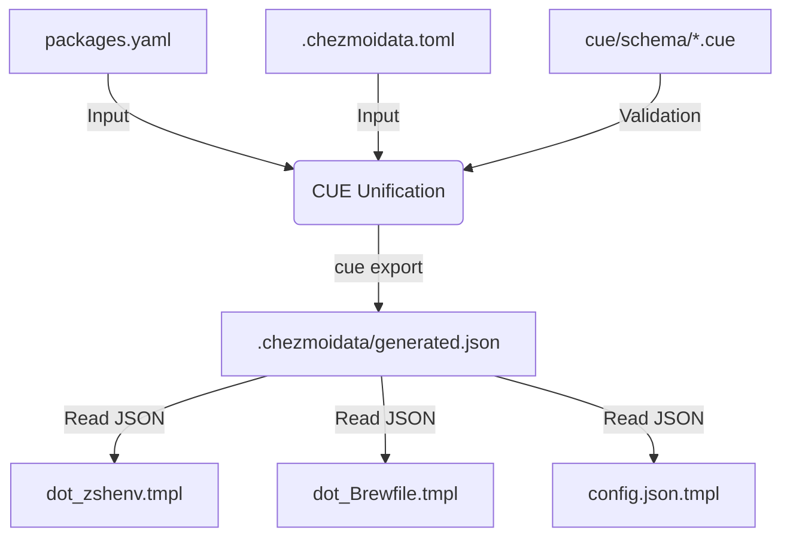

# CUE Data Architecture for Dotfiles

## Overview
This repository uses **CUE (Configure, Unify, Execute)** to provide a strongly typed, validated data layer for the workspace configuration. Instead of relying on fragile logic within Go templates, we define strict schemas for our data and unify it into a single, validated JSON object before `chezmoi` ever touches a template.

## The Data Flow Pipeline



## 1. Configuration Sources (Inputs)
The raw data lives in `.chezmoidata/`:

*   **`packages.yaml`**: The single source of truth for software.
    *   **Registry**: Definitions of tools (managers, IDs, tags).
    *   **Inventory**: Lists of tools enabled for specific profiles (common, work, personal).
*   **`.chezmoidata.toml`**: High-level profile settings and MCP server configurations.

## 2. Schema Definition (Validation)
Located in `cue/schema/`, these files enforce rules:

*   **`packages.cue`**:
    *   Ensures every package in the **Inventory** actually exists in the **Registry** (Referential Integrity).
    *   Validates package managers (must be one of `brew`, `mise`, `mas`, etc.).
    *   **Constraint**: If a package uses the `mas` (Mac App Store) manager, a `mas_id` (integer) is **mandatory**.
    *   **Logic**: Calculates an `effective_manager` based on the OS, so templates don't have to guess.
*   **`mcp.cue`**:
    *   Validates MCP server configs.
    *   **Constraint**: Enabled servers must have either a `command` or a `url`.

## 3. Unification & Logic (`cue/main.cue`)
This is the brain of the operation. It acts as the bridge between raw data and the final environment.

*   **Profile Selection**: Logic that used to live in `.chezmoi.toml.tmpl` (e.g., "If Linux, use `personal_linux`") is now here.
*   **Environment Merging**: It merges `env.common` with profile-specific overrides (e.g., `env.work`) into a single `unified_env` object.
*   **Path Resolution**: Centralises system paths (Homebrew prefix, volumes root), making invalid states (like Homebrew on Linux) **unrepresentable** by simply omitting the fields.

## 4. Automation (The Build Step)
The script `run_before_00-validate-and-export.sh.tmpl` runs automatically at the start of `chezmoi apply`.

1.  It injects current system facts (`os`, `hostname`, `home_dir`) into CUE tags.
2.  It runs `cue export`.
3.  **If validation fails**: The build stops immediately, preventing invalid configs from breaking your system.
4.  **If successful**: It writes a validated `.chezmoidata/generated.json`.

## 5. Consumption (Templates)
Templates no longer contain complex logic. They simply read the generated JSON.

**Example: `dot_zshenv.tmpl`**
```gotmpl
{{- $data := include ".chezmoidata/generated.json" | fromJson -}}
{{- $paths := $data.current_profile.paths -}}

# Safe conditional: Checks if the key exists (it's omitted on Linux)
{{- if hasKey $paths "homebrew_prefix" }}
export HOMEBREW_PREFIX="{{ $paths.homebrew_prefix }}"
{{- end }}
```

## How to Modify

### Adding a Package
1.  Add the definition to `packages.yaml` under `registry`.
2.  Add the key name to the appropriate list under `inventory` (e.g., `common` or `work`).
3.  Run `chezmoi apply`. CUE will check that your keys match.

### Changing Environment Variables
1.  Edit `cue/main.cue`.
2.  Update the `env` struct (either `common` or `work`).
3.  Run `chezmoi apply`.

### Debugging
To see the raw validated data exactly as Chezmoi sees it:
```bash
cat .chezmoidata/generated.json
```
