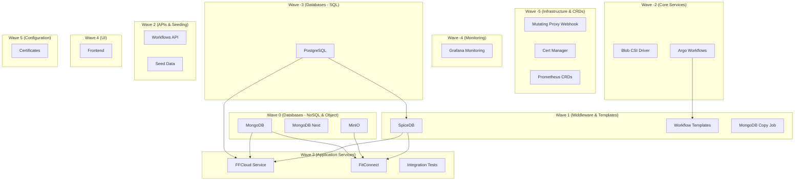

## FITFILE Platform Deployment Process

This document maps out the deployment process for the FITFILE platform on Kubernetes, orchestrated by the `ffnode` umbrella Helm chart using the ArgoCD App-of-Apps pattern.

### Deployment Architecture

The `ffnode` chart defines a set of ArgoCD `Application` resources. ArgoCD deploys these applications in a specific order defined by **Sync Waves**.

#### Deployment Waves Diagram

### Detailed Application Map

The following table lists all applications managed by the `ffnode` chart, their deployment order (Sync Wave), the condition logic (from `values.yaml`), and their source chart.

| Sync Wave | Application | Condition (`.Values.deploy.*`) | Source |
|:--- |:--- |:--- |:--- |
| **-5** | `mutating-proxy-webhook` | `mutatingProxyWebhook` | `charts/mutating-proxy-webhook` |
| **-5** | `cert-manager` | `initialiseCluster` AND `certManager` | `helm/cert-manager` (External) |
| **-5** | `prometheus-operator-crds` | `monitoring` | `helm/prometheus-operator-crds` (External) |
| **-4** | `grafana-k8s-monitoring` | `monitoring` | `helm/k8s-monitoring` (External) |
| **-3** | `postgresql` | `persistence` | `helm/postgresql` (External) |
| **-2** | `blob-csi-driver` | `blobCsiDriver` | `blob-csi-driver` (External) |
| **-2** | `argo-workflows` | `initialiseCluster` | `helm/argo-workflows` (External) |
| **0** | `mongodb` | `persistence` | `helm/mongodb` (External) |
| **0** | `mongodb-next` | `persistence` AND `mongodbNext` | `helm/mongodb` (External) |
| **0** | `minio` | `persistence` | `helm/minio` (External) |
| **1** | `spicedb` | `spicedb` | `charts/spicedb` |
| **1** | `workflow-templates` | _(Always Enabled)_ | `workflows/src` |
| **1** | `mongodb-copy-job` | `mongodbNext` AND `copyJob.enabled` | _(K8s Job)_ |
| **2** | `workflows-api` | `workflowsApi` | `charts/workflows-api` |
| **2** | `seed-data` | `seedData` | `charts/local-dev/seed` |
| **3** | `ffcloud-service` | `coordinatingStation` | `charts/components/ffcloud-service` |
| **3** | `fitconnect` | `fitconnect` | `charts/components/fitconnect` |
| **3** | `integration-tests-templates` | `workflowsIntegrationTests` | `workflows/integration-tests` |
| **4** | `frontend` | `frontend` | `charts/components/frontend` |
| **5** | `certificates` | `certManager` | `charts/certs` |

### Environment Overrides

The specific configuration for each environment is controlled by the `values.yaml` files located in `ffnodes/<environment>/values.yaml`. These files override the default `charts/ffnode/values.yaml` to enable or disable specific components (e.g., disabling `monitoring` or `certManager` in local/dev environments) and set environment-specific parameters like hostnames and secret references.
