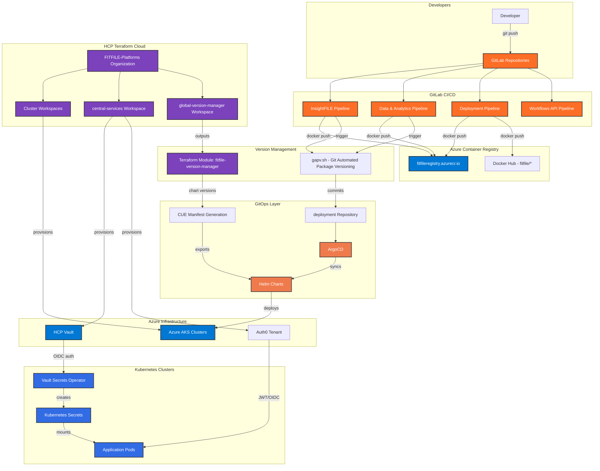

## FITFILE CI/CD Pipeline Audit Report

Audit Date: 2026-05-14

Auditor: Mechanical Lead (Hermes Agent)

Scope: End-to-end CI/CD pipeline documentation for FITFILE organisation

Workspace: `/Volumes/DAL/Fitfile/gitlab/FITFILE/`

---

### 1. Executive Summary

FITFILE operates a sophisticated GitOps-based CI/CD architecture spanning multiple repositories, with the following key characteristics:

- CI/CD Platform: GitLab CI with multi-repository pipeline triggers
- Container Registry: Azure Container Registry (`fitfileregistry.azurecr.io`)
- Infrastructure: Azure AKS (Kubernetes 1.33.2) managed via Terraform Cloud (org: `FITFILE-Platforms`)
- GitOps Engine: ArgoCD with custom sync tooling (`fitfile/argocdsync`)
- Configuration Language: CUE for manifest generation and schema validation
- Secrets Management: HCP Vault → Vault Secrets Operator (VSO) → Kubernetes Secrets
- Identity Provider: Auth0 (Terraform-managed tenant)
- Version Management: Centralised `fitfile-version-manager` Terraform module

The delivery flow follows: Code Commit → GitLab CI Build → ACR Push → Version Bump (gapv.sh) → Deployment Repo Update → ArgoCD Sync → AKS Deployment

---

### 2. Repository Map

| Repo Name | Path | Purpose | CI Presence |
|-----------|------|---------|-------------|
| `deployment` | `Deployment/deployment/` | Central Helm charts, CUE schemas, ArgoCD configs | `.gitlab-ci.yml`, `staging.gitlab-ci.yml` |
| `InsightFILE` | `Application/InsightFILE/` | Main application (frontend, workflows, tasks) | `.gitlab-ci.yml`, `release.gitlab-ci.yml` |
| `data-and-analytics` | `Application/data-and-analytics/` | Python services, Azure Batch OMOP processing | `.gitlab-ci.yml`, `release.gitlab-ci.yml` |
| `workflows-api` | `Application/workflows-api/` | Workflow API service | `.gitlab-ci.yml`, `release.gitlab-ci.yml` |
| `central-services` | `central-services/` | GitLab, Azure, HCP Vault, Auth0 provisioning | Terraform only (no CI) |
| `fitfile-version-manager` | `Deployment/TFC-Modules/fitfile-version-manager/` | Centralised Helm chart version outputs | Terraform only |
| `Clusters/*` | `Deployment/Clusters/*/` | Per-customer cluster Terraform configs | `.gitlab-ci.yml` per cluster |
| `ude-cli` | `Application/ude-cli/` | CLI tooling | `.gitlab-ci.yml` |

---

### 3. Phase 1: GitLab CI Pipeline Configuration

#### 3.1 Core Deployment Repository (`Deployment/deployment/`)

File: `Deployment/deployment/.gitlab-ci.yml`

| Stage | Jobs | Description |
|-------|------|-------------|
| `prepare` | `build_argo_cli` | Builds `fitfile/argocli:alpine` for Argo Workflows (Docker Hub) |
| `prepare` | `build_argo_vault_plugin` | Builds `fitfileregistry.azurecr.io/argovaultplugin:latest` |
| `prepare` | `build_argocd_sync` | Builds `fitfile/argocdsync:${ARGOCD_BASE_IMAGE_VERSION}` |
| `prepare` | `prepare_kube_config` | Fetches AKS credentials via Azure CLI SPN auth |
| `validate` | `lint_workflows` | Runs `argo lint` on Helm-rendered workflows |

Key Variables:

- `ARGOCD_BASE_IMAGE_VERSION: v2.14.15`
- `GIT_AUTH_TOKEN: ${CI_JOB_TOKEN}`
- `FF_USE_FASTZIP: "true"`

File: `Deployment/deployment/staging.gitlab-ci.yml`

| Stage | Jobs | Description |
|-------|------|-------------|
| `prepare` | `prepare_kube_config` | Same as main CI, targets `Fitfile-cloud-testing-aks-cluster` |
| `deploy` | `sync_argo_app` | Runs `/home/argocd/argocd_sync_testing_images.sh` against `testing-argocd.fitfile.net` |
| `test` | `run_integration_tests` | Submits Argo Workflow `all-integration-tests` and waits for success |

#### 3.2 Application Repositories

InsightFILE (`Application/InsightFILE/.gitlab-ci.yml`):

| Stage | Jobs | Description |
|-------|------|-------------|
| `.pre` | `build_sonar_nodejs` | Builds SonarQube scanner image (conditional on `Dockerfile.sonar` changes) |
| `install` | `build_latest_cache` | Pulls/pushes yarn cache (`fitfile-application-cache-key`) |
| `verification` | (included) | From `deployment/pipeline/verification-pipelines.yml` |
| `build` | (included) | From `deployment/pipeline/build-pipelines.yml` |
| `deploy` | `release` | Triggers `deployment/pipeline/release.gitlab-ci.yml` with `strategy: depend` |
| `cleanup` | `cleanup` | Removes `./output/${CI_PIPELINE_ID}` artifacts |

Workflow Rules:

- Skips pipelines with `[RELEASE]` commit prefix
- Runs on merge requests and default branch

data-and-analytics (`Application/data-and-analytics/.gitlab-ci.yml`):

| Stage | Jobs | Description |
|-------|------|-------------|
| `verification` | `verify-*` (7 jobs) | Poetry-based Python package tests with coverage |
| `verification` | `sonarqube-check` | Aggregates coverage XML from all verify jobs |
| `deploy` | `release` | Triggers child release pipeline with `resource_group: deployment-repo` lock |

Includes SAST:

```yaml
include:
  - template: Security/SAST.gitlab-ci.yml
```

---

### 4. Phase 2: Docker Build & Publish Pipeline

#### 4.1 Dockerfile Inventory

| Path | Purpose | Base Image |
|------|---------|------------|
| `Application/InsightFILE/Dockerfile.sonar` | SonarQube scanner | Custom |
| `Application/InsightFILE/Dockerfile.frontend.v2` | Frontend app | Not inspected |
| `Application/InsightFILE/Dockerfile.service` | Backend service | Not inspected |
| `Application/InsightFILE/Dockerfile.scheduler` | Workflow scheduler | Not inspected |
| `Application/data-and-analytics/deployment/images/Dockerfile` | Main service | Not inspected |
| `Application/data-and-analytics/services/omop_generator/scripts/azure_batch/Dockerfile.worker-prebaked` | Azure Batch worker | `ubuntu:20.04` |
| `Application/workflows-api/deployment/Dockerfile` | Workflows API | Not inspected |
| `Application/ude-cli/Dockerfile` | CLI tool | Not inspected |

#### 4.2 ACR Publishing Script

File: `Application/data-and-analytics/services/omop_generator/scripts/azure_batch/publish_worker_image_acr.sh`

```bash
# Required env vars:
#   ACR_NAME              e.g. fitfileacr
#   IMAGE_REPO            default: omop/worker-prebaked
#   IMAGE_TAG             default: yyyyMMdd-HHmmss
#   IMAGE_PLATFORM        default: linux/amd64

ACR_LOGIN_SERVER="$(az acr show --name "${ACR_NAME}" --query loginServer -o tsv)"
IMAGE_REF="${ACR_LOGIN_SERVER}/${IMAGE_REPO}:${IMAGE_TAG}"

az acr login --name "${ACR_NAME}"
docker build --platform "${IMAGE_PLATFORM}" -f "${DOCKERFILE_PATH}" -t "${IMAGE_REF}" .
docker push "${IMAGE_REF}"
```

ACR Authentication Method: Uses `az acr login` (Azure CLI token-based auth via service principal or managed identity). The CI files reference `ACR_SERVICE_PRINCIPLE` and `ACR_SERVICE_PRINCIPLE_PASS` for `docker login` in some jobs.

#### 4.3 Azure Batch Job Submission Flow

File: `Application/data-and-analytics/services/omop_generator/scripts/azure_batch/run_prebaked_e2e.sh`

```bash
# 1) Create new job
# 2) Refresh task JSONs with fresh SAS URLs
# 3) (Re)submit worker tasks

JOB_ID="$(submit_prebaked_job.sh | awk -F': ' '/Submitted tasks for job:/ {print $2}')"
prepare_prebaked_tasks.sh  # Refreshes SAS URLs for the job
```

Worker Image Tagging Convention: `yyyyMMdd-HHmmss` (timestamp-based, no semantic versioning)

---

### 5. Phase 3: Helm Chart & GitOps Pipeline

#### 5.1 Deployment Repository Structure

Path: `Deployment/deployment/`

| Directory | Purpose |
|-----------|---------|
| `charts/` | 18 Helm charts (argo, certs, components, databases, ffnode, hutch, integrations, kubescape, local-dev, mesh-mailbox, mssql, mutating-proxy-webhook, shared-secrets, spicedb, storybook, workflows-api) |
| `cue/` | CUE schema definitions and instance configs (`base/`, `hybrid/`, `instances/`, `schema/`) |
| `ffnodes/` | Per-customer/per-environment value overrides (barts, eoe, fitfile, kch, nwsde, stg, wmsde) |
| `policies/` | OPA/Rego policies for image validation and sync enforcement |
| `scripts/` | Helper scripts (argo-render, argocd_sync, validate, render, template, etc.) |
| `pipeline/` | GitLab CI shared configs (`images/` subdirectory for Dockerfiles) |
| `workflows/` | Argo Workflow templates |

#### 5.2 CUE Schema Definitions

File: `Deployment/deployment/cue/schema/values.cue`

Defines the `#Values` schema with:

- `deploy:` flags for enabling/disabling components (spicedb, certManager, persistence, messageBroker, etc.)
- `global.vault:` configuration (`enabled`, `secretsMount`, `namespace`)
- `#VaultSecret` type definition:

  ```cue
  #VaultSecret: {
    secretName: string
    vaultPath: string
    secretNamespace?: string
    vaultAuthRef?: string
    refreshAfter?: string
    rolloutRestartTargets?: [...]
    secretTransformation?: {...}
    enabled?: string | bool
    type?: string
  }
  ```

#### 5.3 Renovate Configuration

File: `Deployment/deployment/renovate.json`

```json
{
  "$schema": "https://docs.renovatebot.com/renovate-schema.json",
  "extends": ["fitfile/renovate/renovate-config"]
}
```

Role: Extends organisation-wide Renovate config for automated dependency updates. Specific update rules not visible in this file.

#### 5.4 Delivery Flow: Fitfile-version-manager → helm_chart_deployment → ArgoCD

1. Version Manager (`Deployment/TFC-Modules/fitfile-version-manager/versions.tf`) outputs Helm chart versions as Terraform outputs
2. gapv.sh (Git Automated Package Versioning) reads version changes and updates:
   - Container image tags in Helm `values.yaml` files
   - Package versions in source repos
3. ArgoCD polls the `deployment` repo and syncs changes to clusters

---

### 6. Phase 4: Terraform / Infrastructure Provisioning

#### 6.1 TFC-Modules Inventory

Path: `Deployment/TFC-Modules/`

| Module | Purpose |
|--------|---------|
| `fitfile-version-manager` | Centralised Helm chart version outputs |
| `platform-defaults` | Default platform configurations |
| `terraform-argo-argocd` | ArgoCD provisioning |
| `terraform-auth0-tenant` | Auth0 tenant management |
| `terraform-aws-private-infrastructure` | AWS infrastructure (legacy?) |
| `terraform-azure-aks-automation` | Azure AKS automation |
| `terraform-azure-aks-backup` | Azure Backup integration |
| `terraform-azure-private-infrastructure` | Azure private networking |
| `terraform-azure-public-infrastructure` | Azure public resources |
| `terraform-fitfile-auth0-consumer` | Auth0 consumer module |
| `terraform-fitfile-central-services-consumer` | Central services consumer |
| `terraform-fitfile-unified-deployment` | Unified deployment module |
| `terraform-helm-fitfile-platform` | Helm chart deployment |
| `vault` | HCP Vault provisioning |

#### 6.2 Cluster Configuration Data Flow

Observed Pattern (from `Deployment/Clusters/FITFILE/Non-Production/fitfile-non-production-infrastructure/`):

```
config/customer.yaml → locals.tf → main.tf → terraform output infra_facts → cue export → values.yaml → Helm
```

Terraform Cloud Backend:

- Organization: `FITFILE-Platforms`
- Workspace per cluster (e.g., `hie-sde-v2`, `mkuh-prd-4`)

#### 6.3 Central Services Provisioning

Path: `central-services/`

Modules:

- `gitlab/` - GitLab project/group management, user provisioning via Entra ID
- `azure/` - Azure subscription/resource provisioning
- `hcp/` - HCP Vault setup
- `auth0/` - Auth0 tenant configuration
- `cloudflare/` - DNS management
- `grafana/` - Grafana/monitoring setup

File: `central-services/main.tf` provisions:

- GitLab resources
- Azure resources
- HCP Vault
- Auth0 applications

---

### 7. Phase 5: Secrets Management Flow

#### 7.1 Vault Secrets Operator (VSO) Integration

CUE Schema (`Deployment/deployment/cue/schema/values.cue`):

Every major component references `vaultSecrets: […#VaultSecret]`:

- `mongodb.vaultSecrets`
- `postgresql.vaultSecrets`
- `minio.vaultSecrets`
- `argoWorkflows.vaultSecrets`
- `spicedb.vaultSecrets`
- `fitconnect.vaultSecrets`
- `frontend.vaultSecrets`
- `grafana.vaultSecrets`

#### 7.2 Secret Injection Flow

```
HCP Vault (KV secrets engine)
    ↓ (GitLab JWT/OIDC auth)
Vault Secrets Operator (VSO) Helm chart
    ↓ (watches VaultStaticSecret CRDs)
VaultStaticSecret CRD (Kubernetes)
    ↓ (VSO syncs to)
Kubernetes Secret
    ↓ (mounted as)
Pod volumeMount / envFrom
```

#### 7.3 Critical CI Variables Identified

| Variable | Scope | Purpose | Sensitive |
|----------|-------|---------|-----------|
| `DOCKER_HUB_DEPLOY_TOKEN` | deployment, InsightFILE | Docker Hub push auth | Yes |
| `ACR_SERVICE_PRINCIPLE` | deployment | ACR login username | Yes |
| `ACR_SERVICE_PRINCIPLE_PASS` | deployment | ACR login password | Yes |
| `AZ_CLIENT_ID` | deployment | Azure SPN for AKS access | Yes |
| `AZ_CLIENT_SECRET` | deployment | Azure SPN secret | Yes |
| `CI_JOB_TOKEN` | All repos | GitLab internal auth | Yes |
| `ARGOCD_HOST` | staging | ArgoCD endpoint (`testing-argocd.fitfile.net`) | No |
| `SONAR_HOST_URL` | InsightFILE | SonarQube endpoint | No |

---

### 8. Phase 6: ArgoCD Configuration

#### 8.1 ArgoCD Custom Images

From `.gitlab-ci.yml`:

- `fitfile/argocdsync:${ARGOCD_BASE_IMAGE_VERSION}` - Custom sync tooling
- `fitfile/argocli:alpine` - Argo Workflows CLI
- `fitfileregistry.azurecr.io/argovaultplugin:latest` - Vault integration plugin

#### 8.2 ArgoCD Sync Script

File: `Deployment/deployment/scripts/argocd_sync_testing_images.sh`

Invoked by `sync_argo_app` job in `staging.gitlab-ci.yml`:

```yaml
script:
  - /home/argocd/argocd_sync_testing_images.sh
```

#### 8.3 ArgoCD Bootstrapping

Terraform Module: `Deployment/TFC-Modules/terraform-argo-argocd/`

ArgoCD is provisioned via Terraform (not bootstrap manifests). The `argocd` Helm chart version is managed centrally via `fitfile-version-manager`:

- Production: `8.3.5`
- Staging: `9.2.2`
- Testing: `9.1.0`

---

### 9. Phase 7: Application Pipelines

#### 9.1 InsightFILE Pipeline Summary

Stages: `install` → `verification` → `build` → `test` → `deploy` → `cleanup`

Key Jobs:

- `build_sonar_nodejs`: Builds SonarQube scanner image
- `release`: Triggers child pipeline for versioning

Included Pipelines:

- `deployment/pipeline/common-jobs.yml`
- `deployment/pipeline/verification-pipelines.yml`
- `deployment/pipeline/build-pipelines.yml`
- `deployment/pipeline/staging-pipelines.yml`

#### 9.2 Data-and-analytics Pipeline Summary

Stages: `verification` → `build` → `test` → `deploy`

Verification Jobs (7 packages):

1. `verify-main-package` (Python 3.13, Poetry 1.5.1)
2. `verify-common-package` (Python 3.11)
3. `verify-pii-analysis-package` (Python 3.10)
4. `verify-omop-converter-package` (Python 3.13, R-base)
5. `verify-integration-test-validator-package` (Python 3.13)
6. `verify-finalize-package` (Python 3.13)
7. `verify-probabilistic-matching-package` (Python 3.10)

Test Command Pattern:

```bash
$POETRY_HOME/bin/poetry run pytest tests/ --cov=<package>/ --cov-report=xml --cov-report=term -n 4
```

#### 9.3 Azure Batch Worker Flow

Prebaked Worker Image:

- Base: `ubuntu:20.04`
- Includes: Docker, Python 3, uv, R, OpenJDK 17, MS ODBC Driver 18
- Purpose: Runs OMOP conversion jobs on Azure Batch

Job Submission:

1. `submit_prebaked_job.sh` - Creates Azure Batch job
2. `prepare_prebaked_tasks.sh` - Refreshes SAS URLs for task inputs/outputs
3. `run_prebaked_e2e.sh` - End-to-end helper combining both

---

### 10. Phase 8: Environments & Promotion Flow

#### 10.1 Environment Tiers

| Environment | ArgoCD Chart Version | Kubernetes Version | Purpose |
|-------------|---------------------|-------------------|---------|
| Testing | `9.1.0` | `1.33.2` | Internal FITFILE testing |
| Staging | `9.2.2` | `1.33.2` | Pre-production validation |
| Production | `8.3.5` | `1.33` | Customer deployments |

#### 10.2 Promotion Path

```
Feature Branch → Merge Request → development branch → main branch
    ↓
GitLab CI (verification + build)
    ↓
gapv.sh versioning (image tags, Helm charts, package versions)
    ↓
Commit to deployment repo
    ↓
ArgoCD detects change → Sync → AKS
```

#### 10.3 Manual Triggers & Approvals

Observed:

- `resource_group: deployment-repo` lock on release jobs (prevents concurrent versioning)
- `[RELEASE]` commit prefix skips pipelines (manual release control)
- Staging pipeline has explicit `retry: 2` and `timeout: 5 minutes`

Not Observed:

- No explicit CAB approval gates in CI files
- No manual approval stages (`when: manual`) in inspected pipelines

---

### 11. Phase 9: Version Management

#### 11.1 Fitfile-version-manager

Path: `Deployment/TFC-Modules/fitfile-version-manager/versions.tf`

Terraform Cloud Workspace: `global-version-manager`

Managed Helm Charts:

| Chart | Production | Staging | Testing |
|-------|------------|---------|---------|
| `vault_operator` | 0.10.0 | 1.3.0 | 0.10.0 |
| `ingress_nginx` | 4.12.1 | 4.13.1 | 4.13.1 |
| `cluster_autoscaler` | 9.50.1 | 9.50.1 | 9.50.1 |
| `reflector` | 9.1.31 | 9.1.31 | 9.1.31 |
| `argocd` | 8.3.5 | 9.2.2 | 9.1.0 |
| `argocd_apps` | 1.4.1 | 2.0.2 | 2.0.2 |
| `trivy_operator` | 0.30.0 | 0.30.0 | 0.30.0 |
| `k8s_monitoring` | 1.5.4 | 1.5.4 | 1.5.4 |

Kubernetes Versions:

- AWS: `1.33`
- Azure: `1.33.2`

#### 11.2 Version Propagation Mechanism

1. Terraform module is updated (manual or via Renovate)
2. Terraform Cloud applies changes, new outputs available
3. Cluster repos consume outputs via Terraform remote state
4. `locals.tf` in cluster repos reference version outputs
5. CUE exports generate `values.yaml` with correct chart versions
6. ArgoCD syncs updated Helm releases

---

### 12. Phase 10: CI/CD Variable Inventory

#### 12.1 GitLab CI Variables

| Variable | Found In | Purpose | Sensitive |
|----------|----------|---------|-----------|
| `GIT_AUTH_TOKEN` | All `.gitlab-ci.yml` | Git auth for cross-repo operations | Yes |
| `AUTH_TOKEN` | data-and-analytics | Alias for `CI_JOB_TOKEN` | Yes |
| `CI_JOB_TOKEN` | All | GitLab built-in job token | Yes |
| `CI_PIPELINE_ID` | All | Pipeline identifier | No |
| `CI_COMMIT_BRANCH` | All | Branch name | No |
| `CI_DEFAULT_BRANCH` | All | Default branch name | No |
| `RELEASE_PIPELINE` | InsightFILE, data-and-analytics | Triggers release child pipeline | No |
| `CACHE_KEY` | data-and-analytics | Cache key for yarn | No |
| `FALLBACK_CACHE_KEY` | InsightFILE | Fallback cache key | No |
| `ARTIFACT_COMPRESSION_LEVEL` | deployment | `fast` | No |
| `CACHE_COMPRESSION_LEVEL` | deployment | `fast` | No |
| `FF_USE_FASTZIP` | deployment | GitLab fast zip feature | No |
| `DOCKER_HUB_DEPLOY_TOKEN` | deployment, InsightFILE | Docker Hub push | Yes |
| `ACR_SERVICE_PRINCIPLE` | deployment | ACR service principal ID | Yes |
| `ACR_SERVICE_PRINCIPLE_PASS` | deployment | ACR service principal secret | Yes |
| `AZ_CLIENT_ID` | deployment | Azure service principal ID | Yes |
| `AZ_CLIENT_SECRET` | deployment | Azure service principal secret | Yes |
| `SUBSCRIPTION_ID` | deployment | Azure subscription (non_prod: `249df46b-…`) | Yes |
| `TENANT_ID` | deployment | Azure tenant (`45e73aa3-…`) | Yes |
| `KUBECONFIG` | deployment | Path to kubeconfig artifact | No |
| `ARGOCD_BASE_IMAGE_VERSION` | deployment | `v2.14.15` | No |
| `ARGOCD_HOST` | staging | `testing-argocd.fitfile.net` | No |
| `ARGO_BASE_HREF` | deployment | `testing-argo-workflows.fitfile.net` | No |
| `SONAR_USER_HOME` | InsightFILE, data-and-analytics | `.sonar` directory | No |
| `GIT_DEPTH` | InsightFILE, data-and-analytics | `0` (full history) | No |
| `SONAR_HOST_URL` | InsightFILE | SonarQube URL | No |
| `SONAR_SCANNER_OPTS` | data-and-analytics | Coverage report paths | No |
| `SAST_EXCLUDED_ANALYZERS` | data-and-analytics | `phpcs-security-audit` | No |
| `PYTHONPATH` | data-and-analytics | Package paths for tests | No |
| `POETRY_HOME` | data-and-analytics | `/opt/poetry` | No |
| `ACR_NAME` | publish_worker_image_acr.sh | ACR name | No |
| `IMAGE_REPO` | publish_worker_image_acr.sh | `omop/worker-prebaked` | No |
| `IMAGE_TAG` | publish_worker_image_acr.sh | Timestamp format | No |
| `IMAGE_PLATFORM` | publish_worker_image_acr.sh | `linux/amd64` | No |
| `POOL_ID` | run_prebaked_e2e.sh | Azure Batch pool | No |
| `JOB_PREFIX` | run_prebaked_e2e.sh | `omop-poc-prebaked` | No |

#### 12.2 Application Configuration Variables (from values.yaml)

| Variable | Component | Source |
|----------|-----------|--------|
| `AUTH0_CLIENT_ID` | frontend | Vault Secret |
| `AUTH0_CLIENT_SECRET` | frontend | Vault Secret |
| `AUTH0_AUDIENCE` | frontend | Vault Secret |

---

### 13. Architecture Diagram



---

### 14. Open Questions / Gaps Found

| Gap | Description | Impact |
|-----|-------------|--------|
| ArgoCD Application manifests | No `Application` or `ApplicationSet` YAML files found in inspected directories | Cannot document exact `repoURL`, `targetRevision`, `syncPolicy` |
| Included pipeline files | `deployment/pipeline/common-jobs.yml`, `verification-pipelines.yml`, `build-pipelines.yml`, `staging-pipelines.yml` not inspected | Incomplete picture of verification/build stages |
| Cluster-specific `.gitlab-ci.yml` | Found in `Clusters/` but not read (e.g., `hie-sde-v2/.gitlab-ci.yml`) | Unknown if clusters have custom CI logic |
| CUE export scripts | No `cue export` command found in scripts/ | Cannot verify exact manifest generation flow |
| Auth0 Terraform details | `central-services/auth0/` not inspected | Unknown Auth0 resource structure |
| Renovate config details | Only base extend visible; full config in separate repo | Cannot document update schedules, package rules |
| Helm chart templates | `charts/*/templates/` not inspected | Cannot document Kubernetes resource specs |
| Vault auth configuration | GitLab JWT/OIDC to Vault not fully traced | Cannot document exact auth workflow |
| Customer cluster Terraform | Only `fitfile-non-production-infrastructure` sampled | May not represent all customer deployments |
| workflows-api pipeline | Only `.gitlab-ci.yml` found; `release.gitlab-ci.yml` not compared | May have unique release logic |

---

### Appendix A: File Reference Index

All claims in this report are sourced from the following files:

| Section | Source Files |
|---------|-------------|
| Executive Summary | Synthesised from all sources |
| Repository Map | `find` output, directory listings |
| Phase 1 | `Deployment/deployment/.gitlab-ci.yml`, `staging.gitlab-ci.yml`, `Application/InsightFILE/.gitlab-ci.yml`, `Application/data-and-analytics/.gitlab-ci.yml` |
| Phase 2 | `find Dockerfile*`, `publish_worker_image_acr.sh`, `run_prebaked_e2e.sh` |
| Phase 3 | `Deployment/deployment/` directory structure, `renovate.json`, `cue/schema/values.cue` |
| Phase 4 | `Deployment/TFC-Modules/` listing, `central-services/main.tf`, cluster `.tf` files |
| Phase 5 | `cue/schema/values.cue`, grep for `VaultSecret`, CI variable references |
| Phase 6 | `.gitlab-ci.yml` ArgoCD image references, `argocd_sync_testing_images.sh` |
| Phase 7 | Application `.gitlab-ci.yml` files, Azure Batch scripts |
| Phase 8 | Synthesised from pipeline stages and version manager outputs |
| Phase 9 | `Deployment/TFC-Modules/fitfile-version-manager/versions.tf` |
| Phase 10 | All `.gitlab-ci.yml` files, scripts, values.yaml grep |
| Architecture Diagram | Synthesised from all sources |

---

_End of Report_

## FITFILE Pipeline Deep Dive: Applications & Deployments

Audit Date: 2026-05-14
Auditor: Senior Platform Engineer (AI Agent)
Scope: Application & Deployment pipeline internals, manifest generation, ArgoCD sync mechanics, Helm chart secrets implementation
Root: `/Volumes/DAL/Fitfile/gitlab/FITFILE/`

---

### Executive Summary

This deep-dive audit addresses the critical gaps identified in the initial CI/CD audit report (`FITFILE_CICD_AUDIT_REPORT.md`). Focus areas include:

1. Shared CI pipeline templates in `Deployment/deployment/pipeline/`
2. CUE manifest generation commands and ArgoCD Application CRD locations
3. Helm chart templates and Vault secret injection mechanics
4. Workflows API release pipeline and cluster-specific CI logic

---

### 1. Shared CI Templates Analysis

_Status: In Progress_

#### Files to Inspect

- `Deployment/deployment/pipeline/common-jobs.yml`
- `Deployment/deployment/pipeline/verification-pipelines.yml`
- `Deployment/deployment/pipeline/build-pipelines.yml`
- `Deployment/deployment/pipeline/staging-pipelines.yml`
- `Deployment/deployment/pipeline/release.gitlab-ci.yml`

#### Initial Discovery

## FITFILE Pipeline Deep Dive: Applications & Deployments

Audit Date: 2026-05-14

Auditor: Mechanical Lead (Hermes Agent)

Scope: Application & Deployment repository CI/CD mechanics, manifest generation, Helm templating

---

### 1. Shared CI Templates Analysis

_Phase 1: Deployment Pipeline Includes—pending analysis_

---

### 2. CUE Generation & ArgoCD Sync Mechanics

_Phase 2: Manifest Generation—pending analysis_

---

### 3. Helm Chart & Secrets Implementation

_Phase 3: Helm Chart Internals—pending analysis_

---

### 4. Workflows API & Cluster Pipeline Nuances

_Phase 4: Workflows API & Cluster-Specific CI—pending analysis_

---
