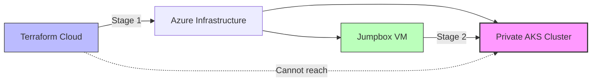
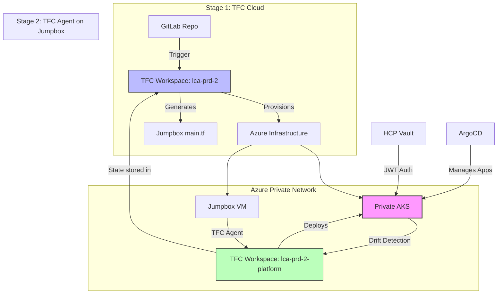

---
tags:
  - infrastructure
  - terraform
  - lca-dp
  - assessment
  - devops
project: LCA-DP
date: 2026-01-23
status: active
---

# Infrastructure as Code Assessment: LCA-DP Production Cluster

## Executive Summary

The LCA-DP production cluster implements a **two-stage deployment pattern** necessitated by the private AKS architecture. The Terraform code is well-structured and modular, with appropriate separation between TFC-managed infrastructure and jumpbox-deployed in-cluster resources.

**Current IaC Coverage:** ~75% managed, 25% requires process standardization

**Key Finding:** The two-stage pattern is architecturally correct, but GitOps principles can be strengthened through improved automation and state management.

---

## Architecture Constraints

### Why Two-Stage Deployment?



**Constraint:** Private AKS cluster has no public API endpoint
**Solution:** Jumpbox VM within the VNet acts as deployment bastion
**Implication:** In-cluster resources MUST be deployed from the jumpbox

---

## 1. Current State Summary

### Stage 1: TFC-Managed Resources ✅

**Infrastructure** (private-infrastructure module v1.3.31)
- AKS cluster with OIDC workload identity enabled
- VNet, subnets (system, workflows, app, jumpbox, bastion)
- NAT Gateway and NSGs  
- Bastion Host + Linux jumpbox VM

**Central Services** (central-services-consumer module v0.0.9)
- Auth0 application + service accounts
- GitLab project: `lca-infra-prd`
- TFC workspace: `lca-infra-prd` (imported)
- Vault namespace: `deployments/lca-prd-2`
- Vault KV secrets for Auth0, application config, VM admin password

**Vault JWT Authentication** (`vault_k8s_auth.tf`)
- JWT auth backend at `jwt-lca-prd-2`  
- Role binding for VSO service accounts
- Policies: `acr-reader`, `argocd-secrets-lca-prd-2`

**Configuration Generation** (`jumpbox_generator.tf`, `values_generator.tf`)
- Automated generation of `main.tf` for jumpbox deployment
- CUE-consumable values export

---

### Stage 2: Jumpbox-Deployed Resources

**Deployed via generated `main.tf`:**
- ArgoCD (Helm release + "App of Apps")
- Vault Secrets Operator (VSO)
- Ingress NGINX controller
- Reflector
- VaultAuth CRDs in multiple namespaces
- VaultDynamicSecret/VaultStaticSecret CRDs
- Image pull secrets (replicated via Reflector)

**Current Process:**
```bash
# On local machine
terraform output -raw jumpbox_main_content > /tmp/jumpbox_main.tf
scp /tmp/jumpbox_main.tf user@jumpbox:~/terraform/main.tf

# On jumpbox
cd ~/terraform
terraform init
terraform apply
```

---

## 2. Gap Analysis

### Critical Gaps (Not Technical Drift)

These are **process gaps**, not architectural flaws:

| **Gap** | **Impact** | **Severity** |
|---------|-----------|-------------|
| No jumpbox state versioning | Can't rollback jumpbox deployments | **High** |
| Manual file transfer to jumpbox | Human error, no audit trail | **High** |
| No validation that jumpbox TF matches generated output | Jumpbox state could desync | **Medium** |
| AppRole artifacts in Vault | Confusing legacy auth method | **Low** |
| No drift detection for Stage 2 | In-cluster changes untracked | **Medium** |

---

### Architecture Patterns Analysis

#### ✅ Vault Integration (Excellent)
- **Primary Method:** JWT/OIDC authentication (modern, recommended)
- **Policies:** Correctly scoped to deployment key (`lca-prd-2`)
- **VSO:** Deployed via platform module, configured with `VaultConnection` to HCP Vault
- **Legacy Note:** AppRole backend exists in `central_services` for backward compatibility

#### ✅ Reflector Pattern (Well Implemented)
- **Implementation:** Template includes proper annotations
- **Usage:** ACR image pull secrets replicated across 7 namespaces
- **Annotations:**
  ```yaml
  reflector.v1.k8s.emberstack.com/reflection-allowed: "true"
  reflector.v1.k8s.emberstack.com/reflection-allowed-namespaces: "argo,argocd,..."
  reflector.v1.k8s.emberstack.com/reflection-auto-enabled: "true"
  ```

#### ✅ ArgoCD Bootstrap (App of Apps Pattern)
- **Deployment:** Helm release in jumpbox template  
- **Multi-source application:**
  - Source 1: Helm chart from `helm_chart_deployment` repo
  - Source 2: Values from `lca-infrastructure-prd` repo (`generated/values.yaml`)
- **Root app:** `ff-lca-prd-2` → deploys child applications

---

## 3. Code Quality Assessment

### ✅ Strengths

1. **Modular Design**
   - Clean separation: infrastructure → central services → platform
   - Remote state for version management (`global-version-manager`)

2. **Configuration as Code**
   - `config/customer.yaml` drives deployment parameters
   - CUE-based values generation for consistency

3. **Naming Conventions**
   - Follows Azure CAF: `rg-lca-uks-prd-net`, `aks-lca-uks-prd-01`
   - Deployment key pattern: `{customer}-{env_prefix}-{instance_id}`

4. **Security Practices**
   - VM admin password auto-generated via `random_password`
   - No hardcoded ACR credentials (dynamic via Vault)
   - Sensitive outputs properly marked

5. **Documentation**
   - Jumpbox deployment guide (`JUMPBOX_DEPLOYMENT.md`)
   - ArgoCD verification script for diagnostics

---

### ⚠️ Areas for Improvement

| **Issue** | **Severity** | **Recommendation** |
|-----------|-------------|-------------------|
| Hardcoded repo URLs in template | Medium | Move to `config/customer.yaml` |
| No provider version upper bounds | Low | Pin: `version = "~> 4.53"` |
| Missing comprehensive README | Low | Add architecture diagram, deployment workflow |
| Template complexity (320 lines) | Medium | Consider breaking into sub-modules |
| No pre-commit hooks | Low | Add `terraform fmt`, `tflint` |
| Manual jumpbox deployment | **High** | Automate via CI/CD + remote exec |

**Hardcoded values example:**
```hcl
lca_repo_url   = "https://gitlab.com/fitfile/customers/nwsde/lca-infrastructure-prd.git"
chart_repo_url = "https://gitlab.com/fitfile/deployment/helm_chart_deployment.git"
```

---

## 4. Remediation Plan (Revised for Private Cluster)

### Phase 1: Automate Jumpbox Deployment (Week 1-2)

**Goal:** Eliminate manual file transfer and apply

#### Option A: Remote Exec Provisioner

```hcl
# In main.tf, after jumpbox creation
resource "null_resource" "deploy_platform" {
  depends_on = [
    module.private-infrastructure,
    local_file.jumpbox_main
  ]
  
  connection {
    type         = "ssh"
    host         = module.private-infrastructure.jumpbox_private_ip
    user         = "azureuser"
    private_key  = file(var.jumpbox_ssh_key_path)
    bastion_host = module.private-infrastructure.bastion_public_ip
  }
  
  provisioner "file" {
    content     = local.jumpbox_main_content
    destination = "/home/azureuser/terraform/main.tf"
  }
  
  provisioner "remote-exec" {
    inline = [
      "cd /home/azureuser/terraform",
      "terraform init",
      "terraform apply -auto-approve"
    ]
  }
  
  triggers = {
    jumpbox_config_hash = sha256(local.jumpbox_main_content)
  }
}
```

**Pros:**
- Fully automated
- Triggers on config changes
- Single `terraform apply` workflow

**Cons:**
- TFC doesn't support SSH bastion jumps natively
- Would need TFC agent on jumpbox or VPN

---

#### Option B: GitLab CI/CD Pipeline (Recommended)

```yaml
# .gitlab-ci.yml
stages:
  - validate
  - plan-stage1
  - apply-stage1
  - deploy-stage2

terraform:validate:
  stage: validate
  script:
    - terraform init -backend=false
    - terraform fmt -check
    - terraform validate

terraform:plan:stage1:
  stage: plan-stage1
  script:
    - terraform init
    - terraform plan -out=tfplan
  artifacts:
    paths:
      - tfplan

# Runs in TFC via API
terraform:apply:stage1:
  stage: apply-stage1
  script:
    - curl --request POST \
        --header "Authorization: Bearer $TFC_TOKEN" \
        --header "Content-Type: application/vnd.api+json" \
        https://app.terraform.io/api/v2/runs
  when: manual

# SSH to jumpbox and apply
deploy:stage2:
  stage: deploy-stage2
  script:
    - terraform output -raw jumpbox_main_content > /tmp/main.tf
    - scp -o ProxyJump=bastion@${BASTION_IP} /tmp/main.tf azureuser@${JUMPBOX_IP}:~/terraform/
    - ssh -J bastion@${BASTION_IP} azureuser@${JUMPBOX_IP} << 'EOF'
        cd ~/terraform
        terraform init
        terraform apply -auto-approve
      EOF
  dependencies:
    - terraform:apply:stage1
  when: manual
```

**Pros:**
- Fits existing GitLab workflow
- Audit trail in CI/CD logs
- Can add approval gates
- Works with private cluster

**Cons:**
- Still requires SSH access from runner
- Need to manage SSH keys securely

---

#### Option C: TFC Agent on Jumpbox (Best Long-term)

**Architecture:**
```
TFC Cloud → VPN/Bastion → TFC Agent (on Jumpbox) → AKS API
```

**Setup:**
1. Install TFC agent on jumpbox:
```bash
# On jumpbox
curl -o tfc-agent.zip https://releases.hashicorp.com/tfc-agent/1.x/tfc-agent_linux_amd64.zip
unzip tfc-agent.zip
./tfc-agent -token=$TFC_AGENT_TOKEN
```

2. Create separate TFC workspace for Stage 2:
```hcl
# In TFC UI or API
workspace "lca-prd-2-platform" {
  execution_mode = "agent"
  agent_pool_id  = var.jumpbox_agent_pool_id
}
```

3. Configure workspace to use agent pool

**Pros:**
- Native TFC workflow for both stages
- Full state management in TFC
- Drift detection capabilities
- Secure, no SSH key management

**Cons:**
- Requires persistent agent process on jumpbox
- Additional cost for TFC agents (if not on Business tier)

---

### Phase 2: State Management for Stage 2 (Week 3)

**Goal:** Track jumpbox deployment state in version control

#### Current Problem:
Jumpbox Terraform state is local to the VM - if VM is rebuilt, state is lost.

#### Solution: Remote Backend for Jumpbox TF

```hcl
# In generated jumpbox main.tf template
terraform {
  backend "remote" {
    organization = "FITFILE-Platforms"
    workspaces {
      name = "lca-prd-2-platform"  # Separate workspace for Stage 2
    }
  }
}
```

**Benefits:**
- State persists across jumpbox rebuilds
- Team can view/manage state via TFC UI
- State locking prevents concurrent changes
- Enables drift detection

---

### Phase 3: Clean Up Vault Configuration (Week 4)

**Goal:** Remove AppRole artifacts, ensure JWT is sole auth method

#### Step 3.1: Audit Current Vault State
```bash
vault auth list
vault read auth/jwt-lca-prd-2/role/lca-prd-2
vault list auth/approle/role
```

#### Step 3.2: Conditional AppRole Removal

```hcl
# In vault_k8s_auth.tf
variable "enable_approle_legacy" {
  description = "Keep AppRole enabled for backward compatibility"
  type        = bool
  default     = false
}

resource "vault_auth_backend" "approle" {
  count = var.enable_approle_legacy ? 1 : 0
  type  = "approle"
  path  = "approle-${local.deployment_key}"
}
```

#### Step 3.3: Add Missing Vault Secrets to TF

Currently referenced but not managed:
- Cloudflare API token (`secrets/cloudflare`)
- Grafana admin credentials (`secrets/monitoring`)

```hcl
# vault_secrets.tf
resource "random_password" "grafana_admin" {
  length  = 32
  special = true
}

resource "vault_kv_secret_v2" "grafana_admin" {
  mount = module.central_services.vault_kv_mount
  name  = "monitoring"
  
  data_json = jsonencode({
    admin_password = random_password.grafana_admin.result
  })
}

resource "vault_kv_secret_v2" "cloudflare_token" {
  mount = module.central_services.vault_kv_mount
  name  = "cloudflare"
  
  data_json = jsonencode({
    api_token = var.cloudflare_api_token  # From TFC sensitive variable
  })
}
```

---

### Phase 4: Drift Detection & Monitoring (Week 5)

**Goal:** Detect manual changes to in-cluster resources

#### Option 1: Scheduled TFC Runs (with Agent)

```hcl
# In TFC workspace settings
resource "tfe_workspace" "platform" {
  name         = "lca-prd-2-platform"
  organization = "FITFILE-Platforms"
  
  auto_apply = false
  
  # Run daily drift check
  assessments_enabled = true
  
  vcs_repo {
    identifier = "fitfile/customers/nwsde/lca-infrastructure-prd"
    branch     = "main"
  }
}
```

#### Option 2: ArgoCD Drift Detection

Since ArgoCD manages applications, leverage its native drift detection:

```yaml
# In ArgoCD Application spec
apiVersion: argoproj.io/v1alpha1
kind: Application
metadata:
  name: ff-lca-prd-2
spec:
  syncPolicy:
    automated:
      prune: false      # Don't auto-delete
      selfHeal: false   # Don't auto-revert (detect only)
    syncOptions:
      - CreateNamespace=true
  # Drift alert via webhook
  notifications:
    - trigger: on-sync-status-unknown
      destinations:
        - slack:fitfile-alerts
```

---

## 5. Recommended Architecture (Final State)



### Key Improvements:
1. **TFC Agent on jumpbox** - enables native TFC workflow for Stage 2
2. **Separate TFC workspace** - `lca-prd-2-platform` for in-cluster resources
3. **Shared state backend** - both workspaces in TFC
4. **Automated trigger** - Stage 1 completion triggers Stage 2
5. **Drift detection** - scheduled runs + ArgoCD sync status

---

## 6. Priority Matrix

| **Task** | **Priority** | **Effort** | **Impact** |
|----------|------------|----------|----------|
| Add TFC agent to jumpbox | **High** | Medium | Enables GitOps for Stage 2 |
| Remote backend for jumpbox TF | **High** | Low | State persistence |
| Automate Stage 2 deployment | **High** | Medium | Eliminates manual steps |
| Remove AppRole artifacts | **Low** | Low | Code cleanup |
| Add missing Vault secrets | **Medium** | Low | Complete IaC coverage |
| Implement drift detection | **Medium** | Medium | Proactive alerting |
| Move hardcoded URLs to config | **Low** | Low | Maintainability |

---

## 7. Quick Wins (This Week)

1. **Add remote backend to jumpbox template:**
   ```hcl
   terraform {
     backend "remote" {
       organization = "FITFILE-Platforms"
       workspaces {
         name = "lca-prd-2-platform"
       }
     }
   }
   ```

2. **Move repo URLs to config/customer.yaml:**
   ```yaml
   # In customer.yaml
   repos:
     lca_infra: "https://gitlab.com/fitfile/customers/nwsde/lca-infrastructure-prd.git"
     helm_charts: "https://gitlab.com/fitfile/deployment/helm_chart_deployment.git"
   ```

3. **Add provider version constraints:**
   ```hcl
   # In versions.tf
   vault = {
     source  = "hashicorp/vault"
     version = "~> 3.25"  # Not '>= 3.0.0'
   }
   ```

4. **Document the two-stage pattern in README:**
   - Why it exists (private cluster)
   - Current manual process
   - Future automation plan

---

## 8. Conclusion

### Current State: ✅ Architecturally Sound

The two-stage deployment pattern is **correct by design** given the private AKS constraint. The code quality is high, with good modularization and security practices.

### Gap: Process Automation, Not Architecture

The main improvement area is **automating the Stage 2 deployment** while maintaining the necessary separation between TFC and jumpbox-based execution.

### Recommended Path Forward:

1. **Short-term (1 month):** Implement TFC agent on jumpbox + remote backend
2. **Medium-term (3 months):** Full CI/CD pipeline with drift detection  
3. **Long-term (6 months):** Consider Azure Bastion + VPN for direct TFC connectivity

### Critical Success Factors:

- ✅ Maintain two-stage pattern (don't try to merge into one)
- ✅ Automate file generation and transfer
- ✅ Store all state remotely (both stages)
- ✅ Implement drift detection for in-cluster resources
- ✅ Document the "why" behind the architecture

---

## Appendix: File Structure

```
LCA-DP/
├── config/
│   └── customer.yaml          # ✅ Single source of config
├── templates/
│   ├── jumpbox_main.tftpl     # ✅ Generates Stage 2 TF (320 lines)
│   └── values.cue             # ✅ CUE-based values
├── generated/
│   ├── main.tf                # ⚠️  Not in Git (output only)
│   ├── values.yaml            # ✅ Tracked, used by ArgoCD
│   └── infra.json             # ℹ️  Metadata export
├── main.tf                    # ✅ Stage 1: Azure infra
├── vault_k8s_auth.tf          # ✅ JWT auth configuration
├── jumpbox_generator.tf       # ✅ Template renderer
├── values_generator.tf        # ✅ CUE values export
├── data.tf                    # ✅ Remote state references
├── locals.tf                  # ✅ Computed values
├── providers.tf               # ✅ TFC, Azure, Vault providers
├── versions.tf                # ⚠️  Need upper bounds on versions
├── imports.tf                 # ✅ TFC workspace import
└── docs/
    └── JUMPBOX_DEPLOYMENT.md  # ✅ Stage 2 deployment guide
```

---

**Assessment Date:** 2026-01-23  
**Assessed By:** Warp AI Agent  
**Next Review:** 2026-02-23 (post-automation implementation)
