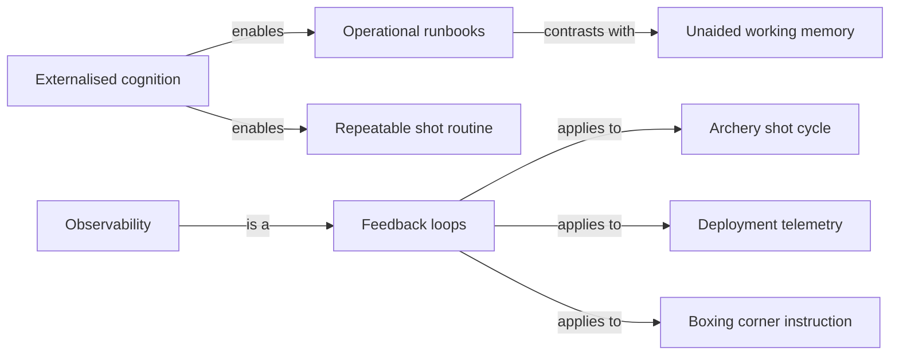

## The Architecture of Interdisciplinary Synthesis: A Cognitive and Computational Approach to Meta-Knowledge Management

The pursuit of organizing disparate interests into a cohesive, interconnected meta-graph represents one of the most profound challenges in cognitive science, epistemology, and information architecture. The human mind is inherently associative, capable of retaining multitudes of cross-disciplinary concepts. However, traditional systems for knowledge management typically force these multidimensional subjects into rigid, isolated hierarchies. The endeavor to map a meta-graph of knowledge—where fundamental interests spanning multiple subjects can be identified, isolated, and analyzed topologically—requires a paradigm shift from mere information storage to active cognitive synthesis.

By observing the structure of one's interests, rather than merely the isolated content contained within them, an individual engages in higher-order metacognition. This report conducts an exhaustive examination of how humans historically and presently tackle the problem of transdisciplinary knowledge organization. By synthesizing cognitive psychology, historical epistemology, graph theory, and modern computational architectures, the analysis provides a comprehensive framework for building a Personal Knowledge Management (PKM) system designed for deep conceptual blending and the discovery of fundamental, cross-disciplinary axioms.

### The Epistemological Evolution of Knowledge Organization

To construct a system capable of analyzing the overlaps in human interest, one must first understand the historical mechanisms of knowledge collection and their philosophical underpinnings. The desire to capture and interrelate ideas is not a byproduct of the digital age, but a centuries-old epistemic pursuit.

The effort to manage personal knowledge across various domains dates back to the Renaissance and Enlightenment periods through the use of commonplace books. These texts served as personal encyclopedias of quotations, observations, and data, allowing educated individuals to cope with the information explosion triggered by the printing press1. English philosopher John Locke was acutely aware of the limitations of human memory and the friction involved in categorizing unformed thoughts. In 1685, Locke formalized a revolutionary method for indexing his commonplace books, detailed in his publication _A New Method of Making Common-Place-Books_1.

Locke's method sought to solve the problem of premature categorization. Instead of pre-allocating pages for specific subjects—which often led to wasted space or constrained thinking—Locke utilized a two-page index at the beginning of a blank notebook. This index mapped the alphabet against the five vowels. When Locke encountered a topic, such as "Epistola," he would locate the intersection of its initial letter (E) and its first vowel (i) in the index, noting the page number where the entry was recorded1. This methodology offered maximum flexibility, allowing the commonplace book to grow organically in any direction without an overarching plan4. More importantly, it decoupled the act of information capture from the act of rigid categorization. Early modern readers utilized this method to break texts into fragments, reassemble them into new patterns, and engage in a continuous loop of learning, transforming reading and writing into inseparable, generative activities2.

Concurrently, the aspiration to map human thought logically and computationally was championed by Gottfried Wilhelm Leibniz. In the 17th century, Leibniz envisioned the _Characteristica Universalis_, a universal and formal language capable of expressing mathematical, scientific, and metaphysical concepts through a system of combinatorial logic7. Leibniz proposed that complex ideas could be systematically decomposed into a "logical alphabet" of simple, fundamental concepts7. By representing these fundamental concepts with specific symbols, reasoning would become a calculable equation (_calculus ratiocinator_), independent of the ambiguities and semantic indeterminacy of natural language7. Although a completely unambiguous universal language remains a philosophical ideal, Leibniz's core methodology—decomposing complex subjects into their most basic, combinatorial elements—is the precise mechanical foundation required to map fundamental interests across a multitude of subjects today7.

### Cognitive Bottlenecks and the Pathology of Collection

While historical methods facilitated early knowledge management, the modern digitization of this practice has introduced severe psychological traps that hinder true synthesis. A meta-project cannot succeed if it merely accumulates data; it must account for human cognitive load and the biases inherent in digital hoarding.

The most prevalent cognitive trap in modern PKM design is the "Collector's Fallacy." This bias occurs when the brain confuses the mechanical act of gathering information into a centralized location with the actual cognitive assimilation of that knowledge12. In modern digital environments, the removal of friction in capturing data leads to unchecked hoarding15. The user experiences a dopamine release akin to learning, despite no processing taking place14. The saved artifact, stripped of the relational context in which it was discovered, sits dormant in a decentralized database17. According to Antonin-Dalmace Sertillanges, the craze for collecting often comes at the direct expense of true interpretation15. This is exacerbated by the "IKEA Effect," an effort-justification bias where users spend excessive time perfecting system templates and tagging schemas, convincing themselves that this administrative work is intellectually valuable16.

Furthermore, contemporary note-taking tools frequently feature visual graph views—network diagrams connecting notes via bidirectional links. While aesthetically impressive, these graphs frequently induce a false sense of profundity, leading to apophenia: the human tendency to perceive meaningful connections between unrelated things16. The graph creates the illusion that the system is doing the thinking, but the software does not inherently comprehend the context; it merely visualizes mechanical symbol-matching18.

To overcome these illusions, the meta-graph must be designed with John Sweller's Cognitive Load Theory in mind. The human cognitive architecture consists of a highly limited working memory and a virtually unlimited long-term memory where information is stored as schemas19. Sweller identifies three types of cognitive load that must be balanced in any learning or knowledge management environment.

| Type of Cognitive Load | Definition | Implication for Meta-Knowledge Systems |
|:---- |:---- |:---- |
| Intrinsic Load | The inherent difficulty or complexity of the subject matter being processed. | Complex, interdisciplinary topics naturally carry high intrinsic load. The system must not artificially inflate this load with overly complex tagging early in the process. |
| Extraneous Load | The load generated by the manner in which information is presented to learners, often caused by poorly designed interfaces or unnecessary administrative tasks. | Over-formalization in PKM (e.g., maintaining elaborate folder structures) creates extraneous load, draining working memory away from actual synthesis. |
| Germane Load | The cognitive effort dedicated to processing, constructing, and automating cognitive schemas in long-term memory. | The system must maximize germane load by forcing the user to actively relate new concepts to existing foundational interests, facilitating deep schema construction. |

When a PKM system focuses on storage rather than sensemaking, it maximizes extraneous load and minimizes germane load19. Sensemaking, as defined by Daniel M. Russell, is the active process of searching for a representation and encoding data within that representation to answer specific questions22. Russell notes that sensemaking operates through distinct "learning loops"23:

> 1. The Generation Loop: The search for an initial representation or schema that captures the salient features of the data23.
> 2. The Data Coverage Loop: The instantiation of representations, where the user attempts to encode the collected data into the chosen schema23.
> 3. The Representational Shift Loop: As data is encoded, the user inevitably discovers "residue"—ill-fitting or missing data that does not belong in the current schema. This residue forces a bottom-up, data-driven representational shift, requiring original categories to be split, merged, or entirely discarded23.

In a meta-project analyzing overlapping interests, the user must expect and design for constant representational shifts. The friction encountered when trying to force a concept into a pre-existing category is highly valuable; the "residue" is precisely where novel, fundamental interests spanning multiple subjects are discovered23.

### The Cognitive Architecture of the Synthesizer

To build an architecture that identifies fundamental cross-disciplinary interests, the human operator must adopt cognitive frameworks specifically designed to force multidimensional traversal and conceptual blending.

Psychologist Howard Gardner identifies the "synthesizing mind" as one of the most critical cognitive capacities for navigating the modern information landscape25. A synthesizing mind takes vast amounts of information from multiple disciplines, reflects upon it, and optimally organizes it into a useful configuration25. Synthesizers operate in a pre-disciplinary or discipline-free manner, recognizing that strict academic boundaries and rigid professional codes of behavior often slow down or distort the accumulation of universal knowledge25. Gardner categorizes synthesizers into two broad archetypes:

- Hedgehog Synthesizers: Those who bring vast amounts of disparate material together to make a single, grand, unified point (e.g., Charles Darwin mapping the evolution of all species)25.
- Fox-like Synthesizers: Those whose syntheses delight in plurality and multiple perspectives, acknowledging the complexity without reducing it to a single variable (e.g., Carl Jung's varied personality types)25.

Robert Root-Bernstein's research on polymathy further validates the necessity of a synthesizing approach, noting the profound link between artistic and scientific creativity. Root-Bernstein posits that the most innovative thinkers are often "artistic scientists and scientific artists" who utilize transdisciplinary thinking tools—such as abstracting, modeling, and analogizing—to translate insights from one domain into another28.

A highly effective heuristic for operationalizing this transdisciplinary synthesis is the "Twelve Favorite Problems" framework, attributed to physicist Richard Feynman30. The framework acts as a continuous curiosity engine and an active cognitive filter33. The methodology requires an individual to articulate roughly a dozen open-ended, complex questions or problems that hold deep personal or intellectual significance31. These problems should span different scales and domains—mixing the personal, the professional, and the purely intellectual31. Crucially, they are not tasks to be completed, but continuous attractors for information31.

As the individual consumes new information, they systematically test the new data against each of the twelve dormant problems to see if a connection can be made31. Most of the time, there is no correlation. However, when a hit occurs, it bridges seemingly unrelated domains, leading to profound conceptual breakthroughs32. This framework transitions a knowledge base from a passive storage repository into an active filtering mechanism, ensuring that all collected knowledge is explicitly tied to foundational inquiries.

### Frameworks for Deep Knowledge Representation

Once the synthesizer's mindset is established, the information must be structured using educational and cognitive frameworks designed for complex domains. When mapping overlapping interests, the knowledge domains are invariably "ill-structured." In ill-structured domains, concepts interact contextually, and there are few universal rules that apply identically across all cases34.

Rand Spiro's Cognitive Flexibility Theory (CFT) addresses the specific requirements for advanced knowledge acquisition in these complex environments35. CFT posits that introductory learning often relies on oversimplification, setting up learners for failure when they attempt to synthesize advanced concepts. Spiro identifies several reductive biases that plague standard knowledge acquisition.

&nbsp;

| Reductive Bias | Description in Traditional Learning | Remedy via Cognitive Flexibility Theory |
|:---- |:---- |:---- |
| Oversimplification of Complex Structure | Treating interacting components as independent; treating the dynamic as static, or the continuous as discrete35. | Embracing complexity by utilizing multiple representations of the same information in different contexts34. |
| Overreliance on a Single Basis | Reducing the understanding of a complex concept to a single analogy or a single prototype35. | Constructing hypermedia environments where learners criss-cross the conceptual landscape from various directions34. |
| Context-Independent Representation | Treating concepts as overly uniform abstractions without regard for the specifics of their application in varied contexts36. | Anchoring knowledge in multiple, real-world case studies to demonstrate how concepts mutate across disciplines34. |

Spiro utilizes the metaphor of a physical landscape: knowing the isolated features of a landscape is not equivalent to knowing the landscape itself. The only way to truly understand it is to traverse it from multiple different directions34. A meta-graph must therefore be designed as a hypermedia environment that encourages multidimensional traversal, allowing the user to view the same concept through multiple thematic lenses38.

Furthermore, David Jonassen and Joseph Novak's research on Concept Mapping highlights that structural knowledge—understanding how concepts interrelate—is a distinct and critical form of knowledge40. Novak, building on David Ausubel's assimilation theory, asserts that meaningful learning involves the active assimilation of new concepts and propositions into existing cognitive structures42. Concept maps serve as visual representations of this structural knowledge, forcing the user to explicitly define the relational links between disparate nodes rather than relying on implicit association40.

The pinnacle of this assimilation is explained by Gilles Fauconnier and Mark Turner's Conceptual Blending Theory. This cognitive linguistics framework models how the human mind creates new meaning by integrating diverse scenarios46. Conceptual blending operates through a conceptual integration network comprising four interconnected mental spaces46:

> 1. Input Space 1: Contains the specific elements and organizing frame of the first domain (e.g., ecological systems).
> 2. Input Space 2: Contains the specific elements and organizing frame of the second domain (e.g., economic markets).
> 3. Generic Space: Captures the abstract, shared structural elements common to both input spaces. This represents the underlying topological similarity between two distinct subjects46.
> 4. Blended Space: The space where elements from the inputs are selectively projected and integrated. The blended space develops its own emergent structure and meaning not found in any of the original spaces46.

Fauconnier and Turner classify these integration networks into four primary typologies.

&nbsp;

| Network Type | Description | Application in Meta-Knowledge |
|:---- |:---- |:---- |
| Simplex | One input space contains an organizing frame, while the other provides specific elements or values to fill that frame46. | Applying a known theoretical framework from one discipline to raw data in another. |
| Mirror | Both input spaces share the same organizing frame, often resulting in direct comparisons or contrasts46. | Comparing two historical events or scientific phenomena that follow identical structural patterns. |
| Single-scope | Two input spaces have different organizing frames, but only one frame is projected into the blended space to organize the information46. | Using a metaphor from physics to entirely structure the understanding of a sociological phenomenon. |
| Double-scope | Both input spaces have different organizing frames, and the blended space incorporates parts of each, yielding a highly novel, emergent structure46. | True transdisciplinary synthesis, where the intersection of two fields creates an entirely new paradigm or theory. |

For a meta-project aimed at finding fundamental interests, double-scope blending is the ultimate goal. The PKM system must map the specific features of multiple domains, extract the underlying dynamics they share into a generic space, and force the generation of a new thesis in the blended space.

### Structural Ontologies for the Digital Vault

To operationalize these cognitive theories within a digital system, the underlying ontology—the way knowledge is categorized and structurally related—must be rigorously defined.

Traditional hierarchical classification systems are rigidly enumerative, forcing knowledge into predetermined, mutually exclusive disciplinary silos48. If an interest spans multiple disciplines, it breaks the hierarchical tree. To solve this, library scientist S. R. Ranganathan developed Faceted Classification, underpinned by the PMEST formula48. Ranganathan posited that any complex subject could be systematically analyzed and broken down into five fundamental categories, or facets48:

> 1. Personality (P): The core entity or focal point of the subject. The most unique defining characteristic (e.g., _Artificial Intelligence_).
> 2. Matter (M): The physical materials, properties, or substances involved (e.g., _Neural Networks_).
> 3. Energy (E): The actions, processes, operations, or problems occurring (e.g., _Machine Learning_).
> 4. Space (S): The geographical or spatial environment (e.g., _Global Markets_).
> 5. Time (T): The chronological period or temporal state (e.g., _21st Century_).

Faceted classification is analytic-synthetic48. It analyzes a subject by dismantling it into these facets, avoiding the rigidity of enumerative systems48. In a PKM system, utilizing a faceted tagging schema rather than rigid folders allows the user to pivot the database dynamically. One can instantly aggregate all notes where the "Energy" facet is _Optimization_, regardless of whether the "Personality" facet is _Computer Science_, _Supply Chain Logistics_, or _Biological Evolution_. This reveals the fundamental interests cutting across disciplines.

Building upon faceted data, the Zettelkasten (slip-box) method treats notes as individual nodes in a rhizomatic network51. However, a purely flat network of atomic notes quickly becomes unnavigable. To resolve this, modern methodologies utilize Maps of Content (MOCs)51. An MOC is a structural note designed specifically to cluster prominent ideas and create a formalized entry point into a topic51. In a well-functioning meta-graph, a single atomic idea will sit inside multiple MOCs simultaneously, proving its cross-disciplinary value52. The MOC captures both the topic and the natural relational dynamics of the ideas, functioning as the _Blended Space_ mentioned in Fauconnier's theory52.

However, prematurely formalizing notes into MOCs can interrupt the sensemaking process. Spatial hypertext offers a highly effective alternative for intermediate processing. Unlike navigational hypertext which relies on explicit, formalized links, spatial hypertext systems (such as VIKI and Aquanet, pioneered by Marshall and Shipman) allow users to express contingent, provisional relationships through visual attributes54.

By manipulating absolute position, proximity, size, and color on a digital canvas, users encode abstract relationships54. If two notes are placed near each other, the mind implicitly understands they are related without the cognitive friction of formally naming the link55. This methodology lowers the threshold of expression during information triage, allowing users to leverage human spatial memory to organize ill-structured knowledge54. A robust meta-graph project should utilize spatial canvases to cluster ideas visually before cementing them into formalized textual MOCs59.

### Computational Topology and Network Analysis

Once the data is ingested, categorized via facets, and clustered spatially, computational graph theory can be applied to extract empirical relationships and identify the mathematical center of the user's interests.

Dmitry Paranyushkin's research on text network analysis, implemented in tools like InfraNodus, provides a methodology for generating discoveries from disjointed discourse by representing text as a network graph61. In this model, words or concepts are nodes, and their co-occurrences within a specific window (e.g., a 4-gram window) represent the edges62. This topological approach reveals two highly critical metrics for a meta-graph project:

> 1. Community Detection (Modularity): Nodes that frequently appear in the same context form topical clusters or communities64. This automatically identifies the distinct disciplinary silos within the user's notes, organizing the discourse without manual oversight.
> 2. Structural Gaps: By mapping the network, algorithms highlight parts of the discourse that are entirely disconnected but possess a high potential for integration62. Structural gaps point out the blind spots in the graph64. By directing attention to these gaps, the user is provoked to ask unexpected questions that bridge disparate clusters, directly facilitating conceptual blending47.

To mathematically identify the "fundamental interests that sit across all subjects," one must look to the graph metric of Betweenness Centrality, introduced by Linton Freeman in 197766. Betweenness centrality measures the extent to which a specific node lies on the shortest paths connecting other nodes in the network66. Nodes with high betweenness centrality do not necessarily belong to a single dense cluster. Instead, they act as critical bridges or junctions connecting entirely different communities66. In the context of a personal meta-graph, a concept with high betweenness centrality is exactly what the user is seeking: a foundational, interdisciplinary axiom that connects their diverse topics.

The recent development of GraphRAG (Graphs \+ Retrieval Augmented Generation) by Microsoft Research demonstrates how Artificial Intelligence can automate and augment the extraction of these meta-structures from private corpora71. Baseline RAG struggles with "connecting the dots" across disparate pieces of information because it relies purely on vector similarity, retrieving isolated chunks of text72. GraphRAG processes raw text by using a Large Language Model (LLM) to extract a structured knowledge graph of entities and relations72. It then runs community detection algorithms (such as the Leiden algorithm) to partition the graph into hierarchical clusters74, and generates holistic summaries for each community72.

GraphRAG utilizes multiple search modalities that are highly relevant to navigating a meta-graph:

&nbsp;

| Search Modality | Functionality within GraphRAG | Application for Interdisciplinary Research |
|:---- |:---- |:---- |
| Local Search | Reasons about specific entities by fanning out to their immediate neighbors and associated concepts within the graph72. | Investigating a specific sub-topic deeply and identifying its direct correlations in the user's notes. |
| Global Search | Reasons about holistic questions across the entire corpus by leveraging the pre-generated community summaries72. | Asking broad, thematic questions (e.g., "What overarching themes emerge across my notes on biology and economics?"). |
| DRIFT Search | Fanning out to neighbors but with the added context of global community information72. | Identifying how a specific interest influences the broader themes across the entire vault. |

For a user managing a massive PKM, applying a GraphRAG architecture—or optimization variants like LazyGraphRAG, which uses semantic search to limit the subset of data before generating the graph—allows the system to answer global, thematic queries rather than just retrieving specific local facts72. This transitions the system from a passive storage medium into an active, collaborative sensemaking agent.

### Architecting the Meta-Project: An Implementation Strategy

Based on the synthesis of historical epistemology, cognitive psychology, and computational graph theory, the following multi-phase architecture is proposed for building and analyzing a personal meta-graph of overlapping interests.

Phase 1: Active Ingestion and Cognitive Filtering To circumvent the Collector's Fallacy and reduce extraneous cognitive load, cease indiscriminate clipping. Implement Feynman's Twelve Favorite Problems31. Draft twelve overarching questions that represent the deepest intellectual curiosities spanning your life. All new literature notes must be explicitly tested against these problems. If a piece of information does not attempt to answer or complicate one of these twelve questions, it should be rejected. This guarantees that the foundational nodes of the graph are intrinsically meaningful and primed for synthesis.

Phase 2: Faceted Decomposition When translating literature notes into permanent atomic notes51, abandon rigid folder hierarchies. Apply Leibniz's combinatorial logic and Ranganathan's PMEST facets7. Tag every atomic concept with its Personality, Matter, Energy, Space, and Time variables. This structural decoupling ensures that the components of a thought can freely associate with identical facets in entirely different disciplines, creating the necessary conditions for Spiro's cognitive criss-crossing34.

Phase 3: Spatial Triage and Generative Sensemaking Utilize a spatial hypertext environment (an infinite canvas) to visually map atomic notes54. Group them visually by proximity without formalizing links immediately54. Allow the "residue" of Russell's sensemaking loop to dictate representational shifts, embracing the cognitive friction required to force deep learning23. When spatial clusters reach critical mass, translate them into structured Concept Maps or textual Maps of Content (MOCs)44.

Phase 4: Algorithmic Discovery and Topology Mapping Periodically export the vault data to a network analysis tool or an integrated LLM pipeline (such as InfraNodus or GraphRAG)62. Run community detection algorithms to observe the isolated silos of interest64. Calculate Betweenness Centrality to identify the bridge nodes—these specific notes represent the empirical, fundamental interests that sit across all subjects66.

Phase 5: Conceptual Blending and Synthesis Identify the structural gaps in the network—two distinct communities that share no edges64. Treat these disconnected communities as _Input Space 1_ and _Input Space 2_46. Force the cognitive generation of a _Generic Space_ that encompasses them both, and author a new, highly original synthesis note (the _Blended Space_) that bridges the structural gap46. This practice elevates the user to the status of a true synthesizer, creating double-scope integration networks that yield profound, interdisciplinary axioms.

The desire to build a meta-graph of interests is ultimately a pursuit of advanced cognitive augmentation. Human learning and creativity are not fostered by the static accumulation of facts, but by the dynamic, cross-disciplinary integration of schemas. By applying the combinatorial flexibility of faceted classification, the visual affordances of spatial hypertext, and the computational topology of network algorithms, an individual can transcend traditional note-taking. The resulting architecture operates not as an archive of isolated content, but as an externalized engine for the synthesizing mind, continuously generating profound, interconnected discoveries.

#### Works Cited

> 1. John Locke's Method for Common-Place Books (1685), [https://publicdomainreview.org/collection/john-lockes-method-for-common-place-books-1685](https://publicdomainreview.org/collection/john-lockes-method-for-common-place-books-1685)
> 2. Commonplace Books: Creative Note-Taking Through History, [https://fortelabs.com/blog/commonplace-books-creative-note-taking-through-history/](https://fortelabs.com/blog/commonplace-books-creative-note-taking-through-history/)
> 3. John Locke's Method of Organizing Common Place Books, [https://fs.blog/john-locke-common-place-book/](https://fs.blog/john-locke-common-place-book/)
> 4. Locke's Index \- Futility Closet, [https://www.futilitycloset.com/2021/02/02/lockes-index/](https://www.futilitycloset.com/2021/02/02/lockes-index/)
> 5. John Locke's "new method of making common-place-books" \- PubMed, [https://pubmed.ncbi.nlm.nih.gov/25581993/](https://pubmed.ncbi.nlm.nih.gov/25581993/)
> 6. John Locke's Method of Indexing Commonplace Books, [https://www.historyofinformation.com/detail.php?id=3291](https://www.historyofinformation.com/detail.php?id=3291)
> 7. Leibniz's Universal Language Project | KÜRE Encyclopedia, [https://kureansiklopedi.com/en/detay/leibnizs-universal-language-project-bcdde](https://kureansiklopedi.com/en/detay/leibnizs-universal-language-project-bcdde)
> 8. Characteristica universalis \- Wikipedia, [https://en.wikipedia.org/wiki/Characteristica\_universalis](https://en.wikipedia.org/wiki/Characteristica_universalis)
> 9. Leibniz's characteristica universalis and calculus ratiocinator, [https://repository.tml.nul.ls/bitstreams/a580c6a9-37b5-4d85-ba81-ecd8ac6aa01b/download](https://repository.tml.nul.ls/bitstreams/a580c6a9-37b5-4d85-ba81-ecd8ac6aa01b/download)
> 10. Dropping In on Gottfried Leibniz \- Stephen Wolfram Writings, [https://writings.stephenwolfram.com/2013/05/dropping-in-on-gottfried-leibniz/](https://writings.stephenwolfram.com/2013/05/dropping-in-on-gottfried-leibniz/)
> 11. Characteristica Universalis \- Metaphors of Movement Wiki, [https://metaphorsofmovement.wiki/index.php?title=Characteristica\_Universalis](https://metaphorsofmovement.wiki/index.php?title=Characteristica_Universalis)
> 12. Collector's Fallacy \- Fork My Brain, [https://notes.nicolevanderhoeven.com/Collector's+Fallacy](https://notes.nicolevanderhoeven.com/Collector's+Fallacy)
> 13. collectors fallacy \- Obsidian Publish, [https://publish.obsidian.md/eriktuck/base/PKM/collectors+fallacy](https://publish.obsidian.md/eriktuck/base/PKM/collectors+fallacy)
> 14. How I built a system to combat the Collector's Fallacy. \- Reddit, [https://www.reddit.com/r/Learning/comments/1pws370/the\_difference\_between\_access\_and\_knowledge\_how\_i/](https://www.reddit.com/r/Learning/comments/1pws370/the_difference_between_access_and_knowledge_how_i/)
> 15. The Dark Side of PKM | Zoltan Varga, [https://vargazoltan.ai/en/blog/pkm-arnyekoldala-tudasmenedzsment/](https://vargazoltan.ai/en/blog/pkm-arnyekoldala-tudasmenedzsment/)
> 16. The psychology of "second brains" curious about your real struggles, [https://www.reddit.com/r/ObsidianMD/comments/1n9urpz/the\_psychology\_of\_second\_brains\_curious\_about/](https://www.reddit.com/r/ObsidianMD/comments/1n9urpz/the_psychology_of_second_brains_curious_about/)
> 17. Is the entire premise of PKM wrong for visual/creative knowledge?, [https://www.reddit.com/r/PKMS/comments/1smpizm/is\_the\_entire\_premise\_of\_pkm\_wrong\_for/](https://www.reddit.com/r/PKMS/comments/1smpizm/is_the_entire_premise_of_pkm_wrong_for/)
> 18. The Second Brain Delusion: Why PKM Systems Don't Work, [https://turbulencegains.com/second-brain/](https://turbulencegains.com/second-brain/)
> 19. Cognitive load theory in health professional education \- PubMed, [https://pubmed.ncbi.nlm.nih.gov/20078759/](https://pubmed.ncbi.nlm.nih.gov/20078759/)
> 20. Cognitive Load Theory \- Education NI, [https://www.education-ni.gov.uk/sites/default/files/2025-09/Cognitive%20Load%20Theory.PDF](https://www.education-ni.gov.uk/sites/default/files/2025-09/Cognitive%20Load%20Theory.PDF)
> 21. From Storage to Sensemaking: Why Modern PKMs Must Focus on, [https://medium.com/@theo-james/from-storage-to-sensemaking-why-modern-pkms-must-focus-on-reflection-over-collection-b75dfbdfccec](https://medium.com/@theo-james/from-storage-to-sensemaking-why-modern-pkms-must-focus-on-reflection-over-collection-b75dfbdfccec)
> 22. (PDF) Cost structure of sensemaking \- ResearchGate, [https://www.researchgate.net/publication/221515278\_Cost\_structure\_of\_sensemaking](https://www.researchgate.net/publication/221515278_Cost_structure_of_sensemaking)
> 23. The Cost Structure of Sensemaking \- Mark Stefik, [https://www.markstefik.com/wp-content/uploads/2014/04/1993-Cost-Structure-of-Sensemaking1.pdf](https://www.markstefik.com/wp-content/uploads/2014/04/1993-Cost-Structure-of-Sensemaking1.pdf)
> 24. (PDF) The cost structure of sense making \- ResearchGate, [https://www.researchgate.net/publication/235961374\_The\_cost\_structure\_of\_sense\_making](https://www.researchgate.net/publication/235961374_The_cost_structure_of_sense_making)
> 25. A Synthesizing Mind by Howard Gardner (Book Summary) \- Sloww, [https://www.sloww.co/synthesizing-mind-howard-gardner/](https://www.sloww.co/synthesizing-mind-howard-gardner/)
> 26. A Synthesizing Mind: A Memoir from the Creator of Multiple, [https://www.goodreads.com/book/show/51456604-a-synthesizing-mind](https://www.goodreads.com/book/show/51456604-a-synthesizing-mind)
> 27. Professor Howard Gardner Discusses His Memoir, A Synthesizing, [https://www.sir.advancedleadership.harvard.edu/articles/professor-howard-gardner-discusses-his-memoir-a-synthesizing-mind](https://www.sir.advancedleadership.harvard.edu/articles/professor-howard-gardner-discusses-his-memoir-a-synthesizing-mind)
> 28. (PDF) Artistic Scientists and Scientific Artists: The Link Between, [https://www.researchgate.net/publication/232558153\_Artistic\_Scientists\_and\_Scientific\_Artists\_The\_Link\_Between\_Polymathy\_and\_Creativity](https://www.researchgate.net/publication/232558153_Artistic_Scientists_and_Scientific_Artists_The_Link_Between_Polymathy_and_Creativity)
> 29. ‪Robert Root-Bernstein‬ \- ‪Google Scholar‬, [https://scholar.google.com/citations?user=tjRDCMEAAAAJ\&hl=en](https://scholar.google.com/citations?user=tjRDCMEAAAAJ&hl=en)
> 30. 12 Favorite Problems \- Melissa Menke, [https://www.melissamenke.com/notes/12-favorite-problems](https://www.melissamenke.com/notes/12-favorite-problems)
> 31. Feynman's Twelve Problems and the Art of Useful Obsession, [https://magnus919.com/2026/03/feynmans-twelve-problems-and-the-art-of-useful-obsession/](https://magnus919.com/2026/03/feynmans-twelve-problems-and-the-art-of-useful-obsession/)
> 32. Feynmans 12 favorite problems \- Digital Garden, [https://digital-garden.ontheagilepath.net/feynmans-12-favorite-problems](https://digital-garden.ontheagilepath.net/feynmans-12-favorite-problems)
> 33. How to turn problems into a curiosity engine \- Ness Labs, [https://nesslabs.com/favorite-problems](https://nesslabs.com/favorite-problems)
> 34. Cognitive Flexibility Theory and its Application to Learning Resources, [https://ridlr.syr.edu/wp-content/uploads/2020/11/ConceptPaper2016-CFT.pdf](https://ridlr.syr.edu/wp-content/uploads/2020/11/ConceptPaper2016-CFT.pdf)
> 35. (PDF) Cognitive Flexibility Theory: Advanced Knowledge Acquisition, [https://www.researchgate.net/publication/272177675\_Cognitive\_Flexibility\_Theory\_Advanced\_Knowledge\_Acquisition\_in\_Ill-Structured\_Domains](https://www.researchgate.net/publication/272177675_Cognitive_Flexibility_Theory_Advanced_Knowledge_Acquisition_in_Ill-Structured_Domains)
> 36. COGNITIVE FLEXIBILITY THEORY \- eScholarship.org, [https://escholarship.org/content/qt1dr9x302/qt1dr9x302\_noSplash\_1d22557a1dc468f822edeb9aab7886ed.pdf](https://escholarship.org/content/qt1dr9x302/qt1dr9x302_noSplash_1d22557a1dc468f822edeb9aab7886ed.pdf)
> 37. Cognitive flexibility theory advanced knowledge acquisition in ill, [https://www.ideals.illinois.edu/items/18096/bitstreams/64760/data.pdf](https://www.ideals.illinois.edu/items/18096/bitstreams/64760/data.pdf)
> 38. Cognitive flexibility theory: Hypermedia for complex learning, [https://www.researchgate.net/publication/288960575\_Cognitive\_flexibility\_theory\_Hypermedia\_for\_complex\_learning\_adaptive\_knowledge\_application\_and\_experience\_acceleration](https://www.researchgate.net/publication/288960575_Cognitive_flexibility_theory_Hypermedia_for_complex_learning_adaptive_knowledge_application_and_experience_acceleration)
> 39. Instructional Design Models: The Cognitive Flexibility Theory, [https://elearningindustry.com/cognitive-flexibility-theory](https://elearningindustry.com/cognitive-flexibility-theory)
> 40. (PDF) The Origins of the Concept Mapping Tool and the Continuing, [https://www.researchgate.net/publication/220586592\_The\_Origins\_of\_the\_Concept\_Mapping\_Tool\_and\_the\_Continuing\_Evolution\_of\_the\_Tool](https://www.researchgate.net/publication/220586592_The_Origins_of_the_Concept_Mapping_Tool_and_the_Continuing_Evolution_of_the_Tool)
> 41. CONCEPT MAPS, A MUST FOR THE MODERN TEACHING, [https://pefja.kg.ac.rs/wp-content/uploads/2019/11/DAS-1.2\_Concept-Maps.pdf](https://pefja.kg.ac.rs/wp-content/uploads/2019/11/DAS-1.2_Concept-Maps.pdf)
> 42. ED407938 1997-00-00 Concept Mapping: A Graphical System for, [https://files.eric.ed.gov/fulltext/ED407938.pdf](https://files.eric.ed.gov/fulltext/ED407938.pdf)
> 43. Concept Mapping: A Graphical System for Understanding the, [https://heiw.nhs.wales/files/resources/introduction-to-concept-mapping/](https://heiw.nhs.wales/files/resources/introduction-to-concept-mapping/)
> 44. Learning How to Learn \- SERC (Carleton), [https://serc.carleton.edu/resources/20946.html](https://serc.carleton.edu/resources/20946.html)
> 45. Concept Maps \- Faculty Development and Academic Quality Manual, [https://teaching.london.edu/development/learning-technologies/concept-maps/](https://teaching.london.edu/development/learning-technologies/concept-maps/)
> 46. Conceptual blending \- Wikipedia, [https://en.wikipedia.org/wiki/Conceptual\_blending](https://en.wikipedia.org/wiki/Conceptual_blending)
> 47. Conceptual blending theory and psychiatry \- Cognitive Science Online, [https://cogsci-online.ucsd.edu/3/3-2.pdf](https://cogsci-online.ucsd.edu/3/3-2.pdf)
> 48. Ranganathan's PMEST: The Foundation of Faceted Classification, [https://www.lisedunetwork.com/ranganathans-pmest-the-foundation-of-faceted-classification/](https://www.lisedunetwork.com/ranganathans-pmest-the-foundation-of-faceted-classification/)
> 49. Ranganathan's principles and a fully "freely faceted" classification, [https://or.niscpr.res.in/index.php/ALIS/article/download/8996/version/9007/2645/34855](https://or.niscpr.res.in/index.php/ALIS/article/download/8996/version/9007/2645/34855)
> 50. Understanding Ranganathan's PMEST Categories | PDF \- Scribd, [https://www.scribd.com/document/420908463/jaio](https://www.scribd.com/document/420908463/jaio)
> 51. Personal Knowledge Management with Zettelkasten and Obsidian, [https://dev.to/yordiverkroost/personal-knowledge-management-with-zettelkasten-and-obsidian-20cj](https://dev.to/yordiverkroost/personal-knowledge-management-with-zettelkasten-and-obsidian-20cj)
> 52. Are Maps of Content (MOCs) and Zettelkasten index notes similar, [https://www.reddit.com/r/PKMS/comments/1fb4vcd/are\_maps\_of\_content\_mocs\_and\_zettelkasten\_index/](https://www.reddit.com/r/PKMS/comments/1fb4vcd/are_maps_of_content_mocs_and_zettelkasten_index/)
> 53. Map of Content (MOC) \- Data Engineering Blog & Second Brain, [https://www.ssp.sh/brain/map-of-content-moc/](https://www.ssp.sh/brain/map-of-content-moc/)
> 54. Spatial hypertext in a document world, [https://people.engr.tamu.edu/shipman/SpatialHypertext/SH1/golovchinsky.pdf](https://people.engr.tamu.edu/shipman/SpatialHypertext/SH1/golovchinsky.pdf)
> 55. Discovering Implicit Structure in Spatial Hypertext, [https://people.engr.tamu.edu/shipman/viki/papers/ht93/ht93.html](https://people.engr.tamu.edu/shipman/viki/papers/ht93/ht93.html)
> 56. Aquanet: a hypertext tool to hold your knowledge in place, [https://people.engr.tamu.edu/shipman/viki/papers/ht91/ht91.html](https://people.engr.tamu.edu/shipman/viki/papers/ht91/ht91.html)
> 57. The visual knowledge builder: a second generation spatial hypertext., [https://www.researchgate.net/publication/221267443\_The\_visual\_knowledge\_builder\_a\_second\_generation\_spatial\_hypertext](https://www.researchgate.net/publication/221267443_The_visual_knowledge_builder_a_second_generation_spatial_hypertext)
> 58. Spatial Hypertext and the Practice of Information Triage | Request PDF, [https://www.researchgate.net/publication/2576905\_Spatial\_Hypertext\_and\_the\_Practice\_of\_Information\_Triage](https://www.researchgate.net/publication/2576905_Spatial_Hypertext_and_the_Practice_of_Information_Triage)
> 59. Visual thinker? Try building maps of content. (Obsidian Canvas), [https://www.youtube.com/watch?v=KyHwa\_u04ko](https://www.youtube.com/watch?v=KyHwa_u04ko)
> 60. A Spatial Hypertext Wiki for Knowledge Management, [https://researchrepository.ul.ie/bitstreams/7f5a4034-05bc-4a6b-b608-bec0623b16d6/download](https://researchrepository.ul.ie/bitstreams/7f5a4034-05bc-4a6b-b608-bec0623b16d6/download)
> 61. InfraNodus interface visualizing the text, the main topics inside,, [https://www.researchgate.net/figure/nfraNodus-interface-visualizing-the-text-the-main-topics-inside-discourse-structure\_fig2\_333067492](https://www.researchgate.net/figure/nfraNodus-interface-visualizing-the-text-the-main-topics-inside-discourse-structure_fig2_333067492)
> 62. InfraNodus: Generating Insight Using Text Network Analysis, [https://www.researchgate.net/publication/333067492\_InfraNodus\_Generating\_Insight\_Using\_Text\_Network\_Analysis](https://www.researchgate.net/publication/333067492_InfraNodus_Generating_Insight_Using_Text_Network_Analysis)
> 63. InfraNodus: Generating Insight Using Text Network Analysis, [https://ryuchen.github.io/essay/0x00000C.files/1-WWW-%20InfraNodus-%20Generating%20Insight%20Using%20Text%20Network%20Analysis.pdf](https://ryuchen.github.io/essay/0x00000C.files/1-WWW-%20InfraNodus-%20Generating%20Insight%20Using%20Text%20Network%20Analysis.pdf)
> 64. How InfraNodus Works: AI Text Network Analysis, [https://infranodus.com/about/how-it-works](https://infranodus.com/about/how-it-works)
> 65. [https://noduslabs.com/research/pathways-meaning-circulation-text-network-analysis/](https://noduslabs.com/research/pathways-meaning-circulation-text-network-analysis/)
> 66. A Set of Measures of Centrality Based on Betweenness, [https://www.researchgate.net/publication/216637282\_A\_Set\_of\_Measures\_of\_Centrality\_Based\_on\_Betweenness](https://www.researchgate.net/publication/216637282_A_Set_of_Measures_of_Centrality_Based_on_Betweenness)
> 67. Betweenness Centrality Graph Metric Calculator | MetricGate, [https://metricgate.com/docs/betweenness-centrality/](https://metricgate.com/docs/betweenness-centrality/)
> 68. Betweenness centrality \- Wikipedia, [https://en.wikipedia.org/wiki/Betweenness\_centrality](https://en.wikipedia.org/wiki/Betweenness_centrality)
> 69. Betweenness Centrality \-- from Wolfram MathWorld, [https://mathworld.wolfram.com/BetweennessCentrality.html](https://mathworld.wolfram.com/BetweennessCentrality.html)
> 70. Centrality Measures in Networks \- arXiv, [https://arxiv.org/pdf/1608.05845](https://arxiv.org/pdf/1608.05845)
> 71. Project GraphRAG \- Microsoft Research, [https://www.microsoft.com/en-us/research/project/graphrag/](https://www.microsoft.com/en-us/research/project/graphrag/)
> 72. Welcome \- GraphRAG, [https://microsoft.github.io/graphrag/](https://microsoft.github.io/graphrag/)
> 73. GraphRAG in 2026: What to Use, When to Use It, and What to Watch, [https://medium.com/@tongbing00/graphrag-in-2026-what-to-use-when-to-use-it-and-what-to-watch-out-for-a1fa1c283023](https://medium.com/@tongbing00/graphrag-in-2026-what-to-use-when-to-use-it-and-what-to-watch-out-for-a1fa1c283023)
> 74. Experimenting with GraphRAG: Adding Knowledge Graphs to RAG, [https://2389.ai/posts/experimenting-with-rag/](https://2389.ai/posts/experimenting-with-rag/)
> 75. How Would Microsoft GraphRAG Work Alongside a Graph Database?, [https://memgraph.com/blog/how-microsoft-graphrag-works-with-graph-databases](https://memgraph.com/blog/how-microsoft-graphrag-works-with-graph-databases)
> 76. Generate Insight Using Text Network Analysis & Visualization, [https://noduslabs.com/features/reading/](https://noduslabs.com/features/reading/)

## A Portable Interest and PKM Knowledge Graph

### Executive Recommendation

Build a Markdown-first, labelled property graph in Obsidian rather than a topical folder tree. Notes are nodes; ordinary Markdown links are edges; a short verb beside each link gives the edge its type; YAML frontmatter supplies independent facets for filtering. This preserves readable files while allowing Obsidian, command-line tools, LLM agents, and future graph software to derive different views from the same source.

The design should separate four things that PKM systems often conflate:

- Storage: shallow, boring folders based on workflow or note type.
- Classification: multi-value facets such as `domains`, `themes`, and `kind`.
- Meaning: explicit, typed links between notes.
- Presentation: generated Maps of Content, Bases, graph views, search results, and external visualisations.

This is a graph because a note may participate in several themes and relationships simultaneously. Faceted classification is specifically intended for multidimensional knowledge and retrieval, while RDF formalises a graph as subject–predicate–object statements in which the predicate names the relationship. The practical consequence is that "Archery" need not live under either "Sport", "Skill learning", or "Embodied cognition"; it can connect to all three without choosing a single parent.[^1][^2][^3]

### Design Principles

#### Markdown is Canonical

Keep the authoritative data in UTF-8 Markdown plus flat YAML frontmatter. Obsidian stores Properties as YAML at the start of Markdown files, and standard Markdown links can be enabled instead of wikilinks for broader application compatibility. Obsidian Bases also reads properties without moving the underlying data into a separate database.[^4][^5][^6]

Treat every richer representation as a projection:

- Obsidian is the principal editing environment.
- Git supplies history, diffing, backup, and portability.
- Bases and Maps of Content are navigational views.
- Semantic indexes are disposable retrieval accelerators.
- CSV, JSON-LD, GraphML, or a graph database are generated exports, never the only copy.

JSON-LD is a W3C-standard JSON serialisation for Linked Data, so it is a sensible optional interchange target if the graph later needs to feed web services or a graph store.[^7][^8]

#### Classification Uses Facets

Folders force one location; facets allow several independent answers to "what is this?" Facets are used as distinct aspects of a subject and as filters for navigation and retrieval. For this vault, the useful distinction is:[^9]

- Domain: the visible subject area, such as archery, boxing, Azure, Kubernetes, literature, music, or PKM.
- Theme: a mechanism or question that cuts across domains, such as feedback, resilience, deliberate practice, uncertainty, automation, identity, narrative, or externalised cognition.
- Kind: the function of the note, such as concept, claim, question, source, person, tool, project, or map.
- State: its maturity or workflow status, such as seed, growing, or evergreen.

Use only facets that will drive a query, view, review, or automation. Flat fields are easier to edit and migrate than nested metadata, and consistent values matter more than a large schema.[^10][^4]

#### Links Carry Meaning

A bare `related to` edge tells the reader little. A labelled edge answers "how does A connect to B?" RDF expresses this as subject, predicate, and object, with the predicate naming the directed relationship. Controlled-vocabulary standards similarly distinguish equivalence, hierarchical, and associative relationships and require clear reciprocal handling where inverse relationships exist.[^11][^12][^13][^1]

Use a deliberately small predicate vocabulary first. Expand it only when the same missing distinction causes repeated ambiguity.

### Proposed Graph Model

#### Node Types

| Node kind | Represents | Example |
|---|---|---|
| `concept` | A reusable idea or mechanism | Feedback loop |
| `claim` | A proposition that can be supported or challenged | Immediate feedback accelerates skill correction |
| `question` | An unresolved enquiry | How does arousal affect fine motor control? |
| `domain` | A visible interest or practice | Recurve archery |
| `theme` | A cross-cutting lens | Deliberate practice |
| `source` | A book, paper, video, album, podcast, or website | A paper on motor learning |
| `person` | An author, athlete, musician, historical actor, or thinker | An archery coach |
| `tool` | Software, framework, technique, or piece of equipment | Terraform |
| `project` | A time-bounded outcome | Improve AKS security baseline |
| `map` | A curated or generated entry point | Feedback across domains |

Do not create a unique folder for every kind. A shallow workflow structure is easier to synchronise and less likely to encode accidental hierarchy:

```text
00 Inbox/
10 Notes/
20 Sources/
30 Maps/
40 Projects/
90 Archive/
_System/
  Templates/
  Vocabulary/
  Schemas/
  Scripts/
```

Topic membership belongs in facets and links, not paths. A stable note ID in frontmatter can preserve identity independently of title or location.

#### Facet Vocabulary

Start with this minimal schema:

```yaml
---
id: 20260913T101500-feedback-loops
kind: concept
state: growing
domains:
  - archery
  - devops
themes:
  - feedback
  - skill-acquisition
aliases:
  - feedback systems
created: 2026-09-13
updated: 2026-09-13
---
```

Recommended rules:

- `id` is immutable; use an ISO-like timestamp plus slug.
- `kind` has exactly one value.
- `domains` may have several values because interests overlap.
- `themes` should normally contain zero to three values; excessive values dilute retrieval.
- `state` describes knowledge maturity, not task status.
- `aliases` handles alternate terminology; choose one preferred note title for each concept.
- Dates use `YYYY-MM-DD`.

Obsidian Properties support text, dates, lists, and links in YAML. Preferred and alternate labels, broader/narrower relations, and associative relations also align with the deliberately lightweight SKOS model for controlled vocabularies.[^14][^15][^4]

#### Edge Vocabulary

Use these eight predicates for the first version:

| Predicate | Meaning | Direction or inverse |
|---|---|---|
| `is a` | Specific concept is an instance or subtype of a broader concept | Inverse: `has subtype` |
| `part of` | Structural component belongs to a whole | Inverse: `has part` |
| `supports` | Gives evidence or reasoning for a claim | Inverse: `supported by` |
| `challenges` | Disputes, limits, or creates tension with a claim | Usually reciprocal review, not logically symmetric |
| `applies to` | Transfers a mechanism or model into a domain | Inverse: `application of` |
| `enables` | Makes a capability or outcome possible | Inverse: `enabled by` |
| `derived from` | Records provenance from a source or antecedent idea | Inverse: `source for` |
| `contrasts with` | Clarifies difference without necessarily refuting | Symmetric |

Permit `related to` only as a temporary inbox predicate. Review it later into a more informative type or delete it. SKOS uses `broader`, `narrower`, and `related` as a small semantic core, but also warns that associative and hierarchical relations are different kinds of connection.[^16][^14]

#### Edge Syntax

Keep typed links in the note body, where every Markdown reader can display them and where a short rationale can sit beside the edge:

```markdown
## Connections

- Applies to → [Archery shot cycle](../Notes/Archery-shot-cycle.md) — each stage exposes a checkpoint for correction.
- Applies to → [Deployment feedback](../Notes/Deployment-feedback.md) — telemetry shortens the detect–correct loop.
- Supports → [Immediate feedback improves correction](../Notes/Immediate-feedback-improves-correction.md) — this note supplies the general mechanism.
- Derived from → [Source — Motor-learning paper](../Sources/Motor-learning-paper.md) — original evidence and limitations.
```

This pattern deliberately combines:

- A normal Markdown link for portability.
- A bold controlled predicate for human scanning.
- An arrow for direction.
- A one-sentence rationale for epistemic value.

Obsidian supports standard Markdown links, heading links, and block links; paths use forward slashes across platforms. The graph view will still recognise the underlying links as edges, while the visible prose supplies semantics that the native graph does not show.[^5][^17]

Do not duplicate every edge in YAML and prose. Duplication creates drift. Store edge meaning once in the `Connections` section, then let scripts derive triples or adjacency lists.

### Interest Architecture

#### Domains Are not Parents

Represent major interests as `domain` nodes rather than root folders:

- Cloud infrastructure
- DevOps and GitOps
- AI and agents
- PKM and knowledge architecture
- Recurve archery
- Boxing
- Football
- Literature
- Science fiction
- Music
- Comics and popular culture
- History

A concept may connect to several of these. For example, `feedback latency` can `apply to` archery coaching, boxing corner instruction, CI/CD pipelines, and LLM agent evaluation. The shared concept becomes the bridge; none of those domains needs to be filed beneath another.

#### Themes Create Bridges

Begin with five to eight theme nodes, not dozens. A suitable initial set is:

- Feedback and observability
- Skill acquisition and deliberate practice
- Automation and agency
- Resilience and adaptation
- Externalised cognition
- Evidence, uncertainty, and epistemology
- Narrative, identity, and culture
- Systems and emergence

These are hypotheses, not permanent bins. Promote a term to a theme only when it repeatedly links at least three domains. Retire or merge themes that merely duplicate domain names.

A possible bridge pattern is:



The diagram is a view of assertions already present in notes. It is not the primary store.

#### Maps Are Lenses

Maps of Content should be navigational lenses rather than containers. Create three map styles:

- Domain map: "Recurve archery" gathers concepts, sources, active questions, and practice projects.
- Theme map: "Feedback and observability" deliberately crosses DevOps, archery, boxing, AI evaluation, and learning science.
- Bridge map: "From observability to coaching" explains a particular cross-domain synthesis and its limits.

Maps should contain short commentary and selected links, not every matching note. Use Bases for exhaustive, automatically filtered inventories because Bases can display, sort, filter, and group Markdown notes by their properties.[^6][^18]

### Connection Discovery

#### Human-first Linking Loop

For every note that graduates from the inbox:

1. Rewrite it as one reusable concept, claim, question, or source note.
2. Assign one `kind`, one or more `domains`, and no more than three `themes`.
3. Search for one close same-domain connection.
4. Search for one cross-domain connection through a shared theme or mechanism.
5. Add typed edges only when the relationship can be completed as: "A verb B because…".
6. Add a one-sentence rationale when the connection is not obvious.
7. Inspect the local graph at depth one or two; use the global graph for auditing, not daily navigation.

Obsidian's local graph is specifically available for the neighbourhood around a note, while the global graph shows the whole vault. This division matters: local views answer "what connects here?", whereas a large global graph often becomes an attractive but low-information overview.[^17][^19]

#### Hybrid Retrieval Loop

Use multiple retrieval modes because each finds a different kind of candidate:

1. Exact search: titles, aliases, domain names, and known vocabulary.
2. Property filtering: same theme, different domain; same domain, different kind; unresolved questions.
3. Backlink traversal: explicit neighbours and second-degree neighbours.
4. Semantic search: conceptually similar notes that use different language.
5. LLM reranking: ask an agent to propose predicates and rationales, but require human confirmation before writing.

This fits the existing Obsidian/MCP and semantic-search workflow: semantic search should nominate candidates, while typed human-readable edges become the durable graph. The semantic index is therefore replaceable; accepted links remain visible even if the embedding model or vector store changes.

#### High-value Queries

Design the schema around questions that the system should answer:

- Which concepts occur in both a technical and embodied-skill domain?
- Which notes share a theme but have no explicit link?
- Which claims have sources but no challenge or limitation?
- Which questions connect at least two domains?
- Which `related to` edges still need a precise predicate?
- Which theme nodes have become hubs without explanatory bridge notes?
- Which active projects are linked to reusable knowledge rather than isolated project files?

A query is more useful than a decorative graph when it triggers a decision: create a bridge note, improve an edge, merge synonyms, add evidence, or remove noise.

### Cross-platform Operation

#### Portability Contract

Document the following rules in `_System/Schemas/portability.md`:

- Markdown and YAML are the only canonical formats.
- Filenames avoid characters that are invalid or awkward on Windows.
- Links use relative Markdown paths and forward slashes.
- IDs never change; titles and paths may change.
- Frontmatter remains flat and uses a controlled vocabulary.
- Plugin-only syntax is optional and never contains the sole copy of important meaning.
- Attachments use predictable relative paths.
- Generated indexes and graph exports can always be deleted and rebuilt.

Standard Markdown links give broader compatibility than wikilinks, and Obsidian can be configured to generate Markdown links while retaining autocomplete.[^20][^5]

#### Tool Roles

| Layer | Recommended role | Must not become |
|---|---|---|
| Obsidian | Authoring, local graph, backlinks, Bases, templates | Proprietary source of meaning |
| Git | Versioning, audit, sync support, schema migration safety | Primary browsing interface |
| MCP/filesystem tools | Controlled agent access to read and propose edits | Unreviewed bulk writer |
| Semantic index | Recall, similarity, hidden-candidate discovery | Canonical relationship store |
| Shell/Python | Validation, export, orphan checks, vocabulary linting | A second hand-maintained database |
| Graph software | Specialist visual analysis of derived triples | Source of truth |

#### Derived Triples

The `Connections` syntax can be exported as an edge table:

```csv
subject_id,predicate,object_id,rationale
20260913-feedback-loops,applies_to,20260820-archery-shot-cycle,Each stage exposes a correction checkpoint
20260913-feedback-loops,applies_to,20260711-deployment-telemetry,Telemetry shortens the detect-correct loop
```

This is equivalent in shape to RDF's subject–predicate–object model. CSV is convenient for inspection and graph tools; JSON-LD is preferable if semantic interoperability later becomes important.[^1][^7]

### Automation Guardrails

#### Vocabulary Linting

Keep allowed values in version-controlled text files:

```text
_System/Vocabulary/kinds.txt
_System/Vocabulary/domains.txt
_System/Vocabulary/themes.txt
_System/Vocabulary/predicates.txt
```

A simple shell audit can detect accidental predicate variants:

```bash
rg --no-heading '^\- \*\*[^*]+\*\* →' '10 Notes' '20 Sources' \
  | sed -E 's/.*\*\*([^*]+)\*\*.*/\L\1/' \
  | sort -u
```

Compare that output with the approved predicate file during a weekly review or CI job. Also lint duplicate IDs, missing IDs, unresolved relative links, invalid YAML, orphan notes, and notes with more than three themes.

#### Agent Write Policy

Agents should follow a proposal–validation–commit cycle:

1. Retrieve candidates through exact search, properties, graph traversal, and semantic search.
2. Return proposed triples with confidence, evidence, and a one-sentence rationale.
3. Reject edges based only on lexical similarity.
4. Check whether the target note exists and whether the predicate is approved.
5. Present a diff or write to a staging branch.
6. Commit only accepted edits.

This preserves immediate AI assistance without allowing semantic similarity to masquerade as a meaningful relationship. It also matches the existing preference for source-of-truth notes and typed edges rather than passive summaries.[^21]

### Views that Reveal Links

#### Bases Dashboards

Create small operational views rather than one master dashboard:

- Bridge candidates: same `themes`, at least two distinct `domains`, no bridge map.
- Unresolved questions: `kind: question`, grouped by theme.
- Evidence gaps: `kind: claim`, with no `derived from` or `supported by` connection.
- Weak edges: notes containing `Related to`.
- New growth: `state: seed` or `growing`, sorted by update date.
- Active project knowledge: project notes and reusable concepts linked from them.

Bases stores these as views over local Markdown properties and can offer multiple filtered layouts without altering the source notes.[^18][^6]

#### Graph Audits

Use visual graphs for focused audits:

- Filter to one theme and colour by domain to expose cross-domain bridges.
- Inspect local depth two around a promising concept.
- Find isolated components, not merely individual orphan notes.
- Watch for giant generic hubs such as "technology" or "learning"; split or demote them when they connect everything but explain nothing.
- Review bridge nodes with high cross-domain reach and convert important patterns into authored bridge maps.

Obsidian's native graph represents notes as nodes and internal links as lines, but it does not natively express the edge labels in this proposed syntax. Therefore, use it for neighbourhood and topology; use prose, queries, or an exported labelled graph for semantics.[^19][^17]

### Migration Plan

#### Phase One: Establish the Contract

Create the schema, vocabulary files, templates, and six shallow folders. Configure Obsidian to prefer Markdown links. Add immutable IDs only to newly processed notes at first; do not begin with a vault-wide rewrite.

Select approximately 20 notes spanning cloud, PKM, archery, boxing, and culture. Apply the minimal facets and typed connections manually. The purpose is to test whether the vocabulary answers real questions before automation magnifies it.

#### Phase Two: Seed Themes

Create five to eight theme notes and link each to at least three domains. Build one theme map, probably `Feedback and observability`, because it can connect deployment telemetry, agent evaluation, coaching, deliberate practice, and operational learning.

During processing, require two genuine links where available: one near link and one bridge candidate. Do not force links into weak notes merely to eliminate orphans.

#### Phase Three: Add Discovery

Build Bases for unresolved questions, weak edges, and cross-domain theme candidates. Integrate semantic search as a candidate generator, then have an LLM output proposals in a strict structure:

```yaml
subject: 20260913-feedback-loops
predicate: applies_to
object: 20260820-archery-shot-cycle
rationale: Each shot-cycle checkpoint can expose an observable error and corrective response.
confidence: medium
requires_review: true
```

No agent should invent the target note, alter the controlled vocabulary, or silently write a high-confidence link merely because embeddings are similar.

#### Phase Four: Derive External Graphs

Once the body syntax is stable, write a parser that emits `nodes.csv` and `edges.csv`; optionally emit JSON-LD. Visualise only filtered subgraphs, such as one theme over several domains. Keep the export reproducible and outside the canonical note set.

#### Phase Five: Review and Evolve

Run a short weekly graph review:

- Process the inbox.
- Resolve temporary `related to` edges.
- Confirm or reject semantic candidates.
- Merge aliases and duplicate concepts.
- Identify one useful cross-domain bridge.
- Update one Map of Content.

Run a quarterly schema review:

- Remove facets never used in queries.
- Merge predicate synonyms.
- Split predicates only when the distinction changes retrieval or reasoning.
- Retire themes that do not bridge domains.
- Document any migration before bulk editing.

Controlled vocabularies need documented scope, consistent relationships, and ongoing maintenance; standards explicitly treat construction, testing, interoperability, and maintenance as part of vocabulary design rather than afterthoughts.[^12][^22][^23]

### Anti-patterns

- Recreating an org chart with links: A giant "Interests" note connected to every domain changes the drawing, not the hierarchy.
- Using folders as ontology: Paths should answer "where is this file operationally?", not "what can this idea mean?".
- Making tags do everything: Tags are useful for lightweight facets but cannot explain why two ideas connect.
- Keeping only bare links: A graph of unlabeled lines conceals whether a source supports, challenges, exemplifies, or merely mentions a concept.
- Starting with a formal ontology: Too many classes and predicates raise capture cost before usage reveals the necessary distinctions.
- Equating semantic similarity with knowledge: Similarity retrieves candidates; an authored predicate plus rationale creates a durable assertion.
- Treating Maps of Content as folders: Maps should curate paths through the graph and may overlap freely.
- Duplicating edge truth: Do not maintain the same relationship independently in YAML, prose, Dataview fields, and a graph database.
- Optimising the global graph: A beautiful global image is not evidence that the system improves retrieval, reasoning, or action.

### Recommended Starting Template

```markdown
---
id: {{date:YYYYMMDD}}T{{time:HHmmss}}-{{slug}}
kind: concept
state: seed
domains: []
themes: []
aliases: []
created: {{date:YYYY-MM-DD}}
updated: {{date:YYYY-MM-DD}}
---

# {{title}}

## Proposition

One self-contained idea in the author's own words.

## Why it matters

What this changes, explains, predicts, or enables.

## Evidence and limits

Sources, counterexamples, uncertainty, and scope conditions.

## Connections

- Predicate → [Target](relative/path.md) — why this relationship is meaningful.

## Open questions

- What remains uncertain or worth testing?
```

Atomic, independently understandable notes make precise links easier than broad topic summaries. Networked note-taking guidance consistently emphasises one idea per permanent note, explicit links, and an explanation of why the connection matters.[^24][^25][^26]

### Decision

The most aligned architecture is therefore:

1. Canonical store: portable Markdown, flat YAML, Git.
2. Graph unit: atomic concept, claim, question, source, domain, theme, person, tool, project, or map note.
3. Classification: small multi-value facets, especially separate `domains` and cross-cutting `themes`.
4. Semantics: a controlled set of typed Markdown links with short rationales.
5. Navigation: local graphs, Bases, and overlapping maps as generated or curated lenses.
6. Discovery: exact search, facets, backlink traversal, semantic retrieval, and human-reviewed LLM proposals.
7. Interchange: derived CSV or JSON-LD, never a second source of truth.
8. Governance: weekly edge review and quarterly vocabulary review.

This keeps capture lightweight, makes links intelligible without Obsidian, supports agentic and command-line workflows, and allows the graph to evolve as interests intersect in ways that cannot be predicted by a fixed hierarchy.

---

### References

1. [RDF 1.1 Primer](https://dvcs.w3.org/hg/rdf/raw-file/tip/rdf-primer/Overview.html)
2. [[PDF] Faceted Classification - IMR Press](https://storage.imrpress.com/imr/journal/KO/article/506138/1752849150671.pdf) - A consideration of its fea tures as a paradigm of knowledge organization. the ideal model of knowled…
3. [Faceted classification as a basis for knowledge organization in a ...](https://www.tandfonline.com/doi/abs/10.1080/13614560108914727) - Faceted classification as a basis for knowledge organization in a digital environment; the creation …
4. [Properties - Obsidian Help](https://obsidian.md/help/properties) - Properties allow you to organize information about a note. Properties contain structured data such a…
5. [Internal links - Obsidian Help](https://obsidian.md/help/links) - Learn how to link to notes, attachments, and other files from your notes, using internal links.
6. [Introduction to Bases - Obsidian Help](https://obsidian.md/help/bases) - Create database-like views of your notes, formatted as tables or cards. Edit, sort, and filter files…
7. [JSON-LD 1.1 Specifications are W3C Recommendations](https://www.w3.org/news/2020/json-ld-1-1-specifications-are-w3c-recommendations/) - The World Wide Web Consortium (W3C) is an international community where Member organizations, a full…
8. [JSON-LD 1.1 - W3C](https://www.w3.org/2018/jsonld-cg-reports/json-ld/) - JSON is a useful data serialization and messaging format. This specification defines JSON-LD, a JSON…
9. [Facet (IEKO) - ISKO](https://www.isko.org/cyclo/facet) - Facets have traditionally been used to organize document collections and to express complex subjects…
10. [YAML in Obsidian: Properties, Syntax, Bases, and Dataview](https://www.itechguides.com/yaml-in-obsidian-a-guide-to-better-metadata-management/) - YAML in Obsidian is the frontmatter storage format behind Properties. Learn how to create typed meta…
11. [RDF Primer](https://www.w3.org/2001/09/rdfprimer/rdf-primer-20020823.html)
12. [ANSI/NISO Z39.19-2005 (R2010), Guidelines for the ...](https://www.anzsi.org/wp-content/uploads/2019/05/z39-19-2005r2010.pdf)
13. [Standard Spotlight: From ISO 2788 to ISO 25964](https://www.niso.org/sites/default/files/stories/2017-11/SP_clarke_zeng_isqv24no1.pdf)
14. [SKOS Simple Knowledge Organization System Primer - W3C](https://www.w3.org/TR/skos-primer/)
15. [Key choices in the design of Simple Knowledge Organization System (SKOS)](https://www.cs.vu.nl/~guus/papers/Baker13a.pdf)
16. [SKOS Simple Knowledge Organization System Primer - W3C](https://www.w3.org/2006/07/SWD/SKOS/primer/primer-20080826.html)
17. [Graph view - Obsidian Help](https://obsidian.md/help/plugins/graph) - Graph view is a core plugin that lets you visualize the relationships between the notes in your vaul…
18. [Views - Obsidian Help](https://obsidian.md/help/bases/views) - Views allow you to organize the information in a Base in multiple ways. A base can contain several v…
19. [Graph view -](https://obsidian.md/help/Plugins/Graph+view?ref=platformer.news) - Graph view?ref=platformer.news - Obsidian Help
20. [Linking and Organization | obsidianmd/obsidian-help | DeepWiki](https://deepwiki.com/obsidianmd/obsidian-help/3-linking-and-organization) - This document explains how to create connections between notes and organize information within Obsid…
21. [How to optimize semantic search for Obsidian vault retrieval](https://www.perplexity.ai/search/ace95d99-ec7d-4e4c-b480-24e8e20d3b40) - To optimize semantic search for Obsidian vault retrieval, make it a retrieval pipeline rather than a…
22. [NISO Z39.19 : 2005 GUIDELINES FOR THE CONSTRUCTION, FORMAT, AND MANAG](https://shop.standards.ie/en-ie/standards/niso-z39-19-2005-830195_saig_niso_niso_1978535/) - Buy NISO Z39.19: 2005 GUIDELINES FOR THE CONSTRUCTION, FORMAT, AND MANAGEMENT OF MONOLINGUAL CONTRO…
23. [Information Standards | NISO website](https://www.niso.org/publications/standards) - ANSI/NISO Z39.19-2005 (R2010) Guidelines for the Construction, Format, and Management of Monolingual…
24. [Zettelkasten: How to Build a Knowledge System](https://voicememos.co/blog/zettelkasten-how-to-build-a-knowledge-system) - Learn how the Zettelkasten method works, why linked notes beat linear notebooks, and how to build yo…
25. [Zettelkasten: Niklas Luhmann's Networked Note-Taking ...](https://get-alfred.ai/blog/zettelkasten) - Niklas Luhmann used the Zettelkasten, a web of linked index cards, to write 58 books. Why linking no…
26. [Zettelkasten Method: 7 Steps to Clear, Connected Notes](https://affine.pro/blog/zettelkasten-method) - Learn the Zettelkasten method with 7 practical steps, examples, app criteria, common mistakes, metho…
