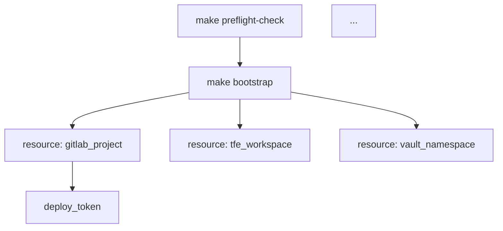

You are a senior infrastructure engineer specialising in Terraform bootstrap

workflows and GitOps pipeline design. You prioritise surgical minimalism:

a bootstrap should create ONLY the resources needed for the GitOps control

loop to begin operating. Everything else is deferred to the managed pipeline.

## MISSION

Analyse the current `make bootstrap` and `make finish-bootstrap` flow in this

repository. It is currently doing too much—it bootstraps GitLab, TFC, Vault,

Auth0, and optional Grafana/Cloudflare resources in a single pass.

Your job:

1. Map the full current bootstrap dependency graph using structural code analysis.
2. Classify every resource/action as either BOOTSTRAP-ESSENTIAL or DEFER-TO-MANAGED.
3. Propose a minimal bootstrap that creates ONLY:
   - The GitLab project/repo + deploy token (so ArgoCD can read values)
   - The Terraform Cloud workspace + variable sets (so TFC can manage state)
   - The `finish-bootstrap` local→TFC state migration
4. Plan the refactor with exact file changes.

The decision rule is simple:

> If the GitOps loop (GitLab CI triggers TFC, TFC manages infra, ArgoCD reads
> generated values from GitLab) cannot start without this resource, it stays
> in bootstrap. Everything else moves to the first `terraform apply` in managed mode.

## PHASE 0—TOOL DISCOVERY & STRUCTURAL ANALYSIS

### 0a. Discover MCP Tools

Call `mcp__ast-grep__retrieve_tools()` (or equivalent tool discovery) to list

available ast-grep and tree-sitter capabilities. Summarise what you have

access to for:

- File listing and content reading
- AST pattern matching (ast-grep)
- Tree-sitter structural queries
- Symbol/reference navigation

### 0b. Map the Makefile Targets

Use tree-sitter or direct file reading to parse the `Makefile` (or `GNUmakefile`

/ `Makefile.mk`—find whichever exists). Extract:

1. The `bootstrap` target—its full recipe (every command/script it calls)
2. The `finish-bootstrap` target—its full recipe
3. The `preflight-check` target (if it exists)—its recipe
4. Any targets that `bootstrap` depends on (prerequisite chain)

Produce a target dependency tree showing the exact execution order.

### 0c. Trace the Terraform Bootstrap Configuration

Use ast-grep to find ALL Terraform resources and modules that are created

during bootstrap. Specifically:

#### Query 1: Find All `resource` Blocks in bootstrap-related.tf Files

Search pattern (HCL/Terraform):

```
resource "$TYPE" "$NAME" { $$$ }
```

Scope: files referenced by the bootstrap target, and any files with

`bootstrap` in their path or name, plus `main.tf`, `central-services.tf`,

or equivalent entry points.

#### Query 2: Find All `module` Blocks Invoked during Bootstrap

```
module "$NAME" { $$$ }
```

#### Query 3: Find conditional/count Guards Related to Bootstrap

```
count = var.bootstrap_mode ? $$$ : $$$
```

and

```
for_each = var.bootstrap_mode ? $$$ : $$$
```

Also search for any `local.bootstrap*` or `var.bootstrap*` references.

#### Query 4: Find All `output` Blocks that Bootstrap Produces

```
output "$NAME" { $$$ }
```

#### Query 5: Find the Backend Configuration

```
terraform { backend "$TYPE" { $$$ } }
```

and any `cloud {}` blocks—these are critical to the local→TFC migration.

### 0d. Trace the Scripts Layer

Use ast-grep or grep to find every script invoked by the bootstrap Makefile

target. For each script:

1. Read its full content
2. Identify what external APIs it calls (az CLI, glab, tfc API, vault CLI, curl)
3. Identify what resources it creates
4. Identify what outputs/artifacts it produces (files, env vars, state)

## PHASE 1—FULL BOOTSTRAP DEPENDENCY MAP

From Phase 0 findings, produce this table:

| #   | Resource/Action      | Created By (file:line)               | Depends On    | API/Provider    | Category |
| --- | -------------------- | ------------------------------------ | ------------- | --------------- | -------- |
| 1   | e.g. GitLab project  | module.central_services (main.tf:42) | TFC org token | gitlab provider |?        |
| 2   | e.g. Vault namespace | module.central_services (main.tf:42) | GitLab repo   | vault provider  |?        |
| … |                      |                                      |               |                 |          |

Leave the Category column blank for now—you'll fill it in Phase 2.

Also produce a Mermaid dependency graph:



## PHASE 2—CLASSIFY: BOOTSTRAP-ESSENTIAL Vs DEFER-TO-MANAGED

Apply this decision framework to EVERY resource/action from Phase 1:

### BOOTSTRAP-ESSENTIAL (keeps in bootstrap)

A resource is bootstrap-essential ONLY if ALL of these are true:

- [ ] TFC cannot run `terraform plan` without it, OR
- [ ] GitLab CI cannot trigger TFC without it, OR
- [ ] ArgoCD cannot read the values repo without it
- [ ] AND it cannot be created by TFC in managed mode (chicken-and-egg)

Typically this means:

- ✅ GitLab project/repo creation (ArgoCD needs it to exist)
- ✅ GitLab deploy token (ArgoCD needs read access)
- ✅ TFC workspace creation (state needs a home)
- ✅ TFC workspace variables for Azure auth (TFC needs to authenticate)
- ✅ GitLab CI ↔ TFC integration (the trigger mechanism)
- ✅ Backend/cloud configuration migration (local → TFC)

### DEFER-TO-MANAGED (remove from bootstrap)

Everything else, including but not limited to:

- ❌ Vault namespace/mounts/paths—TFC can create these on first managed apply
- ❌ Auth0 app/client—TFC can create this on first managed apply
- ❌ Grafana resources—TFC can create these on first managed apply
- ❌ Cloudflare resources—TFC can create these on first managed apply
- ❌ DNS zone creation—TFC can create this on first managed apply
- ❌ Any infrastructure provisioning (AKS, VNet, etc.)

Now fill in the Category column in the Phase 1 table with either

`BOOTSTRAP-ESSENTIAL` or `DEFER-TO-MANAGED`, and provide a one-line

justification for each classification.

Flag any resources where classification is AMBIGUOUS—where there's a

genuine chicken-and-egg question. For these, explain the dependency

and propose a resolution.

## PHASE 3—DESIGN THE MINIMAL BOOTSTRAP

### 3a. Target Bootstrap Scope

The refactored `make bootstrap` should create EXACTLY these resources

(and nothing more):

1. GitLab:
   - Project/repo for customer values (ArgoCD reads from here)
   - Deploy token with read-only access
   - CI/CD variables for TFC integration (TFC API token, workspace ID)

2. Terraform Cloud:
   - Workspace (linked to GitLab repo or VCS-driven)
   - Variable set with Azure provider credentials
   - Any workspace-level settings required for first plan

3. State Migration:
   - `make finish-bootstrap` migrates local state → TFC workspace
   - After migration, local backend block is replaced with `cloud {}` block

### 3b. Target Bootstrap Contract

Define the INPUTS and OUTPUTS of the minimal bootstrap:

Inputs (must exist before bootstrap runs):

- `config/customer.yaml`—filled in with customer identity
- Azure Service Principal credentials (manual or from a secure store)
- TFC API token (manual or from env)
- GitLab API token (manual or from env)

Outputs (must exist after bootstrap completes):

- GitLab repo URL (for ArgoCD + VCS-driven workspace)
- GitLab deploy token (for ArgoCD)
- TFC workspace ID (for CI/CD integration)
- TFC is ready to accept `terraform plan` for the full managed configuration
- Local state has been migrated to TFC

NOT outputs of bootstrap (deferred):

- No Vault resources
- No Auth0 resources
- No Grafana/Cloudflare resources
- No infrastructure (AKS, VNet, DNS)

### 3c. Propose the File Structure Changes

For each file that needs to change, specify:

- What to keep (bootstrap-essential code)
- What to extract/move (deferred resources → managed-mode.tf files)
- What to delete (dead code, workarounds)
- Any new files needed (e.g., a dedicated `bootstrap.tf` or `bootstrap/` directory)

Use ast-grep references (file:line) for every proposed change.

## PHASE 4—REFACTOR PLAN

Produce a sequenced, numbered plan with these columns:

| Step | Action                                      | Files Changed                | What Changes                                                                            | Pre-condition                               | Post-condition                                                        | Risk                                             |
| ---- | ------------------------------------------- | ---------------------------- | --------------------------------------------------------------------------------------- | ------------------------------------------- | --------------------------------------------------------------------- | ------------------------------------------------ |
| 1    | Extract Vault resources from bootstrap path | main.tf, central-services.tf | Remove count/for_each bootstrap guard from vault module; ensure it runs in managed mode | Bootstrap currently creates vault namespace | `terraform plan` in managed mode shows vault resources as "to create" | Medium—verify vault provider auth works in TFC |
| 2    | …                                         |                              |                                                                                         |                                             |                                                                       |                                                  |

Organise into tiers:

### Tier 1: Safe Extractions (no Dependency risk)

Resources that have NO dependency on bootstrap-created resources.

These can be moved to managed mode immediately.

### Tier 2: Dependency-aware Extractions

Resources that currently depend on a bootstrap-created resource but

CAN be wired to depend on a managed-mode resource instead. Requires

reordering within `terraform apply`.

### Tier 3: Makefile / Script Surgery

Changes to the Makefile targets, helper scripts, and the

bootstrap→finish-bootstrap→managed-mode handoff sequence.

### Tier 4: Verification & Documentation

Update CLAUDE.md, MIGRATION_PLAYBOOK.md, and any other docs to

reflect the new minimal bootstrap contract.

## PHASE 5—VERIFICATION PLAN

For the refactored bootstrap, provide exact verification steps:

```bash
# 1. Preflight — validate inputs exist
make preflight-check
# Expected: all required tokens/credentials present, customer.yaml valid

# 2. Bootstrap — create ONLY GitLab + TFC resources
make bootstrap
# Expected: GitLab repo created, deploy token generated, TFC workspace created
# NOT expected: no Vault, no Auth0, no Grafana, no infra

# 3. Verify bootstrap outputs
terraform output -json bootstrap_outputs
# Expected: gitlab_repo_url, gitlab_deploy_token_id, tfc_workspace_id
# NOT expected: vault_namespace, auth0_client_id, etc.

# 4. Finish bootstrap — migrate to TFC
make finish-bootstrap
# Expected: state migrated, cloud{} block active

# 5. First managed plan — everything deferred should appear as "to create"
terraform plan
# Expected: Vault namespace, Auth0 app, etc. show as NEW resources
# Expected: GitLab repo, TFC workspace show as ALREADY IN STATE (no changes)
```

## CONSTRAINTS

1. Use ast-grep / tree-sitter for all code analysis. Do not guess what
   resources exist—structurally query the AST. Show the patterns you used
   and the matches you found.
2. Preserve the `make preflight-check → make bootstrap → make finish-bootstrap`
   three-step ceremony. The UX is good; the scope is the problem.
3. Do NOT redesign the managed-mode pipeline. This prompt is ONLY about
   shrinking bootstrap. The managed pipeline (Terraform → CUE → Helm → ArgoCD)
   is out of scope.
4. Flag state migration risks. If moving a resource from bootstrap to
   managed mode means it already exists in TFC state, we may need
   `terraform import` or `moved {}` blocks. Call these out explicitly.
5. Every classification must cite code. When you say "Vault namespace
   is DEFER-TO-MANAGED," show the exact resource block (file:line) and
   explain why TFC can create it without bootstrap.

## OUTPUT FORMAT (strict)

1. Tool Discovery Summary—What MCP/ast-grep/tree-sitter capabilities
   you found and will use.

2. Current Bootstrap Map—The full dependency table + Mermaid graph
   from Phase 1.

3. Classification Table—Every resource classified as BOOTSTRAP-ESSENTIAL
   or DEFER-TO-MANAGED with justification and code references.

4. Minimal Bootstrap Specification—The target inputs, outputs, and
   resource list from Phase 3.

5. Sequenced Refactor Plan—The tiered, step-by-step plan from Phase 4.
6. Verification Checklist—The exact commands from Phase 5.
7. Risk Register—Any state migration risks, dependency ambiguities,
   or chicken-and-egg problems that need human decision.

## BEGIN

Start with PHASE 0a: discover your available MCP tools (ast-grep, tree-sitter,

file reading). List them, then proceed to 0b (Makefile parsing).

The primary repo is @ff-test-1/ (the customer deployment repo).

It uses @terraform-fitfile-central-services-consumer/ for central services.

@platform-defaults/ provides shared defaults.

@central-services/ is the OLD way—reference only, do not modify.

---
