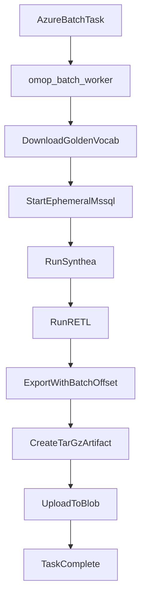

# Implement `omop batch-worker` for distributed OMOP generation

## Current Baseline (what we will leverage)
- Existing end-to-end local pipeline is in [`/Volumes/DAL/Fitfile/gitlab/FITFILE/Application/data-and-analytics/services/omop_generator/src/omop_cli/commands/etl_export.py`](/Volumes/DAL/Fitfile/gitlab/FITFILE/Application/data-and-analytics/services/omop_generator/src/omop_cli/commands/etl_export.py): start/resume MSSQL container, run Synthea, run ETL, export CDM CSV, archive.
- Container lifecycle is already encapsulated in [`/Volumes/DAL/Fitfile/gitlab/FITFILE/Application/data-and-analytics/services/omop_generator/src/omop_cli/services/docker.py`](/Volumes/DAL/Fitfile/gitlab/FITFILE/Application/data-and-analytics/services/omop_generator/src/omop_cli/services/docker.py).
- ETL invocation/patching is in [`/Volumes/DAL/Fitfile/gitlab/FITFILE/Application/data-and-analytics/services/omop_generator/src/omop_cli/services/etl.py`](/Volumes/DAL/Fitfile/gitlab/FITFILE/Application/data-and-analytics/services/omop_generator/src/omop_cli/services/etl.py).
- Seeding/export schema expectations are in [`/Volumes/DAL/Fitfile/gitlab/FITFILE/Application/data-and-analytics/services/omop_generator/src/omop_cli/services/database.py`](/Volumes/DAL/Fitfile/gitlab/FITFILE/Application/data-and-analytics/services/omop_generator/src/omop_cli/services/database.py) and [`/Volumes/DAL/Fitfile/gitlab/FITFILE/Application/data-and-analytics/services/omop_generator/src/omop_cli/services/omop_tables.py`](/Volumes/DAL/Fitfile/gitlab/FITFILE/Application/data-and-analytics/services/omop_generator/src/omop_cli/services/omop_tables.py).
- Offset-aware remap metadata already exists in [`/Volumes/DAL/Fitfile/gitlab/FITFILE/Application/data-and-analytics/services/omop_generator/src/omop_cli/services/id_remap.py`](/Volumes/DAL/Fitfile/gitlab/FITFILE/Application/data-and-analytics/services/omop_generator/src/omop_cli/services/id_remap.py) with `ID_OFFSET_MULTIPLIER = 1_000_000_000` and `offset_for_batch(batch_index)`.

## CLI Design (`omop batch-worker`)
Add a new command module, e.g. [`/Volumes/DAL/Fitfile/gitlab/FITFILE/Application/data-and-analytics/services/omop_generator/src/omop_cli/commands/batch_worker.py`](/Volumes/DAL/Fitfile/gitlab/FITFILE/Application/data-and-analytics/services/omop_generator/src/omop_cli/commands/batch_worker.py), and register it in [`/Volumes/DAL/Fitfile/gitlab/FITFILE/Application/data-and-analytics/services/omop_generator/src/omop_cli/main.py`](/Volumes/DAL/Fitfile/gitlab/FITFILE/Application/data-and-analytics/services/omop_generator/src/omop_cli/main.py).

Proposed arguments for Azure Batch task definition:
- Required task identity:
  - `--batch-index INT` (must be >=1)
  - `--population INT`
- Synthea controls:
  - `--country TEXT` (default `GB`)
  - `--state TEXT` (default `England`)
  - `--synthea-csv-dir PATH` (default from `OmopConfig`)
- Golden vocabulary input:
  - `--vocab-archive-uri TEXT` (Azure Blob URL/SAS)
  - `--vocab-dir PATH` (local extract target)
  - `--skip-vocab-download` (for debugging/local reruns)
- Worker output destinations:
  - `--output-dir PATH` (batch-local final artifact directory)
  - `--output-archive-name TEXT` (default `omop_batch_<batch-index>.tar.gz`)
  - `--upload-uri TEXT` (Blob destination URL/SAS for final archive)
  - `--skip-upload` (for dry/debug)
- Runtime controls:
  - `--keep-container`, `--no-stop`, `--reuse-db`, `--reuse-vocab`, `--reset-cdm` (reuse existing semantics)
  - `--no-archive` (optional; default should archive for batch artifacts)

Validation rules:
- `batch_index >= 1`; `population > 0`.
- Require `vocab-archive-uri` unless `--skip-vocab-download`/`--reuse-vocab`.
- Require `upload-uri` unless `--skip-upload`.
- Fail fast if output archive would overwrite unless explicit overwrite flag.

## Internal Execution Flow (Phase C worker)
Implement command orchestration as a thin wrapper around existing services, with explicit deterministic steps:

1. **Preflight + context logging**
   - Resolve config/work dirs, log `batch_index`, `population`, paths, and dry-run mode.

2. **Acquire golden vocab locally**
   - Download `omop-vocab-golden.tar.gz` from `--vocab-archive-uri` to worker temp path.
   - Extract only vocab payload into `--vocab-dir`.
   - Mark via manifest/marker file that vocab is ready for this task.

3. **Start ephemeral MSSQL container**
   - Use existing `DockerMssql.start()/wait_ready()` logic from `docker.py`.
   - Honor existing root/global options (`--container-name`, ports, SA password, etc.).

4. **Apply DDL and optionally reset CDM**
   - Reuse `_apply_ddl()` and `_reset_cdm_clinical_data()` behavior from `etl_export.py`.

5. **Generate synthetic patients**
   - Invoke `SyntheaService` with `--population`, geography options, and worker-local output dir.

6. **Run ETL**
   - Use `EtlService.patch_etl_sql()` and `EtlService.run(...)` exactly as current pipeline.

7. **Export CDM CSV with batch offset**
   - Reuse/export function path, but pass `batch_index` to offset surrogate IDs during query projection.

8. **Archive batch outputs**
   - Create task artifact `.tar.gz` containing `cdm/` (+ optionally vocab if needed by downstream contract).
   - Include a worker manifest (`batch_index`, population, row counts, checksum).

9. **Upload artifact to Blob**
   - Push archive to `--upload-uri`; verify checksum/size after upload.

10. **Cleanup + exit contract**
   - Stop/remove container unless keep flags are set.
   - Return non-zero on any stage failure; keep partial files for debug when requested.

## ID Remapping Strategy (recommended)
Recommendation: **apply offset in SQL projection during export**, not Python post-processing.

Why this is most robust for current code:
- Export already streams via DB cursor in batches; SQL projection keeps the Python path memory-safe and simple.
- Existing remap schema in `id_remap.py` already encodes which columns are surrogate IDs (including special handling patterns).
- SQL-side remap avoids Python per-cell branching at multi-million scale and reduces serialization overhead.

Implementation detail:
- Extend exporter in [`/Volumes/DAL/Fitfile/gitlab/FITFILE/Application/data-and-analytics/services/omop_generator/src/omop_cli/commands/etl_export.py`](/Volumes/DAL/Fitfile/gitlab/FITFILE/Application/data-and-analytics/services/omop_generator/src/omop_cli/commands/etl_export.py) to accept optional `batch_index`.
- Build table-specific `SELECT` lists:
  - For remapped columns: `CAST(column + <offset> AS BIGINT) AS column`.
  - For non-remapped columns: pass-through.
  - Keep `NULL` safe via `CASE WHEN column IS NULL THEN NULL ELSE column + <offset> END`.
- Source mapping metadata from `REMAP_SCHEMA` + `offset_for_batch()` in `id_remap.py`.
- Keep plain `SELECT *` when batch mode is off.

Notes on `fact_relationship`:
- Preserve domain-conditional remap behavior as defined in `id_remap.py` helper(s), and explicitly test this table because its IDs are not uniformly offset columns.

## Concrete file-level implementation sequence
1. Add new command module and wiring:
   - [`/Volumes/DAL/Fitfile/gitlab/FITFILE/Application/data-and-analytics/services/omop_generator/src/omop_cli/commands/batch_worker.py`](/Volumes/DAL/Fitfile/gitlab/FITFILE/Application/data-and-analytics/services/omop_generator/src/omop_cli/commands/batch_worker.py)
   - [`/Volumes/DAL/Fitfile/gitlab/FITFILE/Application/data-and-analytics/services/omop_generator/src/omop_cli/main.py`](/Volumes/DAL/Fitfile/gitlab/FITFILE/Application/data-and-analytics/services/omop_generator/src/omop_cli/main.py)
2. Refactor shared pipeline steps out of `etl_export.py` into reusable helpers callable by both commands.
3. Extend export internals in `etl_export.py` + `id_remap.py` integration for SQL offset projection.
4. Add Blob I/O service abstraction (new module), e.g. `services/blob_storage.py`, for download/upload.
5. Extend archive manifest content in `services/archive.py` with batch metadata.
6. Add tests:
   - CLI argument validation for `batch-worker`.
   - Unit tests for SQL projection generation and null handling.
   - Integration test for one small batch ensuring IDs are offset and FKs still resolve.

## Azure Batch task contract example
Expected invocation pattern:
- `omop --work-dir /mnt/batch/tasks/workitems/... batch-worker --batch-index 17 --population 100000 --vocab-archive-uri <sas_url> --upload-uri <sas_url> --output-archive-name omop_batch_17.tar.gz`

This provides deterministic, stateless task execution aligned with fan-out/fan-in architecture.