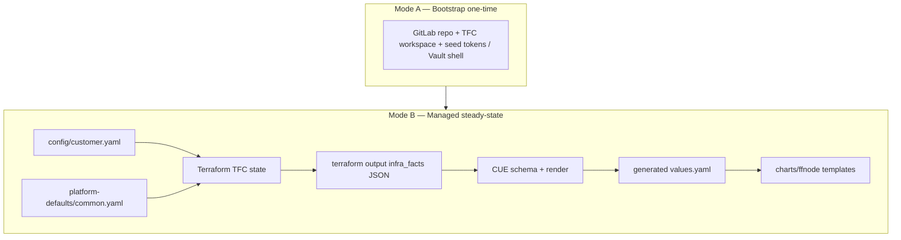

## Data-first Split (redo): Anchored on `ff-test-1/docs`

### Canonical Documentation Set

These are the new customer deployment plans and contracts (not `helm_chart_deployment/docs`):

| Doc | Role |
|-----|------|
| [CONTRACTS.md](file:///Volumes/DAL/Fitfile/gitlab/FITFILE/New_Customer/ff-test-1/docs/CONTRACTS.md) | Interface SSOT—Terraform → CUE → Helm layers, merge semantics, `infra_facts` shape pointers |
| [TERRAFORM_STATE_AS_SOURCE_OF_TRUTH.md](file:///Volumes/DAL/Fitfile/gitlab/FITFILE/New_Customer/ff-test-1/docs/TERRAFORM_STATE_AS_SOURCE_OF_TRUTH.md) | Strategic north star—TFC state should feed CUE; gaps (live outputs not in `infra_facts`, script re-derivation) |
| [Planning Prompt Data-First State-as-Source-of-Truth.md](file:///Volumes/DAL/Fitfile/gitlab/FITFILE/New_Customer/ff-test-1/docs/Planning%20Prompt%20Data-First%20%20State-as-Source-of-Truth.md) | Audit checklist—per-domain lifecycle (central services, private infra, bootstrap-only) |
| [Single Source of Truth Customer Deployment Plan.md](file:///Volumes/DAL/Fitfile/gitlab/FITFILE/New_Customer/ff-test-1/docs/Single%20Source%20of%20Truth%20Customer%20Deployment%20Plan.md) | Target model—Mode A bootstrap vs Mode B managed; repo ownership; thin `customer.yaml` |
| [Surgical Bootstrap Refactor — GitLab + Terraform Cloud Only.md](file:///Volumes/DAL/Fitfile/gitlab/FITFILE/New_Customer/ff-test-1/docs/Surgical%20Bootstrap%20Refactor%20%E2%80%94%20GitLab%20%2B%20Terraform%20Cloud%20Only.md) | Bootstrap minimalism—only what GitOps needs to start |
| [MIGRATION_PLAYBOOK.md](file:///Volumes/DAL/Fitfile/gitlab/FITFILE/New_Customer/ff-test-1/docs/MIGRATION_PLAYBOOK.md) / [MASTER_REMEDIATION_PLAN.md](file:///Volumes/DAL/Fitfile/gitlab/FITFILE/New_Customer/ff-test-1/docs/MASTER_REMEDIATION_PLAN.md) | Operational remediation—tiers A–D, three "generations" of process |

The diagram in CONTRACTS.md is the authoritative layer stack for "where data goes."

---

### Target Data Flow (from Your Own docs)

Single Source of Truth Customer Deployment Plan states the split clearly: bootstrap creates only control-plane prerequisites; managed mode is Terraform → `infra_facts` → CUE → Helm values → ArgoCD.

Data-first / state-SoT prompt adds: after bootstrap, downstream consumers should read only `terraform output` into CUE—not shell formulas or duplicated literals from `customer.yaml`.

---

### Where Each Kind of Data Should Go (repo ownership)

Aligned with Single Source of Truth Customer Deployment Plan + CONTRACTS.md:

| Layer | Owns | Should not own |
|-------|------|----------------|
| config/customer.yaml | Human decisions—identity, network CIDR, env, feature overrides, sizing | Platform constants; secrets that belong in Vault |
| platform-defaults/common.yaml | `standard_deployment`, `platform_policy`, vault catalogs, shared defaults | Customer-specific topology |
| Terraform (`locals.tf`, modules) | Resources, computed names/FQDNs, merged config, `infra_facts` assembly | App logic better expressed in CUE; avoid re-implementing merge in scripts |
| CUE | `#InfraFacts` contract, validation, mapping `infra_facts` + `platform_policy` → Helm-shaped values | Not a second store of customer literals (your docs call this out explicitly) |
| Helm (`helm_chart_deployment`) | Chart templates, subcharts, mechanical defaults for `helm template` | Business rules and product policy duplicated from common/customer |

CUE "too much hardcoded deployment detail" in the plan doc means: resist putting customer-specific data in CUE files; keep it in YAML → Terraform → `infra_facts`.

---

### What is Still Mixed (from TERRAFORM_STATE + CONTRACTS)

#### 1. `infra_facts` Is Mostly Plan-time Config, not Live Resource Attributes

[TERRAFORM_STATE_AS_SOURCE_OF_TRUTH.md](file:///Volumes/DAL/Fitfile/gitlab/FITFILE/New_Customer/ff-test-1/docs/TERRAFORM_STATE_AS_SOURCE_OF_TRUTH.md) documents that aside from `values_repo_url`, most `infra_facts` fields are built from merged YAML + locals, not read back from Azure/Auth0/GitLab outputs. That is not yet the full "state as SoT" vision—it is the aspirational gap your docs name.

Structural outputs that already exist in TF (e.g. `oidc_issuer_url`, `ingress_ip`) should flow through `infra_facts` so CUE/Helm do not re-derive or guess.

#### 2. Dual Truth path—scripts/infra-facts-for-cue.sh

Same doc: the script overrides `terraform output infra_facts` with re-reads from `customer.yaml` and recomputed fields. That breaks determinism and contradicts CONTRACTS.md ("consumer: CUE ingests Terraform output"). The prescribed fix is trust TF output; stale state becomes an error, not a silent override.

#### 3. Three "generations" of Deployment Model (why it Feels tangled)

Single Source of Truth Customer Deployment Plan lists overlapping models: legacy central-services/manual paths, bootstrap-era repos, and Terraform → CUE → Helm. PIPELINE_AUDIT / MASTER_REMEDIATION_PLAN reinforce that. Mixed visibility of old and new flows is a process problem as much as a code problem.

#### 4. Bootstrap Vs Steady-state Still Partially Intertwined

Your Surgical Bootstrap and Migration docs aim to separate one-time setup from GitOps steady state. Until bootstrap outputs and managed `infra_facts` are clearly bounded, docs stay "true but hard to use."

#### 5. Helm Chart repo—duplicated Defaults Vs CONTRACTS Stack

[charts/ffnode/values.yaml](file:///Volumes/DAL/Fitfile/gitlab/FITFILE/Deployment/helm_chart_deployment/charts/ffnode/values.yaml) plus [helm_chart_deployment/cue/base + schema](file:///Volumes/DAL/Fitfile/gitlab/FITFILE/Deployment/helm_chart_deployment/cue/) still create a parallel values document for local `argo-render` and validation—outside the `ff-test-1` CONTRACTS path. That is implementation packaging duplicating policy-shaped defaults already owned by `platform_policy` / CUE render.

#### 6. Federation / fitConnect Topology

[Network Topography & fitConnectHosts.md](file:///Volumes/DAL/Fitfile/gitlab/FITFILE/New_Customer/ff-test-1/docs/Network%20Topography%20%26%20fitConnectHosts.md) belongs in the same data-invariant conversation as Helm helpers: rules should be constraints on `fitconnect_hosts` in CUE or tests, not only template behavior.

---

### Optimizations (prioritized like Your Remediation tiers)

Tier 0—Truth pipe (highest leverage, matches your own TERRAFORM_STATE doc)

- Extend `infra_facts` with live structural outputs that Terraform already has (OIDC URL, ingress IP, etc.); update `#InfraFacts` + mock JSON.
- Remove `infra-facts-for-cue.sh` overrides so `make generate-values` is single-writer from TF output.

Tier 1—Ownership clarity (no architectural debate)

- Keep CONTRACTS.md as the only place that defines merge semantics and layer responsibilities; thin `customer.yaml` per Single Source plan.
- CUE stays mapping + validation, not a second `customer.yaml`.

Tier 2—Helm repo duplication

- Pick one: generate chart defaults from one canonical CUE base, shrink chart `values.yaml` to minimal library defaults, or publish a small versioned contract between repos—same trade-offs as before, but now explicitly downstream of a clean `infra_facts` pipe.

Tier 3—Invariants

- CUE checks (or policy tests) for federation rules documented in Network Topography / operational audits.

Tier 4—Docs UX

- Optional index in `ff-test-1/docs` linking CONTRACTS ↔ bootstrap ↔ remediation so "new customer" onboarding hits one narrative.

---

### Summary

- Your `ff-test-1/docs` already define the right split: bootstrap vs managed, thin customer.yaml, Terraform → `infra_facts` → CUE → Helm, and CONTRACTS.md as the interface SSOT.
- The mixing you feel is explained in-repo: (a) `infra_facts` not yet carrying enough live state, (b) script overrides of TF output, (c) three generations of process, (d) Helm chart defaults parallel to the CONTRACTS/CUE path.
- Optimize by fixing the truth pipe first (Tier 0), then thinning Helm defaults (Tier 2), then invariants + doc index—aligned with TERRAFORM_STATE_AS_SOURCE_OF_TRUTH.md and Single Source of Truth Customer Deployment Plan.md.

No code execution in this document; implementation follows the linked remediation and migration playbooks once you choose to execute.
