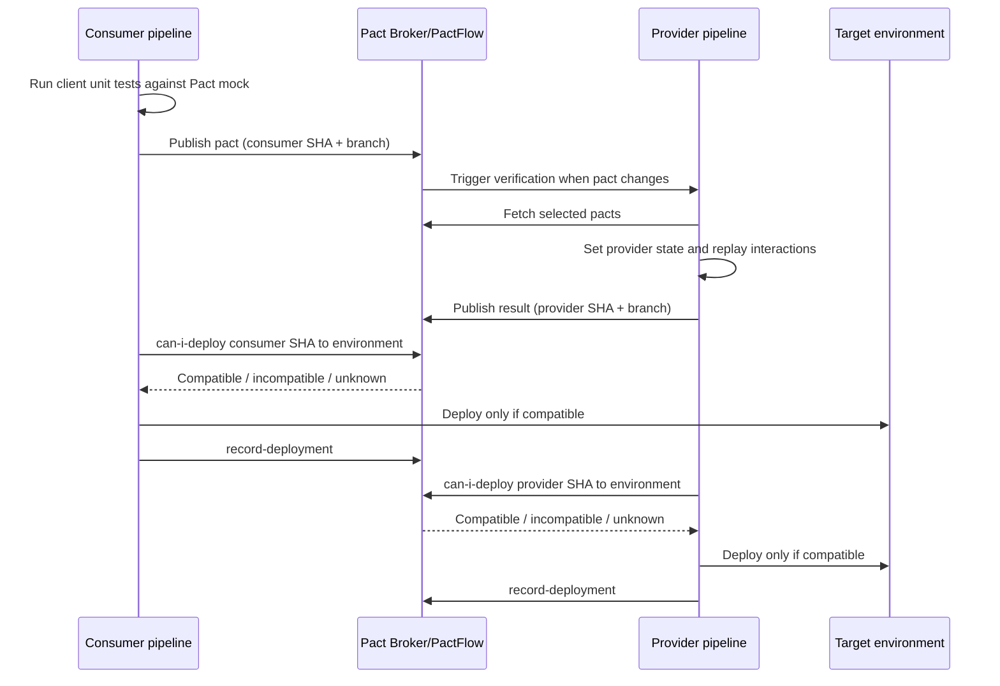

# Pact Contract Testing: LLM Context Pack and GitLab CI/CD Guide

## Direct recommendation

Build the LLM context as a small, version-controlled **Pact operating model**, not as a dump of the documentation website. Anchor it in Pact’s official conceptual, testing, Broker, CI/CD, and language-specific guides; then add repository facts such as service names, provider states, commands, environments, and GitLab topology.

For a deployable GitLab implementation, use a Pact Broker or PactFlow as the system of record. The target workflow is: consumer test and publish; provider verify and publish results; `can-i-deploy` before each deployment; deploy; then `record-deployment`. Broker webhooks or GitLab multi-project pipelines provide fast cross-repository verification feedback.[^1][^2][^3]

## Canonical documentation

These are the primary pages to give an LLM. Prefer links and short local summaries over copied documentation, so upstream fixes remain discoverable and the local context stays reviewable.

| Priority | Official document | What the LLM should learn |
|---|---|---|
| 1 | [Pact introduction](https://docs.pact.io/) | Pact is code-first, consumer-driven contract testing for HTTP and message integrations.[^4] |
| 2 | [Conceptual overview](https://docs.pact.io/getting_started/conceptual_overview) | Pact publication, consumer/provider versions, pact versions, pacticipants, branches, environments, and verification results.[^5] |
| 3 | [How Pact works](https://docs.pact.io/getting_started/how_pact_works) | Consumer mock-server lifecycle, provider verification, isolated interactions, message pacts, and testing boundaries.[^6] |
| 4 | [Five-minute guide](https://docs.pact.io/5-minute-getting-started-guide) | A short end-to-end practical introduction: generate, publish, and verify a pact.[^7] |
| 5 | [Consumer testing](https://docs.pact.io/consumer) | Consumer tests should primarily be unit tests of the real API client and express only what the consumer uses.[^8] |
| 6 | [Matching](https://docs.pact.io/getting_started/matching) | Exact request expectations, flexible response matching, deterministic examples, and avoiding brittle contracts.[^9] |
| 7 | [Provider states](https://docs.pact.io/getting_started/provider_states) | Provider-state names describe provider preconditions and each interaction must be set up in isolation.[^10] |
| 8 | [Pact Broker](https://docs.pact.io/pact_broker) | Contract exchange, verification results, matrix, webhooks, deployment safety, and self-hosted versus hosted operation.[^1] |
| 9 | [Broker setup checklist](https://docs.pact.io/pact_broker/set_up_checklist) | High-level consumer, provider, webhook, deployment, and compatibility-gate requirements.[^11] |
| 10 | [CI/CD setup guide — Pact Nirvana](https://docs.pact.io/pact_nirvana) | Incremental adoption from one local test through PR verification and deployment gates.[^12] |
| 11 | [Publishing configuration](https://docs.pact.io/consumer/recommended_configuration) | Use Git SHA for the application version and the real Git branch as the Broker branch.[^13] |
| 12 | [Broker versioning](https://docs.pact.io/getting_started/versioning_in_the_pact_broker) | Versions must be unique, traceable to source, known before release, and consistent when one application is both consumer and provider.[^14] |
| 13 | [Branches](https://docs.pact.io/pact_broker/branches) | First-class Broker branches, main-branch configuration, selectors, and migration away from branch tags.[^15] |
| 14 | [Pending pacts](https://docs.pact.io/pact_broker/advanced_topics/pending_pacts) | New consumer requirements can be verified without incorrectly breaking the provider’s build; accepted contracts still protect compatibility.[^16] |
| 15 | [WIP pacts](https://docs.pact.io/pact_broker/advanced_topics/wip_pacts) | Newly changed head contracts are automatically brought into provider verification as pending feedback.[^17] |
| 16 | [PactFlow AI Assistant Skill](https://docs.pact.io/ai_tools/pactflow-skill) | Official AI context, CLI use, broker-aware MCP tools, CI scaffolding, provider-state reuse, and diagnostics.[^3] |
| 17 | [Pact University](https://docs.pact.io/university) | Hands-on introductory and CI/CD workshops.[^18] |
| 18 | [Pact FAQ](https://docs.pact.io/faq) | Suitability, limitations, and what contract tests do not replace.[^19] |

Add exactly one implementation guide matching each repository’s language and framework. For example, the current official guides include [Pact JS overview](https://docs.pact.io/implementation_guides/javascript/readme), [Pact JS provider verification](https://docs.pact.io/implementation_guides/javascript/docs/provider), [JVM JUnit provider verification](https://docs.pact.io/implementation_guides/jvm/provider/junit), [JVM Gradle provider verification](https://docs.pact.io/implementation_guides/jvm/provider/gradle), and [Pact Python examples](https://docs.pact.io/implementation_guides/python/examples).[^20][^21][^22][^23][^24]

For GitLab mechanics, use the official [downstream pipeline guide](https://docs.gitlab.com/ci/pipelines/downstream_pipelines/), [pipeline trigger guide](https://docs.gitlab.com/ci/triggers/), [CI job token guide](https://docs.gitlab.com/ci/jobs/ci_job_token/), [CI/CD variables guide](https://docs.gitlab.com/ci/variables/), and [YAML reference](https://docs.gitlab.com/ci/yaml/).[^25][^26][^27][^28][^29]

## Mental model

A Pact is a collection of interactions between a **consumer** and a **provider**. For HTTP, the consumer initiates the request and the provider returns the response; for asynchronous messaging, the consumer reads the message and the provider or producer writes it.[^6]

Consumer tests register an expected interaction with a Pact mock provider, exercise the real client code, and assert that the client understands the generated response. Successful tests emit a pact file; provider verification later replays each request against the real provider and checks its response against the consumer’s minimal expectations.[^20][^6]

The Broker joins the independently running pipelines. It stores publications and verification results, builds a compatibility matrix, triggers provider verification when contract content changes, and answers whether a particular application version is safe to deploy alongside versions already present in an environment.[^2][^1]



## Concepts to encode

| Concept | Repository rule |
|---|---|
| Application version | Use `CI_COMMIT_SHA`; it uniquely identifies the build and is available before deployment.[^13][^14] |
| Branch | Publish `CI_COMMIT_REF_NAME` or an equivalent canonical branch value; do not model branches as environment tags in a new setup.[^15][^13] |
| Main branch | Register the real default branch for every pacticipant so `mainBranch` selectors work.[^16][^15] |
| Environment | Use one canonical vocabulary across all projects, for example `development`, `staging`, and `production`; record a deployment only after it succeeds.[^30] |
| Pact version | Content-derived contract version managed by the Broker; it is not the consumer application version.[^1][^5] |
| Provider states | Named provider preconditions such as `order 123 exists`; handlers create deterministic state before each isolated interaction.[^10] |
| Matching rules | Be strict about requests under consumer control and flexible about response values unless an exact value is behaviorally required.[^9] |
| Selectors | Provider verification should cover consumer main branches, relevant matching branches, and versions currently deployed or released.[^3][^31] |
| Pending | A changed contract has not yet been accepted by the relevant provider branch; verify it, publish feedback, but do not blame the provider for a new unsupported consumer requirement.[^16] |
| WIP | Pull recent, otherwise unselected, pending head pacts into verification to give consumer branches automatic feedback.[^17] |
| Compatibility gate | `can-i-deploy` queries existing matrix evidence; it does not run tests itself.[^1][^32] |
| Deployment record | `record-deployment` updates the Broker’s model of which single service version is active in an environment; use release semantics where multiple versions coexist.[^30][^3] |

## Test-design rules

- Test the real consumer API client against the Pact mock rather than testing a hand-built request detached from production code.[^8][^6]
- Define only interactions the consumer actually uses and only response fields it needs; extra provider fields are intentionally ignored during provider verification.[^9][^24][^6]
- Use deterministic examples in published contracts. Random values change contract content, prevent verification-result reuse, and create avoidable Broker churn.[^14][^9]
- Use exact matching for meaningful request values and structural/type or format matching for variable response values such as identifiers and timestamps.[^33][^9]
- Give every data-dependent interaction a provider state; set up each interaction independently and avoid dependencies on test execution order.[^10][^6]
- Cover consumer-relevant failure paths, such as the 404 or 401 responses the client handles, without turning Pact into a full provider functional test suite.[^34][^19][^24]
- For Kafka, SNS, SQS, or similar systems, contract-test the domain port that consumes or produces the payload, not the messaging infrastructure or broker adapter.[^6]

Pact does not replace provider unit/functional tests, end-to-end tests for a few critical journeys, performance tests, security tests, or tests of request side effects. It is strongest where consumer and provider teams can collaborate and control both sides of the integration.[^19]

## GitLab pipeline design

### Consumer project

1. Run consumer Pact tests in the ordinary test stage.
2. Keep generated pact JSON as a short-lived GitLab artifact for troubleshooting, but publish it to the Pact Broker as the durable exchange mechanism.
3. Publish using `CI_COMMIT_SHA` and the canonical branch name.
4. Let the Broker webhook start provider verification when the contract content needs verification.
5. Before each environment deployment, call `can-i-deploy` for the exact consumer SHA and target environment.
6. After a successful deployment, call `record-deployment` for that exact SHA and environment.[^11][^13][^1]

### Provider project

1. Start the provider with controlled dependencies or a verification test harness.
2. Retrieve pacts using consumer version selectors rather than downloading an arbitrary `latest` contract.
3. Include consumer main-branch, matching-branch where coordinated feature work is used, and deployed/released selectors.
4. Enable pending and recent WIP pacts.
5. Execute provider-state handlers and replay every selected interaction.
6. Publish verification results only from trusted CI, attaching `CI_COMMIT_SHA` and the provider branch.
7. Run `can-i-deploy` before deployment and `record-deployment` only after deployment succeeds.[^3][^16][^17][^31][^23]

### Cross-project trigger

Separate consumer and provider repositories map naturally to GitLab multi-project pipelines. A Broker webhook can call GitLab’s pipeline trigger API and pass the changed pact URL or identifiers; alternatively, a consumer job can use `trigger:project` or the API with `CI_JOB_TOKEN`, provided permissions and job-token allowlists are configured.[^27][^35][^11][^25]

Prefer the Broker webhook for contract-change events because it can avoid provider builds when pact content is unchanged and keeps event knowledge in the contract system. Prefer a GitLab multi-project trigger when organisational policy disallows Broker callbacks or the projects require tighter GitLab-native orchestration.

If the upstream pipeline must reflect the downstream result, use `trigger:strategy: mirror`; GitLab documents `strategy: depend` as not recommended for status mirroring. Use `rules` and recognise that a multi-project downstream pipeline has `CI_PIPELINE_SOURCE=pipeline`.[^25]

## Generic CI skeleton

This deliberately leaves the test commands language-specific. Replace the `./scripts/...` commands after inspecting the repository’s package manager, Pact implementation, provider startup model, and deployment mechanism.

```yaml
stages:
  - test
  - contract-publish
  - contract-gate
  - deploy
  - contract-record

variables:
  PACTICIPANT_VERSION: "$CI_COMMIT_SHA"
  PACTICIPANT_BRANCH: "$CI_COMMIT_REF_NAME"

consumer-contract-test:
  stage: test
  script:
    - ./scripts/test-consumer-pacts
  artifacts:
    when: always
    expire_in: "7 days"
    paths:
      - pacts/

publish-consumer-pacts:
  stage: contract-publish
  needs:
    - job: consumer-contract-test
      artifacts: true
  script:
    - >-
      pact-broker publish pacts
      --consumer-app-version "$PACTICIPANT_VERSION"
      --branch "$PACTICIPANT_BRANCH"
  rules:
    - if: '$CI_COMMIT_BRANCH'

can-deploy-staging:
  stage: contract-gate
  script:
    - >-
      pact-broker can-i-deploy
      --pacticipant "$PACTICIPANT_NAME"
      --version "$PACTICIPANT_VERSION"
      --to-environment staging
  rules:
    - if: '$CI_COMMIT_BRANCH == $CI_DEFAULT_BRANCH'

deploy-staging:
  stage: deploy
  needs: ["can-deploy-staging"]
  environment:
    name: staging
  script:
    - ./scripts/deploy staging "$PACTICIPANT_VERSION"
  rules:
    - if: '$CI_COMMIT_BRANCH == $CI_DEFAULT_BRANCH'

record-staging-deployment:
  stage: contract-record
  needs: ["deploy-staging"]
  script:
    - >-
      pact-broker record-deployment
      --pacticipant "$PACTICIPANT_NAME"
      --version "$PACTICIPANT_VERSION"
      --environment staging
  rules:
    - if: '$CI_COMMIT_BRANCH == $CI_DEFAULT_BRANCH'
```

The provider’s contract job is normally a language-level test command rather than a sequence of CLI calls. Its configuration must fetch Broker-selected pacts, enable pending/WIP behavior, set the provider SHA and branch, and publish results only when `CI=true`; Pact’s exact option names differ by implementation.[^21][^22][^23]

```yaml
provider-contract-verification:
  stage: test
  variables:
    PACT_PROVIDER_VERSION: "$CI_COMMIT_SHA"
    PACT_PROVIDER_BRANCH: "$CI_COMMIT_REF_NAME"
    PACT_PUBLISH_VERIFICATION_RESULTS: "true"
  script:
    - ./scripts/start-provider-for-verification
    - ./scripts/verify-provider-pacts
  rules:
    - if: '$CI_PIPELINE_SOURCE == "merge_request_event"'
    - if: '$CI_PIPELINE_SOURCE == "push"'
    - if: '$CI_PIPELINE_SOURCE == "pipeline"'
```

Do not silently mark the Pact publish or verification jobs with `allow_failure: true`. Pending-pact semantics distinguish a consumer-introduced unaccepted contract from a provider regression; a blanket GitLab allowance discards this evidence.[^16][^23]

## Secrets and trust

Store `PACT_BROKER_TOKEN`, or the OSS Broker username and password, in GitLab project/group settings rather than `.gitlab-ci.yml`. Mask sensitive values, hide them when appropriate, scope them to environments where possible, and protect production-capable credentials so they are unavailable to untrusted refs.[^36][^29]

Do not forward a masked secret from an upstream project as an ordinary multi-project pipeline variable: GitLab warns that masking configuration is not transferred and the value can appear unmasked downstream. Define Broker credentials independently in each trusted project, use an external secret manager, or use narrowly scoped GitLab job-token flows for GitLab-to-GitLab authentication.[^29][^27][^25]

Review every CI configuration change before exposing protected variables. Masking reduces accidental log exposure but does not prevent malicious pipeline code from exfiltrating a secret.[^29]

## LLM context structure

Use the following version-controlled structure in a shared engineering-context repository or in each service repository under `docs/contract-testing/`:

```text
docs/contract-testing/
├── README.md                    # Reading order and current adoption level
├── 00-scope-and-non-goals.md    # What Pact covers and what remains elsewhere
├── 01-domain-model.md           # Consumer/provider/pact/version/branch/environment
├── 02-consumer-testing.md       # Local DSL patterns and test commands
├── 03-provider-verification.md  # Harness, selectors, states, auth, dependencies
├── 04-broker-workflow.md        # Publish, matrix, pending, WIP, webhooks
├── 05-gitlab-pipeline.md        # Jobs, rules, triggers, gates, deployment records
├── 06-service-catalog.yaml      # Pacticipant names, roles, repos, owners
├── 07-provider-states.yaml      # Canonical state names and handlers
├── 08-environments.yaml         # Canonical names and deployment semantics
├── 09-troubleshooting.md        # Failure signatures and diagnostic order
├── decisions/                   # ADRs: Broker choice, trigger model, selectors
└── sources.md                   # Canonical links and last-reviewed dates
```

The LLM should read local facts before generating code. In particular, it must discover the project language and build tool, inspect existing tests and `.gitlab-ci.yml`, resolve registered pacticipant names, find the provider’s test-startup path, catalogue existing provider states, and identify the actual deployment environments.

### Service catalog schema

```yaml
schema_version: 1
pacticipants:
  - name: CheckoutWeb
    repository: group/checkout-web
    role: consumer
    main_branch: main
    language: typescript
    pact_implementation: pact-js
    contract_test_command: npm run test:pact
    pact_output: pacts/
    providers:
      - PaymentsAPI

  - name: PaymentsAPI
    repository: group/payments-api
    role: provider
    main_branch: main
    language: java
    pact_implementation: pact-jvm
    verification_command: ./gradlew pactVerify
    consumers:
      - CheckoutWeb

environments:
  - development
  - staging
  - production
```

### Provider-state registry

```yaml
schema_version: 1
providers:
  PaymentsAPI:
    states:
      - name: a payment with ID 123 exists
        owner: payments-team
        handler: src/test/.../PactProviderStates.java
        parameters: [paymentId]
        isolation: transaction-rollback
      - name: no payment with ID 123 exists
        owner: payments-team
        handler: src/test/.../PactProviderStates.java
        parameters: [paymentId]
        isolation: transaction-rollback
```

Provider-state vocabulary is part of the collaboration interface. Reusing exact state names avoids duplicate setup code and makes generated consumer interactions executable against the provider; Pact’s official SmartBear MCP guidance explicitly recommends retrieving existing provider states before generating tests.[^37]

## Agent contract

Place a concise instruction block in `AGENTS.md`, `CLAUDE.md`, or the coding assistant’s equivalent:

```markdown
## Pact contract-testing rules

1. Read `docs/contract-testing/README.md`, the service catalog, state registry,
   and relevant implementation guide before proposing changes.
2. Never invent a pacticipant name, provider state, environment, command, or path.
   Discover it from the repository or Broker; ask if it cannot be resolved.
3. Use the Git commit SHA as the Pact application version and the canonical Git
   branch as the Broker branch.
4. Consumer tests must exercise the production API client against the Pact mock.
5. Contract only consumer-used fields and scenarios; use deterministic examples.
6. Provider verification must use selectors, include deployed/released consumers,
   enable pending/WIP behavior, and publish results only from CI.
7. Run `can-i-deploy` before deployment and `record-deployment` only after success.
8. Never put Broker credentials in source or forward masked secrets as ordinary
   cross-project variables.
9. Do not change application code, contracts, and CI in one unreviewed step.
   Produce a plan and diff, then run the narrowest relevant tests.
10. Report unknown matrix results separately from failed verification results.
```

This contract addresses a common LLM failure mode: generating syntactically plausible Pact code without matching the repository’s Pact library version, state vocabulary, Broker names, or release topology.

## Retrieval strategy

A compact retrieval collection should chunk by concept rather than arbitrary token count. Each chunk should carry metadata such as `source_url`, `source_kind`, `language`, `pact_spec`, `last_reviewed`, `applies_to`, and `authority`; official Pact and GitLab documentation should rank above local examples, while local repository facts should rank above generic code examples.

Suggested retrieval groups:

- **Concepts:** consumer, provider, interaction, pacticipant, publication, verification result, matrix.
- **Test authoring:** client execution, matchers, generators, provider states, messages, authentication.
- **Broker workflow:** versions, branches, environments, selectors, pending, WIP, webhooks.
- **Release safety:** `can-i-deploy`, deployment versus release, compatibility diagnostics.
- **GitLab:** pipeline sources, `rules`, artifacts, multi-project triggers, inputs, job-token allowlists, secrets.
- **Repository facts:** exact paths, commands, versions, names, environment vocabulary, ownership.

Treat `llms.txt` as an optional index pattern, not as the knowledge base itself. The convention is designed to point an agent to concise background and canonical detailed resources, and it should be tested by asking questions with only the index as the starting context.[^38]

## Official AI integration

Before building all Pact knowledge from scratch, evaluate the official PactFlow skill. The documented skill supports open-source Pact Broker and PactFlow for core knowledge and CLI operations; a live SmartBear MCP connection adds structured Broker queries, provider-state discovery, matrix diagnostics, environment management, and webhook operations. PactFlow-only features include AI test generation/review and bi-directional contract testing.[^3]

For a vendor-neutral, multi-model setup, keep the local context pack and agent contract as the portable source. Optionally connect trusted assistants to the Broker through the CLI or MCP so they can validate current pacticipant names, states, matrix rows, deployments, and webhooks instead of reasoning from stale text.

## Adoption plan

### Phase 1 — Discovery

- Inventory every integration: consumer repository, provider repository, protocol, owners, deployment environments, and whether both sides are controlled.
- Identify each project’s language, Pact implementation, package version, test command, and CI architecture.
- Decide between self-hosted Pact Broker and PactFlow; the open-source Broker requires deployment and administration, while PactFlow is managed.[^7][^1]
- Agree exact pacticipant and environment names before publishing production data.

### Phase 2 — Thin vertical slice

- Choose one stable HTTP interaction with a controllable provider state.
- Write one consumer test around the production client.
- Verify the generated local pact against the provider locally.
- Add one error interaction the consumer genuinely handles.
- Do not introduce webhooks or deployment gates until this local slice is deterministic.

### Phase 3 — Broker evidence

- Publish the consumer pact with SHA and branch.
- Configure provider verification from Broker selectors and publish the result with provider SHA and branch.
- Enable pending pacts, then add a bounded WIP start date.
- Confirm the Broker matrix shows the expected consumer-provider pair.

### Phase 4 — Merge-request feedback

- Run consumer contract tests and publication in consumer merge-request pipelines.
- Trigger provider verification when pact content changes.
- Ensure a changed consumer contract receives provider feedback before merge.[^13][^11]
- Keep provider regressions blocking while new unaccepted consumer requirements remain pending.[^16]

### Phase 5 — Deployment safety

- Add `can-i-deploy` immediately before staging and production deployment.
- Record each successful deployment using the same SHA used for publication or verification.
- Configure provider selectors to include versions deployed or released in target environments.
- Test failure, unknown, rollback, redeployment, and webhook-outage paths before relying on the gate.

### Phase 6 — Reuse and governance

- Extract reviewed GitLab jobs into a versioned CI/CD component or shared include.
- Maintain a central service and provider-state catalog with team ownership.
- Add scheduled audits for stale branches, disabled webhooks, missing deployment records, unknown matrix rows, and inconsistent environment names.
- Record deviations in ADRs rather than letting each repository invent a subtly different workflow.

## Validation questions

Use these to test whether the LLM context is sufficient:

1. Why is a pact version different from a consumer application version?
2. Which SHA and branch will this pipeline publish, and where do they come from?
3. Which contracts will the provider verify on a feature branch, main, and before production?
4. What makes a failed pact pending, and when must it still fail the provider build?
5. Which production consumer contract protects a provider deployment from regression?
6. What happens if `can-i-deploy` returns unknown because no verification result exists?
7. Which job records deployment, and can it run after a failed deployment?
8. How is a provider pipeline triggered when pact content changes but consumer code changes do not alter the pact?
9. Where are Broker credentials stored, and can they reach untrusted merge-request code?
10. Which existing provider-state name and handler should a newly generated consumer test reuse?
11. Is the integration HTTP, synchronous message, or asynchronous message, and which code is the test port?
12. Which tests remain necessary because Pact does not verify side effects, load, security, or complete business behavior?

If the assistant cannot answer these from repository facts plus canonical documentation, the context pack is not ready to generate production CI changes.

---

## References

1. [Introduction - Pact Docs](https://docs.pact.io/pact_broker) - The Pact Broker is an application for sharing consumer driven contracts and verification results. Ge...

2. [Overview](https://docs.pact.io/pact_broker/overview) - The Pact Broker is a service that supports contract testing by enabling the exchange of pacts and ve...

3. [PactFlow AI Assistant Skill - Pact Docs](https://docs.pact.io/ai_tools/pactflow-skill) - The PactFlow skill turns your AI coding assistant into a Pact and PactFlow contract testing expert. ...

4. [Pact Docs: Introduction](https://docs.pact.io/) - Pact is a code-first tool for testing HTTP and message integrations using contract tests . Get start...

5. [Conceptual Overview](https://docs.pact.io/getting_started/conceptual_overview) - Using Pact successfully requires you to understand how Pact works and the concepts and terminology b...

6. [How Pact works](https://docs.pact.io/getting_started/how_pact_works) - Remember these definitions from the introduction:

7. [5 minute guide - Pact Docs](https://docs.pact.io/5-minute-getting-started-guide) - The Pact Broker is an open source tool that requires you to deploy, administer and host it yourself....

8. [Writing Consumer tests | Pact Docs](https://docs.pact.io/consumer) - When thinking about authoring consumer pact tests: start with the goal of writing a good set of unit...

9. [Matching - Pact Docs](https://docs.pact.io/getting_started/matching) - This section describes the various request/response matching techniques available in your Consumer t...

10. [Provider states](https://docs.pact.io/getting_started/provider_states) - A good way to think about Provider States is that they are the necessary preconditions for a particu...

11. [Set up Checklist | Pact Docs](https://docs.pact.io/pact_broker/set_up_checklist) - This is a high level check list of things that need to be done when setting up an integration to be ...

12. [CI/CD Setup Guide - Pact Docs](https://docs.pact.io/pact_nirvana) - Or "The steps for reaching Pact Nirvana"

13. [Recommended configuration for publishing pacts - Pact Docs](https://docs.pact.io/consumer/recommended_configuration) - Using Pact + the Pact Broker in your release pipeline works most naturally if you are using a branch...

14. [Versioning in the Pact Broker](https://docs.pact.io/getting_started/versioning_in_the_pact_broker) - When using Pact, you have to be careful about how your application version numbers are set. This doc...

15. [Branches | Pact Docs](https://docs.pact.io/pact_broker/branches) - From version 2.82.0 onwards, the Pact Broker supports repository branches as a first class concept. ...

16. [Pending pacts | Pact Docs](https://docs.pact.io/pact_broker/advanced_topics/pending_pacts) - Enabling the "pending pacts" feature ensures the pact verification task (and therefore, the build) o...

17. [Work In Progress pacts](https://docs.pact.io/pact_broker/advanced_topics/wip_pacts) - The WIP (work in progress) pacts is a feature that ensures any new contracts are automatically verif...

18. [University](https://docs.pact.io/university) - Learn how Pact works through a series of purpose built videos, workshops and training material.

19. [FAQ - Pact Docs](https://docs.pact.io/faq) - Contract testing allows you to take an integration test that gives you slow feedback and replace it ...

20. [Overview - Pact Docs](https://docs.pact.io/implementation_guides/javascript/readme) - logo

21. [Gradle plugin to verify a provider - Pact Docs](https://docs.pact.io/implementation_guides/jvm/provider/gradle) - Gradle plugin for verifying pacts against a provider.

22. [Pact junit runner](https://docs.pact.io/implementation_guides/jvm/provider/junit) - Dependency

23. [Provider Verification | Pact Docs](https://docs.pact.io/implementation_guides/javascript/docs/provider) - Pact JS supports both HTTP and non-HTTP verification (using plugins).

24. [Examples](https://docs.pact.io/implementation_guides/python/examples) - This directory contains examples demonstrating how to use Pact in Python for various testing scenari...

25. [Downstream pipelines - GitLab Docs](https://docs.gitlab.com/ci/pipelines/downstream_pipelines/) - You can use the CI/CD job token ( CI_JOB_TOKEN ) with the pipeline trigger tokens API endpoint to tr...

26. [Trigger pipelines with the API - GitLab Docs](https://docs.gitlab.com/ci/triggers/) - A CI/CD job token to trigger a multi-project pipeline. Another token with API access to create a new...

27. [CI/CD job token - GitLab Docs](https://docs.gitlab.com/ci/jobs/ci_job_token/) - When a CI/CD pipeline job is about to run, GitLab generates a unique token and makes it available to...

28. [CI/CD YAML syntax reference - GitLab Docs](https://docs.gitlab.com/ci/yaml/) - Use trigger:project to declare that a job is a “trigger job” which starts a multi-project pipeline. ...

29. [CI/CD variables - GitLab Docs](https://docs.gitlab.com/ci/variables/) - CI/CD variables are a type of environment variable. You can use them to: Control the behavior of job...

30. [Diamond level](https://docs.pact.io/pact_nirvana/step_7) - It's all very well knowing that your consumer/provider are compatible with the head versions of each...

31. [4. Silver - manually integrate with Pact Broker](https://docs.pact.io/pact_nirvana/step_4) - Now you have two different sets of tests in two different codebases. The artifacts that tie these te...

32. [Step 11 - Using a Pact Broker](https://docs.pact.io/university/introduction/step11) - With just a simple use of the pact-broker can-i-deploy tool - the Broker will determine if a consume...

33. [Matching](https://docs.pact.io/implementation_guides/javascript/docs/matching) - Matching makes your tests more expressive and your tests less brittle.

34. [Workshop Outline | Pact Docs](https://docs.pact.io/university/introduction/00_2_outline) - - step 1 Create our consumer before the Provider API even exists

35. [Pipeline trigger tokens API | GitLab Docs](https://docs.gitlab.com/api/pipeline_triggers/) - Learn more about Pipeline trigger tokens API in the GitLab documentation.

36. [Step 13 - Using a PactFlow Broker - Pact Docs](https://docs.pact.io/university/introduction/step13) - In step 11 we've been publishing our pacts from the consumer and provider projects to our locally ho...

37. [SmartBear MCP Server - Pact Docs](https://docs.pact.io/ai_tools/smartbear-mcp) - Lists all provider states defined for a provider across all published pacts. Always call this before...

38. [The /llms.txt file, v2 – llms-txt](https://llmstxt.org/) - A proposal to standardise on using an /llms.txt file to provide information to help agents use a web...