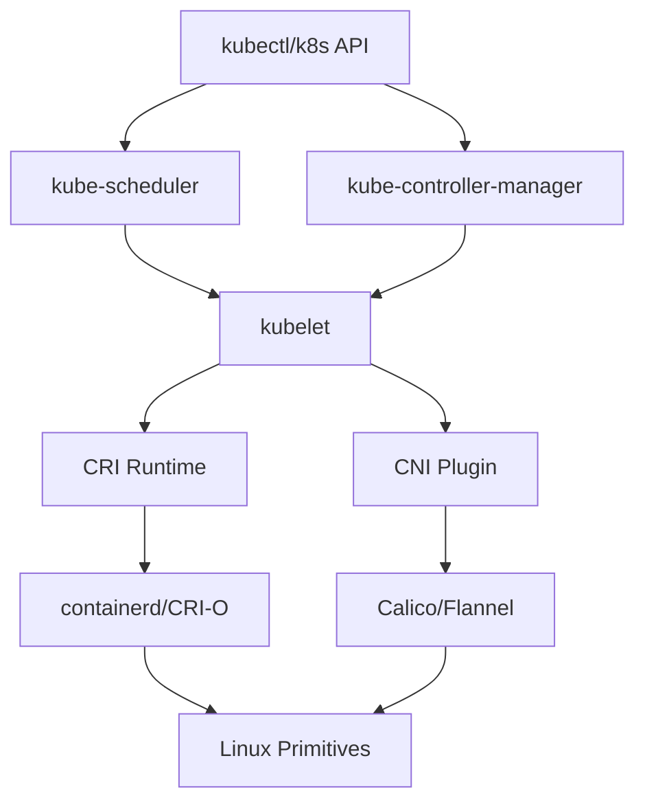

## Summary

Container runtime interfaces and orchestration systems that automate Linux primitives for production deployments. This MOC covers CRI, CNI, Kubernetes components, and the automation layers that make containers manageable at scale.

## Context / Problem

Manual container creation using Linux primitives works for learning but is impractical for production. Runtime interfaces and orchestration systems automate the creation, networking, and lifecycle management of containers. Understanding these layers is crucial for debugging, security, and system design.

## Structure

### 🏭 Runtime Interfaces

- **Container Runtime Interface (CRI)** - Kubernetes runtime abstraction (planned)
- **Container Network Interface (CNI)** - Network plugin specification (planned)
- **Container Storage Interface (CSI)** - Storage plugin specification (planned)

### ☸️ Kubernetes Components

- **kubelet** - Node-level container management (planned)
- **kube-proxy** - Service proxy and load balancing (planned)
- **CNI Plugins** - Calico, Flannel, Weave networking (planned)
- **CRI Runtimes** - containerd, CRI-O, Docker integration (planned)

### 🔄 Orchestration Patterns

- **Pod lifecycle management** - Creation, scheduling, termination (planned)
- **Service discovery** - DNS, ClusterIP, load balancing (planned)
- **Network policies** - Traffic control and security (planned)
- **Resource scheduling** - CPU, memory, affinity rules (planned)

## Key Architecture

## Runtime Responsibilities

### Kubelet

- Pod creation and deletion
- Health checking and restarts
- Resource monitoring
- CRI/CNI plugin invocation

### CNI Plugins

- Network namespace creation
- IP address assignment (IPAM)
- veth pair and bridge setup
- iptables rule configuration

### Kube-proxy

- Service ClusterIP management
- iptables/IPVS rule generation
- NodePort and LoadBalancer handling
- Endpoint health monitoring

## Integration Points

### With Linux Primitives

- **Network namespaces** → Pod network isolation
- **veth pairs** → Pod-to-node connectivity
- **bridges** → Multi-pod same-node networking
- **iptables** → Service routing and network policies

### With Storage Systems

- **Volume mounts** → Persistent data access
- **CSI drivers** → External storage integration
- **EmptyDir/configmap** → Ephemeral and configuration data

## Debugging Layers

### Application Layer

- Container logs and processes
- Application connectivity issues

### Orchestration Layer

- Pod status and events
- Service endpoint configuration
- Network policy enforcement

### Runtime Layer

- CRI runtime logs
- CNI plugin execution
- Container filesystem inspection

### Kernel Layer

- Network namespace configuration
- iptables rule analysis
- Resource limit verification

## Connections to Other Areas

- **[[MOC - Container Networking Model]]** - Foundation for CNI understanding
- **[[MOC - Linux Container Primitives]]** - What runtimes automate
- **[[MOC - Hands-on Container Labs]]** - Practical debugging techniques

## Child Notes

### Existing Notes

- [[Containers within a pod share network namespace and IP address]] - Pod-level communication fundamentals
- [[Pods communicate across cluster using CNI-provided networking]] - CNI overview and network models
- [[Kubernetes provides NodePort and LoadBalancer for external service access]] - External service access patterns
- [[Network policies control traffic flow between pods using labels and namespaces]] - Security and traffic control
- [[kube-proxy implements Services using iptables or IPVS]] - Service implementation details
- [[CNI plugins provide different network models and features]] - Plugin comparison and selection
- [[Container runtime configures pod networking through CNI plugins]] - Runtime networking responsibilities
- [[etcd stores cluster network state and service configuration]] - Cluster state management
- [[Service mesh provides advanced traffic management and security for service communication]] - Advanced service communication
- [[Kubernetes networking components coordinate through a defined workflow]] - Component coordination
- [[Model - Linux to Kubernetes Networking Mapping]] - Runtime automation mapping

### Planned Additions

- What is the Container Runtime Interface (CRI)?
- What is the Container Network Interface (CNI)?
- How does kubelet invoke CNI plugins?
- What are common CNI plugins (Calico, Flannel, Weave)?
- How does kube-proxy implement Services?
- What is the Container Storage Interface (CSI)?
- How do container runtimes work (containerd, CRI-O)?
- What are Kubernetes network policies?
- How does Pod scheduling work?
- What are resource requests and limits?
