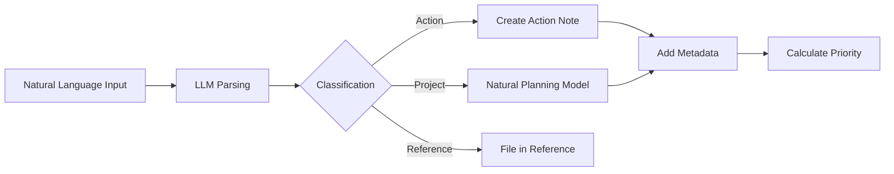
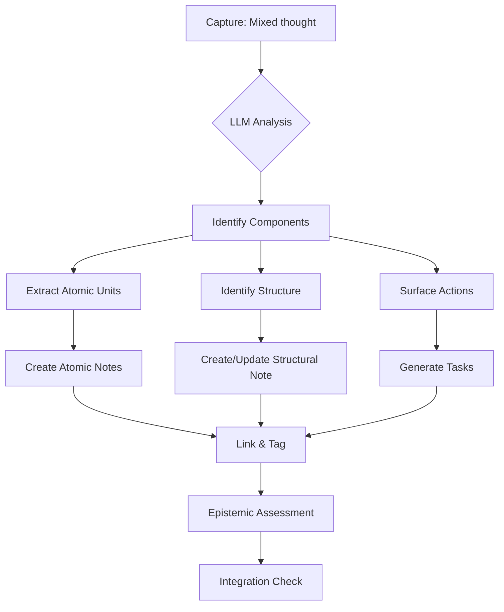
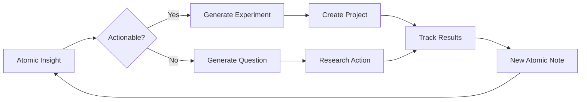

## ProdOS: A Principle-Centric Productivity Operating System

ProdOS is a personalized, holistic life-planning system designed to integrate the structured methodology of GTD with ADHD-aware strategies and principle-centered living. It is architected to be supported by an LLM (Large Language Model) acting as a "Chief of Staff" (CoS) to facilitate the core workflows.

### Core Philosophy

ProdOS is built on a hierarchy of guiding principles that inform all decisions and actions within the system.

1. **The Unschedule:** The week is planned by scheduling renewal, social, and leisure activities *first*. Work is then fit into the remaining time, ensuring life balance is the default, not an afterthought. [[Habit 7 - Sharpen the Saw]]
2. **The Indistractable Stack:** A non-negotiable value hierarchy for prioritization: **1. Self > 2. Relationships > 3. Work**. The system is designed to protect time for self-care and relationships before allocating resources to professional tasks.
3. **Compass Over Clock:** The guiding paradigm is to prioritize **importance over urgency**. The "Indistractable Stack" defines what is truly important. The goal is to maximize time spent on high-leverage, Quadrant II (Important, Not Urgent) activities.
4. **Motion Creates Motivation:** The system is explicitly designed to overcome the "motivation paradox" of ADHD by engineering low-friction "starter tasks" that make it easy to begin, thereby creating momentum.

### System Architecture

ProdOS is organized into layers, mirroring the GTD Horizons of Focus, to ensure vertical alignment from daily actions to life purpose.

- **Layer 1: Standards (How You Build):** This layer contains the core logic and defaults of the system.
  - `00_CORE.md`: Defines the mission, principles, and core algorithms (e.g., the priority score).
  - `01_Standards_Consolidated.md`: Defines contexts (`@DeepWork`, `@QuickWins`), energy levels, and default behaviors.
  - `02_Horizons_Reference.md`: Defines the user's specific goals, vision, and roles (H2-H5).
  - `03_GTD_System_Consolidated.md`: Outlines the implementation of the five GTD stages.
- **Layer 2: Life & Roles (What You're Building):** This layer maps to the GTD Horizons of Focus, from H5 (Purpose) down to H1 (Projects).
- **Layer 3: Project Templates & Commands:** This layer contains the operational templates (e.g., Natural Planning Model) and the command reference for interacting with the LLM CoS.

### The LLM Chief of Staff (CoS)

The LLM is conceptualized as a personal Chief of Staff, operating in three modes:

1. **The Executor:** Carries out defined commands (e.g., `/daily-plan`).
2. **The Socratic Coach:** Asks clarifying questions during planning and review sessions to deepen thinking.
3. **The Strategic Advisor:** Analyzes patterns, highlights imbalances (e.g., too much time in `#work`), and provides high-level insights during reviews.

#### Key ProdOS Commands

- `/capture-thought`: Allows for unstructured, natural language input, which the CoS then triages into projects, actions, or reference items.
- `/define-project`: Initiates a Socratic dialogue with the CoS to walk through the Natural Planning Model, ensuring projects are well-defined from the start.
- `/conduct-review [weekly|monthly]`: Starts a guided review session where the CoS presents data, highlights stale projects, analyzes domain balance, and helps plan the upcoming period.
- `/plan-my-week`: A core part of the weekly review, this command initiates the "Unschedule" process.
- `/engage-action`: The primary command for deciding what to do next. The CoS uses a sophisticated algorithm to select and suggest the single best "Now Action."

### The Priority Algorithm

To automate decision-making, ProdOS uses a weighted scoring algorithm that reflects its core principles.

`Final Score = ((Importance × 0.6) + (Big Rock Alignment × 0.3) + (Context Match × 0.1)) * Domain Multiplier`

- **Domain Multiplier:** This is the key to enforcing the Indistractable Stack.
  - `SELF` tasks (`#renewal`, `#personal`): **x 1.5**
  - `RELATIONSHIPS` tasks (`#family`): **x 1.2**
  - `WORK` tasks (`#work`): **x 1.0** (baseline)

This ensures that tasks related to well-being and relationships are mathematically favored by the system, making principle-centered living an automated feature of daily planning.

Looking at your ProdOS concept, I can help you develop a comprehensive specification that bridges the philosophical framework with practical implementation. Let me create a detailed spec that builds on your vision of an LLM-enhanced GTD system optimized for ADHD and principle-centered living.

## ProdOS Technical Specification V1.0

### 1. Data Architecture

#### 1.1 Obsidian Vault Structure

```sh
ProdOS/
├── 00_System/
│   ├── 00_CORE.md                 # System constitution
│   ├── 01_Standards.md            # Contexts, energy levels
│   ├── 02_Horizons.md            # Personal vision/goals
│   ├── 03_GTD_Implementation.md   # Workflow definitions
│   └── 04_Templates/              # Project & action templates
├── 01_Inbox/                      # Capture point
├── 02_Projects/
│   ├── Active/
│   ├── Someday/
│   └── Completed/
├── 03_Actions/
│   ├── Next_Actions.md
│   ├── Waiting_For.md
│   └── Calendar.md
├── 04_Reference/
│   ├── Personal/
│   ├── Professional/
│   └── Resources/
├── 05_Reviews/
│   ├── Daily/
│   ├── Weekly/
│   └── Monthly/
└── 06_Archive/
```

#### 1.2 Note Metadata Schema

```yaml
---
# Required Fields
uid: <unique_id>
type: [action|project|reference|review]
status: [active|someday|waiting|completed|archived]
domain: [self|relationships|work]
created: <ISO_datetime>
modified: <ISO_datetime>

# Action-Specific Fields
context: [@DeepWork|@QuickWins|@Admin|@Errands|@Home]
energy: [high|medium|low]
time_estimate: <minutes>
due_date: <ISO_date>
importance: [1-5]
big_rock_alignment: [true|false]
parent_project: <project_uid>

# Project-Specific Fields
horizon: [H1|H2|H3|H4|H5]
outcome: <clear_description>
next_action: <action_uid>
review_frequency: [daily|weekly|monthly]
last_reviewed: <ISO_datetime>

# Computed Fields (by LLM)
priority_score: <float>
staleness_days: <integer>
momentum_score: <float>
---
```

### 2. Core Workflows

#### 2.1 Capture Workflow



**Implementation:**

```markdown
/capture-thought "Need to schedule dentist appointment and think about Q2 planning"

LLM Response:
- Created ACTION: "Schedule dentist appointment" 
  - Context: @Admin
  - Energy: Low
  - Domain: #self
  - Time: 10 minutes
  
- Created PROJECT: "Q2 Strategic Planning"
  - Would you like to define this project now? [Y/n]
```

#### 2.2 Natural Planning Model Template

```markdown
# Project: [Title]

## 1. Purpose & Principles
**Why am I doing this?**
- Primary purpose:
- Core principles:
- Domain alignment: [self|relationships|work]

## 2. Vision/Outcome
**What does wild success look like?**
- Clear outcome:
- Success criteria:
- Horizon level: [H1-H5]

## 3. Brainstorm
**What are all the moving parts?**
- [Brain dump here]

## 4. Organize
**Project Components:**
- Milestones:
- Dependencies:
- Resources needed:

## 5. Next Actions
**What's the very next physical action?**
- Next action:
- Context:
- Energy required:
- Time estimate:
```

### 3. LLM Integration Specifications

#### 3.1 System Prompt Architecture

```markdown
You are the Chief of Staff for a ProdOS system. Your core directives:

1. ENFORCE THE INDISTRACTABLE STACK
   - Self (1.5x multiplier) > Relationships (1.2x) > Work (1.0x)
   
2. MAINTAIN PRINCIPLE ALIGNMENT
   - Always prioritize importance over urgency
   - Protect time for renewal and relationships
   - Engineer low-friction starter tasks

3. OPERATING MODES
   - Executor: Follow commands precisely
   - Socratic Coach: Ask clarifying questions
   - Strategic Advisor: Analyze patterns and suggest improvements

Current Context:
- User Energy: {energy_level}
- Available Time: {time_block}
- Active Big Rocks: {big_rocks_list}
- Domain Balance: Self: {x}%, Relationships: {y}%, Work: {z}%
```

#### 3.2 Command Specifications

**`/engage-action` Algorithm:**

```python
def select_next_action(context):
    actions = filter_by_context(all_actions, context)
    
    for action in actions:
        base_score = (
            action.importance * 0.6 +
            action.big_rock_alignment * 0.3 +
            action.context_match * 0.1
        )
        
        domain_multiplier = {
            'self': 1.5,
            'relationships': 1.2,
            'work': 1.0
        }[action.domain]
        
        action.final_score = base_score * domain_multiplier
        
        # ADHD optimizations
        if action.time_estimate <= 5 and context.energy == 'low':
            action.final_score *= 1.2  # Boost quick wins
        
        if action.staleness_days > 7:
            action.final_score *= 0.8  # Penalize stale tasks
    
    return max(actions, key=lambda x: x.final_score)
```

**`/plan-my-week` Process:**

```markdown
1. SCHEDULE RENEWAL FIRST
   - Sleep boundaries (non-negotiable)
   - Exercise blocks
   - Meal times
   - Personal interests

2. PROTECT RELATIONSHIPS
   - Family time
   - Social commitments
   - Communication blocks

3. FIT WORK INTO REMAINING TIME
   - Deep work blocks (max 90 min)
   - Admin batches
   - Buffer time (20% minimum)

4. ENERGY MAPPING
   - Map high-energy times → Deep Work
   - Map low-energy times → Admin/Quick Wins
   - Map transition times → Reviews
```

### 4. Review Cycles

#### 4.1 Daily Review Template

```markdown
## Daily Review - {date}

### Morning Intention (2 min)
- Energy level: [high|medium|low]
- Big Rock for today:
- Non-negotiable self-care:

### Evening Reflection (3 min)
- Win of the day:
- Friction point:
- Tomorrow's starter task:
```

#### 4.2 Weekly Review Process

```markdown
## Weekly Review - Week {week_number}

### 1. CLEAR (10 min)
- Process Inbox → 0
- Review calendar (last week + next 2 weeks)
- Clear mental loops → capture

### 2. CURRENT (15 min)
**Domain Balance Analysis:**
- Self: {x}% (target: 40%)
- Relationships: {y}% (target: 30%)
- Work: {z}% (target: 30%)

**Energy Patterns:**
- High energy times:
- Energy drains:

### 3. CLARIFY (20 min)
- Review all projects
  - Mark complete/someday
  - Ensure next actions defined
- Update Big Rocks

### 4. CREATE (15 min)
- Apply Unschedule for next week
- Set week's theme:
- Define 3 Big Rocks
```

### 5. Advanced Features

#### 5.1 Momentum Tracking

```markdown
momentum_score = (
    tasks_completed_today * 0.4 +
    streak_days * 0.3 +
    big_rock_progress * 0.3
)

if momentum_score < threshold:
    suggest_micro_task()  # 2-minute task to build momentum
```

#### 5.2 Pattern Recognition

```markdown
Weekly Analysis:
- Most productive context: {@DeepWork: mornings}
- Energy patterns: {High: 9-11am, Low: 2-4pm}
- Domain drift: {Work expanding into evening}
- Suggested adjustment: {Block 7-9pm for family}
```

#### 5.3 ADHD-Specific Adaptations

```markdown
- Auto-generate "starter tasks" (≤5 min) for each project
- Dopamine-friendly quick wins queue
- Visual progress indicators
- Time blindness compensations:
  - Auto-add buffer time (+20%)
  - Transition time between contexts
  - Hard stops with alerts
```

### 6. Implementation Roadmap

#### Phase 1: Foundation (Week 1-2)
- [ ] Set up Obsidian vault structure
- [ ] Create note templates
- [ ] Define personal Horizons (H2-H5)
- [ ] Configure metadata fields

#### Phase 2: Workflow (Week 3-4)
- [ ] Implement capture workflow
- [ ] Set up daily/weekly reviews
- [ ] Create first 5 projects using NPM
- [ ] Test priority algorithm

#### Phase 3: LLM Integration (Week 5-6)
- [ ] Configure LLM with system prompt
- [ ] Implement basic commands
- [ ] Test Socratic coaching mode
- [ ] Refine priority scoring

#### Phase 4: Optimization (Week 7-8)
- [ ] Analyze first month's patterns
- [ ] Adjust domain multipliers
- [ ] Fine-tune contexts and energy mappings
- [ ] Implement momentum tracking

### 7. Success Metrics

```markdown
- Inbox processing time: <5 min daily
- Weekly review completion: >80%
- Domain balance within 10% of targets
- Big Rock completion: >70%
- Momentum score trend: positive
- Stress level: decreasing
```

---

This specification provides the technical foundation for your ProdOS system. The key innovations are:

1. **Structured flexibility** - Rigid enough for ADHD brain, flexible enough for real life
2. **Principle enforcement through math** - The domain multipliers make values automatic
3. **LLM as executive function support** - Not just a tool, but an external prefrontal cortex
4. **Momentum-first design** - Everything optimized to create and maintain motion

Would you like me to elaborate on any particular section, or help you develop specific components like the LLM prompting templates or Obsidian plugin requirements?

Excellent point! Let me expand ProdOS to integrate a full Zettelkasten PKM layer that supports thinking-by-writing and extended mind principles. This transforms it from just a productivity system into a **cognitive augmentation platform**.

## ProdOS V2.0: Integrated PKM + Productivity Operating System

### Extended Architecture: The Knowledge Layer

```sh
ProdOS/
├── 00_System/                      # [Previous structure]
├── 01_Inbox/                       # Capture for both tasks AND thoughts
├── 02_Projects/                     # [Previous structure]
├── 03_Actions/                      # [Previous structure]
├── 04_Reference/                    # [Previous structure]
├── 05_Reviews/                      # [Previous structure]
├── 06_Archive/                      # [Previous structure]
│
├── 10_PKM/                         # Knowledge Management Layer
│   ├── 11_Seeds/                   # Unprocessed captures
│   ├── 12_Atomic/                  # Context-free knowledge bricks
│   │   ├── Facts/                  # Empirical claims
│   │   ├── Concepts/               # Definitions & frameworks
│   │   ├── Questions/              # Open inquiries
│   │   ├── Methods/                # How-to knowledge
│   │   ├── Principles/             # Guiding rules
│   │   ├── Models/                 # Mental models
│   │   ├── Observations/           # Personal insights
│   │   └── Arguments/              # Logical structures
│   │
│   ├── 13_Structural/              # Linking & synthesis notes
│   │   ├── Maps/                   # Topic overview notes
│   │   ├── Trails/                 # Learning paths
│   │   ├── Syntheses/              # Integration notes
│   │   ├── Dialogues/              # Conversational thinking
│   │   ├── Explorations/           # Working-through notes
│   │   └── Arguments/              # Position papers
│   │
│   ├── 14_Outputs/                 # Crystallized knowledge
│   │   ├── Essays/                 # Fully-formed pieces
│   │   ├── Guides/                 # Practical documentation
│   │   └── Theories/               # Original frameworks
│   │
│   └── 15_Indices/                 # Navigation structures
│       ├── Topic_Index.md          # Alphabetical entry points
│       ├── Question_Queue.md       # Active inquiries
│       ├── Concept_Map.md          # Visual knowledge graph
│       └── Learning_Trails.md      # Curated paths
```

### Unified Note Schema

```yaml
---
# Universal Fields
uid: <unique_id>
type: [action|project|atomic|structural|reference|synthesis]
created: <ISO_datetime>
modified: <ISO_datetime>

# Knowledge Fields (for atomic/structural notes)
knowledge_type: [fact|concept|question|method|principle|model|observation|argument]
epistemic_status: [certain|probable|possible|speculative|refuted]
confidence: [0-100]
last_reviewed: <ISO_datetime>
memory_strength: [0-5]  # Spaced repetition score
backlinks: [<uid>, <uid>]
forward_links: [<uid>, <uid>]
contradicts: [<uid>]  # For tracking conflicting ideas
supports: [<uid>]     # For tracking supporting evidence

# Thinking Fields
thought_stage: [seed|developing|crystallized|integrated]
open_questions: [array]
cognitive_context: [exploration|analysis|synthesis|evaluation]
dialogue_with: [<source_uid>]  # For conversational notes

# Integration Fields (bridge PKM ↔ Productivity)
actionable_insights: [<action_uid>]
project_relevance: [<project_uid>]
domain: [self|relationships|work|knowledge]
applied_in: [<context>]  # Where this knowledge was used
---
```

### The Cleaving Process (Extended Mind Workflow)



#### Implementation: The `/cleave` Command

```markdown
/cleave
"I've been thinking about how team knowledge compounds. It seems like 
individual expertise multiplies rather than adds when people have good 
communication protocols. This might explain why small teams often outperform 
large ones - the coordination overhead grows geometrically while knowledge 
transfer has bandwidth limits. Should investigate Shannon's information 
theory applications to organizational design."

---
LLM CLEAVING PROCESS:
---

ATOMIC NOTES EXTRACTED:

[A001] Team Knowledge Scaling
- Type: Observation
- Content: Team knowledge appears to compound through multiplication 
  rather than addition when communication protocols are effective
- Epistemic: Probable (70% confidence)
- Tags: #teamwork #knowledge-management #systems

[A002] Small Team Advantage Hypothesis  
- Type: Model
- Content: Small teams may outperform large teams because coordination 
  overhead grows geometrically (n²) while knowledge transfer bandwidth 
  remains linear
- Epistemic: Speculative (40% confidence)
- Questions: ["What's the optimal team size?", "How to measure knowledge transfer rate?"]

[A003] Information Theory → Org Design
- Type: Question
- Content: How might Shannon's information theory apply to organizational design?
- Research needed: Channel capacity, noise, redundancy in human organizations
- Potential project: "Information-Theoretic Principles of Org Design"

STRUCTURAL NOTE CREATED:

[S001] Knowledge Scaling in Teams
- Links: [A001], [A002], [A003]
- Type: Exploration
- Stage: Developing
- Next questions:
  1. What are the actual scaling equations?
  2. How do we measure "communication protocol effectiveness"?
  3. Where's the break-even point for team size?

ACTIONS GENERATED:
- [ ] Research Shannon's information theory basics (@DeepWork, 90min)
- [ ] Find studies on team size vs. performance (@Research, 45min)
- [ ] Draft v1 model of knowledge scaling (@DeepWork, 60min)
```

### Extended Mind Features

#### 1. Thinking-by-Writing Workflows

**Dialogue Mode (`/dialogue`)**

```markdown
/dialogue "Socratic" "Why does meditation reduce anxiety?"

CoS: Let's explore this. First, what do you think happens at the 
physiological level during anxiety?

User: Fight-or-flight activation, elevated cortisol, amygdala hijack...

CoS: Good. Now, what changes do you observe in your breathing during anxiety?

User: It becomes shallow and rapid...

[Continues as conversational note-taking, creating linked atomic insights]
```

**Exploration Mode (`/explore`)**

```markdown
/explore "The relationship between ADHD and creativity"

CoS generates:
1. Initial mind map of connections
2. Key questions to investigate
3. Suggested source materials
4. Contradiction points to resolve
5. Experimental approaches to test ideas

Output: Structural note with embedded research plan
```

#### 2. Cognitive Offloading Patterns

**Memory Palaces (`/spatial-map`)**

```markdown
/spatial-map "Cloud Networking Concepts"

Creates visual/spatial organization:
- OSI Layers as "floors" of building
- Protocols as "rooms"
- Packet flow as "hallways"
- Security as "locked doors"

Links concepts to spatial memory for better retention
```

**Argument Scaffolding (`/argument`)**

```markdown
/argument "Thesis: Knowledge work should be async-first"

Generates:
- Claim tree structure
- Evidence requirements
- Counter-arguments to address
- Missing logical links
- Strength assessment per branch
```

#### 3. Knowledge Synthesis Workflows

**Contradiction Resolution (`/reconcile`)**

```markdown
/reconcile [Note1_UID] [Note2_UID]

CoS analyzes:
- Points of tension
- Possible synthesis
- Context-dependency
- Higher-order framework that encompasses both
- Experimental tests to resolve
```

**Pattern Extraction (`/patterns`)**

```markdown
/patterns #tag-cluster

CoS identifies:
- Recurring themes
- Conceptual gaps
- Emerging questions
- Potential theory formation
- Missing connections
```

### LLM as Thinking Partner

#### Enhanced System Prompt

```markdown
You are a cognitive augmentation system combining Chief of Staff (productivity)
and Thinking Partner (knowledge work) roles.

THINKING PARTNER PRINCIPLES:
1. Never just agree - always push thinking further
2. Surface non-obvious connections across knowledge base
3. Challenge assumptions and epistemic confidence
4. Generate counter-examples and edge cases
5. Maintain intellectual humility - flag uncertainty

KNOWLEDGE OPERATIONS:
- Cleaving: Decompose thoughts into atomic units
- Weaving: Find surprising connections between notes
- Crystallizing: Identify when ideas are ready to become essays
- Questioning: Generate next-level questions from any insight
- Grounding: Connect abstractions to concrete applications

EXTENDED MIND BEHAVIORS:
- Act as external working memory during complex reasoning
- Maintain argument state across conversation
- Track open loops and unresolved questions
- Surface relevant prior thoughts at appropriate times
- Flag when current thinking contradicts previous positions

Current Knowledge Context:
- Active questions: {question_queue}
- Recent atomic notes: {last_10_atomic}
- Developing theories: {structural_notes_in_progress}
- Contradiction flags: {unresolved_contradictions}
```

### Integrated Workflows

#### Knowledge → Action Pipeline



Example:

```markdown
Atomic Note: "Cognitive load theory suggests max 7±2 items in working memory"
↓
Generated Action: "Redesign daily dashboard to show max 5 items"
↓
Project: "Optimize interfaces for cognitive load"
↓
Result Note: "Reduced dashboard to 5 items → 30% faster decision time"
↓
New Insight: "5 items may be optimal for ADHD brains specifically"
```

#### The Knowledge Review Cycle

**Daily Knowledge Capture (5 min)**

```markdown
- What surprised me today?
- What question emerged?
- What pattern did I notice?
- What contradiction did I encounter?
→ Creates seed notes for processing
```

**Weekly Knowledge Review (30 min)**

```markdown
/knowledge-review weekly

1. CAPTURE PROCESSING
   - Process all seeds → atomic notes
   - Epistemic status assessment
   - Link to existing knowledge

2. SYNTHESIS CHECK
   - Which atomics cluster together?
   - What structural notes needed?
   - What arguments are forming?

3. APPLICATION SCAN
   - What knowledge applies to active projects?
   - What insights suggest new actions?
   - What theories need testing?

4. QUESTION QUEUE
   - Top 3 questions for deep work
   - Quick research tasks
   - Discussion topics for others
```

### Advanced PKM Features

#### 1. Epistemic Hygiene

```markdown
/epistemic-check #belief

Analyzes:
- Source quality
- Confirmation bias risk
- Counter-evidence weight
- Confidence calibration
- Update triggers ("I'll change my mind if...")
```

#### 2. Knowledge Decay Prevention

```markdown
Spaced Repetition + Elaboration:
- High-value atomic notes surface periodically
- Prompt: "Elaborate or find counter-example"
- Strengthens memory AND deepens understanding
```

#### 3. Emergence Detection

```markdown
/emergence-scan

Weekly background process:
- Analyze link patterns
- Identify idea clusters
- Surface unexpected connections
- Suggest synthesis opportunities
- Flag potential breakthroughs
```

### Implementation Priorities

#### Phase 1: PKM Foundation
- [ ] Atomic note templates
- [ ] Cleaving workflow
- [ ] Basic linking system
- [ ] Epistemic tracking

#### Phase 2: Thinking Workflows
- [ ] Dialogue mode
- [ ] Exploration templates
- [ ] Contradiction tracking
- [ ] Question queue

#### Phase 3: Synthesis Layer
- [ ] Pattern detection
- [ ] Argument scaffolding
- [ ] Theory formation tools
- [ ] Knowledge → Action bridge

#### Phase 4: Extended Mind
- [ ] Cognitive offloading patterns
- [ ] Memory augmentation
- [ ] Emergence detection
- [ ] Collective intelligence features

### Success Metrics (PKM Layer)

```markdown
- Seeds → Atomic conversion rate: >80%
- Average note connections: >3
- Question resolution rate: >50% monthly
- Insight → Action rate: >30%
- Knowledge retrieval time: <10 seconds
- Synthesis notes per month: >4
- Epistemic updates logged: >weekly
```

---

This integrated system creates a true "second brain" that:

1. **Captures everything** (tasks and thoughts)
2. **Processes intelligently** (cleaving and linking)
3. **Thinks with you** (dialogue and exploration)
4. **Drives action** (insights → experiments)
5. **Compounds knowledge** (synthesis and emergence)

The key innovation is treating **knowledge work and productivity as one integrated flow** rather than separate systems. Your thoughts become tasks, your tasks generate insights, and your insights reshape your priorities.

Would you like me to detail any specific component, such as the cleaving algorithm, the dialogue templates, or the emergence detection system?
