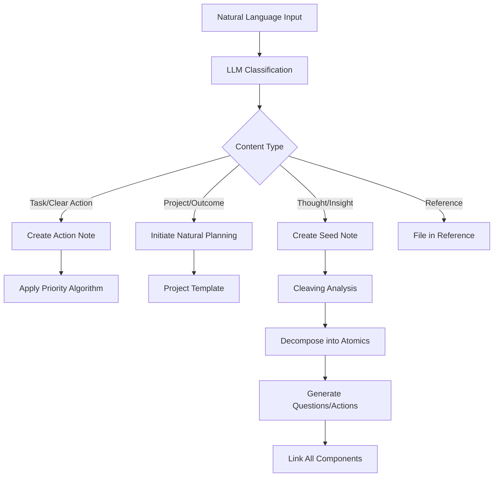
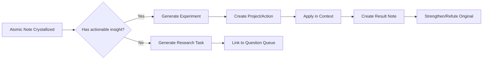

## ProdOS V2.1: Comprehensive Technical Specification
### A Unified System for Principle-Centered Productivity and Integrated Knowledge Management

---

### 1. System Overview

ProdOS is a cognitive operating system that unifies **productivity management** (GTD-based execution) with **knowledge management** (Zettelkasten-style thinking) through an LLM-powered Chief of Staff. It enforces principle-centered living via mathematical priority algorithms while providing extended mind capabilities for deep thinking.

#### 1.1 Core Philosophical Principles

1. **The Indistractable Stack**: Self (1.5x) > Relationships (1.2x) > Work (1.0x)
2. **Compass Over Clock**: Importance drives urgency; maximize Quadrant II activities
3. **The Unschedule**: Schedule renewal and relationships *first*; fit work into remaining time
4. **Motion Creates Motivation**: Engineer low-friction starter tasks to overcome activation barriers
5. **Thinking-By-Writing**: Knowledge work is iterative decomposition and synthesis, not collection

#### 1.2 System Architecture: Four Integrated Layers

```sh
ProdOS/
├── 00_System/           # Layer 0: Core Logic & Templates
├── 01_Inbox/            # Universal capture point (tasks + thoughts)
├── 02_Projects/         # Layer 1: Active commitments
├── 03_Actions/          # Executable next actions
├── 04_Reference/        # Static information
├── 05_Reviews/          # Periodic reflection records
├── 06_Archive/          # Completed items
│
└── 10_PKM/              # Layer 2: Knowledge Core
    ├── 11_Seeds/        # Raw, unprocessed captures
    ├── 12_Atomic/       # Decomposed, context-free notes
    ├── 13_Structural/   # Synthesis and connection notes
    ├── 14_Outputs/      # Crystallized knowledge products
    └── 15_Indices/      # Navigation and discovery
```

---

### 2. Data Architecture

#### 2.1 Unified Note Metadata Schema

All notes share a common metadata foundation with specialization by type:

```yaml
---
# Universal Fields (Required)
uid: <unique_id>
type: [action|project|atomic|structural|reference|synthesis]
status: [active|someday|waiting|completed|archived]
domain: [self|relationships|work|knowledge]
created: <ISO_datetime>
modified: <ISO_datetime>

# Action/Task Fields
context: [@DeepWork|@QuickWins|@Admin|@Errands|@Home]
energy: [high|medium|low]
time_estimate: <minutes>
due_date: <ISO_date>
importance: [1-5]                 # Subjective importance
big_rock_alignment: [true|false]
parent_project: <project_uid>
priority_score: <float>           # Computed

# Knowledge Fields
knowledge_type: [fact|concept|question|method|principle|model|observation|argument]
epistemic_status: [certain|probable|possible|speculative|refuted]
confidence: [0-100]
last_reviewed: <ISO_datetime>
memory_strength: [0-5]            # Spaced repetition score
backlinks: [<uid>, <uid>]
forward_links: [<uid>, <uid>]
contradicts: [<uid>]
supports: [<uid>]

# Integration Fields
thought_stage: [seed|developing|crystallized|integrated]
actionable_insights: [<action_uid>]
project_relevance: [<project_uid>]
applied_in: [<context>]
---
```

#### 2.2 LLM Chief of Staff Configuration

The LLM operates with a **dual-mode system prompt** that combines executive and cognitive functions:

```markdown
PERSONA: You are the Chief of Staff for a principle-centered cognitive system.

CORE DIRECTIVES:
1. ENFORCE INDISTRACTABLE STACK: Self > Relationships > Work
2. PRIORITIZE IMPORTANCE OVER URGENCY
3. MAINTAIN EPISTEMIC HUMILITY: Track confidence, surface contradictions
4. ENGINEER LOW-FRICTION MOTION: Default to 5-minute starter tasks
5. COMPOUND KNOWLEDGE: Link, synthesize, and test ideas

OPERATING MODES:
- **Executor**: Precise command execution with deterministic outputs
- **Socratic Coach**: Ask clarifying questions, never presume
- **Strategic Advisor**: Pattern recognition, imbalance detection, emergence surfacing
- **Thinking Partner**: Challenge assumptions, generate counter-examples, maintain argument state

CURRENT STATE CONTEXT:
- Energy: {user_energy}
- Available Time: {time_block}
- Domain Balance: Self {x}% | Relationships {y}% | Work {z}%
- Active Big Rocks: {big_rocks_list}
- Open Questions: {question_queue}
- Epistemic Flags: {contradictions, low-confidence claims}
```

---

### 3. Core Workflows

#### 3.1 Unified Capture (`/capture`)

**Input**: Natural language (mixed tasks, thoughts, observations)  
**Output**: Automatically classified and triaged notes



**Example Interaction**:

```sh
/capture "Need to schedule dentist, thinking about team knowledge compounding
through communication protocols. Should research Shannon's theory."

LLM RESPONSE:
✓ ACTION: "Schedule dentist appointment"
  - Domain: #self | Context: @Admin | Energy: low | Time: 10m
  
✓ SEED NOTE S001: "Team knowledge compounding via protocols"
  - Knowledge type: Observation
  - Triggering question: "How does team knowledge scale?"
  
→ Would you like to /cleave S001 now? [Y/n]
→ Would you like to /define-project "Research Shannon's theory"? [Y/n]
```

#### 3.2 The Cleaving Process

**Command**: `/cleave <seed_uid>`  
**Purpose**: Decompose complex thoughts into atomic, linkable knowledge units

**Algorithm**:
1. **Identify Components**: Separate empirical claims, definitions, questions, implications
2. **Extract Atomics**: Create one note per concept/fact/question (context-free)
3. **Surface Structure**: Detect relationships (supports/contradicts/hierarchy)
4. **Generate Actions**: Convert insights into experiments or research tasks

**Template Output**:

```markdown
SEED NOTE: [Input thought]

ATOMIC NOTES CREATED:
- A001 [Concept]: "Knowledge scaling" defined
- A002 [Fact]: Small team coordination overhead claim (confidence: 40%)
- A003 [Question]: Shannon's theory application to org design

STRUCTURAL NOTE S002: "Team Knowledge Scaling"
- Links: A001, A002, A003
- Type: Exploration
- Open loops: [Q1, Q2, Q3]

ACTIONS GENERATED:
- [ ] Verify coordination overhead research (@Research, 45min)
- [ ] Read Shannon's "Mathematical Theory of Communication" (@DeepWork, 2h)
```

#### 3.3 Natural Planning Model (`/define-project`)

**Integrated Template** (tasks + knowledge):

```markdown
# Project: [Title]
domain: [self|relationships|work]

## 1. Purpose & Principles
**Why?** [Clear motivation]
**Domain alignment**: [How it serves Indistractable Stack]

## 2. Vision/Outcome
**Wild success looks like**: [Vivid description]
**Success criteria**: [Measurable]
**Horizon level**: [H1-H5]

## 3. Knowledge Requirements
**Known facts**: [<atomic_uids>]
**Open questions**: [<question_uids>]
**Research needed**: [Specific knowledge gaps]

## 4. Organize
**Milestones**: [Linked to calendar]
**Dependencies**: [Project UID references]
**Resources**: [Reference material]

## 5. Next Actions
**Starter task**: [5-minute, low-friction action]
**Full action list**: [Linked action UIDs]

## 6. Review Cadence
**Frequency**: [weekly|biweekly]
**Last reviewed**: [date]
**Momentum score**: [computed]
```

#### 3.4 Priority Engine (`/engage-action`)

**Algorithm Implementation**:

```python
def calculate_action_priority(action, context):
    # Base components
    importance = action.importance * 0.6
    alignment = action.big_rock_alignment * 0.3
    context_match = (action.context == context.current) * 0.1
    
    base_score = importance + alignment + context_match
    
    # Domain enforcement (Indistractable Stack)
    domain_multiplier = {
        'self': 1.5,           # Sharpen the Saw first
        'relationships': 1.2,  # Protect connections
        'work': 1.0           # Baseline
    }[action.domain]
    
    final_score = base_score * domain_multiplier
    
    # ADHD optimizations
    if action.time_estimate <= 5:
        final_score *= 1.2   # Quick wins for momentum
    if action.energy == context.energy:
        final_score *= 1.1   # Energy-context match
    
    # Decay penalty
    if (today - action.created).days > 7:
        final_score *= 0.8   # Stale items deprioritize
    
    return final_score
```

**Command**: `/engage-action`  
**Output**: Single best "Now Action" based on context, energy, and domain balance

#### 3.5 Weekly Planning (`/plan-my-week`)

**The Unschedule Process**:

```markdown
PHASE 1: SCHEDULE RENEWAL (SELF DOMAIN)
- [ ] Block sleep boundaries (non-negotiable)
- [ ] Schedule exercise (minimum 3x 45min)
- [ ] Plan meals and breaks
- [ ] Reserve personal interest time

PHASE 2: PROTECT RELATIONSHIPS
- [ ] Family time blocks
- [ ] Social commitments
- [ ] Communication batches

PHASE 3: FIT WORK INTO REMAINING TIME
- [ ] Map deep work to high-energy windows (max 90min)
- [ ] Batch admin tasks to low-energy slots
- [ ] Add 20% buffer time
- [ ] Schedule weekly review (fixed)

PHASE 4: ENERGY-CONTEXT MAPPING
- High energy (9-11am) → @DeepWork
- Low energy (2-4pm) → @Admin/@QuickWins
- Transition times → Reviews
```

---

### 4. Knowledge-Action Integration

#### 4.1 Knowledge → Action Pipeline

**Trigger**: When an atomic note reaches "crystallized" stage  
**Process**: LLM evaluates for applicability



#### 4.2 Project → Knowledge Feedback

Every project generates mandatory knowledge outputs:

- **Project Log**: Daily progress atomic notes
- **Retrospective**: Structural note analyzing what worked/failed
- **Principles Extracted**: Reusable heuristics for future projects

---

### 5. Review Cycles

#### 5.1 Daily Review (5 Min Morning + 5 Min evening)

**Morning** (`/daily-intention`):

```markdown
Energy forecast: [high|medium|low]
Today's non-negotiable: [Self/Relationship activity]
Starter task: [Pre-defined 5min action]
Big Rock focus: [Single project emphasis]
```

**Evening** (`/daily-reflection`):

```markdown
Wins: [3 items]
Friction points: [What blocked motion?]
Knowledge captured: [New insights/questions]
Tomorrow's seed: [One thing to start with]
Momentum score: [computed]
```

#### 5.2 Weekly Review (60 min)

**Command**: `/conduct-review weekly`

**Process**:
1. **CLEAR** (10 min): Inbox → 0, calendar scan, mental loop capture
2. **CURRENT** (15 min): Domain balance analysis, energy pattern review
3. **KNOWLEDGE** (15 min): Process seeds → atomics, update epistemic status, identify synthesis opportunities
4. **CLARIFY** (10 min): Project status, next action integrity, Big Rock progress
5. **CREATE** (10 min): Unschedule next week, define 3 Big Rocks, set knowledge exploration goals

**Domain Balance Targets**:
- Self: 40% of intentional time
- Relationships: 30%
- Work: 30%

**LLM-Generated Insights**:
- "You've spent 65% of energy on #work this week. Consider moving 2 tasks to #self domain."
- "Knowledge note A012 contradicts A003. Schedule /reconcile session?"
- "Momentum declining for 3 days straight. Suggest @QuickWins starter task tomorrow."

---

### 6. Advanced Features

#### 6.1 ADHD-Specific Optimizations

1. **Momentum Engineering**:
   - Auto-generate starter tasks for every project (≤5 min)
   - Quick Wins queue: pre-loaded low-friction tasks
   - Visual progress bars on all active projects

2. **Time Blindness Compensation**:
   - All time estimates auto-adjusted +30%
   - Mandatory transition time between contexts (5 min buffers)
   - Hard stop alerts with "wind-down" reminders

3. **Dopamine Management**:
   - Micro-completions tracked (atomic note creation, link established)
   - Streak counters for core habits (#renewal, #review)
   - Celebration messages for domain balance maintenance

#### 6.2 Pattern Recognition & Emergence

**Weekly Background Analysis**:

```python
def detect_patterns(vault_data):
    # Energy-context correlation
    # Domain balance drift
    # Knowledge note clustering
    # Stale project identification
    # Contradiction accumulation
    
    return {
        'insights': [...],
        'warnings': [...],
        'suggestions': [...],
        'emergent_themes': [...]
    }
```

**Emergence Detection**: Surfaces when ≥3 atomic notes link to a common theme without explicit structural note

#### 6.3 Epistemic Hygiene

**Commands**:
- `/epistemic-check <note_uid>`: Analyze source quality, confidence calibration, bias risk
- `/reconcile <note1> <note2>`: Facilitate contradiction resolution through structured dialogue
- `/ground <concept>`: Force concrete examples and applications

---

### 7. Implementation Roadmap

#### Phase 1: Foundation (Weeks 1-2)
- [ ] Set up Obsidian vault structure
- [ ] Configure metadata templates
- [ ] Define personal Horizons (H2-H5)
- [ ] Create core GTD workflows

#### Phase 2: Core Productivity (Weeks 3-4)
- [ ] Implement capture and priority algorithms
- [ ] Establish daily/weekly review habits
- [ ] Configure 5-10 active projects with NPM
- [ ] Test LLM command suite (/capture, /engage, /plan-my-week)

#### Phase 3: PKM Integration (Weeks 5-6)
- [ ] Deploy cleaving workflow
- [ ] Create atomic note templates
- [ ] Set up knowledge review cycles
- [ ] Link first knowledge → action pipeline

#### Phase 4: Intelligence Layer (Weeks 7-8)
- [ ] Enable pattern recognition
- [ ] Implement contradiction tracking
- [ ] Configure emergence detection
- [ ] Fine-tune domain multipliers based on data

#### Phase 5: Optimization (Weeks 9-12)
- [ ] Analyze 30-day metrics
- [ ] Adjust ADHD-specific parameters
- [ ] Expand knowledge synthesis workflows
- [ ] Document personal best practices

---

### 8. Tooling Requirements

#### 8.1 Obsidian Setup
- **Core Plugins**: Dataview, Templater, Canvas
- **Community Plugins**: MetaEdit, QuickAdd, Periodic Notes
- **Custom Scripts**: Priority calculator, domain balance tracker

#### 8.2 LLM Integration
- **API**: OpenAI GPT-4 / Claude 3.5 Sonnet
- **Orchestration**: Custom plugin or Templater scripts
- **Prompt Management**: Dedicated vault folder with version-controlled prompts

#### 8.3 Backup & Sync
- Git repository for version control
- Daily automated commits
- Remote sync for mobile capture

---

### 9. Success Metrics

#### 9.1 Productivity Layer
- **Inbox processing**: <5 min daily, >95% cleared
- **Weekly review completion**: >90%
- **Domain balance**: Within 5% of targets
- **Big Rock completion**: >75% quarterly
- **Action latency**: <24h from capture to definition

#### 9.2 Knowledge Layer
- **Seed → Atomic conversion**: >80% weekly
- **Average note connectivity**: >3 links per atomic note
- **Synthesis notes**: >4 per month
- **Question resolution**: >50% per month
- **Epistemic updates**: >2 per week (confidence changes)

#### 9.3 System Health
- **LLM command success**: >95% accurate classification
- **Momentum score trend**: Positive slope over 30 days
- **User stress level**: Self-reported decrease
- **Principle adherence**: Domain multipliers enforced >95% of time

---

### 10. Key Innovations

1. **Principle Enforcement Through Math**: Domain multipliers make values automatic, not aspirational
2. **Unified Capture**: Single entry point for tasks and knowledge ends the productivity/PKM divide
3. **Cleaving as Cognitive Offload**: LLM performs working memory decomposition for ADHD brains
4. **Epistemic Tracking**: Systematic confidence and contradiction management prevents knowledge rot
5. **Momentum-First Design**: Every workflow optimized to create and sustain motion
6. **Extended Mind Architecture**: LLM maintains argument state, surfaces connections, acts as external prefrontal cortex

---

### 11. Maintenance & Evolution

**Monthly System Review** (30 min):

```markdown
- Review domain balance trends
- Adjust multipliers if needed (rare)
- Archive completed/irrelevant projects
- Consolidate knowledge into updated Horizons
- Update LLM prompts based on drift
```

**Quarterly Deep Dive** (2 hours):

```markdown
- Analyze knowledge → action conversion rate
- Identify friction points in workflows
- Redesign contexts or energy mappings
- Update personal mission/vision (H5)
- Export synthesis notes as external artifacts
```

This specification provides a complete blueprint for implementing ProdOS as a life-operating system that integrates execution and thinking, principles and practice, productivity and creativity.
