## Auth0 Object Architecture - FITFILE Deployments

**Created**: 2025-09-25
**Topic**: Auth0 Infrastructure Design
**Context**: Understanding what Auth0 objects are needed for new deployments
**Related**: [[Auth0 Terraform Conflict Investigation - MKUH Deployment]]

---

### 🏗️ Auth0 Object Architecture Overview

#### **The Core Question**

> What Auth0 objects does a new FITFILE deployment actually need, and what should be shared?

#### **The Answer**

- **Shared Objects**: Connection, Tenant settings, Branding, Security policies (managed centrally)
- **Per-Deployment**: Applications (clients), Client grants, Connection associations

---

### 🔍 The Conflicting Object Explained

#### **Username-Password-Authentication Connection**

**What is it?**

```hcl
resource "auth0_connection" "auth0_cred_connection" {
  name     = "Username-Password-Authentication"  # ← Default Auth0 connection name
  strategy = "auth0"                             # ← Database authentication method

  options {
    password_policy = "good"
    disable_signup  = true                       # ← No self-registration allowed
    brute_force_protection = true
    password_complexity_options {
      min_length = 8
    }
  }
}
```

**Key Properties**:

- **ID**: `con_Kyn7jltI3WcrDbNG`
- **Type**: Database Connection
- **Strategy**: `auth0` (Auth0's built-in user store)
- **Scope**: **Shared across ALL FITFILE deployments**
- **Current Usage**: 17 enabled clients (MKUH, CUH, etc.)

**Why is it shared?**

- All FITFILE users authenticate against the same user database
- Consistent password policies across all deployments
- Centralized user management and security settings
- Single source of truth for authentication configuration

---

### 🧱 Complete Auth0 Object Hierarchy

#### **1. Tenant-Level Objects (Shared Infrastructure)**

> ✅ **Managed by Central Services** - One instance per Auth0 tenant

| Object                | Purpose                    | Terraform Resource                       |
| --------------------- | -------------------------- | ---------------------------------------- |
| **Tenant**            | Global Auth0 settings      | `auth0_tenant.tenant`                    |
| **Connection**        | User authentication method | `auth0_connection.auth0_cred_connection` |
| **Branding**          | Logo, colors, themes       | `auth0_branding.branding`                |
| **Attack Protection** | Security policies          | `auth0_attack_protection.my_protection`  |

```hcl
# Examples of shared objects
auth0_tenant.tenant {
  friendly_name = "FITFILE"
  idle_session_lifetime = 72
  session_lifetime = 168
  support_email = "support@fitfile.com"
}

auth0_connection.auth0_cred_connection {
  name = "Username-Password-Authentication"  # ← THE conflicting object
  strategy = "auth0"
}
```

#### **2. Deployment-Specific Objects (Per Customer)**

> 🔄 **Created per deployment** - What each customer deployment needs

| Object Type                | Purpose                            | Example                |
| -------------------------- | ---------------------------------- | ---------------------- |
| **SPA Client**             | User login application             | FITFILE web app        |
| **M2M Clients**            | Machine-to-machine access          | API explorer, CI/CD    |
| **Client Grants**          | Permissions for M2M clients        | Management API access  |
| **Connection Association** | Links clients to shared connection | Enables authentication |

##### **Example: MKUH Deployment Objects**

```hcl
# 1. Single Page Application (User Login)
auth0_client.fitfile {
  name = "FITFILE"
  app_type = "spa"
  callbacks = [
    "https://app.mkuh-prod-1.eoe.fitfile.net/auth/callback/auth0",
    "https://argocd.mkuh-prod-1.eoe.fitfile.net/auth/callback/auth0"
  ]
  logout_urls = [
    "https://app.mkuh-prod-1.eoe.fitfile.net/",
    "https://app.mkuh-prod-1.eoe.fitfile.net/login"
  ]
  web_origins = [
    "https://app.mkuh-prod-1.eoe.fitfile.net",
    "https://argocd.mkuh-prod-1.eoe.fitfile.net"
  ]
}

# 2. Machine-to-Machine Client (API Access)
auth0_client.api_explorer_m2m {
  name = "API Explorer Application"
  app_type = "non_interactive"
  grant_types = ["client_credentials"]
}

# 3. Machine-to-Machine Client (CI/CD Pipeline)
auth0_client.gitlab_terraform_pipeline_m2m {
  name = "Gitlab Terraform Pipeline"
  app_type = "non_interactive"
  grant_types = ["client_credentials"]
}

# 4. Client Credentials (Secrets for M2M)
auth0_client_credentials.fitfile_client_credentials {
  client_id = auth0_client.fitfile.id
  authentication_method = "none"  # SPA uses PKCE, no secret needed
}

auth0_client_credentials.api_explorer_m2m_client_credentials {
  client_id = auth0_client.api_explorer_m2m.id
  authentication_method = "client_secret_post"
}

# 5. Client Grants (Permissions)
auth0_client_grant.api_explorer_grant_auth0 {
  client_id = auth0_client.api_explorer_m2m.id
  audience = "https://fitfile-prod.eu.auth0.com/api/v2/"
  scopes = [
    "read:clients", "update:clients", "delete:clients", "create:clients",
    "read:connections", "update:connections", "delete:connections", "create:connections",
    "read:users", "update:users", "delete:users", "create:users"
    # ... many more scopes for full management API access
  ]
}
```

#### **3. Connection Associations (Links Everything Together)**

> 🔗 **Critical Component** - This is what enables authentication

```hcl
# This resource links the deployment's clients to the shared connection
auth0_connection_clients.my_conn_clients_assoc {
  connection_id = auth0_connection.auth0_cred_connection.id  # ← Links to shared connection
  enabled_clients = [
    auth0_client.fitfile.id,                               # ← MKUH users can login via SPA
    auth0_client.api_explorer_m2m.id,                      # ← API management access
    auth0_client.gitlab_terraform_pipeline_m2m.id          # ← CI/CD automation access
  ]
}
```

---

### 🎯 What a New Deployment Actually Needs

#### **✅ Resources to CREATE per deployment:**

1. **User-Facing Application (SPA)**
   - Type: `auth0_client` with `app_type = "spa"`
   - Purpose: Web application for user login
   - Configuration: Callback URLs, logout URLs, web origins
   - Example: FITFILE web interface at `mkuh-prod-1.eoe.fitfile.net`

2. **Machine-to-Machine Clients**
   - Type: `auth0_client` with `app_type = "non_interactive"`
   - Purpose: Automated access (API management, CI/CD)
   - Authentication: Client credentials grant
   - Examples: API Explorer, GitLab pipelines, monitoring tools

3. **Client Credentials and Grants**
   - Secrets for M2M authentication
   - Permissions (scopes) for Management API access
   - Role-based access control

4. **Connection Association**
   - Links all deployment clients to the shared connection
   - Enables authentication flow
   - **Critical**: Must reference existing connection, not create new one

#### **❌ Resources to NOT CREATE per deployment:**

1. **The Connection** (`auth0_connection.auth0_cred_connection`)
   - **Why**: Shared across all deployments
   - **Result if created**: 409 Conflict error

2. **Tenant Settings** (`auth0_tenant.tenant`)
   - **Why**: Global Auth0 tenant configuration
   - **Managed by**: Central services

3. **Branding** (`auth0_branding.branding`)
   - **Why**: Consistent FITFILE branding across all deployments
   - **Includes**: Logo, colors, favicon

4. **Attack Protection** (`auth0_attack_protection.my_protection`)
   - **Why**: Consistent security policies
   - **Includes**: Brute force protection, suspicious IP throttling

---

### 🏛️ Proper Architecture Pattern

#### **Centralized Vs. Distributed Resources**

```mermaid
graph TB
    subgraph "🏢 Central Services (auth0-prod workspace)"
        T[🏛️ auth0_tenant<br/>Global settings]
        C[🔗 auth0_connection<br/>Username-Password-Authentication]
        B[🎨 auth0_branding<br/>FITFILE logos & theme]
        P[🛡️ auth0_attack_protection<br/>Security policies]
    end

    subgraph "🏥 MKUH Deployment (mkuh-prod-1 workspace)"
        MA[📱 auth0_client.fitfile<br/>MKUH SPA app]
        MB[🤖 auth0_client.api_explorer_m2m<br/>MKUH API access]
        MC[⚙️ auth0_client.gitlab_pipeline_m2m<br/>MKUH CI/CD]
        MASSOC[🔗 auth0_connection_clients<br/>MKUH client association]
    end

    subgraph "🏥 CUH Deployment (cuh-prod-1 workspace)"
        CA[📱 auth0_client.fitfile<br/>CUH SPA app]
        CB[🤖 auth0_client.api_explorer_m2m<br/>CUH API access]
        CASSOC[🔗 auth0_connection_clients<br/>CUH client association]
    end

    C -.->|enables authentication| MASSOC
    C -.->|enables authentication| CASSOC

    MASSOC -->|includes| MA
    MASSOC -->|includes| MB
    MASSOC -->|includes| MC

    CASSOC -->|includes| CA
    CASSOC -->|includes| CB

    style T fill:#e1f5fe
    style C fill:#fff3e0
    style B fill:#e8f5e8
    style P fill:#ffebee
```



#### **Resource Ownership Matrix**

| Resource Type        | Central Services | MKUH Deployment | CUH Deployment | Other Deployments |
| -------------------- | :--------------: | :-------------: | :------------: | :---------------: |
| **Tenant**           |     ✅ Owns      |  ❌ References  | ❌ References  |   ❌ References   |
| **Connection**       |     ✅ Owns      |  ❌ References  | ❌ References  |   ❌ References   |
| **Branding**         |     ✅ Owns      |   ❌ Inherits   |  ❌ Inherits   |    ❌ Inherits    |
| **Protection**       |     ✅ Owns      |   ❌ Inherits   |  ❌ Inherits   |    ❌ Inherits    |
| **SPA Client**       |     ❌ None      |     ✅ Owns     |    ✅ Owns     |      ✅ Owns      |
| **M2M Clients**      |     ❌ None      |     ✅ Owns     |    ✅ Owns     |      ✅ Owns      |
| **Client Grants**    |     ❌ None      |     ✅ Owns     |    ✅ Owns     |      ✅ Owns      |
| **Connection Assoc** |     ❌ None      |     ✅ Owns     |    ✅ Owns     |      ✅ Owns      |

---

### 🔧 Implementation Patterns

#### **Correct Pattern: Reference Shared Resources**

```hcl
# ✅ CORRECT - Reference the existing connection
data "auth0_connection" "existing_auth0_connection" {
  name = "Username-Password-Authentication"
}

# Use the referenced connection ID
resource "auth0_connection_clients" "my_conn_clients_assoc" {
  connection_id = data.auth0_connection.existing_auth0_connection.id  # ← Reference
  enabled_clients = [
    auth0_client.fitfile.id,
    auth0_client.api_explorer_m2m.id,
    auth0_client.gitlab_terraform_pipeline_m2m.id
  ]
}
```

#### **Incorrect Pattern: Duplicate Shared Resources**

```hcl
# ❌ WRONG - Trying to create the shared connection
resource "auth0_connection" "auth0_cred_connection" {
  name = "Username-Password-Authentication"  # 409 Conflict!
  strategy = "auth0"
  # ... configuration
}

# Results in: Error: 409 Conflict: A connection with the same name already exists
```

#### **Module-Level Implementation**

```hcl
# In terraform-auth0-tenant module
variable "manage_connection" {
  description = "Whether to create the connection or reference existing"
  type        = bool
  default     = true  # Central services: true, Deployments: false
}

# Conditional resource creation
resource "auth0_connection" "auth0_cred_connection" {
  count = var.enabled && var.manage_connection ? 1 : 0
  # ... configuration
}

# Data source for existing connection
data "auth0_connection" "existing_auth0_connection" {
  count = var.enabled && !var.manage_connection ? 1 : 0
  name  = "Username-Password-Authentication"
}

# Local to abstract the connection ID source
locals {
  connection_id = var.enabled ? (
    var.manage_connection ?
      auth0_connection.auth0_cred_connection[0].id :
      data.auth0_connection.existing_auth0_connection[0].id
  ) : null
}
```

---

### 🎛️ Configuration Examples

#### **Central Services Configuration**

```hcl
# /central-services/auth0/prod/main.tf
module "auth0_tenant" {
  source = "app.terraform.io/FITFILE-Platforms/tenant/auth0"
  version = "1.0.25"

  enabled = true
  manage_connection = true  # ← Central services creates the connection

  management_api_domain = "fitfile-prod.eu.auth0.com"

  # ... other central configuration
}
```

#### **Deployment Configuration**

```hcl
# /mkuh-prod-1/main.tf
module "mkuh_fitfile_deployment" {
  source = "app.terraform.io/FITFILE-Platforms/unified-deployment/fitfile"
  version = "1.0.17"

  customer_name = "mkuh"
  deployment_key = "mkuh-prod-1"

  feature_flags = {
    deploy_auth0 = true  # ← Enable Auth0 resources for this deployment
  }

  # The unified module internally sets manage_connection = false
}
```

---

### 🔍 Debugging and Verification

#### **Verify Shared Connection**

```bash
# Check connection exists and get details
auth0 api get connections/con_Kyn7jltI3WcrDbNG

# List all connections
auth0 api get connections

# Check which clients are enabled
auth0 api get connections/con_Kyn7jltI3WcrDbNG/enabled_clients
```

#### **Verify Deployment Resources**

```bash
# Check terraform state for Auth0 resources
terraform state list | grep auth0

# Verify no connection in deployment state (should be empty)
terraform state list | grep auth0_connection

# Check what clients exist for this deployment
terraform state list | grep auth0_client
```

#### **Common Issues and Solutions**

| Issue                      | Cause                                     | Solution                                  |
| -------------------------- | ----------------------------------------- | ----------------------------------------- |
| **409 Conflict**           | Multiple modules creating same connection | Use data source to reference existing     |
| **Missing Authentication** | Connection not associated with clients    | Check `auth0_connection_clients` resource |
| **Wrong Callback URLs**    | Hardcoded URLs in client config           | Use deployment-specific variables         |
| **Permission Denied**      | M2M client missing scopes                 | Check `auth0_client_grant` resources      |

---

### 📚 Related Documentation

- [[Auth0 Terraform Conflict Investigation - MKUH Deployment]] - Detailed conflict resolution

---

### 🎯 Key Takeaways

1. **Connections are Shared Infrastructure** - Like databases or DNS zones
2. **Applications are Deployment-Specific** - Each customer gets their own
3. **Connection Associations Link Everything** - Critical for enabling authentication
4. **Reference, Don't Recreate** - Use data sources for shared resources
5. **Centralized Management Prevents Conflicts** - Single source of truth

This architecture pattern ensures:

- ✅ No resource conflicts between deployments
- ✅ Consistent authentication experience
- ✅ Scalable for unlimited customer deployments
- ✅ Clear separation of concerns
- ✅ Easier maintenance and updates
