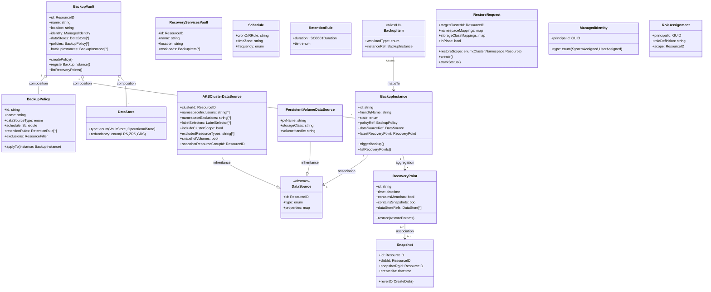
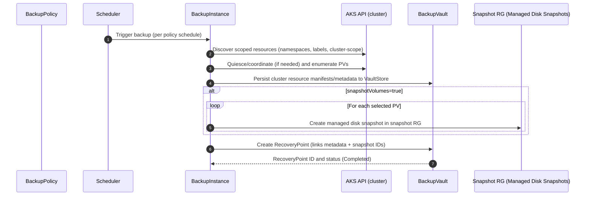
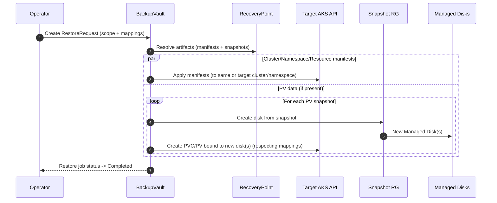

## Azure Backup for AKS — An OOP-style Architecture Overview

Below is a conceptual model of Azure Backup’s components, relationships, and data flow for AKS, expressed with object-oriented design concepts. It’s general enough for typical AKS scenarios and can be mapped to your production setup.

---

### 0) Two “Vault” Flavors at a Glance

- Recovery Services Vault (RSV): Legacy/VM-centric workloads (Azure VMs, SAP HANA, etc.)
- Backup Vault (Data Protection): Modern “Microsoft.DataProtection/backupVaults”. AKS uses this.

In this model, “BackupVault” refers to the Data Protection vault, while “RecoveryServicesVault” is noted for completeness.

---

### 1) Component Hierarchy (OOP Classes)



Notes:

- BackupInstance is the canonical resource in Data Protection. “Backup Item” is often the UI term; for Data Protection it maps to BackupInstance.
- RecoveryPoint contains cluster metadata and may reference PV snapshots.

---

### 2) Relationships and Dependencies (OOP Terms)

- BackupVault composes:
  - DataStores (VaultStore for metadata, optionally OperationalStore semantics)
  - BackupPolicies (1-to-many)
  - BackupInstances (1-to-many)
- BackupInstance associates exactly one DataSource and one BackupPolicy.
- BackupInstance aggregates many RecoveryPoints over time (1-to-many).
- RecoveryPoint may reference many Snapshots (0..n), created for each protected PV.
- AKSClusterDataSource inherits DataSource, adding K8s-specific selection logic (namespaces, labels, resource filters).
- RoleAssignment associates ManagedIdentity principals to Azure scopes (vault, snapshot RG, disks).

---

### 3) Component Responsibilities (Purpose, Key Properties, Operations)

#### BackupVault (Microsoft.DataProtection/backupVaults)

- Purpose: Control plane and storage boundary for backup metadata and orchestration.
- Key properties: id, location, identity (MSI), dataStores (VaultStore type/redundancy), soft delete, immutability settings.
- Operations: createPolicy, registerBackupInstance, list jobs and recovery points.

#### BackupPolicy

- Purpose: Declarative schedule + retention + inclusion/exclusion rules.
- Key properties: dataSourceType (e.g., Microsoft.ContainerService/managedClusters), schedule (RRule), retention rules, resource filters.
- Operations: applyTo(instance), update schedule/retention.

#### DataSource (abstract)

- Purpose: The protected workload identity.
- Specializations:
  - AKSClusterDataSource
    - Properties: clusterId, namespaceInclusions/exclusions, labelSelectors, includeClusterScope, excludedResourceTypes (e.g., secrets), snapshotVolumes (bool), snapshotResourceGroupId.
- Operations: validate selection, resolve discovered entities (namespaces, PVs).

#### BackupInstance

- Purpose: The binding of a policy to a specific data source within a vault.
- Key properties: state, policyRef, dataSourceRef, latestRecoveryPoint.
- Operations: triggerBackup, suspend/resume protection, listRecoveryPoints.

#### RecoveryPoint

- Purpose: Point-in-time artifact for restore.
- Key properties: time, metadata presence, snapshot references, consistency status.
- Operations: restore with params (scope, remapping, in-place vs alternate).

#### Snapshot (managed Disk Snapshot per PV)

- Purpose: Volume-level crash-consistent data for PVs.
- Key properties: snapshot id, disk id, snapshot RG, createdAt.
- Operations: createDiskFromSnapshot, delete.

#### DataStore

- Purpose: Logical store type for backed-up data.
- Types:
  - VaultStore: Backup metadata and possibly resource manifests.
  - OperationalStore: Underlying snapshot location semantics (for AKS this maps to Azure Managed Disk snapshots living in a snapshot resource group you specify).
- Properties: redundancy (LRS/ZRS), immutability (if applicable).

#### RestoreRequest

- Purpose: Asynchronous restore task definition.
- Key properties: targetClusterId, restoreScope (cluster/namespace/resource), namespace mappings, storage class mappings, inPlace flag.
- Operations: create, cancel, trackStatus.

#### ManagedIdentity and RoleAssignment

- Purpose: Authorization model.
- Common roles for AKS backups:
  - On snapshot RG: Disk Snapshot Contributor, Data Operator for Managed Disks, Reader (for vault MSI).
  - On AKS: access via AKS backup extension and service interactions; explicit vault role for cluster MSI may be optional depending on service design, but often “Backup Contributor” is used.

---

### 4) Data Flow

#### A) Backup Operation (AKS)



Key outcomes:

- Cluster manifests and selection metadata go to VaultStore.
- PV data is captured as managed disk snapshots in the specified snapshot resource group.
- A RecoveryPoint ties them together.

#### B) Restore Operation (AKS)



Restore types:

- In-place restore to same cluster/namespace (overwriting) or to new namespaces.
- Cross-cluster restore supported if identity/permissions exist.
- StorageClass/namespace remapping supported.

---

### 5) AKS-Specific Context and Behaviors

- Selection model:
  - Include/Exclude namespaces, labelSelectors, includeClusterScope (cluster roles, CRDs, etc.).
  - Excluded resource types often include “secrets” for security, and certain CSI snapshot controller resources.
- PV snapshots:
  - snapshotVolumes=true instructs Azure Backup to orchestrate CSI-compatible snapshots of managed disks.
  - Snapshots live in a customer-chosen resource group (the “snapshot RG”).
- Recovery points:
  - Typically contain K8s manifests (deployments, services, CRDs) and references to PV snapshots.
- Identify/Permissions required:
  - Vault’s managed identity needs roles on the snapshot RG:
    - Disk Snapshot Contributor
    - Data Operator for Managed Disks
    - Reader
  - Cluster-side extension and service plane handle K8s API access; explicit cluster MSI role on the vault may not always show up but adding “Backup Contributor” is a safe/explicit practice, especially for IaC reproducibility.
- What’s not backed up by default:
  - Kubernetes Secrets (commonly excluded); manage via Key Vault or other secret stores.
  - Ephemeral/emptyDir volumes, dynamic content not backed by disks.
- Operational considerations:
  - All-namespaces strategy increases coverage and cost; selective strategy lowers cost, reduces recovery breadth.
  - Backup windows are short because cluster manifests are light; PV-heavy clusters see longer snapshot phases.

---

### 6) Mapping This Model to Your Production Example

From your investigation (prod-1):

- BackupVault
  - Name: aksbackupvault (uksouth), MSI principal: ed69f0a8-...
  - DataStore: VaultStore (LRS), Soft Delete: On
- BackupPolicy
  - Name: dailyaksbackups, Type: Microsoft.ContainerService/managedClusters
  - Schedule: daily 21:00 UTC, Retention: 14 days
- BackupInstance
  - Name: prod1aksdaily, State: ProtectionConfigured, Cluster: fitfile-cloud-prod-1-aks-cluster
  - AKSClusterDataSource:
    - namespaceInclusions: [] (empty => all namespaces)
    - excludedResourceTypes: [secrets, volumesnapshotcontent.snapshot.storage.k8s.io]
    - includeClusterScope: true
    - snapshotVolumes: true
    - snapshotResourceGroupId: prod-1-snapshot-rg
- RecoveryPoints
  - Daily points with ~10–12 min durations; PV snapshots stored in the snapshot RG.
- RoleAssignments
  - Vault MSI has roles on snapshot RG (Reader, Disk Snapshot Contributor, Data Operator for Managed Disks).
  - AKS MSI has no explicit role on the vault (unusual but currently functional).

This maps 1:1 to the class model above.

---

### 7) Component Summaries (Quick Tables)

#### BackupVault Vs BackupPolicy Vs BackupInstance

|Component|Scope|Cardinality|Stores/References|
|---|---|---|---|
|BackupVault|Subscription/RG|1 vault -> many policies, many instances|Policies, Instances, DataStore config|
|BackupPolicy|Vault|1 policy -> many instances (same type)|Schedule, retention, filters|
|BackupInstance|Vault+DataSource|1 instance -> 1 data source, many RPs|Data source ref, policy ref, state|
|RecoveryPoint|Instance|Many per instance|Metadata + PV snapshot refs|

#### AKSClusterDataSource (Key Attributes)

|Attribute|Meaning|
|---|---|
|namespaceInclusions|[] means “all namespaces”|
|namespaceExclusions|Namespaces to skip|
|labelSelectors|Key/value expressions to include resources|
|includeClusterScope|Include cluster-wide objects (CRDs, roles, etc.)|
|excludedResourceTypes|e.g., secrets|
|snapshotVolumes|If true, snapshot PVs|
|snapshotResourceGroupId|RG for managed disk snapshots|

---

### 8) How to Think About “Backup Item” Vs “Backup Instance”

- In Data Protection (AKS), “Backup Instance” is the underlying ARM resource.
- Azure Backup Center may surface these as “Backup Items” for a consistent UI across vault types.
- For modeling, treat BackupItem as a UI alias pointing to the real BackupInstance.

---

### 9) Practical Design Tips (Terraform/IaC)

- Always model:
  - Vault
  - Policy per data source type (AKS policy)
  - Instance per cluster (and per selection scope if you split protection)
  - Snapshot RG with required role assignments to the vault MSI
- Be explicit with:
  - Namespace strategy (all vs selective)
  - Excluded resource types (secrets, snapshot controller internals)
  - includeClusterScope and snapshotVolumes
- IAM:
  - Even if AKS MSI currently works without a vault role, codify “Backup Contributor” on the vault to avoid drift during re-provisioning.
- Cost:
  - All-namespaces + snapshotVolumes = more snapshots. Monitor snapshot RG growth.

---

### 10) What Details From Your Report Would Let Me Tailor Further

Provide or confirm:

- Full AKS selection config:
  - namespaceInclusions/Exclusions, labelSelectors
  - includeClusterScope, excludedResourceTypes
  - snapshotVolumes flag and snapshot resource group
- Policy details:
  - Schedule (RRule), retention tiers (daily/weekly/monthly)
- Vault data stores:
  - Redundancy (LRS/ZRS), immutability/soft delete settings
- IAM:
  - Role assignments for vault MSI on snapshot RG(s)
  - Any subscriptionor RG-level roles that might explain “implicit” permissions
- Restore preferences:
  - In-place vs alternate cluster, namespace/storage class mappings

With these, I can validate edge cases (e.g., CRD-heavy clusters, cross-cluster restores), and provide targeted Terraform snippets and guardrails.

---

### 11) Minimal Pseudo-Interfaces (For Engineers)

```typescript
interface IBackupVault {
  id: string; name: string; location: string; identity: ManagedIdentity;
  dataStores: DataStore[];
  createPolicy(p: BackupPolicy): void;
  registerInstance(i: BackupInstance): void;
  listRecoveryPoints(instanceId: string): RecoveryPoint[];
}

interface IBackupInstance {
  id: string; dataSource: DataSource; policy: BackupPolicy; state: 'Configured'|'Paused'|'Error';
  triggerBackup(): Promise<RecoveryPoint>;
  listRecoveryPoints(): RecoveryPoint[];
}

interface IAKSClusterDataSource extends DataSource {
  namespacesInclude: string[];
  namespacesExclude: string[];
  labelSelectors: {key:string, op?:'In'|'Eq', values?:string[]}[];
  includeClusterScope: boolean;
  excludedResourceTypes: string[];
  snapshotVolumes: boolean;
  snapshotResourceGroupId: string;
}

interface IRecoveryPoint {
  id: string; time: Date; hasSnapshots: boolean; snapshotIds: string[];
  restore(params: RestoreRequest): Promise<RestoreJob>;
}
```

---

If you share the specific selection rules, retention tiers, and IAM snapshots from your report, I can validate your configuration against best practices and produce Terraform-ready class-to-resource mappings tailored to prod-1.

## Kubernetes Backup Strategy for FITFILE Platform (Azure + AWS)

This guide designs a practical, label-driven backup strategy that works consistently across Azure and AWS, minimizes manual configuration, and integrates with Terraform and ArgoCD/Helm.

Contents:

- Data classification matrix
- Standard label/annotation schema
- YAML examples
- Tool integration (Azure Backup, AWS Backup, Velero)
- Implementation recommendations

---

### 1) Data Classification Matrix

The matrix below classifies common Kubernetes/platform data and recommends how to protect it in Azure and AWS. Use it to decide what you back up with cluster tools vs external services.

|Data Category|Examples|Source of Truth|Recommended Protection|Azure Approach|AWS Approach|Notes|
|---|---|---|---|---|---|---|
|IaC / Infra|VNET/VPC, AKS/EKS, storage accounts/buckets|Terraform + Git|Versioned IaC|Terraform state protected (remote backend + versioning)|Terraform state protected (S3 + DynamoDB lock + versioning)|Do not “backup” IaC via K8s backups.|
|Kubernetes Manifests (stateless workloads)|Deployments, Services, HPAs|Git (Helm/ArgoCD)|Recreate from Git; optional metadata backup|Optional: include in AKS backup or Velero for faster DR|Optional: include in AWS Backup for EKS or Velero|Label as bronze (low priority).|
|Cluster-scoped K8s objects|CRDs, ClusterRoles, StorageClasses|Git (operators/charts)|Recreate from Git; optionally back up|Include via vault/Velero to speed cluster rebuild|Include via AWS Backup or Velero|Useful when many CRDs/operators installed.|
|Config (ConfigMaps)|App config, feature flags|Git for most; some runtime-generated|Recreate from Git; selective backup for runtime-generated|Include selected ConfigMaps|Include selected ConfigMaps|Label only the non-recreatable ones as backup-enabled.|
|Secrets|API keys, DB creds, TLS|External secret stores; some in-cluster|Prefer external secret stores; avoid backing up|Use Azure Key Vault + External Secrets; exclude Secrets from AKS backup|Use AWS Secrets Manager + ESO; exclude Secrets from AWS Backup|If any in-cluster Secrets must be backed up, isolate and label them explicitly and encrypt backup targets.|
|Persistent Volumes (PV) data|PVC-backed app data, uploads|Disks/CSI volumes|Snapshot-based backups; periodic logical backups where applicable|Azure Backup for AKS PV snapshots; or Velero CSI snapshots|AWS Backup for EKS/EBS snapshots; or Velero CSI snapshots|Label PVCs/stateful apps for inclusion; treat as gold/silver/bronze classes.|
|Databases (managed)|Azure DB for PostgreSQL, RDS, DynamoDB|Managed services|Use native service backups/PITR|Azure DB backups/PITR; Geo-redundant if needed|RDS PITR, snapshots; DynamoDB PITR|Do not rely on K8s backup for managed DB data.|
|Databases (in-cluster)|Postgres/MySQL in StatefulSets|PVs, operators|Dual strategy: disk snapshots + logical dumps|PV snapshots + scheduled dumps to Blob|PV snapshots + dumps to S3|Logical dumps protect against corruption; snapshots provide fast recovery.|
|Object storage used by apps|Azure Blob, S3|Buckets/containers|Versioning, lifecycle, replication|Blob versioning + immutability if needed|S3 versioning + replication|Not captured by K8s backups.|
|Message queues|Kafka (PV), SQS/EventHub|PVs or managed|Kafka: PV snapshots + app-level checkpoints|PV snapshots + Kafka tools|PV snapshots + Kafka tools|Consider recovery complexity and order.|
|Container images|ACR/ECR images|Registries|Registry retention + geo-replication|ACR retention rules|ECR lifecycle policies|Not via K8s backup.|
|Observability|Prometheus TSDB, logs|PVs, cloud logs|Usually reconstruct or snapshot PVs|PV snapshots or remote write|PV snapshots or remote write|Often not critical for DR; decide per need.|

Key principles:

- Prefer native backups for managed services (DBs, object storage).
- Use label-driven backups for K8s resources and PVs.
- Recreate from Git where possible; only back up what is not safely reproducible.

---

### 2) Standard Labeling and Annotation Strategy

Design goal: You adjust labels/annotations in Git (Helm values/manifests), and backup tools pick up changes automatically. No per-resource manual configuration in cloud consoles.

#### 2.1 Core Labels (shared across Azure, AWS, Velero)

Use a dedicated domain to avoid collisions: `fitfile.io/*`

- fitfile.io/backup-enabled: "true" | "false"
  - Master switch for inclusion. Defaults to “false” for most stateless resources; “true” for PVs and stateful workloads.
- fitfile.io/backup-class: "gold" | "silver" | "bronze"
  - Maps to schedules/retention: e.g., gold = nightly + weekly + 30d, silver = nightly 14d, bronze = weekly 14d.
- fitfile.io/backup-scope: "data" | "app" | "cluster"
  - Optional hint: data = PV-focused; app = workload manifests; cluster = cluster-scoped resources.
- fitfile.io/backup-retain: ISO8601 duration (e.g., "P14D", "P30D")
  - Optional override for retention; tools may not consume it directly but useful for policies/validation.
- app.kubernetes.io/part-of
  - Reuse standard label to group related resources for selection.

Recommended minimal set to actually drive behavior:

- fitfile.io/backup-enabled
- fitfile.io/backup-class

#### 2.2 Helpful Annotations (tool-specific but Safe to add)

- velero.io/exclude-from-backup: "true"
  - Explicit exclusion for Velero when needed.
- backup.velero.io/backup-volumes: "vol1,vol2"
  - Include only specific volumes from a pod (Velero).
- fitfile.io/logical-backup: "true"
  - Signals a sidecar/cronjob performs logical dumps (e.g., pg_dump), not consumed by cloud tools but useful for policy.
- fitfile.io/restore-priority: "high|normal|low"
  - For runbooks/automation ordering.

Note on Secrets:

- Prefer excluding Secrets from cluster backups. If you must back them up, add a targeted label like fitfile.io/backup-secrets: "true" only on those that may be backed up, and limit access with RBAC/encryption.

#### 2.3 Where to Put Labels

- Namespaces: Apply backup-class and enabled defaults; tools can select whole namespaces via label.
- StatefulSets/Deployments: Label the controller to include manifests (app-level backup).
- PVCs: Label PVCs explicitly to ensure PV inclusion.
- Cluster-scoped (CRDs): Controlled via separate “cluster config” app; label the CRD objects if you plan to capture them.

---

### 3) Label-to-Tool Mapping

Use a small number of backup configurations per cluster/cloud that select resources by label. This reduces manual work to near-zero.

#### Azure Backup for AKS (Microsoft.DataProtection)

- Create 3 backup instances per cluster (gold/silver/bronze), each bound to a corresponding policy and label selector:
  - Label selector: fitfile.io/backup-enabled= true AND fitfile.io/backup-class= gold|silver|bronze
- Keep includeClusterScope true for at least one instance if you want cluster-scoped objects too.
- Exclude resource types: secrets; snapshotVolumes: true; specify snapshot resource group.
- Namespace strategy: prefer label selection over “all namespaces”; you can also set the labels on namespaces and selectors can include namespace labels (Azure supports labelSelectors across resources; ensure PVCs/StatefulSets carry labels).

Example selection logic to configure in Terraform (conceptual):

```sh
label_selectors = [
  { key = "fitfile.io/backup-enabled", operator = "In", values = ["true"] },
  { key = "fitfile.io/backup-class",   operator = "In", values = ["gold"] }
]
```

#### AWS Backup for EKS

- Create 3 backup plans (gold/silver/bronze).
- Create resource assignments for each plan selecting Kubernetes resources by labels:
  - Include: fitfile.io/backup-enabled=true AND fitfile.io/backup-class=gold|silver|bronze
- Ensure EBS snapshotting is enabled for PVCs (CSI and IAM roles set). AWS Backup for EKS can capture K8s manifests and EBS snapshots tied to those workloads.

Note: AWS Backup label selection supports arbitrary Kubernetes labels; stick to the same fitfile.io/* keys.

#### Velero (optional Cross-cloud layer)

- Install Velero with CSI plugins.
- Create 3 Schedules with label selectors aligned to the same labels:
  - gold: nightly + weekly retention
  - silver: nightly retention 14d
  - bronze: weekly 14d (manifests only)
- Use provider-specific snapshots or object-store for manifests. Configure Azure Blob/S3 per cluster.

Velero advantages:

- Uniform across clouds, restores to any cluster.
- Fine-grained annotations and exclude rules.
- Complements cloud-native backup (not necessarily a replacement).

---

### 4) Label/Annotation Examples (YAML)

#### 4.1 Namespace Defaults

```yaml
apiVersion: v1
kind: Namespace
metadata:
  name: fitfile-prod
  labels:
    fitfile.io/backup-enabled: "true"
    fitfile.io/backup-class: "silver"
    app.kubernetes.io/part-of: "fitfile"
```

#### 4.2 Stateful App with PV (gold)

```yaml
apiVersion: apps/v1
kind: StatefulSet
metadata:
  name: uploads
  namespace: fitfile-prod
  labels:
    fitfile.io/backup-enabled: "true"
    fitfile.io/backup-class: "gold"
    fitfile.io/backup-scope: "data"
    app.kubernetes.io/part-of: "fitfile"
spec:
  replicas: 3
  selector:
    matchLabels:
      app: uploads
  template:
    metadata:
      labels:
        app: uploads
        fitfile.io/backup-enabled: "true"   # inherited by pods; not strictly needed
        fitfile.io/backup-class: "gold"
    spec:
      containers:
      - name: app
        image: ghcr.io/fitfile/uploads:1.2.3
  volumeClaimTemplates:
  - metadata:
      name: data
      labels:
        fitfile.io/backup-enabled: "true"   # ensure PVC is selected
        fitfile.io/backup-class: "gold"
        app.kubernetes.io/part-of: "fitfile"
    spec:
      accessModes: ["ReadWriteOnce"]
      storageClassName: managed-premium
      resources:
        requests:
          storage: 200Gi
```

#### 4.3 Deployment (stateless, bronze)

```yaml
apiVersion: apps/v1
kind: Deployment
metadata:
  name: api
  namespace: fitfile-prod
  labels:
    fitfile.io/backup-enabled: "false"      # manifests from Git; no need to back up
    fitfile.io/backup-class: "bronze"
    app.kubernetes.io/part-of: "fitfile"
spec:
  replicas: 4
  selector:
    matchLabels: { app: api }
  template:
    metadata:
      labels: { app: api }
    spec:
      containers:
      - name: api
        image: ghcr.io/fitfile/api:4.5.6
```

#### 4.4 PVC Labeled Directly (if Created separately)

```yaml
apiVersion: v1
kind: PersistentVolumeClaim
metadata:
  name: reports-pvc
  namespace: fitfile-prod
  labels:
    fitfile.io/backup-enabled: "true"
    fitfile.io/backup-class: "silver"
spec:
  accessModes: ["ReadWriteOnce"]
  storageClassName: managed-premium
  resources:
    requests:
      storage: 100Gi
```

#### 4.5 ConfigMap (runtime-generated) Included

```yaml
apiVersion: v1
kind: ConfigMap
metadata:
  name: dynamic-config
  namespace: fitfile-prod
  labels:
    fitfile.io/backup-enabled: "true"
    fitfile.io/backup-class: "bronze"
data:
  featureX: "on"
```

#### 4.6 Secret Handling

Prefer not to back up Secrets; use secret managers. If some Secrets must be backed up (e.g., non-recreatable TLS), label narrowly and encrypt backups.

```yaml
apiVersion: v1
kind: Secret
metadata:
  name: legacy-tls
  namespace: fitfile-prod
  labels:
    fitfile.io/backup-enabled: "true"
    fitfile.io/backup-class: "gold"
  annotations:
    # If using Velero and you explicitly want to include this Secret:
    velero.io/exclude-from-backup: "false"
type: kubernetes.io/tls
data:
  tls.crt: ...
  tls.key: ...
```

---

### 5) Best Practices to Maintain Labelling

- Helm common labels:
  - Use Helm’s global/common labels so every charted resource gets base labels from values.yaml.
- Namespace defaults:
  - Define backup defaults at Namespace level; override only where needed.
- Enforce via policy:
  - Use Kyverno or OPA Gatekeeper to require fitfile.io/backup-enabled and fitfile.io/backup-class on PVCs and StatefulSets; auto-add defaults if missing.
- Review cadence:
  - Periodically list unlabeled PVCs/StatefulSets and alert (e.g., via a policy report).
- Keep it minimal:
  - Two labels drive most selection; avoid an explosion of keys.

Example Kyverno policy (auto-add defaults on PVCs):

```yaml
apiVersion: kyverno.io/v1
kind: ClusterPolicy
metadata:
  name: add-backup-labels-to-pvc
spec:
  rules:
  - name: default-backup-labels
    match:
      resources:
        kinds: ["PersistentVolumeClaim"]
    mutate:
      patchStrategicMerge:
        metadata:
          labels:
            +(fitfile.io/backup-enabled): "{{ request.object.metadata.labels.fitfile\\.io/backup-enabled || 'true' }}"
            +(fitfile.io/backup-class): "{{ request.object.metadata.labels.fitfile\\.io/backup-class || 'silver' }}"
```

---

### 6) Tool Integration Details

#### Azure Backup for AKS

- Create policies and instances per class:
  - gold: higher frequency/retention
  - silver: nightly P14D
  - bronze: weekly P14D (optionally include only manifests)
- Configure selection using label selectors:
  - Include resources with fitfile.io/backup-enabled=true and class-specific value.
- Exclusions:
  - Exclude secrets and CSI snapshot controller internals.
- PV snapshots:
  - Enable snapshotVolumes; grant the Backup Vault MSI roles on the snapshot RG (Disk Snapshot Contributor, Data Operator for Managed Disks, Reader).
- Cluster-scope:
  - Consider one instance with includeClusterScope=true and bronze class labels for CRDs/roles.

Alignment with your prod findings:

- You currently back up all namespaces. Switching to label-based selection will let you narrow scope without changing the backup instance frequently—just adjust labels in Git.

#### AWS Backup for EKS

- Create 3 backup plans (gold/silver/bronze) with schedules/retention to match Azure.
- Create resource assignments that select Kubernetes resources by label selectors:
  - fitfile.io/backup-enabled=true and fitfile.io/backup-class=…
- Ensure EKS cluster has AWS Backup integration and permissions to snapshot EBS volumes (IRSA, controllers).
- If excluding Secrets, configure selection to avoid them or maintain externalization policy.

#### Velero (optional but powerful)

- If you want cross-cloud uniformity and easier DR drills:
  - Install Velero with CSI plugins in each cluster.
  - Create Schedules with label selectors:
    - gold schedule runs nightly + weekly; includes snapshots.
    - silver nightly; includes snapshots.
    - bronze weekly; manifests only.
  - Use annotations like velero.io/exclude-from-backup where needed.
- Storage:
  - Azure: use Blob Storage; AWS: use S3. Enable bucket versioning and encryption.

---

### 7) Example: Policy Mapping (Gold/Silver/Bronze)

|Class|Target Workloads|Schedule|Retention|Includes|Notes|
|---|---|---|---|---|---|
|gold|Mission-critical PV data (databases, uploads)|Daily at 21:00 UTC + Weekly|30 days + 8 weeks|PV snapshots + manifests|Add logical DB dumps if in-cluster DBs.|
|silver|Important PV data, non-critical|Daily at 21:00 UTC|14 days|PV snapshots + manifests|Default class for PVCs via policy.|
|bronze|Manifests/cluster config only|Weekly|14 days|K8s objects (no PVs)|For rapid cluster rebuilds of CRDs/operators.|

Implementation in tools:

- Azure: create three policies + three instances per cluster, each with label selectors.
- AWS: three backup plans + assignments.
- Velero: three schedules with selectors.

---

### 8) Implementation Steps (Practical Plan)

1. Define and codify labels

- Document in an internal README:
  - fitfile.io/backup-enabled: true|false
  - fitfile.io/backup-class: gold|silver|bronze
- Add to Helm chart templates as common labels; provide values.yaml defaults per environment.

2. Enforce/Default

- Add Kyverno policies to default silver on PVCs and require explicit override for bronze/none.

3. Configure backup tools once per cluster

- Azure:
  - 3 policies + 3 backup instances using label selectors.
  - Exclude secrets; include cluster scope as per decision.
  - Ensure vault MSI roles on snapshot RG.
- AWS:
  - 3 backup plans + assignments using label selectors.
  - Ensure EBS snapshot permissions and CSI integration.

4. Databases

- Managed DBs: verify PITR settings, cross-region, and retention.
- In-cluster DBs: add CronJobs for logical dumps to object storage with server-side encryption and lifecycle.

5. Secrets

- Migrate to External Secrets Operator with Azure Key Vault / AWS Secrets Manager.
- Remove Secrets from cluster backups; only whitelist exceptional cases.

6. Tests and runbooks

- Quarterly restore drills: namespace-level and full app (PV + manifests).
- Validate RPO/RTO against gold/silver/bronze expectations.
- Monitor backup jobs and snapshot costs.

7. Terraform integration

- Codify Azure/AWS backup policies and label selectors in Terraform modules.
- Inputs: schedules, retention, label selector tuples.
- Outputs: vault/plan IDs; expose them for ops dashboards.

---

### 9) Quick Terraform Shape (Conceptual)

Azure (Data Protection backup instance with label selectors):

```hcl
module "aks_backup_gold" {
  source = "./modules/aks_backup_instance"
  name   = "gold"
  policy_name = "gold-policy"
  label_selectors = [
    { key = "fitfile.io/backup-enabled", operator = "In", values = ["true"] },
    { key = "fitfile.io/backup-class",   operator = "In", values = ["gold"] }
  ]
  include_cluster_scope = true
  excluded_resource_types = ["secrets", "volumesnapshotcontent.snapshot.storage.k8s.io"]
  snapshot_volumes = true
  snapshot_rg_id   = azurerm_resource_group.snapshots.id
}
```

AWS (Backup resource assignment pseudocode):

```hcl
module "eks_backup_gold" {
  source = "./modules/aws_backup_eks_plan"
  name   = "gold"
  schedule_cron = "cron(0 21 * * ? *)"
  retention_days = 30
  selection_label_match = {
    "fitfile.io/backup-enabled" = ["true"]
    "fitfile.io/backup-class"   = ["gold"]
  }
}
```

Velero (Schedule CR):

```yaml
apiVersion: velero.io/v1
kind: Schedule
metadata:
  name: gold-nightly
spec:
  schedule: "0 21 * * *"
  template:
    includedNamespaces: ["*"]
    labelSelector:
      matchLabels:
        fitfile.io/backup-enabled: "true"
        fitfile.io/backup-class: "gold"
    snapshotVolumes: true
    ttl: 720h # 30 days
```

---

### 10) Notes and Pitfalls

- Label propagation: PVCs created by StatefulSets need labels on volumeClaimTemplates; don’t rely only on StatefulSet metadata.
- Secrets: Avoid backing them up; ensure cloud backups exclude them to reduce risk.
- Cross-cloud parity: Schedules/retentions should match across Azure/AWS to simplify ops.
- Costs: PV snapshots can be significant. Use classes wisely; prune unneeded volumes.
- Restore testing: The only way to verify label-based selection covers everything you need.
