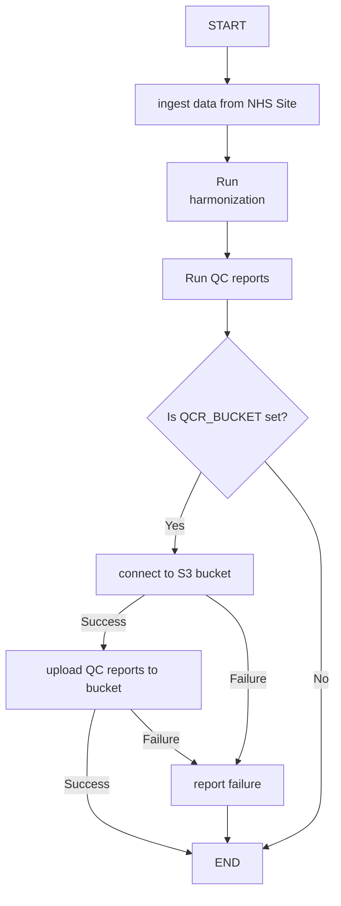

## Upload QC Reports to S3 Bucket

This document describes the interface and implementation for uploading QC reports to an AWS S3 bucket.

After running the ETL harmonization logic, Quality Control (QC) programs are executed. These programs write their

reports to a standard location. After successful completion, these reports should also be uploaded to an AWS S3

bucket. The URL and credentials for the S3 bucket are passed into the ETL container through environment

variables.

### Interface

The interface between the Fitfile environment that controls the ETL container, is defined as a set of environment variables

| Item                 | Environment Variable                        | Description                                                                     |
| -------------------- | ------------------------------------------- | ------------------------------------------------------------------------------- |
| Reports directory    | `QCR_REPORTS_PATH` (was: `QC_REPORTS_PATH`) | Location where the reports and logs will be written. Defaults to `/tmp/reports` |
| AWS S3 Bucket        | `QCR_BUCKET`                                | Name of the AWS S3 bucket                                                       |
| AWS Region name      | `QCR_REGION_NAME`                           | AWS Region                                                                      |
| AWS Assume Role      | `QCR_ROLE_ARN`                              | AWS Role to assume for bucket access                                            |
| S3 access key id     | `QCR_ACCESS_KEY_ID`                         | AWS access key                                                                  |
| S3 secret access key | `QCR_SECRET_ACCESS_KEY`                     | AWS secret key                                                                  |

### Implementation

After successful completion of the ETL harmonization and QC reporting steps, and if the `QCR_BUCKET` environment is set,

the upload step will be executed to copy the generated QC reports and log files into the S3 bucket. If `QCR_BUCKET` is

not set, no upload will be attempted, and no error will be generated.

If `QCR_BUCKET` is set, absent values for the credentials or a failure to access the S3 bucket will generate an error.

The reports and log files will be uploaded in a zip file with the following naming convention:

    hyve_<site>_YYYY-MM0DD-HH.MM.SS.zip

where `<site>` will be replaced by the abbrevation in use to identify the NHX site (e.g. 'cuh', 'nnuh' or 'mkuh').

### Logic Flow

Below diagram shows the logic flow of the QC reports upload in the context of the ETL workflow:

### Implementation

The script `upload_qc_reports.sh` implements the functionality. First, the reports and log files are zipped into a file

named using the following template: `QCReportsAndLogs-${NHS_SITE}-YYYY-MM-DD-HH.MM.zip` where `${NHS_SITE}` is the

environment variable identifying the NSH site as provided to the ETL container. An example of this name is

"`QCReportsAndLogs-mkuh-2025-11-04-13.20.zip`".

The upload is performed by a Python script (`upload_qc_reports_to_s3_assumerole.py`) using the

[AWS boto3 package](https://pypi.org/project/boto3/) to interact with the AWS infrastructure for Role Assuming and uploading

the zip file into the S3 bucket. The zip file will be prefixed by a path identifying the NSG site, so the

Key in S3 for the example name above will be "`mkuh/QCReportsAndLogs-mkuh-2025-11-04-13.20.zip`".

### Open Questions

1. Did we already decide on a generic mechanism how any component of the ETL pipeline can report failure to Fitfile?
   1. And do we treat success implicitly, or should we also make that explicit?

### Notes on Testing Locally

For local testing by The Hyve, a setup with [LocalStack](https://www.localstack.cloud/) was created (also using [the LocalStack docker container](https://hub.docker.com/r/localstack/localstack)).

For switching between an actual AWS S3 Bucket and one configured in LocalStack,

two environment variables are available, listed below. The third environment variable can be used to enable repeated testing

of the upload without having to regenerate the reports.

| Item           | Environment Variable | Description                                                                                                                                                                                           |
|----------------|----------------------|-------------------------------------------------------------------------------------------------------------------------------------------------------------------------------------------------------|
| Test mode      | `QCR_TEST_MODE`      | Can be 'none' for production (or unset), or 'localstack'                                                                                                                                              |
| Test endpoint  | `QCR_TEST_ENDPOINT`  | When `QCR_TEST_MODE` is set to 'localstack', the value of `QCR_TEST_ENDPOINT` will be used to set the endpoint for the AWS client                                                                     |
| Retain reports | `QCR_KEEP_REPORTS`   | In normal operation, after the generated reports have been successfully zipped, the reports and logs are removed. When `QCR_KEEP_REPORTS` has the value "keep-reports", the deletion does not happen. |

See the docker-compose setup in the `test` directory for details on the implementation.
