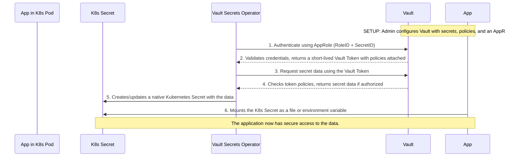

## Vault to Kubernetes Secrets Management Guide

This guide explains how to securely manage and access secrets in Kubernetes using HashiCorp Vault. The setup uses Vault's AppRole authentication method and the Vault Secrets Operator for Kubernetes.

### Architecture Overview

1. **Vault Namespaces**:
   - `admin/central`: Central management namespace for PKI and core policies
   - `deployments/<deployment>`: Isolated namespace for each deployment (e.g., `deployments/hie-prod-34`)

2. **Key Components**:
   - Vault AppRole authentication
   - Vault KV v2 secrets engine
   - Vault PKI for certificate management
   - Vault Secrets Operator in Kubernetes

### Adding a New Secret

#### 1. Add Secret to Vault

##### 1.1 Define the Secret in Terraform

Add your secret to the appropriate deployment in `locals.tf`:

```hcl
"your-deployment" = {
  secrets = tomap({
    "your-secret" = {},  # Add your new secret here
    "existing-secret" = {},
  })
  auto_create = true
}
```

##### 1.2 Apply Terraform Changes

```bash
cd /Volumes/DAL/Fitfile/gitlab/FITFILE/central-services/hcp/vault
terraform plan -var-file=vars.tfvars
terraform apply -var-file=vars.tfvars
```

This will:

1. Create a KV v2 secret at `deployments/your-deployment/secrets/your-secret`
2. Generate an AppRole for accessing this secret
3. Create necessary policies

#### 2. Store Secret Values

##### 2.1 Using Vault CLI

```bash
# Log in to Vault
export VAULT_ADDR=https://vault-public-vault-8b38a0c2.e3dedc53.z1.hashicorp.cloud:8200
export VAULT_NAMESPACE=admin/deployments/your-deployment

# Write secret values
vault kv put secrets/your-secret \
  username="admin" \
  password="s3cr3t" \
  api_key="abc123"
```

#### 3. Configure Kubernetes to Access the Secret

##### 3.1 Create a VaultAuth Resource

Create a `vaultauth.yaml` file:

```yaml
apiVersion: secrets.hashicorp.com/v1beta1
kind: VaultAuth
metadata:
  name: your-auth
  namespace: your-namespace
spec:
  method: appRole
  mount: approle
  namespace: admin/deployments/your-deployment
  appRole:
    roleId: "YOUR_ROLE_ID" # Get this from Vault or Terraform output
    secretRef: your-secret-creds # Reference to a Kubernetes secret with secret_id
```

##### 3.2 Create a Secret with AppRole Credentials

```yaml
apiVersion: v1
kind: Secret
metadata:
  name: your-secret-creds
  namespace: your-namespace
type: Opaque
stringData:
  secretId: "YOUR_SECRET_ID" # Get this from Vault or Terraform output
```

##### 3.3 Create a VaultDynamicSecret Resource

```yaml
apiVersion: secrets.hashicorp.com/v1beta1
kind: VaultDynamicSecret
metadata:
  name: your-secret
  namespace: your-namespace
spec:
  mount: secrets
  path: your-secret
  destination:
    name: your-kubernetes-secret
    create: true
  vaultAuthRef: your-auth
  refreshAfter: "15s"
  renewalPercent: 67
  params:
    version: "2"
```

### Secret Lifecycle

1. **Creation**:
   - Secret is created in Vault
   - AppRole and policies are configured
   - Kubernetes resources are deployed to access the secret

2. **Access**:
   - Vault Secrets Operator authenticates using AppRole
   - Secret values are fetched from Vault
   - Values are synchronized
     Of course. Here is a wiki-style document explaining the data perspective of secrets management with Vault and Kubernetes.

## Vault & Kubernetes Secrets: A Data-Centric View

This document explains how sensitive data ("secrets") is protected and managed when using HashiCorp Vault with a Kubernetes cluster. We'll look at the components involved, their roles as entities, and how they collaborate to secure data from its source in Vault to its consumption by an application in a Kubernetes pod.

### The Goal: Protecting Your Data

The primary objective is to ensure that sensitive information—like API keys, database passwords, or TLS certificates—is never hardcoded in application source code, container images, or Kubernetes manifests. Instead, we want to store this data securely in a central, audited location (Vault) and provide it to applications securely and just-in-time.

### The Core Components (The Entities)

Think of this system as a secure operation involving several key players, each with a specific role.

| Entity                | Component                      | Role & Description                                                                                                                                                                                                                                                                                                 |
| :-------------------- | :----------------------------- | :----------------------------------------------------------------------------------------------------------------------------------------------------------------------------------------------------------------------------------------------------------------------------------------------------------------- |
| **The Treasure**      | **Secret Data**                | This is the raw, sensitive information (the "bits") you need to protect. In Vault, this data is stored as key-value pairs within a **KV Secrets Engine**. It can also be generated on-demand, like a TLS certificate from a **PKI Secrets Engine**.                                                                |
| **The Fortress**      | **HashiCorp Vault**            | This is the secure, centralized system that stores, manages, and controls access to the secret data. It acts as a fortified safe. In our environment, Vault is organized into **Namespaces** (e.g., `admin/central`, `deployments/...`) to isolate tenants and environments, creating a "vault within a vault."    |
| **The Client**        | **Kubernetes Pod/Application** | This is the end consumer of the secret data. It's an application running in a Kubernetes pod that needs the information to perform its function (e.g., connect to a database).                                                                                                                                     |
| **The Identity Card** | **Vault AppRole**              | This is how an application proves its identity to Vault. It's designed for machine-to-machine authentication and consists of two pieces: a **Role ID** (like a username, publicly known) and a **Secret ID** (like a password, which is itself a secret).                                                          |
| **The Rulebook**      | **Vault Policy**               | This is a set of rules that dictates what an authenticated entity (identified by its AppRole) is allowed to do. For example, a policy might state, "The holder of this identity is allowed to *read* the secret at path `secrets/database/config` but nothing else." Policies are the foundation of authorization. |
| **The Butler**        | **Vault Secrets Operator**     | This is a specialized controller running inside Kubernetes. Its job is to automate the entire process of authenticating with Vault, retrieving the secret data, and making it available to the application as a native Kubernetes `Secret` object. It acts as a trusted intermediary.                              |

### The Workflow: How They Protect the Data

Here is the step-by-step journey of a secret from the Vault fortress to the application client, orchestrated by the butler.



1. **Authentication**: The Vault Secrets Operator (VSO) uses the **AppRole ID** and **Secret ID** assigned to the application to authenticate with Vault.
2. **Authorization**: Vault verifies the credentials and issues a temporary **Vault Token** to the VSO. This token is imbued with the permissions defined in the associated **Vault Policy**.
3. **Retrieval**: The VSO uses this token to request the specific secret data from the **KV or PKI engine** in Vault.
4. **Enforcement**: Vault checks the token's policy. If the policy grants access to the requested path, Vault sends the secret data back to the VSO. If not, it returns a `permission denied` error.
5. **Synchronization**: The VSO receives the data and creates a standard Kubernetes `Secret` object in the application's namespace.
6. **Consumption**: The application pod mounts this Kubernetes `Secret` as either an environment variable or a file in its filesystem, allowing it to consume the data without ever knowing where it came from or having direct credentials to Vault.

This entire process ensures that the application's access is scoped, temporary, and audited, and the sensitive "bits of data" are protected at every step of their journey.
