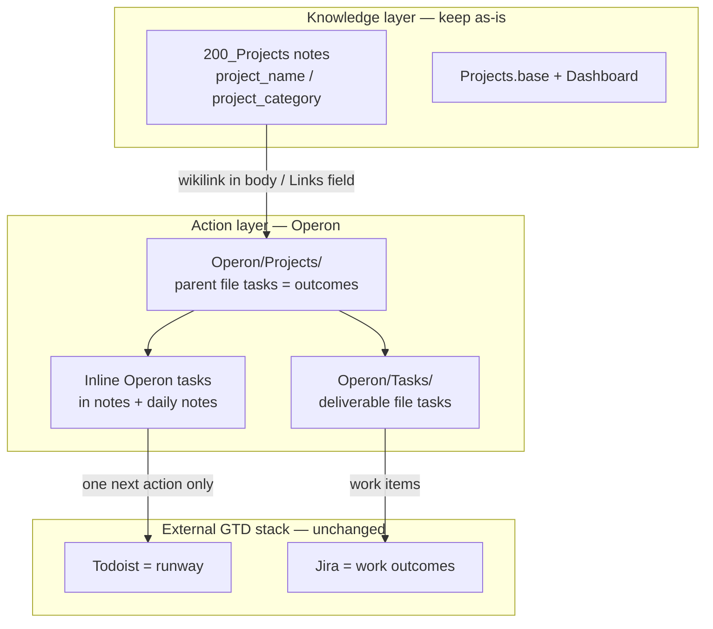
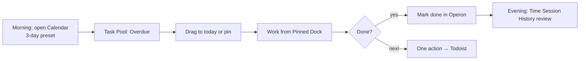

## Verdict: Improvement, but not a Replacement

Operon is a strong addition for vault-native task management. It is not a drop-in replacement for what `Projects.base` and `200_Projects` already do well.

| Layer | Current tool | What it does |
|-------|--------------|--------------|
| Project knowledge corpus | `30_Library/200_Projects` + `Projects.base` | ~160 notes tagged by `project_name`, `project_category`, `project_status`—specs, runbooks, education material, audits |
| Project browsing | Obsidian Bases (`Projects.base`) + Dataview dashboard | Filter/sort the corpus by status, category, parent project |
| Runway (next physical action) | Todoist | Per your [[gtd-action-system]] |
| Work outcomes | Jira | FTFL tickets, acceptance criteria |
| Checkbox queries | Obsidian Tasks plugin | `02_bases/All Tasks.md` queries `path includes Projects/` |

Operon fills a gap none of the above cover well:

- Durable task identity (`operonId`)—critical for agents and Hermes
- Parent/child task trees inside notes
- Kanban, Calendar, Task Pool, pinning, time tracking
- Inline ↔ file task promotion without losing metadata

It does not replace:

- Projects.base—that catalogues _notes_, not _tasks_
- Todoist—your flat runway across all of life
- Jira—work-team outcomes and status

Bottom line: Operon improves personal/project action management inside the vault. Keep `200_Projects` as the knowledge layer; use Operon for the actionable layer on top.

---

## Your Current Setup (Snapshot)

`200_Projects` is mixed-purpose—not a clean project registry:

| Pattern | Count |
|---------|------:|
| `type: project` | 68 |
| `type: note` / empty / other | ~90 |
| Notes with `project_name` | 152 |
| `project_status: active` | 65 |

Top `project_name` groupings: Refined Deployment (30), Bessie (33), k8s (24), ProdOS (10), Core (9), Deployments (8), OMOP (7).

`Projects.base` filters on `project_status`, `project_category`, `project_name`—good for browsing knowledge, not for scheduling or next-action workflow.

Plain checkboxes exist but are sparse in `200_Projects` (e.g. four items in `Hermes, OpenRouter, and Model Orchestration.md`). Most open loops live in Jira (`SoT - Work Open Loops`), inbox CLARIFY notes, protocols, and daily notes.

No Operon tasks indexed yet—zero `operonId` in the vault.

---

## Operon Config Analysis (V1.3.0, Fresh iNstall)

Key settings from `.obsidian/plugins/operon/data.json`:

| Setting | Current value | Implication |
|---------|---------------|-------------|
| `fileTasksFolder` | `Operon/Tasks` | Folder does not exist yet—created on first file task |
| `inlineTaskSaveMode` | `daily-notes` | Quick-capture inline tasks go to today's daily note |
| `inlineTaskTargetFile` | `Operon/Tasks/Operon Inbox.md` | Fallback when daily note unavailable |
| `autoParentFileTask` | `true` | Subtasks created inside a file task auto-link as children |
| `inlineTaskParentFileHeadingKeyword` | `Backlog` | Inline subtasks land under a `## Backlog` heading in parent file tasks |
| Pipeline | Single Project pipeline | Brainstorming → Planned → InProgress → Finished / Paused / Dropped |
| Default priority | `C` | S/A/B/C/D/E/F scale configured |
| Filters | Daily ToDo, Last 7 Days Open, Dynamic File Task | Demo defaults—not yet ProdOS-aligned |
| Kanban | Wired to Project pipeline, swimlane by priority | Ready but empty |
| `excludedFolders` | `[]` | Whole vault indexed |
| Pinned dock | Hidden (`pinnedDockVisible: false`) | Enable when you have a working set |

Conflict to resolve: you also have Obsidian Tasks (`obsidian-tasks-plugin`) with `globalQuery: path includes 200_projects`. Operon's README explicitly warns about overlapping task plugins. Both can coexist if you define clear boundaries (see Phase 0 below).

Frontmatter collision risk: many notes use legacy `status: active`. Operon file tasks use `status: Project.InProgress` (pipeline-qualified). Do not bulk-convert `200_Projects` notes to file tasks without renaming or migrating legacy `status` first.

---

## Recommended Architecture (Operon + ProdOS)



Rule of three altitudes (from your GTD system):

1. Operon—personal project backlog, subtasks, planning, agent-addressable work _inside the vault_
2. Todoist—exactly one next physical action per active thread (pin from Operon when ready to execute)
3. Jira—work deliverables with team visibility; link via `Links` or note body, never duplicate status

---

## Migration Plan

### Phase 0—Policy (30 Minutes, no Vault Changes)

Write three sentences into a scratch note:

1. `200_Projects` notes stay knowledge unless explicitly promoted to Operon file tasks.
2. Operon owns actionable items only (backlog, subtasks, scheduled work).
3. Obsidian Tasks plugin: read-only legacy OR disabled for paths Operon manages—pick one.

Obsidian Tasks decision:

| Option | When |
|--------|------|
| A—Retire gradually | Operon becomes sole task manager; remove ` ```tasks ` blocks after filters exist |
| B—Scoped coexistence | Obsidian Tasks queries only `00_Inbox/CLARIFY` and protocols; Operon owns everything else |

Recommend B for a low-risk pilot.

---

### Phase 1—Configure Operon for ProdOS (1 Hour)

1.1 Create folder scaffold

```
Operon/
├── Projects/          ← parent outcome file tasks
├── Tasks/             ← deliverable file tasks (already configured)
│   └── Operon Inbox.md
└── Templates/         ← optional file-task templates
```

1.2 Adjust settings (Operon → Settings → Task Creation)

| Setting | Recommended |
|---------|-------------|
| File tasks folder | `Operon/Tasks` (keep) |
| Inline save mode | `daily-notes` (keep—matches your dump workflow) |
| Auto-parent file task | `true` (keep) |
| Default estimate | `30` min (keep) |
| Excluded folders | Add `raw/`, `gemini-scribe/Agent-Sessions/` |

1.3 Add a second pipeline for personal/life work

Keep Project for multi-step outcomes. Add Action pipeline:

| Status | Purpose |
|--------|---------|
| `Action.Ready` | Clarified, can pin to dock |
| `Action.Doing` | Active (tracking target) |
| `Action.Done` | Finished |
| `Action.Wont` | Cancelled |

Use Project pipeline for parent outcomes; Action for leaf tasks.

1.4 Custom key mappings (optional, high value)

Add custom fields that mirror ProdOS without colliding:

| Canonical key | Visible name | Type | Use |
|---------------|--------------|------|-----|
| `prodosProject` | `prodosProject` | text | Maps to `project_name` |
| `prodosCategory` | `prodosCategory` | text | Maps to `project_category` |
| `jiraKey` | `jiraKey` | text | e.g. `FTFL-673` |

1.5 Contexts—seed these in Operon settings:

`@computer`, `@office`, `@calls`, `@deep-work`, `@admin`, `@bessie`

---

### Phase 2—Create Parent Outcome Tasks (2 Hours)

Create one file task per active umbrella project in `Operon/Projects/`—not by migrating knowledge notes.

Priority parents (from your active workload):

| Parent file task | Maps from `project_name` | Pipeline status |
|------------------|------------------------|-----------------|
| `Refined Deployment.md` | Refined Deployment | Project.InProgress |
| `Hermes Optimisation.md` | Hermes Optimisastion | Project.InProgress |
| `ProdOS.md` | ProdOS | Project.InProgress |
| `FITFILE Pipeline Improvement.md` | (from FITFILE-Pipeline-Improvement-SDD) | Project.InProgress |
| `Bessie Education.md` | Bessie | Project.Planned |
| `OMOP Pipeline.md` | OMOP | Project.InProgress |

Parent file task frontmatter template:

```yaml
---
operonId: <auto>
status: Project.InProgress
priority: A
prodosProject: "Refined Deployment"
prodosCategory: refined_deployment
datetimeCreated: 2026-06-11T15:00:00+01:00
Links:
  - "[[FITFILE-Pipeline-Improvement-SDD]]"
  - "[[Projects Dashboard]]"
---

## Definition of done

<physical end state>

## Backlog

<!-- Operon inline subtasks land here -->

## Knowledge links

- [[FITFILE-Pipeline-Improvement-SDD]]
- [[2026-06-12-pipeline-health-report]]
```

The `## Backlog` heading matters—your config uses `inlineTaskParentFileHeadingKeyword: "Backlog"`.

---

### Phase 3—Pilot One Project (Half dAy)

Pick: Refined Deployment (30 related notes, active pipeline work, existing SDD).

| Step | Action |
|------|--------|
| 1 | Create parent `Operon/Projects/Refined Deployment.md` |
| 2 | Open `FITFILE-Pipeline-Improvement-SDD.md`—select any `- []` items → Convert Selection to Operon Tasks |
| 3 | Set `parentTask` on those inline tasks to the parent |
| 4 | Create 3–5 deliverable file tasks in `Operon/Tasks/` for concrete next chunks |
| 5 | Build Operon filter "Refined Deployment—Open": `prodosProject` contains `Refined Deployment` AND checkbox is open |
| 6 | Open Kanban preset scoped to that filter |
| 7 | Pin one leaf task to Pinned Dock → when ready to execute, copy one next action to Todoist |

Success criteria for pilot:

- [ ] Task Finder finds tasks by "pipeline" or "FITFILE" without knowing the file path
- [ ] Kanban drag updates `status` correctly
- [ ] Knowledge notes in `200_Projects` are untouched
- [ ] `Projects.base` still works unchanged

---

### Phase 4—Harvest Scattered Checkboxes (Ongoing, Low uRgency)

Target files with open checkboxes in active project areas:

- `Hermes, OpenRouter, and Model Orchestration.md` (4 items)
- `Operating Protocol for High-Friction Engineering Work.md`
- `Project - Security Posture Hardening.md`
- `INSIGHTFILE_PIPELINE_REPORT.md`

Per file:

1. Open note
2. Select checkbox block
3. Command palette → Convert Selection to Operon Tasks
4. If inside a project knowledge note: set `parentTask` to the matching `Operon/Projects/` parent
5. Leave prose and wikilinks untouched

Do not convert checkboxes in SoT protocols or unit-test checklists unless they represent real work items.

---

### Phase 5—Replicate Bases Views as Operon Filters (1 Hour)

| Projects.base view | Operon filter equivalent |
|--------------------|--------------------------|
| Active Projects | `prodosProject` is not empty AND `status` not finished/cancelled AND pipeline = Project |
| Refined Deployment | `prodosProject` = `Refined Deployment` |
| Bessie Education | `prodosProject` = `Bessie` |
| Recently Modified | `datetimeModified` within 14 days |
| Deployments & Infrastructure | `prodosCategory` in `deployments`, `refined_deployment`, `infrastructure` |

Embed in `Projects Dashboard.md`:

````markdown
```operon
filter: Refined Deployment — Open
```
````

Keep Dataview tables for knowledge note browsing; use Operon embeds for open work.

---

### Phase 6—Jira Bridge (Optional, High vAlue)

For items in `SoT - Work Open Loops`:

- Do not recreate Jira tickets as Operon tasks
- Create one Operon file task per Jira item only when you need vault-local subtask breakdown
- Set `jiraKey: FTFL-673` custom field
- Todoist holds the single next action; Operon holds the breakdown; Jira holds team status

---

### Phase 7—Obsidian Tasks Plugin Sunset (After 2 Weeks pIlot)

If Operon pilot succeeds:

1. Update `02_bases/All Tasks.md` to an Operon filter embed or link to Operon Filter View
2. Narrow Obsidian Tasks `globalQuery` to excluded paths only
3. Eventually disable Obsidian Tasks if unused

---

## Operon Wiki (ProdOS eDition)

### 1. Mental Model

| Concept | Operon | Your vault |
|---------|--------|------------|
| Project (GTD) | Parent file task with a Definition of Done | `Operon/Projects/*.md` |
| Task | Inline or file task with `operonId` | Anywhere in vault |
| Knowledge | Not a task—link via `Links` or wikilink | `200_Projects/*.md` |
| Status | `Pipeline.Status` e.g. `Project.InProgress` | Not the same as legacy `status: active` |
| Runway | Pin + Todoist handoff | Todoist |

### 2. Task Shapes

Inline task—lives inside a note:

```markdown
- [ ] Review pipeline health report #fitfile {{operonId:: abc123}} {{status:: Action.Ready}} {{priority:: A}} {{dateDue:: 2026-06-15}} {{parentTask:: parent-id}}
```

File task—its own `.md` file with Operon frontmatter. Body is freeform Markdown. Dynamic filter block auto-shows child tasks at top when enabled.

When to use which:

| Situation | Shape |
|-----------|-------|
| Quick capture during writing | Inline → daily note |
| Checklist inside a spec | Inline in that note |
| Multi-session deliverable | File task in `Operon/Tasks/` |
| Project outcome with DoD | File task in `Operon/Projects/` |

### 3. Essential Commands (Command pAlette)

| Command | Use |
|---------|-----|
| `Create New Operon Task` | Structured creation with all fields |
| `Create or edit inline task` | Upgrade `- []` or plain text at cursor |
| `Create file task` | New deliverable note |
| `Edit or convert to file task` | Promote existing note to file task |
| `Convert Selection to Operon Tasks` | Bulk-upgrade checkbox lists |
| `Convert Tasks emoji line to inline task` | Migrate Obsidian Tasks syntax |
| `Operon: Task Finder` | Search by memory, not file path |
| `Move an inline task here` | Relocate task line |

### 4. Daily Workflow (15 Minutes)



1. Capture—brain dump to daily note; upgrade lines with `Create or edit inline task`
2. Clarify—open Task Editor; set `parentTask`, `status`, `dateDue`
3. Plan—Calendar Task Pool → drag unscheduled items
4. Execute—Pinned Dock for vault work; Todoist for cross-context runway
5. Review—Filter "Last Seven Days Open"; update parent progress

### 5. Parent/child Hierarchy

- `parentTask` links child → parent by `operonId`
- Parent shows rollup: `directOpenSubtaskCount`, `totalDuration`
- Create child from parent: new inline under `## Backlog` auto-parents when `autoParentFileTask` is on
- Task Finder scopes: `` = project tasks, `` = project tree

### 6. Filters

Build reusable scopes in Operon → Filters:

- Today—`dateScheduled` is today, status not log/finished
- Overdue—`dateDue` before today, open
- By project—`prodosProject` equals value
- Pinned—use Pinned Dock (separate from filters)

Embed in any note:

````markdown
```operon
filter: Daily ToDo
```
````

### 7. Kanban

- Columns = pipeline statuses
- Swimlanes = priority (configured) or `prodosProject`
- Drag card = updates underlying task metadata
- Search narrows cards in-place (same engine as Task Finder)

### 8. Calendar

- Time Grid—day planning with timed blocks
- Multi-Week—broader horizon
- Task Pool sidebar—drag Overdue/Unscheduled onto days
- `dateScheduled` = when you plan to work; `dateDue` = hard deadline

### 9. Agent / Hermes Integration

Operon's durable IDs make agent work reliable:

- Reference tasks by `operonId` in prompts
- Agents can create inline tasks with structured `{{key:: value}}` metadata
- File tasks in `Operon/Tasks/` are addressable by path
- Do not let agents bulk-modify `200_Projects` knowledge notes—only Operon task surfaces

### 10. Settings Cheat Sheet (Your vAult)

| I want to… | Setting location |
|------------|------------------|
| Change where file tasks go | Task Creation → `fileTasksFolder` |
| Change quick-capture target | Task Creation → inline save mode |
| Add project metadata fields | Taxonomy → Key Mappings → custom |
| Hide finished from Calendar | Calendar preset → show completed |
| Enable focus dock | Interface → Pinned Task Dock → visible |
| Exclude folders from index | Core → excluded folders |

### 11. Troubleshooting

| Symptom | Fix |
|---------|-----|
| Task not in index | Reload vault; check folder not excluded |
| Duplicate task plugins fighting | Scope Obsidian Tasks away from Operon paths |
| `status` collision on convert | Rename legacy `status` → `prodos.lifecycle` before converting |
| Inline task went to wrong place | Check daily note exists; fallback is `Operon Inbox.md` |
| Parent subtasks not appearing | Ensure `## Backlog` heading exists in parent file task |

---

## What not to Migrate

- Do not convert all 160 `200_Projects` files to Operon file tasks
- Do not replace `Projects.base`—it serves a different purpose
- Do not mirror Jira into Operon—link instead
- Do not put your Todoist runway into Operon—one next action per thread stays in Todoist
- Do not bulk-migrate archived notes (`project_status: archived`, ~many k8s/SDLC notes)

---

## Concrete next Action

Today (30 min): Create `Operon/Projects/Refined Deployment.md` as a parent file task, link `[[FITFILE-Pipeline-Improvement-SDD]]`, convert the four checkboxes in `Hermes, OpenRouter, and Model Orchestration.md` to Operon inline tasks with that parent, and open Kanban to confirm they appear.

If you want, I can create the folder scaffold, parent task templates, and the first Operon filter definitions as vault files in a follow-up step.

Created the Operon scaffold. Here is what is in place:

## Folder Structure

```
Operon/
├── README.md
├── Operon Dashboard.md
├── Projects/          ← 5 parent outcome file tasks
├── Tasks/
│   └── Operon Inbox.md
├── Templates/         ← 2 file-task templates
└── Filters/           ← 8 filter specs + README
```

## Parent Outcomes (`Operon/Projects/`)

| File | `prodosProject` | Status |
|------|-----------------|--------|
| Refined Deployment | Refined Deployment | InProgress |
| Hermes Optimisation | Hermes Optimisastion | InProgress (4 seed backlog items) |
| ProdOS | ProdOS | InProgress |
| Bessie Education | Bessie | Planned |
| OMOP Pipeline | OMOP | InProgress |

Each links to relevant `200_Projects` knowledge notes via `Links` and `## Knowledge links`.

## Templates (`Operon/Templates/`)

- Template - Operon Parent Outcome—Project pipeline, `## Definition of done` + `## Backlog`
- Template - Operon Deliverable Task—Action pipeline (`Action.Ready`), `jiraKey` field

## Filters

Vault specs: `Operon/Filters/` (human-readable docs with embed examples)

Live filters installed in `.obsidian/plugins/operon/data.json`:

- ProdOS—Active Open Work
- Refined Deployment—Open
- Hermes Optimisation—Open
- ProdOS—Open
- Bessie—Open
- OMOP—Open
- Deployments & Infrastructure—Open
- Overdue—Open

Plugin config also updated:

- Custom fields: `prodosProject`, `prodosCategory`, `jiraKey`
- Action pipeline: Ready → Doing → Done / Wont
- Template folder → `Operon/Templates`
- Excluded from index: `raw/`, `gemini-scribe/Agent-Sessions/`

## Your next Steps (In Obsidian)

1. Reload Obsidian so Operon picks up `data.json` changes.
2. Open each file in `Operon/Projects/` → Edit or convert to file task (assigns `operonId`).
3. On Hermes Optimisation, select the four backlog checkboxes → Convert Selection to Operon Tasks.
4. Open Operon Dashboard and confirm filter embeds render.
5. Pin one task; copy the single next action to Todoist when ready to execute.

Start from `Operon/README.md` or `Operon/Operon Dashboard.md`.
