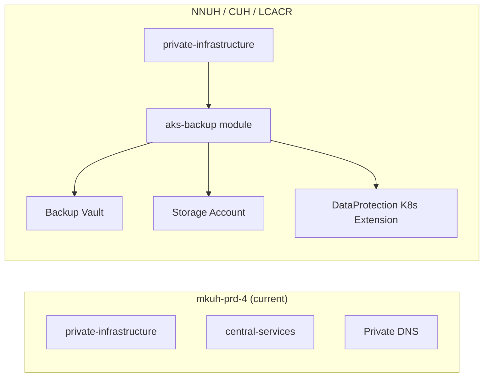

## Summary

**`mkuh-prd-4` does not configure Kubernetes cluster backup in its IaC.** There is no `aks_backup` module, no `backup` block in `config/customer.yaml`, and no backup-related Helm values in the generated manifests. Compared with sibling EOE production clusters (NNUH-DP, CUH-DP), this is a gap.

---

## What mkuh-prd-4 provisions today

`main.tf` wires only:

1. **`central-services-consumer`** — Auth0, Vault, GitLab, Grafana, etc.
2. **`private-infrastructure`** — AKS (`aks-mkuh-uks-prd-01`), VNet/subnets, jumpbox, NAT
3. **Private DNS** — ingress and subdomain records

```69:135:/Volumes/DAL/Fitfile/gitlab/FITFILE/Deployment/Clusters/eoe/Production/mkuh-prd-4/main.tf
module "private-infrastructure" {
  source  = "app.terraform.io/FITFILE-Platforms/private-infrastructure/azure"
  version = "1.3.32"
  // … AKS, networking, node pools — no backup module
}
```

`config/customer.yaml` covers identity, DNS, networking, node pools, Grafana, and Vault secrets — **no backup section**.

The `private-infrastructure` module defines a `backup_vault_name` local (`bkv-mkuh-uks-prd-01`) but **does not create backup resources**; that naming is unused scaffolding.

---

## How FITFILE configures K8s backup elsewhere

Peer clusters use the shared **`FITFILE-Platforms/aks-backup/azure`** module (`terraform-azure-aks-backup` in TFC-Modules), which implements **Azure Backup for AKS** (not Velero).

### Example: NNUH-DP

```113:129:/Volumes/DAL/Fitfile/gitlab/FITFILE/Deployment/Clusters/eoe/Production/NNUH-DP/main.tf
module "aks_backup" {
  source  = "app.terraform.io/FITFILE-Platforms/aks-backup/azure"
  version = "1.0.5"

  backup_resource_group_name   = "${local.aks_cluster_name}-backup-rg"
  snapshot_resource_group_name = "${local.aks_cluster_name}-snapshot-rg"
  storage_account_name = "${replace(local.aks_cluster_name, "-", "")}backupsa"
  backup_included_namespaces       = local.backup_included_namespaces
  kubernetes_cluster_id            = local.aks_cluster_id
  kubernetes_identity_principal_id = data.azurerm_user_assigned_identity.aks.principal_id
  backup_instance_name           = "${replace(local.aks_cluster_name, "-", "")}aksdaily"
  backup_excluded_resource_types = ["volumesnapshotcontent.snapshot.storage.k8s.io", "secrets"]
}
```

With customer config:

```35:36:/Volumes/DAL/Fitfile/gitlab/FITFILE/Deployment/Clusters/eoe/Production/NNUH-DP/config/customer.yaml
backup:
  included_namespaces: ["nnuh-prod-1", "spicedb"]
```

### What the module creates

| Component | Purpose |
|-----------|---------|
| **Backup resource group** | Holds vault, storage account, policies |
| **Snapshot resource group** | Landing zone for PVC volume snapshots |
| **Storage account + container** | Blob store for backup data (`aksbackups` by default) |
| **Data Protection Backup Vault** | Azure Backup control plane |
| **AKS extension** `Microsoft.DataProtection.Kubernetes` | In-cluster backup agent |
| **Trusted access binding** | Links AKS ↔ backup vault (`backup-operator` role) |
| **Backup policy** | Schedule + retention |
| **Backup instance** | Binds cluster to policy with namespace/resource filters |
| **RBAC** | Vault/extension/cluster identities on storage + snapshot RG |

### Default policy (module variables)

- **Schedule:** daily — `R/2024-09-02T21:00:00+00:00/P1D` (21:00 UTC)
- **Retention:** 14 days (`OperationalStore`)
- **Volume snapshots:** enabled
- **Excluded resource types:** `volumesnapshotcontent.snapshot.storage.k8s.io` (NNUH/CUH also exclude `secrets`)
- **Namespaces:** all unless `backup_included_namespaces` is set

CUH-DP uses a newer module version (`1.2.6`) with private endpoints on the backup storage account and imports existing backup resources.

---

## Application-level backups (also absent for mkuh)

The `databases` chart supports MongoDB/PostgreSQL cron backups, but they are **disabled by default** and not enabled in mkuh generated values:

```97:99:/Volumes/DAL/Fitfile/gitlab/FITFILE/Deployment/deployment/charts/databases/values.yaml
backups:
  mongodb:
    enabled: false
```

mkuh deploys MongoDB/PostgreSQL via `ffnode` / `thehyve` charts with no backup cron jobs configured in `generated/values.yaml` or `generated/thehyve_values.yaml`.

---

## Gap vs. peer clusters



---

## To add backup for mkuh-prd-4

You would need to mirror NNUH-DP:

1. Add a `backup` section to `config/customer.yaml`, e.g. `included_namespaces: ["mkuh-prd-4", "thehyve", "spicedb"]` (namespaces to confirm).
2. Add `module "aks_backup"` to `main.tf` with data sources for the AKS cluster ID and user-assigned identity (`uai-mkuh-uks-prd-aks`).
3. Choose module version (`1.0.5` like NNUH, or `1.2.6` like CUH if private endpoints are required).
4. Ensure `azurerm` provider has `storage_use_azuread = true` (required by the backup module).

I can draft the exact Terraform and `customer.yaml` changes for mkuh-prd-4 if you want to close this gap.--