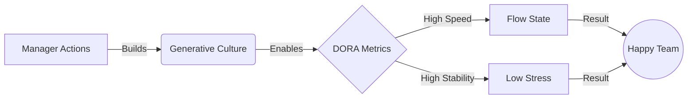

## 2026-01-08-2015-HEAD DORA Metrics & The Manager's Role

### 1. The Assumption Audit (Debugging the Manager's View)

- **Conflict:** We often explain DORA as "Technical Efficiency" metrics. This bores managers because it sounds like "plumbing."
- **Stale Assumption (Constraint):** "DORA metrics measure how fast developers type or work."
    - **Unit Test:** If we hire faster typists but the approval process takes 2 weeks, does Deployment Frequency improve? **False.**
    - **New Truth:** DORA measures the _Organization's_ friction, not the _Developer's_ effort. It measures the "Pipe," not the "Water".
- **Stale Assumption (Constraint):** "Speed comes at the cost of Stability."
    - **Unit Test:** If we deploy once a year, is it safer? **False.** Large batches explode. Small, frequent batches reduce blast radius.
    - **New Truth:** Speed and Stability are **symbiotic**, not trade-offs.

### 2. Core Concept: The "Value Proxy"

DORA does not measure "Value" directly (money/user happiness). It measures the **Capability to Deliver Value**.

- **The Logic:** Value is only realized when it reaches the customer. Code sitting in "Staging" is inventory cost (Waste).
- **The 4 Metrics (The Vital Signs):**
    1. **Deployment Frequency (Throughput):** How often do we ship? (Are we delivering value continuously or in risky big bangs?).
    2. **Lead Time for Changes (Latency):** Time from "Commit" to "Production." (How responsive are we to customer needs?).
    3. **Change Failure Rate (Quality):** How often do we break things? (Is our process reliable?).
    4. **Time to Restore (Resilience):** When we break it, how fast do we fix it? (Do we have a safety net?).

### 3. The Manager's Role: Architect of Culture (Westrum)

The manager does not "manage" the metrics. The manager manages the **Culture** that _allows_ the metrics to improve.

- **The Mechanism:** "Westrum Organizational Culture" is the strongest predictor of DORA performance.
- **The Three Modes:**
    1. **Pathological (Power-Oriented):** Information is hidden. Messengers (failure reporters) are "shot." **DORA scores: Low.**
    2. **Bureaucratic (Rule-Oriented):** Information is siloed. Failures are punished via "Process." **DORA scores: Medium.**
    3. **Generative (Performance-Oriented):** Information flows freely. Failure is an inquiry/learning opportunity. **DORA scores: Elite.**
- **The Manager's Action Item:**
    - **Psychological Safety:** Create an environment where "stopping the line" is rewarded, not punished.
    - **Blameless Post-Mortems:** Shift from "Who broke it?" to "How did the system allow this to happen?".

### 4. Next Actions (The Pitch)

- **Draft the Narrative:** "DORA isn't a report card for devs. It's a health monitor for _your_ management culture."
- **Unit Test:** Ask the manager, "If a deployment fails today, do we look for a culprit or a system fix?" The answer determines our Westrum score.

## 2026-01-08-2022-HEAD: The Manager's "Happy Team" Strategy

### 1. The Conflict (Reframing the Goal)

- **Manager's Goal:** "I want a happy, engaged team."
- **Traditional Mistake:** Trying to achieve this via "Culture" (social events, pizza, pressure to be positive).
- **The Friction:** You cannot add happiness to a system designed for frustration.
    - _Unit Test:_ If a dev waits 3 days for approval (High Lead Time) and then the deployment fails (High Failure Rate), will a team lunch fix their morale? **False.**

### 2. The Core Concept: Friction vs. Flow

Happiness in engineering is defined by **Flow State**. Misery is defined by **Wait States** and **Rework**.

- **The Link:** DORA metrics measure the _absence of misery_.
    - **High Deployment Frequency** = "I finished work and shipped it." (Dopamine hit).
    - **Low Lead Time** = "I didn't have to wait for permission." (Autonomy).
    - **Low Change Failure** = "I didn't spend my weekend fixing a bug." (Work/Life Balance).
- **The Evidence:** The _State of DevOps Report_ proves that Elite performers have **50% lower burnout rates** than Low performers.

### 3. The Manager's Lever: Westrum Culture

The Manager is not the "Taskmaster"; they are the **Architect of Safety**.

- **The Model:** Ron Westrum's Topology.
    - **Pathological (Power-Oriented):** "Who caused this failure?" -> Result: Fear, Hiding info, Burnout.
    - **Generative (Performance-Oriented):** "How did our system allow this failure?" -> Result: Safety, Sharing info, Innovation.
- **The Ambition Hook:**
    - Tell the manager: _"You are responsible for moving us from Bureaucratic to Generative. You build the safety; we build the speed."_

### 4. Visual Logic (The Pitch Diagram)

### 5. The Script (The "Unit Test" for the Manager)

"We both want a happy team. The data shows that developer unhappiness comes from two things: **Waiting** and **Fixing specific mistakes**.

- If we improve **Deployment Frequency**, we reduce Waiting (Boredom).
- If we improve **Stability**, we reduce Firefighting (Burnout).
DORA is just the scoreboard for how much 'Frustration' you have removed from our day."

## 2026-01-08-2030-HEAD: The 24 Capabilities (The Manager's Configuration)

### 1. The Conflict (Assumption Audit)

- **Stale Assumption:** "Culture is a byproduct of personality."
    - **New Truth:** Culture is a system of **Capabilities** that can be engineered.
- **Stale Assumption:** "Management's job is to ensure compliance."
    - **New Truth:** Management's job is to configure the "Runtime Environment" (Capabilities) so that compliance is automatic and speed is safe.

### 2. The Cultural Modules (The Runtime Environment)

These are the inputs. DORA metrics are the outputs.

- **Generative Culture (Westrum):** The single biggest predictor of performance.
    - _Spec:_ High cooperation, shared risks, "Messengers" are trained (not punished), failure causes inquiry (not blame).
- **Learning Climate:**
    - _Spec:_ Learning is a capital investment, not an expense. Failures are "tuition fees" for system improvement.
- **Job Satisfaction:**
    - _Spec:_ Not "perks," but the removal of friction. Providing the right tools and resources to do the job.

### 3. The Management Modules (Process Control)

The specific levers the manager pulls to regulate flow.

- **Lightweight Change Approval:**
    - _Action:_ Move from External Approval (CABs) to Peer Review.
    - _Why:_ CABs increase deployment pain and do not improve stability. Peer review improves both.
- **WIP Limits (Work In Process):**
    - _Action:_ Force teams to finish current work before starting new work.
    - _Why:_ Reduces context switching and improves flow.
- **Visual Management:**
    - _Action:_ Make the work (and the queues) visible.

### 4. The Leadership Wrapper (Transformational Leadership

The manager must embody these 5 dimensions to amplify the technical work:

1. **Vision:** "I know where we are going."
2. **Inspirational Communication:** "I can explain _why_ it matters."
3. **Intellectual Stimulation:** "I challenge you to solve this differently."
4. **Supportive Leadership:** "I care about you as a human."
5. **Personal Recognition:** "I see exactly what you did there."

### 5. The Pitch (Synthesis)

"We are not just 'doing DevOps.' We are installing a specific set of **Capabilities**.

My (Manager's) role is to own the **Culture** and **Process** capabilities:

1. Build Safety (Westrum).
2. Remove Blockers (Lean Management).
3. Champion the Vision (Transformational Leadership).
If I handle the environment, the team will handle the metrics."
