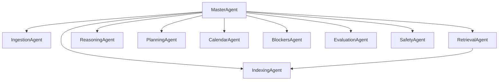

# ProdOS LLM Framework Enhancements (v0.1)

This document extends the GTD Co-Pilot design with additional agents, clear I/O contracts, scoring improvements, telemetry, and operational safeguards aligned to ProdOS v4.0.

---

## 1) Overview

- **Goal:** Deliver reliable, explainable next-action guidance using multi-agent orchestration over Todoist, Jira, and Obsidian, optimized for v4.0 minimal context.
- **Principles:** Importance-first, explainable decisions, minimal essential context, privacy-first, failure-tolerant.
- **Core Inputs:** Unified Task Stream (Todoist/Jira), Obsidian context, calendar availability, user energy/time window.
- **Core Outputs:** Single best next action with score, confidence, rationale, success criteria, and alternatives.

---

## 2) Agent Topology

- **MasterAgent (Orchestrator):** Conversation, intent, routing, final formatting.
- **IngestionAgent (Data Collector):** Fetches Todoist/Jira, normalizes to canonical schema.
- **IndexingAgent (Librarian):** Embeds tasks/notes; maintains vector index; freshness management.
- **RetrievalAgent (Researcher):** Semantic + metadata retrieval with freshness/recency boosts.
- **ReasoningAgent (Strategist):** Applies GTD logic, scores, returns RecommendationResult.
- **PlanningAgent (WeeklyReview):** Surfaces stale projects, proposes QII Big Rocks, schedule holds.
- **CalendarAgent (Timebox):** Implements “Renewal → Big Rocks → Rest”, enforces buffers/quotas.
- **BlockersAgent (Unblock):** Detects blockers, proposes nudges, Waiting-For management.
- **EvaluationAgent (Feedback Loop):** Post-hoc scoring; tunes weights; quality metrics.
- **SafetyAgent (Privacy/Policy):** Data minimization, redaction, model routing, consent.



---

## 3) Canonical Data & Scoring

### 3.1 Canonical Task Schema (normalized across Todoist/Jira/Obsidian)

- id, source, title, project, area
- contexts[], energy, time_estimate_min, priority_p1p4, quadrant
- big_rock, due_at, blocked_by[], dependencies[]
- status, tid/jira_id, obsidian_path, last_seen_at

### 3.2 Recommendation Scoring (importance-first, confidence-aware)

- Importance (alignment with H2/H3 goals, Big Rock) = 0.60
- Urgency (due date, age, hard landscape) = 0.20
- Feasibility (context/time/energy fit) = 0.15
- Confidence (retrieval coverage, freshness, blockers absent) = 0.05

Outputs include both `score` and `confidence`.

---

## 4) JSON Schemas (Stubs)

The following are stubs (minimum viable fields). They should be validated and evolved with implementation.

### 4.1 RecommendationResult

```json
{
  "$schema": "http://json-schema.org/draft-07/schema#",
  "title": "RecommendationResult",
  "type": "object",
  "required": [
    "action",
    "project",
    "duration_min",
    "contexts",
    "energy",
    "score",
    "confidence",
    "why"
  ],
  "properties": {
    "action": { "type": "string" },
    "project": { "type": "string" },
    "area": { "type": "string" },
    "duration_min": { "type": "integer", "minimum": 5 },
    "contexts": { "type": "array", "items": { "type": "string" } },
    "energy": {
      "type": "string",
      "enum": ["low", "medium", "high", "renewal"]
    },
    "score": { "type": "number", "minimum": 0, "maximum": 1 },
    "confidence": { "type": "number", "minimum": 0, "maximum": 1 },
    "why": { "type": "string" },
    "success_criteria": { "type": "array", "items": { "type": "string" } },
    "follow_up": { "type": "string" },
    "alternatives": {
      "type": "array",
      "items": {
        "type": "object",
        "required": ["action", "score"],
        "properties": {
          "action": { "type": "string" },
          "score": { "type": "number", "minimum": 0, "maximum": 1 }
        }
      }
    },
    "links": {
      "type": "object",
      "properties": {
        "todoist_task": { "type": "string" },
        "jira_issue": { "type": "string" }
      }
    }
  }
}
```

### 4.2 CanonicalTask

```json
{
  "$schema": "http://json-schema.org/draft-07/schema#",
  "title": "CanonicalTask",
  "type": "object",
  "required": ["id", "source", "title", "project", "contexts"],
  "properties": {
    "id": { "type": "string" },
    "source": { "type": "string", "enum": ["todoist", "jira", "obsidian"] },
    "title": { "type": "string" },
    "project": { "type": "string" },
    "area": { "type": "string" },
    "contexts": { "type": "array", "items": { "type": "string" } },
    "energy": {
      "type": "string",
      "enum": ["low", "medium", "high", "renewal"]
    },
    "time_estimate_min": { "type": "integer", "minimum": 5 },
    "priority_p1p4": { "type": "integer", "minimum": 1, "maximum": 4 },
    "quadrant": { "type": "string", "enum": ["QI", "QII", "QIII", "QIV"] },
    "big_rock": { "type": "boolean" },
    "due_at": { "type": "string", "format": "date-time" },
    "blocked_by": { "type": "array", "items": { "type": "string" } },
    "dependencies": { "type": "array", "items": { "type": "string" } },
    "status": {
      "type": "string",
      "enum": ["open", "in_progress", "blocked", "done"]
    },
    "tid": { "type": "string" },
    "jira_id": { "type": "string" },
    "obsidian_path": { "type": "string" },
    "last_seen_at": { "type": "string", "format": "date-time" }
  }
}
```

### 4.3 Agent I/O Contracts (Requests/Responses)

Note: These are minimal stubs to align interfaces. Enforce JSON validation in adapters.

#### IngestionAgentRequest/Response

```json
{
  "$schema": "http://json-schema.org/draft-07/schema#",
  "title": "IngestionAgentRequest",
  "type": "object",
  "properties": {
    "full_refresh": { "type": "boolean" }
  }
}
```

```json
{
  "$schema": "http://json-schema.org/draft-07/schema#",
  "title": "IngestionAgentResponse",
  "type": "object",
  "required": ["tasks"],
  "properties": {
    "tasks": {
      "type": "array",
      "items": { "$ref": "#/$defs/CanonicalTask" }
    },
    "$defs": { "CanonicalTask": {} }
  }
}
```

#### IndexingAgentRequest/Response

```json
{
  "$schema": "http://json-schema.org/draft-07/schema#",
  "title": "IndexingAgentRequest",
  "type": "object",
  "properties": {
    "paths": { "type": "array", "items": { "type": "string" } },
    "upsert_tasks": { "type": "array" }
  }
}
```

```json
{
  "$schema": "http://json-schema.org/draft-07/schema#",
  "title": "IndexingAgentResponse",
  "type": "object",
  "properties": {
    "documents_indexed": { "type": "integer" },
    "tasks_indexed": { "type": "integer" }
  }
}
```

#### RetrievalAgentRequest/Response

```json
{
  "$schema": "http://json-schema.org/draft-07/schema#",
  "title": "RetrievalAgentRequest",
  "type": "object",
  "required": ["query"],
  "properties": {
    "query": { "type": "string" },
    "filters": { "type": "object" },
    "top_k": { "type": "integer", "minimum": 1, "maximum": 50 }
  }
}
```

```json
{
  "$schema": "http://json-schema.org/draft-07/schema#",
  "title": "RetrievalAgentResponse",
  "type": "object",
  "properties": {
    "tasks": { "type": "array" },
    "notes": { "type": "array" },
    "coverage": { "type": "number", "minimum": 0, "maximum": 1 }
  }
}
```

#### ReasoningAgentRequest/Response

```json
{
  "$schema": "http://json-schema.org/draft-07/schema#",
  "title": "ReasoningAgentRequest",
  "type": "object",
  "required": ["query", "context"],
  "properties": {
    "query": { "type": "string" },
    "context": { "type": "object" },
    "constraints": { "type": "object" }
  }
}
```

```json
{
  "$schema": "http://json-schema.org/draft-07/schema#",
  "title": "ReasoningAgentResponse",
  "type": "object",
  "required": ["recommendation"],
  "properties": {
    "recommendation": { "$ref": "#/$defs/RecommendationResult" },
    "$defs": { "RecommendationResult": {} }
  }
}
```

#### PlanningAgentRequest/Response (Weekly Review)

```json
{
  "$schema": "http://json-schema.org/draft-07/schema#",
  "title": "PlanningAgentRequest",
  "type": "object",
  "properties": {
    "week_start": { "type": "string", "format": "date" }
  }
}
```

```json
{
  "$schema": "http://json-schema.org/draft-07/schema#",
  "title": "PlanningAgentResponse",
  "type": "object",
  "properties": {
    "big_rocks": { "type": "array", "items": { "type": "string" } },
    "stale_projects": { "type": "array", "items": { "type": "string" } },
    "calendar_holds": { "type": "array", "items": { "type": "object" } }
  }
}
```

#### CalendarAgentRequest/Response

```json
{
  "$schema": "http://json-schema.org/draft-07/schema#",
  "title": "CalendarAgentRequest",
  "type": "object",
  "required": ["blocks"],
  "properties": {
    "blocks": {
      "type": "array",
      "items": {
        "type": "object",
        "required": ["title", "start_at", "end_at"],
        "properties": {
          "title": { "type": "string" },
          "start_at": { "type": "string", "format": "date-time" },
          "end_at": { "type": "string", "format": "date-time" },
          "domain": {
            "type": "string",
            "enum": ["You", "Relationships", "Work"]
          },
          "locked": { "type": "boolean" }
        }
      }
    }
  }
}
```

```json
{
  "$schema": "http://json-schema.org/draft-07/schema#",
  "title": "CalendarAgentResponse",
  "type": "object",
  "properties": {
    "created": { "type": "integer" },
    "updated": { "type": "integer" },
    "conflicts": { "type": "array" }
  }
}
```

#### BlockersAgentRequest/Response

```json
{
  "$schema": "http://json-schema.org/draft-07/schema#",
  "title": "BlockersAgentRequest",
  "type": "object",
  "properties": {
    "tasks": { "type": "array" }
  }
}
```

```json
{
  "$schema": "http://json-schema.org/draft-07/schema#",
  "title": "BlockersAgentResponse",
  "type": "object",
  "properties": {
    "blocked": { "type": "array" },
    "nudges": { "type": "array" }
  }
}
```

#### EvaluationAgentRequest/Response

```json
{
  "$schema": "http://json-schema.org/draft-07/schema#",
  "title": "EvaluationAgentRequest",
  "type": "object",
  "properties": {
    "decision_log_path": { "type": "string" }
  }
}
```

```json
{
  "$schema": "http://json-schema.org/draft-07/schema#",
  "title": "EvaluationAgentResponse",
  "type": "object",
  "properties": {
    "quality_score": { "type": "number", "minimum": 0, "maximum": 1 },
    "proposed_weight_updates": { "type": "object" }
  }
}
```

---

## 5) Workflows (Extended)

- **Weekly Review Companion:** stale projects, propose QII Big Rocks, schedule holds, create missing next actions.
- **Project Kickoff Wizard:** NPM v2.2; creates final task first, sections→Todoist Sections, buffers, P1–P4, template scaffolding.
- **Blocker Monitor:** daily digest, nudges, alternatives.
- **Midday Replan:** reconcile morning plan with actuals while protecting Renewal/Big Rocks.

---

## 6) Retrieval & Memory

- Two-tier memory: semantic (vectors) + episodic (decisions/outcomes).
- Freshness-first boosting; degrade stale.
- Schema-first prompting; validate JSON; auto-repair on minor issues.

---

## 7) Telemetry & Quality

- **Decision Logs:** `.agent-os/metrics/` with inputs, score, confidence, outcome.
- **Golden Tests:** curated scenarios (low-energy-15m, big rock tomorrow, heavy-meetings day) to regression-test.
- **Weekly QA Review:** EvaluationAgent summarizes issues and proposes weight tweaks.

---

## 8) Scheduling & Indistractable Integration

- Life Domain quotas (You/Relationships/Work) with protected blocks.
- Default buffers: double estimate rule, 25% daily buffer, P4→P3 trimming guidance.

---

## 9) Security & Privacy

- Local-first; field-level redaction; safe model routing; explicit consent for external APIs.

---

## 10) Health Checks

- Sync freshness, index lag, calendar write, token validity, storage quota.

---

## 11) Implementation Notes

- Start with schemas + rules fallback; add RAG thereafter.
- Strict JSON validation at agent boundaries.
- Keep essential context: `00_CORE.md` + `01_Standards_Consolidated.md`; load extras on demand.
