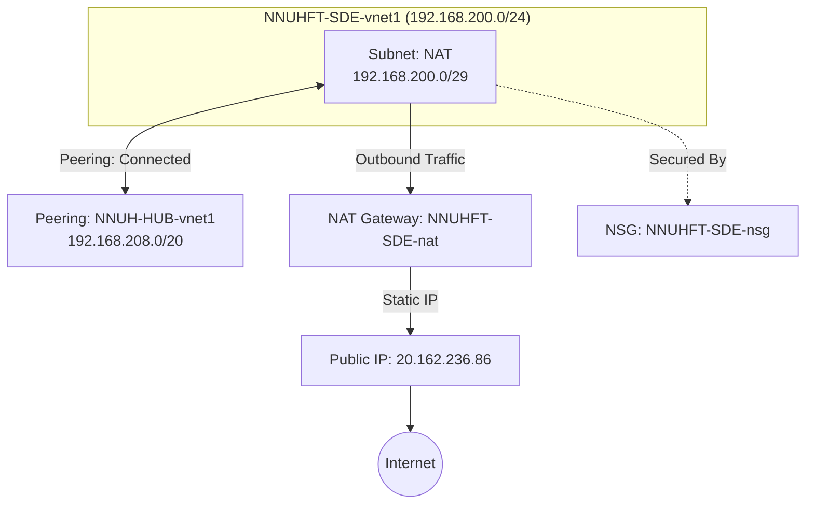

---

## [[Azure Infrastructure Inventory]]

### High-Level Overview

> [!INFO] Environment Details
>
> - Subscription: NNUHFT-SDE
> 
>     - Primary Location: UK South (London) 1* Public Egress IP: 20.162.236.86 2* Address Space: 192.168.200.0/24 3* Last Scan: 19 Nov 2025 4

### Resource Topology

---

### Resource Groups

#### 1. [[NNUHFT-SDE-Networking]]

**Purpose:** Core networking infrastructure. Contains the VNet, NAT Gateway, and Public IP.

##### **Virtual Network: [[NNUHFT-SDE-vnet1]]**

- **Address Space:** `192.168.200.0/24`
- **Peering Connection:**
    - **Remote VNet:** `NNUH-HUB-vnet1`
    - **Remote CIDR:** `192.168.208.0/20`
    - **Status:** `Connected` / `FullyInSync`
- **Subnets:**

| **Subnet Name** | **CIDR Range**     | **Usable IPs** | **Route Table** | **NAT Gateway**  |
| --------------- | ------------------ | -------------- | --------------- | ---------------- |
| **NAT**         | `192.168.200.0/29` | ~3 IPs*        | System Default  | `NNUHFT-SDE-nat` |

> [!WARNING] Capacity Note
>
> The NAT subnet is a /29. Azure reserves 5 IPs per subnet, leaving only 3 usable IP addresses for resources in this subnet.

##### **Public IP: [[NNUHFT-SDE-nat-ip]]**

- **IP Address:** `20.162.236.86`
- **Allocation:** Static
- **SKU:** Standard / Regional
- **Association:** Attached to NAT Gateway `NNUHFT-SDE-nat`

##### **NAT Gateway: [[NNUHFT-SDE-nat]]**

- **Idle Timeout:** 4 minutes (Default)
- **Scope:** Covers traffic for `NAT` subnet

##### **Network Security Group: [[NNUHFT-SDE-nsg]]**

- **Current State:** **Default Rules Only**
- **Inbound:** Allow VNet, Allow Load Balancer, Deny All Internet.
- **Outbound:** Allow VNet, **Allow Internet (Any)**.

---

### Action Items / Observations

1. **Subnet Sizing:** The `NAT` subnet is extremely small (`/29`). If you plan to deploy more than 3 Virtual Machines or Private Endpoints here, you will run out of IP addresses immediately.
2. **Security Posture:** The NSG has no custom rules. Outbound traffic is currently unrestricted to the entire internet
3. **Peering:** You have a healthy connection to the Hub VNet (`192.168.208.0/20`). Ensure firewall rules on the Hub side allow traffic from your new range (`192.168.200.0/24`).

---
