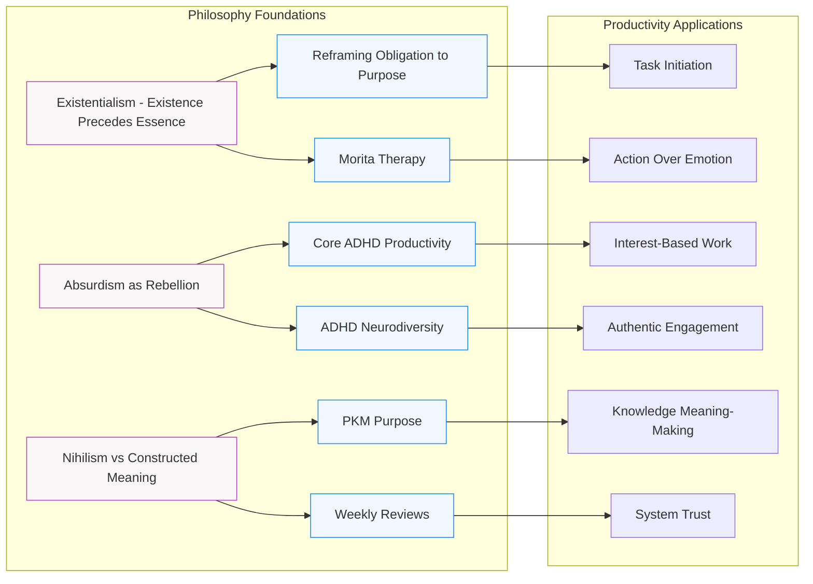

## Philosophy → Productivity Connections

### Key Connections Explained
1. **Existentialism → Purpose Reframing**:
   - Choosing tasks as expressions of self
   - Morita therapy as commitment to action

2. **Absurdism → ADHD Productivity**:
   - Interest-based work as rebellion against artificial norms
   - Neurodiversity as authentic engagement

3. **Constructed Meaning → PKM Systems**:
   - Weekly reviews combat meaning drift
   - Personal knowledge as active meaning-making

### Connected MOCs
- [[MOC - Philosophical Perspectives on Meaning]]
- [[ADHD and Motivation MOC]]
- [[MOC - Proven Memory Techniques for Effective Learning]]
- [[MOC - Cognitive Abstraction and Understanding]]
- [[MOC - Software Architecture Principles]]

### Navigation Tips
- Click any node to open note
- Use Obsidian's graph view with `tag:philosophy OR tag:productivity`
- Filter by `path:100_zettelkasten/Diagram*` for similar visualizations
