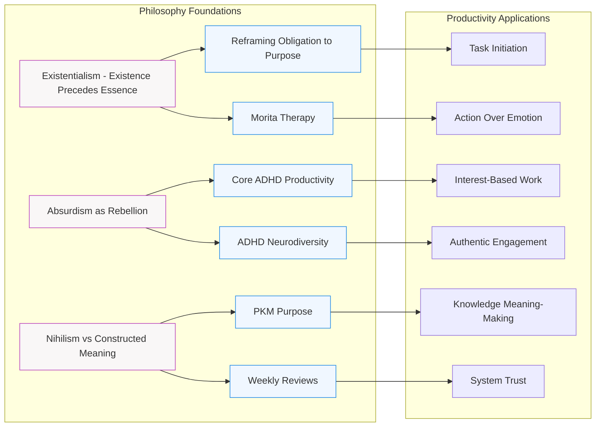

## Philosophy → Productivity Connections

```mermaid
graph LR
  subgraph Philosophy Foundations
    A[Existentialism - Existence Precedes Essence] --> B[Reframing Obligation to Purpose]
    A --> C[Morita Therapy]
    D[Absurdism as Rebellion] --> E[Core ADHD Productivity]
    D --> F[ADHD Neurodiversity]
    G[Nihilism vs Constructed Meaning] --> H[PKM Purpose]
    G --> I[Weekly Reviews]
  end

  subgraph Productivity Applications
    B --> J[Task Initiation]
    C --> K[Action Over Emotion]
    E --> L[Interest-Based Work]
    F --> M[Authentic Engagement]
    H --> N[Knowledge Meaning-Making]
    I --> O[System Trust]
  end

  classDef philosophy fill:#f9f7f7,stroke:#b83dba
  classDef productivity fill:#f0f7ff,stroke:#1e88e5
  class A,D,G philosophy
  class B,C,E,F,H,I productivity
```

### Key Connections Explained

1. Existentialism → Purpose Reframing:
   - Choosing tasks as expressions of self
   - Morita therapy as commitment to action

2. Absurdism → ADHD Productivity:
   - Interest-based work as rebellion against artificial norms
   - Neurodiversity as authentic engagement

3. Constructed Meaning → PKM Systems:
   - Weekly reviews combat meaning drift
   - Personal knowledge as active meaning-making

### Connected MOCs

- [[MOC - Philosophical Perspectives on Meaning]] - _Anchors the existential concepts like absurdism and constructed meaning._
- [[MOC - Action Management]] - _Explores how task initiation and action substitute for missing internal motivation in ADHD._
- [[SoT - Active Learning Techniques]] - _Details the mechanics of how active meaning-making encodes knowledge better than passive reading._
- [[SoT - Cognitive Tools and Visual Abstraction]] - _Provides the framework for using diagrams to reduce cognitive load and find patterns._
- [[MOC - Software Architecture Principles]] - _Connects the structured mapping of PKM to system design principles._

### Navigation Tips

- Click any node to open note
- Use Obsidian's graph view with `tag:philosophy OR tag:productivity`
- Filter by `path:100_zettelkasten/Diagram*` for similar visualizations
