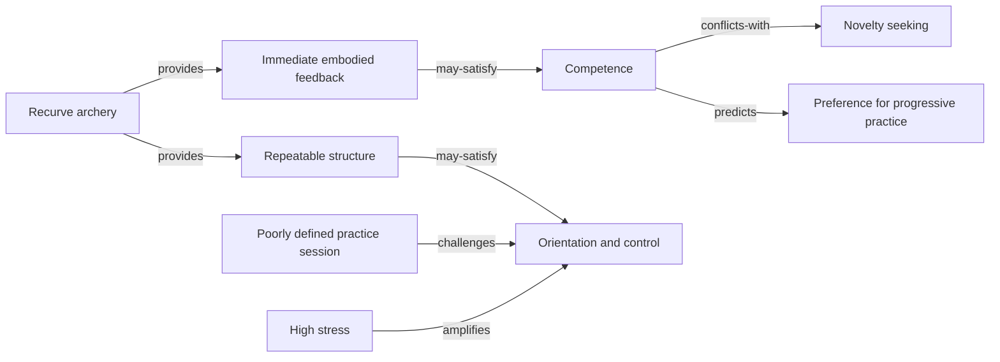
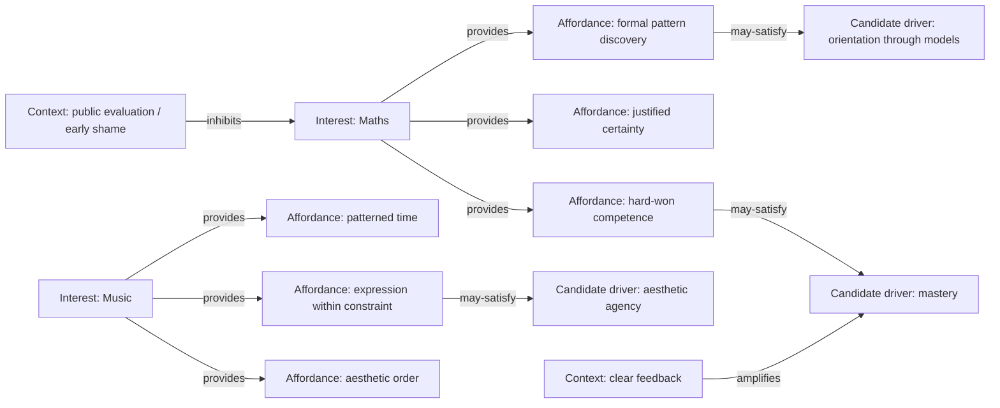

## Project in One Paragraph

This is a longitudinal self-inquiry project to discover whether my apparently diverse interests are generated, sustained, or shaped by a smaller set of recurring drives. I will treat interests, periods of intense engagement, recurring questions, abandoned pursuits, and conspicuous absences as observations; use comparison and repeated "why" questions to elicit candidate drivers; represent the resulting hypotheses as a typed graph; and test them against behaviour over time. The aim is not to produce a flattering or final explanation of who I am. It is to build an increasingly useful model of what repeatedly draws my attention, effort, and care—and of the conditions under which those drives strengthen, conflict, or disappear.

## Purpose

Named interests—maths, PKM, archery, cloud engineering, literature, music, and whatever else appears in the graph—are usually treated elsewhere in this vault as the unit of interest. In this project they are treated as observations: visible expressions that may be generated or sustained by deeper motives, needs, values, tensions, and preferred forms of engagement.

The project uses the shape and history of the interest graph—where interests overlap, where they differ, which persist, which recur, which fade, and which never take hold—to infer a small set of candidate generative drives. Those candidates will remain hypotheses until they explain several independent observations, distinguish between expected and unexpected interests, survive credible alternative explanations, and make useful predictions about future engagement.

This is not primarily a project to catalogue interests more neatly. It is a project to explain their relationships and test what may be generating them.

It is also not a diagnosis, a search for one hidden essence, or an attempt to reduce every part of a life to a handful of causes. The graph should preserve plurality, context, contradiction, and change.

## The Seed Question

> Why am I still so driven to learn at 52?

This is the question the project exists to make progress on—not to answer once, but to keep testing possible answers against. It remains verbatim because the specific age and the word "still" are part of the evidence: persistence across life stages is one of the patterns the model must explain.

Supporting questions include:

- What am I seeking when I learn: mastery, agency, orientation, novelty, connection, protection from stagnation, identity continuity, or something else?
- Which forms of learning sustain me, and which leave me cold despite being intellectually worthy?
- What conditions turn an interest into durable practice rather than temporary fascination?
- Which interests satisfy the same drive through different activities?
- Which apparently similar interests are maintained by different drives?

## Core Hypothesis

A small, interacting set of underlying drives—not the dozen-plus named interests themselves—may be doing much of the generative work.

Two interests that appear unrelated on the surface, such as mathematics and PKM, may provide the same valued experience. Two interests that look similar may be sustained by different motives. A single interest may serve several drives at once, and the dominant mix may change with context or life stage. Conversely, one drive may find expression through several different interests.

The graph is therefore expected to be many-to-many, contextual, and partly dynamic—not a tree with one ultimate root.

"Driver" is an operational term for a recurring candidate explanation that helps account for the selection, persistence, intensity, return, or abandonment of interests. It does not imply that introspection has exposed a definitive psychological cause.

## What the Project Maps

The project distinguishes six layers that should not be collapsed:

1. Interest—a named subject, practice, medium, or field, such as PKM, archery, boxing, mathematics, or science fiction.
2. Engagement episode—an observable period in which an interest attracted attention or effort, including what happened before, during, and after it.
3. Affordance—what the interest lets me do or experience, such as model a system, improve through feedback, acquire competence, encounter other minds, or create order.
4. Experienced outcome—what I report receiving from the episode, such as clarity, mastery, relief, stimulation, connection, meaning, or identity continuity.
5. Candidate driver—an inferred recurring motive, value, need, tension, or orientation that may make those outcomes matter.
6. Context—conditions that enable, amplify, redirect, inhibit, or replace the drive, including life stage, energy, stress, available tools, social setting, challenge level, and feedback quality.

This distinction prevents "archery gives me mastery" from being treated as equivalent to "mastery is the root cause of my interest in archery." The first is an observation or interpretation; the second is a stronger hypothesis requiring comparison, alternatives, and evidence over time.

## Principles

1. Treat interests as observations, not explanations. A named interest is evidence about attention and behaviour. It should not automatically be treated as its own cause or as something that needs defending on its own terms.
2. Elicit before classifying. Begin in my own language and with concrete episodes. Do not impose a ready-made motivation framework before recurring distinctions have emerged.
3. Infer drivers through both similarity and contrast. Ask not only what two interests share, but why a third, superficially similar interest does not hold. Differences and absences are often more discriminating than overlaps.
4. Use laddering, but do not mistake fluency for truth. Repeatedly ask why an interest or affordance matters until an answer recurs, stops reducing, becomes circular, or reaches a value that appears terminal. Record the whole chain rather than keeping only its final word.
5. Separate subject, affordance, outcome, and drive. What an interest is about, what it permits, what I experience, and why that experience matters are different layers.
6. Assume many-to-many causation. One interest may satisfy several drives; one drive may generate several interests; and the mix may change over time.
7. Promote candidates by converging evidence, not a fixed count. Recurrence across three unrelated interests is a useful signal, not a proof threshold. Promotion also requires discriminating power, behavioural evidence, alternatives, and at least one attempted disconfirmation.
8. Require prediction as well as explanation. A useful driver should predict what I am likely to approach, sustain, revisit, avoid, or abandon under specified conditions.
9. Use absences carefully. Non-interest can discriminate between hypotheses, but absence may also reflect lack of exposure, access, energy, confidence, or opportunity.
10. Distinguish instrumental and terminal value. Some activities are pursued as means to another end; others may be valued for their own sake. The same activity may be instrumental on one occasion and terminal on another.
11. Preserve competing explanations. Do not collapse curiosity, mastery, control, avoidance, identity, and connection into one polished story when several remain plausible.
12. Record counter-evidence. A candidate driver note should include cases it fails to explain, rival hypotheses, and observations that would weaken it.
13. Treat graph metrics as descriptive, not causal. Centrality may reveal recurring or bridging concepts in the model, but it cannot establish which drive causes behaviour.
14. Honesty over flattering narrative. Examine restlessness, fear of irrelevance, need for control, identity protection, and avoidance as seriously as curiosity, craftsmanship, play, and care for others.
15. Iterate rather than conclude. A driver being split, merged, downgraded, or superseded is evidence of progress, not failure.
16. Take time and life stage seriously. Persistence, recurrence, timing, and intensity across decades are part of the pattern to explain.
17. Keep the model useful. The graph succeeds if it improves recognition, choice, allocation of attention, and alignment—not merely if it becomes psychologically elaborate.

## Method

### 1. Establish the Interest Set

Start with a broad set of current, historic, intermittent, and abandoned interests. Include activities I repeatedly return to as well as interests that burned brightly and disappeared. Record approximate time periods and confidence rather than pretending to have complete historical data.

For each interest, capture:

- What I actually do, not only what I say I value.
- When it began, intensified, faded, or returned.
- Typical triggers and enabling conditions.
- What part of it attracts me most.
- What part reliably repels or bores me.
- Whether I consume, practise, create, analyse, teach, collect, organise, or discuss it.
- How I feel before, during, and after engagement.
- What I lose or miss when it is unavailable.

### 2. Compare Before Asking Why

Use dyads and triads of interests to elicit distinctions without deciding the vocabulary in advance:

- In what important way are two of these alike and the third different?
- Which two produce a similar experience despite different subject matter?
- Which one would I keep if subject-matter prestige and utility disappeared?
- Which one provides rapid feedback, visible mastery, orientation, connection, escape, or creative possibility?
- What is present in a persistent interest but absent from one I abandoned?

Capture both poles of each distinction. "Structured" is more informative when contrasted with "open-ended"; "mastery" is more informative when contrasted with "novelty without progression."

### 3. Build Means–End Ladders

For each salient affordance or contrast, ask variants of:

- Why does that matter to me?
- What does that allow me to experience or avoid?
- If I had that, what would it give me?
- If it disappeared, what would be lost?
- Would this still matter if nobody knew I did it?
- Would it still matter if I could never become unusually good at it?

Record each chain as an ordered sequence rather than replacing it with a single root label:

> Recurve archery → immediate sensory feedback → visible correction → growing precision → felt competence → agency

Different ladders from the same interest may be valid. Contradictions should remain visible.

### 4. Create Candidate Driver Nodes

Create a driver note when a candidate is sufficiently distinct to investigate, not only after confirmation. Mark its status explicitly:

- `proposed`—emerged from one or two ladders.
- `supported`—recurs across independent interests or episodes.
- `contested`—credible evidence and counter-evidence both exist.
- `provisional`—currently the best explanation and makes testable predictions.
- `retired`—superseded, merged, or repeatedly failed tests.

Each candidate-driver note should contain:

- A precise working definition.
- What it is not and common confusions.
- Interests and episodes it may explain.
- The paths through which it operates.
- Contexts that strengthen or weaken it.
- Rival explanations.
- Predictions.
- Counter-evidence and failed predictions.
- Confidence and review date.

### 5. Test Against Behaviour

Do not rely only on retrospective explanation. Collect light prospective evidence during ordinary life.

For a meaningful engagement episode, note:

- What pulled me towards it?
- What did I expect to get?
- What did I actually get?
- What sustained or broke attention?
- Which candidate driver was active, if any?
- What alternative explanation fits?
- Did the episode strengthen, weaken, or leave the hypothesis unchanged?

Where practical, use small contrasts or interventions: add rapid feedback, remove public recognition, increase structure, lower novelty, introduce collaboration, or change difficulty. Observe whether engagement changes in the predicted direction. These are personal probes, not controlled experiments, but they are stronger than explanation after the fact.

### 6. Review the Graph Longitudinally

Review monthly for new edges and quarterly for model changes.

Ask:

- Which candidates recur across dissimilar domains?
- Which explain only one cluster and are better treated as themes or affordances?
- Which drivers co-occur, compete, compensate for, or inhibit one another?
- Which interests changed while the proposed driver remained stable?
- Which failed predictions should reduce confidence?
- Which high-centrality nodes are merely vague labels?
- Has a candidate become unfalsifiable by being defined too broadly?

## Graph Model

### Node Kinds

- `interest`
- `engagement-episode`
- `affordance`
- `experienced-outcome`
- `candidate-driver`
- `context`
- `standing-question`
- `evidence`

### Core Edge Types

- `provides`—interest → affordance
- `produced`—episode → experienced outcome
- `may-satisfy`—interest or affordance → candidate driver
- `expresses`—interest or episode → candidate driver
- `compensates-for`—interest or driver → tension or unmet condition
- `enabled-by`—interest or episode → context
- `inhibited-by`—interest or episode → context
- `amplifies`—context or driver → driver
- `conflicts-with`—driver ↔ driver
- `supports`—evidence → hypothesis
- `challenges`—evidence → hypothesis
- `alternative-to`—hypothesis ↔ hypothesis
- `predicts`—candidate driver → expected interest, episode, or outcome
- `supersedes`—newer hypothesis → older hypothesis

Edges that infer motivation should use qualified language such as `may-satisfy` until the hypothesis has survived repeated testing. Every inferential edge should include a brief rationale and, where possible, a link to the episode or ladder from which it arose.

### Example

The graph records hypotheses and evidence, not settled causal truth.

## Evidence Standard

A candidate driver becomes provisional when most of the following are true:

- Recurrence: it appears through independently elicited paths across several interests or episodes.
- Cross-domain reach: it links interests that are genuinely dissimilar at the subject level.
- Specificity: it explains some interests better than others rather than fitting everything.
- Temporal reach: it helps explain persistence, return, intensification, or abandonment over time.
- Predictive value: it generates at least one advance prediction that is later observed or clearly fails.
- Counterfactual value: changing a relevant condition changes engagement in the expected direction.
- Rival comparison: it outperforms at least one credible alternative explanation.
- Negative evidence: known absences or exceptions have been examined rather than ignored.
- Independent traces: behaviour, choices, artefacts, calendars, reading histories, practice logs, or project records broadly agree with the introspective account.
- Refutability: there is a stated observation that would lower confidence in it.

No numerical score turns a private self-model into objective fact. Confidence labels should represent disciplined uncertainty, not false precision.

## Outputs

The project should produce:

- A graph of interests, affordances, outcomes, contexts, and candidate drivers.
- A note for each candidate driver with evidence, alternatives, predictions, and status.
- A set of interest ladders preserving the paths from activity to possible value.
- A small vocabulary of typed relationships.
- A timeline of changes in interests and inferred drivers.
- Periodic synthesis notes describing the current model and what would change it.
- Practical alignment rules for choosing projects, learning commitments, and environments.

The eventual value is not a definitive list of "my true drives." It is a model that can answer questions such as:

- Why does this opportunity feel attractive?
- Which need or value is it likely to serve?
- Is it another expression of an existing drive or genuinely new?
- Which current commitments compete for the same drive?
- Which neglected drive may explain recurring restlessness?
- What conditions help a worthwhile interest persist?

## Success Criteria

The project is working when it:

- Reveals non-obvious links between interests.
- Separates broad topics from the experiences and values that sustain them.
- Produces predictions that can fail.
- Retains disconfirming evidence and competing interpretations.
- Helps explain both persistence and abandonment.
- Reduces duplication in the named-interest graph without forcing unlike things together.
- Improves decisions about what to pursue, pause, combine, or decline.
- Remains understandable in plain Markdown without depending on one visualisation tool.

The project has drifted when it:

- Produces only flattering labels.
- Treats every link as causal.
- Uses centrality as proof of psychological importance.
- Forces every interest under one master explanation.
- Generates categories faster than observations.
- Becomes an elaborate form of self-description that changes no choices.

## Relationship to Other Work

This project sits upstream of [[HEAD - How Should Interests Stay Aligned Across Obsidian, Calibre, Todoist, Hookmark, and NotebookLM]], not beside it.

That HEAD note concerns the mechanics of keeping the existing named-interest graph legible wherever its artefacts live: "How do I avoid losing track of what I already know I am interested in?"

This project asks a different question: "Why do these particular interests arise and persist, and are they as separate as they appear?" Findings here—a provisional driver, a promoted cross-cutting theme, a contextual modifier, or a retired hypothesis—should feed into the downstream information architecture. The tooling layer can still evolve independently while this inquiry remains unresolved.

The distinction should remain:

- Domain: the visible subject of interest.
- Theme: a cross-cutting mechanism or recurring idea found in the knowledge itself.
- Drive: a hypothesised reason that a person is repeatedly drawn towards certain themes, affordances, or activities.

A theme such as feedback may connect archery and DevOps conceptually. A drive such as competence may help explain why feedback-rich activities hold attention. Theme and drive can overlap, but they are not the same kind of node.

## Open Questions

- Is "first-principle driver" the right name, or does "candidate generative drive" better preserve uncertainty and plurality?
- What counts as sufficient evidence that a candidate is useful rather than merely narratively satisfying?
- Is there one dominant drive, a small interacting cluster, or different configurations across contexts and life stages?
- Which observations can be collected prospectively without turning life into continuous self-surveillance?
- How should confidence and temporal change be represented without creating false numerical precision?
- When is a recurring pattern a drive, a value, a need, a coping strategy, an identity commitment, a habit, or merely an affordance?
- Can two competing explanations remain useful without being resolved into one?
- Which external traces can test memory-based accounts while respecting privacy?
- At what point should a candidate driver reshape the downstream interest taxonomy or decision process?
- How will the project detect when analysis itself is satisfying one of the drives it is attempting to study?

## Related

- [[HEAD - How Should Interests Stay Aligned Across Obsidian, Calibre, Todoist, Hookmark, and NotebookLM]]—the downstream mechanical counterpart to this project.
- [[Reference - Vault Interest Map]]—the current ranked interest-node list and initial observation set.
- [[A Faceted PKM Schema Should Separate Domain (Visible Subject) from Theme (Cross-Cutting Mechanism)]]—the Domain/Theme distinction used here.
- [[Betweenness Centrality Identifies Interdisciplinary Bridge Concepts]]—potentially useful for structural discovery, but not evidence of causal importance.
- [[Feynman's Twelve Favorite Problems Acts as a Continuous Curiosity Filter]]—a related practice of testing new material against standing questions.
- [[MOC - ADHD (The Master Map)]]—a large existing cluster that may reveal overlaps, while also requiring care not to explain every drive through one framework.

## Illustrative Worked Example

Added 2026-09-14 from research captured in [[tmp_atoms_what-drives-a-persons-interests]] — operationalises the Graph Model above with a concrete pass, not a finding about me specifically.

This prevents three common errors: treating a subject as its own explanation; assuming one interest has one driver; and treating a highly-connected interest or graph node as proof of a causal root — see [[Betweenness Centrality Identifies Interdisciplinary Bridge Concepts]] for the same caution applied to graph structure generally. A good candidate driver should explain presence, intensity, persistence, and some absences; generate a testable prediction; and retain plausible alternatives.

Supporting atomic notes for this project, extracted 2026-09-14: [[Enduring Interest Emerges From a Multi-Factor Feedback Loop, Not a Single Trait]], [[Self-Efficacy and Outcome Expectations Jointly Predict Durable Interest]], [[A Competence Feedback Loop Turns Early Success Into Durable Interest]], [[Situational Interest Requires Maintenance to Become Durable Individual Interest]], [[Autonomy, Competence, and Relatedness Make an Interest Self-Sustaining]], [[Genetic Influence on Interests Operates Through Precursor Traits, Not Fixed Destiny]], [[Loving a Subject Decomposes Into Distinct Reward Types, Not One Preference]], [[Interest Bundles Form Through Five Distinct Mechanisms]], [[Mathematical and Musical Ability Show a Moderate Correlation Without Proving Shared Causation]], [[Identity Adoption in One Domain Lowers Friction for Adjacent Interests]], [[Holland's RIASEC Model Frames Interests as Environmental Patterns, Not Isolated Preferences]], [[How to Interrogate a Candidate Interest Driver]].