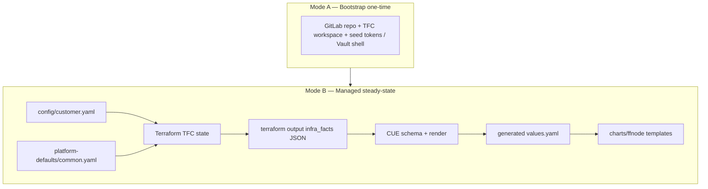

## 1. Pre-Requisite: Fix Live Bugs _Before_ Module Extraction

The plan jumps straight to Direction A (extract into shared module) but your MKUH Brutal Synthesis from Thursday April 9 (~2:04 PM) identified live correctness risks that must be patched first. Extracting a broken `locals.tf` into a shared module amplifies bugs across all customers:

| Bug                                                                                                                                                             | Impact if Extracted Unpatched                                         |
| --------------------------------------------------------------------------------------------------------------------------------------------------------------- | --------------------------------------------------------------------- |
| VaultAuth split-brain—Terraform (jumpbox.tftpl) and CUE (render_fitfile.cue) both deploy `VaultAuth/default` with conflicting roles (`deployment_key` vs `vso`) | Every customer inherits the conflict; debugging becomes multi-repo    |
| Node pool scheduling—fallback `agentpool="workflow"` vs actual pool key `"workflows"`                                                                           | Pods fail to schedule on every new customer cluster                   |
| TheHyve bypass—raw `.tftpl` path skipping CUE entirely                                                                                                          | Module consumers inherit a known architectural violation as "blessed" |

Recommendation: Add a Phase 0 to the plan: patch these three before any extraction begins. Your MKUH note already has the fix sequence for each.

---

## 2. Missing Principle: The Post-Handoff Rule

Your MASTER_REMEDIATION_PLAN (from Friday April 10 ~12:43 PM) states an "Architecture Law" that the IDE plan doesn't capture:

> Post-handoff rule: ALL non-sensitive downstream config reads from `terraform output -json infra_facts` ONLY.

This means CUE must never read `customer.yaml` directly—it reads `infra_facts`. Without this as an explicit principle, you risk a split-brain where CUE and Terraform have different views of the same customer config. Add it as Principle 5 alongside the existing four.

---

## 3. Missing Principle: Single-Writer Enforcement

Both the MKUH analysis and the Claude Code audit repeatedly flag resources defined in both Terraform and CUE/Helm (VaultAuth, ArgoCD repo creds, `imagePullSecrets`, namespaces). The IDE plan's catalogs implicitly help, but it should be an explicit architectural rule:

> For every resource type, designate exactly one owner (Terraform or CUE/Helm). Document ownership in `CONTRACTS.md`. Remove the competing implementation.

This is the single highest-leverage governance addition—without it, every new integration risks recreating the VaultAuth split-brain pattern.

---

## 4. The "Three Generations" Sunset Path Is Missing

Your MASTER_REMEDIATION_PLAN explicitly identifies three overlapping deployment models coexisting in the codebase:

1. Gen 1—Manual, TFC-only, Confluence-guided, central-services driven
2. Gen 2—Bootstrap-era (`make bootstrap / make finish-bootstrap`), separate provider files
3. Gen 3—Data-driven: `customer.yaml → Terraform → infra_facts → CUE → values.yaml` (the target)

The IDE plan describes the Gen 3 target beautifully but doesn't address how to deprecate/migrate Gen 1 and Gen 2 artifacts. You need:

- An explicit deprecation schedule for Gen 1/Gen 2 patterns (which files, which repos)
- A migration playbook for existing customers still on Gen 2 (how they adopt the shared module)
- Feature flags or compatibility shims in the shared module if Gen 2 customers can't migrate immediately

---

## 5. `infra_facts` Is Mostly Passthrough—Address This

Your MASTER_REMEDIATION_PLAN audit found that only 1 of 21 fields in `infra_facts` comes from a live provisioned resource (`customer_short_name`). The other 20 are derived/computed from YAML. This raises a fundamental question the IDE plan should address:

- Option A: Accept that `infra_facts` is a "normalized config blob" and treat it as the single contract surface between Terraform and CUE. The shared module's job is to produce a _complete, well-typed_ `infra_facts` from the merge of `customer.yaml` + `common.yaml` + provisioned state.
- Option B: Split `infra_facts` into `infra_state` (live resources: AKS endpoints, Vault paths, DNS zones) and `infra_config` (derived/merged YAML passthrough), so CUE can distinguish "this came from Azure" vs "this came from YAML."

Either way, the shared module needs to make this explicit. The current "21 fields, 1 live" situation means `infra_facts` is doing double duty as config bus and state reporter.

---

## 6. `mock_infra.json` Contract Fidelity

The IDE plan mentions CUE validation but doesn't address `mock_infra.json`—which is the thing that makes `cue vet` meaningful in CI. Your MKUH analysis specifically called out:

> _Update `cue/mock_infra.json` so it contains the complete `platform_vault` object and representative `vault_secret_consumers`. The mock must be a faithful representation of the contract._

Add to Direction C: The shared module should generate `mock_infra.json` from a `terraform output -json infra_facts` of a reference environment (e.g., `ff-test-1`), not maintain it by hand. This ensures the mock and reality stay in sync.

---

## 7. TheHyve Has a Specific Remediation Sequence

The IDE plan treats TheHyve as an example under Direction B (catalogs), but your MKUH analysis laid out a precise 3-step sequence that should be a tracked dependency:

1. Create `cue/render_thehyve.cue` using the existing `_VaultSecretsFor` dispatch
2. Extract hardcoded literals (image tag `0.4.5-test`, ACR URLs, resource limits, PG sizes) into `policy_defaults.cue` or a dedicated `#ThehyvePlatformPolicy`
3. Then and only then: delete `generators/thehyve.tf`, `templates/thehyve_values.yaml.tftpl`, and the `thehyve_values_content` outputs

This must complete before `generators/` moves into the shared module (Direction A), otherwise you're shipping a known bypass into the registry.

---

## 8. CI Validation Should Be Mandatory, Not Optional

Direction C says:

> _Optional: validate `customer.yaml` in CI with the same CUE/JSON Schema used by the module_

Given everything you've found this month—silent `try(…)` fallbacks swallowing data, missing fields between layers, aspirational SoT claims—this should be mandatory. The enforcement chain should be:

1. `customer.yaml` validated against a published JSON Schema / CUE definition in the customer repo CI, before `terraform plan`
2. `infra_facts` validated against `#InfraFacts` via `cue vet` after `terraform apply`
3. `generated/values.yaml` diffed against previous before merge

---

## 9. Bootstrap Artifact Cleanup

Your Single Source of Truth plan (April 9 ~5:03 PM) identified that bootstrap and steady-state are "partially intertwined." The IDE plan says bootstrap variables stay as variables—correct—but doesn't address cleaning up bootstrap-only artifacts that persist after Phase A completes:

- Generated provider files from `make bootstrap`
- Targeted apply scripts
- One-time credential seeding code

The shared module should have a `post_bootstrap_cleanup` target or at least document what's safe to delete after the first successful TFC run.

---

## 10. Sequencing Summary

Given all of the above, here's the execution order I'd recommend:

| Step | What                                                                 | Depends On                       |
| ---- | -------------------------------------------------------------------- | -------------------------------- |
| 0    | Patch VaultAuth split-brain, node pool label, TheHyve bypass         | Nothing—do now                   |
| 1    | Enforce single-writer rule + document in CONTRACTS.md                | Step 0                           |
| 2    | Extract merge helpers into shared module (incremental, not big-bang) | Step 1                           |
| 3    | Replace imperative lists with platform catalogs (Direction B)        | Step 2                           |
| 4    | Move generators/ into shared module (Direction A completion)         | Steps 2+3 + TheHyve fully in CUE |
| 5    | Align ArgoCD app-of-apps (Direction D)                               | Step 3                           |
| 6    | Mandatory CI gates (Direction C, non-optional)                       | Steps 2+4                        |
| 7    | Gen 1/Gen 2 deprecation + customer migration                         | Steps 4+6 stable                 |

---

## Bottom Line

The IDE plan is architecturally correct but insufficiently sequenced. It describes the destination without accounting for the landmines your audit already found on the path. The biggest additions are:

1. Fix live bugs before extracting (don't ship known defects into a shared module)
2. Post-handoff rule as a first-class principle (CUE reads `infra_facts`, never `customer.yaml`)
3. Single-writer enforcement (the root cause of the VaultAuth class of bug)
4. Three-generation sunset path (the plan assumes Gen 3 only; reality has Gen 1+2 still in flight)
5. Mandatory, not optional, CI validation (the whole contract story falls apart without enforcement)

The plan's risk callout about big-bang extraction is spot-on—your own MASTER_REMEDIATION_PLAN confirms incremental is the only safe path. Start with Step 0 patches, then extract merge helpers, then catalogs, then generators.

## Data-first Split (redo): Anchored on `ff-test-1/docs`

### Canonical Documentation Set

These are the new customer deployment plans and contracts (not `helm_chart_deployment/docs`):

| Doc | Role |
|-----|------|
| [CONTRACTS.md](file:///Volumes/DAL/Fitfile/gitlab/FITFILE/New_Customer/ff-test-1/docs/CONTRACTS.md) | Interface SSOT—Terraform → CUE → Helm layers, merge semantics, `infra_facts` shape pointers |
| [TERRAFORM_STATE_AS_SOURCE_OF_TRUTH.md](file:///Volumes/DAL/Fitfile/gitlab/FITFILE/New_Customer/ff-test-1/docs/TERRAFORM_STATE_AS_SOURCE_OF_TRUTH.md) | Strategic north star—TFC state should feed CUE; gaps (live outputs not in `infra_facts`, script re-derivation) |
| [Planning Prompt Data-First State-as-Source-of-Truth.md](file:///Volumes/DAL/Fitfile/gitlab/FITFILE/New_Customer/ff-test-1/docs/Planning%20Prompt%20Data-First%20%20State-as-Source-of-Truth.md) | Audit checklist—per-domain lifecycle (central services, private infra, bootstrap-only) |
| [Single Source of Truth Customer Deployment Plan.md](file:///Volumes/DAL/Fitfile/gitlab/FITFILE/New_Customer/ff-test-1/docs/Single%20Source%20of%20Truth%20Customer%20Deployment%20Plan.md) | Target model—Mode A bootstrap vs Mode B managed; repo ownership; thin `customer.yaml` |
| [Surgical Bootstrap Refactor — GitLab + Terraform Cloud Only.md](file:///Volumes/DAL/Fitfile/gitlab/FITFILE/New_Customer/ff-test-1/docs/Surgical%20Bootstrap%20Refactor%20%E2%80%94%20GitLab%20%2B%20Terraform%20Cloud%20Only.md) | Bootstrap minimalism—only what GitOps needs to start |
| [MIGRATION_PLAYBOOK.md](file:///Volumes/DAL/Fitfile/gitlab/FITFILE/New_Customer/ff-test-1/docs/MIGRATION_PLAYBOOK.md) / [MASTER_REMEDIATION_PLAN.md](file:///Volumes/DAL/Fitfile/gitlab/FITFILE/New_Customer/ff-test-1/docs/MASTER_REMEDIATION_PLAN.md) | Operational remediation—tiers A–D, three "generations" of process |

The diagram in CONTRACTS.md is the authoritative layer stack for "where data goes."

---

### Target Data Flow (from Your Own docs)



Single Source of Truth Customer Deployment Plan states the split clearly: bootstrap creates only control-plane prerequisites; managed mode is Terraform → `infra_facts` → CUE → Helm values → ArgoCD.

Data-first / state-SoT prompt adds: after bootstrap, downstream consumers should read only `terraform output` into CUE—not shell formulas or duplicated literals from `customer.yaml`.

---

### Where Each Kind of Data Should Go (repo ownership)

Aligned with Single Source of Truth Customer Deployment Plan + CONTRACTS.md:

| Layer | Owns | Should not own |
|-------|------|----------------|
| config/customer.yaml | Human decisions—identity, network CIDR, env, feature overrides, sizing | Platform constants; secrets that belong in Vault |
| platform-defaults/common.yaml | `standard_deployment`, `platform_policy`, vault catalogs, shared defaults | Customer-specific topology |
| Terraform (`locals.tf`, modules) | Resources, computed names/FQDNs, merged config, `infra_facts` assembly | App logic better expressed in CUE; avoid re-implementing merge in scripts |
| CUE | `#InfraFacts` contract, validation, mapping `infra_facts` + `platform_policy` → Helm-shaped values | Not a second store of customer literals (your docs call this out explicitly) |
| Helm (`helm_chart_deployment`) | Chart templates, subcharts, mechanical defaults for `helm template` | Business rules and product policy duplicated from common/customer |

CUE "too much hardcoded deployment detail" in the plan doc means: resist putting customer-specific data in CUE files; keep it in YAML → Terraform → `infra_facts`.

---

### What is Still Mixed (from TERRAFORM_STATE + CONTRACTS)

#### 1. `infra_facts` Is Mostly Plan-time Config, not Live Resource Attributes

[TERRAFORM_STATE_AS_SOURCE_OF_TRUTH.md](file:///Volumes/DAL/Fitfile/gitlab/FITFILE/New_Customer/ff-test-1/docs/TERRAFORM_STATE_AS_SOURCE_OF_TRUTH.md) documents that aside from `values_repo_url`, most `infra_facts` fields are built from merged YAML + locals, not read back from Azure/Auth0/GitLab outputs. That is not yet the full "state as SoT" vision—it is the aspirational gap your docs name.

Structural outputs that already exist in TF (e.g. `oidc_issuer_url`, `ingress_ip`) should flow through `infra_facts` so CUE/Helm do not re-derive or guess.

#### 2. Dual Truth path—scripts/infra-facts-for-cue.sh

Same doc: the script overrides `terraform output infra_facts` with re-reads from `customer.yaml` and recomputed fields. That breaks determinism and contradicts CONTRACTS.md ("consumer: CUE ingests Terraform output"). The prescribed fix is trust TF output; stale state becomes an error, not a silent override.

#### 3. Three "generations" of Deployment Model (why it Feels tangled)

Single Source of Truth Customer Deployment Plan lists overlapping models: legacy central-services/manual paths, bootstrap-era repos, and Terraform → CUE → Helm. PIPELINE_AUDIT / MASTER_REMEDIATION_PLAN reinforce that. Mixed visibility of old and new flows is a process problem as much as a code problem.

#### 4. Bootstrap Vs Steady-state Still Partially Intertwined

Your Surgical Bootstrap and Migration docs aim to separate one-time setup from GitOps steady state. Until bootstrap outputs and managed `infra_facts` are clearly bounded, docs stay "true but hard to use."

#### 5. Helm Chart repo—duplicated Defaults Vs CONTRACTS Stack

[charts/ffnode/values.yaml](file:///Volumes/DAL/Fitfile/gitlab/FITFILE/Deployment/helm_chart_deployment/charts/ffnode/values.yaml) plus [helm_chart_deployment/cue/base + schema](file:///Volumes/DAL/Fitfile/gitlab/FITFILE/Deployment/helm_chart_deployment/cue/) still create a parallel values document for local `argo-render` and validation—outside the `ff-test-1` CONTRACTS path. That is implementation packaging duplicating policy-shaped defaults already owned by `platform_policy` / CUE render.

#### 6. Federation / fitConnect Topology

[Network Topography & fitConnectHosts.md](file:///Volumes/DAL/Fitfile/gitlab/FITFILE/New_Customer/ff-test-1/docs/Network%20Topography%20%26%20fitConnectHosts.md) belongs in the same data-invariant conversation as Helm helpers: rules should be constraints on `fitconnect_hosts` in CUE or tests, not only template behavior.

---

### Optimizations (prioritized like Your Remediation tiers)

Tier 0—Truth pipe (highest leverage, matches your own TERRAFORM_STATE doc)

- Extend `infra_facts` with live structural outputs that Terraform already has (OIDC URL, ingress IP, etc.); update `#InfraFacts` + mock JSON.
- Remove `infra-facts-for-cue.sh` overrides so `make generate-values` is single-writer from TF output.

Tier 1—Ownership clarity (no architectural debate)

- Keep CONTRACTS.md as the only place that defines merge semantics and layer responsibilities; thin `customer.yaml` per Single Source plan.
- CUE stays mapping + validation, not a second `customer.yaml`.

Tier 2—Helm repo duplication

- Pick one: generate chart defaults from one canonical CUE base, shrink chart `values.yaml` to minimal library defaults, or publish a small versioned contract between repos—same trade-offs as before, but now explicitly downstream of a clean `infra_facts` pipe.

Tier 3—Invariants

- CUE checks (or policy tests) for federation rules documented in Network Topography / operational audits.

Tier 4—Docs UX

- Optional index in `ff-test-1/docs` linking CONTRACTS ↔ bootstrap ↔ remediation so "new customer" onboarding hits one narrative.

---

### Summary

- Your `ff-test-1/docs` already define the right split: bootstrap vs managed, thin customer.yaml, Terraform → `infra_facts` → CUE → Helm, and CONTRACTS.md as the interface SSOT.
- The mixing you feel is explained in-repo: (a) `infra_facts` not yet carrying enough live state, (b) script overrides of TF output, (c) three generations of process, (d) Helm chart defaults parallel to the CONTRACTS/CUE path.
- Optimize by fixing the truth pipe first (Tier 0), then thinning Helm defaults (Tier 2), then invariants + doc index—aligned with TERRAFORM_STATE_AS_SOURCE_OF_TRUTH.md and Single Source of Truth Customer Deployment Plan.md.

No code execution in this document; implementation follows the linked remediation and migration playbooks once you choose to execute.

The IDE plan is directionally right, but it still misses some hard-won lessons from your last month of work.

## Short Version

I'd add 10 things:

1. A Phase 0 for live bug fixes before module extraction
2. A strict post-handoff rule: downstream reads only from `terraform output -json infra_facts`
3. A single-writer rule for every shared resource
4. A three-phase operational model, not just bootstrap vs steady-state
5. A clearer definition of what `infra_facts` actually is
6. Mandatory CI validation, not optional
7. A formal sunset plan for Gen 1 / Gen 2 patterns
8. A contract-fidelity rule for [mock_infra.json](file:///Volumes/DAL/Fitfile/gitlab/FITFILE/New_Customer/ff-test-1/cue/mock_infra.json)
9. A specific TheHyve remediation dependency chain
10. A "do not extract known defects into the shared module" gate

## What I'd Add to the Plan

### 1) Add a New Phase 0: Fix Live Correctness Risks before Extraction

This is the biggest missing thing.

Your plan jumps to "extract the fat customer stack," but over the last month you found multiple issues that should be patched before they get baked into a shared module.

Based on your audit work documented around 2:04 PM and then consolidated around 5:07 PM on Thursday, I would explicitly add:

- VaultAuth split-brain must be resolved before extraction
- Node pool label mismatch (`workflow` vs `workflows`) must be resolved before extraction
- TheHyve bypass path must be brought under the normal pipeline before extraction
- Stale generated customer artifacts must be purged from template/demo repos before extraction
- Known fallback mismatches like `enable_grafana` in [locals.tf](file:///Volumes/DAL/Fitfile/gitlab/FITFILE/New_Customer/ff-test-1/locals.tf) must be corrected first

Why: a shared module amplifies both good patterns and bad ones. If you extract first, you turn local bugs into platform bugs.

### 2) Add the Post-handoff Rule as a First-class Architecture Law

This came through strongly in your Friday notes around 12:43 PM and 12:54 PM.

I'd add this verbatim as a principle:

> After bootstrap / handoff, all non-sensitive downstream configuration must read from `terraform output -json infra_facts` only.

That means:

- CUE reads `infra_facts`, not [config/customer.yaml](file:///Volumes/DAL/Fitfile/gitlab/FITFILE/New_Customer/ff-test-1/config/customer.yaml)
- scripts read `infra_facts`, not re-derived formulas
- jumpbox rendering reads `infra_facts`
- Helm gets rendered values from CUE, not side-channel config

This is the cleanest way to prevent split-brain between "desired config YAML" and "actual realised TF state".

### 3) Add a Single-writer Rule

This is the governance rule the IDE plan implies but doesn't state.

I'd add a section to [CONTRACTS.md](file:///Volumes/DAL/Fitfile/gitlab/FITFILE/New_Customer/ff-test-1/docs/CONTRACTS.md) like:

| Resource / Concept | Single Writer | Readers |
|---|---|---|
| Infra resources | Terraform | CUE / scripts / docs |
| Helm values | CUE | ArgoCD / Helm |
| Secrets values | Vault/VSO path | apps |
| App catalog | platform defaults + customer overrides | Terraform / CUE |
| Generated artifacts | pipeline only | ArgoCD / jumpbox |

And the rule:

> If a thing is rendered in both Terraform templates and CUE/Helm, that is a bug until proven otherwise.

This directly addresses the class of issues you found around VaultAuth and other duplicated ownership.

### 4) Change the Operating Model from "2-mode" to "3-phase Runtime reality"

Strategically, bootstrap vs managed still makes sense.

Operationally, your own correction around 12:50 PM on Friday is important: the private-cluster reality means this is not just a neat two-step pipeline.

I'd preserve both views:

#### Strategic Model

- Bootstrap
- Managed

#### Runtime Execution Model

1. Phase A—Local bootstrap
2. Phase B—TFC private infra
3. Phase C—Jumpbox in-network cluster bootstrap/render/apply

That correction matters because otherwise people will keep writing docs that imply "TFC apply => done", which you already disproved.

I'd make this explicit in [MIGRATION_PLAYBOOK.md](file:///Volumes/DAL/Fitfile/gitlab/FITFILE/New_Customer/ff-test-1/docs/MIGRATION_PLAYBOOK.md), [README.md](file:///Volumes/DAL/Fitfile/gitlab/FITFILE/New_Customer/ff-test-1/README.md), and [MASTER_REMEDIATION_PLAN.md](file:///Volumes/DAL/Fitfile/gitlab/FITFILE/New_Customer/ff-test-1/docs/MASTER_REMEDIATION_PLAN.md).

### 5) Define what `infra_facts` Actually is

A big thing from your state-as-truth work around 9:19 PM on Thursday:

`infra_facts` currently mixes:

- merged config
- deterministic computed values
- a small number of real live Terraform outputs

So I'd add a design decision. Choose one of these and document it:

#### Option A—Keep One `infra_facts`, but Document Subdomains

```hcl
infra_facts = {
  customer         = ...
  platform         = ...
  infrastructure   = ...
  central_services = ...
  computed         = ...
}
```

#### Option B—Split Conceptually

- `infra_config`: merged/derived config
- `infra_state`: live resource outputs
- rendered together into one contract for CUE

I'd slightly prefer Option A for practicality, but with clear field provenance in docs.

The key is: stop pretending every field in `infra_facts` is "live state". Your own audit found that most of it is not. That's okay, but it must be made explicit.

### 6) Make CI Validation Mandatory

The IDE plan says optional validation of customer YAML. I would upgrade that to mandatory.

You've already spent too much time debugging silent drift for this to stay optional.

## Minimum CI Gates I'd Add

### Gate 1—customer Config Validation

Validate [config/customer.yaml](file:///Volumes/DAL/Fitfile/gitlab/FITFILE/New_Customer/ff-test-1/config/customer.yaml) before plan.

Success:

- schema-valid
- mergeable with defaults
- no forbidden keys / shape drift

### Gate 2—Terraform/CUE Contract Validation

Validate actual `infra_facts` against [schema_infra.cue](file:///Volumes/DAL/Fitfile/gitlab/FITFILE/New_Customer/ff-test-1/cue/schema_infra.cue).

Success:

- `cue vet` exits 0
- no missing fields
- no stale schema

### Gate 3—generated Artifact Identity Check

Your Friday work around 12:50 PM makes this critical.

Add `make verify-generated` and ensure:

- deployment key in generated values matches current customer
- repo URL / namespace / FQDN don't belong to a copied old customer
- no stale `mkuh-prd-4` artefacts survive in new-customer repos

### Gate 4—optional-but-useful Helm Dry Render

Good for catching nils and missing keys before jumpbox apply.

### Gate 5—mock Fidelity Check

Keep [mock_infra.json](file:///Volumes/DAL/Fitfile/gitlab/FITFILE/New_Customer/ff-test-1/cue/mock_infra.json) structurally aligned with real output.

### Commands Section

I'd standardise the verification section around:

```bash
terraform fmt -check
terraform validate
terraform plan -out=plan.tfplan

make validate-cue
make validate-cue-mock

INFRA_JSON=$(terraform output -json infra_facts | jq -c '.value // .')
cue vet ./cue/*.cue -t "infra=$INFRA_JSON"

make generate-values
make verify-generated

cd helm_chart_deployment
helm template ffnode charts/ffnode -f ../ff-test-1/generated/values.yaml --dry-run
```

### What Success Looks like

- No contract mismatches
- No stale identity leakage
- No Helm nils
- No accidental generation against old customer data

### What Failure means

- Contract drift
- stale copied artefacts
- schema lag
- parallel ownership bug
- missing live outputs in the pipe

### 7) Add a Gen 1 / Gen 2 Sunset Plan

Your [MASTER_REMEDIATION_PLAN.md](file:///Volumes/DAL/Fitfile/gitlab/FITFILE/New_Customer/ff-test-1/docs/MASTER_REMEDIATION_PLAN.md) already talks about three generations in one codebase. The IDE plan doesn't say how they die.

I'd add a section:

## Legacy Pattern Deprecation Map

| Legacy Pattern | Current Location | Status | Exit Plan |
|---|---|---|---|
| bootstrap-era provider handling | customer repos | transitional | keep for Phase A only |
| old central-services assumptions | legacy repo/docs | reference-only | freeze + document |
| hardcoded jumpbox app blocks | templates | active debt | move to app catalog |
| per-customer fat locals | customer repos | active debt | replace with shared module |
| direct template bypasses | special-case components | active debt | route through CUE/shared module |

This keeps the migration honest. Otherwise "new model" docs accumulate while old mechanisms remain active forever.

### 8) Add a Contract-fidelity Rule for the Mock

This is smaller, but it matters.

You identified around 1:28 PM and 4:45 PM on Thursday that mock data was blind to real VSO paths until updated. That's exactly the kind of thing that silently rots.

I'd add:

> `cue/mock_infra.json` is not example data; it is a contract fixture.

Rules:

- update it whenever `infra_facts` shape changes
- generate or refresh it from a known-good real environment where possible
- CI fails if real `infra_facts` contains keys absent from the mock contract fixture

### 9) Add a Specific TheHyve Remediation Dependency

TheHyve should not just be "one of many apps in the catalog". It has an outstanding architectural exception.

I'd add a tracked sequence:

1. move TheHyve rendering into CUE
2. move TheHyve literals into policy/defaults
3. route secret wiring through shared dispatch
4. only then delete raw template bypasses
5. only then include it in the extracted shared customer module

That dependency should be explicit in the roadmap, otherwise you risk preserving the bypass inside the new module architecture.

### 10) Add a "bad extraction" Prevention Checklist

Before moving anything from [locals.tf](file:///Volumes/DAL/Fitfile/gitlab/FITFILE/New_Customer/ff-test-1/locals.tf) into a shared module, require this checklist:

- Is there already a single writer?
- Is the source of truth documented?
- Is the field in `infra_facts` because CUE actually needs it?
- Is the merge rule stable enough to centralise?
- Does the mock cover it?
- Is there a CI gate for regression?
- Are we extracting behaviour, or extracting a bug?

That would stop a lot of "clean-looking but premature" abstraction.

---

## What I Would Change in Your Current Directions A–E

## A. Extract Fat Customer Stack into Shared Module

Add:

- Do this incrementally
- Extract merge helpers first
- Extract catalogs second
- Extract `generators/` third
- Only collapse customer repo after the edge cases are normalised

Also add a prerequisite:

- no unresolved split-brain ownership issues may enter the shared module

## B. Replace Imperative Lists with Platform Catalogs

Strongly agree, but add:

- catalog entries need schema + versioning
- conditions should use stable predicates, not ad hoc string expressions everywhere
- app catalog must define owner, value file path, enablement flag, bootstrap mode, and deployment mode

A useful target shape would be something like:

```yaml
argocd_catalog:
  ffnode:
    enabled_when: deploy.ffnode
    chart: charts/ffnode
    values_file: generated/values.yaml
    owner: cue
  thehyve:
    enabled_when: deploy.thehyve
    chart: charts/integrations/thehyve
    values_file: generated/thehyve_values.yaml
    owner: cue
```

## C. Tighten the "add a field" Workflow

Upgrade "optional validate in CI" to mandatory.

Also add a triage question at the top:

> Does this field belong in customer intent, platform defaults, Terraform-computed facts, Vault, or generated values?

That one question will prevent half the churn.

## D. Align ArgoCD App-of-apps across Repos

Agree. I'd add:

- don't just unify representation—unify source ownership
- pick one catalog that both jumpbox generation and any app-of-apps model consume
- legacy repo patterns should be explicitly marked "legacy only / no new customers"

## E. Secrets Stay Data-driven

Agree. I'd add one stronger principle:

- sensitive values stay out of `infra_facts`
- secret references, consumers, mount paths, and non-sensitive metadata can be in `infra_facts`
- secret _values_ remain Vault/VSO only

That boundary needs to be written down clearly.

---

## A Better Success Criteria Section

I'd extend your "what success looks like" with measurable outcomes.

| Metric | Current smell | Target |
|---|---|---|
| Customer repo local logic | fat [locals.tf](file:///Volumes/DAL/Fitfile/gitlab/FITFILE/New_Customer/ff-test-1/locals.tf) | thin wrapper / passthrough |
| Add new app | multiple code edits across repos | catalog entry + chart wiring |
| Add new secret consumer | new HCL/CUE special cases | data-only extension |
| Add new field | repeated layer edits with guesswork | documented contract path |
| Generated artifact safety | stale copied files possible | `verify-generated` gate |
| Ownership clarity | duplicated writers possible | one owner per resource |
| Real/mocked contract parity | can drift silently | enforced in CI |
| Legacy model bleed | Gen 1/2/3 overlap | documented migration + deprecation |

---

## Recommended Execution order

This is the sequencing I'd use, based on your audit history:

1. Patch live bugs and stale assumptions
   - ownership conflicts
   - scheduling mismatch
   - stale generated artefacts
   - fallback mismatches

2. Write the architecture laws
   - post-handoff rule
   - single-writer rule
   - sensitive vs non-sensitive flow rule

3. Add mandatory CI gates
   - customer YAML validation
   - contract validation
   - verify-generated
   - mock fidelity

4. Move imperative lists to catalogs
   - namespaces
   - app catalog
   - app enablement rules

5. Normalise special-case integrations
   - especially TheHyve

6. Extract shared module incrementally
   - merge helpers
   - derivation logic
   - `generators/`
   - thin customer repo

7. Deprecate Gen 1 / Gen 2 artefacts
   - docs
   - scripts
   - patterns
   - compatibility notes

---

## Bottom line

Yes—your IDE plan is good, but based on the last month of work I'd add three major upgrades:

1. More sequencing discipline
   - patch correctness first, extract second

2. Stronger architecture laws
   - post-handoff rule
   - single-writer rule
   - three-phase runtime reality

3. Enforcement, not aspiration
   - mandatory CI
   - contract fixture fidelity
   - generated-artifact identity checks

If you want, I can turn this into a merge-ready addendum for [MASTER_REMEDIATION_PLAN.md](file:///Volumes/DAL/Fitfile/gitlab/FITFILE/New_Customer/ff-test-1/docs/MASTER_REMEDIATION_PLAN.md) and [CONTRACTS.md](file:///Volumes/DAL/Fitfile/gitlab/FITFILE/New_Customer/ff-test-1/docs/CONTRACTS.md), or rewrite your IDE plan into a cleaner Phase 0 / A / B / C roadmap.

Here is the redone analysis, now anchored on [ff-test-1/docs](file:///Volumes/DAL/Fitfile/gitlab/FITFILE/New_Customer/ff-test-1/docs) instead of `helm_chart_deployment/docs`.

### What Those Docs Already Say (your Intended architecture)

- [CONTRACTS.md](file:///Volumes/DAL/Fitfile/gitlab/FITFILE/New_Customer/ff-test-1/docs/CONTRACTS.md)—Layer stack and interface SSOT: merged YAML → Terraform → `infra_facts` JSON → CUE (`#InfraFacts` + render) → `generated/*.yaml` → Helm. Merge semantics are spelled out here.
- [TERRAFORM_STATE_AS_SOURCE_OF_TRUTH.md](file:///Volumes/DAL/Fitfile/gitlab/FITFILE/New_Customer/ff-test-1/docs/TERRAFORM_STATE_AS_SOURCE_OF_TRUTH.md)—North star: TFC state should back what flows to CUE; documents that today `infra_facts` is still mostly config-derived, the live-output gaps (e.g. OIDC URL, ingress IP), and the anti-pattern: `scripts/infra-facts-for-cue.sh` overriding `terraform output` with re-reads from `customer.yaml`.
- [Single Source of Truth Customer Deployment Plan.md](file:///Volumes/DAL/Fitfile/gitlab/FITFILE/New_Customer/ff-test-1/docs/Single%20Source%20of%20Truth%20Customer%20Deployment%20Plan.md)—Mode A (bootstrap) vs Mode B (managed); repo ownership table; explicit warning that CUE must not become a second customer config store.
- [Planning Prompt Data-First State-as-Source-of-Truth.md](file:///Volumes/DAL/Fitfile/gitlab/FITFILE/New_Customer/ff-test-1/docs/Planning%20Prompt%20Data-First%20%20State-as-Source-of-Truth.md)—Structured audit: per-domain "what's in state vs `infra_facts` vs re-derived elsewhere."

### Refined Diagnosis (why it Still Feels mixed)

1. Truth pipe incomplete—Docs admit one live field in `infra_facts` today (`values_repo_url`); the rest is largely merged YAML at plan time, while other structural values sit in TF/jumpbox only. That contradicts the "output-only into CUE" goal until Gap A is closed.
2. Dual truth—The shell script overriding TF output is called out in-repo as B-10 / non-deterministic `generate-values`.
3. Three generations—Legacy paths, bootstrap-era flows, and Terraform → CUE → Helm coexist; your own Single Source plan names this as why the story is "true but not usable."
4. Helm repo still parallel—`charts/ffnode/values.yaml` + helm repo CUE duplicate shape outside the CONTRACTS stack; that's packaging/validation duplication, not the SSOT narrative in `ff-test-1/docs`.
5. Bootstrap vs steady-state—Surgical Bootstrap / Migration docs push separation; overlap there adds process confusion (indexed in the updated plan).

### Plan File Updated

The full rewritten plan (diagram, tables, prioritized tiers aligned with TERRAFORM_STATE + CONTRACTS, updated todos) is in:

`/Users/leon.ormes/.cursor/plans/data_vs_implementation_split_600a7736.plan.md`

If you want the next iteration, we can align todos line-by-line with MASTER_REMEDIATION_PLAN.md tier IDs (A/B/C/D)—say if you want that crosswalk added to the plan.

Data-first split (redo) anchored on ff-test-1/docs

Canonical documentation set

These are the new customer deployment plans and contracts (not helm_chart_deployment/docs)

Doc	Role

CONTRACTS.md	Interface SSOT—Terraform → CUE → Helm layers, merge semantics, infra_facts shape pointers

TERRAFORM_STATE_AS_SOURCE_OF_TRUTH.md	Strategic north star—TFC state should feed CUE; gaps (live outputs not in infra_facts, script re-derivation)

Planning Prompt Data-First State-as-Source-of-Truth.md	Audit checklist—per-domain lifecycle (central services, private infra, bootstrap-only)

Single Source of Truth Customer Deployment Plan.md	Target model—Mode A bootstrap vs Mode B managed; repo ownership; thin customer.yaml

Surgical Bootstrap Refactor—GitLab + Terraform Cloud Only.md	Bootstrap minimalism—only what GitOps needs to start

MIGRATION_PLAYBOOK.md / MASTER_REMEDIATION_PLAN.md	Operational remediation—tiers A–D, three "generations" of process

The diagram in CONTRACTS.md is the authoritative layer stack for "where data goes."

Target data flow (from your own docs)

Syntax error in graph

mermaid version 8.14.0

Single Source of Truth Customer Deployment Plan states the split clearly bootstrap creates only control-plane prerequisites; managed mode is Terraform → infra_facts → CUE → Helm values → ArgoCD.

Data-first / state-SoT prompt adds after bootstrap, downstream consumers should read only terraform output into CUE—not shell formulas or duplicated literals from customer.yaml.

Where each kind of data should go (repo ownership)

Aligned with Single Source of Truth Customer Deployment Plan + CONTRACTS.md

Layer	Owns	Should not own

config/customer.yaml	Human decisions—identity, network CIDR, env, feature overrides, sizing	Platform constants; secrets that belong in Vault

platform-defaults/common.yaml	standard_deployment, platform_policy, vault catalogs, shared defaults	Customer-specific topology

Terraform (locals.tf, modules)	Resources, computed names/FQDNs, merged config, infra_facts assembly	App logic better expressed in CUE; avoid re-implementing merge in scripts

CUE	InfraFacts contract, validation, mapping infra_facts + platform_policy → Helm-shaped values	Not a second store of customer literals (your docs call this out explicitly)

Helm (helm_chart_deployment)	Chart templates, subcharts, mechanical defaults for helm template	Business rules and product policy duplicated from common/customer

CUE "too much hardcoded deployment detail" in the plan doc means resist putting customer-specific data in CUE files; keep it in YAML → Terraform → infra_facts.

What is still mixed (from TERRAFORM_STATE + CONTRACTS)

1. infra_facts is mostly plan-time config, not live resource attributes

TERRAFORM_STATE_AS_SOURCE_OF_TRUTH.md documents that aside from values_repo_url, most infra_facts fields are built from merged YAML + locals, not read back from Azure/Auth0/GitLab outputs. That is not yet the full "state as SoT" vision—it is the aspirational gap your docs name.

Structural outputs that already exist in TF (e.g. oidc_issuer_url, ingress_ip) should flow through infra_facts so CUE/Helm do not re-derive or guess.

1. Dual truth path—scripts/infra-facts-for-cue.sh

Same doc the script overrides terraform output infra_facts with re-reads from customer.yaml and recomputed fields. That breaks determinism and contradicts CONTRACTS.md ("consumer CUE ingests Terraform output"). The prescribed fix is trust TF output; stale state becomes an error, not a silent override.

1. Three "generations" of deployment model (why it feels tangled)

Single Source of Truth Customer Deployment Plan lists overlapping models legacy central-services/manual paths, bootstrap-era repos, and Terraform → CUE → Helm. PIPELINE_AUDIT / MASTER_REMEDIATION_PLAN reinforce that. Mixed visibility of old and new flows is a process problem as much as a code problem.

1. Bootstrap vs steady-state still partially intertwined

Your Surgical Bootstrap and Migration docs aim to separate one-time setup from GitOps steady state. Until bootstrap outputs and managed infra_facts are clearly bounded, docs stay "true but hard to use."

1. Helm chart repo—duplicated defaults vs CONTRACTS stack

charts/ffnode/values.yaml plus helm_chart_deployment/cue/base + schema still create a parallel values document for local argo-render and validation—outside the ff-test-1 CONTRACTS path. That is implementation packaging duplicating policy-shaped defaults already owned by platform_policy / CUE render.

1. Federation / fitConnect topology

Network Topography & fitConnectHosts.md belongs in the same data-invariant conversation as Helm helpers rules should be constraints on fitconnect_hosts in CUE or tests, not only template behavior.

Optimizations (prioritized like your remediation tiers)

Tier 0—Truth pipe (highest leverage, matches your own TERRAFORM_STATE doc)

- Extend infra_facts with live structural outputs that Terraform already has (OIDC URL, ingress IP, etc.); update InfraFacts + mock JSON.
- Remove infra-facts-for-cue.sh overrides so make generate-values is single-writer from TF output.
Tier 1—Ownership clarity (no architectural debate)

- Keep CONTRACTS.md as the only place that defines merge semantics and layer responsibilities; thin customer.yaml per Single Source plan.
- CUE stays mapping + validation, not a second customer.yaml.
Tier 2—Helm repo duplication

- Pick one generate chart defaults from one canonical CUE base, shrink chart values.yaml to minimal library defaults, or publish a small versioned contract between repos—same trade-offs as before, but now explicitly downstream of a clean infra_facts pipe.
Tier 3—Invariants

- CUE checks (or policy tests) for federation rules documented in Network Topography / operational audits.
Tier 4—Docs UX

- Optional index in ff-test-1/docs linking CONTRACTS ↔ bootstrap ↔ remediation so "new customer" onboarding hits one narrative.
Summary

- Your ff-test-1/docs already define the right split bootstrap vs managed, thin customer.yaml, Terraform → infra_facts → CUE → Helm, and CONTRACTS.md as the interface SSOT.
- The mixing you feel is explained in-repo (a) infra_facts not yet carrying enough live state, (b) script overrides of TF output, (c) three generations of process, (d) Helm chart defaults parallel to the CONTRACTS/CUE path.
- Optimize by fixing the truth pipe first (Tier 0), then thinning Helm defaults (Tier 2), then invariants + doc index—aligned with TERRAFORM_STATE_AS_SOURCE_OF_TRUTH.md and Single Source of Truth Customer Deployment Plan.md.
No code execution in this document; implementation follows the linked remediation and migration playbooks once you choose to execute.
