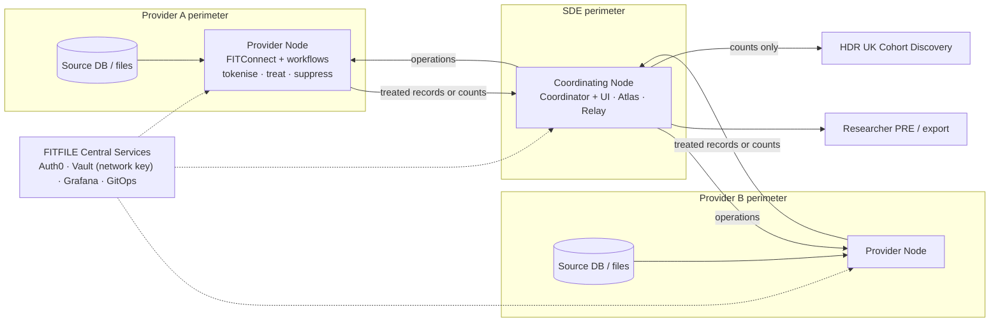

%% Agent-generated synthesis (Claude Code, 2026-09-28), not your own writing, so this note has no own_words property on purpose. Every claim is footnoted to a Confluence page; "Inference:" marks the agent's own reasoning; statuses are as of the cited page's date. Triage with Prompt - Vault Ingest Router. %%

## FITFILE Context Brief — What We Do and How We Link Data Silos

> [!summary] Bottom line
> - **What we sell.** Federated data infrastructure for NHS secure data environments (SDEs). A FITFILE **Node** runs inside each data controller's own cloud perimeter and privacy-treats data at source. A **coordinating Node**, usually the SDE's, sends queries to the Nodes and links their treated outputs. Raw data is not pooled.[^intro][^techov]
> - **The problem.** Health data sits "in unconnected silos" that cannot be lawfully united without consent, and consent does not scale. That was the 2021 founding requirement and it still frames the product.[^br]
> - **Who pays, who uses.** The regional SDE programme buys; Eastern England is the reference customer. Trusts host the Nodes, and at least one says the project is for the SDE's benefit rather than its own. SDE data managers operate the platform; researchers and pharma consume the outputs.[^eesum][^nuhsum]
> - **How linkage works today.** Mostly deterministic. FITtokens are keyed hashes of the NHS number, made with **one secret shared by every Node in a network** and held in FITFILE's central Vault. Alongside sit ZKP-based FITanons, project salts and NHS England's PET pseudonyms. Probabilistic Bloom-filter matching (the ONS PPRL toolkit) covers silos with no shared identifier, but is still a proof of concept.[^omopflow][^ude][^pprlval]
> - **Where it stands.** NHS-number tokenisation and de-duplication exist in the Eastern England workflows. The two projects built around *cross-sector* linkage, both in the North West (council DWP data, trust HR data), passed synthetic tests and then stopped at partner governance. HDRS TT, a four-SDE federation that kicked off on 25 Sep 2026, has no linkage method recorded yet and must connect two SDEs by mid-December.[^lcrca][^mersey][^hdrsko]
> - *Inference:* the binding constraints on linking silos are key custody, identifier availability and governance sequencing — more than the choice of matching algorithm.

**How to read this.** Compiled from six research briefs covering 10 team spaces and 18 personal spaces. The engineering-principles space was only surveyed by title. Confluence is patchy: the "What does FITFILE do" page is a stub, several overview and pricing documents live only in SharePoint, much of the PRODDOCS feature catalogue is empty, and embedded diagrams were not viewed. Section 6 lists contradictions to settle before relying on specific claims.

---

### 1. The problem FITFILE exists to solve

- **Founding statement (2021).** Health and activity data sit in unconnected silos. Uniting them in a GDPR-compliant way needs consent, which is "difficult, time-consuming and expensive". Data partners are risk-averse, and paying for data is not feasible.[^br] The 2021 vision was to be "the leading trusted health information platform for united patient-level evidence".[^goals]
- **Policy tailwind (2025–26).** The Sudlow Review stressed fragmentation, UK-wide linkage including non-health data, and accredited SDEs. HDRS, which *inference* says is the Health Data Research Service the review recommended, now funds FITFILE's largest project.[^sudlow][^hdrsko] Four sub-national SDEs are in play: Eastern England, North West, West Midlands and South West.
- **What SDE operators actually ask for (May 2026):**
  - feasibility checks on completeness and coverage;
  - handling of unmapped source values (the SDE doubted OMOP mapping accuracy above 75%);
  - validation of extracts before release and before charging;
  - reproducibility;
  - attribution of every record to its provider.[^notes0605]
- **Two SDE operating models**, which shape any linkage design:[^uhbgap][^wmsde]
  - *Data-On-Demand* (Eastern England): data stays at source and is queried when needed. FITFILE fits this model.
  - *Data Curator* (West Midlands): a lightly pseudonymised central warehouse with project keys. FITFILE had product gaps against it.

| Role | Examples | What they need |
|---|---|---|
| Buyer | SDE programme or funder: EE SDE; HDRS via the EE SDE; a pharma partner contracting directly for HDRS TT | Regional capability, milestones met |
| Node host (data provider) | NHS trusts (CUH, MKUH, NNUH, NUH), a combined authority, a mental-health trust | Low burden, controller control, no surprise load |
| Operator | SDE data managers and IG teams | Feasibility, extracts, disclosure control |
| Consumer | Researchers in Project Research Environments; pharma | Linked, longitudinal, multi-site data |

### 2. What FITFILE is

#### 2.1 Components

| Component | What it does |
|---|---|
| **Node** | A self-contained Kubernetes cluster in each controller's Azure subscription or AWS account. Terraform builds it and ArgoCD (GitOps) keeps it current. FITFILE deploys and runs it; the provider pays the cloud bill. It also holds PostgreSQL, MinIO, MongoDB, SpiceDB (permissions) and Argo. On-premises is a "last resort", and some Nodes (Barts, test Nodes) run in FITFILE's own tenant.[^techov][^tsd] |
| **FITConnect** | Connects sources (file upload, MySQL, PostgreSQL, MS SQL, Elasticsearch, S3, other FITConnects). It runs pipelines and privacy treatment, holds the catalogue, and applies the controller's safeguards. |
| **Coordinator** (`ffcloud`; formerly FITFILECloud / "FF Cloud") and its web UI | Owns projects, permission checks, export and audit. Pulls privacy-treated datasets from provider Nodes and links them. InsightFILE is the user interface and the name of the application monorepo.[^glossary] |
| **Workflows** (Argo + Workflows API) | DAG pipelines for tokenisation, treatment and OMOP ETL. A distributed mode that splits a DAG across tenants is designed; whether it is live is unclear. Query Plans (JSON holding per-source SQL, keys, joins and a k-threshold) are recorded as "too rigid".[^resolved] |
| **UDE** ("United Data Engine", a Rust CLI) | Keyed-hash pseudonymous linkage, ZKP anonymous linkage, and early probabilistic linkage.[^ude] |
| **OMOP layer** | The Hyve's ETL runs inside the Node, followed by Achilles and the Data Quality Dashboard. OHDSI Atlas writes cohort definitions whose SQL runs at the providers. OMOP is the practical interoperability layer.[^omopharm] |
| **Hutch Bunny/Relay** | Connects SDE collections to HDR UK Cohort Discovery. Counts only. |
| **Central Services** (run by FITFILE) | Auth0 (identity), HashiCorp Vault (secrets, including the network linkage key), Grafana Cloud, GitLab and container registries, Terraform Cloud. The pages say only operational telemetry reaches the centre, though they disagree on exactly what that covers.[^tsd] |

#### 2.2 Governance built into the product

- **Boundaries.** The tenant (Node) is the GDPR boundary and the project is the purpose. Whichever of tenant, project and data source is most restrictive decides what is allowed.[^tldr]
- **Roles.** FITFILE works under a data processor's constraints; the provider stays the controller.[^constraints]

#### 2.3 Value proposition as pitched in 2026

- **Pitch lines:** "vendor-agnostic and built for interoperability"; a modular, federated layer that plugs into what already exists; "HDRUK is a discovery gateway — FITFILE goes further"; each Node a blueprint rather than a bespoke build.[^hdrsdemo][^ahsdemo]
- **Linkage menu shown in demos:** FITanon, FITtoken, project salts, pre-agreed keys, NHS-PET, and probabilistic Bloom-filter matching.[^hdrsdemo]
- **Claimed differentiators:**
  - data stays at source;
  - patented ZKP-based linkage with no central token store;
  - privacy treatment that preserves utility, through automated k-anonymity plus field-level custom transformations.
- **Self-assessed gaps (Sep 2026):**
  - no native longitudinal patient record;
  - querying of genomic VCF files is untested;
  - cross-country linkage needs a feasibility check for each jurisdiction.[^vaccines]

#### 2.4 Delivery and business model (qualitative)

- **Seven-stage engagement:** contract → information governance → IT approval → installation → networking → synthetic data → live data.[^eesum]
- **Invoicing** follows provider milestones plus usage: live Nodes and uptime (with service credits), active users and projects, unique patients extracted, and new datasets.[^invoicing]

#### 2.5 How the positioning has moved

| Period | Positioning |
|---|---|
| 2020–21 | ZKP proof of concept, then "PharmaCo Service": pharma real-world-evidence SaaS. InsightFILE served pharma users; HealthFILE ran inside the data controller. |
| 2021–22 | Study feasibility and recruitment, observational studies, payors |
| 2022–23 | Single-trust projects: St George's, King's College Hospital, Barts. A Barts Node still feeds a Power BI dashboard. |
| 2024 | Eastern England SDE bid; a medtech-sponsored multi-site feasibility study |
| 2025 | Eastern England SDE delivery; a West Midlands SDE PET proof of concept; North West linkage projects |
| 2026 | HDRS multi-SDE federation with pharma backing; adolescent-health and vaccine-evidence prospects |

*Inference:* pharma is back, but as a funder reached through SDE networks rather than as a direct SaaS buyer.

### 3. How data moves

- **Compute at source.** Selects, filters and aggregates run in the source database where possible. A transient copy enters the Node only for tokenisation, privacy treatment, profiling and small-number suppression.[^datamove]
- **What leaves a provider:** privacy-treated datasets, aggregate counts, or exports the controller has approved. Under Data Disclosure, one controller's refusal fails a multi-source query.[^disclosure]
- **"Federated" needs a caveat.** The coordinating Node pulls providers' intermediate datasets and merges them, so pseudonymised record-level data does reach the SDE, and the Coordinator holds the linked copy.[^fed][^inode] One recorded risk: the pseudonymisation merge transports all the data, including rows outside the intersection.[^risks]
- **Direction of traffic.** Today the Coordinator pulls from providers, which forces every provider to accept inbound exposure or a VPN. Reversing this to publish/subscribe has been proposed but not decided.[^inode] HDRS turns inter-Node networking into a live design question.[^upcoming]
- **Joining two Nodes is manual.** It takes permission relationships, config entries, direct database inserts and identity-provider changes. This is logged as error-prone and known to only one engineer.[^connect][^risks]
- **The boundary people get lost on** is what sits inside the customer's environment versus FITFILE's central, shared infrastructure.[^ahsarch]

### 4. Privacy and IG: the gates any linkage must pass

- **Classification drives treatment.** Every field is classed as a direct, indirect, non- or encoded identifier.[^ptguide]
  - Direct identifiers are kept (identifiable), turned into a FITtoken (reversible) or a FITanon (irreversible), or removed.
  - Indirect identifiers go through k-anonymity (optionally with l-diversity) or custom transformations.
- **Baseline versus practice.** The stated baseline is anonymisation with k ≥ 5. Wide OMOP extracts instead use k = 1 plus custom transformations, because full k-anonymity destroys utility.[^ptomop] Yet custom-transformed output is officially "not considered fully privacy-treated", which is still unresolved.[^cto]
- **Fixed minimisation rules** apply on top of treatment:[^igrules][^ndoo][^ldoo][^sns]
  - small-number suppression, at the provider and, under the 2026 proposal, again after linkage and de-duplication;
  - the national data opt-out, checked via NHS MESH inside the ETL before harmonisation;
  - local opt-outs, now being redesigned;
  - removal of restricted codes.
- **Re-identification** works only for FITtokens, only for permitted users, and across sites only within a sharing agreement.[^reid]
- **Output checking** of final research outputs belongs to the SDE/TRE (ACRO/SACRO), not to FITFILE.[^sns]
- **IG framing.** FITFILE's draft position follows the ICO's anonymisation guidance (anonymity depends on context; the "motivated intruder" test) and the Five Safes/SATRE frameworks. It holds that anonymisation is not legally required inside an SDE, but still recommends privacy-enhancing technologies (PETs).[^ptguide]
- **Certifications listed:** ISO 27001:2022, Cyber Essentials, CE+ and DSPT 2024-25. The page looks out of date.[^cert]
- **Before linked data is released** (assembled across the IG pages):
  - opt-outs applied at every controllership boundary;
  - restricted codes removed;
  - small-number suppression at the provider and again after de-duplication;
  - the linked data re-treated;
  - controller approval plus DAR/DAC approval;
  - SDE output checks.
- **Open risk for linked data kept over time.** Pseudonymised linked data held past the opt-out disclosure grace period needs opt-outs re-applied, for example by re-tokenising at source.[^ldoo]

### 5. Linking silos: the current state

#### 5.1 Silo map from the field

| Silo type | Examples seen | Current response |
|---|---|---|
| **Organisational / operational** | Every trust has its own change board and IG team, and often no project manager. One trust sits in two SDEs. A CSU, an ICB, a combined authority and a trust HR team share one data flow. GP data needs a DSA per practice (EMIS), or consent plus a gateway PC per practice (TPP). One provider refused Atlas write access on a busy clinical server. | A Node per controller; a coordinating Node per SDE; federation between SDEs |
| **Technical / schema** | A proxied on-prem SQL Server moving to MS Fabric; Azure versus AWS; Postgres over a VPN; Excel/CSV drops; EPR migrations; OMOP vocabulary releases that differ by site; VCF omics | OMOP via The Hyve; a "vocabulary union"; Achilles and data-quality gates; per-site network designs |
| **Legal / IG** | A DCA/DSA/DPIA per provider and a DAC per SDE; CAG/REC limits; opt-outs applied at different points at each site; partners withholding names and postcodes; an executive refusing staff-data linkage | Opt-outs at source; disclosure control; aggregate-only outputs; synthetic data first |
| **Identity** | No NHS number in DWP or HR data; a provider supplying pre-pseudonymised data; existing CSU PseudoIDs; NHS pseudonyms that differ by sharing domain; warehouse project keys; SDEs without FITFILE | Probabilistic matching; FITtoken/FITanon; project salts; NHS-PET pseudonyms |

Sources: [^lessons][^emis][^tpp][^atlas][^roadmap][^nuhdata][^lcrca][^mersey][^uhbgap]

*Inference:* the IG and identity silos decide whether linkage happens at all. The technical silos decide how long it takes.

#### 5.2 The linkage toolbox

| Approach | Where keys and identifiers live | Who can link or re-identify | Status (Sep 2026) | Main limits |
|---|---|---|---|---|
| **FITtoken**: deterministic keyed hash (HMAC-SHA-256) of the NHS number | Data stays at the provider; **one secret per network**, in FITFILE's central Vault | Any Node in the network. Providers re-identify by recomputing tokens against their own data. | Built; used in the EE workflows | Needs a common unique ID. Rotating the key breaks re-identification. *Inference:* tokens link across the whole network, and anyone holding the key could enumerate the roughly 10⁹ possible NHS numbers. |
| **Salted SHA-256** with a project salt | Salt held in the platform, access permission-controlled | Anyone with the same salt | On the SDE Node by Nov 2025 | Linkable only within the salt's scope; brute-forceable if the salt leaks |
| **FITanon**: Schnorr zero-knowledge proof (UDE) | Identifiers at source; a shared curve point held in Vault | Verifying Nodes. *Inference:* also anyone holding the shared point. | 2020 POC, 2021–22 product, demoed 2025; not in the OMOP workflow | Pairwise cost (about 17 h for 10k × 10k on one replica); exact matches only |
| **ONS PPRL toolkit**: Bloom-filter probabilistic matching | Encodings leave the source; a row index is the only link back | Each party locally; FITFILE handled the match files | Synthetic POC (99.8% of true matches on FEBRL4 with all fields); live use blocked; no UI | Files of hundreds of MB per 5k records, moved by hand; weak without names and postcodes |
| **NHS-PET pseudo ID** | NHS numbers sent by SFTP to NHS England's PET, a trusted third party | Parties in the same NHS-PET domain | Built and tested Sep 2025; access has lapsed | External dependency; the NHS-number column leaves the Node |
| **Customer-held pseudonyms** (CSU PseudoIDs, warehouse project keys) | The controller's key or lookup table | The controller | In the NWSDE, Mersey Care and WMSDE designs | Blocks FITFILE's opt-out handling and re-identification |
| **Deterministic FITanon on name + DOB + postcode** | Quasi-identifiers at source | As for FITanon | Designed for Mersey Care; not approved | Typos defeat exact matching |
| **Identifiable join** | Raw keys at the coordinating Node | Users with the identifiable role | Built | Identifiers leave the source |

Sources: [^ude][^omopflow][^faqlink][^zkp][^udeperf][^pprl][^pprlval][^pm0415][^nhspet][^nhspetid][^minfields][^nwcsd]

- **Ideas not pursued:** proxy re-encryption via the Coordinator (2023) and a Bloom-filter pre-filter for ZKP (2022–23). With the pre-filter, the team accepted that anyone could brute-force NHS numbers to test whether a person is in a dataset.[^bloom]
- **Two ways to combine.** *Merge* joins column-wise and keeps the intersection; *concatenate* stacks rows and keeps the union.[^concat]

#### 5.3 Linkage in each programme

- **Eastern England SDE**
  - **Tokenisation.** NHS numbers are tokenised in the provider Nodes and never reach the SDE's production Node.[^ndooldoo]
  - **Where linkage is and isn't happening.** Linkage is pitched as a key benefit because it removes duplicate patients and allows re-contact for trials. It was deferred at NNUH to protect go-live.[^nnuhwk] NUH's data has no NHS numbers, so linkage there is "not currently possible".[^nuhdata]
  - **OMOP workflow test.** A Feb 2026 test reproduced the expected overlap between tenants, but FITanon linkage was not available in that workflow and de-duplication was missing.[^omoptest]
  - **Status (25 Sep 2026):** CUH and MKUH live; NNUH at go-live; NUH at contract.[^eesum]
- **Harmonised versus source data (Eastern England, Aug 2026).** OMOP data carries hashed NHS numbers. The raw source extracts researchers now want carry untreated ones, and "we do not have lookup tables", so the two cannot be joined as things stand.[^srcdata]
- **North West SDE: LCRCA**
  - **What would be linked.** About 40k combined-authority worklessness (DWP) records, which have no NHS number, matched against about 600k Cheshire & Merseyside population records. Each match gets a PseudoID for analysis, and only aggregates are released.[^nwhld]
  - **What happened.** The synthetic run succeeded in May 2026. Governance then withheld names, then postcodes, and FITFILE warned that matching accuracy would be low. File-sharing approval was still not given at 25 Sep 2026. The host CSU is being decommissioned, which means new DSAs.[^nwupd][^lcrca]
- **North West SDE: Mersey Care.** About 11k staff HR records were to be matched deterministically (FITanon on name, DOB and postcode) to the ICB long-term-conditions register. The executive did not approve the project in May 2026.[^mersey]
- **HDRS TT Federated Linkage**
  - **The project.** A "Federated, Harmonised, and Pharma-Backed Multi-SDE Linkage project" across four SDEs: EE (coordinating), NW, WM and SW.
    - AstraZeneca is building a chronic kidney disease (CKD) registry.
    - Each SDE produces synthetic CKD data from its "Minimally Transformed Data Extract".
    - The Hyve writes a shared OMOP mapping specification.[^hdrsko][^hdrsplan]
  - **Gates.** Phase 1 closes mid-December 2026 and needs:
    - at least two SDEs connected and queried;
    - an OMOP reference implementation;
    - a DQ dashboard;
    - a deployment pattern.

    Phase 2 runs to March 2027.
  - **Status.** Contracts, DSAs, DPIAs and DAC notices are on the critical path, and technical discovery starts on 28 Sep. No linkage method is recorded yet. *Inference:* the NHS-PET SDE-to-SDE proof of concept is the nearest precursor.[^fedlink]
- **West Midlands SDE.** A curator-model warehouse using project keys. A 2025 PET proof of concept exposed product gaps, and the SDE is returning through HDRS TT.[^uhbgap][^wmsde]

#### 5.4 What the platform doesn't do (yet)

- **No native longitudinal patient record.** Datasets are stored independently, so patient timelines need query-time linkage plus temporal logic.[^vaccines]
- **No identity across networks.** *Inference:* each network has its own key, so linking SDEs whose keys differ needs NHS-PET, one shared key or a re-keying step. None has been chosen.
- **No shared identifier across countries.**[^vaccines]
- **No composable Query Plans.** ZKP linkage also cannot match on different keys across a join.[^risks]
- **No FHIR support.** "No development time allocated"; GP-system integration is scoped only.[^fhir][^tpp]
- **Linkage-quality metrics are largely undefined.** The customer-facing comparison page still has blank accuracy placeholders.[^linkcmp]

#### 5.5 External reference points already in FITFILE's orbit

- **NHS-PET** (NHS England's privacy-enhancing technology for the Federated Data Platform). Its 2023 specification, a copy of which sits in your Confluence space:[^petspec]
  - joins trust data at ICB level by treating the NHS number with a common key or seed;
  - authorises re-identification by role and purpose;
  - treats PDS as the national source of truth for identity;
  - requires keys in an external KMS/HSM, with rotation and re-tokenisation;
  - says the PET should not build its own siloed registry of identities.
- **HDR UK Cohort Discovery.** Counts only, via Bunny/Relay. FITFILE moved to the new service in 2026.[^cohortdisc]
- **ONS PPRL toolkit.** Adopted for probabilistic matching.[^pprl]
- **Tools noted at OHDSI 2026:**[^ohdsi26]
  - Lettuce, which matches source terms to OMOP concepts;
  - OmopIndices;
  - FastSSV;
  - DARE UK's TRExt, for federated analysis of free text.
- **Alternatives named in the pages:** OpenSAFELY-style models (one prospect wanted to avoid them), warehouse SDEs and the NHS token store.[^ahsdemo][^uhbgap][^linkcmp]

### 6. Contradictions to settle before building on the claims

1. **What construction is a FITtoken?** Salted SHA-256 (PRODDOCS, custom transformations) or HMAC-SHA-256 (the UDE CLI, the OMOP draft, the HDRS demo)? No page settles it.[^faqlink][^ude]
2. **Irreversible or recomputable?** The OMOP draft says HMAC values cannot be reversed even with the secret. The UDE page says tokens are recomputed to re-identify.[^omopflow][^ude] *Inference:* with the key and a list of candidate NHS numbers, either kind can be reversed. Irreversibility therefore depends on who holds the key, which needs a cryptographic review.
3. **Lookup tables.** The comparison page says FITtokens can be "reversed using a lookup table", and also that FITFILE is not dependent on lookup or mapping tables.[^linkcmp]
4. **Custody claims.** The same page claims there is no central token store and no staff access to Nodes. Yet the network secret sits in FITFILE's central Vault, and FITFILE ran the NWSDE matching as a managed service and handled the match files.[^linkcmp][^omopflow][^pm0415]
5. **"No data leaves."** Encodings left LCRCA, and result files moved through SharePoint. *Inference:* the encodings and the row-indexed match tables are probably personal data.[^pm0415]
6. **Federated or coordinated?** "Data stays where it is" sits awkwardly with pseudonymised record-level extracts and merged copies at the SDE.[^fed]
7. **k thresholds** vary between pages (1, 5, 10 and 11), and the source of k = 5 is disputed.[^ptguide][^ptomop]
8. **Where permissions live.** SpiceDB is central in the 2022 decision record and per-Node in the 2025 decision; the install guide supports both.[^mtac]
9. **Blueprint or bespoke?** Nodes are pitched as a blueprint, but every site so far has needed its own networking, certificate, identity and hosting work.[^hdrsdemo][^lessons]

### 7. Questions to take into follow-up sessions

These are prompts rather than answers, grouped by the constraint behind each.

- **Key custody.** Should linkage keys be scoped per network, per project or per controller? Who should legally hold them? Could one controller revoke linkability without breaking everyone else's links?
- **Cross-SDE identity (HDRS TT).** Which gets Phase 1 over the line by mid-December without creating a de facto national key: a shared FITFILE secret across four SDEs, NHS-PET pseudonyms, or per-SDE keys with a re-keying step?
- **No common identifier.** What minimum identifier set will governance actually release (LCRCA withdrew names, then postcodes)? How can linkage quality be estimated without ground truth, and what accuracy is good enough when outputs are aggregate-only?
- **Productising PPRL.** What would it take (UI, thresholds, clerical review, file sizes) to take FITFILE staff out of the match-file path? Are Bloom encodings personal data under UK GDPR?
- **Harmonised and source data.** How can hashed OMOP identifiers be joined to raw source-extract identifiers without lookup tables? Would re-tokenising at source, at query time, work?
- **Over time.** Can key rotation coexist with longitudinal linkage? Does the platform need a patient-timeline abstraction?
- **Two SDE models.** Is there one linkage design that serves both Data-On-Demand SDEs (EE) and Data Curator SDEs (WMSDE)?
- **Beyond health.** DWP, local-authority, HR and social-care links have failed on governance, not technology. What does a playbook look like that gets partners past "nervousness"?
- **Opt-outs.** How should opt-outs be re-applied to linked pseudonymised data held past the grace period?

### 8. Glossary

| Term | Meaning |
|---|---|
| Node / FFNode | A per-controller deployment: one or more FITConnects plus an optional Coordinator |
| Network | The set of Nodes linked for an SDE's projects; they all share one linkage key |
| Coordinating (Master / hub) Node | The SDE Node that distributes queries and collates results |
| Provider Node | A Node inside a data provider |
| FITConnect | Source connection, pipelines, privacy treatment and catalogue |
| Coordinator / `ffcloud` / FF Cloud / FITFILECloud | Project coordination and linkage. "FF Cloud" is a deprecated name. |
| InsightFILE / HealthFILE | Originally the anonymised versus identifiable interfaces. InsightFILE also names the application monorepo. |
| UDE | "United Data Engine": the Rust linkage CLI |
| FITtoken | A deterministic, re-identifiable pseudonym (keyed hash), classed as an "encoded identifier" |
| FITanon | An irreversible, non-deterministic cipher based on a zero-knowledge proof |
| Project salt | A salt that restricts SHA-256 tokens to one project |
| External pseudonymisation | Pseudonyms generated by NHS-PET |
| PPRL | Privacy-preserving record linkage using Bloom-filter encodings |
| Merge / concatenate | A join that keeps the intersection / a stack that keeps the union |
| Query Plan | The JSON instruction set for linked queries |
| Data Disclosure | The controller's approval of each release |
| SNS | Small-number suppression |
| NDOO / LDOO | National / local data opt-out |
| MESH | The NHS messaging service used for NDOO checks |
| Restricted codes | Sensitive clinical codes removed in the ETL |
| MTDE | Minimally Transformed Data Extract (HDRS TT) |
| Data-On-Demand / Data Curator | Query-at-source versus warehouse-first SDE models |
| PRE / DAR / DAC | Project Research Environment / Data Access Request / Data Access Committee |
| PseudoID / DSCRO | The NW SDE's existing pseudonyms / the CSU office that holds PDS data |
| HDRS TT | *Inference:* HDRS is the Health Data Research Service. No page read expands "TT". |

### 9. What this research did not cover

- **Not viewed:**
  - embedded diagrams, including the most current architecture pictures;
  - attachments, such as a pharma-opportunity deck;
  - SharePoint-only documents: the technical solution overview, the pre-sales overview, pricing and the tender documents;
  - Jira.
- **Stubs:** "What does FITFILE do", most of the PRODDOCS feature catalogue, and "1.8.0 Linkage".
- **Page-hygiene issues** found in Confluence during the sweep were reported separately and are not recorded here.

### Research briefs

These are the six raw briefs this note was built from. Every Confluence page ID in them is linked, and they were redacted for the vault where needed.

- [[FITFILE Research Brief A — Business and Value Proposition]]
- [[FITFILE Research Brief B — Product and Architecture]]
- [[FITFILE Research Brief C — Privacy, IG and Security Posture]]
- [[FITFILE Research Brief D — Record Linkage and Pseudonymous Identity]]: the deepest source for section 5
- [[FITFILE Research Brief E — Programmes and Data Silos in the Field]]
- [[FITFILE Research Brief F — Personal-Space Sweep]]

### Related notes

- [[MOC - FitFile Deployment]]: the infrastructure side of sections 2–3
- [[SoT - FitFile Deployment - Strategy & Architecture]]
- [[MOC - OHDSI & OMOP Architecture]]: OMOP/OHDSI background, including ARACHNE for federated network studies
- [[SoT - OHDSI and FHIR Convergence]]
- [[SoT - Digital Identity]]: the identifier / attribute / credential framing behind section 5
- [[CUH]] · [[CUH OMOP database slow for cohort discovery queries]]
- [[MESH vs DSPT compliance status]] · [[MESH API Witness Testing]]: opt-out plumbing
- [[NHS Synthetic Data & OMOP Pipeline Meeting]]

### Next action

- **5 minutes:** read §5.2 and §7, choose the one question you most want to pull on, and open the next session with it.

### Sources

[^intro]: [1. Introduction & Goals](https://fitfile.atlassian.net/wiki/pages/viewpage.action?pageId=1696727046) — FITFILE, 2024-09-04
[^techov]: [Technical Overview](https://fitfile.atlassian.net/wiki/pages/viewpage.action?pageId=2164097026) — FITFILE, 2025-04-25
[^br]: [Tier 1 - Business Requirements](https://fitfile.atlassian.net/wiki/pages/viewpage.action?pageId=521699377) — PS, 2023-01-13 (2021 requirements)
[^goals]: [Business Goals](https://fitfile.atlassian.net/wiki/pages/viewpage.action?pageId=771620870) — PS, 2021-03-30
[^eesum]: [Eastern England SDE - Project Summary (Internal)](https://fitfile.atlassian.net/wiki/pages/viewpage.action?pageId=2829516801) — EOE, 2026-09-27
[^nuhsum]: [NUH - Project Summary (Internal)](https://fitfile.atlassian.net/wiki/pages/viewpage.action?pageId=2727673857) — EOE, 2026-09-27
[^omopflow]: [OMOP Flow: Irreversible Pseudonymisation and Central Hashicorp Vault Configuration](https://fitfile.atlassian.net/wiki/pages/viewpage.action?pageId=2869297153) — personal space draft, 2026-06-15
[^ude]: [UDE CLI Component](https://fitfile.atlassian.net/wiki/pages/viewpage.action?pageId=1834582019) — FITFILE, 2024-10-06
[^pprlval]: [Validation of probabilistic matching tool](https://fitfile.atlassian.net/wiki/pages/viewpage.action?pageId=2321645572) — FITFILE, 2025-12-24
[^lcrca]: [LCRCA - Project Summary (Internal)](https://fitfile.atlassian.net/wiki/pages/viewpage.action?pageId=2816245762) — NP, 2026-09-25
[^mersey]: [Mersey Care - Project Summary (Internal)](https://fitfile.atlassian.net/wiki/pages/viewpage.action?pageId=2824241153) — NP, 2026-09-27
[^hdrsko]: [HDRS TT Federated Linkage - Kick-Off Meeting](https://fitfile.atlassian.net/wiki/pages/viewpage.action?pageId=3072688130) — HDRSTT, 2026-09-25
[^sudlow]: [Sudlow Review demo notes](https://fitfile.atlassian.net/wiki/pages/viewpage.action?pageId=2368897027) — FITFILE, 2025-10-28
[^notes0605]: [06.05.2026 - FITFILE Notes (internal consolidated version)](https://fitfile.atlassian.net/wiki/pages/viewpage.action?pageId=2804449281) — FITFILE, 2026-05-14
[^uhbgap]: [UHB Product Gap](https://fitfile.atlassian.net/wiki/pages/viewpage.action?pageId=2053996548) — FITFILE, 2025-02-06
[^wmsde]: [WMSDE Product Development Plan](https://fitfile.atlassian.net/wiki/pages/viewpage.action?pageId=2080014337) — FITFILE, 2025-08-28
[^tsd]: [Technical Solution Detail - Master](https://fitfile.atlassian.net/wiki/pages/viewpage.action?pageId=2503376897) — FITFILE, 2026-05-15
[^glossary]: [Glossary](https://fitfile.atlassian.net/wiki/pages/viewpage.action?pageId=1699348489) — FITFILE, 2025-05-27
[^resolved]: [Resolved Risks and Technical Debt](https://fitfile.atlassian.net/wiki/pages/viewpage.action?pageId=2202238978) — FITFILE, 2025-10-09
[^omopharm]: [OMOP harmonisation - Technical Overview](https://fitfile.atlassian.net/wiki/pages/viewpage.action?pageId=2872541187) — FITFILE, 2026-07-08
[^tldr]: [TLDR](https://fitfile.atlassian.net/wiki/pages/viewpage.action?pageId=2156429316) — FITFILE, 2025-04-17
[^constraints]: [2. Constraints](https://fitfile.atlassian.net/wiki/pages/viewpage.action?pageId=1699741697) — FITFILE, 2024-10-05
[^hdrsdemo]: [HDRS Tech Demo](https://fitfile.atlassian.net/wiki/pages/viewpage.action?pageId=2966552577) — FITFILE, 2026-08-05
[^ahsdemo]: [AHS Demo](https://fitfile.atlassian.net/wiki/pages/viewpage.action?pageId=2918547484) — FITFILE, 2026-07-13
[^vaccines]: [Pharma prospect research (vaccines)](https://fitfile.atlassian.net/wiki/pages/viewpage.action?pageId=3034710017) — personal space, 2026-09-08
[^invoicing]: [Platform Monitoring (invoicing & customer facing)](https://fitfile.atlassian.net/wiki/pages/viewpage.action?pageId=2765422594) — FITFILE, 2026-05-12
[^datamove]: [13. Data Movement](https://fitfile.atlassian.net/wiki/pages/viewpage.action?pageId=2180808705) — FITFILE, 2025-05-13
[^disclosure]: [Data Disclosure](https://fitfile.atlassian.net/wiki/pages/viewpage.action?pageId=2148499464) — FITFILE, 2025-08-05
[^fed]: [Use Of "Federated" Across the EoE SDE Project](https://fitfile.atlassian.net/wiki/pages/viewpage.action?pageId=2016706564) — FITFILE, 2025-01-02
[^inode]: [Inter node communication](https://fitfile.atlassian.net/wiki/pages/viewpage.action?pageId=2147385345) — FITFILE, 2025-04-09
[^risks]: [11. Risks and Technical Debt](https://fitfile.atlassian.net/wiki/pages/viewpage.action?pageId=1701314562) — FITFILE, 2025-08-20
[^upcoming]: [Upcoming technical work](https://fitfile.atlassian.net/wiki/pages/viewpage.action?pageId=3034906629) — personal space, 2026-09-23
[^connect]: [Connect a Data Provider Node](https://fitfile.atlassian.net/wiki/pages/viewpage.action?pageId=2118811663) — FITFILE, 2026-02-26
[^ahsarch]: [AHS Architecture](https://fitfile.atlassian.net/wiki/pages/viewpage.action?pageId=2951675906) — personal space, 2026-09-18
[^ptguide]: [FITFILE Privacy treatment guide - in progress](https://fitfile.atlassian.net/wiki/pages/viewpage.action?pageId=2629173252) — CDH, 2026-02-11
[^ptomop]: [Privacy treating OMOP data using FITFILE](https://fitfile.atlassian.net/wiki/pages/viewpage.action?pageId=2431680531) — CDH, 2025-11-19
[^cto]: [Custom Transformation Operation](https://fitfile.atlassian.net/wiki/pages/viewpage.action?pageId=2065924099) — FITFILE, 2025-09-30
[^igrules]: [Plan for application of fixed IG rules and guidelines](https://fitfile.atlassian.net/wiki/pages/viewpage.action?pageId=2098167827) — FITFILE, 2026-06-09
[^ndoo]: [National Data Opt-Out](https://fitfile.atlassian.net/wiki/pages/viewpage.action?pageId=2247655425) — FITFILE, 2026-05-05
[^ldoo]: [Implementation of (LDOO) and evolution of (NDOO) feature](https://fitfile.atlassian.net/wiki/pages/viewpage.action?pageId=3049160707) — FITFILE, 2026-09-24
[^sns]: [9.04.2026 - Small Number Suppression (updated feature)](https://fitfile.atlassian.net/wiki/pages/viewpage.action?pageId=2739273729) — FITFILE, 2026-04-09
[^reid]: [Pseudo-anonymisation (Pseudo) + re-identification Implementation](https://fitfile.atlassian.net/wiki/pages/viewpage.action?pageId=1590296577) — PS, 2023-06-30
[^cert]: [Platform certification](https://fitfile.atlassian.net/wiki/pages/viewpage.action?pageId=2586411009) — FG, 2026-01-23
[^lessons]: [2026-08-14: MKUH and NNUH Lessons Learnt Workshop](https://fitfile.atlassian.net/wiki/pages/viewpage.action?pageId=2999484417) — EOE, 2026-08-20
[^emis]: [IM1 EMIS](https://fitfile.atlassian.net/wiki/pages/viewpage.action?pageId=1548255233) — PS, 2023-03-21
[^tpp]: [TPP SystmOne Client Integration Interface](https://fitfile.atlassian.net/wiki/pages/viewpage.action?pageId=1986166786) — FITFILE, 2025-05-16
[^atlas]: [Convincing EOE and CUH about ATLAS](https://fitfile.atlassian.net/wiki/pages/viewpage.action?pageId=2573565954) — personal space, 2026-01-20
[^roadmap]: [2026-09-08: FITFILE service features & deliverables roadmap review](https://fitfile.atlassian.net/wiki/pages/viewpage.action?pageId=3035693057) — EOE, 2026-09-09
[^nuhdata]: [2026-08-14: NUH/EE SDE/FITFILE - Data meeting](https://fitfile.atlassian.net/wiki/pages/viewpage.action?pageId=2990538753) — EOE, 2026-08-18
[^nhspet]: [NHS-PET Integration](https://fitfile.atlassian.net/wiki/pages/viewpage.action?pageId=2318106625) — FITFILE, 2025-09-30
[^nhspetid]: [1.8.1 NHS PET Pseudo ID](https://fitfile.atlassian.net/wiki/pages/viewpage.action?pageId=2979233793) — PRODDOCS, 2026-08-12
[^faqlink]: [How can we link patient data across projects without using real IDs](https://fitfile.atlassian.net/wiki/pages/viewpage.action?pageId=2211250188) — PRODDOCS, 2025-06-10
[^zkp]: [ZKP component description](https://fitfile.atlassian.net/wiki/pages/viewpage.action?pageId=158761006) — ZKP, 2020-10-27
[^udeperf]: [UDE Replica Performance Tests](https://fitfile.atlassian.net/wiki/pages/viewpage.action?pageId=1459552257) — PS, 2022-11-30
[^bloom]: [Bloom Filters](https://fitfile.atlassian.net/wiki/pages/viewpage.action?pageId=1393721373) — ZKP, 2023-03-06
[^pprl]: [PPRL toolkit](https://fitfile.atlassian.net/wiki/pages/viewpage.action?pageId=2302181378) — FITFILE, 2025-09-11
[^pm0415]: [2026-04-15: NWSDE/LCRCA/FITFILE - Probabilistic Matching Meeting](https://fitfile.atlassian.net/wiki/pages/viewpage.action?pageId=2753789967) — NP, 2026-04-16
[^minfields]: [Minimum fields required for linkage](https://fitfile.atlassian.net/wiki/pages/viewpage.action?pageId=2155675649) — FITFILE, 2025-04-22
[^nwcsd]: [Configured Solution Design - NWSDE](https://fitfile.atlassian.net/wiki/pages/viewpage.action?pageId=2575368202) — NP, 2026-03-03
[^concat]: [Cohort Concatenation](https://fitfile.atlassian.net/wiki/pages/viewpage.action?pageId=2139488258) — FITFILE, 2025-04-02
[^ndooldoo]: [2026-04-30: HIE/FITFILE - NDOO & LDOO discussion](https://fitfile.atlassian.net/wiki/pages/viewpage.action?pageId=2786525192) — EOE, 2026-05-05
[^nnuhwk]: [2026-01-09: HIE/NNUH/FITFILE - Project Team weekly meeting](https://fitfile.atlassian.net/wiki/pages/viewpage.action?pageId=2563899393) — EOE, 2026-01-14
[^omoptest]: [19 Feb - OMOP Workflow](https://fitfile.atlassian.net/wiki/pages/viewpage.action?pageId=2642149377) — FITFILE, 2026-02-27
[^srcdata]: [Source Data Querying - prep for workshop](https://fitfile.atlassian.net/wiki/pages/viewpage.action?pageId=2985361409) — personal space, 2026-08-26
[^nwhld]: [High Level Design Document - NWSDE Probabilistic Data Linkage](https://fitfile.atlassian.net/wiki/pages/viewpage.action?pageId=2471034898) — NP, 2026-02-03
[^nwupd]: [2026-05-07: NWSDE/FITFILE - Project Update Meeting](https://fitfile.atlassian.net/wiki/pages/viewpage.action?pageId=2798223361) — NP, 2026-08-21
[^hdrsplan]: [HDRS TT project](https://fitfile.atlassian.net/wiki/pages/viewpage.action?pageId=3034906637) — personal space, 2026-09-14
[^fedlink]: [HDRS TT Federated Linkage - Project Summary (Internal)](https://fitfile.atlassian.net/wiki/pages/viewpage.action?pageId=3073245215) — HDRSTT, 2026-09-25
[^fhir]: [Understanding FHIR and Its Integration with FITFILE](https://fitfile.atlassian.net/wiki/pages/viewpage.action?pageId=2200502278) — FITFILE, 2025-06-19
[^linkcmp]: [Comparison of data linkage approaches](https://fitfile.atlassian.net/wiki/pages/viewpage.action?pageId=2612330497) — FITFILE, 2026-02-04 (draft)
[^petspec]: [NHS-PET Schedule 2, Appendix 2A: Technical Specification (copy)](https://fitfile.atlassian.net/wiki/pages/viewpage.action?pageId=1601208321) — your personal space, 2023-08-10
[^cohortdisc]: [2026-03-26: HIE/FITFILE/HDR UK - Cohort Discovery Transition meeting](https://fitfile.atlassian.net/wiki/pages/viewpage.action?pageId=2723545089) — EOE, 2026-03-30
[^ohdsi26]: [OHDSI 2026](https://fitfile.atlassian.net/wiki/pages/viewpage.action?pageId=3059875842) — personal space, 2026-09-23
[^mtac]: [Multi-Tenanted Access Control](https://fitfile.atlassian.net/wiki/pages/viewpage.action?pageId=2033123333) — FITFILE, 2025-06-30