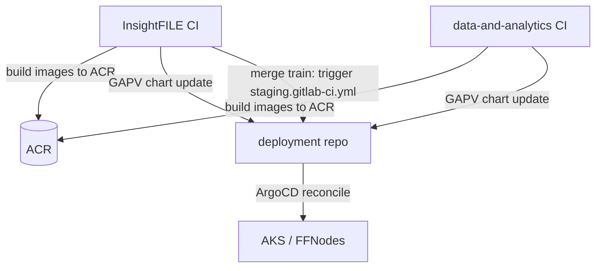

## FITFILE Monorepo Consolidation—Cost/Benefit

Question asked: should `apps/InsightFILE`, `data-and-analytics` and `deployment` become one repository?

Answer: no—not as a three-way merge. But a refined proposal raised on review (2026-09-16) _is_ the right target, and it is recorded in §5a: split per-customer overrides into tenant-scoped repos, serve charts as OCI artefacts, and bind them at deploy time with the ArgoCD multiple sources pattern. That resolves P1–P3 _and_ buys per-customer release control, which no monorepo variant offers.

The original three-way merge remains rejected, for the reasons in §4. The pain that made it attractive is caused by `deployment` doing two incompatible jobs, not by there being three repos.

---

## 1. Minimum Viable Understanding

`deployment` is simultaneously:

- a chart source library that two application repos mutate on every release, via the `gapv` bot writing image tags into shared `values.yaml` files on `master`; and
- the ArgoCD config repo that 31 FFNodes—including NHS trust production clusters—reconcile against directly (`repoURL: https://gitlab.com/fitfile/deployment.git` appears in ~11 of ~20 Application templates in `charts/ffnode/templates/`).

Every symptom below follows from that conflation. A monorepo does not resolve it; it deepens it, because the ArgoCD half of the job gets strictly worse when the repo grows and the access boundary disappears.

---

## 2. What is Actually coupled—evidence

Verified against local clones on 2026-09-16.

### 2.1 Two Producers Write the Same Two Files

Both `InsightFILE` and `data-and-analytics` run `gapv.sh update --repoType=chart` against `https://gitlab.com/fitfile/deployment.git`, branch `master`, and both target the same charts:

| Shared chart | Written by InsightFILE | Written by data-and-analytics |
|---|---|---|
| `workflows/src` | `fitconnectService`, `sftpLoader`, `emisProcessing`, `medcatAnnotate`, `nhsPet`, `s3FitfileCli`, `defaultExitHandler`, `setIntersectionEstimator` | `dpsQueueListener`, `omopConverter`, `piiAnalysis`, `probabilisticMatching`, `finalize`, `integrationTestValidator` |
| `workflows/integration-tests` | `ffcloudService`, `fitconnectService`, `mockrest`, `nhsPet`, `dpsWorkflowsApi` | all six DPS services |

Those two files are, by a clear margin, the most-churned paths in the repo over twelve months:

```
357  workflows/integration-tests/values.yaml
343  workflows/src/values.yaml
265  workflows/src/charts
238  charts/components/frontend
201  charts/components/ffcloud-service
```

This is textbook shared mutable state with two concurrent writers and no shared lock.

### 2.2 The Lock is Off, and Could not Work Anyway

`Application/InsightFILE/.gitlab-ci.yml:122-124`:

```yaml
  # This locks the deployment repository to prevent race conditions while versioning packages/images
  # Temporarily removing
  # resource_group: deployment-repo
```

`data-and-analytics/.gitlab-ci.yml:254` still sets `resource_group: deployment-repo`. But GitLab resource groups are project-scoped—mutual exclusion applies across pipelines _within one project_, never across projects. Two identically-named resource groups in two projects are two unrelated locks. Re-enabling InsightFILE's line restores intra-repo serialisation only; the cross-repo race survives. Group-level resource groups remain an unimplemented feature request.

So the race is currently unguarded in one direction and structurally unguardable in the other.

### 2.3 Release Traffic Dominates the GitOps Repo

Twelve-month commit attribution on `deployment`:

| Author | Commits | Share |
|---|---:|---:|
| `gapv` (bot) | 467 | 35% |
| Ollie Rushton (two identities) | 487 | 37% |
| Leon Ormes | 282 | 21% |
| Everyone else | 88 | 7% |

Last 90 days: 141 `[RELEASE]` bot commits against 301 human commits. Every one of those bot commits is an ArgoCD-visible change to the repo that 31 clusters watch.

### 2.4 Repo Weight

| Repo | Commits | Tracked files | Packfile |
|---|---:|---:|---:|
| `deployment` | 4,854 | 756 | 696 MiB |
| `apps/InsightFILE` | 6,637 | 3,787 | 131 MB |
| `data-and-analytics` | 1,543 | 1,135 | 359 MB |
| Combined | ~13,000 | ~5,700 | ~1.2 GB |

Note the anomaly: `deployment` carries 696 MiB of packfile for 756 tracked files. Whatever the history contains, it is not the working tree. That alone is worth a separate investigation before any merge is contemplated.

### 2.5 Team Size

10, 12 and 9 distinct authors respectively over twelve months, heavily overlapping—realistically 12–15 people across all three. This is the decisive contextual fact: monorepos pay off by removing _coordination_ overhead, and coordination overhead scales with team count. At this size the coordination saving is modest, while the tooling investment needed to make a polyglot monorepo livable is not.

---

## 3. The Problems Worth Naming

P1—Cross-repo release race (real, active). Two pipelines can bump the same `values.yaml` on `master` concurrently. Guard disabled on one side, structurally impossible on the other.

P2—No atomic cross-boundary change (real). Changing a shared contract—a values key, an image tag property name, a message contract between `ffcloud` and the DPS queue listener—needs two or three coordinated MRs that cannot be tested together before merge. The entire `gapv` tool exists to paper over this seam. _This is the strongest argument for consolidation._

P3—Release noise in the GitOps audit trail (real, moderate). A third of `deployment`'s history is bot bumps. `git blame` on a values file almost always lands on a robot. Reviewing genuine infrastructure change means filtering.

P4—CI blind spots across three `rules: changes:` regimes (real). Documented in [[FITFILE Audit - Repo and Pipeline Inventory]] §4 and tracked as FTFL-877: `apps/tasks/*` largely falls outside the change gates, and Renovate MRs have merged with no pipeline at all. FTFL-975 added `mr_pipeline_guard` to `deployment` for the same class of failure—a job whose own comment concedes _"this job verifies nothing about the change itself."_ Three repos, two different default branches (`development`, `development`, `master`), three conventions.

P5—Duplicated CI surface (real, minor). Three Renovate configs, three copies of `azure-oidc-auth.sh`, three `build.sh` variants sharing one ACR service principal, two near-identical `release.gitlab-ci.yml` files.

A three-way monorepo genuinely fixes P1 and P2, helps P3 and P5, and helps P4 only if accompanied by real affected-build tooling.

---

## 4. What the Merge Would Cost

### C1—ArgoCD Would Clone the Monorepo _(blocking)_

Every FFNode's ArgoCD repo-server would clone ~1.2 GB of history containing TypeScript, Python, notebooks, lockfiles and test fixtures in order to render Helm charts. Consequences:

- manifest generation slows across all Applications on all 31 nodes;
- every application-code commit triggers a reconciliation refresh for every Application, unless `manifest-generate-paths` annotations are added to all ~20 Application templates and kept correct;
- repo-server CPU and memory rise on customer production clusters—clusters we do not operate interactively.

The published guidance is unambiguous and points the other way: keep the config repo separate from application source precisely so ArgoCD clones only what it renders. We would be adopting, deliberately, the anti-pattern that the ArgoCD community documents runbooks for escaping.

### C2—The Customer Access Boundary Disappears _(blocking, governance)_

`ffnodes/` holds per-customer production configuration across `eoe`, `nwsde`, `kch`, `barts`, `wmsde` and `stg`—NHS trust deployments. Today that is a separate GitLab project with its own membership. Merged, every person with application-repo access inherits read and write on customer production deployment config. GitLab CODEOWNERS is an advisory review rule, not an access boundary—and `deployment` has no CODEOWNERS file today in any case. Given the sector, this needs a considered answer before anything else, not a mitigation bolted on afterwards.

### C3—Repo Weight Forces a History Rewrite

~1.2 GB combined is intolerable for every developer clone, every CI job and every repo-server pod. A BFG/filter-repo pass would be mandatory—which invalidates every existing clone, every open MR, and every pinned SHA in ArgoCD values and Terraform.

### C4—CI Cost Plausibly Rises, not Falls

There is no Nx, Turborepo or Bazel graph here; `rules: changes:` is the only affected-detection mechanism, and it is already the source of P4. A naively-merged monorepo runs _more_ jobs per commit, not fewer. This cuts directly against work currently in flight—recent effort has been reducing pipeline volume materially across all three repos (`deployment` roughly 27/day down to ~10/day, `data-and-analytics` ~11 down to ~6, InsightFILE ~15 down to ~12; figures from a September 2026 working session, not re-verified here—check against GitLab usage before citing). A monorepo without affected-build tooling risks handing that saving straight back.

And the tooling needed is Bazel-class, not Turborepo-class: TypeScript _and_ Python _and_ Helm _and_ CUE. For a 12–15 person team that is a platform programme measured in months, not a weekend.

### C5—Migration Is not a Git Merge

Rewrite both `gapv` config pairs; repoint ~20 ArgoCD Application templates and 31 FFNode value sets; retire four `GAPV_*_REPO_HTTP_{USERNAME,PASSWORD}` credential pairs and everything referencing them; reconcile three branch-protection and merge-train configurations; migrate or abandon in-flight MRs (InsightFILE alone is active in the!2450–!2470 range); and either pause or redo the FTFL-1008 ACR chart-publishing work mid-flight.

### C6—Review Latency and Blast Radius

One merge train serialising three previously independent streams. Published comparisons put median monorepo PR cycle time around an order of magnitude above polyrepo—directionally right even if the exact multiple is arguable, and it lands hardest on the highest-traffic repo, InsightFILE.

---

## 5a. Target architecture—multi-source, Tenant-scoped _(added on Review, 2026-09-16)_

Proposed on review and assessed as the right target. Four moves:

1. `deployment` trimmed to a chart library, published to ACR as versioned OCI artefacts (the FTFL-1008 pattern, extended to `charts/ffnode` itself).
2. Per-customer overrides extracted to tenant-scoped repos.
3. ArgoCD multiple sources binds chart and values at deploy time.
4. InsightFILE + data-and-analytics merged into one build repo (code to images), unchanged from Option D below.

### Why the Current Shape Makes This the Correct Fix

The root Application is single-source and unpinned. From `Clusters/FITFILE/Non-Production/sandbox-testing-1/sandbox-testing-2/platform/app-values.yaml`:

```yaml
source:
  repoURL: https://gitlab.com/fitfile/deployment.git
  targetRevision: "master"          # every node tracks HEAD
  path: charts/ffnode
  helm:
    releaseName: sandbox-testing-2
    valueFiles: [/ffnodes/fitfile/sandbox-testing-2/values.yaml]
```

Chart and values come from one repo at HEAD. That is the mechanism behind one-shot, untargeted releases—a commit to `master` reaches every node that resolves it. Splitting the sources and pinning the chart is what buys per-customer release cadence:

```yaml
sources:
  - repoURL: fitfileregistry.azurecr.io
    chart: helm/fitfile/ffnode
    targetRevision: 1.4.2            # pinned per customer
    helm:
      releaseName: cuh-prod-1
      valueFiles: [$values/ffnodes/cuh-prod-1/values.yaml]
  - repoURL: https://gitlab.com/fitfile/customers/eoe.git
    targetRevision: main
    ref: values
```

### Why This is Cheaper than it Looks

The child Applications already inline their values. All 19 templates in `charts/ffnode/templates/` render values through `helm: values: |` (via `renderValuesWithVaultSecretInExtraDeploy`); none use `valueFiles`. Multi-source is therefore needed only at the root app-of-apps—the ~20 child Applications per node are untouched. This is the single largest reason the migration is tractable.

Two further pieces are already in place: FTFL-1008 provides the OCI chart pattern, and `Clusters/nwsde/scripts/create_customer.sh` already instantiates per-customer deployments from a template directory.

### What the Proposal Gains over Options B+C Alone

- Per-customer release cadence. Promotion is one MR in one tenant repo. Essential for NHS trust change-control windows.
- Rollback is a revert in that tenant's repo, scoped to that tenant.
- Audit trail per customer—that repo's history _is_ the deployment record. Directly useful for DSPT and clinical safety evidence.
- Access boundary follows the tenant naturally, rather than needing CODEOWNERS to simulate it.

### Four Corrections to the Proposal

1. Granularity: per tenant, not per node. The 31 FFNodes cluster as:

| Tenant | Nodes | |
|---|---:|---|
| `fitfile` | 17 | all internal (ff-a/b/c, ff-test-*, sandbox-testing-1..5, testing, development, acr-test, gh-pt-1, pv-aks-1, wm-dev-1) |
| `eoe` | 7 | |
| `nwsde` | 2 | |
| `kch` | 2 | |
| `barts` | 1 | |
| `wmsde` | 1 | |
| `stg` | 1 | |

Repo-per-node is 31 repos, each with its own CI, protection rules and membership. Repo-per-tenant is 6 customer repos plus 1 internal—identical release isolation, roughly a fifth of the administration. Nodes within a tenant share change-control anyway.

1. The blocking prerequisite is that `Clusters/` is not in git. The root Application is defined in Terraform (`Clusters//locals.tf`, `platform/app-values.yaml`)—and `Clusters/` holds 5,272 files under no version control at all: no remote, no history, no backup. Every `repoURL`, `targetRevision` and `valueFiles` line this plan changes lives there. Raised in [[FITFILE Audit - Repo and Pipeline Inventory]] §5 and still true on 2026-09-16. Fix this first—otherwise the new architecture is built on an unreviewable, unrecoverable layer.
2. The overrides are not thin deltas. 16,408 lines across 31 nodes; mean ~530 per node; `eoe/hie-test-34/ohdsi-values.yaml` alone is 1,152 lines. This justifies extraction—the content is genuinely customer-specific—but a cross-cutting values change becomes 6 MRs rather than 1. Budget for that fan-out, and push everything shareable into chart defaults (`ffnode.resourcePreset` already establishes the pattern) so tenant repos carry only real deltas.
3. One multi-source defect to design around. Argo CD [issue #29716](https://github.com/argoproj/argo-cd/issues/29716)—open, labelled critical, confirmed in v3.4.5 and v3.5.2: when two sources point at the same repository and a commit lands between their resolution, manifest generation fails _open_ rather than closed and syncs an unrelated older revision (3,401 commits behind in the report), pinning it across retries and surviving refresh and server restart. Chart-from-ACR plus values-from-tenant-git does not meet the trigger condition. The risk is only if a migration shortcut points `$values` back at `deployment.git`. Do not take that shortcut.

### Extraction First—Sequencing Correction _(added 2026-09-17)_

Raised by Ollie Rushton: the first move should be lifting the per-customer overrides out of `deployment/ffnodes/` into tenant repos. That is right, and it corrects an error in the migration order recorded above.

That order treated "prove multi-source" and "extract tenant repos" as separate steps. They are one step. ArgoCD resolves `valueFiles` relative to the source's own repository; cross-repo values require the multi-source `$ref` syntax. The moment `ffnodes/` leaves `deployment`, multi-source is forced. Extraction _is_ the multi-source adoption.

Extraction also does not depend on FTFL-1008. Source 1 can stay git-based while the values move:

```yaml
sources:
  - repoURL: https://gitlab.com/fitfile/deployment.git   # unchanged for now
    targetRevision: "master"
    path: charts/ffnode
    helm:
      valueFiles: [$values/ffnodes/cuh-prod-1/values.yaml]
  - repoURL: https://gitlab.com/fitfile/customers/eoe.git
    targetRevision: main
    ref: values
```

Switching source 1 to OCI later does not touch source 2. The two changes are orthogonal and there is no double migration of the values—which is what makes extraction-first safe rather than merely appealing.

#### What Extraction Does and Does not Buy

Gained: the tenant access boundary, a per-customer audit trail, and 16,408 lines of customer configuration out of the shared repo.

Not gained: targeted releases. The ffnode values carry per-node configuration—resource presets, feature toggles, hostnames. Image tags live in `charts/components/*/values.yaml`, written by `gapv`, and the chart source stays `master`. After extraction every node still tracks chart HEAD exactly as it does today. Per-customer release control comes from pinning `targetRevision` on the chart source, not from moving the values. If the team expects extraction to deliver "release to one customer", correct that expectation before the work starts.

Cheaper interim than waiting for FTFL-1008: pin `targetRevision` to a git tag on `deployment.git` instead of `master`. That buys per-customer promotion without OCI.

#### `ffnodes/` Is not Homogeneous

28 of the 31 nodes are plain values files. Three are not:

| Node | Shape |
|---|---|
| `kch/prod` | `Chart.yaml` + 4 templates, ApplicationSet list-generator |
| `kch/mn4` | `Chart.yaml` + 2 templates, ApplicationSet list-generator |
| `stg/sandbox` | `Chart.yaml` + 4 templates, ApplicationSet list-generator |

These use a different architecture from the `charts/ffnode` app-of-apps that the other 28 share: a per-service `appConfig`/`infraConfig` split driven by an ApplicationSet list generator. They also reference `/ffnodes/empty-values.yaml`, a shared sentinel at the ffnodes root which breaks on extraction. Extract the 28 plain nodes first and treat these three as a separate design exercise.

#### The Internal 17 May not Need Moving

The `fitfile` tenant is 17 nodes, all FITFILE's own test, sandbox and internal production. There is no access-control driver for extracting them. Leaving them in `deployment` makes the job 14 nodes across 6 tenant repos rather than 31 across 7.

### Migration Order _(revised 2026-09-17)_

| # | Step | Nodes | Note |
|---|---|---:|---|
| 0 | Bring `Clusters/` under version control |—| ~1 day. 30 files there carry `value_files`; every root Application is defined in an unversioned tree |
| 1 | First extraction, which is also the multi-source proof | `fitfile/testing` | internal and disposable |
| 2 | `barts` to its own repo | 1 | smallest customer blast radius |
| 3 | `wmsde`, then `nwsde` | 3 | |
| 4 | `eoe` | 7 | largest values surface (1,152-line `ohdsi-values.yaml`) |
| 5 | `kch`, `stg` | 3 | ApplicationSet pattern—separate design |
| 6 | Pin the chart source |—| git tag as interim; OCI via FTFL-1008 properly |
| 7 | Trim `deployment` to charts only |—| |
| 8 | Option D—merge InsightFILE and data-and-analytics |—| conditional on affected-build tooling and FTFL-877 |

Step 0 is the only item worth holding the line on. It does not reorder the plan—extraction still comes first among the substantive moves—but editing 30 root-application definitions across production tenants in a directory with no history, no review and no revert is the one part with no safety net. It is also the cheapest item on the list.

---

## 5. Options

| Option | Fixes | Costs | Verdict |
|---|---|---|---|
| A. Three-way monorepo | P1, P2, P3, P5 | C1–C6; ArgoCD regression on 31 clusters; customer access boundary lost | Reject |
| B. Finish FTFL-1008—charts as versioned OCI artefacts | P1 (structurally), P3 | Low; already underway, phased, opt-in per node | Do this first |
| C. Split `deployment` into `charts` + `ffnodes` | P3, C1, C2 | Moderate; one-time repoint of Application templates | Do after B |
| D. Merge InsightFILE + data-and-analytics only | P2, P4, P5 | C3 (partial), C4, C6; no GitOps impact | Defensible—but only after B and C, and only with affected-build tooling |

### Why B is the Actual Fix

FTFL-1008 is already publishing `charts/components/ffcloud-service` to ACR as an immutable, versioned OCI Helm artefact, with `ffcloud.chart.source: acr` as a per-node opt-in (`charts/ffnode/templates/ffcloud-application.yaml`). Complete that pattern across the charts and the picture changes:

- P1 dissolves. Producers publish _distinct versioned artefacts_ instead of mutating a shared branch. Two concurrent releases cannot collide, because there is no shared file to collide on. The lock stops mattering.
- P3 dissolves. Bot bumps leave the GitOps repo's history entirely.
- C1 shrinks. ArgoCD's git repo reduces to FFNode values; charts come from the registry.

The known gap is already documented in the repo: `Chart.yaml`'s version is static, because `gapv` bumps only the image tag in `values.yaml`. That is FTFL-1008 Phase 2, and the immutability guard in `publish_ffcloud_service_chart` deliberately fails loudly until it is done. That is the ticket that matters here, and it is worth more than the monorepo question.

### Why D, if Pursued, is the only Merge Worth Making

InsightFILE and data-and-analytics genuinely change together: they write to the same two chart value files, their images are co-deployed by `workflows/src`, and integration tests span both (`integration_test_validator` lives in data-and-analytics; `workflows/integration-tests` carries images from both). That is the actual coupled pair. `deployment` is not coupled to either in the same way—it is _downstream_ of both.

Conditions before attempting D:

1. B and C complete, so the GitOps boundary is no longer entangled.
2. Affected-build tooling chosen and proven (TS + Python—expect Bazel or Pants, not Turborepo).
3. History rewrite planned, with a clone-invalidation window agreed.
4. FTFL-877 blind spots closed _first_—merging two repos with unreliable change gates produces one repo with unreliable change gates and a larger blast radius.

---

## 6. Recommendation

Superseded in part by §5a. Consolidated position, in order:

1. Do not merge all three. The GitOps boundary must stay separate—for ArgoCD performance, and for the customer access boundary.
2. Bring `Clusters/` under version control. Gates everything below; 5,272 files currently have no remote, no history and no backup, and they define every root Application.
3. Extract the per-customer overrides to tenant-scoped repos, 28 plain nodes first, starting with `fitfile/testing` and then `barts`. This is the same step as adopting ArgoCD multiple sources, and it does not wait on FTFL-1008.
4. Re-enable `resource_group: deployment-repo` in InsightFILE as an interim measure. One uncommented line; closes the intra-repo race only. Record explicitly that it is partial.
5. Pin the chart source so releases become targetable—git tag as an interim, then FTFL-1008 Phases 2 and 3 extending OCI publishing to `charts/ffnode`.
6. Trim `deployment` to charts only.
7. Then Option D—merge InsightFILE and data-and-analytics—conditional on affected-build tooling and on FTFL-877 being closed first.

Step 2 is the cheapest item and the one that gates the rest. Step 3 is the one that delivers the governance benefit, and it is available sooner than the original ordering implied.

---

## 7. What I Could not Verify

Stated so it is not mistaken for established fact:

- GitLab compute-minute spend and pipeline-per-day figures (§C4) come from a recent working session's analysis, not from a fresh pull of GitLab usage data. Re-verify before using in any cost case.
- ArgoCD repo-server sizing and current reconciliation latency on customer clusters were not measured. C1 is argued from published guidance and repo size, not from observed in-cluster metrics. Measuring one production FFNode's repo-server would make or break that argument empirically.
- The 696 MiB `deployment` packfile is unexplained. It may be historic binaries or vendored charts. Worth a `filter-repo --analyze` pass regardless of this decision.
- Migration effort estimates in §C5 are scoped from file counts and config inspection, not from a planning exercise with the team.
- The Argo CD version in use across FFNodes was not checked. Issue #29716 is confirmed in v3.4.5 and v3.5.2; whether the estate runs an affected version is unverified, and the §5a design avoids the trigger condition regardless.
- Whether every tenant's nodes genuinely share a change-control window is assumed, not confirmed—it is the premise of the per-tenant rather than per-node granularity in §5a. Worth checking with delivery for `eoe` in particular, which carries 7 nodes.
- Whether `kch` and `stg` can be deferred without blocking the other 28 is assumed from their file layout, not tested. If either shares state with the app-of-apps nodes through `/ffnodes/empty-values.yaml` or the `charts/ffnode` release name, that assumption needs checking before step 5.
- The ~1 day estimate for bringing `Clusters/` under version control assumes no secret material is committed in those 5,272 files. That has not been checked and should be, with secret scanning, before the first push.

---

## Sources

- [Argo CD — Best Practices](https://argo-cd.readthedocs.io/en/stable/user-guide/best_practices/)
- [How to Handle Config Repo vs Application Repo Separation](https://oneuptime.com/blog/post/2026-02-26-argocd-config-repo-app-repo-separation/view)
- [How to Optimize ArgoCD for Monorepos](https://oneuptime.com/blog/post/2026-02-26-argocd-optimize-monorepos/view)
- [ArgoCD Runbook: Repo Server High CPU](https://oneuptime.com/blog/post/2026-02-26-argocd-runbook-repo-server-high-cpu/view)
- [GitOps Best Practices: A Complete Guide, 2026 Edition — Akuity](https://akuity.io/blog/gitops-best-practices-whitepaper)
- [Monorepo vs Polyrepo: A Decision Guide for 2026](https://monorepovspolyrepo.com/)
- [Monorepo vs Polyrepo in 2026: The Hidden Ops Bill](https://medium.com/@connect.hashblock/monorepo-vs-polyrepo-in-2026-the-hidden-ops-bill-16380bf858cd)
- [GitLab forum — resource_group behaviour for separate projects](https://forum.gitlab.com/t/resource-group-behavior-for-separate-projects/60673)
- [GitLab issue #122010 — Group-level resource group](https://gitlab.com/gitlab-org/gitlab/-/issues/122010)
- [Argo CD — Multiple Sources for an Application](https://argo-cd.readthedocs.io/en/stable/proposals/multiple-sources-for-applications/)
- [Argo CD issue #29716 — same-repo multi-source `$values` can sync a stale revision](https://github.com/argoproj/argo-cd/issues/29716) _(open, critical)_
- [Argo CD issue #19703 — ApplicationSet with multiple sources for Helm charts and values](https://github.com/argoproj/argo-cd/issues/19703)
- [How to Use Multiple Sources for a Single ArgoCD Application](https://oneuptime.com/blog/post/2026-02-26-argocd-multiple-sources-single-application/view)

Local evidence: `fitfile/deployment` (git history, `charts/ffnode/templates/`, `ffnodes/`), `fitfile/apps/InsightFILE` (`.gitlab-ci.yml`, `deployment/pipeline/common/gapv-*.yaml`), `fitfile/data-and-analytics` (`.gitlab-ci.yml`, `deployment/pipeline/gapv-*.yaml`). All inspected read-only 2026-09-16.

## HEAD—Should InsightFILE, Data-and-analytics, and Deployment Become One Repo?

Verdict (short): Do not merge all three. Keep `deployment` as a separate GitOps repo. Optionally consider merging only the two _application_ repos later—after path-filtered CI and release locking are solid. The costly problems today are mostly cross-repo release coordination, not the existence of three remotes.

---

### 1. What We Have Today

| Repo | Role | Default branch | Stack |
|---|---|---|---|
| `fitfile/apps/InsightFILE` | App source, verification, image builds, release orchestration | `development` | Yarn workspaces (TS) + some Python (`workflows-api`)—already an app monorepo |
| `fitfile/data-and-analytics` | DPS / analytics images & services | `development` | Python multi-service |
| `fitfile/deployment` | Helm charts, `ffnode` ApplicationSets, OPA policies, staging CI for int tests | `master` | Helm + CUE + scripts—ArgoCD source of truth |

#### How Delivery Actually Chains



Evidence from Confluence _InsightFILE Pipeline Behaviour by Change Type_ and repo YAML:

1. MR: path-filtered verify only (no images, no cluster).
2. Merge train: build `{sha}-rc` images → `get_staging_images` → multi-project trigger into `fitfile/deployment` `staging.gitlab-ci.yml` → Argo sync + integration tests (`resource_group: deployment-repo` / `staging`).
3. Default branch: child release pipeline runs GAPV:
   - `gapv.sh update --repoType=chart` → commits image tags into deployment
   - `gapv.sh update --repoType=code` → bumps versions in the app repo
   - commits often start with `[RELEASE]` so parent workflow does not recurse

Same GAPV pattern exists in `data-and-analytics` (`deployment/pipeline/gapv-deployment.yaml` → `workflows/src` image tags). Both app repos therefore write into the same GitOps repo.

InsightFILE already documents race risk: release `resource_group: deployment-repo` is commented out ("Temporarily removing"), while merge-train staging still uses a lock. Audit inventory notes this removes protection when multiple pipelines version charts concurrently.

#### Scale (Local Clones, Sep 2026)

| | `.git` size | Commits (approx) |
|---|---|---|
| InsightFILE | ~131 MB | ~6.6k |
| data-and-analytics | ~359 MB | ~1.5k |
| deployment | ~709 MB | ~4.9k |

Working trees are multi-GB (node_modules, tooling, chart artefacts). A three-way merge is a mega-repo, not a tidy fold.

---

### 2. Problems the Three-repo Split Creates (FITFILE-specific)

#### P1—Cross-repo Release Machinery (GAPV)

- Special Maintainer tokens for InsightFILE and deployment ([Rotating Gitlab Pipeline Access Tokens](https://fitfile.atlassian.net/wiki/spaces/FITFILE/pages/1767276545)).
- Dual commits + `[RELEASE]` loop avoidance.
- Chart bumps and code bumps are separate git operations—partial failure modes.
- Two app repos can race writing the same chart values (lock currently incomplete on release).

#### P2—Multi-project CI Coupling

- Integration tests live as a child pipeline in deployment, triggered from InsightFILE/DPS with `STAGING_VALUE_OVERRIDES`.
- Harder to reason about "what ran" than a single path-filtered pipeline (hence the Confluence matrix page).

#### P3—Local / Agent / Onboarding Friction

- Dev Environment wiki: clone both InsightFILE and deployment.
- Miro / consolidated notes: _multi-repo orchestration_; _few people can manage deployments_.
- Agents and humans cannot land app+chart changes in one review without coordination.

#### P4—Serialisation & Throughput

- `resource_group: staging` / `deployment-repo` → effectively one concurrent staging/release lane (FTFL-897 territory).
- Miro: "monorepo needs non-blocking pipeline (HEAD commits blocking)"—InsightFILE is already a monorepo with this pain; enlarging the monorepo amplifies it unless path filters + non-blocking HEAD are fixed first.

#### P5—Split Ownership of One Product Unit

- FFNode deploys InsightFILE services and DPS images from one umbrella. Product changes often need coordinated image tags across repos that do not share a commit.

These are real costs. They do not automatically justify one git remote.

---

### 3. What Industry / GitOps Best Practice Says

#### Argo CD (Official Best Practices)

Highly recommended: keep Kubernetes/Helm config in a separate repo from application source.

Reasons that map directly to FITFILE:

1. Change replicas / values without triggering full app CI.
2. Cleaner GitOps audit history (deploy intent ≠ compile history).
3. One deployable unit can consume images from many source repos (exactly FFNode + InsightFILE + DPS + ude-cli + …).
4. Access separation—app committers ≠ production Helm / customer `ffnode` authors.
5. Avoid CI ↔ Git write infinite loops (FITFILE already fights this with `[RELEASE]` rules).

#### Hybrid is the Common Recommendation

- GitOps / platform monorepo (charts, env overlays, ApplicationSets)—FITFILE already has this as `deployment`.
- Application polyrepos (or small app monorepos) for team autonomy and different stacks.
- CertVanta 2025: monorepo for tightly coupled services & platform consistency; polyrepo for access control & independent release; migration is expensive (months).
- Pulumi: small teams may colocate; once CI cost, cache invalidation, and access diverge—split. Argo cache invalidation on every app commit is a real scale tax if manifests sit next to high-churn source.

#### Implication for the "Merge All Three" Idea

Merging apps into deployment fights Argo CD guidance and FITFILE's own SoT (_hybrid CI-driven GitOps_: CI builds images; Argo reconciles deployment). Merging only the two app repos is a different, smaller question.

---

### 4. Cost–benefit For FITFILE

#### Option A—Status Quo (3 Repos) + Fix Coordination

| Benefit | Cost |
|---|---|
| Matches Argo CD separation | Keeps GAPV cross-repo complexity |
| Clear GitOps SoT for all clusters | Race / lock / token ops remain |
| Independent chart-only changes | Multi-clone DX |
| Access control on prod/customer paths | Two release writers into one charts repo |

Best when: NHS/customer config and platform Helm must stay tightly gated; stack diversity (TS vs Python vs Helm) stays high.

#### Option B—Merge InsightFILE + Data-and-analytics Only; Keep `deployment`

| Benefit | Cost |
|---|---|
| One PR for app+DPS features that ship together | Huge CI matrix (Yarn + Poetry + path filters mandatory) |
| Shared tooling/renovate/OIDC patterns | Migration of history, default-branch policy, CODEOWNERS |
| Slightly fewer remotes for product engineers | Does not remove GAPV→deployment (still cross-repo) |
| Aligns with "product unit" thinking | Onboarding surface area grows |

Net: moderate DX win; does not remove the main release coupling pain (chart writes).

#### Option C—Merge All Three (Mega-repo)

| Benefit | Cost |
|---|---|
| Atomic code+chart commits; GAPV chart step can become in-tree path edit | Violates Argo "separate config" recommendation |
| One clone for full stack | Every chart tweak risks app CI; every app push risks Argo watch noise |
| Kill cross-repo GAPV tokens for chart bumps | Access: app engineers gain visibility/write path to customer/env Helm |
| Simpler mental model for agents | Repo size / clone / Renovate blast radius |
| | Rework staging child-pipeline, branch model (`development` vs `master`), `[RELEASE]` loop design |
| | Migration 3–9+ months; high regression risk on NHS delivery path |
| | Amplifies "HEAD commits blocking" unless non-blocking path CI is solved first |

Net for FITFILE: cost > benefit. Highest risk option. Solves coordination by destroying the intentional GitOps boundary.

#### Option D—Keep Three Repos; Replace Cross-repo GAPV with Better Glue (Recommended Direction)

| Benefit | Cost |
|---|---|
| Keep Argo separation | Still multiple remotes |
| Remove or shrink GAPV write-back pain | Engineering on image-updater / PR bots / ACR chart publish |
| Re-enable release `resource_group` | Does not give atomic code+chart commits |
| Publish versioned charts to ACR; apps open PRs or Image Updater write-back | Needs design work (already partially explored—ACR chart publishing audit) |

Net: attacks P1/P2 without mega-repo tax. Aligns with Miro quick wins ("publish charts to ACR") and Argo Image Updater patterns.

---

### 5. Problem → Solution Map

| # | Problem | Preferred solution | Avoid |
|---|---|---|---|
| 1 | GAPV cross-repo chart bumps + token ceremony | Image tag write-back via PR bot or Argo Image Updater; or publish charts to ACR and bump digests | Merging apps into `deployment` solely to delete GAPV |
| 2 | Release race on deployment repo | Re-enable `resource_group: deployment-repo` on release; serialize writers; or single release orchestrator | Commenting out the lock permanently |
| 3 | Staging int-test coupling / one lane | Ephemeral lanes / parameterise `staging.gitlab-ci.yml` by MR (notes already drafted); keep deployment as host of staging jobs or move jobs behind a reusable CI component | Mega-repo so "it's all local:" |
| 4 | Multi-repo DX / agent friction | Workspace meta-repo or git subtree for local only; document sparse-checkout; Cursor multi-root | Forcing one remote for DX convenience |
| 5 | InsightFILE monorepo HEAD blocking | Path-filtered non-blocking pipelines; fix FTFL-877 style blind spots before any consolidation | Growing the monorepo first |
| 6 | Coordinated InsightFILE + DPS features | Shared release train / version contract; optional later merge of app repos only | Collapsing GitOps into app history |
| 7 | Access / NHS customer config | Keep `ffnodes` + prod values in deployment (or even further-split env overlays) with CODEOWNERS | Putting customer overlays beside Node apps |
| 8 | Infinite CI loops | Separate GitOps repo (already) + careful `[RELEASE]` / bot rules | Single repo without ironclad path/`workflow:rules` |

---

### 6. Recommendation

1. Do not move InsightFILE + data-and-analytics + deployment into one repository.
2. Treat `deployment` as permanent GitOps SoT (matches Argo CD + FITFILE SoT three-tier model).
3. Prioritise glue fixes over repo topology change:
   - Restore release locking.
   - Reduce GAPV cross-repo privilege (chart PRs / Image Updater / ACR-published charts).
   - Finish path-filtered, non-blocking InsightFILE CI (existing monorepo debt).
4. Revisit app-only merge (InsightFILE ↔ DPS) only if:
   - Product changes routinely require atomic TS+Python commits, and
   - Path CI + caching are proven under load, and
   - Team accepts one CODEOWNERS / release policy across stacks.
5. If DX is the main driver, prefer a local meta-workspace (already how `/Volumes/DAL/Fitfile/gitlab/FITFILE` is laid out) over rewriting remotes.

---

### 7. Research Caveats

- Pieces LTM: `pieces ask` / `pieces search` failed on 2026-09-16 (model/OS errors). Context instead from live vault notes, Confluence pipeline pages, and local git trees.
- Live vault path per audit: `/Volumes/DAL/Zettelkasten/LLMeon` (Documents/LMeon may diverge).
- Industry sources emphasise hybrid GitOps; FITFILE is already hybrid—the gap is automation quality, not missing a mega-repo.

---

### 8. Related

- [[FitFile CI_CD Pipeline — Consolidated Notes]]—Miro multi-repo / monorepo blocking / resource_group
- [[FITFILE Audit - Repo and Pipeline Inventory]]—GAPV release path, commented `resource_group`
- [[FITFILE Delivery Pipeline Audit 2026-08-27]]
- [[SoT - FitFile Deployment - Strategy & Architecture]]
- [[HEAD - Should ffnode ship to ACR as one umbrella chart or as versioned leaf charts?]]
- Confluence: [InsightFILE Pipeline Behaviour by Change Type](https://fitfile.atlassian.net/wiki/spaces/FITFILE/pages/2967371777)
- Confluence: [CI/CD Design Document & Improvement Plan](https://fitfile.atlassian.net/wiki/spaces/FITFILE/pages/2865528839)
- Argo CD: [Best Practices — Separating Config Vs. Source Code](https://argo-cd.readthedocs.io/en/stable/user-guide/best_practices/)
