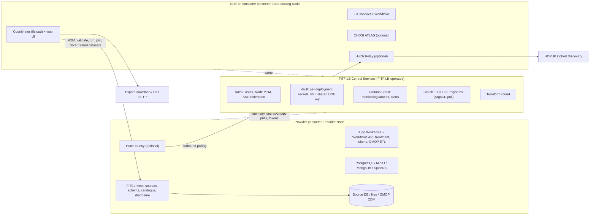

%% Raw agent research brief (Claude Code, 2026-09-28), kept as source material for the FITFILE context brief. Not your own writing, so no own_words property. Page IDs link to Confluence. Redacted for the vault where needed: personal names, a prospect's name, page-hygiene and security-debt specifics. %%

Part of: [[FITFILE Context Brief — What We Do and How We Link Data Silos]]

## Brief B: Product Components and Technical Architecture

Source: FITFILE Confluence, read-only, read on 2026-09-28. Citations give (short title, page ID). Full titles and last-modified dates are in section 6, and a year is added inline wherever it matters. People are named by role only. No secrets, hostnames or commercial figures are reproduced.

### 1. Summary

- The unit of deployment is the FITFILE Node. A Node is a self-contained Kubernetes cluster, provisioned with Terraform and kept up to date by ArgoCD pulling from GitOps. It sits inside each Data Controller's perimeter, usually in a dedicated Azure subscription or AWS account; on-premises deployment is described as a last resort. Each Node holds FITConnect (data access and pipelines), the Coordinator (formerly "FFCloud") with its web UI, and PostgreSQL, MinIO, MongoDB, SpiceDB and Argo Workflows. (Tech Solution Detail, [2503376897](https://fitfile.atlassian.net/wiki/pages/viewpage.action?pageId=2503376897); Technical Overview, [2164097026](https://fitfile.atlassian.net/wiki/pages/viewpage.action?pageId=2164097026))
- Nodes are linked into project-scoped networks. A Coordinating Node (also called the SDE, "hub" or "master" Node) sends operations to Provider Nodes, pulls back privacy-treated intermediate datasets, and links or merges them. Any Node can connect to any other if the Data Controllers agree. (Tech Solution Detail; Inter node communication, [2147385345](https://fitfile.atlassian.net/wiki/pages/viewpage.action?pageId=2147385345))
- Every Node depends on Central Services that FITFILE operates. These are Auth0 (identity), HashiCorp Vault (secrets), Grafana Cloud (telemetry and alerting), GitLab and FITFILE's container registries (updates), and Terraform Cloud (provisioning). The pages say only operational telemetry reaches the centre, and raw source data does not. (Tech Solution Detail; Node Installation–Central Services, [1839169559](https://fitfile.atlassian.net/wiki/pages/viewpage.action?pageId=1839169559))
- Compute happens at source. Queries are pushed down to the source database where possible. A transient copy enters Node storage only for tokenisation, privacy treatment, profiling and small-number suppression. Outputs leave as privacy-treated datasets, aggregate counts, or exports the Data Controller has approved. (13. Data Movement, [2180808705](https://fitfile.atlassian.net/wiki/pages/viewpage.action?pageId=2180808705); Data Disclosure, [2148499464](https://fitfile.atlassian.net/wiki/pages/viewpage.action?pageId=2148499464))
- Two kinds of linkage key. FITtoken is deterministic and reversible (an HMAC pseudonym). FITanon is based on a zero-knowledge proof (ZKP) and is irreversible. Nodes in one network share a UDE key held in Vault. NHS-PET pseudonyms were added for linkage across SDEs where FITFILE is not installed. (UDE CLI Component, [1834582019](https://fitfile.atlassian.net/wiki/pages/viewpage.action?pageId=1834582019); Central Services install; NHS-PET Integration, [2318106625](https://fitfile.atlassian.net/wiki/pages/viewpage.action?pageId=2318106625))
- Identity and access. Auth0 handles users and Node machine identities (client-credentials M2M). SpiceDB provides relationship-based permissions over tenant, project, datasource and dataset. SpiceDB started as one central service (2022 ADR). A 2025 decision gave each Node its own permission system, with the Data Provider deciding what a project may see. (9. Architectural Decisions, [1700233222](https://fitfile.atlassian.net/wiki/pages/viewpage.action?pageId=1700233222); Multi-Tenanted Access Control, [2033123333](https://fitfile.atlassian.net/wiki/pages/viewpage.action?pageId=2033123333))
- Stated direction (decision recorded 2025): decentralised Nodes, with deployments still managed centrally. Linking tenants is still manual, and customers asking to bring their own identity provider are blocked because the Auth0 code is not abstracted. (Multi-Tenanted Access Control; Resolved Risks and Technical Debt, [2202238978](https://fitfile.atlassian.net/wiki/pages/viewpage.action?pageId=2202238978))
- Evolution. The 2020–22 model was a central "Core"/FITFILECloud with edge "Collector" FITConnects, Azure AD, a RabbitMQ/Spark Data Processing Service (DPS), and hosted multi-tenant clusters. It has become per-customer Nodes with Argo Workflows, Auth0 plus SpiceDB, and a Workflows API that composes DAG workflows, some of them distributed. (PS space pages; Central Contracts & Custom Workflows, [2233270273](https://fitfile.atlassian.net/wiki/pages/viewpage.action?pageId=2233270273))
- OMOP is the practical interoperability layer. The Hyve's ETL runs inside Nodes, followed by Achilles and DQD reports. OHDSI ATLAS in the SDE Node produces cohort definitions whose SQL runs inside Provider Nodes. Hutch Bunny/Relay connects to HDRUK National Cohort Discovery. (OMOP harmonisation–Technical Overview, [2872541187](https://fitfile.atlassian.net/wiki/pages/viewpage.action?pageId=2872541187); OHDSI ATLAS-FITFILE integration, [2588180481](https://fitfile.atlassian.net/wiki/pages/viewpage.action?pageId=2588180481))

### 2. Findings

#### 2.1 Components as Documented now (2025–2026)

- FITFILE Node. Described as "self-contained" and able to "act independently", with "centralised control and deployment". It can be put to sleep when idle. (The FITFILE Node, [2164359172](https://fitfile.atlassian.net/wiki/pages/viewpage.action?pageId=2164359172)) The Glossary definition is "one or more FITConnects and one or no FITCoordinator", and it notes that "Cluster" and "Node" are used interchangeably with clients (Glossary, [1699348489](https://fitfile.atlassian.net/wiki/pages/viewpage.action?pageId=1699348489)).
- FITConnect.
  - Connects data sources: encrypted file uploads (CSV, Excel, JSON), MySQL, PostgreSQL, MS SQL, Elasticsearch, S3, and other FITConnects.
  - Runs Argo pipelines and holds the tenant's data catalogue.
  - Lets Data Controllers attach sources to projects and set safeguards (disclosure approval, small-number suppression).

  (Technical Overview; Tech Solution Detail) Its APIs are a user-facing GraphQL API and a tenant-to-tenant REST API (APIs, [1795719169](https://fitfile.atlassian.net/wiki/pages/viewpage.action?pageId=1795719169)).

- Coordinator (the "ffcloud" service).
  - The Glossary calls "FF Cloud" "an old name for the coordinating station, which itself is a term being depreciated". It requests data from FITConnects and links it.
  - FITFILE maintains three OpenAPIs: Coordinator, FITConnect and Workflows. The Coordinator API is generated from the `ffcloud` workspace of the InsightFILE monorepo (FITFILE Open API docs, [2556854273](https://fitfile.atlassian.net/wiki/pages/viewpage.action?pageId=2556854273)).
  - It owns project-level export requests, permission checks and audit (Data Export (revisited), [2652667916](https://fitfile.atlassian.net/wiki/pages/viewpage.action?pageId=2652667916)).
- InsightFILE / HealthFILE. Query Plan interfaces for anonymised and pseudonymised/identifiable work respectively, and "the primary user access to data within a FITFILE Node" (Node Component Overview, [2164260868](https://fitfile.atlassian.net/wiki/pages/viewpage.action?pageId=2164260868)).
- Workflows.
  - Argo Workflows became the scheduler in 2023 (9. Architectural Decisions).
  - In 2024 a Workflows API replaced the Argo Events and RabbitMQ middleware (Resolved Risks).
  - Inter-service contracts are JSON Schemas. Custom workflows are DAGs of Tasks.
  - The distributed phase splits a DAG across tenants, applies the IG rules of each tenant that holds data, and signs payloads so tampering can be detected. (Central Contracts & Custom Workflows)
- UDE CLI (Rust).
  - Provides HMAC pseudonymised linkage and ZKP anonymised linkage, plus nascent probabilistic linkage (UDE CLI Component).
  - "All FITFILE Node's in the same network must have the same UDE key" (Central Services install).
- Stores. PostgreSQL holds uploads, the OMOP CDM and the Argo archive. MinIO holds datasets as parquet. MongoDB holds application data. Running three databases is logged as technical debt. (11. Risks and Technical Debt, [1701314562](https://fitfile.atlassian.net/wiki/pages/viewpage.action?pageId=1701314562))
- Query Plans.
  - A Query Plan is JSON: SQL for each FITConnect, key fields, joins, anonymisation level, results type and a k-threshold (Query Plan, [1712979983](https://fitfile.atlassian.net/wiki/pages/viewpage.action?pageId=1712979983)).
  - Free SQL can defeat de-identification, so SQL became a separate operation whose output has no schema until the Data Provider defines one (Working With SQL, [2017427458](https://fitfile.atlassian.net/wiki/pages/viewpage.action?pageId=2017427458)).
  - The Builder started as a JSON editor, with a UI to come in stages (Query Plan Builder, [1759772674](https://fitfile.atlassian.net/wiki/pages/viewpage.action?pageId=1759772674)).
  - Query Plans are recorded as "too rigid", which is the reason given for custom workflows (Resolved Risks).
- Projects are the core organisational unit, isolating users, data and queries (Tech Solution Detail). PRODDOCS "Research Project Manager" is an index page only ([2203385857](https://fitfile.atlassian.net/wiki/pages/viewpage.action?pageId=2203385857)).
- Catalogue, schema and dictionary.
  - A schema must exist before a dataset can be queried (6. Runtime View, [1702395948](https://fitfile.atlassian.net/wiki/pages/viewpage.action?pageId=1702395948)).
  - Fields are classified by identifier type (direct, indirect, non-identifier or encoded) and by semantic type (Removal of Direct Identifiers, [2028666883](https://fitfile.atlassian.net/wiki/pages/viewpage.action?pageId=2028666883)).
  - The single-tenant catalogue is done. A multi-tenant view that aggregates Provider catalogues into the coordinating tenant was due in December 2025 (Data Catalogue, [2024898561](https://fitfile.atlassian.net/wiki/pages/viewpage.action?pageId=2024898561)).
  - PRODDOCS "Data Mapping & Dictionary" pages are empty ([2217279489](https://fitfile.atlassian.net/wiki/pages/viewpage.action?pageId=2217279489)).
- Cohort discovery has three routes:
  - native count operations;
  - Hutch: Relay in the SDE Node, Bunny in the Provider Node, returning obfuscated counts to HDRUK (Node Installation–Cohort Discovery, [2652635137](https://fitfile.atlassian.net/wiki/pages/viewpage.action?pageId=2652635137); Hutch-bunny TDD, [2041446402](https://fitfile.atlassian.net/wiki/pages/viewpage.action?pageId=2041446402));
  - ATLAS cohort definitions whose SQL runs at Providers using temporary tables (OHDSI ATLAS-FITFILE integration).
- OMOP ETL (The Hyve). An ephemeral pipeline inside the Node: load source → optional NDOO opt-out check via MESH → restricted-code filter → CDM → Achilles/DQD reports to S3 → read-only CDM user → registered as a FITFILE data source (OMOP harmonisation).
- Export.
  - 2025: pull-based by decision, using API download, service accounts and webhooks (Data Export/Integrations, [2059304970](https://fitfile.atlassian.net/wiki/pages/viewpage.action?pageId=2059304970)).
  - 2026 redesign: download, S3 and SFTP destinations with an RSA-PSS-signed manifest, run as a distributed workflow (Data Export (revisited)).

The current architecture as described by the pages cited above:

Corroboration from outside Confluence: the deployment repository's `charts/` directory holds `ffcloud-service`, `fitconnect`, `frontend`, `spicedb`, `workflows-api`, `argo`, `hutch`, `mesh-mailbox` and `integrations/{thehyve,ohdsi}`. This matches the component list above.

#### 2.2 Deployment Topology

- Standard model. One cluster per Node, in a dedicated subscription or account.
  - Network: hub-and-spoke. The FITFILE spoke VNet/VPC is peered to the customer's hub, and all egress is forced through the customer's firewall.
  - Security and resilience: Calico micro-segmentation, private endpoints with a jumpbox, four certificate options, Azure Backup of the application namespace, and disaster recovery by rebuilding from GitOps.
  - A seven-phase implementation lifecycle, from contract through information governance (IG) approval to live sign-off.

  (Tech Solution Detail; Configured Solution Design–Master, [2519433236](https://fitfile.atlassian.net/wiki/pages/viewpage.action?pageId=2519433236))

- Connectivity. The Node needs only outbound HTTPS 443 to Central Services (Technical Overview). Inbound access is needed for users and for Node-to-Node traffic, via a public IP or FQDN "when Node-to-Node traffic is required" (Tech Solution Detail).
- Where Nodes are hosted.
  - Both FITFILE-hosted and Data Provider-hosted naming patterns exist (Technical Overview).
  - FITFILE hosts at least one customer in its own Azure tenant (Resolved Risks).
  - The 2026 stress test ran five Nodes in FITFILE's tenant behind public load balancers; one Node acted as both Coordinator and Provider (Scale, Load and Cost Testing Report v2, [2944303107](https://fitfile.atlassian.net/wiki/pages/viewpage.action?pageId=2944303107)).
  - 2026 meeting notes propose a FITFILE-managed AWS stack for a hospital, in an account that can later be transferred to it, with the hospital pushing its data into cloud storage (EOE notes [2753789953](https://fitfile.atlassian.net/wiki/pages/viewpage.action?pageId=2753789953), [2796552193](https://fitfile.atlassian.net/wiki/pages/viewpage.action?pageId=2796552193)).
- On-premises.
  - A 2022 bare-metal kubeadm runbook exists (On Premise Deployment Guide, [1411907589](https://fitfile.atlassian.net/wiki/pages/viewpage.action?pageId=1411907589)), and manual on-premises deployment is logged as a risk (11. Risks).
  - A 2026 single-VM specification for the same hospital ([2669445123](https://fitfile.atlassian.net/wiki/pages/viewpage.action?pageId=2669445123)) was followed by the AWS pivot above.
- SaaS versus single-tenant.
  - 2022: a runbook added per-client FFNodes to FITFILE-run clusters, which could share database servers (Multi-tenant SaaS Deployment Guide, [1456078849](https://fitfile.atlassian.net/wiki/pages/viewpage.action?pageId=1456078849)).
  - 2025: a central PaaS was ruled out because "the NHS do not easily trust a SaaS/PaaS product" (Multi-Tenanted Access Control).
- Sizing. The 2024 page says "3 VM" (7. Deployment View, [1702854693](https://fitfile.atlassian.net/wiki/pages/viewpage.action?pageId=1702854693)). The stress test recommends a four-NodePool layout (system, fitfile, omopdb, and a workflows pool that scales to zero) and names the workflows NodePool as the main CPU constraint at scale (Scale report).

#### 2.3 What Moves and what Stays

- Processing at source. Select, filter and aggregate run in the source database (SQL or FITFILE Query Language); custom processing uses an ephemeral copy in the Node (13. Data Movement).
- Intermediate datasets stay on Provider Nodes "until last possible moment" and are pulled temporarily into the Coordinator for merging (Inter node communication).
- Traffic to the centre is telemetry only (Tech Solution Detail).
- Where the "federated" label gets complicated. The Master Node distributes queries and aggregates results. Pseudonymised data does move to the SDE, and counts go to the National Portal. (Use of "Federated", [2016706564](https://fitfile.atlassian.net/wiki/pages/viewpage.action?pageId=2016706564))
- Controller levers.
  - Per-query disclosure approval: a query is held until all Controllers approve (Data Disclosure).
  - Partial results when a source or Node fails (Partial Results, [2176614401](https://fitfile.atlassian.net/wiki/pages/viewpage.action?pageId=2176614401)).
  - Manual disconnection of a data source (Data Source Disconnection, [2175893505](https://fitfile.atlassian.net/wiki/pages/viewpage.action?pageId=2175893505)).
  - Direct identifiers stripped from final outputs (Removal of Direct Identifiers).
  - Primary keys copied only ephemerally when ciphers are generated (Configured Solution Design–Master).
- Recorded leak risks.
  - The pseudonymisation merge "transports all data … including non set intersection data" (11. Risks).
  - NDOO checking sends NHS numbers to the NDOO MESH mailbox (OMOP harmonisation).
  - NHS-PET integration sends the NHS-number column by SFTP to NHS-PET (NHS-PET Integration).

#### 2.4 How Nodes Talk to Each other and to the Centre

- Current flow is one-way, Coordinator to Provider: validate, run, poll, fetch datasets and documents.
  - Costs: polling overhead; Providers must pay for an inbound gateway or ingress; Providers cannot see or contribute to projects.
  - Proposed alternative: reverse the direction so Providers subscribe to the Coordinator (pub/sub, no inbound traffic), or allow a hybrid. Recorded as undecided. (Inter node communication)
- Machine identity. Nodes call each other with their own Node identity, not a user's (Multi-Tenanted Access Control; Identity Management, [2061402114](https://fitfile.atlassian.net/wiki/pages/viewpage.action?pageId=2061402114)).
- Linking two Nodes today takes SpiceDB relationships in the Provider, a datasource-to-project assignment, a `fitConnectHosts` entry in the Coordinator's configuration, documents inserted directly into MongoDB, and an Auth0 `enabled_apis` change through central-services Terraform (Connect a Data Provider Node, [2118811663](https://fitfile.atlassian.net/wiki/pages/viewpage.action?pageId=2118811663)). This is logged as error-prone and known by one engineer (11. Risks; Resolved Risks).
- Network paths. A private IPsec VPN is recommended over public HTTPS for links between SDEs (Architectural Patterns for Secure Multi-Cloud Connectivity, [2256240641](https://fitfile.atlassian.net/wiki/pages/viewpage.action?pageId=2256240641); Clarifying Our Connectivity Strategy, [2260893698](https://fitfile.atlassian.net/wiki/pages/viewpage.action?pageId=2260893698)).
  - Working example: an AWS SDE hub reaches a hospital's Azure Node through the hospital's on-premises network. Bunny calls out to Relay's public endpoint, which is restricted to the Provider's egress IPs. (EOE <-> CUH Networking Test Plan, [2293399554](https://fitfile.atlassian.net/wiki/pages/viewpage.action?pageId=2293399554))
- Node to centre. A Vault operator pulls secrets from per-deployment namespaces; a Grafana agent ships telemetry; ArgoCD pulls from GitLab; images come from FITFILE registries; Auth0 issues tokens (Central Services install; Tech Solution Detail firewall appendix).

#### 2.5 Identity and Access

- Auth0.
  - Users sign in through OIDC. Nodes and service accounts are Auth0 Applications.
  - Customer SSO goes through Auth0 Enterprise Connections ("Federated Trust").
  - Keycloak was evaluated and deferred.
  - Auth0's costs rise with the number of machine identities and SSO connections. (Identity Management)
- SpiceDB.
  - 2022: central (9. Architectural Decisions). A 2023 production-readiness review raised concerns (SpiceDB review, [1563328517](https://fitfile.atlassian.net/wiki/pages/viewpage.action?pageId=1563328517)).
  - 2025: "Each node has its own permissions system". Project scope is chosen by the Provider. Phase 3, broadcasting a project to Providers for approval, is "NOT DONE". (Multi-Tenanted Access Control)
  - The installation guide still describes both central and per-Node SpiceDB (Central Services install).
- Roles (2026 draft). Organisation level: Org Admin, Data Controller, Data Source Manager. Project level: Project Admin, Data Analyst. The author flags that "Data Consumers set the permissions … It should be Data Providers" (14. RBAC DRAFT, [2681077761](https://fitfile.atlassian.net/wiki/pages/viewpage.action?pageId=2681077761)).
- 2021. An Azure AD tenant fronted three APIs: InsightFILE (façade), FITConnect ("operated by a Data Partner") and FITCloud (management of FITConnects) (Platform Authorisation Blueprint, [1137901569](https://fitfile.atlassian.net/wiki/pages/viewpage.action?pageId=1137901569)).

#### 2.6 Integrations

| Integration | Documented status (source) |
| --- | --- |
| NHS MESH / NDOO | In the OMOP pipeline (OMOP harmonisation) |
| HDRUK National Cohort Discovery | Via Hutch Relay/Bunny; OMOP required (National Portal Integration, [2016477190](https://fitfile.atlassian.net/wiki/pages/viewpage.action?pageId=2016477190)) |
| NHS-PET | Built; test access has since expired, so the integration test can no longer run (1.8.1 NHS PET Pseudo ID, [2979233793](https://fitfile.atlassian.net/wiki/pages/viewpage.action?pageId=2979233793)) |
| OHDSI ATLAS / Achilles | Being integrated in 2026 (CDH roadmap, [2549448706](https://fitfile.atlassian.net/wiki/pages/viewpage.action?pageId=2549448706)) |
| TPP SystmOne | IM1 scoping only: consent and a gateway PC per practice, HSCN (TPP SystmOne, [1986166786](https://fitfile.atlassian.net/wiki/pages/viewpage.action?pageId=1986166786)) |
| EMIS | Stub page pointing to SharePoint (EMIS, [2221539345](https://fitfile.atlassian.net/wiki/pages/viewpage.action?pageId=2221539345)) |
| FHIR | Not supported; adapter needed; "No development time allocated" (FHIR, [2200502278](https://fitfile.atlassian.net/wiki/pages/viewpage.action?pageId=2200502278)) |
| Power BI | 2022 design for a reporting Postgres schema per project (PowerBI Deployment Scenarios, [1374912513](https://fitfile.atlassian.net/wiki/pages/viewpage.action?pageId=1374912513)) |
| NLP (MedCAT) | Designed as a workflow step (NLP of Unstructured Data, [1770323969](https://fitfile.atlassian.net/wiki/pages/viewpage.action?pageId=1770323969)) |
| TRE-FX / RO-Crate | 2024 bid target architecture (Health Innovation East, [1912242177](https://fitfile.atlassian.net/wiki/pages/viewpage.action?pageId=1912242177)). Inference: not seen in later pages. |

#### 2.7 Constraints, Decisions, Risks

- Constraints: run inside the Provider's perimeter; every transformation is an Argo step; FITFILE carries a GDPR Data Processor's obligations; schemas are open; FITFILE forms part of an end-to-end pipeline (2. Constraints, [1699741697](https://fitfile.atlassian.net/wiki/pages/viewpage.action?pageId=1699741697)).
- ADRs: central SpiceDB (2022); GraphQL for the front end (2023); Argo Workflows (2023); domain events over MongoDB change streams, pending a proper broker (2024); nested datasets read directly from MinIO (2024) (9. Architectural Decisions).
- Security debt: recorded on 11. Risks and Technical Debt ([1701314562](https://fitfile.atlassian.net/wiki/pages/viewpage.action?pageId=1701314562)); specifics are not reproduced here.
- Data debt: ZKP cannot match on different keys across a join; Query Plans cannot be composed; Bloom-filter acceleration for ZKP is unfinished; rotating the UDE key loses the ability to re-identify (11. Risks; Resolved Risks).

#### 2.8 How the Architecture Has Evolved

- 2020–21 (PS space). An Azure "Core Platform" (FITFILECloud) and "Collector" FITConnects on Kubernetes that sent heartbeats to Core. The UDE ran in the collector, with results anonymised "to Core data model". (Solution Design–Core Platform, [192413712](https://fitfile.atlassian.net/wiki/pages/viewpage.action?pageId=192413712); Collector System, [192217121](https://fitfile.atlassian.net/wiki/pages/viewpage.action?pageId=192217121)) InsightFILE was always operated by FITFILE; HealthFILE was operated by customers (System Security Requirements, [734756865](https://fitfile.atlassian.net/wiki/pages/viewpage.action?pageId=734756865)).
- 2022. The FFNode was defined as "the unit of deployment for a party and environment", with DPS on RabbitMQ and Spark, and Auth0 plus SpiceDB (Requirements–FFNode, [1366720513](https://fitfile.atlassian.net/wiki/pages/viewpage.action?pageId=1366720513); DPS Overview (v1), [1508081674](https://fitfile.atlassian.net/wiki/pages/viewpage.action?pageId=1508081674)).
- 2023. A proposal to move all non-PII data into a central cluster was made under a "no inbound 443" constraint (Architecture Suggestions, [1542258689](https://fitfile.atlassian.net/wiki/pages/viewpage.action?pageId=1542258689)).
- 2024–26. Argo and the Workflows API; per-Node SpiceDB; data disclosure, the catalogue and the export redesign; OMOP and ATLAS; AWS SDE hubs; stress testing to a 1M-patient cohort across five Nodes.
- PS space status. The PS home page says "This page is obsolete. See the main FITFILE space." (PharmaCo Service, 33010)

### 3. Key terms

| Term | Meaning (source) |
| --- | --- |
| FITFILE Node / FFNode / cluster | Deployment per party and environment: FITConnect(s) plus an optional Coordinator (Glossary; Requirements–FFNode) |
| FITConnect | Connects to sources, runs ELT and privacy treatment, holds the catalogue (Glossary) |
| Coordinator / FITCoordinator / FF Cloud / FITFILECloud | Coordinates projects and links FITConnect outputs. "FF Cloud" is deprecated as a term but is still the code name `ffcloud` (Glossary; Open API docs) |
| Coordinating / Master / Hub Node; Consumer vs Provider Node | Node that issues queries versus Node that supplies data (Multi-Tenanted Access Control; Use of "Federated") |
| Tenant | Organisation-level unit in SpiceDB (Multi-Tenanted Access Control) |
| Central Services | Auth0, Vault, Grafana, GitOps; SpiceDB was historically included (Glossary) |
| InsightFILE / HealthFILE / PartnerCloud | Anonymised versus identifiable interfaces. PartnerCloud was the 2021 customer-run coordinator. InsightFILE is also the name of the app monorepo (Platform Deployment, [1303085057](https://fitfile.atlassian.net/wiki/pages/viewpage.action?pageId=1303085057); Node Component Overview) |
| UDE | "United Data Engine": the Rust linkage CLI |
| FITtoken / FITanon | Deterministic reversible pseudonym / non-deterministic ZKP cipher (Technical Overview) |
| Query Plan / Operation / FQL | Linked-query instruction set / runnable pipeline / FITFILE Query Language |
| Data Disclosure | Controller approves each request to release data |
| Landing Zone (data sense) | Area inside the Controller's perimeter that source data is pushed to before the Node reads it (SDE Technical Glossary, [2016378881](https://fitfile.atlassian.net/wiki/pages/viewpage.action?pageId=2016378881)) |
| FITFILE Universe | Several FITFILE networks overlapping (Identity Management) |

### 4. Tensions, Contradictions and Open Questions

1. Is SpiceDB central or per-Node? The 2022 ADR and the April 2025 Technical Overview ("centralised authorisation service based on the Google Zanzibar project") say central. The June 2025 decision and the December 2025 Tech Solution Detail say per-Node. The installation guide supports both. Which applies to live Nodes is not confirmed.
2. "Decentralised" versus hard central dependencies. Auth0, Vault (which holds the shared UDE key), Grafana and GitOps remain central, while customers want their own identity providers and tooling.
3. Inbound exposure. The hub-and-spoke design is described as "Zero Trust … outbound via firewall", yet the Coordinator-pull model needs Provider APIs reachable from outside. The 2023 "no inbound 443" requirement and the proposal to reverse the direction are both unresolved.
4. "Federated" versus a Master Node. The Coordinator keeps merged, pseudonymised copies. A data-retention policy was proposed, but its status is unknown (Data Export/Integrations).
5. "Inside the Data Controller perimeter" versus FITFILE-hosted Nodes in FITFILE's own tenant.
6. Telemetry. One page says Grafana carries "no data" (7. Deployment View); another says sanitised audit logs and request data are sent (Tech Solution Detail).
7. Documentation quality.
   - The arc42 pages are mostly 2024.
   - "Technical Architecture" (2026-08-28) contains only images, which were not viewable as text.
   - "What does FITFILE do" and "12. Tech Glossary" are stubs.
   - The PRODDOCS catalogue is mostly empty template pages, and RQ-2.3.0 "Cohort Discovery" actually describes privacy treatment.
   - The Technical Solution Overview points to SharePoint.
8. Open questions:
   - Which Node-to-Node direction do new deployments use?
   - Are distributed custom workflows live?
   - What is the status of the multi-tenant catalogue, SSO, and service accounts?
   - Will FITFILE replace the GitLab dependency with Helm charts in its container registry? Inference: that move matches the current deployment-repo branch topic.

### 5. Relevance to Linking Data Silos

What the architecture allows:

- Each organisation keeps raw data inside its own perimeter and Node. Links run through project-scoped Node connections that each Controller approves.
- Privacy treatment runs at source.
- Linkage can be deterministic (FITtoken), ZKP-based (FITanon), or probabilistic without a unique identifier, as in the NHS plus local-authority case (Project–Technical Overview, [2450259975](https://fitfile.atlassian.net/wiki/pages/viewpage.action?pageId=2450259975)).
- Non-FITFILE parties can take part through NHS-PET pseudonyms or HDRUK Bunny/Relay.
- OMOP aligns meaning across sources.
- Controllers keep approval, disconnection and scoping levers.
- Partial results tolerate an outage at one Node.
- Networks already span AWS and Azure and cross the NHS/non-NHS boundary.

What it constrains:

- Every full participant needs a Node, a classified schema, and usually a custom OMOP ETL.
- All parties must trust FITFILE-run Central Services and a shared network key.
- Each pair of organisations needs inbound exposure or a VPN, firewall allow-lists and certificates.
- Linking tenants needs manual engineer work.
- ZKP linkage needs the same key field on every source.
- Query Plans are rigid.
- The Coordinator holds the linked copy.

Inference: connecting silos is limited as much by per-organisation IG and network set-up (the seven-phase lifecycle) as by the software.

### 6. Pages Read

FITFILE space:

| Title | ID | Last modified |
| --- | --- | --- |
| What does FITFILE do (stub) | [2782756865](https://fitfile.atlassian.net/wiki/pages/viewpage.action?pageId=2782756865) | 2026-04-29 |
| Technical Architecture (images only) | [2774204419](https://fitfile.atlassian.net/wiki/pages/viewpage.action?pageId=2774204419) | 2026-08-28 |
| 1. Introduction & Goals | [1696727046](https://fitfile.atlassian.net/wiki/pages/viewpage.action?pageId=1696727046) | 2024-09-04 |
| 2. Constraints | [1699741697](https://fitfile.atlassian.net/wiki/pages/viewpage.action?pageId=1699741697) | 2024-10-05 |
| 3. Context and Scope | [1700495365](https://fitfile.atlassian.net/wiki/pages/viewpage.action?pageId=1700495365) | 2024-10-05 |
| 4. Solution Strategy | [1702658075](https://fitfile.atlassian.net/wiki/pages/viewpage.action?pageId=1702658075) | 2024-10-05 |
| 5. Building Block View (diagrams as images) | [1702854683](https://fitfile.atlassian.net/wiki/pages/viewpage.action?pageId=1702854683) | 2024-10-05 |
| 6. Runtime View | [1702395948](https://fitfile.atlassian.net/wiki/pages/viewpage.action?pageId=1702395948) | 2024-10-06 |
| UDE CLI Component | [1834582019](https://fitfile.atlassian.net/wiki/pages/viewpage.action?pageId=1834582019) | 2024-10-06 |
| Project Page | [1727365138](https://fitfile.atlassian.net/wiki/pages/viewpage.action?pageId=1727365138) | 2024-10-06 |
| Query Plan | [1712979983](https://fitfile.atlassian.net/wiki/pages/viewpage.action?pageId=1712979983) | 2025-01-15 |
| APIs | [1795719169](https://fitfile.atlassian.net/wiki/pages/viewpage.action?pageId=1795719169) | 2024-10-06 |
| 7. Deployment View | [1702854693](https://fitfile.atlassian.net/wiki/pages/viewpage.action?pageId=1702854693) | 2024-12-19 |
| 8. Concepts | [1702395958](https://fitfile.atlassian.net/wiki/pages/viewpage.action?pageId=1702395958) | 2024-10-06 |
| Multi-site Project | [1729495041](https://fitfile.atlassian.net/wiki/pages/viewpage.action?pageId=1729495041) | 2024-10-06 |
| 9. Architectural Decisions | [1700233222](https://fitfile.atlassian.net/wiki/pages/viewpage.action?pageId=1700233222) | 2024-10-10 |
| 11. Risks and Technical Debt | [1701314562](https://fitfile.atlassian.net/wiki/pages/viewpage.action?pageId=1701314562) | 2025-08-20 |
| Resolved Risks and Technical Debt | [2202238978](https://fitfile.atlassian.net/wiki/pages/viewpage.action?pageId=2202238978) | 2025-10-09 |
| 12. Tech Glossary (stub) | [1699512325](https://fitfile.atlassian.net/wiki/pages/viewpage.action?pageId=1699512325) | 2024-04-19 |
| 13. Data Movement | [2180808705](https://fitfile.atlassian.net/wiki/pages/viewpage.action?pageId=2180808705) | 2025-05-13 |
| 14. Role based access control (RBAC) DRAFT | [2681077761](https://fitfile.atlassian.net/wiki/pages/viewpage.action?pageId=2681077761) | 2026-03-10 |
| Technical Solution Overview (SharePoint pointer) | [2705195022](https://fitfile.atlassian.net/wiki/pages/viewpage.action?pageId=2705195022) | 2026-08-28 |
| Technical Solution Detail - Master | [2503376897](https://fitfile.atlassian.net/wiki/pages/viewpage.action?pageId=2503376897) | 2026-05-15 |
| Configured Solution Design - Master | [2519433236](https://fitfile.atlassian.net/wiki/pages/viewpage.action?pageId=2519433236) | 2026-05-06 |
| OMOP harmonisation - Technical Overview | [2872541187](https://fitfile.atlassian.net/wiki/pages/viewpage.action?pageId=2872541187) | 2026-07-08 |
| Inter node communication | [2147385345](https://fitfile.atlassian.net/wiki/pages/viewpage.action?pageId=2147385345) | 2025-04-09 |
| Multi-Tenanted Access Control | [2033123333](https://fitfile.atlassian.net/wiki/pages/viewpage.action?pageId=2033123333) | 2025-06-30 |
| Identity Management | [2061402114](https://fitfile.atlassian.net/wiki/pages/viewpage.action?pageId=2061402114) | 2025-02-06 |
| National Portal Integration | [2016477190](https://fitfile.atlassian.net/wiki/pages/viewpage.action?pageId=2016477190) | 2025-01-15 |
| Hutch-bunny Technical Design Document | [2041446402](https://fitfile.atlassian.net/wiki/pages/viewpage.action?pageId=2041446402) | 2025-01-28 |
| Understanding FHIR and Its Integration with FITFILE | [2200502278](https://fitfile.atlassian.net/wiki/pages/viewpage.action?pageId=2200502278) | 2025-06-19 |
| Data Catalogue | [2024898561](https://fitfile.atlassian.net/wiki/pages/viewpage.action?pageId=2024898561) | 2025-12-10 |
| Central Contracts & Custom Workflows | [2233270273](https://fitfile.atlassian.net/wiki/pages/viewpage.action?pageId=2233270273) | 2025-10-08 |
| Data Export/Integrations | [2059304970](https://fitfile.atlassian.net/wiki/pages/viewpage.action?pageId=2059304970) | 2025-02-13 |
| Data Export (revisited) | [2652667916](https://fitfile.atlassian.net/wiki/pages/viewpage.action?pageId=2652667916) | 2026-02-24 |
| Working With SQL Design Document | [2017427458](https://fitfile.atlassian.net/wiki/pages/viewpage.action?pageId=2017427458) | 2025-03-13 |
| NLP of Unstructured Data from EHRs & Similar | [1770323969](https://fitfile.atlassian.net/wiki/pages/viewpage.action?pageId=1770323969) | 2024-05-22 |
| OHDSI ATLAS-FITFILE integration | [2588180481](https://fitfile.atlassian.net/wiki/pages/viewpage.action?pageId=2588180481) | 2026-01-26 |
| Data Flow Diagrams (images; step list only) | [2171731971](https://fitfile.atlassian.net/wiki/pages/viewpage.action?pageId=2171731971) | 2025-05-01 |
| TPP SystmOne Client Integration Interface | [1986166786](https://fitfile.atlassian.net/wiki/pages/viewpage.action?pageId=1986166786) | 2025-05-16 |
| EMIS (stub) | [2221539345](https://fitfile.atlassian.net/wiki/pages/viewpage.action?pageId=2221539345) | 2025-06-19 |
| Query Plan Builder | [1759772674](https://fitfile.atlassian.net/wiki/pages/viewpage.action?pageId=1759772674) | 2024-06-03 |
| Redesigning complex OMOP querying capabilities | [2529361943](https://fitfile.atlassian.net/wiki/pages/viewpage.action?pageId=2529361943) | 2026-01-02 |
| OMOP ↔ Structured Data Transformation Design Document | [2305032194](https://fitfile.atlassian.net/wiki/pages/viewpage.action?pageId=2305032194) | 2025-10-10 |
| FITFILE Scale, Load and Cost Testing Report v2 (narrative read; measurement tables skimmed) | [2944303107](https://fitfile.atlassian.net/wiki/pages/viewpage.action?pageId=2944303107) | 2026-08-26 |
| Architectural Patterns for Secure Multi-Cloud Connectivity (AWS & Azure) | [2256240641](https://fitfile.atlassian.net/wiki/pages/viewpage.action?pageId=2256240641) | 2026-01-22 |
| Clarifying Our Connectivity Strategy: Applying the "Internet-First" Principle Correctly | [2260893698](https://fitfile.atlassian.net/wiki/pages/viewpage.action?pageId=2260893698) | 2026-01-22 |
| Technical Overview | [2164097026](https://fitfile.atlassian.net/wiki/pages/viewpage.action?pageId=2164097026) | 2025-04-25 |
| The FITFILE Node | [2164359172](https://fitfile.atlassian.net/wiki/pages/viewpage.action?pageId=2164359172) | 2025-04-25 |
| FITFILE Node Component Overview | [2164260868](https://fitfile.atlassian.net/wiki/pages/viewpage.action?pageId=2164260868) | 2025-04-25 |
| Use Of "Federated" Across the EoE SDE Project | [2016706564](https://fitfile.atlassian.net/wiki/pages/viewpage.action?pageId=2016706564) | 2025-01-02 |
| FITFILE SDE Technical Glossary | [2016378881](https://fitfile.atlassian.net/wiki/pages/viewpage.action?pageId=2016378881) | 2025-02-14 |
| Glossary | [1699348489](https://fitfile.atlassian.net/wiki/pages/viewpage.action?pageId=1699348489) | 2025-05-27 |
| Data Provider Onboarding Plan for FITFILE Cloud Deployment | [2170519555](https://fitfile.atlassian.net/wiki/pages/viewpage.action?pageId=2170519555) | 2025-05-01 |
| Connect a Data Provider Node | [2118811663](https://fitfile.atlassian.net/wiki/pages/viewpage.action?pageId=2118811663) | 2026-02-26 |
| Node Installation - Central Services | [1839169559](https://fitfile.atlassian.net/wiki/pages/viewpage.action?pageId=1839169559) | 2026-09-03 |
| Node Installation - Cohort Discovery | [2652635137](https://fitfile.atlassian.net/wiki/pages/viewpage.action?pageId=2652635137) | 2026-09-14 |
| Data Disclosure | [2148499464](https://fitfile.atlassian.net/wiki/pages/viewpage.action?pageId=2148499464) | 2025-08-05 |
| Removal of Direct Identifiers from Query Output | [2028666883](https://fitfile.atlassian.net/wiki/pages/viewpage.action?pageId=2028666883) | 2025-01-27 |
| NHS-PET Integration | [2318106625](https://fitfile.atlassian.net/wiki/pages/viewpage.action?pageId=2318106625) | 2025-09-30 |
| Securely Exposing AWS EKS Service to Azure AKS (links only) | [2134212610](https://fitfile.atlassian.net/wiki/pages/viewpage.action?pageId=2134212610) | 2025-03-27 |
| FITFILE Open API docs (NEW) | [2556854273](https://fitfile.atlassian.net/wiki/pages/viewpage.action?pageId=2556854273) | 2026-03-31 |
| Wiki: Migration Specification - Azure AKS to On-Premises Linux VM | [2669445123](https://fitfile.atlassian.net/wiki/pages/viewpage.action?pageId=2669445123) | 2026-04-29 |
| Health Innovation East Design Document | [1912242177](https://fitfile.atlassian.net/wiki/pages/viewpage.action?pageId=1912242177) | 2024-11-27 |
| EOE <-> CUH Networking Test Plan | [2293399554](https://fitfile.atlassian.net/wiki/pages/viewpage.action?pageId=2293399554) | 2025-09-05 |
| Data Controller Controls | [1786249217](https://fitfile.atlassian.net/wiki/pages/viewpage.action?pageId=1786249217) | 2024-06-04 |
| Partial Results for Query Plans | [2176614401](https://fitfile.atlassian.net/wiki/pages/viewpage.action?pageId=2176614401) | 2025-05-19 |
| Data Source Disconnection Feature | [2175893505](https://fitfile.atlassian.net/wiki/pages/viewpage.action?pageId=2175893505) | 2025-05-19 |
| Getting Started (stub) | [2774237186](https://fitfile.atlassian.net/wiki/pages/viewpage.action?pageId=2774237186) | 2026-04-29 |

Other spaces:

| Title | ID | Space | Last modified |
| --- | --- | --- | --- |
| 2026-04-10: HIE/FITFILE - FITFILE Node / Cloud Architecture | [2753789953](https://fitfile.atlassian.net/wiki/pages/viewpage.action?pageId=2753789953) | EOE | 2026-05-07 |
| 2026-05-01: HIE/FITFILE - FITFILE Node / Cloud Architecture | [2796552193](https://fitfile.atlassian.net/wiki/pages/viewpage.action?pageId=2796552193) | EOE | 2026-05-11 |
| Project - Technical Overview | [2450259975](https://fitfile.atlassian.net/wiki/pages/viewpage.action?pageId=2450259975) | NP | 2026-04-27 |
| FITFILE complex relational data processing capabilities–roadmap | [2549448706](https://fitfile.atlassian.net/wiki/pages/viewpage.action?pageId=2549448706) | CDH | 2026-01-16 |
| HDRS TT Federated Linkage - Project Summary (Internal) (status only) | [3073245215](https://fitfile.atlassian.net/wiki/pages/viewpage.action?pageId=3073245215) | HDRSTT | 2026-09-25 |
| FITFILE Technical Documentation | [2199060952](https://fitfile.atlassian.net/wiki/pages/viewpage.action?pageId=2199060952) | PRODDOCS | 2025-07-11 |
| Features (empty) | [2212331557](https://fitfile.atlassian.net/wiki/pages/viewpage.action?pageId=2212331557) | PRODDOCS | 2025-06-10 |
| 1.0.0 FITFILE Core (index) | [2202828802](https://fitfile.atlassian.net/wiki/pages/viewpage.action?pageId=2202828802) | PRODDOCS | 2025-06-13 |
| 2.0.0 FITFILE Research Project Manager (index) | [2203385857](https://fitfile.atlassian.net/wiki/pages/viewpage.action?pageId=2203385857) | PRODDOCS | 2025-06-08 |
| 2.3.0 Cohort Discovery / RQ-2.3.0 Cohort Discovery | [2206400530](https://fitfile.atlassian.net/wiki/pages/viewpage.action?pageId=2206400530) / [2207121409](https://fitfile.atlassian.net/wiki/pages/viewpage.action?pageId=2207121409) | PRODDOCS | 2025-06-05 / 2025-06-10 |
| 1.2.0 Data Ingestion; 1.2.1 Ingest from File; 1.2.2 Ingest from Database | [2217148418](https://fitfile.atlassian.net/wiki/pages/viewpage.action?pageId=2217148418) / [2217279507](https://fitfile.atlassian.net/wiki/pages/viewpage.action?pageId=2217279507) / [2217148435](https://fitfile.atlassian.net/wiki/pages/viewpage.action?pageId=2217148435) | PRODDOCS | 2025-06-13 / 2025-06-17 / 2025-06-13 |
| 1.3.3 Custom Transformation Operation | [2208530436](https://fitfile.atlassian.net/wiki/pages/viewpage.action?pageId=2208530436) | PRODDOCS | 2025-06-13 |
| 1.5.0 / 1.5.1 / 1.5.2 Data Mapping & Dictionary (all empty) | [2217279489](https://fitfile.atlassian.net/wiki/pages/viewpage.action?pageId=2217279489) / [2217148453](https://fitfile.atlassian.net/wiki/pages/viewpage.action?pageId=2217148453) / [2217377820](https://fitfile.atlassian.net/wiki/pages/viewpage.action?pageId=2217377820) | PRODDOCS | 2025-06-13 |
| 1.6.0 Secure Data Export; 1.6.1 Export to File (empty) | [2217279498](https://fitfile.atlassian.net/wiki/pages/viewpage.action?pageId=2217279498) / [2217148462](https://fitfile.atlassian.net/wiki/pages/viewpage.action?pageId=2217148462) | PRODDOCS | 2025-06-13 |
| 1.7.0 Core System Services; 1.7.1 Auditing & Logging (empty) | [2216951811](https://fitfile.atlassian.net/wiki/pages/viewpage.action?pageId=2216951811) / [2217279539](https://fitfile.atlassian.net/wiki/pages/viewpage.action?pageId=2217279539) | PRODDOCS | 2025-06-13 |
| 1.8.0 Linkage; 1.8.1 NHS PET Pseudo ID | [2979069953](https://fitfile.atlassian.net/wiki/pages/viewpage.action?pageId=2979069953) / [2979233793](https://fitfile.atlassian.net/wiki/pages/viewpage.action?pageId=2979233793) | PRODDOCS | 2026-08-12 |
| Deployment Configuration Index (headings only) | [2273148929](https://fitfile.atlassian.net/wiki/pages/viewpage.action?pageId=2273148929) | PRODDOCS | 2025-09-03 |
| PharmaCo Service (space home, marked obsolete) | 33010 | PS | 2024-06-05 |
| Systems Architecture; High Level Architecture (empty parents) | [822149139](https://fitfile.atlassian.net/wiki/pages/viewpage.action?pageId=822149139) / [192413705](https://fitfile.atlassian.net/wiki/pages/viewpage.action?pageId=192413705) | PS | 2021-04-08 / 2020-10-20 |
| Solution Design - Core Platform | [192413712](https://fitfile.atlassian.net/wiki/pages/viewpage.action?pageId=192413712) | PS | 2021-02-18 |
| Solution Design–Collector System (FITConnect) | [192217121](https://fitfile.atlassian.net/wiki/pages/viewpage.action?pageId=192217121) | PS | 2021-04-08 |
| Core System vs FitConnect | [190218260](https://fitfile.atlassian.net/wiki/pages/viewpage.action?pageId=190218260) | PS | 2020-12-18 |
| Platform Authorisation Blueprint | [1137901569](https://fitfile.atlassian.net/wiki/pages/viewpage.action?pageId=1137901569) | PS | 2021-07-12 |
| Application Architecture (mostly a diagram) | [662732803](https://fitfile.atlassian.net/wiki/pages/viewpage.action?pageId=662732803) | PS | 2021-10-13 |
| Architecture Suggestions | [1542258689](https://fitfile.atlassian.net/wiki/pages/viewpage.action?pageId=1542258689) | PS | 2023-03-31 |
| PowerBI Deployment Scenarios | [1374912513](https://fitfile.atlassian.net/wiki/pages/viewpage.action?pageId=1374912513) | PS | 2022-09-06 |
| C4 Model | [1508343833](https://fitfile.atlassian.net/wiki/pages/viewpage.action?pageId=1508343833) | PS | 2022-12-21 |
| Micro services; Emis Data Transfer; Use cases - Execute Search; Provider Side; FFNode - deployment (diagrams only) | [358350849](https://fitfile.atlassian.net/wiki/pages/viewpage.action?pageId=358350849) / [1585774593](https://fitfile.atlassian.net/wiki/pages/viewpage.action?pageId=1585774593) / [347242504](https://fitfile.atlassian.net/wiki/pages/viewpage.action?pageId=347242504) / [48005139](https://fitfile.atlassian.net/wiki/pages/viewpage.action?pageId=48005139) / [1371504641](https://fitfile.atlassian.net/wiki/pages/viewpage.action?pageId=1371504641) | PS | 2021-10-13 / 2023-06-15 / 2022-04-27 / 2020-12-14 / 2022-07-13 |
| Data Hierarchy | [1323171841](https://fitfile.atlassian.net/wiki/pages/viewpage.action?pageId=1323171841) | PS | 2023-02-16 |
| FITConnect Management | [452624387](https://fitfile.atlassian.net/wiki/pages/viewpage.action?pageId=452624387) | PS | 2021-10-18 |
| Tech Stack | [283213831](https://fitfile.atlassian.net/wiki/pages/viewpage.action?pageId=283213831) | PS | 2021-10-18 |
| On Premise Deployment Guide | [1411907589](https://fitfile.atlassian.net/wiki/pages/viewpage.action?pageId=1411907589) | PS | 2022-09-20 |
| Multi-tenant SaaS Deployment Guide | [1456078849](https://fitfile.atlassian.net/wiki/pages/viewpage.action?pageId=1456078849) | PS | 2022-09-27 |
| FFNode (empty); Requirements - FFNode | [1370718245](https://fitfile.atlassian.net/wiki/pages/viewpage.action?pageId=1370718245) / [1366720513](https://fitfile.atlassian.net/wiki/pages/viewpage.action?pageId=1366720513) | PS | 2022-05-09 / 2022-06-21 |
| Architecture Decisions (front-end tooling) | [1560477697](https://fitfile.atlassian.net/wiki/pages/viewpage.action?pageId=1560477697) | PS | 2023-04-07 |
| Zero Trust Network Plan | [1593540609](https://fitfile.atlassian.net/wiki/pages/viewpage.action?pageId=1593540609) | PS | 2023-07-10 |
| FITConnect Deployment Blueprint | [1206747137](https://fitfile.atlassian.net/wiki/pages/viewpage.action?pageId=1206747137) | PS | 2021-07-21 |
| DPS Overview (v1) | [1508081674](https://fitfile.atlassian.net/wiki/pages/viewpage.action?pageId=1508081674) | PS | 2022-12-23 |
| FFNode: Access Control Design | [1416331265](https://fitfile.atlassian.net/wiki/pages/viewpage.action?pageId=1416331265) | PS | 2022-07-13 |
| SpiceDB review (title contains an internal hostname) | [1563328517](https://fitfile.atlassian.net/wiki/pages/viewpage.action?pageId=1563328517) | PS | 2023-04-20 |
| Product Definition Hierarchy (images) | [563904513](https://fitfile.atlassian.net/wiki/pages/viewpage.action?pageId=563904513) | PS | 2021-02-03 |
| Client Deployment Requirements | [1302495233](https://fitfile.atlassian.net/wiki/pages/viewpage.action?pageId=1302495233) | PS | 2021-11-10 |
| System Security Requirements | [734756865](https://fitfile.atlassian.net/wiki/pages/viewpage.action?pageId=734756865) | PS | 2021-03-26 |
| Platform Deployment | [1303085057](https://fitfile.atlassian.net/wiki/pages/viewpage.action?pageId=1303085057) | PS | 2021-11-24 |

Relevant but not read.

- Node installation and networking: Node Installation - Networking ([2682781703](https://fitfile.atlassian.net/wiki/pages/viewpage.action?pageId=2682781703)); Azure/AWS Infrastructure ([1861779457](https://fitfile.atlassian.net/wiki/pages/viewpage.action?pageId=1861779457), [3004006401](https://fitfile.atlassian.net/wiki/pages/viewpage.action?pageId=3004006401)); Required Cloud Permissions ([2964127746](https://fitfile.atlassian.net/wiki/pages/viewpage.action?pageId=2964127746)); Certificate Management Options - DRAFT ([2332655617](https://fitfile.atlassian.net/wiki/pages/viewpage.action?pageId=2332655617)); CUH/AWS connectivity patterns and VPN pages ([2256142353](https://fitfile.atlassian.net/wiki/pages/viewpage.action?pageId=2256142353), [2259288072](https://fitfile.atlassian.net/wiki/pages/viewpage.action?pageId=2259288072), [2261843969](https://fitfile.atlassian.net/wiki/pages/viewpage.action?pageId=2261843969)); Azure Organization Structure ([2355953670](https://fitfile.atlassian.net/wiki/pages/viewpage.action?pageId=2355953670)); FITFILE behind a http proxy ([2264629249](https://fitfile.atlassian.net/wiki/pages/viewpage.action?pageId=2264629249)).
- Observability, secrets and PKI: Observability pages ([1813577729](https://fitfile.atlassian.net/wiki/pages/viewpage.action?pageId=1813577729), [1627750401](https://fitfile.atlassian.net/wiki/pages/viewpage.action?pageId=1627750401)); HCP Vault HLD ([1547173889](https://fitfile.atlassian.net/wiki/pages/viewpage.action?pageId=1547173889)); FITFILE PKI ([2282127381](https://fitfile.atlassian.net/wiki/pages/viewpage.action?pageId=2282127381)).
- Privacy, opt-out, linkage and OMOP: PII Detection ([2232778753](https://fitfile.atlassian.net/wiki/pages/viewpage.action?pageId=2232778753)); Opt-out DRAFT ([2153349158](https://fitfile.atlassian.net/wiki/pages/viewpage.action?pageId=2153349158)); NHS MESH API ([1678737410](https://fitfile.atlassian.net/wiki/pages/viewpage.action?pageId=1678737410)); Comparison of data linkage approaches ([2612330497](https://fitfile.atlassian.net/wiki/pages/viewpage.action?pageId=2612330497)); OMOP/The Hyve Design Document ([1993637891](https://fitfile.atlassian.net/wiki/pages/viewpage.action?pageId=1993637891)); Cohort Concatenation ([2139488258](https://fitfile.atlassian.net/wiki/pages/viewpage.action?pageId=2139488258)).
- Customer-specific designs: NWSDE/Mersey Care Configured Solution Designs ([2575368202](https://fitfile.atlassian.net/wiki/pages/viewpage.action?pageId=2575368202), [2568847361](https://fitfile.atlassian.net/wiki/pages/viewpage.action?pageId=2568847361)); probabilistic-linkage HLD/LLD ([2471034898](https://fitfile.atlassian.net/wiki/pages/viewpage.action?pageId=2471034898), [2432401409](https://fitfile.atlassian.net/wiki/pages/viewpage.action?pageId=2432401409)).
- Other FITFILE pages: Stress Testing docs ([2813231106](https://fitfile.atlassian.net/wiki/pages/viewpage.action?pageId=2813231106) and children); 10. Quality ([1702527027](https://fitfile.atlassian.net/wiki/pages/viewpage.action?pageId=1702527027)); FITFILE Home ([1696366661](https://fitfile.atlassian.net/wiki/pages/viewpage.action?pageId=1696366661)).
- Older PS pages: FFCloud search flows ([444334085](https://fitfile.atlassian.net/wiki/pages/viewpage.action?pageId=444334085), [1325891596](https://fitfile.atlassian.net/wiki/pages/viewpage.action?pageId=1325891596)); the UDE page tree ([499482625](https://fitfile.atlassian.net/wiki/pages/viewpage.action?pageId=499482625)).

Could not be read as text. The embedded diagrams (Technical Architecture, Building Block View, Data Flow Diagrams, Data Movement, and the Tech Solution Detail network views) were not downloaded, because this was a read-only text brief. Someone should view them, because they are the most current architecture depictions.
