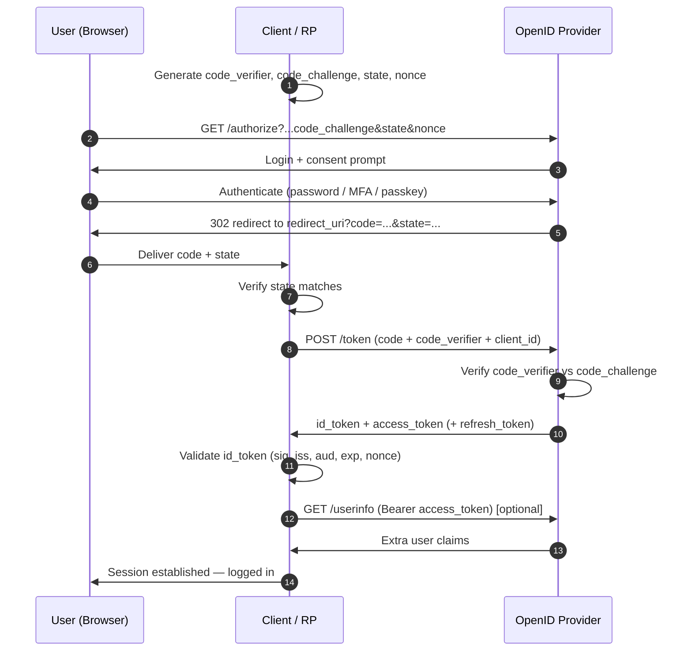

## OpenID Connect (OIDC)—A Practical Wiki

> One sentence: OIDC is a thin identity layer bolted on top of OAuth 2.0 that lets an application _prove who a user is_ by handing it a signed, verifiable ID Token.

---

### 1. The Core Mental Model (Read This fIrst)

Hold these three ideas in your head and the rest is detail:

1. OAuth 2.0 answers _"is this app allowed to do X?"_ (authorisation).
2. OIDC answers _"who is this user?"_ (authentication).
3. OIDC's entire contribution is one new artefact: the ID Token—a JWT that says "this user logged in, here is who they are, and I (a trusted provider) have signed it so you can verify it without phoning me."

Everything else—endpoints, flows, scopes—is plumbing to get that ID Token into your app _safely_.

---

### 2. The "Why"—What Problem Does OIDC Solve?

Before OIDC, "Login with Google/Facebook" was built on raw OAuth 2.0, which was the wrong tool:

- OAuth 2.0 was designed for delegated access ("let this photo-printing app read my Google Photos"). It says nothing about _identity_.
- Developers abused the access token as a proxy for identity ("if I can call the API, the user must be logged in"). This is insecure—access tokens are not audience-bound to your app and can be replayed (the classic "confused deputy" problem).
- Every provider invented its own incompatible way to fetch user info.

OIDC standardised the identity layer, so:

- There is a purpose-built token for identity (the ID Token) that is _audience-bound to your specific app_.
- There is a standard, discoverable set of endpoints and claims, so switching from Google to Okta to Keycloak is mostly a config change, not a rewrite.
- It is JSON/JWT/REST-based, so it works cleanly on mobile, SPAs, and APIs (unlike the older, XML-heavy SAML).

---

### 3. OAuth 2.0 Vs OIDC—The Distinction That Matters Most

| Aspect | OAuth 2.0 | OpenID Connect (OIDC) |
|---|---|---|
| Purpose | Authorisation (delegated _access_) | Authentication (_identity_) |
| Question answered | "Can this app access resource X?" | "Who is the user, and did they just log in?" |
| Key token | Access Token | ID Token (plus an Access Token) |
| ID Token format | n/a | Always a JWT |
| Access Token format | Opaque string _or_ JWT (provider's choice) | Same |
| User info | Not standardised | Standard claims + a `/userinfo` endpoint |
| Trigger | (always on) | Add the `openid` scope to an OAuth request |

> The litmus test: if you only have an access token and no ID token, you are doing OAuth, not OIDC. You can call an API, but you have _not_ authenticated a user in the OIDC sense.

---

### 4. The Cast—Roles & Terminology

| Term | Also called | What it is | Real-world example |
|---|---|---|---|
| End User | Resource Owner | The human logging in | You |
| Relying Party (RP) | Client | The app that wants to know who the user is | Your web app, ArgoCD, the K8s API server |
| OpenID Provider (OP) | Identity Provider (IdP) | The service that authenticates the user and issues tokens | Google, Microsoft Entra ID, Okta, Auth0, Keycloak |

Two more you'll see constantly:

- `client_id`—public identifier for your app, registered with the OP.
- `client_secret`—confidential password for your app (only confidential clients like server-side apps have one; SPAs and mobile apps are public clients and do _not_).

---

### 5. The Three Tokens

This trips people up. There are (up to) three tokens, with different jobs and different consumers.

| Token | Job | Who consumes it | Format | Lifetime |
|---|---|---|---|---|
| ID Token | Proves _who the user is_ | Your app (the client) | JWT (always) | Short |
| Access Token | Grants _access to APIs/resources_ | The resource/API server | Opaque or JWT | Short (minutes–hours) |
| Refresh Token | Gets new access tokens silently | The token endpoint | Opaque (usually) | Long (with rotation) |

> The single most common mistake: sending the ID Token to your API as a bearer credential. Don't. The ID Token is for _your client_ to learn who logged in. Use the Access Token to call APIs. Mixing them up creates audience-confusion vulnerabilities.

---

### 6. Anatomy of an ID Token (A JWT)

A JWT is three base64url-encoded parts joined by dots:

```
eyJhbGci...header.eyJpc3Mi...payload.SflKxw...signature
   │                  │                    │
 Header             Payload            Signature
```

#### 6.1 Header

Describes how the token is signed and which key to use.

```json
{
  "alg": "RS256",      // signing algorithm (RSA + SHA-256)
  "typ": "JWT",
  "kid": "a1b2c3"      // Key ID — tells you which public key verifies this
}
```

#### 6.2 Payload (The cLaims)

The actual statements about the user and the login event.

```json
{
  "iss": "https://idp.example.com",   // Issuer — who minted this token
  "sub": "248289761001",              // Subject — STABLE unique user ID
  "aud": "s6BhdRkqt3",                // Audience — YOUR client_id
  "exp": 1718000000,                  // Expiry (epoch seconds)
  "iat": 1717996400,                  // Issued-at
  "nonce": "n-0S6_WzA2Mj",            // Binds token to YOUR login request
  "auth_time": 1717996400,            // When the user actually authenticated
  "email": "leon@example.com",
  "email_verified": true,
  "name": "Leon"
}
```

The claims that carry the most weight:

- `sub` is the user's permanent ID _for that provider_. Key your user records on `iss` + `sub`, never on `email` (emails change and get reassigned).
- `aud` must equal _your_ `client_id`. If it doesn't, the token wasn't meant for you—reject it.
- `nonce` is a value _you_ generated and sent in the login request; it must come back unchanged. This stops replay attacks.

#### 6.3 Signature

The OP signs the header+payload with its private key. You verify it with the OP's public key (fetched from its JWKS endpoint—see §11). This is what lets you trust the token _offline_, without calling the OP back.

> Crucial: base64 is encoding, not encryption. Anyone can read a JWT's contents (paste one into a decoder to see). The signature provides _integrity and authenticity_, not secrecy. Never put secrets in a JWT.

---

### 7. Scopes & Claims

Scopes are what your app _requests_; claims are the individual facts you get back.

| Scope | Triggers / returns |
|---|---|
| `openid` | MANDATORY—this is what turns an OAuth request into OIDC and produces an ID Token |
| `profile` | `name`, `family_name`, `given_name`, `picture`, `locale`, … |
| `email` | `email`, `email_verified` |
| `address` | `address` |
| `phone` | `phone_number`, `phone_number_verified` |
| `offline_access` | Asks for a refresh token |

> If you forget `openid`, you get no ID Token and you're back to plain OAuth.

---

### 8. The Endpoints

OIDC standardises these. You rarely hard-code them—you fetch them from discovery (§11).

| Endpoint | Purpose |
|---|---|
| `authorization_endpoint` | Where you send the user's browser to log in |
| `token_endpoint` | Where your app swaps the code for tokens (back-channel) |
| `userinfo_endpoint` | Call with an access token to get extra user claims |
| `jwks_uri` | The OP's public keys—used to verify token signatures |
| `end_session_endpoint` | Logout / RP-initiated session termination |
| `introspection_endpoint` | Ask the OP whether an (opaque) token is still valid |
| `revocation_endpoint` | Revoke a token |

---

### 9. The Flows

A "flow" (or "grant type") is the choreography for getting tokens. There are several, but in 2026 there is one you should use for interactive login: the Authorization Code Flow with PKCE.

#### 9.1 Authorization Code Flow + PKCE—THE One to Use

Use this for everything with a user login: server apps, SPAs, mobile, CLIs. PKCE (pronounced "pixy", _Proof Key for Code Exchange_) protects against the authorisation code being stolen in transit.

##### Step-by-step

1. Client prepares PKCE. Generate a random `code_verifier`; derive `code_challenge = base64url(SHA256(code_verifier))`. Also generate a random `state` (CSRF protection) and `nonce` (replay protection).
2. Redirect the browser to the `authorization_endpoint`.
3. User authenticates at the OP (password, MFA, passkey, existing session…) and consents.
4. OP redirects back to your `redirect_uri` with a short-lived `code` and your `state`.
5. Client verifies `state` matches what it sent (reject if not).
6. Client POSTs to the `token_endpoint` (server-to-server "back channel"), sending the `code` _and_ the original `code_verifier`.
7. OP validates the `code_verifier` against the earlier `code_challenge`, then returns the tokens.
8. Client validates the ID Token (see §10) and establishes the user's session.
9. _(Optional)_ Client calls `/userinfo` with the access token for any extra claims.

##### The Sequence Diagram



##### Example: the Authorisation Request (Step 2)

```http
GET /authorize?
    response_type=code
    &client_id=s6BhdRkqt3
    &redirect_uri=https://app.example.com/callback
    &scope=openid%20profile%20email
    &state=af0ifjsldkj
    &nonce=n-0S6_WzA2Mj
    &code_challenge=E9Melhoa2OwvFrEMTJguCHaoeK1t8URWbuGJSstw-cM
    &code_challenge_method=S256 HTTP/1.1
Host: idp.example.com
```

##### Example: the Redirect back (Step 4)

```http
HTTP/1.1 302 Found
Location: https://app.example.com/callback?
    code=SplxlOBeZQQYbYS6WxSbIA
    &state=af0ifjsldkj
```

##### Example: the Token exchange (Step 6)

```http
POST /token HTTP/1.1
Host: idp.example.com
Content-Type: application/x-www-form-urlencoded

grant_type=authorization_code
&code=SplxlOBeZQQYbYS6WxSbIA
&redirect_uri=https://app.example.com/callback
&client_id=s6BhdRkqt3
&code_verifier=dBjftJeZ4CVP-mB92K27uhbUJU1p1r_wW1gFWFOEjXk
```

_(A confidential server app also sends `client_secret`; a public SPA/mobile app relies on PKCE instead.)_

##### Example: the Token Response (Step 7)

```json
{
  "token_type": "Bearer",
  "expires_in": 3600,
  "access_token": "SlAV32hkKG...",
  "id_token": "eyJhbGciOiJSUzI1NiIsImtpZCI6ImExYjJjMyJ9.eyJpc3Mi...",
  "refresh_token": "8xLOxBtZp8"
}
```

##### Example: Calling /userinfo (Step 9)

```http
GET /userinfo HTTP/1.1
Host: idp.example.com
Authorization: Bearer SlAV32hkKG...
```

```json
{ "sub": "248289761001", "name": "Leon", "email": "leon@example.com", "email_verified": true }
```

#### 9.2 The other Flows (Know They Exist; Mostly Don't Use tHem)

| Flow | Use case | Verdict |
|---|---|---|
| Authorization Code + PKCE | Any interactive user login | ✅ Use this |
| Implicit Flow | (Historically SPAs—tokens returned straight in the URL fragment) | ❌ Deprecated/insecure. Tokens leak via browser history, referrers, logs |
| Hybrid Flow (`response_type=code id_token`) | Niche; get an ID token from `/authorize` _and_ a code | ⚠️ Rare; only if a framework demands it |
| Client Credentials | Machine-to-machine, no user | ✅ For service-to-service—but it's pure OAuth, not user authentication |
| Device Authorization Flow | Devices with no keyboard (TVs, CLIs)—you enter a code on your phone | ✅ For input-constrained devices |
| Resource Owner Password (ROPC) | App collects the user's password directly | ❌ Avoid—defeats the point of delegated login |

---

### 10. Validating an ID Token—The Security-Critical Checklist

You must validate every ID Token before trusting it. Skipping this is the single biggest OIDC security failure. A library should do this for you, but you must understand it:

1. Signature—verify using the OP's public key, selected by the token's `kid`, fetched from `jwks_uri`.
2. `iss`—exactly matches the issuer you expect.
3. `aud`—contains _your_ `client_id`. (If multiple audiences, also check `azp` = your client.)
4. `exp`—token is not expired (allow small clock skew, e.g. 60s).
5. `iat`—issued-at is sane (not absurdly old/future).
6. `nonce`—exactly matches the `nonce` you sent in the login request.
7. `alg`—matches what you expect (e.g. `RS256`). Reject `alg: none`. This blocks the classic "algorithm confusion" attack.

> Validate `state` (CSRF) at the redirect step, and `nonce` (replay) at the token-validation step. They are different defences solving different problems—you need both.

---

### 11. Discovery & JWKS in Practice

#### 11.1 Discovery Document

Every compliant OP publishes a machine-readable config at a well-known URL. This is the first thing to look at for any provider.

```
https://idp.example.com/.well-known/openid-configuration
```

```json
{
  "issuer": "https://idp.example.com",
  "authorization_endpoint": "https://idp.example.com/authorize",
  "token_endpoint": "https://idp.example.com/token",
  "userinfo_endpoint": "https://idp.example.com/userinfo",
  "jwks_uri": "https://idp.example.com/.well-known/jwks.json",
  "end_session_endpoint": "https://idp.example.com/logout",
  "response_types_supported": ["code", "id_token", "code id_token"],
  "scopes_supported": ["openid", "profile", "email", "offline_access"],
  "id_token_signing_alg_values_supported": ["RS256"]
}
```

#### 11.2 JWKS (JSON Web Key Set)

The OP's public keys, used to verify ID Token signatures. The token's `kid` tells you which key to use. OPs rotate keys, so cache with a TTL and re-fetch on an unknown `kid`—never hard-code a key.

```json
{
  "keys": [
    {
      "kty": "RSA",
      "use": "sig",
      "kid": "a1b2c3",
      "alg": "RS256",
      "n": "0vx7agoebGcQSuu...",   // RSA modulus
      "e": "AQAB"                    // RSA exponent
    }
  ]
}
```

---

### 12. Logout & Session Management

Logging out is harder than logging in, because there are two sessions:

- The local session in your app (cookie/JWT)—you control this.
- The session at the OP—shared across every app using that IdP.

RP-initiated logout: redirect the user to the `end_session_endpoint`, optionally with `id_token_hint` and a `post_logout_redirect_uri`, so the OP can end its session and bounce them back.

> Clearing only your app's cookie is _not_ a full logout—the OP will silently log the user straight back in on next visit (the SSO session is still alive).

---

### 13. Security—Do's And Don'ts

Do

- ✅ Use Authorization Code + PKCE for all interactive logins.
- ✅ Always validate `state` and `nonce`.
- ✅ Fully validate the ID Token (§10)—prefer a vetted library over hand-rolling.
- ✅ HTTPS everywhere; register exact `redirect_uri`s (no wildcards).
- ✅ Keep access tokens short-lived; use refresh token rotation.
- ✅ For SPAs, prefer a Backend-for-Frontend (BFF) pattern: tokens live server-side in an httpOnly cookie, never in JS.

Don't

- ❌ Store tokens in `localStorage`/`sessionStorage`—readable by any XSS.
- ❌ Use the Implicit or ROPC flows.
- ❌ Send the ID Token to APIs (use the access token).
- ❌ Trust an ID Token whose `aud` isn't you.
- ❌ Accept `alg: none` or let the token dictate the algorithm.
- ❌ Key your users on `email` (use `iss` + `sub`).

---

### 14. Where You'll Meet OIDC in the Wild

Given your infra work, you've almost certainly stood next to OIDC without naming it:

- Kubernetes API server—can authenticate `kubectl` users via OIDC (`--oidc-issuer-url`, `--oidc-client-id`); your IdP groups map to RBAC.
- ArgoCD—its SSO is OIDC; "Login via SSO" hands you off to your IdP and reads groups from the ID Token.
- Cloud workload identity—federating CI/CD (e.g. GitHub Actions) into Azure/AWS/GCP uses OIDC tokens instead of long-lived secrets. This is exactly the "credentials never leave / no static secrets" principle you've been applying with Terraform agents.
- `kubelogin`, Grafana, Vault, internal dashboards—all commonly OIDC-fronted.

The common thread: OIDC replaces static, long-lived credentials with short-lived, signed, verifiable identity tokens from a central provider.

---

### 15. Glossary (Quick rEference)

| Term | Meaning |
|---|---|
| OP / IdP | OpenID Provider—issues tokens (Google, Okta, Keycloak) |
| RP / Client | Relying Party—your app |
| ID Token | Signed JWT proving who the user is (for the client) |
| Access Token | Credential to call APIs (for the resource server) |
| Refresh Token | Used to obtain new access tokens silently |
| JWT | JSON Web Token—`header.payload.signature`, base64url |
| JWKS | JSON Web Key Set—the OP's public verification keys |
| PKCE | Proof Key for Code Exchange—protects the auth code |
| `state` | Random value defending against CSRF |
| `nonce` | Random value defending against token replay |
| Discovery | `/.well-known/openid-configuration` config document |
| `sub` | Subject—the stable unique user ID |
| `aud` | Audience—must be your `client_id` |
| `iss` | Issuer—the OP that minted the token |

---

### 16. Next Actions (Start hEre)

The fastest way to make this concrete is to _look at a real provider's machinery_, which is one JSON blob away:

1. Right now (2 min): open a real discovery document in your browser and read it against §11—
   `https://accounts.google.com/.well-known/openid-configuration`
   Find the `authorization_endpoint`, `token_endpoint`, and `jwks_uri`. That's the whole map.
2. Next (5 min): grab any JWT you have lying around (a `kubectl` token, an ArgoCD session, anything) and paste it into a JWT decoder. Identify its `iss`, `sub`, `aud`, and `exp`. You'll _see_ §6 in the wild.
3. Then (when you want to build): pick your stack's vetted OIDC library (don't hand-roll validation) and wire up the Authorization Code + PKCE flow from §9.1.

> Step 1 is the entire activation energy. Open the Google discovery URL and read the JSON—everything in this wiki will click into place once you see the real endpoints staring back at you.
