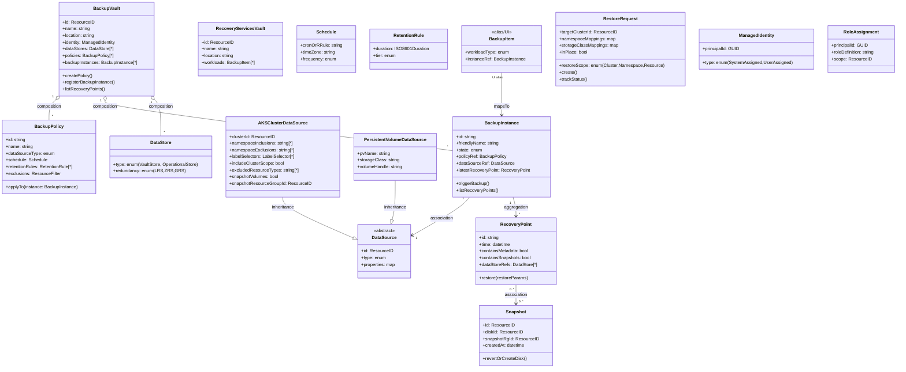
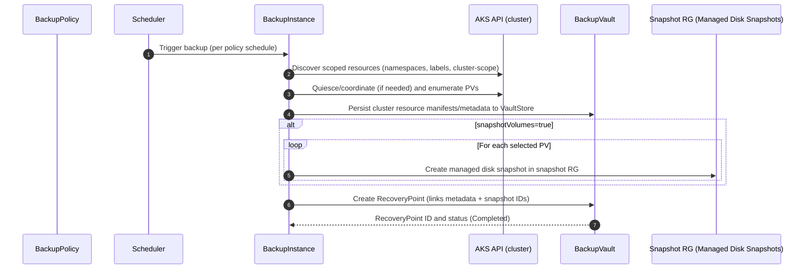
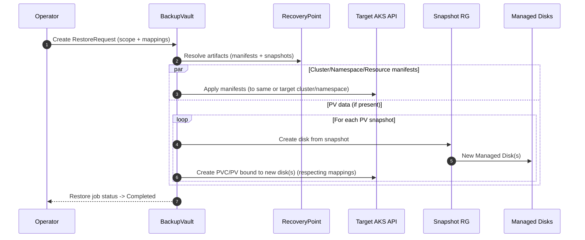

Below is a conceptual model of Azure Backup’s components, relationships, and data flow for AKS, expressed with object-oriented design concepts. It’s general enough for typical AKS scenarios and can be mapped to your production setup.

---

## 0) Two “Vault” Flavors at a Glance

- Recovery Services Vault (RSV): Legacy/VM-centric workloads (Azure VMs, SAP HANA, etc.)
- Backup Vault (Data Protection): Modern “Microsoft.DataProtection/backupVaults”. AKS uses this.

In this model, “BackupVault” refers to the Data Protection vault, while “RecoveryServicesVault” is noted for completeness.

---

## 1) Component Hierarchy (OOP Classes)



Notes:

- BackupInstance is the canonical resource in Data Protection. “Backup Item” is often the UI term; for Data Protection it maps to BackupInstance.
- RecoveryPoint contains cluster metadata and may reference PV snapshots.

---

## 2) Relationships and Dependencies (OOP Terms)

- BackupVault composes:
  - DataStores (VaultStore for metadata, optionally OperationalStore semantics)
  - BackupPolicies (1-to-many)
  - BackupInstances (1-to-many)
- BackupInstance associates exactly one DataSource and one BackupPolicy.
- BackupInstance aggregates many RecoveryPoints over time (1-to-many).
- RecoveryPoint may reference many Snapshots (0..n), created for each protected PV.
- AKSClusterDataSource inherits DataSource, adding K8s-specific selection logic (namespaces, labels, resource filters).
- RoleAssignment associates ManagedIdentity principals to Azure scopes (vault, snapshot RG, disks).

---

## 3) Component Responsibilities (Purpose, Key Properties, Operations)

### BackupVault (Microsoft.DataProtection/backupVaults)

- Purpose: Control plane and storage boundary for backup metadata and orchestration.
- Key properties: id, location, identity (MSI), dataStores (VaultStore type/redundancy), soft delete, immutability settings.
- Operations: createPolicy, registerBackupInstance, list jobs and recovery points.

### BackupPolicy

- Purpose: Declarative schedule + retention + inclusion/exclusion rules.
- Key properties: dataSourceType (e.g., Microsoft.ContainerService/managedClusters), schedule (RRule), retention rules, resource filters.
- Operations: applyTo(instance), update schedule/retention.

### DataSource (abstract)

- Purpose: The protected workload identity.
- Specializations:
  - AKSClusterDataSource
    - Properties: clusterId, namespaceInclusions/exclusions, labelSelectors, includeClusterScope, excludedResourceTypes (e.g., secrets), snapshotVolumes (bool), snapshotResourceGroupId.
- Operations: validate selection, resolve discovered entities (namespaces, PVs).

### BackupInstance

- Purpose: The binding of a policy to a specific data source within a vault.
- Key properties: state, policyRef, dataSourceRef, latestRecoveryPoint.
- Operations: triggerBackup, suspend/resume protection, listRecoveryPoints.

### RecoveryPoint

- Purpose: Point-in-time artifact for restore.
- Key properties: time, metadata presence, snapshot references, consistency status.
- Operations: restore with params (scope, remapping, in-place vs alternate).

### Snapshot (managed Disk Snapshot per PV)

- Purpose: Volume-level crash-consistent data for PVs.
- Key properties: snapshot id, disk id, snapshot RG, createdAt.
- Operations: createDiskFromSnapshot, delete.

### DataStore

- Purpose: Logical store type for backed-up data.
- Types:
  - VaultStore: Backup metadata and possibly resource manifests.
  - OperationalStore: Underlying snapshot location semantics (for AKS this maps to Azure Managed Disk snapshots living in a snapshot resource group you specify).
- Properties: redundancy (LRS/ZRS), immutability (if applicable).

### RestoreRequest

- Purpose: Asynchronous restore task definition.
- Key properties: targetClusterId, restoreScope (cluster/namespace/resource), namespace mappings, storage class mappings, inPlace flag.
- Operations: create, cancel, trackStatus.

### ManagedIdentity and RoleAssignment

- Purpose: Authorization model.
- Common roles for AKS backups:
  - On snapshot RG: Disk Snapshot Contributor, Data Operator for Managed Disks, Reader (for vault MSI).
  - On AKS: access via AKS backup extension and service interactions; explicit vault role for cluster MSI may be optional depending on service design, but often “Backup Contributor” is used.

---

## 4) Data Flow

### A) Backup Operation (AKS)



Key outcomes:

- Cluster manifests and selection metadata go to VaultStore.
- PV data is captured as managed disk snapshots in the specified snapshot resource group.
- A RecoveryPoint ties them together.

### B) Restore Operation (AKS)



Restore types:

- In-place restore to same cluster/namespace (overwriting) or to new namespaces.
- Cross-cluster restore supported if identity/permissions exist.
- StorageClass/namespace remapping supported.

---

## 5) AKS-Specific Context and Behaviors

- Selection model:
  - Include/Exclude namespaces, labelSelectors, includeClusterScope (cluster roles, CRDs, etc.).
  - Excluded resource types often include “secrets” for security, and certain CSI snapshot controller resources.
- PV snapshots:
  - snapshotVolumes=true instructs Azure Backup to orchestrate CSI-compatible snapshots of managed disks.
  - Snapshots live in a customer-chosen resource group (the “snapshot RG”).
- Recovery points:
  - Typically contain K8s manifests (deployments, services, CRDs) and references to PV snapshots.
- Identify/Permissions required:
  - Vault’s managed identity needs roles on the snapshot RG:
    - Disk Snapshot Contributor
    - Data Operator for Managed Disks
    - Reader
  - Cluster-side extension and service plane handle K8s API access; explicit cluster MSI role on the vault may not always show up but adding “Backup Contributor” is a safe/explicit practice, especially for IaC reproducibility.
- What’s not backed up by default:
  - Kubernetes Secrets (commonly excluded); manage via Key Vault or other secret stores.
  - Ephemeral/emptyDir volumes, dynamic content not backed by disks.
- Operational considerations:
  - All-namespaces strategy increases coverage and cost; selective strategy lowers cost, reduces recovery breadth.
  - Backup windows are short because cluster manifests are light; PV-heavy clusters see longer snapshot phases.

---

## 6) Mapping This Model to Your Production Example

From your investigation (prod-1):

- BackupVault
  - Name: aksbackupvault (uksouth), MSI principal: ed69f0a8-...
  - DataStore: VaultStore (LRS), Soft Delete: On
- BackupPolicy
  - Name: dailyaksbackups, Type: Microsoft.ContainerService/managedClusters
  - Schedule: daily 21:00 UTC, Retention: 14 days
- BackupInstance
  - Name: prod1aksdaily, State: ProtectionConfigured, Cluster: fitfile-cloud-prod-1-aks-cluster
  - AKSClusterDataSource:
    - namespaceInclusions: [] (empty => all namespaces)
    - excludedResourceTypes: [secrets, volumesnapshotcontent.snapshot.storage.k8s.io]
    - includeClusterScope: true
    - snapshotVolumes: true
    - snapshotResourceGroupId: prod-1-snapshot-rg
- RecoveryPoints
  - Daily points with ~10–12 min durations; PV snapshots stored in the snapshot RG.
- RoleAssignments
  - Vault MSI has roles on snapshot RG (Reader, Disk Snapshot Contributor, Data Operator for Managed Disks).
  - AKS MSI has no explicit role on the vault (unusual but currently functional).

This maps 1:1 to the class model above.

---

## 7) Component Summaries (Quick Tables)

### BackupVault Vs BackupPolicy Vs BackupInstance

|Component|Scope|Cardinality|Stores/References|
|---|---|---|---|
|BackupVault|Subscription/RG|1 vault -> many policies, many instances|Policies, Instances, DataStore config|
|BackupPolicy|Vault|1 policy -> many instances (same type)|Schedule, retention, filters|
|BackupInstance|Vault+DataSource|1 instance -> 1 data source, many RPs|Data source ref, policy ref, state|
|RecoveryPoint|Instance|Many per instance|Metadata + PV snapshot refs|

### AKSClusterDataSource (Key Attributes)

|Attribute|Meaning|
|---|---|
|namespaceInclusions|[] means “all namespaces”|
|namespaceExclusions|Namespaces to skip|
|labelSelectors|Key/value expressions to include resources|
|includeClusterScope|Include cluster-wide objects (CRDs, roles, etc.)|
|excludedResourceTypes|e.g., secrets|
|snapshotVolumes|If true, snapshot PVs|
|snapshotResourceGroupId|RG for managed disk snapshots|

---

## 8) How to Think About “Backup Item” Vs “Backup Instance”

- In Data Protection (AKS), “Backup Instance” is the underlying ARM resource.
- Azure Backup Center may surface these as “Backup Items” for a consistent UI across vault types.
- For modeling, treat BackupItem as a UI alias pointing to the real BackupInstance.

---

## 9) Practical Design Tips (Terraform/IaC)

- Always model:
  - Vault
  - Policy per data source type (AKS policy)
  - Instance per cluster (and per selection scope if you split protection)
  - Snapshot RG with required role assignments to the vault MSI
- Be explicit with:
  - Namespace strategy (all vs selective)
  - Excluded resource types (secrets, snapshot controller internals)
  - includeClusterScope and snapshotVolumes
- IAM:
  - Even if AKS MSI currently works without a vault role, codify “Backup Contributor” on the vault to avoid drift during re-provisioning.
- Cost:
  - All-namespaces + snapshotVolumes = more snapshots. Monitor snapshot RG growth.

---

## 10) What Details From Your Report Would Let Me Tailor Further

Provide or confirm:

- Full AKS selection config:
  - namespaceInclusions/Exclusions, labelSelectors
  - includeClusterScope, excludedResourceTypes
  - snapshotVolumes flag and snapshot resource group
- Policy details:
  - Schedule (RRule), retention tiers (daily/weekly/monthly)
- Vault data stores:
  - Redundancy (LRS/ZRS), immutability/soft delete settings
- IAM:
  - Role assignments for vault MSI on snapshot RG(s)
  - Any subscriptionor RG-level roles that might explain “implicit” permissions
- Restore preferences:
  - In-place vs alternate cluster, namespace/storage class mappings

With these, I can validate edge cases (e.g., CRD-heavy clusters, cross-cluster restores), and provide targeted Terraform snippets and guardrails.

---

## 11) Minimal Pseudo-Interfaces (For Engineers)

```typescript
interface IBackupVault {
  id: string; name: string; location: string; identity: ManagedIdentity;
  dataStores: DataStore[];
  createPolicy(p: BackupPolicy): void;
  registerInstance(i: BackupInstance): void;
  listRecoveryPoints(instanceId: string): RecoveryPoint[];
}

interface IBackupInstance {
  id: string; dataSource: DataSource; policy: BackupPolicy; state: 'Configured'|'Paused'|'Error';
  triggerBackup(): Promise<RecoveryPoint>;
  listRecoveryPoints(): RecoveryPoint[];
}

interface IAKSClusterDataSource extends DataSource {
  namespacesInclude: string[];
  namespacesExclude: string[];
  labelSelectors: {key:string, op?:'In'|'Eq', values?:string[]}[];
  includeClusterScope: boolean;
  excludedResourceTypes: string[];
  snapshotVolumes: boolean;
  snapshotResourceGroupId: string;
}

interface IRecoveryPoint {
  id: string; time: Date; hasSnapshots: boolean; snapshotIds: string[];
  restore(params: RestoreRequest): Promise<RestoreJob>;
}
```

---

If you share the specific selection rules, retention tiers, and IAM snapshots from your report, I can validate your configuration against best practices and produce Terraform-ready class-to-resource mappings tailored to prod-1.

## Kubernetes Backup Strategy for FITFILE Platform (Azure + AWS)

This guide designs a practical, label-driven backup strategy that works consistently across Azure and AWS, minimizes manual configuration, and integrates with Terraform and ArgoCD/Helm.

Contents:

- Data classification matrix
- Standard label/annotation schema
- YAML examples
- Tool integration (Azure Backup, AWS Backup, Velero)
- Implementation recommendations

---

### 1) Data Classification Matrix

The matrix below classifies common Kubernetes/platform data and recommends how to protect it in Azure and AWS. Use it to decide what you back up with cluster tools vs external services.

|Data Category|Examples|Source of Truth|Recommended Protection|Azure Approach|AWS Approach|Notes|
|---|---|---|---|---|---|---|
|IaC / Infra|VNET/VPC, AKS/EKS, storage accounts/buckets|Terraform + Git|Versioned IaC|Terraform state protected (remote backend + versioning)|Terraform state protected (S3 + DynamoDB lock + versioning)|Do not “backup” IaC via K8s backups.|
|Kubernetes Manifests (stateless workloads)|Deployments, Services, HPAs|Git (Helm/ArgoCD)|Recreate from Git; optional metadata backup|Optional: include in AKS backup or Velero for faster DR|Optional: include in AWS Backup for EKS or Velero|Label as bronze (low priority).|
|Cluster-scoped K8s objects|CRDs, ClusterRoles, StorageClasses|Git (operators/charts)|Recreate from Git; optionally back up|Include via vault/Velero to speed cluster rebuild|Include via AWS Backup or Velero|Useful when many CRDs/operators installed.|
|Config (ConfigMaps)|App config, feature flags|Git for most; some runtime-generated|Recreate from Git; selective backup for runtime-generated|Include selected ConfigMaps|Include selected ConfigMaps|Label only the non-recreatable ones as backup-enabled.|
|Secrets|API keys, DB creds, TLS|External secret stores; some in-cluster|Prefer external secret stores; avoid backing up|Use Azure Key Vault + External Secrets; exclude Secrets from AKS backup|Use AWS Secrets Manager + ESO; exclude Secrets from AWS Backup|If any in-cluster Secrets must be backed up, isolate and label them explicitly and encrypt backup targets.|
|Persistent Volumes (PV) data|PVC-backed app data, uploads|Disks/CSI volumes|Snapshot-based backups; periodic logical backups where applicable|Azure Backup for AKS PV snapshots; or Velero CSI snapshots|AWS Backup for EKS/EBS snapshots; or Velero CSI snapshots|Label PVCs/stateful apps for inclusion; treat as gold/silver/bronze classes.|
|Databases (managed)|Azure DB for PostgreSQL, RDS, DynamoDB|Managed services|Use native service backups/PITR|Azure DB backups/PITR; Geo-redundant if needed|RDS PITR, snapshots; DynamoDB PITR|Do not rely on K8s backup for managed DB data.|
|Databases (in-cluster)|Postgres/MySQL in StatefulSets|PVs, operators|Dual strategy: disk snapshots + logical dumps|PV snapshots + scheduled dumps to Blob|PV snapshots + dumps to S3|Logical dumps protect against corruption; snapshots provide fast recovery.|
|Object storage used by apps|Azure Blob, S3|Buckets/containers|Versioning, lifecycle, replication|Blob versioning + immutability if needed|S3 versioning + replication|Not captured by K8s backups.|
|Message queues|Kafka (PV), SQS/EventHub|PVs or managed|Kafka: PV snapshots + app-level checkpoints|PV snapshots + Kafka tools|PV snapshots + Kafka tools|Consider recovery complexity and order.|
|Container images|ACR/ECR images|Registries|Registry retention + geo-replication|ACR retention rules|ECR lifecycle policies|Not via K8s backup.|
|Observability|Prometheus TSDB, logs|PVs, cloud logs|Usually reconstruct or snapshot PVs|PV snapshots or remote write|PV snapshots or remote write|Often not critical for DR; decide per need.|

Key principles:

- Prefer native backups for managed services (DBs, object storage).
- Use label-driven backups for K8s resources and PVs.
- Recreate from Git where possible; only back up what is not safely reproducible.

---

### 2) Standard Labeling and Annotation Strategy

Design goal: You adjust labels/annotations in Git (Helm values/manifests), and backup tools pick up changes automatically. No per-resource manual configuration in cloud consoles.

#### 2.1 Core Labels (shared across Azure, AWS, Velero)

Use a dedicated domain to avoid collisions: `fitfile.io/*`

- fitfile.io/backup-enabled: "true" | "false"
  - Master switch for inclusion. Defaults to “false” for most stateless resources; “true” for PVs and stateful workloads.
- fitfile.io/backup-class: "gold" | "silver" | "bronze"
  - Maps to schedules/retention: e.g., gold = nightly + weekly + 30d, silver = nightly 14d, bronze = weekly 14d.
- fitfile.io/backup-scope: "data" | "app" | "cluster"
  - Optional hint: data = PV-focused; app = workload manifests; cluster = cluster-scoped resources.
- fitfile.io/backup-retain: ISO8601 duration (e.g., "P14D", "P30D")
  - Optional override for retention; tools may not consume it directly but useful for policies/validation.
- app.kubernetes.io/part-of
  - Reuse standard label to group related resources for selection.

Recommended minimal set to actually drive behavior:

- fitfile.io/backup-enabled
- fitfile.io/backup-class

#### 2.2 Helpful Annotations (tool-specific but Safe to add)

- velero.io/exclude-from-backup: "true"
  - Explicit exclusion for Velero when needed.
- backup.velero.io/backup-volumes: "vol1,vol2"
  - Include only specific volumes from a pod (Velero).
- fitfile.io/logical-backup: "true"
  - Signals a sidecar/cronjob performs logical dumps (e.g., pg_dump), not consumed by cloud tools but useful for policy.
- fitfile.io/restore-priority: "high|normal|low"
  - For runbooks/automation ordering.

Note on Secrets:

- Prefer excluding Secrets from cluster backups. If you must back them up, add a targeted label like fitfile.io/backup-secrets: "true" only on those that may be backed up, and limit access with RBAC/encryption.

#### 2.3 Where to Put Labels

- Namespaces: Apply backup-class and enabled defaults; tools can select whole namespaces via label.
- StatefulSets/Deployments: Label the controller to include manifests (app-level backup).
- PVCs: Label PVCs explicitly to ensure PV inclusion.
- Cluster-scoped (CRDs): Controlled via separate “cluster config” app; label the CRD objects if you plan to capture them.

---

### 3) Label-to-Tool Mapping

Use a small number of backup configurations per cluster/cloud that select resources by label. This reduces manual work to near-zero.

#### Azure Backup for AKS (Microsoft.DataProtection)

- Create 3 backup instances per cluster (gold/silver/bronze), each bound to a corresponding policy and label selector:
  - Label selector: fitfile.io/backup-enabled= true AND fitfile.io/backup-class= gold|silver|bronze
- Keep includeClusterScope true for at least one instance if you want cluster-scoped objects too.
- Exclude resource types: secrets; snapshotVolumes: true; specify snapshot resource group.
- Namespace strategy: prefer label selection over “all namespaces”; you can also set the labels on namespaces and selectors can include namespace labels (Azure supports labelSelectors across resources; ensure PVCs/StatefulSets carry labels).

Example selection logic to configure in Terraform (conceptual):

```sh
label_selectors = [
  { key = "fitfile.io/backup-enabled", operator = "In", values = ["true"] },
  { key = "fitfile.io/backup-class",   operator = "In", values = ["gold"] }
]
```

#### AWS Backup for EKS

- Create 3 backup plans (gold/silver/bronze).
- Create resource assignments for each plan selecting Kubernetes resources by labels:
  - Include: fitfile.io/backup-enabled=true AND fitfile.io/backup-class=gold|silver|bronze
- Ensure EBS snapshotting is enabled for PVCs (CSI and IAM roles set). AWS Backup for EKS can capture K8s manifests and EBS snapshots tied to those workloads.

Note: AWS Backup label selection supports arbitrary Kubernetes labels; stick to the same fitfile.io/* keys.

#### Velero (optional Cross-cloud layer)

- Install Velero with CSI plugins.
- Create 3 Schedules with label selectors aligned to the same labels:
  - gold: nightly + weekly retention
  - silver: nightly retention 14d
  - bronze: weekly 14d (manifests only)
- Use provider-specific snapshots or object-store for manifests. Configure Azure Blob/S3 per cluster.

Velero advantages:

- Uniform across clouds, restores to any cluster.
- Fine-grained annotations and exclude rules.
- Complements cloud-native backup (not necessarily a replacement).

---

### 4) Label/Annotation Examples (YAML)

#### 4.1 Namespace Defaults

```yaml
apiVersion: v1
kind: Namespace
metadata:
  name: fitfile-prod
  labels:
    fitfile.io/backup-enabled: "true"
    fitfile.io/backup-class: "silver"
    app.kubernetes.io/part-of: "fitfile"
```

#### 4.2 Stateful App with PV (gold)

```yaml
apiVersion: apps/v1
kind: StatefulSet
metadata:
  name: uploads
  namespace: fitfile-prod
  labels:
    fitfile.io/backup-enabled: "true"
    fitfile.io/backup-class: "gold"
    fitfile.io/backup-scope: "data"
    app.kubernetes.io/part-of: "fitfile"
spec:
  replicas: 3
  selector:
    matchLabels:
      app: uploads
  template:
    metadata:
      labels:
        app: uploads
        fitfile.io/backup-enabled: "true"   # inherited by pods; not strictly needed
        fitfile.io/backup-class: "gold"
    spec:
      containers:
      - name: app
        image: ghcr.io/fitfile/uploads:1.2.3
  volumeClaimTemplates:
  - metadata:
      name: data
      labels:
        fitfile.io/backup-enabled: "true"   # ensure PVC is selected
        fitfile.io/backup-class: "gold"
        app.kubernetes.io/part-of: "fitfile"
    spec:
      accessModes: ["ReadWriteOnce"]
      storageClassName: managed-premium
      resources:
        requests:
          storage: 200Gi
```

#### 4.3 Deployment (stateless, bronze)

```yaml
apiVersion: apps/v1
kind: Deployment
metadata:
  name: api
  namespace: fitfile-prod
  labels:
    fitfile.io/backup-enabled: "false"      # manifests from Git; no need to back up
    fitfile.io/backup-class: "bronze"
    app.kubernetes.io/part-of: "fitfile"
spec:
  replicas: 4
  selector:
    matchLabels: { app: api }
  template:
    metadata:
      labels: { app: api }
    spec:
      containers:
      - name: api
        image: ghcr.io/fitfile/api:4.5.6
```

#### 4.4 PVC Labeled Directly (if Created separately)

```yaml
apiVersion: v1
kind: PersistentVolumeClaim
metadata:
  name: reports-pvc
  namespace: fitfile-prod
  labels:
    fitfile.io/backup-enabled: "true"
    fitfile.io/backup-class: "silver"
spec:
  accessModes: ["ReadWriteOnce"]
  storageClassName: managed-premium
  resources:
    requests:
      storage: 100Gi
```

#### 4.5 ConfigMap (runtime-generated) Included

```yaml
apiVersion: v1
kind: ConfigMap
metadata:
  name: dynamic-config
  namespace: fitfile-prod
  labels:
    fitfile.io/backup-enabled: "true"
    fitfile.io/backup-class: "bronze"
data:
  featureX: "on"
```

#### 4.6 Secret Handling

Prefer not to back up Secrets; use secret managers. If some Secrets must be backed up (e.g., non-recreatable TLS), label narrowly and encrypt backups.

```yaml
apiVersion: v1
kind: Secret
metadata:
  name: legacy-tls
  namespace: fitfile-prod
  labels:
    fitfile.io/backup-enabled: "true"
    fitfile.io/backup-class: "gold"
  annotations:
    # If using Velero and you explicitly want to include this Secret:
    velero.io/exclude-from-backup: "false"
type: kubernetes.io/tls
data:
  tls.crt: ...
  tls.key: ...
```

---

### 5) Best Practices to Maintain Labelling

- Helm common labels:
  - Use Helm’s global/common labels so every charted resource gets base labels from values.yaml.
- Namespace defaults:
  - Define backup defaults at Namespace level; override only where needed.
- Enforce via policy:
  - Use Kyverno or OPA Gatekeeper to require fitfile.io/backup-enabled and fitfile.io/backup-class on PVCs and StatefulSets; auto-add defaults if missing.
- Review cadence:
  - Periodically list unlabeled PVCs/StatefulSets and alert (e.g., via a policy report).
- Keep it minimal:
  - Two labels drive most selection; avoid an explosion of keys.

Example Kyverno policy (auto-add defaults on PVCs):

```yaml
apiVersion: kyverno.io/v1
kind: ClusterPolicy
metadata:
  name: add-backup-labels-to-pvc
spec:
  rules:
  - name: default-backup-labels
    match:
      resources:
        kinds: ["PersistentVolumeClaim"]
    mutate:
      patchStrategicMerge:
        metadata:
          labels:
            +(fitfile.io/backup-enabled): "{{ request.object.metadata.labels.fitfile\\.io/backup-enabled || 'true' }}"
            +(fitfile.io/backup-class): "{{ request.object.metadata.labels.fitfile\\.io/backup-class || 'silver' }}"
```

---

### 6) Tool Integration Details

#### Azure Backup for AKS

- Create policies and instances per class:
  - gold: higher frequency/retention
  - silver: nightly P14D
  - bronze: weekly P14D (optionally include only manifests)
- Configure selection using label selectors:
  - Include resources with fitfile.io/backup-enabled=true and class-specific value.
- Exclusions:
  - Exclude secrets and CSI snapshot controller internals.
- PV snapshots:
  - Enable snapshotVolumes; grant the Backup Vault MSI roles on the snapshot RG (Disk Snapshot Contributor, Data Operator for Managed Disks, Reader).
- Cluster-scope:
  - Consider one instance with includeClusterScope=true and bronze class labels for CRDs/roles.

Alignment with your prod findings:

- You currently back up all namespaces. Switching to label-based selection will let you narrow scope without changing the backup instance frequently—just adjust labels in Git.

#### AWS Backup for EKS

- Create 3 backup plans (gold/silver/bronze) with schedules/retention to match Azure.
- Create resource assignments that select Kubernetes resources by label selectors:
  - fitfile.io/backup-enabled=true and fitfile.io/backup-class=…
- Ensure EKS cluster has AWS Backup integration and permissions to snapshot EBS volumes (IRSA, controllers).
- If excluding Secrets, configure selection to avoid them or maintain externalization policy.

#### Velero (optional but powerful)

- If you want cross-cloud uniformity and easier DR drills:
  - Install Velero with CSI plugins in each cluster.
  - Create Schedules with label selectors:
    - gold schedule runs nightly + weekly; includes snapshots.
    - silver nightly; includes snapshots.
    - bronze weekly; manifests only.
  - Use annotations like velero.io/exclude-from-backup where needed.
- Storage:
  - Azure: use Blob Storage; AWS: use S3. Enable bucket versioning and encryption.

---

### 7) Example: Policy Mapping (Gold/Silver/Bronze)

|Class|Target Workloads|Schedule|Retention|Includes|Notes|
|---|---|---|---|---|---|
|gold|Mission-critical PV data (databases, uploads)|Daily at 21:00 UTC + Weekly|30 days + 8 weeks|PV snapshots + manifests|Add logical DB dumps if in-cluster DBs.|
|silver|Important PV data, non-critical|Daily at 21:00 UTC|14 days|PV snapshots + manifests|Default class for PVCs via policy.|
|bronze|Manifests/cluster config only|Weekly|14 days|K8s objects (no PVs)|For rapid cluster rebuilds of CRDs/operators.|

Implementation in tools:

- Azure: create three policies + three instances per cluster, each with label selectors.
- AWS: three backup plans + assignments.
- Velero: three schedules with selectors.

---

### 8) Implementation Steps (Practical Plan)

1. Define and codify labels

- Document in an internal README:
  - fitfile.io/backup-enabled: true|false
  - fitfile.io/backup-class: gold|silver|bronze
- Add to Helm chart templates as common labels; provide values.yaml defaults per environment.

2. Enforce/Default

- Add Kyverno policies to default silver on PVCs and require explicit override for bronze/none.

3. Configure backup tools once per cluster

- Azure:
  - 3 policies + 3 backup instances using label selectors.
  - Exclude secrets; include cluster scope as per decision.
  - Ensure vault MSI roles on snapshot RG.
- AWS:
  - 3 backup plans + assignments using label selectors.
  - Ensure EBS snapshot permissions and CSI integration.

4. Databases

- Managed DBs: verify PITR settings, cross-region, and retention.
- In-cluster DBs: add CronJobs for logical dumps to object storage with server-side encryption and lifecycle.

5. Secrets

- Migrate to External Secrets Operator with Azure Key Vault / AWS Secrets Manager.
- Remove Secrets from cluster backups; only whitelist exceptional cases.

6. Tests and runbooks

- Quarterly restore drills: namespace-level and full app (PV + manifests).
- Validate RPO/RTO against gold/silver/bronze expectations.
- Monitor backup jobs and snapshot costs.

7. Terraform integration

- Codify Azure/AWS backup policies and label selectors in Terraform modules.
- Inputs: schedules, retention, label selector tuples.
- Outputs: vault/plan IDs; expose them for ops dashboards.

---

### 9) Quick Terraform Shape (Conceptual)

Azure (Data Protection backup instance with label selectors):

```hcl
module "aks_backup_gold" {
  source = "./modules/aks_backup_instance"
  name   = "gold"
  policy_name = "gold-policy"
  label_selectors = [
    { key = "fitfile.io/backup-enabled", operator = "In", values = ["true"] },
    { key = "fitfile.io/backup-class",   operator = "In", values = ["gold"] }
  ]
  include_cluster_scope = true
  excluded_resource_types = ["secrets", "volumesnapshotcontent.snapshot.storage.k8s.io"]
  snapshot_volumes = true
  snapshot_rg_id   = azurerm_resource_group.snapshots.id
}
```

AWS (Backup resource assignment pseudocode):

```hcl
module "eks_backup_gold" {
  source = "./modules/aws_backup_eks_plan"
  name   = "gold"
  schedule_cron = "cron(0 21 * * ? *)"
  retention_days = 30
  selection_label_match = {
    "fitfile.io/backup-enabled" = ["true"]
    "fitfile.io/backup-class"   = ["gold"]
  }
}
```

Velero (Schedule CR):

```yaml
apiVersion: velero.io/v1
kind: Schedule
metadata:
  name: gold-nightly
spec:
  schedule: "0 21 * * *"
  template:
    includedNamespaces: ["*"]
    labelSelector:
      matchLabels:
        fitfile.io/backup-enabled: "true"
        fitfile.io/backup-class: "gold"
    snapshotVolumes: true
    ttl: 720h # 30 days
```

---

### 10) Notes and Pitfalls

- Label propagation: PVCs created by StatefulSets need labels on volumeClaimTemplates; don’t rely only on StatefulSet metadata.
- Secrets: Avoid backing them up; ensure cloud backups exclude them to reduce risk.
- Cross-cloud parity: Schedules/retentions should match across Azure/AWS to simplify ops.
- Costs: PV snapshots can be significant. Use classes wisely; prune unneeded volumes.
- Restore testing: The only way to verify label-based selection covers everything you need.

## Azure Backup Investigation Report

**Date**: 2025-11-07
**Subscription**: 249df46b-f75d-4492-8e78-b33a00473548 (FITCloud Non-Production)
**Resource Group**: AzureBackupRG_uksouth_1

---

### Executive Summary

Backup infrastructure is **failing consistently** and **costing money** while protecting resources that **no longer exist**. Main issue: **permissions problem** failing for 2+ weeks.

---

### Critical Issues

#### 1. Failing AKS Backup - PRIMARY ISSUE

- **Backup Instance**: `Fitfile-cloud-test-aks-cluster\staging-aks-daily-everything`
- **Status**: ❌ Failing since **October 24, 2025**
- **Failure Rate**: 12 consecutive failures (100%)
- **Last Successful Backup**: **August 27, 2024** (2+ months ago)

**Root Cause**:

```sh
Error: UserErrorMissingVaultMSIReaderPermissionsOnCluster
Message: Backup Vault managed identity requires Reader role on the Kubernetes cluster
```

**The Problem**:

- Backup vault MSI (ID: `21ddeb8d-d52d-415e-83d1-8545d54638ee`) lacks Reader permissions on target AKS cluster
- **Resource group `Fitfile-cloud-test-rg` DOES NOT EXIST** - cluster has been deleted!

---

### Infrastructure Status

#### Backup Vault: `akstesttemp`

- Location: UK South
- Storage: Locally Redundant
- Security Score: **None** (Poor BCDR security)
- Soft Delete: Enabled (14 days)

#### Backup Instances (3 total)

1. **fitfile-cloud-test-aks-cluster** (test)

- Status: ❌ BackupsSuspended
- Policy: `akktestbackup` (every 4h, 7d retention)

2. **Fitfile-cloud-test-aks-cluster** (staging)

- Status: ❌ ProtectionConfigured but **FAILING**
- Policy: `nonproddailyeverything` (daily, 7d retention)
- **⚠️ THIS IS THE FAILING ONE**

3. **Fitfile-cloud-development-aks-cluster**

- Status: ❌ BackupsSuspended
- Policy: `aksdevelopmentpolicy` (daily, 14d retention)

#### VM Restore Point Collections (2)

- `sonarqube-ubuntu` - ✅ VM exists
- `sonarqube` (old VM) - May not exist

---

### Storage Costs

#### Snapshots: 93 Total

- All using **Standard ZRS** (Zone-Redundant Storage)
- Created: August 22-27, 2024
- **Last snapshot**: August 27, 2024
- Sizes: Mix of 8GB and 64GB disks
- ⚠️ **Snapshots are from defunct AKS cluster that no longer exists**

#### Current AKS Clusters (NOT Being Backed up)

- `fitfile-cloud-testing-aks-cluster` in `fitfile-cloud-testing-rg`
- `fitfile-cloud-staging-aks-cluster` in `fitfile-cloud-staging-rg`

---

### Permissions Analysis

Backup vault managed identity has:

- ✅ Data Operator for Managed Disks (on AzureBackupRG_uksouth_1)
- ✅ Disk Backup Reader (on AzureBackupRG_uksouth_1)
- ✅ Disk Snapshot Contributor (on AzureBackupRG_uksouth_1)
- ✅ Storage Blob Data Reader/Contributor (on tempakstest)
- ❌ **MISSING: Reader role on AKS cluster** - Causing all failures

---

### Cost Implications

**Paying for**:

1. Backup Vault - ongoing storage costs
2. 93 Snapshots using Zone-Redundant Storage
3. Storage Account (`tempakstest` - RAGRS)
4. Failed backup job attempts

**Getting**:

- ❌ No current backups (last success: Aug 27, 2024)
- ❌ Outdated recovery points
- ❌ No protection for current production AKS clusters

---

### Recommendations

#### Immediate Actions (High Priority)

1. **Decide backup strategy**:

- **Option A**: Delete all backup infrastructure if not needed
- **Option B**: Fix permissions and update to backup current clusters

2. **If keeping backups (Option B)**:

- Delete backup instance for non-existent cluster
- Update backup to target actual AKS clusters:
- `fitfile-cloud-staging-aks-cluster`
- `fitfile-cloud-testing-aks-cluster`
- Grant Reader role to backup vault MSI on new clusters

3. **Clean up orphaned resources**:

- Delete 93 snapshots from deleted cluster (💰 save significant)
- Remove restore point collections for non-existent VMs
- Review need for `tempakstest` storage account

#### Cost Optimization

- Switch from Zone-Redundant to Locally Redundant snapshots
- Review retention policies (7-14 days may be excessive for test environments)
- Downgrade storage account from RA-GRS if geo-redundancy not needed

#### Security Improvements

- Improve BCDR security score (currently "Poor")
- Consider enabling immutability for ransomware protection
- Enable Resource Guard protection

---

### Summary

Backup infrastructure that:

- ✅ Has correct permissions on backup resource group
- ❌ **Cannot access** the cluster it's trying to backup
- ❌ Is targeting a **deleted** AKS cluster
- ❌ Has been **failing for 2+ weeks**
- ❌ Is **NOT** backing up current production clusters

**Recommendation**: Clean up this infrastructure and start fresh with proper backups for current clusters, or remove entirely if backups aren't needed for test environments.
SUCCESS! All 93 Snapshots Deleted

Summary

Final snapshot count in AzureBackupRG_uksouth_1: 0

All 93 orphaned snapshots from the deleted fitfile-cloud-test-aks-cluster have been successfully removed!

What Was Done

1. ✅ Verified correct Azure subscription (FITCloud Non-Production)
2. ✅ Created deletion manifest: snapshot-ids-2025-11-07.txt (93 IDs)
3. ✅ Created audit trail: snapshot-audit-2025-11-07.tsv (full metadata)
4. ✅ Confirmed no resource locks blocking deletion
5. ✅ Deleted all 93 snapshots in parallel (8 concurrent operations)
6. ✅ Waited for all deletions to complete
7. ✅ Verified zero snapshots remaining

Cost Savings

- Eliminated: Zone-Redundant Storage (ZRS) costs for 93 snapshots
- Stopped: Ongoing storage charges for orphaned backup data from August 2024
- Billing: Cost savings will reflect in next billing cycle

Audit Files Preserved

Both files saved to your home directory for compliance:

- snapshot-ids-2025-11-07.txt (16K) - Resource IDs
- snapshot-audit-2025-11-07.tsv (25K) - Complete metadata

Next Steps Recommended

Based on your investigation report, you should consider:

1. Delete backup vault akstesttemp if no longer needed
2. Remove backup instances for the deleted clusters (3 instances)
3. Set up proper backups for current production clusters:
◦ fitfile-cloud-testing-aks-cluster
◦ fitfile-cloud-staging-aks-cluster
4. Review storage account tempakstest (RAGRS) - may no longer be needed

if I used velero optimally do I need azure backup? I want the more flexible and cheaper option

Velero is a powerful, flexible Kubernetes-native backup solution that can handle your cluster resource and persistent volume backups across both AWS and Azure, using cloud object storage (like Azure Blob Storage) without extra cost beyond the storage fees. When used optimally, Velero provides:

- Full Kubernetes cluster backup and restore capabilities including application configurations, namespaces, and persistent volumes through snapshots or file backups.
- Cross-cloud flexibility, allowing backups across AWS and Azure without being tied to Azure Backup services specifically.
- Scheduling, granular namespace/resource backup, and restore options, along with application-aware hooks.

Azure Backup is a managed service offering integrated backup for Azure VMs, disks, and other Azure resources with enterprise SLAs, incremental backups, and centralized policy management. It is more opinionated and tightly integrated into the Azure platform but often involves additional licensing or service costs.

## Comparing Velero vs. Azure Backup for Kubernetes on Azure

| Feature                     | Velero (Optimal Usage)                                  | Azure Backup                                         |
|-----------------------------|--------------------------------------------------------|-----------------------------------------------------|
| Flexibility                 | Highly flexible, cloud-agnostic, multi-cloud support   | Azure-centric, tied to Azure ecosystem               |
| Cost                        | Mainly cloud storage cost; open-source, no license fees| Additional service fees and licensing                 |
| Kubernetes Native           | Yes, designed specifically for Kubernetes backups      | Not Kubernetes-native; general VM and disk backup    |
| Persistence Layer Support   | Supports PVC snapshots & Restic file backups            | VM disk backup; limited Kubernetes PVC support       |
| Application-Aware Backup    | Supports pre/post hooks and application consistency     | Generally limited for Kubernetes apps                 |
| Restore Granularity         | Granular resource and namespace-level restores          | VM/disk level restore, less granular                  |
| Multi-Cloud Suitability     | Yes, can be used across AWS, Azure, GCP, on-prem        | No, Azure-only                                          |

## Recommendation

If your primary concern is Kubernetes workload backup flexibility, multi-cloud compatibility, and cost efficiency, **Velero used optimally is typically sufficient and more cost-effective** than Azure Backup for Kubernetes workloads.

However, if you want a fully managed, SLA-backed service tightly integrated with Azure, with less operational overhead but more cost, Azure Backup can complement workloads outside Kubernetes or other Azure resources.

Given your profile as a DevOps engineer comfortable with Kubernetes tooling and multi-cloud deployments, and prioritizing flexibility and cost, Velero is the better fit.

You can leverage Azure Blob Storage as Velero’s backup storage backend to avoid additional Azure Backup service costs.

In summary: **No, if Velero is architected and used optimally, you generally don’t need Azure Backup specifically for Kubernetes cluster backups**. Velero offers more Kubernetes-specific, flexible, and cheaper backup workflows in your multi-cloud setup [1][2][3].

Citations:

[1] How Velero Works <https://velero.io/docs/v1.5/how-velero-works/>

[2] Backup and restore your Amazon EKS cluster resources using Velero <https://aws.amazon.com/blogs/containers/backup-and-restore-your-amazon-eks-cluster-resources-using-velero/>

[3] How to Backup and Restore Kubernetes clusters using Velero <https://dev.to/devtron_inc/how-to-backup-and-restore-kubernetes-clusters-using-velero-4f6o>
