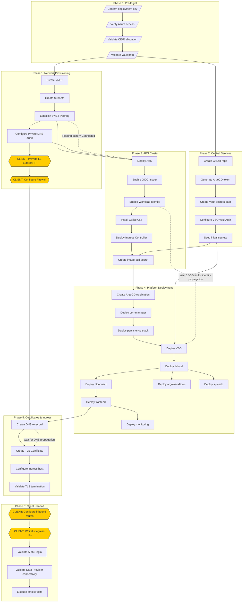

Based on your long-term memories, I've synthesized the deployment framework from your recent work across the FFNode chart analysis, DNS conventions, network architecture diagrams, and JIRA task ordering.

---

## Executive Summary

Your deployment follows a **six-phase pipeline** with hard dependencies between networking, Central Services, platform deployment, and client-side configuration. The primary friction points identified are:

1. **Vault-VSO credential propagation** (recently migrated to JWT/OIDC)
2. **VNET Peering establishment** before platform deployment
3. **DNS A-record propagation** before Ingress can route traffic
4. **Client-side inbound route configuration** (external dependency, often blocks)

---

## Phase 0: Pre-Flight Validation

| Step | Action | Prerequisite State | Verification Command |
|:-----|:-------|:-------------------|:---------------------|
| 0.1 | Confirm customer `deployment-key` assigned | Customer onboarding initiated | Check Terraform workspace exists |
| 0.2 | Verify Azure subscription access | Service Principal credentials in Vault | `az account show` via Jumpbox |
| 0.3 | Confirm CIDR allocation (non-overlapping) | Network planning complete | Cross-reference with `10.x.x.x/16` allocations |
| 0.4 | Validate Vault path structure | HCP Vault namespace exists | `vault kv list admin/central/{customer_id}` |

### ⚠️ Gotcha: CIDR Overlap

If the customer's on-premise network overlaps with your Azure VNET CIDR, VNET peering will **silently fail** to route traffic. Always request the customer's internal IP ranges during discovery.

---

## Phase 1: Network Provisioning

**Objective:** Establish the network fabric that the Kubernetes cluster will consume.

| Step | Action | Prerequisite State | Verification |
|:-----|:-------|:-------------------|:-------------|
| 1.1 | Create VNET via Terraform | CIDR confirmed (Phase 0.3) | `az network vnet show -n vnet-lca-{customer_id}-prd-01` |
| 1.2 | Create Subnets (System, Egress/Ingress, Jumpbox) | VNET created | Subnet count = 3 minimum |
| 1.3 | Establish VNET Peering to Central Services VNET | Both VNETs exist | Peering state = `Connected` |
| 1.4 | Configure Private DNS Zone | VNET created | Zone: `{customer_id}.internal` linked to VNET |
| 1.5 | **Client Action:** Provide Load Balancer external IP | Customer network team engaged | IP address documented in JIRA |
| 1.6 | **Client Action:** Configure firewall rules for inbound HTTPS (443) | External IP allocated | Firewall rule ACK from customer |

### ⚠️ Gotcha: VNET Peering Propagation

VNET peering shows `Connected` but route tables may take **up to 5 minutes** to propagate. Do not proceed to AKS deployment until you can ping a resource in the peered VNET from the Jumpbox.

### ⚠️ Gotcha: Split-Horizon DNS

The Private DNS Zone must be linked to **both** the customer VNET and the Central Services VNET for cross-cluster resolution. Missing linkage causes `NXDOMAIN` errors from ArgoCD when pulling Helm charts.

---

## Phase 2: Central Services Integration

**Objective:** Configure HCP Vault, GitLab repositories, and ArgoCD application manifests.

| Step | Action | Prerequisite State | Verification |
|:-----|:-------|:-------------------|:-------------|
| 2.1 | Create GitLab repository for customer (`FFAPP-4566` pattern) | GitLab group token valid | Repo exists at `FITFILE/Deployment/charts/{customer_id}` |
| 2.2 | Generate ArgoCD deploy token (Group Access Token with `read_repository`) | GitLab repo created | Token stored in Vault: `secrets/data/argocd/{customer_id}` |
| 2.3 | Create Vault secrets path: `/admin/central/{customer_id}/` | HCP Vault namespace exists | `vault kv get` returns metadata |
| 2.4 | Configure VSO `VaultAuth` CRD for JWT/OIDC | AKS OIDC Issuer enabled | `kubectl get vaultauth -n vault-secrets-operator` |
| 2.5 | Seed initial secrets (ACR pull, PostgreSQL root, MongoDB keys) | Vault path created | Secrets count ≥ 5 |

### ⚠️ Gotcha: ArgoCD Secret Shadowing

As noted in your [recent JIRA comment](https://fitfile.atlassian.net/jira/software/c/projects/FTFL/boards/281), parent group tokens can **override** subgroup credentials. Ensure the `argocd-deploy-token` is scoped to the **specific subgroup**, not the parent `FITFILE` group.

### ⚠️ Gotcha: Vault Namespace Pathing

Your recent migration (per your memory from last week) corrected 403/404 errors by fixing namespace paths from `admin/central` to `admin`. Always verify the full mount path: `vault kv get -mount=secrets admin/{customer_id}/acr-pull`.

---

## Phase 3: AKS Cluster Deployment

**Objective:** Provision the Kubernetes cluster with hardened baseline configuration.

| Step | Action | Prerequisite State | Verification |
|:-----|:-------|:-------------------|:-------------|
| 3.1 | Deploy AKS cluster via Terraform | VNET + Subnets exist | `az aks show -n aks-lca-{customer_id}-prd-01` |
| 3.2 | Enable OIDC Issuer on AKS | Cluster running | `az aks show --query oidcIssuerProfile.enabled` |
| 3.3 | Enable Workload Identity | OIDC Issuer enabled | Service accounts can assume Azure identities |
| 3.4 | Install Calico CNI (Azure-managed or custom) | Cluster running | `kubectl get pods -n calico-system` |
| 3.5 | Validate Ingress Controller (NGINX) deployed | CNI operational | `kubectl get svc -n ingress-nginx` shows `LoadBalancer` IP |
| 3.6 | Create `fitfile-image-pull-secret` from ACR credentials | Vault secret exists | `kubectl get secret fitfile-image-pull-secret -n default` |

### ⚠️ Gotcha: Calico vs. Tigera Enterprise

Per your [recent Gemini conversation](https://gemini.google.com/app/5869ec8e7678a176), Tigera Enterprise Webapp is being deprecated. The **Calico CNI will continue to function** without it—you only lose the Flow Visualiser GUI. Ensure NetworkPolicies are applied via `kubectl` if you were relying on the webapp for policy management.

### ⚠️ Gotcha: Workload Identity Propagation

After enabling Workload Identity, there is a **15-30 minute delay** before pods can assume Azure identities. Do not deploy VSO until `kubectl logs -n vault-secrets-operator` shows successful token exchange.

---

## Phase 4: Platform Deployment (FFNode Umbrella Chart)

**Objective:** Deploy the FITFILE platform using the `ffnode` Helm chart via ArgoCD.

| Step | Action | Prerequisite State | Verification |
|:-----|:-------|:-------------------|:-------------|
| 4.1 | Create ArgoCD Application manifest | GitLab repo + ArgoCD token in Vault | Application appears in ArgoCD UI |
| 4.2 | Deploy `cert-manager` Application | Cluster accessible | `kubectl get pods -n cert-manager` all Running |
| 4.3 | Deploy `persistence` stack (PostgreSQL, MongoDB, MinIO) | cert-manager Running | PVCs bound, pods Running |
| 4.4 | Deploy `vault-secrets-operator` | Persistence Running | VSO syncing secrets (`kubectl get vaultstaticsecret`) |
| 4.5 | Deploy `ffcloud` (Coordinating Station) | VSO operational, secrets synced | `kubectl get pods -n {deployment-key}` shows ffcloud |
| 4.6 | Deploy `fitconnect` | ffcloud Running | fitconnect pod Running |
| 4.7 | Deploy `frontend` | ffcloud + fitconnect Running | Ingress configured, TLS valid |
| 4.8 | Deploy `argoWorkflows` | PostgreSQL for archiving ready | Argo server accessible via SSO |
| 4.9 | Deploy `spicedb` | PostgreSQL ready | SpiceDB connected to datastore |
| 4.10 | Deploy `monitoring` (Grafana/Prometheus) | All core services Running | Grafana dashboards loading |

### ⚠️ Gotcha: VSO Cache Poisoning

If `VaultStaticSecret` CRDs show `Unknown` status, the `argocd-repo-server` may have a **stale credential cache**. Force a refresh:

```bash
kubectl rollout restart deployment/argocd-repo-server -n argocd
```

### ⚠️ Gotcha: `rolloutRestartTargets` Complexity

Per your [FFNode Chart Refactoring Spec](file:///Users/leon/Obsidian/LLMeon/FFNode_Chart_Refactoring_Spec.md), users are currently forced to manually bind Secret rotation to Deployment restarts. Until the chart is refactored, verify each `vaultSecrets` block has the correct `rolloutRestartTargets` pointing to the consuming Deployment.

---

## Phase 5: Certificate & Ingress Configuration

**Objective:** Configure TLS certificates and DNS A-records for external access.

| Step | Action | Prerequisite State | Verification |
|:-----|:-------|:-------------------|:-------------|
| 5.1 | Create DNS A-record: `lca-prd.ff.{customer_id}.internal` → LB IP | Load Balancer IP assigned | `nslookup` resolves to LB IP |
| 5.2 | Create Certificate (Let's Encrypt or internal CA) | DNS A-record propagated | `kubectl get certificate` shows Ready |
| 5.3 | Configure Ingress host to match DNS naming convention | Certificate issued | Ingress host = `lca-prd.ff.{customer_id}.internal` |
| 5.4 | Validate TLS termination | Ingress configured | `curl -v https://…` shows valid cert |

### DNS Naming Convention Reference

Per your [Confluence documentation](https://fitfile.atlassian.net/wiki/spaces/FITFILE/pages/2183168007):

```
[service_application]-[component]-[environment].[platform_id].[customer_id].[private_tld]
```

Example: `frontend-prd.ff.acme.internal`

### ⚠️ Gotcha: DNS Propagation Delay

Do **not** apply Ingress resources until DNS A-records propagate (TTL dependent, typically 60-300 seconds). cert-manager will fail ACME challenges if DNS is not resolvable.

---

## Phase 6: Client Handoff & Validation

**Objective:** Enable client access and verify end-to-end connectivity.

| Step | Action | Prerequisite State | Verification |
|:-----|:-------|:-------------------|:-------------|
| 6.1 | **Client Action:** Configure inbound routes to Load Balancer | External IP provided (Phase 1.5) | Client confirms routing |
| 6.2 | **Client Action:** Whitelist FITFILE Central Services egress IPs | Firewall rules documented | Outbound to Central Services succeeds |
| 6.3 | Validate Web Application login via Auth0 | Inbound routes configured | User can authenticate |
| 6.4 | Validate Data Provider Node connectivity | Network path open | ffcloud can query remote nodes |
| 6.5 | Execute smoke tests (workflow submission, data upload) | Full stack operational | Argo workflow completes |

### ⚠️ Gotcha: Client Firewall Delays

Step 6.1 (`Configure Inbound Routes`) is **outside your control** and is the most common blocker. Per your [JIRA board](https://fitfile.atlassian.net/jira/software/c/projects/FTFL/boards/281), `FTFL-26` has been blocked by "networking prerequisites have not been checked yet." Escalate early if client networking team is unresponsive.

---

## Mermaid.js Deployment Flowchart



---

## Critical Path Summary

The **longest dependency chain** is:

```
CIDR Validation → VNET → Peering → AKS → OIDC → VSO → ffcloud → frontend → Ingress → DNS → CLIENT ROUTES → Smoke Tests
```

**Estimated Duration:** 4-6 hours (excluding client-side delays)

**Highest Risk Items:**
1. **Client inbound route configuration** (external dependency)
2. **Vault-VSO credential sync** (15-30 min propagation)
3. **ArgoCD secret shadowing** (manual verification required)

---

Would you like me to expand on any specific phase, or generate a **runbook script** for automated validation of each step?
