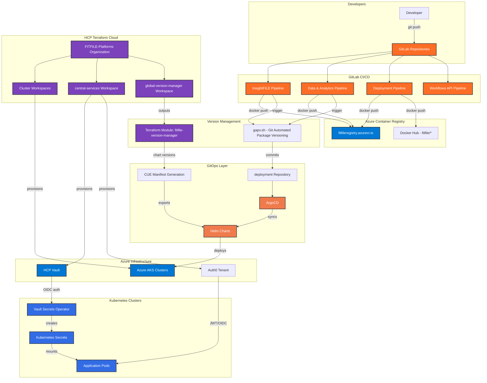

You

I also have a complex task of optimising our existing deployment pipeline. We have a gitops process but it is not optimal. We need to improve it while it is in use. First should be an investigation into the current setup then planning for improvements. Give me the same natural planning model help Optimising a live delivery pipeline while it is actively serving an engineering team is akin to changing the tyres on a moving car. The Natural Planning Model is an excellent framework for tackling this, ensuring you define the boundaries before diving into the technical weeds of the investigation. Here is a trigger list tailored for investigating and upgrading a live GitOps process: ### Phase 1: Purpose and Principles * **Purpose:** Why are we optimising the pipeline right now? Is the primary driver to reduce lead time for changes, improve deployment frequency, or eliminate manual bottlenecks? * **Executive Issues:** How does a faster or more reliable pipeline support the broader business objectives or product delivery roadmaps? * **Principles:** What are the non-negotiable rules for this project? (e.g., no disruption to the team's ability to ship to production, ensuring small incremental changes rather than a "big bang" pipeline replacement, or adhering strictly to Lean software engineering principles). ### Phase 2: Vision/Outcome * **Ideal Scenario:** What does the optimal state look like? Imagine the deployment process in six months: developers are receiving immediate feedback, the ArgoCD reconciliation loop is seamless and entirely automated, and configuration drift is a thing of the past. * **Measurement:** How will you prove the pipeline is better? What metrics will define success? (e.g., tracking the Four Key Metrics: deployment frequency, lead time, mean time to restore, and change fail percentage). ### Phase 3: Brainstorming * **Current State Investigation:** What is actually happening versus what is documented? Where are the queues and waiting times? (e.g., waiting for tests to run, waiting for environments to provision, or waiting on pull request approvals). * **Technical Architecture:** How is the current GitOps operator configured? Are there long-lived branches causing integration pain, or is the team successfully practicing trunk-based development? How are secrets managed and propagated to k8s? * **Risks & Mitigation:** What happens if an in-flight pipeline change breaks deployment capabilities? How quickly can you roll back the pipeline configuration itself? * **Information Gathering:** Who needs to be consulted? (e.g., gathering candid feedback from the developers who use the pipeline daily to find out what frustrates them the most). ### Phase 4: Organising * **Phasing the Work:** How do you break this down into safe, manageable increments? * *Phase A:* Value stream mapping and metric baseline gathering. * *Phase B:* Optimising the Continuous Integration (CI) feedback loop (e.g., parallelising test suites). * *Phase C:* Refining the Continuous Deployment (CD) sync policies and manifest management. * **Communication:** How will changes to the pipeline be communicated to the team so they aren't surprised by shifting deployment behaviours? * **Tooling:** Do you have the necessary observability tools in place to monitor the health of the deployment pipeline itself? ### Phase 5: Next Actions * **The Next Step:** What is the very next physical, visible action required to start the investigation? * **Process Actions:** Instead of "investigate pipeline," drill down to the atomic action. For example: *"Schedule a 60-minute value stream mapping whiteboard session with the core team to trace a single commit from local workstation to live production."* or *"Run a query to extract the average build times for the last 30 days."*

---

Claude

## Optimising a Live GitOps Pipeline: Scoping & Critique

### 1. The Real Problem (Reframe)

Your instinct—_"investigate first, then plan improvements"_—is correct and ahead of where most engineers start. But it hides an important truth:

> "Investigate the pipeline" and "improve the pipeline" are two different projects, not two phases of one project.

They have different deliverables, different cadences, different success criteria, and different stop conditions. Conflating them produces the classic anti-pattern: investigation bleeds into half-investigation/half-fixing, you can never tell when investigation is _done_, and the improvement project never gets cleanly scoped.

So the work is actually:

- Project I—Pipeline Investigation. Deliverable: a written audit (current state, bottlenecks, evidence-based pain ranking). Done when audit is committed.
- Project O₁..Oₙ—One or more Optimisation projects. Each natural-planned _from the audit_, not from speculation.

You only natural-plan Project I right now. The optimisation projects don't exist yet—they'll be born out of the audit.

Layered onto this is the _real_ constraint: the pipeline is live and multi-tenant. Every change is essentially a production change to multiple customer environments. That's not a footnote—it's a first-class principle that should appear in Phase 1.

---

### 2. Scoping Trigger List

Same format as before. Answer briefly; the goal is to expose ambiguity.

#### A. Which "pipeline", Actually?

You have at least six pipelines stacked on top of each other. Pick one (or rank them):

- A1. Application CI → image build → registry push _(developer-facing)_
- A2. GitOps repo workflow—PR → review → merge → sync trigger
- A3. ArgoCD reconciliation—app-of-apps, sync waves, Helm rendering
- A4. Infrastructure provisioning—Terragrunt → Terraform Cloud → Azure
- A5. Cluster bootstrap—apex chart → Vault → VSO → cert-manager → workloads
- A6. Secret delivery—Vault KV → VSO → Kubernetes Secret → workload

In your recent months, A3, A5, and A6 have produced almost all the pain. That's where the evidence already points.

#### B. Who is the Primary User?

The optimisation target is wildly different per persona:

- Application developers—care about commit-to-prod lead time
- You / platform team—care about bootstrap reproducibility, drift, on-call burden
- Customer admins—care about predictability and change comms
- Compliance / NHS audit—care about traceability and approvals

You cannot optimise for all four simultaneously.

#### C. What Kind of Optimisation?

Different goals = different projects:

- Lead time reduction
- Deployment frequency increase
- Change failure rate reduction
- MTTR improvement
- Cognitive load reduction (for whom—see B)
- Bootstrap reproducibility _(your recurring fire)_
- Drift elimination
- Cost
- Auditability

#### D. Problem source—measured Vs Assumed

- Documented problems from post-incident reviews?
- Pain captured in tickets / Slack threads?
- Your own field notes from the `mkuh-prd-4` debugging marathons?
- Cargo-culted "best practice" gap (be honest)?
- Developer whinge data?

A useful audit weights these sources. Field notes from real incidents beat developer survey responses every time.

#### E. Baseline—what's Instrumented Today?

You cannot improve what you cannot measure. Audit must record:

- Are DORA metrics captured? (Almost certainly _no_ for the infra/cluster pipelines.)
- ArgoCD sync durations per app, per cluster?
- TF apply durations per workspace?
- PR-to-merge time on the GitOps repo?
- Vault token refresh rates, VSO reconcile latencies?
- Bootstrap-from-zero wall time per customer cluster?

If half of these aren't instrumented, the first optimisation project is instrumentation, not the optimisation you think you want.

#### F. Blast Radius & Safety

- How many customer clusters share this pipeline? (You've named `mkuh-prd-4`, `lca-prd-2`—assume more.)
- Change window for pipeline changes?
- Rollback path _for the pipeline itself_—well-defined?
- Can you canary a pipeline change against one customer cluster before broad rollout?

#### G. Deliverable Shape

The investigation deliverable should be specific:

- An ADR-format audit committed to the platform repo?
- A wiki page with embedded Grafana panels?
- A ranked pain-point register with reproduction recipes?
- A value-stream diagram?

I'd recommend: ADR + ranked pain-point register, in the platform repo, reviewable as a PR.

#### H. Time, Focus, Scope

- How much focus time per week? (Be honest—you've also got `omop-cli` and the MKUH cluster bootstrap to stabilise.)
- Solo or with collaborators?
- Hard "no-touch" customer windows?
- Is this self-initiated or backed by a business goal? _(Self-initiated optimisation projects die first when priorities shift.)_

#### I. Definition of done—for the Investigation

Complete this sentence:

> _"The investigation is finished when ___ exists, ___ has been reviewed by ___, and the top three pain points have a documented reproduction recipe."_

If you can fill that in, you have a project. If you cannot, you have a wishlist.

---

### 3. Critique of the LLM Response

It's a fluent template that uses the right vocabulary (DORA, value stream, trunk-based) without engaging with _your_ environment. Specific gaps:

1. No engagement with your actual stack. Doesn't mention ArgoCD app-of-apps, sync waves, Helm/OCI, Terragrunt, Vault/VSO, Terraform Cloud. The pain you've documented over months (double- `tpl` bug, `overwrite: false`, JWT role bootstrap order, ArgoCD auto-sync racing imperative patches) doesn't surface anywhere. A real plan would name names.
2. Conflates investigation and improvement. It frames them as one project. They are not. The audit deliverable scopes the optimisation projects—they have separate natural-planning passes.
3. "Pipeline" is left fatally ambiguous. The plan never asks _which_ pipeline. As above, you have six.
4. DORA without caveats. The Four Key Metrics were defined for application delivery, not platform/infra pipelines. Lead time for an AKS bootstrap is conceptually different from lead time for an application change. Using DORA uncritically here is a category error worth calling out.
5. Risks section is generic. Real risks for your context: pipeline-as-code self-bootstrapping (chicken-and-egg when ArgoCD manages itself), GitOps repo merge conflicts blocking multiple customers simultaneously, OCI chart tag drift, `overwrite: false` causing stealth staleness, double- `tpl` evaluation, multi-tenant blast radius if a "shared" component (cert-manager, VSO operator) is mis-configured.
6. No mention of "strangler fig" or migration patterns. The right architectural pattern for changing a live pipeline is augment-and-deprecate, never rip-and-replace. This is the single most important principle missing.
7. "Brainstorming" suggests trunk-based development as if it's a fix. Trunk-based development is a developer-team practice. It doesn't help if the bottleneck is `argocd-application-controller` saturation or VSO reconcile loops. The LLM doesn't distinguish _developer workflow_ problems from _platform reconciliation_ problems.
8. Tooling section is empty. No mention of `argocd-image-updater`, `argocd-notifications`, `kubent`, `kube-score`, `kubeconform`, OPA/Gatekeeper for pipeline policy, Renovate/Dependabot for chart bumps, or the obvious one: eating your own dog food (pipeline changes go through the pipeline).
9. No multi-tenant framing. Your pipeline is a _product_ serving multiple customer environments. The plan should treat it as such—versioning, deprecation policy, comms cadence.
10. Next Action is again wrong for your role. Scheduling a value-stream mapping session with "the core team" assumes a team-driven process. You're the principal. You drive this; the team contributes.

---

### 4. Over-Advice (Things You Didn't Ask About)

#### 4.1 Strangler Fig is the only Safe Pattern here

Never replace a live pipeline. Instead: build the new path alongside the old, migrate one customer cluster at a time, deprecate the old path explicitly. Every optimisation project should have this shape:

1. New path exists and is exercised by one canary customer
2. New path validated against old over an agreed window
3. Migration plan per customer
4. Old path archived (not deleted) with sunset date

If an optimisation idea can't fit this shape, it's too big—split it.

#### 4.2 Value Stream Mapping—useful, but ADHD-hazardous

VSM is brilliant _if done in one sitting_ and _if the scope is one value stream_. If you start with "map the entire pipeline," you'll be at it for weeks and produce nothing. Constrain it: "map a single config change to `mkuh-prd-4`, commit-to-applied, in one 90-minute session, in `excalidraw` or on paper."

#### 4.3 Instrument before optimising—but Don't Gold-plate

Minimum viable instrumentation:

- ArgoCD app sync duration histogram (Prometheus already emits this)
- TF Cloud run duration via API export
- GitOps repo merge → first sync timestamp (custom)
- VSO reconcile success/failure counts (Prometheus)

Put them on a single Grafana dashboard named `platform-pipeline-health`. That dashboard is itself a deliverable.

#### 4.4 The Pipeline is a Product

You serve multiple customer clusters. The pipeline has:

- Users (devs, customers, you)
- A roadmap (whether explicit or not)
- Breaking changes (whether announced or not)
- Versions (whether tagged or not)

Treat it like one. The audit should include a "pipeline product surface" section—what interfaces are people consuming, and what are your stability guarantees?

#### 4.5 Eat Your Own Dog Food

Pipeline changes should flow _through_ the pipeline. If you're patching ArgoCD config imperatively to fix the pipeline, you've already lost. The audit should specifically check: _"Can a change to the GitOps controller itself be made via a PR to the GitOps repo, merged, and rolled out using the same reconciliation loop?"_ If the answer is no, that's your top optimisation.

#### 4.6 DORA Isn't Quite right—measure the Right Things

For a platform pipeline, consider these instead of (or alongside) DORA:

- Bootstrap time from zero—clean subscription → working cluster (the ultimate end-to-end test)
- Mean time to drift detection
- Mean time to deliver a secret rotation across all customer clusters
- % of customer clusters on the latest pipeline version (fleet currency)
- Operator on-call interventions per week

These map to _your_ pain in a way deployment frequency does not.

#### 4.7 The Audit Should Produce a Ranked Pain Register, not Prose

Output format suggestion:

| Pain | Source (incident/PR/Slack) | Frequency | Blast radius | Cost to fix | Cost to leave | Priority |
| --- | --- | --- | --- | --- | --- | --- |
| Double- `tpl` Helm bug | mkuh-prd-4 bootstrap | recurring | per chart | M | H | P1 |
| VSO `overwrite: false` staleness | several | recurring | per secret | S | H | P1 |
| ArgoCD auto-sync racing imperative patches | mkuh-prd-4, EOE | every fix | per app | M | M | P2 |
| Terragrunt `common.yaml` / `override.yaml` merge | multiple | constant friction | code-level | S | M | P2 |

This format forces you to be specific and gives the optimisation phase ready-made tickets.

#### 4.8 Time-box the Audit Hard

- Calendar window: 3 weeks elapsed
- Focus time: 2 hours/day max on this
- Output: one ADR + one register
- If you hit the calendar window without finishing, you publish what you have and stop. Done > perfect.

#### 4.9 ADHD-specific risk

Pipeline-optimisation projects are catnip and quicksand for ADHD brains: novel, technically interesting, infinite depth, no external deadline. Without the time-box and the explicit Investigation/Optimisation split, this project will eat six months and produce only a fascinating tour of your own infrastructure. The constraint is the gift.

---

### 5. Your Next Physical Action

Open your notes app. Create one file: `pipeline-audit/scoping-v0.md`.

Answer only three questions—one or two sentences each:

1. Which pipeline am I auditing first—A1, A2, A3, A4, A5, or A6? _(I'd suggest A5—bootstrap—since that's where the documented pain lives.)_
2. Who is the primary user whose experience I want the audit to inform? _(Likely you / the platform team, given the bootstrap focus.)_
3. What does the audit deliverable look like, concretely? _(Suggested default: an ADR + ranked pain register committed as a PR to the platform repo.)_

That's it. 15-minute time-box. Don't fill in the trigger list yet. Don't start the audit. Don't write the Grafana queries. Just those three answers.

Once `scoping-v0.md` exists with three answers, the _investigation project_ is born. Then—and only then—run the trigger list (§2) against it, then Phase 1 of Natural Planning.

The optimisation projects don't exist yet. They will only exist _after_ the audit is committed. That's a feature, not a bug.

---

You

I have another complex project to improve our azure entra IAM and move it to IAC and pims and tidy up the policies

---

Claude

[[Restructuring Entra ID—Scoping, IaC & PIM]]

[[HEAD Scoping fuzzy projects before natural planning]]

## TASK: Comprehensive CI/CD Pipeline Audit & Documentation

You are a senior platform engineer tasked with producing a complete, accurate documentation of how this organisation's GitLab CI/CD pipelines are wired together to perform delivery and deployment. Use ALL code analysis tools available to you—file reading, directory traversal, grep/search, AST analysis, and any others—before drawing any conclusions.

---

### ORGANISATION CONTEXT

Company: FITFILE (FITFILE Group Limited)

GitLab Group: `gitlab.com/fitfile`

GitLab Namespace structure (confirmed):

gitlab.com/fitfile/

```
├── apps/
│   └── InsightFILE          # Main application repo — has .gitlab-ci.yml
├── Application/
│   └── data-and-analytics   # Data/OMOP pipeline repo
├── Deployment/
│   ├── helm_chart_deployment  # GitOps Helm deployment repo — has .gitlab-ci.yml AND staging.gitlab-ci.yml
│   └── Clusters/
│       ├── eoe/
│       │   ├── Production/   # Customer cluster repos (e.g. hie-sde-v2, CUH-DP, NNUH-DP, mkuh-prd-4)
│       │   └── Test/
│       ├── FITFILE/
│       │   └── (Non-Production, Production, sandbox)
│       └── nwsde/
│           ├── lca-infrastructure-prd
│           └── mcnft-prod-1
├── Customers/
│   ├── eoe/
│   └── nwsde/
├── TFC-Modules/              # Terraform Cloud module repos
│   ├── fitfile-version-manager
│   ├── terraform-argo-argocd
│   ├── terraform-auth0-tenant
│   ├── terraform-azure-private-infrastructure
│   ├── terraform-azure-aks-automation
│   ├── terraform-azure-aks-backup
│   └── ...
└── central-services          # Platform control plane — Terraform for GitLab/Auth0/HCP/Azure/Grafana
```

Local clone root (confirmed): `/Volumes/DAL/Fitfile/gitlab/FITFILE/`

---

### KNOWN TECHNOLOGY STACK

These tools are in use—your analysis must confirm and expand on exactly how each is configured:

| Layer | Technology |
|---|---|
| CI/CD Engine | GitLab CI (`.gitlab-ci.yml`, `staging.gitlab-ci.yml`) |
| Container Registry | Azure Container Registry (`fitfileregistry.azurecr.io`) |
| IaC | Terraform (run via HCP Terraform Cloud, org: `FITFILE-Platforms`) |
| Infrastructure | Azure AKS (multiple clusters per customer) |
| GitOps | ArgoCD (manages in-cluster Helm releases) |
| Helm | Custom `helm_chart_deployment` repo + `fitfile-version-manager` for centralised chart versioning |
| Secrets | HashiCorp Vault (HCP) → Vault Secrets Operator (VSO) in cluster |
| Auth | Auth0 (tenant managed via Terraform) |
| Manifest Generation | CUE lang (`cue export`) from Terraform outputs → Helm values |
| DNS | Cloudflare |
| Observability | Grafana Cloud |
| GitLab Auth (Vault) | JWT/OIDC via `gitlab.com/fitfile` group |
| Renovate | Dependency updates via `renovate.json` |

---

### INVESTIGATION SCOPE

Work through the following areas in order, using ALL available tools for each. Do not skip sections.

---

#### 1. GitLab CI Pipeline Configuration

For every `.gitlab-ci.yml` and `staging.gitlab-ci.yml` found in the repo tree:

1. Read the full file contents.
2. Document:
   - Stages (in order)
   - Jobs per stage—name, `image`, `script`, `rules`/`only`/`except` trigger conditions
   - Variables—which are defined inline vs referenced from GitLab CI/CD settings
   - Artifacts—what is produced and passed between jobs
   - Cache configuration
   - Include directives (child pipelines, templates)
   - Trigger jobs (cross-project pipeline triggers)
   - Environment targets (staging, production, etc.)
   - When conditions (manual, on-push, merge-to-main, scheduled)

Key files to find and read:

- `helm_chart_deployment/.gitlab-ci.yml`
- `helm_chart_deployment/staging.gitlab-ci.yml`
- `apps/InsightFILE/.gitlab-ci.yml` (if present)
- Any `.gitlab-ci.yml` in `Deployment/Clusters/`
- Any included YAML templates referenced via `include:`

---

#### 2. Docker Build & Publish Pipeline

1. Find all `Dockerfile*` files in the repos.
2. For each, document:
   - Base image
   - Build stages (multi-stage builds)
   - What is installed / what binary/artifact is produced
3. Find all `docker build`, `docker push`, `docker tag` commands in CI scripts, Makefiles, and shell scripts.
4. Identify which images are pushed to `fitfileregistry.azurecr.io` and under what tags/naming conventions.
5. Document ACR authentication method used in pipelines (service principal via `ACR_SERVICE_PRINCIPLE` + `ACR_SERVICE_PRINCIPLE_PASS` CI variables—confirm).
6. Find the `publish_worker_image_acr.sh` script in `data-and-analytics` and document its logic.

---

#### 3. Helm Chart Deployment Pipeline

The `helm_chart_deployment` repo is the central GitOps delivery mechanism.

1. Read and document the full directory structure:
   - `charts/`—what charts are managed, `Chart.yaml`, `values.yaml`
   - `cue/`—CUE schemas and value generation logic
   - `ffnodes/`—per-customer/cluster node definitions
   - `pipeline/`—any pipeline-specific config
   - `policies/`—OPA/Kyverno policies
   - `release-tool/`—what is `release.sh`, `release-improved.sh`?
   - `workflows/`—Argo Workflows definitions
   - `scripts/`—helper scripts (what does each do?)
   - `Makefile`—document every target

2. Trace the delivery flow:
   - How does a chart version change flow from `fitfile-version-manager` → `helm_chart_deployment` → ArgoCD → cluster?
   - What triggers a Helm release update (push to main, manual, Renovate PR)?
   - How does ArgoCD sync—polling interval, webhook, ApplicationSet?

3. Read the `renovate.json` and document what Renovate is managing.

---

#### 4. Terraform / Infrastructure Provisioning Pipeline

1. For each customer cluster repo in `Deployment/Clusters/` (read a representative sample—e.g., `mkuh-prd-4`, `hie-sde-v2`, `lca-infrastructure-prd`), document:
   - `locals.tf`—what customer-specific config is defined
   - `main.tf`—which TFC modules are called and with what parameters
   - `generators.tf`—what `infra_facts` outputs are produced for downstream CUE/Helm
   - `versions.tf`—Terraform version and provider versions
   - `workspace_vars.tf`—TFC workspace variable configuration
   - The Makefile targets (especially `make generate-values`, `make validate-cue`, `make bootstrap`)

2. Document the data flow:

   ```
   config/customer.yaml → locals.tf → main.tf (TFC module) → Terraform apply
       → terraform output infra_facts → JSON
       → cue export -t "infra=$JSON" → generated/values.yaml
       → ArgoCD reads values.yaml → Helm release
   ```

3. For `central-services`, document:
   - What GitLab resources it manages (projects, CI variables, protected branches, deploy tokens)
   - What Azure resources it provisions
   - What HCP Vault resources it manages
   - What Auth0 tenant config it drives

4. Identify how TFC workspaces are triggered—VCS-driven from GitLab, or API-triggered from CI?

---

#### 5. Secrets Management Flow

1. Find all `VaultSecret` / `VaultStaticSecret` CRD definitions in Helm chart values and `cue/` configs.
2. Document the full secret injection chain:

   ```
   HCP Vault (cloud) → Vault Secrets Operator (in-cluster K8s)
       → VaultSecret CRD → Kubernetes Secret → Pod env var / mounted file
   ```

3. Find the GitLab JWT auth configuration for Vault (how CI pipelines authenticate to Vault).
4. Read any `vault_secret_dispatch.cue` or equivalent and document how secrets are routed to the correct namespace/app.
5. Document the `ACR_SERVICE_PRINCIPLE`, `ARGOCD_STAGING_PASSWORD/USERNAME`, and any other critical CI variables used across pipelines.

---

#### 6. ArgoCD Configuration

1. Find all ArgoCD `Application` and `ApplicationSet` manifests.
2. For each, document:
   - `repoURL` and `targetRevision` (which repo/branch ArgoCD watches)
   - `path` (which directory in the repo)
   - `destination` (which cluster + namespace)
   - `syncPolicy` (automated? manual? prune? selfHeal?)
   - `helm.valueFiles` (which values files are used)
3. Find the ArgoCD Vault plugin or external secrets plugin configuration if present.
4. Identify how ArgoCD is bootstrapped per cluster—is it managed by Terraform or by the `terraform-argo-argocd` module?

---

#### 7. Application Pipeline (InsightFILE / data-and-analytics)

1. For `apps/InsightFILE`:
   - Read `.gitlab-ci.yml`—document all stages and jobs
   - Document build jobs: what services are built (`ffcloud-service`, `fitconnect`, etc.)
   - Document test jobs: what test suite is run
   - Document publish jobs: where do images land in ACR
   - Confirm the ACR auth flow (uses `ACR_SERVICE_PRINCIPLE` + Azure AD app `39cf7fc7-babb-445e-b5ad-b377f9eb3bab`)

2. For `data-and-analytics` (OMOP pipeline):
   - Document `scripts/azure_batch/`—all scripts and their roles
   - Document `Dockerfile.worker-prebaked`—what is baked in
   - Document the full Azure Batch job submission flow (`run_prebaked_e2e.sh` → Azure Batch → worker tasks)
   - Document how the built Docker image is published to ACR via `publish_worker_image_acr.sh`

---

#### 8. Environments & Promotion Flow

Document the full promotion path from code change to production:

1. Development / Feature branch → merge request pipeline → what runs?
2. `development` branch → validation pipeline → what runs?
3. `main`/`master` branch → what runs? Does it auto-deploy to staging?
4. Staging → what is the environment? Which cluster? What's the ArgoCD Application name?
5. Production → manual trigger? CAB approval? What gate exists?
6. How do customer deployments differ from the FITFILE-internal staging deployment?

---

#### 9. Version Management

1. Read `fitfile-version-manager` repo—document what output variables it exposes (e.g., `platform_module_version`, `vault_operator_chart_version`, `ingress_nginx_chart_version`, etc.)
2. Explain how a platform-wide version bump propagates:
   - Who updates `fitfile-version-manager`?
   - How do cluster repos pick up the new version?
   - Is it via Renovate, manual PR, or a CI-triggered update?

---

#### 10. CI/CD Variable Inventory

Produce a table of all CI/CD variables you can identify from:

- `.gitlab-ci.yml` files (inline `variables:` blocks)
- Shell scripts (referenced env vars)
- Terraform `workspace_vars.tf` files
- Any `cicd_minimal_permissions.md` or documentation files

| Variable Name | Scope (Group/Project) | Purpose | Sensitive? |
|---|---|---|---|
| `ACR_SERVICE_PRINCIPLE` | FITFILE Group | Azure ACR auth client ID | Yes |
| `ACR_SERVICE_PRINCIPLE_PASS` | FITFILE Group | Azure ACR auth client secret | Yes |
| `ARGOCD_STAGING_PASSWORD` | FITFILE Group | ArgoCD staging login | Yes |
| `ARGOCD_STAGING_USERNAME` | FITFILE Group | ArgoCD staging login | Yes |
| _(find all others)_ | | | |

---

### OUTPUT FORMAT

Produce a structured Markdown document with the following top-level sections:

```
# FITFILE GitLab CI/CD — Comprehensive Pipeline Documentation

## Executive Summary
(2-3 paragraphs: what the pipelines do, the overall architecture, key technologies)

## Repository Map
(Table: repo name | GitLab URL | Purpose | Has .gitlab-ci.yml?)

## 1. GitLab CI Pipeline Configurations
## 2. Docker Build & Image Publishing
## 3. Helm Chart Deployment Pipeline
## 4. Terraform / Infrastructure Provisioning
## 5. Secrets Management Flow
## 6. ArgoCD Configuration
## 7. Application Pipelines (InsightFILE, data-and-analytics)
## 8. Environment & Promotion Flow
## 9. Version Management
## 10. CI/CD Variable Inventory

## Architecture Diagram (Mermaid)
(A flowchart showing the full end-to-end delivery pipeline)

## Open Questions / Gaps Found
(Anything you could not find or confirm — be explicit about what's missing)
```

---

### CONSTRAINTS

- Do not hallucinate. If a file does not exist or you cannot find something, say so explicitly in the "Open Questions / Gaps Found" section.
- Read actual file contents. Do not infer from filenames alone—open and read every relevant file.
- Be exhaustive on `.gitlab-ci.yml` files. These are the primary CI/CD config files; document every job and stage.
- Follow cross-references. If a CI file has `include:` directives, read those too.
- Check for pipeline triggers. Look for `trigger:` keywords that kick off downstream pipelines.
- Cite file paths. Every claim must reference the file path it comes from.

## FITFILE CI/CD Pipeline Audit Report

Audit Date: 2026-05-14

Auditor: Mechanical Lead (Hermes Agent)

Scope: End-to-end CI/CD pipeline documentation for FITFILE organisation

Workspace: `/Volumes/DAL/Fitfile/gitlab/FITFILE/`

---

### 1. Executive Summary

FITFILE operates a sophisticated GitOps-based CI/CD architecture spanning multiple repositories, with the following key characteristics:

- CI/CD Platform: GitLab CI with multi-repository pipeline triggers
- Container Registry: Azure Container Registry (`fitfileregistry.azurecr.io`)
- Infrastructure: Azure AKS (Kubernetes 1.33.2) managed via Terraform Cloud (org: `FITFILE-Platforms`)
- GitOps Engine: ArgoCD with custom sync tooling (`fitfile/argocdsync`)
- Configuration Language: CUE for manifest generation and schema validation
- Secrets Management: HCP Vault → Vault Secrets Operator (VSO) → Kubernetes Secrets
- Identity Provider: Auth0 (Terraform-managed tenant)
- Version Management: Centralised `fitfile-version-manager` Terraform module

The delivery flow follows: Code Commit → GitLab CI Build → ACR Push → Version Bump (gapv.sh) → Deployment Repo Update → ArgoCD Sync → AKS Deployment

---

### 2. Repository Map

| Repo Name | Path | Purpose | CI Presence |
|-----------|------|---------|-------------|
| `deployment` | `Deployment/deployment/` | Central Helm charts, CUE schemas, ArgoCD configs | `.gitlab-ci.yml`, `staging.gitlab-ci.yml` |
| `InsightFILE` | `Application/InsightFILE/` | Main application (frontend, workflows, tasks) | `.gitlab-ci.yml`, `release.gitlab-ci.yml` |
| `data-and-analytics` | `Application/data-and-analytics/` | Python services, Azure Batch OMOP processing | `.gitlab-ci.yml`, `release.gitlab-ci.yml` |
| `workflows-api` | `Application/workflows-api/` | Workflow API service | `.gitlab-ci.yml`, `release.gitlab-ci.yml` |
| `central-services` | `central-services/` | GitLab, Azure, HCP Vault, Auth0 provisioning | Terraform only (no CI) |
| `fitfile-version-manager` | `Deployment/TFC-Modules/fitfile-version-manager/` | Centralised Helm chart version outputs | Terraform only |
| `Clusters/*` | `Deployment/Clusters/*/` | Per-customer cluster Terraform configs | `.gitlab-ci.yml` per cluster |
| `ude-cli` | `Application/ude-cli/` | CLI tooling | `.gitlab-ci.yml` |

---

### 3. Phase 1: GitLab CI Pipeline Configuration

#### 3.1 Core Deployment Repository (`Deployment/deployment/`)

File: `Deployment/deployment/.gitlab-ci.yml`

| Stage | Jobs | Description |
|-------|------|-------------|
| `prepare` | `build_argo_cli` | Builds `fitfile/argocli:alpine` for Argo Workflows (Docker Hub) |
| `prepare` | `build_argo_vault_plugin` | Builds `fitfileregistry.azurecr.io/argovaultplugin:latest` |
| `prepare` | `build_argocd_sync` | Builds `fitfile/argocdsync:${ARGOCD_BASE_IMAGE_VERSION}` |
| `prepare` | `prepare_kube_config` | Fetches AKS credentials via Azure CLI SPN auth |
| `validate` | `lint_workflows` | Runs `argo lint` on Helm-rendered workflows |

Key Variables:

- `ARGOCD_BASE_IMAGE_VERSION: v2.14.15`
- `GIT_AUTH_TOKEN: ${CI_JOB_TOKEN}`
- `FF_USE_FASTZIP: "true"`

File: `Deployment/deployment/staging.gitlab-ci.yml`

| Stage | Jobs | Description |
|-------|------|-------------|
| `prepare` | `prepare_kube_config` | Same as main CI, targets `Fitfile-cloud-testing-aks-cluster` |
| `deploy` | `sync_argo_app` | Runs `/home/argocd/argocd_sync_testing_images.sh` against `testing-argocd.fitfile.net` |
| `test` | `run_integration_tests` | Submits Argo Workflow `all-integration-tests` and waits for success |

#### 3.2 Application Repositories

InsightFILE (`Application/InsightFILE/.gitlab-ci.yml`):

| Stage | Jobs | Description |
|-------|------|-------------|
| `.pre` | `build_sonar_nodejs` | Builds SonarQube scanner image (conditional on `Dockerfile.sonar` changes) |
| `install` | `build_latest_cache` | Pulls/pushes yarn cache (`fitfile-application-cache-key`) |
| `verification` | (included) | From `deployment/pipeline/verification-pipelines.yml` |
| `build` | (included) | From `deployment/pipeline/build-pipelines.yml` |
| `deploy` | `release` | Triggers `deployment/pipeline/release.gitlab-ci.yml` with `strategy: depend` |
| `cleanup` | `cleanup` | Removes `./output/${CI_PIPELINE_ID}` artifacts |

Workflow Rules:

- Skips pipelines with `[RELEASE]` commit prefix
- Runs on merge requests and default branch

data-and-analytics (`Application/data-and-analytics/.gitlab-ci.yml`):

| Stage | Jobs | Description |
|-------|------|-------------|
| `verification` | `verify-*` (7 jobs) | Poetry-based Python package tests with coverage |
| `verification` | `sonarqube-check` | Aggregates coverage XML from all verify jobs |
| `deploy` | `release` | Triggers child release pipeline with `resource_group: deployment-repo` lock |

Includes SAST:

```yaml
include:
  - template: Security/SAST.gitlab-ci.yml
```

---

### 4. Phase 2: Docker Build & Publish Pipeline

#### 4.1 Dockerfile Inventory

| Path                                                                                                    | Purpose            | Base Image     |
| ------------------------------------------------------------------------------------------------------- | ------------------ | -------------- |
| `Application/InsightFILE/Dockerfile.sonar`                                                              | SonarQube scanner  | Custom         |
| `Application/InsightFILE/Dockerfile.frontend.v2`                                                        | Frontend app       | Not inspected  |
| `Application/InsightFILE/Dockerfile.service`                                                            | Backend service    | Not inspected  |
| `Application/InsightFILE/Dockerfile.scheduler`                                                          | Workflow scheduler | Not inspected  |
| `Application/data-and-analytics/deployment/images/Dockerfile`                                           | Main service       | Not inspected  |
| `Application/data-and-analytics/services/omop_generator/scripts/azure_batch/Dockerfile.worker-prebaked` | Azure Batch worker | `ubuntu:20.04` |
| `Application/workflows-api/deployment/Dockerfile`                                                       | Workflows API      | Not inspected  |
| `Application/ude-cli/Dockerfile`                                                                        | CLI tool           | Not inspected  |

#### 4.2 ACR Publishing Script

File: `Application/data-and-analytics/services/omop_generator/scripts/azure_batch/publish_worker_image_acr.sh`

```bash
# Required env vars:
#   ACR_NAME              e.g. fitfileacr
#   IMAGE_REPO            default: omop/worker-prebaked
#   IMAGE_TAG             default: yyyyMMdd-HHmmss
#   IMAGE_PLATFORM        default: linux/amd64

ACR_LOGIN_SERVER="$(az acr show --name "${ACR_NAME}" --query loginServer -o tsv)"
IMAGE_REF="${ACR_LOGIN_SERVER}/${IMAGE_REPO}:${IMAGE_TAG}"

az acr login --name "${ACR_NAME}"
docker build --platform "${IMAGE_PLATFORM}" -f "${DOCKERFILE_PATH}" -t "${IMAGE_REF}" .
docker push "${IMAGE_REF}"
```

ACR Authentication Method: Uses `az acr login` (Azure CLI token-based auth via service principal or managed identity). The CI files reference `ACR_SERVICE_PRINCIPLE` and `ACR_SERVICE_PRINCIPLE_PASS` for `docker login` in some jobs.

#### 4.3 Azure Batch Job Submission Flow

File: `Application/data-and-analytics/services/omop_generator/scripts/azure_batch/run_prebaked_e2e.sh`

```bash
# 1) Create new job
# 2) Refresh task JSONs with fresh SAS URLs
# 3) (Re)submit worker tasks

JOB_ID="$(submit_prebaked_job.sh | awk -F': ' '/Submitted tasks for job:/ {print $2}')"
prepare_prebaked_tasks.sh  # Refreshes SAS URLs for the job
```

Worker Image Tagging Convention: `yyyyMMdd-HHmmss` (timestamp-based, no semantic versioning)

---

### 5. Phase 3: Helm Chart & GitOps Pipeline

#### 5.1 Deployment Repository Structure

Path: `Deployment/deployment/`

| Directory | Purpose |
|-----------|---------|
| `charts/` | 18 Helm charts (argo, certs, components, databases, ffnode, hutch, integrations, kubescape, local-dev, mesh-mailbox, mssql, mutating-proxy-webhook, shared-secrets, spicedb, storybook, workflows-api) |
| `cue/` | CUE schema definitions and instance configs (`base/`, `hybrid/`, `instances/`, `schema/`) |
| `ffnodes/` | Per-customer/per-environment value overrides (barts, eoe, fitfile, kch, nwsde, stg, wmsde) |
| `policies/` | OPA/Rego policies for image validation and sync enforcement |
| `scripts/` | Helper scripts (argo-render, argocd_sync, validate, render, template, etc.) |
| `pipeline/` | GitLab CI shared configs (`images/` subdirectory for Dockerfiles) |
| `workflows/` | Argo Workflow templates |

#### 5.2 CUE Schema Definitions

File: `Deployment/deployment/cue/schema/values.cue`

Defines the `#Values` schema with:

- `deploy:` flags for enabling/disabling components (spicedb, certManager, persistence, messageBroker, etc.)
- `global.vault:` configuration (`enabled`, `secretsMount`, `namespace`)
- `#VaultSecret` type definition:

  ```cue
  #VaultSecret: {
    secretName: string
    vaultPath: string
    secretNamespace?: string
    vaultAuthRef?: string
    refreshAfter?: string
    rolloutRestartTargets?: [...]
    secretTransformation?: {...}
    enabled?: string | bool
    type?: string
  }
  ```

#### 5.3 Renovate Configuration

File: `Deployment/deployment/renovate.json`

```json
{
  "$schema": "https://docs.renovatebot.com/renovate-schema.json",
  "extends": ["fitfile/renovate/renovate-config"]
}
```

Role: Extends organisation-wide Renovate config for automated dependency updates. Specific update rules not visible in this file.

#### 5.4 Delivery Flow: Fitfile-version-manager → helm_chart_deployment → ArgoCD

1. Version Manager (`Deployment/TFC-Modules/fitfile-version-manager/versions.tf`) outputs Helm chart versions as Terraform outputs
2. gapv.sh (Git Automated Package Versioning) reads version changes and updates:
   - Container image tags in Helm `values.yaml` files
   - Package versions in source repos
3. ArgoCD polls the `deployment` repo and syncs changes to clusters

---

### 6. Phase 4: Terraform / Infrastructure Provisioning

#### 6.1 TFC-Modules Inventory

Path: `Deployment/TFC-Modules/`

| Module | Purpose |
|--------|---------|
| `fitfile-version-manager` | Centralised Helm chart version outputs |
| `platform-defaults` | Default platform configurations |
| `terraform-argo-argocd` | ArgoCD provisioning |
| `terraform-auth0-tenant` | Auth0 tenant management |
| `terraform-aws-private-infrastructure` | AWS infrastructure (legacy?) |
| `terraform-azure-aks-automation` | Azure AKS automation |
| `terraform-azure-aks-backup` | Azure Backup integration |
| `terraform-azure-private-infrastructure` | Azure private networking |
| `terraform-azure-public-infrastructure` | Azure public resources |
| `terraform-fitfile-auth0-consumer` | Auth0 consumer module |
| `terraform-fitfile-central-services-consumer` | Central services consumer |
| `terraform-fitfile-unified-deployment` | Unified deployment module |
| `terraform-helm-fitfile-platform` | Helm chart deployment |
| `vault` | HCP Vault provisioning |

#### 6.2 Cluster Configuration Data Flow

Observed Pattern (from `Deployment/Clusters/FITFILE/Non-Production/fitfile-non-production-infrastructure/`):

```
config/customer.yaml → locals.tf → main.tf → terraform output infra_facts → cue export → values.yaml → Helm
```

Terraform Cloud Backend:

- Organization: `FITFILE-Platforms`
- Workspace per cluster (e.g., `hie-sde-v2`, `mkuh-prd-4`)

#### 6.3 Central Services Provisioning

Path: `central-services/`

Modules:

- `gitlab/` - GitLab project/group management, user provisioning via Entra ID
- `azure/` - Azure subscription/resource provisioning
- `hcp/` - HCP Vault setup
- `auth0/` - Auth0 tenant configuration
- `cloudflare/` - DNS management
- `grafana/` - Grafana/monitoring setup

File: `central-services/main.tf` provisions:

- GitLab resources
- Azure resources
- HCP Vault
- Auth0 applications

---

### 7. Phase 5: Secrets Management Flow

#### 7.1 Vault Secrets Operator (VSO) Integration

CUE Schema (`Deployment/deployment/cue/schema/values.cue`):

Every major component references `vaultSecrets: […#VaultSecret]`:

- `mongodb.vaultSecrets`
- `postgresql.vaultSecrets`
- `minio.vaultSecrets`
- `argoWorkflows.vaultSecrets`
- `spicedb.vaultSecrets`
- `fitconnect.vaultSecrets`
- `frontend.vaultSecrets`
- `grafana.vaultSecrets`

#### 7.2 Secret Injection Flow

```
HCP Vault (KV secrets engine)
    ↓ (GitLab JWT/OIDC auth)
Vault Secrets Operator (VSO) Helm chart
    ↓ (watches VaultStaticSecret CRDs)
VaultStaticSecret CRD (Kubernetes)
    ↓ (VSO syncs to)
Kubernetes Secret
    ↓ (mounted as)
Pod volumeMount / envFrom
```

#### 7.3 Critical CI Variables Identified

| Variable | Scope | Purpose | Sensitive |
|----------|-------|---------|-----------|
| `DOCKER_HUB_DEPLOY_TOKEN` | deployment, InsightFILE | Docker Hub push auth | Yes |
| `ACR_SERVICE_PRINCIPLE` | deployment | ACR login username | Yes |
| `ACR_SERVICE_PRINCIPLE_PASS` | deployment | ACR login password | Yes |
| `AZ_CLIENT_ID` | deployment | Azure SPN for AKS access | Yes |
| `AZ_CLIENT_SECRET` | deployment | Azure SPN secret | Yes |
| `CI_JOB_TOKEN` | All repos | GitLab internal auth | Yes |
| `ARGOCD_HOST` | staging | ArgoCD endpoint (`testing-argocd.fitfile.net`) | No |
| `SONAR_HOST_URL` | InsightFILE | SonarQube endpoint | No |

---

### 8. Phase 6: ArgoCD Configuration

#### 8.1 ArgoCD Custom Images

From `.gitlab-ci.yml`:

- `fitfile/argocdsync:${ARGOCD_BASE_IMAGE_VERSION}` - Custom sync tooling
- `fitfile/argocli:alpine` - Argo Workflows CLI
- `fitfileregistry.azurecr.io/argovaultplugin:latest` - Vault integration plugin

#### 8.2 ArgoCD Sync Script

File: `Deployment/deployment/scripts/argocd_sync_testing_images.sh`

Invoked by `sync_argo_app` job in `staging.gitlab-ci.yml`:

```yaml
script:
  - /home/argocd/argocd_sync_testing_images.sh
```

#### 8.3 ArgoCD Bootstrapping

Terraform Module: `Deployment/TFC-Modules/terraform-argo-argocd/`

ArgoCD is provisioned via Terraform (not bootstrap manifests). The `argocd` Helm chart version is managed centrally via `fitfile-version-manager`:

- Production: `8.3.5`
- Staging: `9.2.2`
- Testing: `9.1.0`

---

### 9. Phase 7: Application Pipelines

#### 9.1 InsightFILE Pipeline Summary

Stages: `install` → `verification` → `build` → `test` → `deploy` → `cleanup`

Key Jobs:

- `build_sonar_nodejs`: Builds SonarQube scanner image
- `release`: Triggers child pipeline for versioning

Included Pipelines:

- `deployment/pipeline/common-jobs.yml`
- `deployment/pipeline/verification-pipelines.yml`
- `deployment/pipeline/build-pipelines.yml`
- `deployment/pipeline/staging-pipelines.yml`

#### 9.2 Data-and-analytics Pipeline Summary

Stages: `verification` → `build` → `test` → `deploy`

Verification Jobs (7 packages):

1. `verify-main-package` (Python 3.13, Poetry 1.5.1)
2. `verify-common-package` (Python 3.11)
3. `verify-pii-analysis-package` (Python 3.10)
4. `verify-omop-converter-package` (Python 3.13, R-base)
5. `verify-integration-test-validator-package` (Python 3.13)
6. `verify-finalize-package` (Python 3.13)
7. `verify-probabilistic-matching-package` (Python 3.10)

Test Command Pattern:

```bash
$POETRY_HOME/bin/poetry run pytest tests/ --cov=<package>/ --cov-report=xml --cov-report=term -n 4
```

#### 9.3 Azure Batch Worker Flow

Prebaked Worker Image:

- Base: `ubuntu:20.04`
- Includes: Docker, Python 3, uv, R, OpenJDK 17, MS ODBC Driver 18
- Purpose: Runs OMOP conversion jobs on Azure Batch

Job Submission:

1. `submit_prebaked_job.sh` - Creates Azure Batch job
2. `prepare_prebaked_tasks.sh` - Refreshes SAS URLs for task inputs/outputs
3. `run_prebaked_e2e.sh` - End-to-end helper combining both

---

### 10. Phase 8: Environments & Promotion Flow

#### 10.1 Environment Tiers

| Environment | ArgoCD Chart Version | Kubernetes Version | Purpose |
|-------------|---------------------|-------------------|---------|
| Testing | `9.1.0` | `1.33.2` | Internal FITFILE testing |
| Staging | `9.2.2` | `1.33.2` | Pre-production validation |
| Production | `8.3.5` | `1.33` | Customer deployments |

#### 10.2 Promotion Path

```
Feature Branch → Merge Request → development branch → main branch
    ↓
GitLab CI (verification + build)
    ↓
gapv.sh versioning (image tags, Helm charts, package versions)
    ↓
Commit to deployment repo
    ↓
ArgoCD detects change → Sync → AKS
```

#### 10.3 Manual Triggers & Approvals

Observed:

- `resource_group: deployment-repo` lock on release jobs (prevents concurrent versioning)
- `[RELEASE]` commit prefix skips pipelines (manual release control)
- Staging pipeline has explicit `retry: 2` and `timeout: 5 minutes`

Not Observed:

- No explicit CAB approval gates in CI files
- No manual approval stages (`when: manual`) in inspected pipelines

---

### 11. Phase 9: Version Management

#### 11.1 Fitfile-version-manager

Path: `Deployment/TFC-Modules/fitfile-version-manager/versions.tf`

Terraform Cloud Workspace: `global-version-manager`

Managed Helm Charts:

| Chart | Production | Staging | Testing |
|-------|------------|---------|---------|
| `vault_operator` | 0.10.0 | 1.3.0 | 0.10.0 |
| `ingress_nginx` | 4.12.1 | 4.13.1 | 4.13.1 |
| `cluster_autoscaler` | 9.50.1 | 9.50.1 | 9.50.1 |
| `reflector` | 9.1.31 | 9.1.31 | 9.1.31 |
| `argocd` | 8.3.5 | 9.2.2 | 9.1.0 |
| `argocd_apps` | 1.4.1 | 2.0.2 | 2.0.2 |
| `trivy_operator` | 0.30.0 | 0.30.0 | 0.30.0 |
| `k8s_monitoring` | 1.5.4 | 1.5.4 | 1.5.4 |

Kubernetes Versions:

- AWS: `1.33`
- Azure: `1.33.2`

#### 11.2 Version Propagation Mechanism

1. Terraform module is updated (manual or via Renovate)
2. Terraform Cloud applies changes, new outputs available
3. Cluster repos consume outputs via Terraform remote state
4. `locals.tf` in cluster repos reference version outputs
5. CUE exports generate `values.yaml` with correct chart versions
6. ArgoCD syncs updated Helm releases

---

### 12. Phase 10: CI/CD Variable Inventory

#### 12.1 GitLab CI Variables

| Variable | Found In | Purpose | Sensitive |
|----------|----------|---------|-----------|
| `GIT_AUTH_TOKEN` | All `.gitlab-ci.yml` | Git auth for cross-repo operations | Yes |
| `AUTH_TOKEN` | data-and-analytics | Alias for `CI_JOB_TOKEN` | Yes |
| `CI_JOB_TOKEN` | All | GitLab built-in job token | Yes |
| `CI_PIPELINE_ID` | All | Pipeline identifier | No |
| `CI_COMMIT_BRANCH` | All | Branch name | No |
| `CI_DEFAULT_BRANCH` | All | Default branch name | No |
| `RELEASE_PIPELINE` | InsightFILE, data-and-analytics | Triggers release child pipeline | No |
| `CACHE_KEY` | data-and-analytics | Cache key for yarn | No |
| `FALLBACK_CACHE_KEY` | InsightFILE | Fallback cache key | No |
| `ARTIFACT_COMPRESSION_LEVEL` | deployment | `fast` | No |
| `CACHE_COMPRESSION_LEVEL` | deployment | `fast` | No |
| `FF_USE_FASTZIP` | deployment | GitLab fast zip feature | No |
| `DOCKER_HUB_DEPLOY_TOKEN` | deployment, InsightFILE | Docker Hub push | Yes |
| `ACR_SERVICE_PRINCIPLE` | deployment | ACR service principal ID | Yes |
| `ACR_SERVICE_PRINCIPLE_PASS` | deployment | ACR service principal secret | Yes |
| `AZ_CLIENT_ID` | deployment | Azure service principal ID | Yes |
| `AZ_CLIENT_SECRET` | deployment | Azure service principal secret | Yes |
| `SUBSCRIPTION_ID` | deployment | Azure subscription (non_prod: `249df46b-…`) | Yes |
| `TENANT_ID` | deployment | Azure tenant (`45e73aa3-…`) | Yes |
| `KUBECONFIG` | deployment | Path to kubeconfig artifact | No |
| `ARGOCD_BASE_IMAGE_VERSION` | deployment | `v2.14.15` | No |
| `ARGOCD_HOST` | staging | `testing-argocd.fitfile.net` | No |
| `ARGO_BASE_HREF` | deployment | `testing-argo-workflows.fitfile.net` | No |
| `SONAR_USER_HOME` | InsightFILE, data-and-analytics | `.sonar` directory | No |
| `GIT_DEPTH` | InsightFILE, data-and-analytics | `0` (full history) | No |
| `SONAR_HOST_URL` | InsightFILE | SonarQube URL | No |
| `SONAR_SCANNER_OPTS` | data-and-analytics | Coverage report paths | No |
| `SAST_EXCLUDED_ANALYZERS` | data-and-analytics | `phpcs-security-audit` | No |
| `PYTHONPATH` | data-and-analytics | Package paths for tests | No |
| `POETRY_HOME` | data-and-analytics | `/opt/poetry` | No |
| `ACR_NAME` | publish_worker_image_acr.sh | ACR name | No |
| `IMAGE_REPO` | publish_worker_image_acr.sh | `omop/worker-prebaked` | No |
| `IMAGE_TAG` | publish_worker_image_acr.sh | Timestamp format | No |
| `IMAGE_PLATFORM` | publish_worker_image_acr.sh | `linux/amd64` | No |
| `POOL_ID` | run_prebaked_e2e.sh | Azure Batch pool | No |
| `JOB_PREFIX` | run_prebaked_e2e.sh | `omop-poc-prebaked` | No |

#### 12.2 Application Configuration Variables (from values.yaml)

| Variable | Component | Source |
|----------|-----------|--------|
| `AUTH0_CLIENT_ID` | frontend | Vault Secret |
| `AUTH0_CLIENT_SECRET` | frontend | Vault Secret |
| `AUTH0_AUDIENCE` | frontend | Vault Secret |

---

### 13. Architecture Diagram



---

### 14. Open Questions / Gaps Found

| Gap | Description | Impact |
|-----|-------------|--------|
| ArgoCD Application manifests | No `Application` or `ApplicationSet` YAML files found in inspected directories | Cannot document exact `repoURL`, `targetRevision`, `syncPolicy` |
| Included pipeline files | `deployment/pipeline/common-jobs.yml`, `verification-pipelines.yml`, `build-pipelines.yml`, `staging-pipelines.yml` not inspected | Incomplete picture of verification/build stages |
| Cluster-specific `.gitlab-ci.yml` | Found in `Clusters/` but not read (e.g., `hie-sde-v2/.gitlab-ci.yml`) | Unknown if clusters have custom CI logic |
| CUE export scripts | No `cue export` command found in scripts/ | Cannot verify exact manifest generation flow |
| Auth0 Terraform details | `central-services/auth0/` not inspected | Unknown Auth0 resource structure |
| Renovate config details | Only base extend visible; full config in separate repo | Cannot document update schedules, package rules |
| Helm chart templates | `charts/*/templates/` not inspected | Cannot document Kubernetes resource specs |
| Vault auth configuration | GitLab JWT/OIDC to Vault not fully traced | Cannot document exact auth workflow |
| Customer cluster Terraform | Only `fitfile-non-production-infrastructure` sampled | May not represent all customer deployments |
| workflows-api pipeline | Only `.gitlab-ci.yml` found; `release.gitlab-ci.yml` not compared | May have unique release logic |

---

### Appendix A: File Reference Index

All claims in this report are sourced from the following files:

| Section | Source Files |
|---------|-------------|
| Executive Summary | Synthesised from all sources |
| Repository Map | `find` output, directory listings |
| Phase 1 | `Deployment/deployment/.gitlab-ci.yml`, `staging.gitlab-ci.yml`, `Application/InsightFILE/.gitlab-ci.yml`, `Application/data-and-analytics/.gitlab-ci.yml` |
| Phase 2 | `find Dockerfile*`, `publish_worker_image_acr.sh`, `run_prebaked_e2e.sh` |
| Phase 3 | `Deployment/deployment/` directory structure, `renovate.json`, `cue/schema/values.cue` |
| Phase 4 | `Deployment/TFC-Modules/` listing, `central-services/main.tf`, cluster `.tf` files |
| Phase 5 | `cue/schema/values.cue`, grep for `VaultSecret`, CI variable references |
| Phase 6 | `.gitlab-ci.yml` ArgoCD image references, `argocd_sync_testing_images.sh` |
| Phase 7 | Application `.gitlab-ci.yml` files, Azure Batch scripts |
| Phase 8 | Synthesised from pipeline stages and version manager outputs |
| Phase 9 | `Deployment/TFC-Modules/fitfile-version-manager/versions.tf` |
| Phase 10 | All `.gitlab-ci.yml` files, scripts, values.yaml grep |
| Architecture Diagram | Synthesised from all sources |

---

_End of Report_

## FITFILE Pipeline Deep Dive: Applications & Deployments

Audit Date: 2026-05-14
Auditor: Senior Platform Engineer (AI Agent)
Scope: Application & Deployment pipeline internals, manifest generation, ArgoCD sync mechanics, Helm chart secrets implementation
Root: `/Volumes/DAL/Fitfile/gitlab/FITFILE/`

---

### Executive Summary

This deep-dive audit addresses the critical gaps identified in the initial CI/CD audit report (`FITFILE_CICD_AUDIT_REPORT.md`). Focus areas include:

1. Shared CI pipeline templates in `Deployment/deployment/pipeline/`
2. CUE manifest generation commands and ArgoCD Application CRD locations
3. Helm chart templates and Vault secret injection mechanics
4. Workflows API release pipeline and cluster-specific CI logic

---

### 1. Shared CI Templates Analysis

_Status: In Progress_

#### Files to Inspect

- `Deployment/deployment/pipeline/common-jobs.yml`
- `Deployment/deployment/pipeline/verification-pipelines.yml`
- `Deployment/deployment/pipeline/build-pipelines.yml`
- `Deployment/deployment/pipeline/staging-pipelines.yml`
- `Deployment/deployment/pipeline/release.gitlab-ci.yml`

#### Initial Discovery

## FITFILE Pipeline Deep Dive: Applications & Deployments

Audit Date: 2026-05-14

Auditor: Mechanical Lead (Hermes Agent)

Scope: Application & Deployment repository CI/CD mechanics, manifest generation, Helm templating

---

### 1. Shared CI Templates Analysis

_Phase 1: Deployment Pipeline Includes—pending analysis_

---

### 2. CUE Generation & ArgoCD Sync Mechanics

_Phase 2: Manifest Generation—pending analysis_

---

### 3. Helm Chart & Secrets Implementation

_Phase 3: Helm Chart Internals—pending analysis_

---

### 4. Workflows API & Cluster Pipeline Nuances

_Phase 4: Workflows API & Cluster-Specific CI—pending analysis_

---
