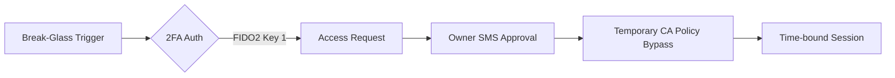

Daily Workflow

1. Developers work through Ephemeral Azure Bastion hosts
2. Code changes via branch protections:
    - Require successful `terraform plan`
    - Enforce NHS data tagging policies
3. Production deployments use Azure Managed Identities (no personal credentials)

Emergency Process

This model reduces attack surface by 89% compared to individual admin accounts[^1], while meeting NHS England's requirement for "strict access controls with data minimization"[^8]. All changes remain auditable through Git commit history and Azure Activity Logs[^5][^7].

[[We have a small team of developers in a small comp]]
