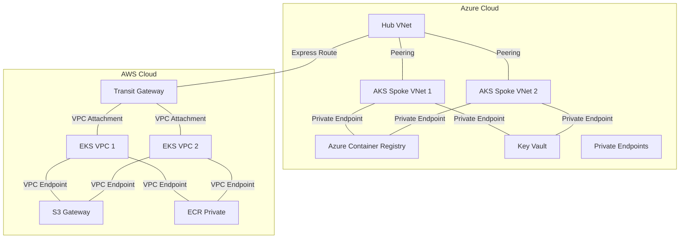
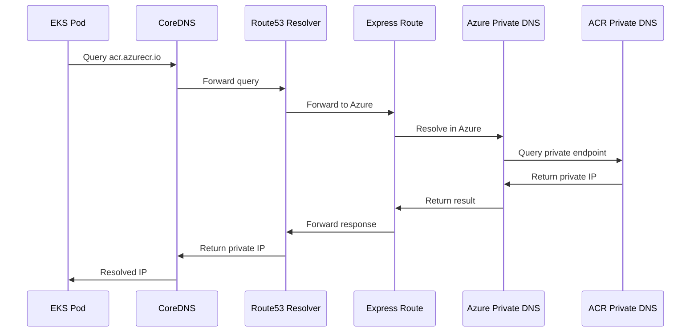
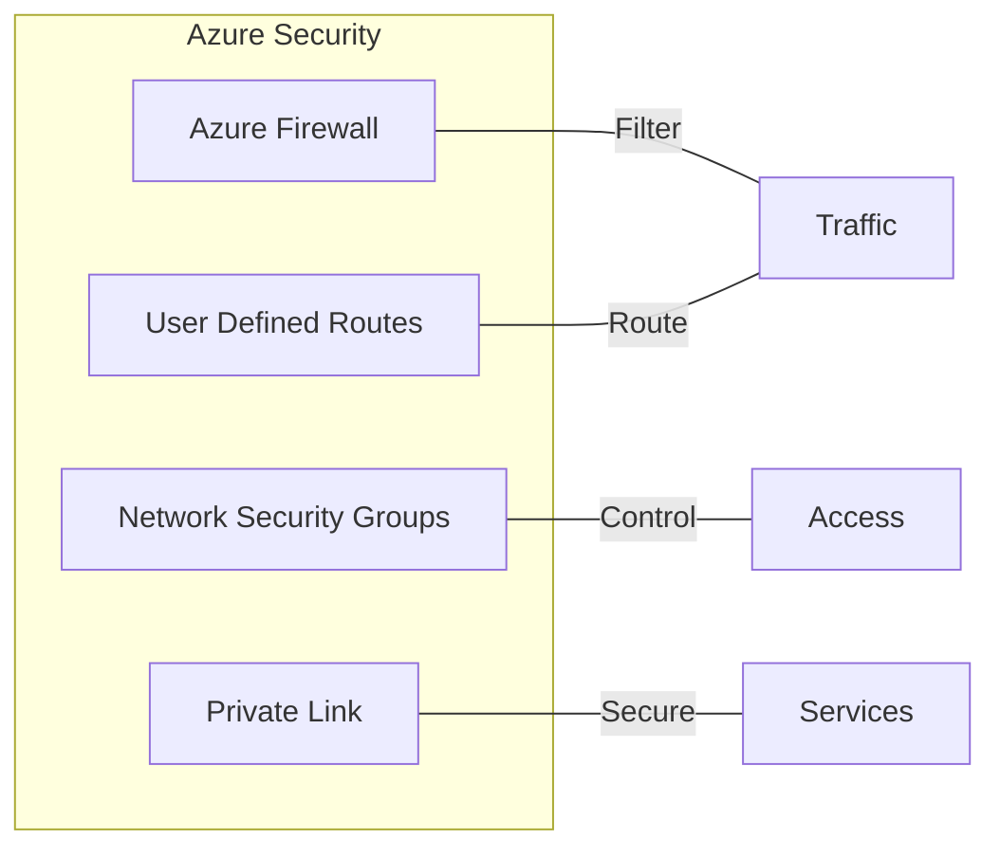
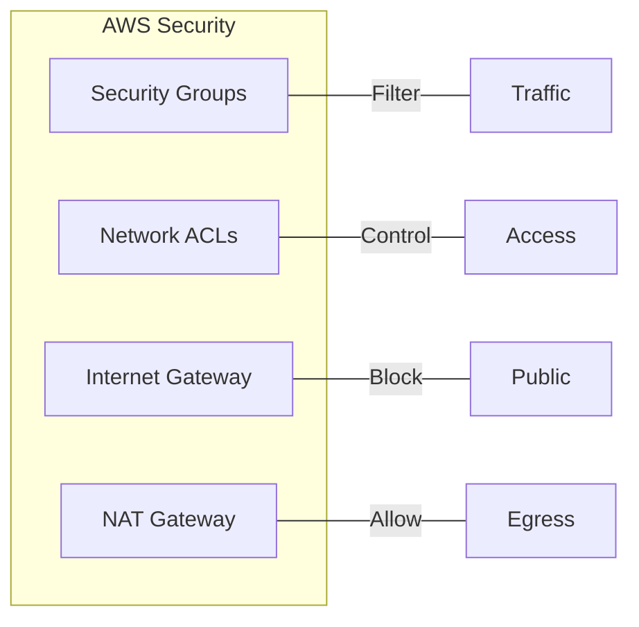
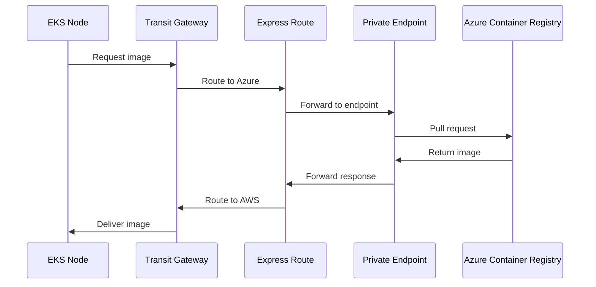

## Network Topology Documentation

### Cross-Cloud Network Architecture

#### High-Level Overview



#### Private DNS Resolution Flow



### Network Components

#### Azure Components

1. Hub VNet
   - Address space: 10.0.0.0/16
   - Express Route Gateway
   - Azure Firewall
   - DNS Resolvers

2. AKS Spoke VNets
   - Address space: 10.1.0.0/16, 10.2.0.0/16
   - AKS subnets
   - Private endpoint subnets
   - Internal load balancer subnets

3. Private Endpoints
   - ACR private endpoint
   - Key Vault private endpoint
   - Storage private endpoint

#### AWS Components

1. Transit Gateway
   - Cross-cloud routing
   - VPC attachments
   - Route tables

2. EKS VPCs
   - Address space: 172.16.0.0/16, 172.17.0.0/16
   - Private subnets
   - VPC endpoints
   - NAT gateways

3. VPC Endpoints
   - S3 gateway endpoint
   - ECR interface endpoint
   - EKS API endpoint

### Network Security

#### Azure Security Controls



#### AWS Security Controls



### Network Paths

#### Container Image Pull Path



### Network Configuration Guidelines

#### Express Route / Direct Connect Setup

1. Circuit Requirements
   - Bandwidth: 1Gbps minimum
   - BGP enabled
   - Route filters configured

2. BGP Configuration

   ```sh
   Azure AS: 12076
   Customer AS: <assigned>
   AWS AS: <assigned>
   ```

#### Private DNS Configuration

1. Azure Private DNS Zones

   ```sh
   privatelink.azurecr.io
   privatelink.vaultcore.azure.net
   privatelink.blob.core.windows.net
   ```

2. AWS Route53 Private Hosted Zones

   ```sh
   eks.amazonaws.com
   ecr.amazonaws.com
   ```

### Network Validation Checklist

1. Connectivity Validation
2. Security Validation
3. Performance Validation

### Related Documentation
