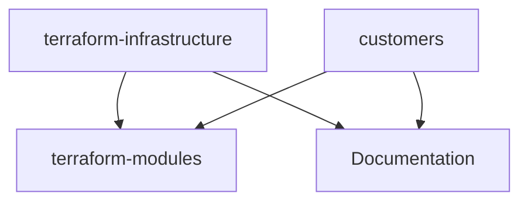
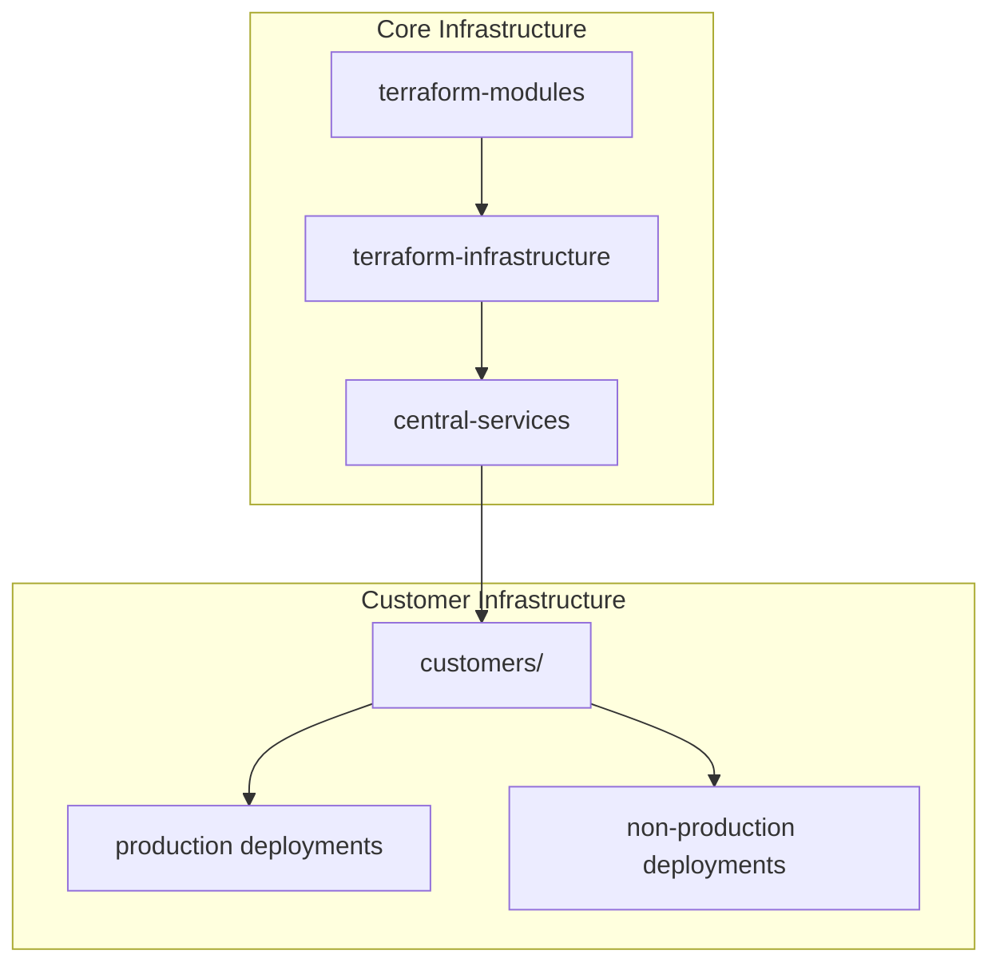
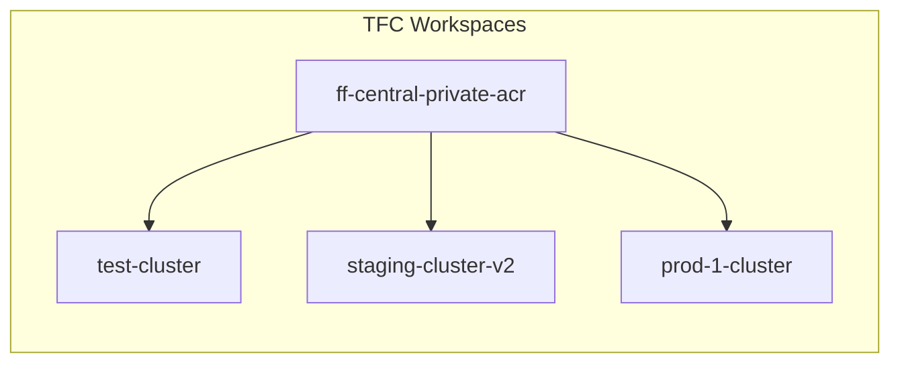
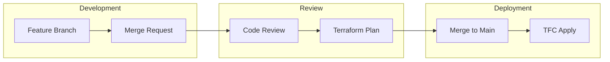

## Repository Dependencies

### Repository Overview

#### Infrastructure Repositories

1. terraform-infrastructure

   ```mermaid
   graph TB
     subgraph terraform-infrastructure
       prod[production/]
       nonprod[non-production/]
       sandbox[sandbox/]
       modules[modules/]
     end
     
     subgraph production
       central[central-services/]
       prod_infra[fitfile-production/]
       customers[customers/]
     end
     
     subgraph non-production
       nonprod_infra[fitfile-non-production-infrastructure/]
     end
     
     subgraph sandbox
       eks_private[terraform-aws-eks-private/]
       leon_test[leon-test-cluster/]
       uhb_sandbox[uhb_sandbox/]
     end
     
     prod --> central
     prod --> prod_infra
     prod --> customers
     nonprod --> nonprod_infra
     sandbox --> eks_private
     sandbox --> leon_test
     sandbox --> uhb_sandbox
   ```

#### Repository Hierarchy



### Repository Details

#### 1. Infrastructure Core

##### terraform-infrastructure/

- Purpose: Main infrastructure repository
- Dependencies:
  - terraform-modules (for reusable components)
  - Documentation (for implementation guides)
- Contains:

  ```sh
  ├── production/
  │   ├── central-services/
  │   │   ├── hcp/
  │   │   └── tfc/
  │   └── fitfile-production/
  ├── non-production/
  │   └── fitfile-non-production-infrastructure/
  └── sandbox/
      ├── terraform-aws-eks-private/
      ├── leon-test-cluster/
      └── uhb_sandbox/
  ```

#### 2. Customer Deployments

##### customers/

- Purpose: Customer-specific infrastructure
- Dependencies:
  - terraform-infrastructure (for core setup)
  - terraform-modules (for standardized components)
- Contains:

  ```sh
  ├── uhb-wmsde-prod/
  │   └── uhb-prod-aks/
  └── other-customers/
  ```

#### 3. Reusable Components

##### terraform-modules/

- Purpose: Shared Terraform modules
- Dependencies: None (base repository)
- Used by:
  - terraform-infrastructure
  - customers
- Contains:

  ```sh
  ├── aws/
  │   ├── eks/
  │   └── networking/
  ├── azure/
  │   ├── aks/
  │   └── networking/
  └── common/
      └── monitoring/
  ```

### Dependency Flows

#### Infrastructure Flow



#### Deployment Flow



### Repository Access Controls

| Repository | Access Level | Teams |
|------------|-------------|-------|
| terraform-infrastructure | Protected | Infrastructure Team |
| terraform-modules | Protected | Infrastructure Team |
| customers/ | Protected | Infrastructure Team, Customer Teams |
| Documentation | Write | All Teams |

### Workspace Dependencies

#### Production Workspaces

- ff-central-private-acr
  - Dependencies: None (root infrastructure)
  - Required by: All other workspaces
- prod-1-cluster
  - Dependencies:
    - ff-central-private-acr
    - central-services

#### Non-Production Workspaces

- test-cluster
  - Dependencies:
    - ff-central-private-acr
    - central-services
- staging-cluster-v2
  - Dependencies:
    - ff-central-private-acr
    - central-services

#### Sandbox Workspaces

- eks-private-sandbox
  - Dependencies:
    - ff-central-private-acr (optional)
    - central-services (optional)

### GitOps Workflow



### Related Documentation
