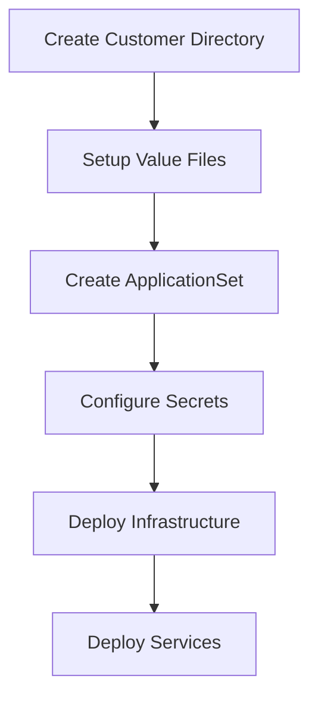

## Customer Management and Multi-Tenancy

### 1. Current Customer Handling

#### Current Multi-Tenant Architecture

1. Customer Isolation

```yaml
# Each customer has:
ffnodes/
├── <customer>/
│   ├── prod/
│   │   ├── templates/           # ArgoCD ApplicationSet
│   │   └── values/             # Customer-specific values
│   │       ├── databases/      # Database configuration
│   │       ├── ffcloud/        # Main service config
│   │       ├── fitconnect/     # Data connector config
│   │       └── frontend/       # UI configuration
│   └── staging/               # Staging environment
```

2. Value Overrides
   - Each service has two value files:
     - `app-config.yaml`: Application-specific settings
     - `infra-config.yaml`: Infrastructure settings
   - Global shared values in `shared-secrets-values.yaml`

3. Namespace Isolation

```yaml
# Each customer gets:
- Dedicated namespace
- Isolated storage resources
- Separate ArgoCD ApplicationSet
```

#### Limitations of Current Approach

1. Configuration Duplication
   - Common configurations repeated across customer directories
   - No clear inheritance mechanism for shared settings
   - Risk of configuration drift

2. Maintenance Overhead
   - Each customer requires multiple value files
   - Changes to core configuration require updates in multiple places
   - No standardized way to apply global changes

3. Scalability Issues
   - Adding new customers requires significant manual setup
   - No templating for customer onboarding
   - Complex value file management

### 2. ArgoCD Integration

#### Current ArgoCD Setup

1. ApplicationSet Structure

```yaml
apiVersion: argoproj.io/v1alpha1
kind: ApplicationSet
metadata:
  name: kch
  namespace: argocd
spec:
  generators:
    - list:
        elements:
          - serviceName: databases
            values:
              appConfig: /ffnodes/empty-values.yaml
              infraConfig: /ffnodes/kch/prod/values/databases/infra-config.yaml
          # ... other services
  template:
    metadata:
      name: 'kch-{{serviceName}}'
      namespace: kch
    spec:
      source:
        path: charts/{{serviceName}}
        repoURL: https://gitlab.com/fitfile/deployment.git
        targetRevision: latest-release
```

2. Sync Policy

```yaml
syncPolicy:
  automated:
    prune: true
    selfHeal: true
  syncOptions:
    - Validate=false
    - CreateNamespace=true
    - PrunePropagationPolicy=foreground
    - PruneLast=true
  retry:
    limit: 5
    backoff:
      duration: 5s
      factor: 2
      maxDuration: 3m
```

3. Value File Management

```yaml
helm:
  valueFiles:
    - '{{values.appConfig}}'
    - '{{values.infraConfig}}'
    - /ffnodes/kch/prod/values/shared-secrets-values.yaml
```

#### Deployment Process

1. Initial Deployment
   - ArgoCD ApplicationSet creates applications per service
   - Each service uses customer-specific values
   - Shared secrets applied across all services

2. Updates
   - Changes to `latest-release` branch trigger sync
   - Automated pruning of removed resources
   - Retry mechanism for failed deployments

3. Environment Management
   - Production and staging environments in separate directories
   - Different value files per environment
   - Consistent application structure across environments

#### Customer Onboarding Flow

1. Current Process



2. Required Steps
   - Create customer directory structure
   - Copy and customize value files
   - Setup ArgoCD ApplicationSet
   - Configure authentication
   - Deploy infrastructure components
   - Deploy application services

Would you like me to continue with the deep dive into key templates next?

## III. Deep Dive into Key Templates

### 1. Deployment Template Analysis

#### Key Features of Deployment Template

1. Multi-Container Pod Design

```yaml
# Three containers in single pod:
- Main application container
- CLI container
- Scheduler container

# Init container for database migrations
initContainers:
  - name: {{ include "ffcloud.fullname" . }}-init-db
    command: ['/bin/ash']
    args:
      - yarn db:migrate:remote:up
      - yarn run init
```

2. Configuration Management

```yaml
# Configuration through projected volumes
volumes:
  - name: config
    projected:
      sources:
        - configMap:
            name: {{ include "ffcloud.appconf.name" . }}
  - name: cli-config
  - name: scheduler-config
```

3. Environment Handling

```yaml
env:
  - name: NODE_ENV
    value: "{{ .Values.global.app.nodeEnv }}"
  - name: FITFILE_ENV
    value: "{{ .Values.global.app.fitfileEnv | default "production" }}"
```

### 2. Helper Templates Analysis

#### Key Helper Functions

1. Name Generation

```golang
{{- define "ffcloud.fullname" -}}
{{- if .Values.fullnameOverride -}}
{{- .Values.fullnameOverride | trunc 63 | trimSuffix "-" -}}
{{- else -}}
{{- printf .Release.Name | trunc 63 | trimSuffix "-" -}}
{{- end -}}
{{- end -}}
```

2. Configuration Merging

```golang
{{- define "ffcloud.appconf" -}}
{{- $appConfig := dict
  "eventDbName" .Values.global.db.events.name
  "auditDbName" .Values.global.db.audit.name
  "port" .Values.containerPort
  "logLevel" .Values.global.app.logLevel
-}}
{{ mergeOverwrite $appConfig dict .Values.appConfig | toYaml }}
{{- end -}}
```

### 3. Vault Integration Template

#### Vault Integration Features

1. Secret Injection

```yaml
vault.hashicorp.com/agent-inject: "true"
vault.hashicorp.com/role: {{ required ".Values.vault.role is required" .Values.vault.role}}
```

2. Secret Templates

```yaml
# MongoDB Secret Template
vault.hashicorp.com/agent-inject-template-mongodb.json: |
  {{ with secret "{{.Values.vault.path}}" -}}
    {
      "password":"{{ .Data.data.mongodb_password }}",
      "username":"{{ .Data.data.mongodb_username }}"
    }
  {{- end }}
```

3. Path Configuration

```yaml
vault.hashicorp.com/secret-volume-path-mongodb.json: "/secrets"
vault.hashicorp.com/secret-volume-path-postgresql.json: "/secrets"
```

#### Areas for Improvement

1. Template Duplication
   - Similar configuration blocks repeated across templates
   - Could be refactored into reusable named templates

2. Configuration Complexity
   - Multiple configuration sources (values, vault, configmaps)
   - Complex template logic for merging configurations

3. Error Handling
   - Limited validation of required values
   - No explicit error messages for missing configurations

4. Documentation
   - Limited inline documentation
   - Complex template logic not well explained

Would you like me to continue with the recommendations for improvement next?

## Values File Analysis: ff-a/values.yaml

### 1. Core Configuration Structure

#### Node Identity and Environment

```yaml
namespace: ff-a
deploymentKey: prod-1
host: app.fitfile.net
applicationVaultPath: ff-a-application
```

- Defines a production deployment for "FF A" node
- Uses dedicated namespace `ff-a`
- Maps to domain `app.fitfile.net`
- Links to Vault path `ff-a-application` for secrets

#### Global Settings

```yaml
global:
  fitConnectCode: "FITConnect A"
  sleuth:
    enabled: true
    environment: production
  dbSuffix: "_a"
```

- Sets database suffix for multi-tenant isolation
- Enables monitoring via Sleuth
- Defines FITConnect instance identifier

### 2. Service Configurations

#### FFCloud Service Configuration

```yaml
ffcloud:
  sleuth:
    enabled: true
  appConfig:
    ffCloudCode: FFCloud_Prod_1
    machineToUserConfig:
      opsUserId: "auth0|6323240d82155703a684c43f"
    fitConnectHosts:
      - fitConnectCode: FITConnect A
        fitConnectUri: https://app.fitfile.net/fitconnect
      - fitConnectCode: FITConnect B
        fitConnectUri: https://app2.fitfile.net/fitconnect
      - fitConnectCode: FITConnect C
        fitConnectUri: https://app3.fitfile.net/fitconnect
```

This configures:

- Multi-node connectivity between FITConnect instances
- Operations user for automated tasks
- Service endpoints for inter-node communication

#### Storage Configuration

```yaml
minio:
  persistence:
    size: 64Gi
    existingClaim: pvc-ff-a-minio

postgresql:
  primary:
    persistence:
      size: 8Gi
```

- Configures persistent storage for data
- References existing MinIO PVC for data continuity
- Sets PostgreSQL storage size

### 3. ArgoCD Integration

#### Application Configuration

```yaml
argocdApp:
  targetRevision: "latest-release"
```

This values file is used by ArgoCD in multiple ways:

1. ApplicationSet Reference

```yaml
# Typical ApplicationSet template using these values
spec:
  generators:
    - list:
        elements:
          - serviceName: ffcloud-service
            values:
              appConfig: /ffnodes/fitfile/ff-a/values.yaml
```

2. Service Deployment
- Values are merged with base service values
- Used across multiple services in the node:
  - FFCloud Service
  - FitConnect
  - Frontend
  - Databases
  - Workflow Engine

3. Sync Policy
- Uses `latest-release` tag for version control
- ArgoCD monitors this tag for updates

### 4. Certificate Management

```yaml
certs:
  certificates:
    - name: fitfile-ff-a
      namespace: ff-a
      dnsNames: ["app.fitfile.net"]
      secretName: cloudflare-tls
    # ... other certificates
```

- Manages SSL certificates via cert-manager
- Integrates with Cloudflare for TLS
- Defines certificates for all related services

### 5. Extra Deployments

The values file includes additional deployments:

```yaml
extraDeploy:
  - apiVersion: apps/v1
    kind: Deployment
    metadata:
      namespace: ff-a
      name: pgweb
```

- Deploys pgweb for database management
- Includes service and ingress configurations
- Uses Vault for credential management

### 6. Integration Points

#### 1. Vault Integration

```yaml
extraVaultSecrets:
  - secretName: "sleuth-secret"
    secretNamespace: "ff-a"
    vaultPath: "ff-a-application"
```

- Maps Vault secrets to Kubernetes secrets
- Used by services for credential management
- Integrated with ArgoCD for secret handling

#### 2. Service Interconnection

```yaml
ffcloud:
  appConfig:
    fitConnectHosts:
      - fitConnectCode: FITConnect A
        fitConnectUri: https://app.fitfile.net/fitconnect
```

- Defines service mesh configuration
- Enables cross-node communication
- Maps service endpoints

#### 3. Workflow Configuration

```yaml
workflowTemplates:
  sleuth:
    enabled: true
    environment: production
```

- Configures Argo Workflows integration
- Enables monitoring for workflows
- Sets environment-specific workflow configs

### 7. Usage Flow

1. ArgoCD Application Creation

   ```yaml
   # ArgoCD reads this values file through:
   spec:
     source:
       path: charts/ffcloud-service
       repoURL: https://gitlab.com/fitfile/deployment.git
       targetRevision: latest-release
       helm:
         valueFiles:
           - /ffnodes/fitfile/ff-a/values.yaml
   ```

2. Service Deployment
   - Values merged with base chart values
   - Used to render Kubernetes manifests
   - Applied to cluster by ArgoCD

3. Secret Management
   - Vault paths configured
   - Secrets injected into pods
   - Certificates managed via cert-manager

4. Monitoring Integration
   - Sleuth configuration applied
   - Metrics collection enabled
   - Environment tagging for observability

This values file serves as the central configuration for the "FF A" node, controlling everything from basic service configuration to complex multi-node interactions and security settings. It's designed to work within ArgoCD's GitOps workflow while maintaining separation of concerns between different deployment environments.

I'll map out the complete configuration data structure for FF A node by analyzing how the values cascade and combine.

## FF A Node Configuration Structure

### 1. Infrastructure Configuration

```yaml
# Core Infrastructure
infrastructure:
  namespace: ff-a
  environment: production
  deployment_key: prod-1
  
  # Networking
  domains:
    primary: app.fitfile.net
    pgweb: prod-pgweb.fitfile.net
    argo_workflows: argo-workflows.fitfile.net
    access_control: ac.fitfile.net

  # Storage Configuration
  storage:
    minio:
      persistence:
        size: 64Gi
        claim_name: pvc-ff-a-minio
        type: existingClaim
    
    postgresql:
      persistence:
        size: 8Gi
        debug_enabled: true
      database_suffix: "_a"  # from global.dbSuffix
```

### 2. Service Configuration

```yaml
# Service Definitions
services:
  ffcloud:
    code: FFCloud_Prod_1
    monitoring:
      sleuth:
        enabled: true
        environment: production
    
    # Inter-service Communication
    connections:
      fitconnect:
        - code: "FITConnect A"
          uri: "https://app.fitfile.net/fitconnect"
          crypto_uri: ""
        - code: "FITConnect B"
          uri: "https://app2.fitfile.net/fitconnect"
          crypto_uri: ""
        - code: "FITConnect C"
          uri: "https://app3.fitfile.net/fitconnect"
          crypto_uri: ""
    
    # Machine User Configuration
    machine_users:
      ops:
        id: "auth0|6323240d82155703a684c43f"
        allowed_client_ids:
          - "TTFRd0c2fXEdXP2RS2aDHCT2h51Twxut"

  frontend:
    features:
      query_plan:
        update: enabled
        create: enabled
        delete: enabled
    monitoring:
      sleuth:
        enabled: true
        environment: production
```

### 3. Security Configuration

```yaml
# Security Settings
security:
  vault:
    path: ff-a-application
    
  certificates:
    main:
      name: fitfile-ff-a
      namespace: ff-a
      domains: ["app.fitfile.net"]
      provider: cloudflare
      secret_name: cloudflare-tls
    
    additional_certs:
      - name: argocd
        namespace: argocd
        domains: ["argocd.fitfile.net"]
      - name: argo-workflows
        namespace: argo
        domains: ["argo-workflows.fitfile.net"]
      # ... other certificates

  # Vault Secret Mappings
  secret_mappings:
    postgresql:
      secret_name: pg-web
      path: ff-a-application
      template: >-
        postgres://{{username}}:{{password}}@{{host}}:5432/fitconnect?sslmode=disable
    
    sleuth:
      secret_name: sleuth-secret
      namespace: ff-a
      path: ff-a-application
      key_mapping:
        apiKey: sleuth_api_key
```

### 4. Workflow Configuration

```yaml
# Workflow Engine Settings
workflows:
  argo:
    enabled: true
    tls:
      secret: cloudflare-tls
    ingress:
      enabled: true
      host: argo-workflows.fitfile.net
    
  templates:
    sleuth:
      enabled: true
      environment: production
```

### 5. Additional Components

```yaml
# Database Management UI
pgweb:
  deployment:
    replicas: 1
    image: sosedoff/pgweb:0.16.2
    port: 8081
    probes:
      readiness:
        initial_delay: 15
        period: 15
      liveness:
        initial_delay: 30
        period: 15
  
  service:
    type: ClusterIP
    port: 80
  
  ingress:
    enabled: true
    host: prod-pgweb.fitfile.net
    tls_enabled: true
```

### 6. Cross-Node Integration

```yaml
# Node Integration Configuration
node_integration:
  connected_nodes:
    - id: ff-b
      domain: app2.fitfile.net
      namespace: ff-b
    - id: ff-c
      domain: app3.fitfile.net
      namespace: ff-c
    
  shared_services:
    - name: barts
      domain: barts.fitfile.net
      namespace: barts
    - name: primary-care
      domain: primary-care.fitfile.net
      namespace: primary-care
```

### 7. Monitoring & Observability

```yaml
# Monitoring Configuration
monitoring:
  sleuth:
    global:
      enabled: true
      environment: production
    
    service_configs:
      ffcloud:
        enabled: true
        deployment_name: ffcloud
      frontend:
        enabled: true
      workflows:
        enabled: true
```

This configuration structure:

1. Isolates the FF A node in its own namespace
2. Maintains its own storage with specific PVCs
3. Connects to other nodes (B and C) for data sharing
4. Uses Vault for secret management
5. Implements comprehensive monitoring
6. Provides database management tools
7. Manages certificates for all required domains

The structure ensures:

- Clear separation from other nodes
- Secure secret management
- Scalable storage configuration
- Comprehensive monitoring
- Inter-node communication
- Proper access control

This represents the complete operational configuration for the FF A node, combining values from multiple sources into a cohesive deployment configuration.
