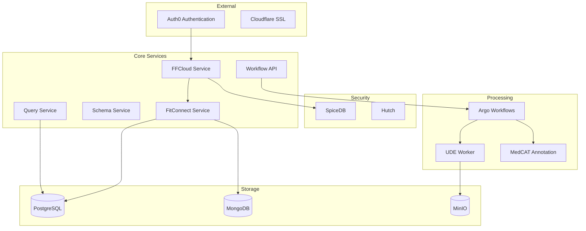

## Data Architecture Analysis Report

### 1. Data Entity Identification

#### Core Entities
1. Tenant
   - Primary entity representing organizational units
   - Referenced in authorization patterns (e.g., `fitfile/tenant:$TENANT_ID`)
   - Used for multi-tenancy data isolation

2. Project
   - Represents data analysis projects
   - Has relationships with Tenants and Users
   - Contains access control definitions

3. User
   - Represents system users
   - Has role-based relationships with Tenants and Projects
   - Referenced as `fitfile/user:"$USER_ID"`

4. Dataset
   - Core data structure for storing and processing data
   - Has associated schema definitions
   - Supports multiple formats (JSON, CSV)

5. Schema
   - Defines structure of datasets
   - Contains field definitions with data types and identifier types
   - Used for validation and processing

#### Domain-Specific Terminology
- `data_source_manager`: Role for managing data sources
- `data_set_manager`: Role for managing datasets
- `project_admin`: Administrative role for projects
- `project_host`: Entity hosting a project
- `project_data_partner`: Entity partnering in data sharing

### 2. Data Representation Analysis

#### Dataset Representation

```json
{
  "field_name": {
    "data_type": "STRING",
    "identifier_type": "NON_ID"
  }
}
```

Key characteristics:

- Uses JSON as primary data format
- Supports compressed formats (.gz)
- Includes metadata about identifier types for privacy
- Separates schema from data for flexibility

#### Storage Systems
6. PostgreSQL
   - Used for structured data
   - Primary database: `fitconnect`
   - Dedicated backup mechanisms

7. MongoDB
   - Used for document storage
   - Configured for high availability (ReplicaSet)
   - Metrics and monitoring enabled

8. MinIO
   - Object storage for large datasets
   - Organized buckets: temp, output, integration-tests, uploads
   - Used for workflow artifacts

### 3. Relationship Mapping

#### Direct Relationships

```sh
Tenant -> User (organization_admin, data_source_manager, data_set_manager)
Project -> Tenant (project_host)
Project -> User (project_admin, data_user)
```

#### Implementation Patterns
9. Authorization Relationships
   - Implemented through SpiceDB
   - Uses relationship tuples
   - Supports attribute-based access control (ABAC)

10. Data Access Relationships

   ```json
   {
     "allowed_result_types": {
       "Identifiable": "Identifiable"
     }
   }
   ```

### 4. Schema Analysis

#### Schema Implementation
11. Explicit Schema Definitions
   - JSON Schema based
   - Includes data types and identifier types
   - Used for validation and processing

12. Schema Evolution
   - Schemas stored separately from data
   - Support for schema versioning
   - Schema transformation in workflows

#### Validation
- Schema validation during data processing
- Type checking for fields
- Identity type validation for privacy

### 5. Immutability Assessment

#### Data Processing
- Uses temporary buckets for intermediate results
- Implements copy-on-write through workflow stages
- Maintains immutable input datasets

#### Storage
- Read-only source data
- Versioned output artifacts
- Immutable workflow results

### 6. Data Access Patterns

#### Service Layer
13. FFCloud Service
   - REST API endpoints
   - GraphQL interface
   - Role-based access control

14. Workflow API
   - Pipeline execution
   - Data transformation
   - Result management

#### Optimization Strategies
15. Caching
   - MinIO for artifact caching
   - MongoDB ReplicaSet for read scaling
   - PostgreSQL for transactional data

16. Performance Considerations
   - Supports large datasets (100,000+ records)
   - Configurable timeouts based on data size
   - Compression for large transfers

### Recommendations

17. Schema Management
   - Implement formal schema versioning
   - Add schema migration tooling
   - Document schema evolution patterns

18. Data Access Optimization
   - Add caching layer for frequently accessed data
   - Implement connection pooling for databases
   - Consider read replicas for scaling

19. Security Enhancements
   - Implement field-level encryption
   - Add audit logging for data access
   - Enhance access control granularity

20. Performance Improvements
   - Add indexes for common query patterns
   - Implement data partitioning strategy
   - Optimize large dataset processing

The architecture shows a strong focus on data privacy, scalability, and maintainability. The separation of concerns between data storage, processing, and access control is well-implemented. The use of modern technologies and practices (Kubernetes, Helm, object storage) provides a solid foundation for future growth.

## Domain-Driven Analysis Report

### I. Domain Understanding & Mapping

#### Core Domain Entities

1. Dataset (Primary Entity)
   - Definition: Represents a collection of healthcare data with a defined schema
   - Properties:
     - `dataset_id`: Unique identifier
     - `schema`: Associated data structure definition
     - `data_type`: Type of data (STRING, etc.)
     - `identifier_type`: Privacy classification (NON_ID, etc.)
   - Behaviors:
     - Validation against schema
     - Transformation (anonymization, annotation)
     - Loading/persistence

2. Project (Aggregate Root)
   - Definition: Represents a data analysis initiative
   - Properties:
     - `project_id`: Unique identifier
     - Associated tenants and users
   - Relationships:
     - `project_host`: Tenant hosting the project
     - `project_data_partner`: Tenant participating in data sharing
     - `project_admin`: User with administrative rights

3. Tenant (Aggregate Root)
   - Definition: Organizational unit with data access controls
   - Properties:
     - `tenant_id`: Unique identifier
   - Relationships:
     - `organisation_admin`: Administrative users
     - `data_source_manager`: Users managing data sources
     - `data_set_manager`: Users managing datasets

4. Workflow (Process Entity)
   - Definition: Data processing pipeline definition
   - Types:
     - Query workflows
     - Validation workflows
     - Anonymization workflows
     - Annotation workflows
   - Properties:
     - Input/output artifacts
     - Processing parameters
     - Validation rules

#### Bounded Contexts

1. Data Processing Context
   - Responsibilities:
     - Dataset loading and validation
     - Schema management
     - Data transformation
   - Key Entities:
     - Dataset
     - Schema
     - Validation Summary
   - Services:
     - Dataset Validator
     - Data Report Generator

2. Security & Privacy Context
   - Responsibilities:
     - Access control
     - Data anonymization
     - Audit logging
   - Key Entities:
     - UDE (User Data Encryption) Strategy
     - Access Permissions
     - Audit Records

3. Project Management Context
   - Responsibilities:
     - Project lifecycle
     - User role management
     - Multi-tenancy
   - Key Entities:
     - Project
     - Tenant
     - User Roles

#### Aggregates & Consistency

4. Project Aggregate

   ```sh
   Project
     ├── Host Tenant
     ├── Data Partner Tenants
     ├── Project Admins
     └── Data Users
   ```

   Consistency rules:

   - Project must have at least one host tenant
   - Project admins must belong to host tenant
   - Data access requires explicit permissions

5. Dataset Aggregate

   ```sh
   Dataset
     ├── Schema
     ├── Validation Summary
     └── Processing History
   ```

   Consistency rules:

   - Dataset must conform to schema
   - Transformations must maintain data integrity
   - Privacy rules must be enforced

### II. Usage Patterns

#### Object Creation & Validation

6. Dataset Creation
   - Through data loading workflows
   - Schema validation on creation
   - Privacy classification enforcement

7. Workflow Creation
   - Template-based instantiation
   - Parameter validation
   - Resource allocation

#### Services & Coordination

8. Core Services
   - `FFCloud Service`: Main application service
   - `Schema Service`: Schema management
   - `Scheduler Service`: Workflow orchestration
   - `Query Service`: Data query execution

9. Integration Services
   - `MedCAT Annotation`: Medical concept annotation
   - `UDE Worker`: Data encryption/anonymization
   - `Validation Service`: Data quality checks

#### Domain Events

10. Workflow Events
   - Workflow start/completion
   - Validation results
   - Processing stage transitions

11. Data Events
   - Dataset creation/modification
   - Schema updates
   - Access control changes

### III. Architecture & Integration

#### Context Map

```sh
┌─────────────────────┐      ┌──────────────────┐
│  Project Context    │      │  Security Context │
│  - Project Mgmt    │◄────►│  - Access Control │
│  - User Roles      │      │  - Privacy Rules  │
└─────────┬──────────┘      └──────────┬───────┘
          │                            │
          ▼                            ▼
┌─────────────────────┐      ┌──────────────────┐
│   Data Context      │      │ Processing Context│
│  - Datasets        │◄────►│  - Workflows      │
│  - Schemas         │      │  - Transformations│
└─────────────────────┘      └──────────────────┘
```

#### Shared Kernel

12. Core Components
   - Schema definitions
   - Privacy classifications
   - Access control models

13. Infrastructure
   - MinIO for artifact storage
   - MongoDB for document storage
   - PostgreSQL for relational data

#### Anti-Corruption Layers

14. Data Access Layer
   - Abstracts database implementations
   - Enforces access control
   - Manages data transformations

15. API Gateway
   - Request validation
   - Authentication/authorization
   - Rate limiting

### IV. Navigation Guide

#### Strategic Components

16. Core Domain Files
   - `charts/ffcloud-service/`: Main service implementation
   - `charts/workflows-api/`: Workflow definitions
   - `charts/spicedb/`: Access control implementation

17. Key Configuration
   - `charts/databases/`: Data storage configuration
   - `charts/local-dev/`: Development environment setup
   - `workflows/src/`: Workflow templates and definitions

#### Implementation Patterns

18. Data Structures
   - Heavy use of JSON for data exchange
   - Schema-based validation
   - Immutable data transformations

19. Control Flow
   - DAG-based workflow execution
   - Event-driven architecture
   - Asynchronous processing

20. Object-Oriented Patterns
   - Service-oriented architecture
   - Clear separation of concerns
   - Dependency injection

The codebase demonstrates a strong focus on data privacy, scalability, and maintainability. The domain model effectively separates concerns while maintaining clear boundaries between contexts. The use of workflow templates and configuration-driven development allows for flexible deployment and maintenance.

## 1. Data Analysis

### A. Core Data Entities

#### Primary Data Entities

1. Dataset
   - Core data structure for healthcare information
   - Properties:

     ```json
     {
       "field_name": {
         "data_type": "STRING|INTEGER|NHS_NUMBER",
         "identifier_type": "DIRECT|NON_ID|INDIRECT"
       }
     }
     ```

   - Stored in JSON/Parquet formats
   - Supports compression (GZIP)

2. Schema
   - Defines dataset structure
   - Validation rules
   - Field classifications:
     - Direct identifiers (e.g., NHS number)
     - Indirect identifiers
     - Non-identifiers
   - Data types and privacy annotations

3. Project
   - Represents data analysis initiative
   - Relationships:

     ```sh
     project_host -> tenant
     project_admin -> user
     project_data_partner -> tenant
     data_user -> user
     ```

   - Access control definitions

4. Tenant
   - Multi-tenancy unit
   - Roles:
     - organisation_admin
     - data_source_manager
     - data_set_manager

5. User
   - System user entity
   - Associated roles and permissions
   - Access levels for data handling

#### Data Representation

#### Storage Architecture

6. PostgreSQL
   - Primary relational database
   - Databases:
     - `fitconnect`: Main application database
     - `spicedb`: Access control
     - `argoworkflows`: Workflow state
   - Persistence:
     - Size: 8-25Gi
     - High availability configuration
     - Daily backups at 9pm

7. MongoDB
   - Document store
   - ReplicaSet architecture
   - Used for:
     - Events database
     - Audit database
     - Schema storage
   - Features:
     - Metrics enabled
     - Monitoring via ServiceMonitor
     - Backup management

8. MinIO
   - Object storage
   - Buckets:
     - `temp`: Temporary storage
     - `output`: Results
     - `integration-tests`: Test data
     - `uploads`: User uploads
   - Features:
     - Compression support (GZIP)
     - Multiple formats (JSON, Parquet)

#### Data Access Patterns

9. Dataset Operations

   ```yaml
   - Load: SQL -> JSON/Parquet
   - Validate: Schema conformance
   - Transform: Anonymization/Encryption
   - Store: MinIO buckets
   ```

10. Access Control

   ```yaml
   - SpiceDB relationships
   - Role-based access
   - Tenant isolation
   - Data type permissions
   ```

11. Workflow Data Flow

   ```yaml
   Input -> Validation -> Processing -> Output
   - Input validation
   - Schema checking
   - Privacy enforcement
   - Result persistence
   ```

This analysis reveals a sophisticated data architecture focused on:

- Healthcare data privacy and security
- Multi-tenancy and access control
- Scalable data processing
- Immutable data transformations
- Audit and tracking capabilities

The system uses a combination of storage solutions optimized for different use cases:

- PostgreSQL for transactional data
- MongoDB for flexible document storage
- MinIO for large dataset storage
- SpiceDB for fine-grained access control

I'll help analyze the Helm codebase and provide comprehensive documentation. Let me start with the overview and core functionality.

## I. Overview and Core Functionality

### 1. Purpose and Architecture

#### Purpose

Based on the codebase analysis, this is a healthcare data processing platform (FITFILE) that:

- Manages secure data pipelines for healthcare data
- Provides data anonymization and privacy controls
- Enables multi-tenant access to healthcare datasets
- Supports workflow-based data processing

#### High-Level Architecture



#### Key Components

1. Core Services
   - `ffcloud-service`: Main application service
   - `fitconnect`: Data source connection and ELT operations
   - `workflows-api`: Data pipeline management
   - `schema-service`: Schema management
   - `query-service`: Data query execution

2. Storage Components

   ```yaml
   PostgreSQL:
     Databases:
       - fitconnect
       - spicedb
       - argoworkflows
   
   MongoDB:
     Collections:
       - events
       - audit
       - schemas
   
   MinIO:
     Buckets:
       - temp
       - output
       - integration-tests
       - uploads
   ```

3. Security Components
   - SpiceDB: Fine-grained access control
   - Auth0: Authentication
   - Hutch: Secret management

### 2. Helm Chart Structure

#### Directory Structure

```sh
helm_chart_deployment/
├── charts/
│   ├── ffcloud-service/
│   ├── fitconnect/
│   ├── frontend/
│   ├── databases/
│   ├── spicedb/
│   └── workflows-api/
├── ffnodes/
│   ├── kch/
│   │   ├── prod/
│   │   └── mn4/
│   └── stg/
│       └── sandbox/
├── workflows/
│   ├── src/
│   └── integration-tests/
└── scripts/
```

#### Subcharts Analysis

4. Database Chart (`charts/databases/`)

   ```yaml
   dependencies:
     - name: postgresql
       version: 12.7.3
       repository: https://charts.bitnami.com/bitnami
     - name: mongodb
       version: 12.1.31
       condition: global.deployMongo
     - name: minio
       version: 12.13.2
   ```

5. SpiceDB Chart (`charts/spicedb/`)

   ```yaml
   dependencies:
     - name: postgresql
       version: 15.5.15
       tags:
         - datastore
   ```

#### Values Structure

The values structure follows a hierarchical pattern:

6. Global Configuration

   ```yaml
   global:
     imagePullSecrets: []
     app:
       logLevel: info
       nodeEnv: production
       fitfileEnv: production
     db:
       audit:
         name: audit
       events:
         name: events
   ```

7. Service Configuration

   ```yaml
   service:
     type: ClusterIP
     port: 80
   
   ingress:
     enabled: true
     host: ""
   
   tls:
     enabled: true
     existingSecret: cloudflare-tls
   ```

8. Application Config

   ```yaml
   appConfig:
     resultsSqlDb: {}
     fitConnectHosts: []
     ffCloudCode: ""
     graphQLEnabled: true
     spicedb:
       insecure: false
   ```

The codebase uses a customer-specific directory structure under `ffnodes/`, with each customer having their own configuration:

```sh
ffnodes/
├── fitfile/    # Internal/development
├── wmsde/      # Customer instance
├── stg/        # Staging environment
├── kch/        # Customer instance
├── eoe/        # Customer instance
└── barts/      # Customer instance
```

Let me examine a customer configuration:

Each customer deployment is managed through:

9. A dedicated Chart in `ffnodes/<customer>/`
10. Customer-specific values in `ffnodes/<customer>/values/`
11. ArgoCD application templates in `ffnodes/<customer>/templates/`

This structure suggests a hybrid approach where:

- Core functionality is in reusable charts under `charts/`
- Customer configurations are isolated in `ffnodes/`
- ArgoCD is used for deployment orchestration

Would you like me to continue with the detailed analysis of customer management and multi-tenancy next?

### Deployment Repo

[Repo](git@gitlab.com:fitfile/deployment.git)

Has helm charts for all the Kubernetes resources we deploy.

The main thing we interact with is values.yaml files that are override variables.
