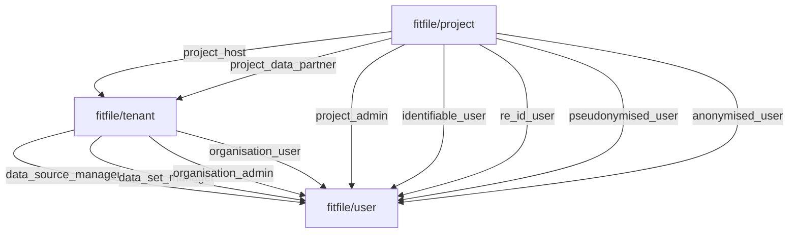

## spicedb_schema

depends_on::

```mermaid
graph TD;
    fitfile_user["fitfile/user"]
    fitfile_tenant["fitfile/tenant"]
    fitfile_project["fitfile/project"]

    fitfile_tenant -->|data_source_manager| fitfile_user
    fitfile_tenant -->|data_set_manager| fitfile_user
    fitfile_tenant -->|organisation_admin| fitfile_user
    fitfile_tenant -->|organisation_user| fitfile_user

    fitfile_project -->|project_admin| fitfile_user
    fitfile_project -->|identifiable_user| fitfile_user
    fitfile_project -->|re_id_user| fitfile_user
    fitfile_project -->|pseudonymised_user| fitfile_user
    fitfile_project -->|anonymised_user| fitfile_user

    fitfile_project -->|project_host| fitfile_tenant
    fitfile_project -->|project_data_partner| fitfile_tenant
```
