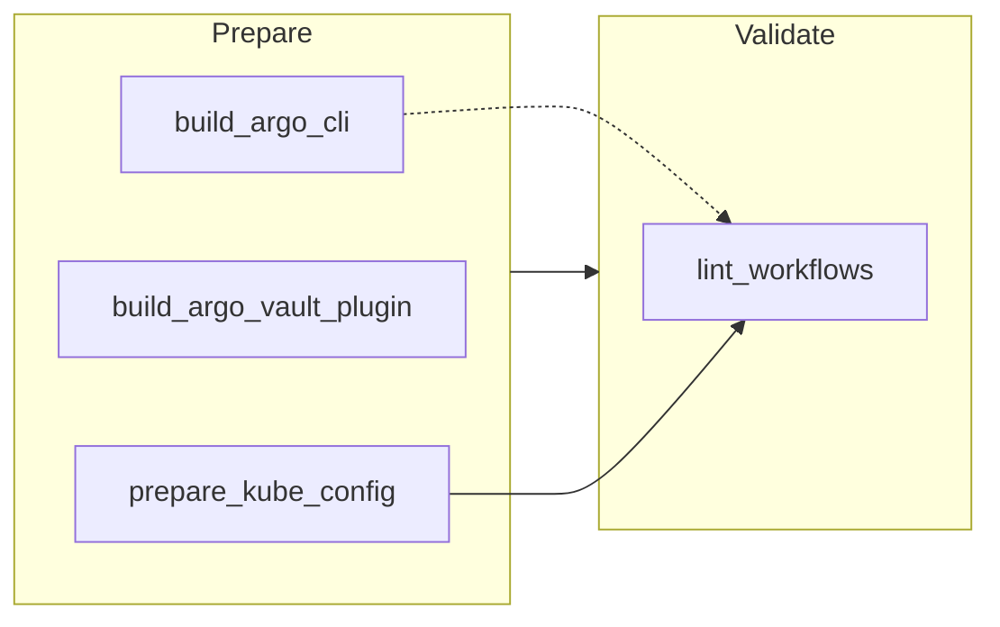
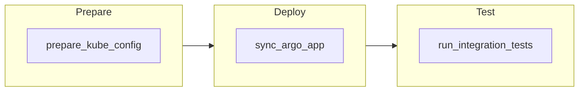

## Staging Pipeline Documentation

This document outlines the GitLab CI/CD pipeline used for deploying and testing applications in the staging environment.

### Pipeline Overview

The staging pipeline consists of three sequential stages:

1. **Prepare** - Sets up Kubernetes configuration
2. **Deploy** - Deploys applications to the staging environment via ArgoCD
3. **Test** - Runs integration tests to verify deployment

### Global Variables

The pipeline defines several global variables that apply to all jobs:

| Variable | Description |
|----------|-------------|
| `GIT_AUTH_TOKEN` | Authentication token for Git operations (uses GitLab's CI job token) |
| `FF_USE_FASTZIP` | Enables faster artifact handling |
| `ARTIFACT_COMPRESSION_LEVEL` | Sets compression level for artifacts to "fast" |
| `CACHE_COMPRESSION_LEVEL` | Sets compression level for cache to "fast" |

### Stage: Prepare

#### Job: prepare_kube_config

This job authenticates with Azure and obtains Kubernetes credentials for the AKS cluster.

**Details:**
- **Image:** `mcr.microsoft.com/azure-cli:latest`
- **Resource Group:** `staging`

**Variables:**
- `SUBSCRIPTION_ID`: Azure subscription ID
- `TENANT_ID`: Azure tenant ID
- `KUBECONFIG`: Path to store Kubernetes configuration file

**Process:**
1. Authenticates with Azure using service principal credentials
2. Retrieves AKS cluster credentials for "Fitfile-cloud-testing-aks-cluster"
3. Stores the kubeconfig file as a job artifact for use in subsequent stages

**Artifacts:**
- `kubeconfig`: Kubernetes configuration file

### Stage: Deploy

#### Job: sync_argo_app

This job uses ArgoCD to deploy applications to the staging environment.

**Details:**
- **Image:** `argoproj/argocd:v2.6.15`
- **Resource Group:** `staging`
- **Retry:** 2 attempts if failed

**Variables:**
- `ARGOCD_HOST`: ArgoCD server address (testing-argocd.fitfile.net)

**Process:**
1. Decodes base64-encoded environment-specific values (`STAGING_VALUE_OVERRIDES`)
2. Saves decoded values to `testing-values.yaml`
3. Logs into ArgoCD using credentials from environment variables
4. Updates the "testing" application with configuration values
5. Syncs the ArgoCD application, deploying resources to the Kubernetes cluster
6. Waits for the sync operation to complete

### Stage: Test

#### Job: run_integration_tests

This job runs integration tests against the deployed application using Argo Workflows.

**Details:**
- **Image:** `fitfile/argocli:alpine`
- **Resource Group:** `staging`
- **Dependencies:** Requires both `sync_argo_app` and `prepare_kube_config` jobs to complete successfully

**Variables:**
- `ARGO_BASE_HREF`: Argo Workflows server address
- `KUBECONFIG`: Path to Kubernetes configuration file

**Process:**
1. Copies the kubeconfig file to the expected location
2. Lists existing Argo workflows in the "testing" namespace
3. Submits a new workflow using the "all-integration-tests" workflow template
4. Waits for the workflow to complete
5. Verifies the workflow succeeded by checking its status

### Execution Rules

All jobs in the pipeline run only when the `$CI` variable is defined, which is typically set by GitLab when running in a CI/CD context.

### Environment

The pipeline interacts with the following external services:

- **Azure AKS Cluster**: Fitfile-cloud-testing-aks-cluster
- **ArgoCD**: testing-argocd.fitfile.net
- **Argo Workflows**: testing-argo-workflows.fitfile.net

### Security Considerations

The pipeline uses service principals and credentials stored as GitLab CI/CD variables:

- `AZ_CLIENT_ID` and `AZ_CLIENT_SECRET`: For Azure authentication
- `ARGOCD_STAGING_USERNAME` and `ARGOCD_STAGING_PASSWORD`: For ArgoCD authentication

These credentials should be managed securely within GitLab's CI/CD variables settings.

I've created a comprehensive wiki page titled "Staging-Pipeline-Documentation.md" that documents the GitLab CI/CD pipeline for the staging environment. The documentation includes:

1. **Pipeline Overview**: A high-level description of the three stages (Prepare, Deploy, Test) with a Mermaid diagram visualizing the workflow.
2. **Global Variables**: Documentation of the pipeline-wide variables and their purposes.
3. **Stage-by-Stage Breakdown**:
   - The Prepare stage with the `prepare_kube_config` job that sets up Kubernetes configuration
   - The Deploy stage with the `sync_argo_app` job that handles deployment via ArgoCD
   - The Test stage with the `run_integration_tests` job that verifies the deployment

4. **Additional Information**:
   - Execution rules for when jobs run
   - The external environment components the pipeline interacts with
   - Security considerations regarding credentials management

The documentation is structured in a clear and readable format with Markdown headings, lists, tables, and code blocks to enhance readability. It provides both a high-level overview and detailed explanations of each component, making it suitable for both new team members getting acquainted with the pipeline and experienced developers needing specific details.

Is there any particular section of the pipeline you'd like me to explain in more detail?

### Helm Chart GitLab CI/CD Pipeline

This document describes the GitLab CI/CD pipeline for the helm chart located in the attached folder.

#### Stages

The pipeline consists of the following stages:

- **build**: Responsible for building the Docker image for the helm chart.
- **test**: Responsible for running unit tests on the helm chart.
- **lint**: Responsible for linting the helm chart for any potential errors.
- **deploy**: Responsible for deploying the helm chart to a Kubernetes cluster.

**Note:** The specific stages included in the pipeline can be customized based on your needs.

#### Variables

The pipeline uses the following variables:

- **CHART_NAME**: The name of the helm chart.
- **CHART_VERSION**: The version of the helm chart.
- **IMAGE_NAME**: The name of the Docker image for the helm chart.
- **IMAGE_TAG**: The tag for the Docker image.
- **KUBERNETES_CLUSTER**: The name of the Kubernetes cluster to deploy to.

#### Jobs

The pipeline includes the following jobs:

- **build**: This job builds the Docker image for the helm chart.
    - It utilizes the `docker/build` image.
    - It builds the image using a Dockerfile located in the root of the helm chart directory.
    - It tags the image with the value of the `IMAGE_TAG` variable.
- **test**: This job runs unit tests on the helm chart.
    - It utilizes the `helm/tiller` image.
    - It runs the `helm test` command to execute the tests.
    - It fails the job if any tests fail.
- **lint**: This job lints the helm chart for any potential errors.
    - It utilizes the `helm/lint` image.
    - It runs the `helm lint` command to identify any syntax errors or best practice violations.
    - It fails the job if any errors are found.
- **deploy**: This job deploys the helm chart to a Kubernetes cluster.
    - It utilizes the `helm/tiller` image.
    - It runs the `helm install` command to deploy the chart to the cluster specified by the `KUBERNETES_CLUSTER` variable.
    - It sets the release name to the value of the `CHART_NAME` variable.
    - It sets the chart version to the value of the `CHART_VERSION` variable.

#### Script

The pipeline script is located in the `.gitlab-ci.yml` file. This file defines the stages, variables, and jobs mentioned above.

#### Environment Variables

The pipeline requires the following environment variables to be set:

- **HELM_CHART_DIR**: The path to the helm chart directory.
- **DOCKER_REGISTRY**: The URL of the Docker registry to push the image to.
- **DOCKER_USERNAME**: The username for the Docker registry.
- **DOCKER_PASSWORD**: The password for the Docker registry.
- **KUBERNETES_URL**: The URL of the Kubernetes cluster to deploy to.
- **KUBERNETES_TOKEN**: The token for the Kubernetes cluster.

#### Additional Notes

- The pipeline can be customized to include additional stages, jobs, and variables as needed.
- The pipeline can be triggered manually or automatically through a GitLab CI/CD pipeline.
- The pipeline can be modified to include additional security measures, such as scanning the Docker image for vulnerabilities.

### Disclaimer

This documentation is provided as a general guide and may not be applicable to all situations. It is recommended to consult the official GitLab CI/CD documentation for the most up-to-date information and instructions.

The new `.gitlab-ci.yml` contains:

1. Two stages: prepare and validate
2. Three jobs in the prepare stage:
   - build_argo_cli
   - build_argo_vault_plugin
   - prepare_kube_config
3. One job in the validate stage:
   - lint_workflows

## GitLab CI/CD Pipeline Documentation

This document outlines the GitLab CI/CD pipelines used in the Fitfile project.

### Pipeline Overview

The project uses multiple pipeline configuration files:

1. `.gitlab-ci.yml` - Main pipeline for building container images and validating workflows
2. `staging.gitlab-ci.yml` - Staging environment deployment pipeline

### 1. Main Pipeline (`.gitlab-ci.yml`)

The main pipeline consists of two sequential stages:

1. **Prepare** - Builds container images and sets up infrastructure
2. **Validate** - Validates and lints Argo workflows

#### Global Variables

The pipeline defines several global variables that apply to all jobs:

| Variable | Description |
|----------|-------------|
| `GIT_AUTH_TOKEN` | Authentication token for Git operations (uses GitLab's CI job token) |
| `FF_USE_FASTZIP` | Enables faster artifact handling |
| `ARTIFACT_COMPRESSION_LEVEL` | Sets compression level for artifacts to "fast" |
| `CACHE_COMPRESSION_LEVEL` | Sets compression level for cache to "fast" |

#### Stage: Prepare

##### Job: build_argo_cli

This job builds and pushes the Argo CLI container image.

**Details:**
- **Image:** `docker:latest`
- **Services:** `docker:18.09-dind`

**Process:**
1. Logs into Docker Hub using credentials
2. Builds container images for Argo CLI (tagging as `alpine` and `latest`)
3. Pushes the images to Docker Hub

**Execution Rules:**
- Runs only on the default branch
- Runs only when changes are made to related Dockerfile or entrypoint script

##### Job: build_argo_vault_plugin

This job builds and pushes the Argo Vault Plugin container image.

**Details:**
- **Image:** `docker:latest`
- **Services:** `docker:18.09-dind`

**Process:**
1. Logs into Azure Container Registry
2. Builds container image for Argo Vault Plugin
3. Pushes the image to Azure Container Registry

**Execution Rules:**
- Runs only on the default branch
- Runs only when changes are made to related Dockerfile

##### Job: prepare_kube_config

This job authenticates with Azure and obtains Kubernetes credentials for the AKS cluster.

**Details:**
- **Image:** `mcr.microsoft.com/azure-cli:latest`
- **Resource Group:** `staging`

**Variables:**
- `SUBSCRIPTION_ID`: Azure subscription ID
- `TENANT_ID`: Azure tenant ID
- `KUBECONFIG`: Path to store Kubernetes configuration file

**Process:**
1. Authenticates with Azure using service principal credentials
2. Retrieves AKS cluster credentials for "Fitfile-cloud-testing-aks-cluster"
3. Stores the kubeconfig file as a job artifact for use in subsequent stages

**Artifacts:**
- `kubeconfig`: Kubernetes configuration file

**Execution Rules:**
- Runs when CI variable is defined
- Runs only when changes are made to workflows directory

#### Stage: Validate

##### Job: lint_workflows

This job validates and lints Argo workflow definitions.

**Details:**
- **Image:** `fitfile/argocli:alpine`
- **Dependencies:** Requires `prepare_kube_config` and optionally `build_argo_cli`

**Variables:**
- `ARGO_BASE_HREF`: Argo Workflows server address
- `KUBECONFIG`: Path to Kubernetes configuration file

**Process:**
1. Copies the kubeconfig file to the expected location
2. Uses Helm to template the workflow source files
3. Validates the templated workflow YAML using Argo CLI's lint command

**Execution Rules:**
- Runs when CI variable is defined
- Runs only when changes are made to workflows directory

### 2. Staging Pipeline (`staging.gitlab-ci.yml`)

The staging pipeline consists of three sequential stages:

1. **Prepare** - Sets up Kubernetes configuration
2. **Deploy** - Deploys applications to the staging environment via ArgoCD
3. **Test** - Runs integration tests to verify deployment

#### Stage: Prepare

##### Job: prepare_kube_config

This job authenticates with Azure and obtains Kubernetes credentials for the AKS cluster.

**Details:**
- **Image:** `mcr.microsoft.com/azure-cli:latest`
- **Resource Group:** `staging`

**Variables:**
- `SUBSCRIPTION_ID`: Azure subscription ID
- `TENANT_ID`: Azure tenant ID
- `KUBECONFIG`: Path to store Kubernetes configuration file

**Process:**
1. Authenticates with Azure using service principal credentials
2. Retrieves AKS cluster credentials for "Fitfile-cloud-testing-aks-cluster"
3. Stores the kubeconfig file as a job artifact for use in subsequent stages

**Artifacts:**
- `kubeconfig`: Kubernetes configuration file

#### Stage: Deploy

##### Job: sync_argo_app

This job uses ArgoCD to deploy applications to the staging environment.

**Details:**
- **Image:** `argoproj/argocd:v2.6.15`
- **Resource Group:** `staging`
- **Retry:** 2 attempts if failed

**Variables:**
- `ARGOCD_HOST`: ArgoCD server address (testing-argocd.fitfile.net)

**Process:**
1. Decodes base64-encoded environment-specific values (`STAGING_VALUE_OVERRIDES`)
2. Saves decoded values to `testing-values.yaml`
3. Logs into ArgoCD using credentials from environment variables
4. Updates the "testing" application with configuration values
5. Syncs the ArgoCD application, deploying resources to the Kubernetes cluster
6. Waits for the sync operation to complete

#### Stage: Test

##### Job: run_integration_tests

This job runs integration tests against the deployed application using Argo Workflows.

**Details:**
- **Image:** `fitfile/argocli:alpine`
- **Resource Group:** `staging`
- **Dependencies:** Requires both `sync_argo_app` and `prepare_kube_config` jobs to complete successfully

**Variables:**
- `ARGO_BASE_HREF`: Argo Workflows server address
- `KUBECONFIG`: Path to Kubernetes configuration file

**Process:**
1. Copies the kubeconfig file to the expected location
2. Lists existing Argo workflows in the "testing" namespace
3. Submits a new workflow using the "all-integration-tests" workflow template
4. Waits for the workflow to complete
5. Verifies the workflow succeeded by checking its status

### CI/CD Infrastructure

The pipeline interacts with the following external services:

- **Azure AKS Cluster**: Fitfile-cloud-testing-aks-cluster
- **ArgoCD**: testing-argocd.fitfile.net
- **Argo Workflows**: testing-argo-workflows.fitfile.net
- **Docker Hub**: For storing the Argo CLI image
- **Azure Container Registry**: For storing the Argo Vault Plugin image

### Security Considerations

The pipelines use various credentials stored as GitLab CI/CD variables:

- `AZ_CLIENT_ID` and `AZ_CLIENT_SECRET`: For Azure authentication
- `ARGOCD_STAGING_USERNAME` and `ARGOCD_STAGING_PASSWORD`: For ArgoCD authentication
- `DOCKER_HUB_DEPLOY_TOKEN`: For Docker Hub authentication
- `ACR_SERVICE_PRINCIPLE` and `ACR_SERVICE_PRINCIPLE_PASS`: For Azure Container Registry authentication

These credentials should be managed securely within GitLab's CI/CD variables settings.

I've completely updated the documentation to include both GitLab CI pipeline configurations:

1. **Main Pipeline (`.gitlab-ci.yml`)**: This pipeline focuses on building container images and validating workflows with two stages:
   - **Prepare Stage**: Contains three jobs (build_argo_cli, build_argo_vault_plugin, and prepare_kube_config)
   - **Validate Stage**: Contains the lint_workflows job for validating Argo workflow definitions

2. **Staging Pipeline (`staging.gitlab-ci.yml`)**: This pipeline handles the deployment to the staging environment with three stages:
   - **Prepare Stage**: Contains the prepare_kube_config job
   - **Deploy Stage**: Contains the sync_argo_app job
   - **Test Stage**: Contains the run_integration_tests job

The documentation now provides a comprehensive overview of both pipelines, including:

- Mermaid diagrams visualizing the workflow of each pipeline
- Detailed descriptions of each job, their dependencies, and execution rules
- Information about the global variables and environment-specific variables
- Details about the external infrastructure these pipelines interact with
- Security considerations regarding credential management

The wiki page follows a consistent structure and formatting throughout, making it easy to navigate and understand the CI/CD process. Each job is documented with its image, dependencies, variables, process steps, and execution rules where applicable.

Is there any specific aspect of either pipeline you'd like me to explain in more detail?
