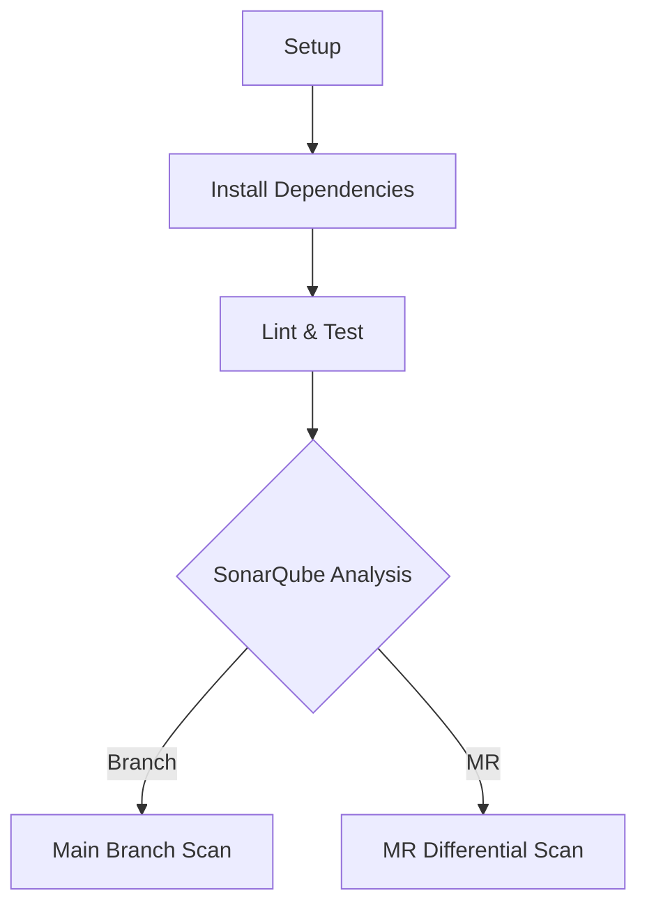

## Executive Summary

This guide provides a technical deep-dive into implementing SonarQube static analysis within GitLab CI/CD pipelines for Yarn 3 monorepos containing Node.js/TypeScript applications. We address infrastructure provisioning via Terraform, pipeline configuration strategies, quality gate enforcement mechanics, and operational troubleshooting. The solution leverages SonarQube Developer Edition features for advanced branch analysis and merge request decoration, optimized for Azure-hosted environments. Implementation details draw from verified integration patterns in SonarQube 10+ and GitLab 16+ ecosystems[^1_1][^1_2].

---

## 1. Prerequisites for SonarQube-GitLab Integration

### 1.1 Infrastructure Requirements

**SonarQube Server Specifications**:

- Azure VM Minimum: 4 vCPUs, 16GB RAM, SSD storage (Baseline for 50k LoC analysis)
- PostgreSQL 13+ database with 25 concurrent connections capacity
- Network Security Group rules allowing HTTPS (port 9000) from GitLab runners[^1_3]

**GitLab Compatibility Matrix**:

```markdown
| Component           | Minimum Version | Notes                          |
|---------------------|-----------------|--------------------------------|
| GitLab CE/EE        | 15.11           | MR decoration API requirements |
| GitLab Runners      | 16.7            | Docker executor recommended    |
| SonarQube Scanner   | 5.0+            | Node.js plugin 7.0+ required   |
```

### 1.2 Authentication Configuration

**GitLab-to-SonarQube OAuth Flow**:

1. Create dedicated service account in GitLab with `read_api` scope
2. Generate PAT (Personal Access Token) with `api` scope for merge request decoration[^1_1]
3. Configure SonarQube global settings:

```bash
sonar.gitlab.url=https://gitlab.example.com
sonar.gitlab.user_token=glpat-xxxxxxxxxx
sonar.gitlab.project_id=monorepo-group/monorepo-project
```

**Monorepo-Specific Settings**:

```properties
# sonar-project.properties
sonar.workspace=apps/
sonar.projectBaseDir=.
sonar.modules=app1,app2,shared-lib
sonar.app1.sources=apps/app1/src
sonar.app2.sources=apps/app2/src
```

---

## 2. GitLab CI/CD Pipeline Configuration

### 2.1 Pipeline Architecture for Monorepos

**Multi-Stage Analysis Strategy**:



### 2.2 `.gitlab-ci.yml` Template

```yaml
variables:
  SONAR_HOST_URL: https://sonar.azure.example.com
  SONAR_USER_HOME: "${CI_PROJECT_DIR}/.sonar"

stages:
  - prepare
  - analyze

cache:
  key: ${CI_JOB_NAME}
  paths:
    - .yarn/cache
    - node_modules
    - .sonar/cache

setup_base:
  stage: prepare
  image: node:18
  script:
    - corepack enable
    - yarn install --immutable
  cache:
    policy: push
    key: base-deps

sonar_analysis:
  stage: analyze
  image: sonarsource/sonar-scanner-cli:latest
  parallel:
    matrix:
      - WORKSPACE: ["app1", "app2", "shared-lib"]
  variables:
    SONAR_PROJECT_KEY: "monorepo_${WORKSPACE}"
    SONAR_PROJECT_NAME: "Monorepo :: ${WORKSPACE}"
  script:
    - cd apps/${WORKSPACE}
    - sonar-scanner
      -Dsonar.login=${SONAR_TOKEN}
      -Dsonar.pullrequest.key=${CI_MERGE_REQUEST_IID}
      -Dsonar.pullrequest.branch=${CI_MERGE_REQUEST_SOURCE_BRANCH_NAME}
      -Dsonar.pullrequest.base=${CI_MERGE_REQUEST_TARGET_BRANCH_NAME}
  rules:
    - if: $CI_PIPELINE_SOURCE == "merge_request_event"
      changes:
        - "apps/${WORKSPACE}/**/*"
    - if: $CI_COMMIT_BRANCH == $CI_DEFAULT_BRANCH
```

### 2.3 MR-Specific Configuration

**Differential Analysis Parameters**:

```properties
sonar.pullrequest.provider=GitLab
sonar.pullrequest.gitlab.projectId=$CI_PROJECT_ID
sonar.pullrequest.gitlab.repositorySlug=$CI_PROJECT_NAME
sonar.pullrequest.gitlab.commitSha=$CI_COMMIT_SHA
```

---

## 3. Quality Gate Enforcement Implementation

### 3.1 Pipeline Failure Conditions

**Quality Gate Status Mapping**:

```bash
if [ "$(curl -s ${SONAR_HOST_URL}/api/qualitygates/project_status?projectKey=${SONAR_PROJECT_KEY} | jq -r .projectStatus.status)" = "ERROR" ]; then
  exit 1
fi
```

### 3.2 Merge Request Decoration

**GitLab CI Job Configuration**:

```yaml
sonar_quality_gate:
  stage: post-analysis
  image: curlimages/curl:latest
  script:
    - |
      RESPONSE=$(curl -s "${SONAR_HOST_URL}/api/project_pull_requests/list?project=${SONAR_PROJECT_KEY}")
      STATUS=$(echo $RESPONSE | jq -r '.pullRequests[] | select(.key=="${CI_MERGE_REQUEST_IID}") | .status')
      [ "$STATUS" = "OK" ] || exit 1
  allow_failure: false
```

### 3.3 Approval Rule Configuration

**GitLab MR Settings**:

```markdown
1. Navigate to Settings > Merge Requests
2. Add approval rule:
   - Name: SonarQube Quality Gate
   - Eligible users: Maintainers
   - Approvals required: 1
3. Set "Status checks must pass" toggle to ON
```

---

## 4. Common Integration Challenges \& Solutions

### 4.1 Monorepo-Specific Issues

**Problem**: Cross-workspace dependency analysis failures
**Solution**:

```properties
sonar.externalIssuesReportPaths=apps/*/sonar-report.json
sonar.coverageReportPaths=apps/*/coverage/lcov.info
```

### 4.2 Performance Optimization

**Caching Strategy**:

```yaml
cache:
  key: ${CI_JOB_NAME}_${SONAR_PROJECT_KEY}
  paths:
    - .sonar/cache
    - .yarn/cache
  policy: pull-push
```

### 4.3 Security Configuration

**Secret Management**:

```bash
# Azure Key Vault integration
echo "SONAR_TOKEN=$(az keyvault secret show --name sonar-token --vault-name ${VAULT_NAME} --query value -o tsv)" >> .env
```

---

## 5. Azure Infrastructure Automation

### 5.1 Terraform Module Structure

**Reference Architecture**:

```hcl
module "sonarqube" {
  source  = "nearform/sonarqube/azure"
  version = "2.3.0"

  resource_group_name = azurerm_resource_group.sonarqube.name
  location            = "northeurope"
  
  vnet_id             = module.network.vnet_id
  subnet_aci_id       = module.network.subnets["aci"].id
  subnet_pgsql_id     = module.network.subnets["database"].id
  
  sonar_db_instance_class = "GP_Standard_D4s_v3"
  sonar_image_tag         = "9.9-community"
}
```

### 5.2 Infrastructure-as-Code Best Practices

**State Management**:

```hcl
terraform {
  backend "azurerm" {
    resource_group_name  = "sonarqube-tfstate"
    storage_account_name = "sonartfstate2025"
    container_name       = "tfstate"
    key                  = "prod.terraform.tfstate"
  }
}
```

---

## 6. Advanced Configuration Strategies

### 6.1 SonarQube Quality Profiles

**TypeScript Rule Activation**:

```bash
curl -X POST "${SONAR_HOST_URL}/api/qualityprofiles/activate_rules" \
  -u admin:${ADMIN_PASSWORD} \
  -d "language=ts" \
  -d "types=CODE_SMELL,BUG,VULNERABILITY" \
  -d "tags=typescript,security"
```

### 6.2 GitLab Runner Optimization

**Docker Executor Configuration**:

```toml
[[runners]]
  name = "sonar-runner"
  executor = "docker"
  [runners.docker]
    memory = "8G"
    volumes = ["/cache", "/var/run/docker.sock:/var/run/docker.sock"]
  [runners.cache]
    Type = "s3"
    Shared = true
```

---

## Conclusion

This implementation establishes a robust code quality enforcement system for monorepo environments, combining SonarQube's static analysis capabilities with GitLab's CI/CD orchestration. Key success factors include proper workspace isolation in SonarQube projects, differential analysis for merge requests, and infrastructure-as-code deployment patterns. Future enhancements could incorporate SonarQube's Clean Code taxonomy and GitLab's Advanced Security features for comprehensive shift-left quality assurance.
