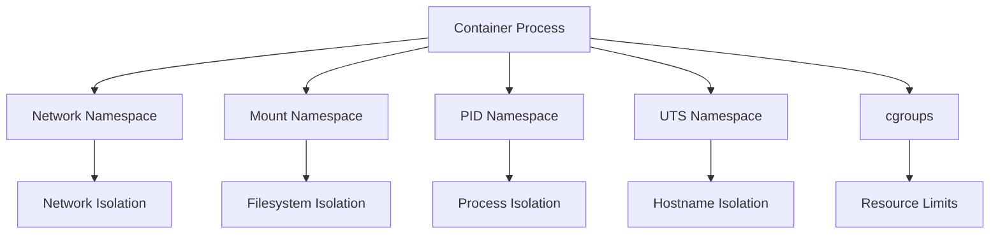

## Summary

Linux kernel primitives that form the foundation of container technology. This MOC covers namespaces, control groups (cgroups), and other kernel features that enable process isolation, resource management, and security in containers. These are all aspects of the broader concept discussed in [[SoT - Namespacing in Computing]].

## Context / Problem

Containers appear to be lightweight virtual machines, but they're actually isolated processes running on a shared kernel. Understanding the underlying Linux primitives is essential for debugging, security, and performance optimization. Without this knowledge, container behavior seems magical and troubleshooting becomes guesswork.

## Structure

### 🔒 Isolation Primitives

- **[[What is a network namespace]]** - Network stack isolation (interfaces, routing, iptables)
- **[[What is a mount namespace]]** - File system mount point isolation
- **[[What is a PID namespace]]** - Process ID space isolation
- **[[What is a UTS namespace]]** - Hostname and domain name isolation
- **[[What is the Linux VFS (Virtual File System)]]** - File system abstraction layer

### ⚡ Resource Management

- **Control Groups (cgroups)** - CPU, memory, I/O resource limits (planned)
- **Namespaces interaction** - How different namespaces work together
- **Process hierarchy** - Container processes vs host processes

### 🔐 Security Features

- **Capabilities** - Fine-grained privilege management (planned)
- **SELinux/AppArmor** - Mandatory access control (planned)
- **Seccomp** - System call filtering (planned)

## Key Relationships

## Common Patterns

### Container Startup Sequence

1. Create all necessary namespaces
2. Configure network namespace (veth, bridge, IP)
3. Set up mount namespace (layered filesystems)
4. Apply cgroup limits
5. Drop capabilities and set security policies

### Debugging Namespace Issues

- Use `ip netns` for network namespace debugging
- Use `lsns` to list all namespaces
- Use `unshare` to test isolation manually

## Connections to Other Areas

- **[[MOC - Container Networking Model]]** - Network namespace applications
- **[[MOC - Container Runtime & Orchestration]]** - How runtimes use these primitives
- **[[MOC - Linux Systems]]** - Broader Linux kernel knowledge

## Child Notes

### Core Namespaces

- [[What is a network namespace]]
- [[What is a mount namespace]]
- [[What is a PID namespace]]
- [[What is a UTS namespace]]

### Supporting Concepts

- [[What is the Linux VFS (Virtual File System)]]
- [[How namespaces interact without mount namespace]]
- [[Namespace Isolation Is Incomplete Without Mount Namespace]]

### Planned Additions

- What are control groups (cgroups)?
- What are Linux capabilities?
- What is SELinux container context?
- What is AppArmor container profiling?
- What is seccomp filtering?
