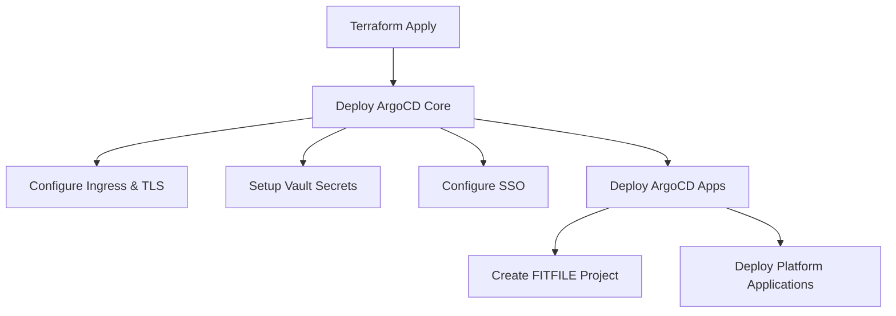

## Overview

This Terraform module deploys ArgoCD to a Kubernetes cluster using Helm charts and implements the "App of Apps" pattern for managing FITFILE platform applications. The module consists of two main components:

1. **ArgoCD Core Deployment** - The main ArgoCD installation
2. **ArgoCD Applications** - The App of Apps pattern implementation for FITFILE platform services

## Module Structure

```sh
argocd/
├── main.tf # Core Terraform resources
├── variables.tf # Input variable definitions
├── versions.tf # Provider version constraints
├── argocd-values.tftpl # ArgoCD Helm chart values template
├── app-values.tftpl # ArgoCD Apps Helm chart values template
├── example.tfvars # Example configuration
└── README.md # Basic documentation
```

## Architecture Components

### 1. ArgoCD Core Deployment (`helm_release.argocd`)

**Purpose**: Deploys the main ArgoCD instance to the cluster.
**Configuration**:

- **Chart**: `helm/argo-cd` from the configured repository
- **Namespace**: `argocd` (auto-created)
- **Values Sources**:
  - `argocd-values.tftpl` template (primary configuration)
  - Dynamic ingress configuration (host, TLS)
  - User-provided helm overrides

**Key Features**:

- **Ingress**: Nginx-based with Cloudflare TLS certificates
- **SSO Integration**: Azure AD/Entra ID OIDC authentication
- **Vault Integration**: HashiCorp Vault for secrets management
- **Monitoring**: Prometheus metrics enabled for all components
- **Security**: RBAC policies with group-based access control

### 2. ArgoCD Applications (`helm_release.argocd-apps`)

**Purpose**: Implements the App of Apps pattern to manage FITFILE platform applications.
**Configuration**:

- **Chart**: `helm/argocd-apps` from the configured repository
- **Dependency**: Waits for ArgoCD core deployment
- **Values Source**: `app-values.tftpl` template with application definitions

## How It Works

### 1. Terraform Deployment Flow



### 2. ArgoCD Configuration Details

#### Core Configuration (`argocd-values.tftpl`)

**Resource Allocation**:

- Server: 100m CPU, 128Mi memory
- Controller: 200m CPU, 256Mi memory
- Repo Server: 100m CPU, 128Mi memory
- Dex: 50m CPU, 64Mi memory
- Redis: 50m CPU, 64Mi memory

**Security Configuration**:

- Image pull secrets for private registries
- RBAC with role-based access control
- Vault Static Secrets for sensitive data
- Repository credentials via Vault

**Monitoring**:

- Prometheus ServiceMonitors enabled
- Metrics collection for all components
- Custom health checks for applications

#### Vault Integration

The module creates two `VaultStaticSecret` resources:

1. **`argocd-secret`**: Core ArgoCD secrets

- Admin password and password modification time
- Server secret key
- SSO client secret (if SSO enabled)

1. **`argocd-repo-fitfile-deployment-repo`**: Repository credentials

- GitLab deploy token username/password
- Repository URL and metadata

**Vault Path**: `admin/${vault_namespace}/secrets/argocd`

#### SSO Configuration

When SSO is enabled:

- **Provider**: Azure AD/Entra ID
- **Tenant**: `45e73aa3-1ee9-47c0-ba25-54eda9da021a`
- **RBAC**: Group-based role assignment
- **Roles**: `role:org-admin` with full permissions

### 3. App of Apps Pattern (`app-values.tftpl`)

#### FITFILE Project Configuration

```yaml
projects:
fitfile:
namespace: argocd
description: The main project for all fitfile applications
sourceRepos:
  - https://gitlab.com/fitfile/deployment.git
destinations:
  - namespace: "*"
server: "https://kubernetes.default.svc"
clusterResourceWhitelist:
  - ClusterIssuer, PriorityClass
  - MutatingWebhookConfiguration, ValidatingWebhookConfiguration
```

#### Application Template Structure

Each application in the `applications` variable generates:

```yaml
applications:
${app.name}:
project: fitfile
source:
repoURL: https://gitlab.com/fitfile/deployment.git
targetRevision: ${app.target_revision}
path: ${app.chart_path} # Default: charts/ffnode
```

**Source Types**:

1. **Helm Source** (`type: "helm"`):

```yaml
helm:
releaseName: ${app.source.release_name}
valueFiles: [${app.source.value_files}]
values: ${app.source.values}
```

2. **Plugin Source** (`type: "plugin"`):

```yaml
plugin:
env:
- name: VAULT_NAMESPACE
value: ${app.source.vault_namespace}
- name: RELEASE_NAME
value: ${app.source.release_name}
- name: HELM_VALUE_FILES
value: ${app.source.value_files}
```

**Sync Policy**:

- **Automated**: Prune and self-heal enabled
- **Ignore Differences**: Deployment replicas (for HPA compatibility)

## FITFILE Platform Applications

### Application Configuration Structure

Applications are defined in the `applications` variable with this structure:

```hcl
variable "applications" {
type = list(object({
name = string
target_revision = string
chart_path = optional(string, "charts/ffnode")
destination = optional(object({
namespace = optional(string, "argocd")
}), {})
source = object({
type = optional(string, "helm") # "helm" or "plugin"
vault_namespace = optional(string, "")
release_name = string
value_files = optional(list(string), [])
values = optional(string, "")
})
}))
}
```

### Application Deployment Locations

**Chart Source**: `/charts/ffnode/` in the deployment repository

- **Primary Chart**: Universal FITFILE node chart
- **Alternative Charts**: `/charts/storybook/`, etc.

**Configuration Files**: `/ffnodes/{organization}/{environment}/`

- **Structure**: `ffnodes/fitfile/ff-test-a/ffnode_values.yaml`
- **Organizations**: `fitfile`, `eoe`, `barts`, `kch`, `stg`, `wmsde`
- **Environments**: Various per organization

### Example Application Configurations

#### Standard Helm Application

```hcl
{
name = "ff-test-b"
source = {
release_name = "ff-test-b"
type = "helm"
value_files = ["/ffnodes/fitfile/ff-test-b/ffnode_values.yaml"]
}
target_revision = "master"
}
```

#### Plugin-based Application with Vault

```hcl

{

name = "ff-test-a"

source = {

release_name = "ff-test-a"

type = "plugin"

value_files = ["/ffnodes/fitfile/ff-test-a/ffnode_values.yaml"]

vault_namespace = "admin/fitfile/test2"

}

target_revision = "master"

}

```

#### Custom Namespace Application

```hcl

{

name = "ff-test-c"

destination = {

namespace = "ff-test-c"

}

source = {

release_name = "ff-test-c"

type = "plugin"

vault_namespace = "admin/fitfile/test2"

values = <<-EOT

something:

awesome:

- name: is

value: happening

EOT

}

target_revision = "master"

}

```

## Integration with FITFILE Platform

### 1. Platform Module Integration

The ArgoCD module is deployed as part of the larger `terraform-helm-fitfile-platform` module:

```hcl

module "argocd" {

depends_on = [kubernetes_namespace.namespaces, module.ingress_controller]

source = "./argocd"

host = var.argocd_host

applications = var.argocd_applications

helm_overrides = var.argocd_helm_values

chart_version = var.argocd_chart_version

apps_chart_version = var.argocd_apps_chart_version

repository_url = var.helm_repository_url

sso = var.argocd_sso

vault_namespace = local.argocd_vault_namespace

}

```

### 2. Dependencies

**Required Infrastructure**:

- Kubernetes namespaces
- Nginx Ingress Controller
- Vault Operator (for secrets management)
- Reflector (for secret propagation)

### 3. Repository Structure

**Deployment Repository**: `https://gitlab.com/fitfile/deployment.git`

- **Charts**: `/charts/ffnode/` - Universal FITFILE application chart
- **Configurations**: `/ffnodes/{org}/{env}/` - Environment-specific values
- **Target Revision**: Configurable per application (typically `master`)

## Security Model

### 1. Authentication & Authorization

**SSO Integration**:

- Azure AD/Entra ID OIDC
- Group-based RBAC
- Admin group mapping via `sso.rbacAdminGroupId`

**Local Authentication**:

- Admin user with Vault-managed password
- Password rotation via Vault Static Secrets

### 2. Secrets Management

**Vault Integration**:

- All sensitive data stored in HashiCorp Vault
- Automatic secret rotation (5-30 minute intervals)
- Pod restart triggers on secret changes

**Repository Access**:

- GitLab deploy tokens via Vault
- Automatic credential refresh

### 3. Network Security

**Ingress Configuration**:

- TLS termination with Cloudflare certificates
- Force SSL redirect
- Backend HTTP communication

## Monitoring & Observability

### 1. Metrics Collection

**Prometheus Integration**:

- ServiceMonitors for all ArgoCD components
- Custom application health checks
- Resource utilization monitoring

### 2. Health Checks

**Custom Health Logic**:

- Application-specific health assessments
- Sync status monitoring
- Error condition detection

## Operational Considerations

### 1. Deployment Process

1. **Infrastructure Setup**: Deploy platform dependencies
2. **ArgoCD Installation**: Core ArgoCD deployment
3. **App Registration**: Deploy ArgoCD Applications
4. **Application Sync**: ArgoCD manages application lifecycle

### 2. Configuration Management

**Terraform Variables**:

- Applications defined in Terraform configuration
- Environment-specific values in deployment repository
- Secrets managed via Vault

**GitOps Workflow**:

- Configuration changes via Git commits
- Automatic synchronization by ArgoCD
- Self-healing and pruning enabled

### 3. Scaling Considerations

**Resource Allocation**:

- Conservative CPU/memory requests
- Horizontal scaling via replica configuration
- Cluster autoscaling support (AWS)

**Application Management**:

- Unlimited applications per project
- Namespace isolation support
- Multi-cluster deployment capability

## Troubleshooting

### Common Issues

1. **Vault Authentication**: Check `vaultAuthRef` configuration
2. **Repository Access**: Verify GitLab deploy token in Vault
3. **SSO Issues**: Validate Azure AD configuration and group mappings
4. **Sync Failures**: Check application source paths and value files

### Monitoring Points

- ArgoCD server health and availability
- Application sync status and health
- Vault secret refresh operations
- Ingress connectivity and TLS certificate validity
  I'll examine the ArgoCD Helm chart in the deployment repository to understand how it integrates with the Terraform module.

Based on my analysis of the ArgoCD Helm chart in the deployment repository, I can now explain how the Terraform module integrates with it. There are actually **two different approaches** being used:

## Two ArgoCD Deployment Approaches

### 1. **Terraform Module Approach** (What We Documented earlier)

The Terraform module deploys ArgoCD directly using:

```hcl
resource "helm_release" "argocd" {
  chart      = "helm/argo-cd"
  repository = var.repository_url  # Points to ACR or other registry
  version    = var.chart_version
}
```

### 2. **Helm Chart Wrapper Approach** (What You're Asking about)

The deployment repository contains a **wrapper Helm chart** at `/charts/argo/cd/` that:

## Helm Chart Structure

```yaml
# Chart.yaml
apiVersion: v2
name: fitfile-argocd
description: FITFile GitOps agent (argocd)
version: 1.0.0

dependencies:
  - name: argo-cd
    version: "6.11.1"
    repository: "https://argoproj.github.io/argo-helm"
```

This is a **dependency-based wrapper chart** that:

- **Wraps** the official ArgoCD Helm chart (v6.11.1)
- **Provides** FITFILE-specific default configurations
- **Enables** environment-specific value overrides

## Key Differences

### **Terraform Module** Vs **Helm Chart Wrapper**

| Aspect            | Terraform Module                                                                                                                                                     | Helm Chart Wrapper                                                                                                                                           |
| ----------------- | -------------------------------------------------------------------------------------------------------------------------------------------------------------------- | ------------------------------------------------------------------------------------------------------------------------------------------------------------ |
| **Chart Source**  | Direct from ACR (`helm/argo-cd`)                                                                                                                                     | Wrapper chart with dependency                                                                                                                                |
| **Configuration** | Template files ([.tftpl](cci:7://file:///Volumes/DAL/Fitfile/gitlab/FITFILE/Deployment/TFC-Modules/terraform-helm-fitfile-platform/argocd/app-values.tftpl:0:0-0:0)) | Static YAML values files                                                                                                                                     |
| **Secrets**       | Vault Static Secrets                                                                                                                                                 | Hardcoded credentials                                                                                                                                        |
| **Environments**  | Variable-driven                                                                                                                                                      | File-based ([values-prod.yaml](cci:7://file:///Volumes/DAL/Fitfile/gitlab/FITFILE/Deployment/helm_chart_deployment/charts/argo/cd/values-prod.yaml:0:0-0:0)) |
| **Deployment**    | Terraform-managed                                                                                                                                                    | Traditional Helm                                                                                                                                             |

## Configuration Comparison

### **Terraform Template** ([argocd-values.tftpl](cci:7://file:///Volumes/DAL/Fitfile/gitlab/FITFILE/Deployment/TFC-Modules/terraform-helm-fitfile-platform/argocd/argocd-values.tftpl:0:0-0:0))

```yaml
# Dynamic templating with variables
url: "${baseUrl}"
%{ if sso.enabled ~}
oidc.config: |
  clientID: "${sso.client_id}"
  clientSecret: $oidc.azure.clientSecret
%{ endif ~}
```

### **Helm Chart Values** ([values.yaml](cci:7://file:///Volumes/DAL/Fitfile/gitlab/FITFILE/Deployment/helm_chart_deployment/ffnodes/empty-values.yaml:0:0-0:0))

```yaml
# Static configuration with hardcoded values
argo-cd:
  configs:
    cm:
      url: https://test-argocd.fitfile.net/
      oidc.config: |
        clientID: a5da15d0-2762-4ebc-85cd-fb99c919d6eb
        clientSecret: $oidc.azure.clientSecret
```

## Security Model Differences

### **Terraform Approach** (Secure)

- **Vault Integration**: All secrets via `VaultStaticSecret` resources
- **Dynamic Credentials**: Automatic rotation and pod restarts
- **No Hardcoded Secrets**: Everything templated from Vault

### **Helm Chart Approach** (Legacy)

- **Hardcoded Credentials**: GitLab tokens in plain text
- **Static Passwords**: Admin password hash in values
- **Manual Management**: No automatic rotation

```yaml
# Hardcoded in values.yaml - SECURITY RISK
configs:
  secret:
    argocdServerAdminPassword: $2a$10$KeGWZRxd0HBk12LqAcQM/uN7I0CGwRX34hAj/xMo1KqxAAntpiuLK
  repositories:
    fitfile-deployment-repo:
      username: argocd-test
      password: xJpEFYFbm2t1mwgE3WXj # Plain text token!
```

## Integration Scenarios

The Terraform module **does not directly use** the Helm chart wrapper. Instead:

1. **Terraform Module**: Deploys ArgoCD independently with modern security practices
2. **Helm Chart**: Legacy deployment method, possibly for manual/development environments
3. **Coexistence**: Both approaches can deploy to different clusters/namespaces

## Recommendation

The **Terraform module approach** is superior because:

- ✅ **Vault-integrated secrets management**
- ✅ **Dynamic configuration templating**
- ✅ **Infrastructure as Code practices**
- ✅ **Automated secret rotation**
- ✅ **Environment-agnostic deployment**

The Helm chart wrapper appears to be a **legacy approach** that should be migrated to use the Terraform module pattern for better security and maintainability.
