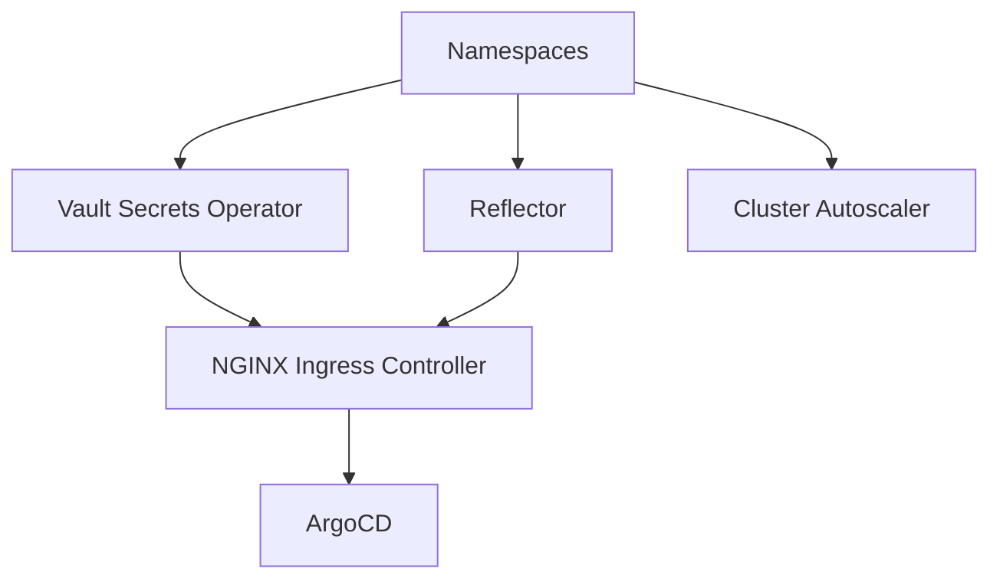

## Overview

The **FITFILE Platform Terraform Module** (`terraform-helm-fitfile-platform`) is a comprehensive infrastructure-as-code solution for deploying and managing the FITFILE Kubernetes platform. This module automates the deployment of essential platform components including ingress controllers, GitOps tooling, secrets management, and cluster scaling capabilities.

## Architecture

The module is designed as a modular Terraform configuration that deploys multiple Helm charts to configure a production-ready Kubernetes platform. It follows a dependency-driven approach where components are deployed in the correct order with proper dependencies.

### Core Components

#### 1. **Vault Secrets Operator (VSO)**

- **Purpose**: Manages HashiCorp Vault integration with Kubernetes
- **Features**:
  - Automated secret synchronization between Vault and Kubernetes
  - AppRole authentication support
  - Namespace-scoped secret management
- **Configuration**: Configurable via `vso_helm_values` variable

#### 2. **Reflector**

- **Purpose**: Mirrors Kubernetes secrets and ConfigMaps across namespaces
- **Features**:
  - Automatic secret replication
  - Configurable pod annotations
  - Namespace isolation support

#### 3. **NGINX Ingress Controller**

- **Purpose**: Provides ingress routing and load balancing
- **Features**:
  - Static IP assignment support
  - Multiple load balancer types (internal/external)
  - Host networking support for edge deployments
  - Cloud provider integration (AWS ALB annotations)
  - Configurable service annotations
- **Configuration**: Highly configurable via `ingress_helm_values`

#### 4. **ArgoCD**

- **Purpose**: GitOps continuous delivery platform
- **Features**:
  - Declarative application management
  - Multi-environment deployment support
  - SSO integration capabilities
  - Automated synchronization
  - Application health monitoring
- **Configuration**: Supports custom applications via `argocd_applications`

#### 5. **Cluster Autoscaler** (AWS Only)

- **Purpose**: Automatic pod scheduling and cluster scaling
- **Features**:
  - Horizontal pod autoscaling integration
  - Cloud provider-specific scaling logic
  - IAM role assumption for AWS
- **Conditional Deployment**: Only deployed on AWS clusters

## Version 2.0.0 Breaking Changes

Version 2.0.0 introduced significant changes to improve version control and flexibility:

### Required Variables

The following chart version variables are now mandatory:

| Variable                           | Description                      | Default                          |
| ---------------------------------- | -------------------------------- | -------------------------------- |
| `ingress_nginx_chart_version`      | NGINX Ingress Controller version | `4.12.1`                         |
| `argocd_chart_version`             | ArgoCD server version            | `7.8.8`                          |
| `argocd_apps_chart_version`        | ArgoCD Apps version              | `1.4.1`                          |
| `vault_operator_chart_version`     | Vault Secrets Operator version   | `0.8.1`                          |
| `reflector_chart_version`          | Reflector version                | `7.1.288`                        |
| `cluster_autoscaler_chart_version` | Cluster Autoscaler version       | `9.43.0`                         |
| `helm_repository_url`              | Helm chart repository URL        | `oci://fitfilepublic.azurecr.io` |

## Usage Example

```hcl
module "platform" {
  source  = "app.terraform.io/FITFILE-Platforms/fitfile-platform/helm"
  version = "2.0.0"

  # Required parameters
  ingress_ip_address = "10.0.1.100"
  argocd_host        = "argocd.fitfile.com"

  # Chart versions (all required in v2.0.0+)
  ingress_nginx_chart_version     = "4.12.1"
  argocd_chart_version           = "7.8.8"
  argocd_apps_chart_version      = "1.4.1"
  vault_operator_chart_version   = "0.8.1"
  reflector_chart_version        = "7.1.288"
  cluster_autoscaler_chart_version = "9.43.0"
  helm_repository_url           = "oci://fitfilepublic.azurecr.io"

  # Vault configuration
  vault_address = "https://vault.example.com:8200/"
  app_role_secrets_map = {
    argocd = {
      namespace       = "argocd"
      secret_name     = "vault-secret"
      role_id         = "vault-role-id"
      secret_id       = "vault-secret-id"
      vault_namespace = "admin"
      vault_backend   = "secret"
    }
  }

  # ArgoCD applications
  argocd_applications = [
    {
      name            = "ffnode"
      target_revision = "main"
      source = {
        release_name = "ffnode"
        values       = file("${path.module}/values/ffnode.yaml")
      }
    }
  ]

  # Cloud provider configuration
  cloud_provider = "AZURE"
  cluster_name   = "production-cluster"
}
```

## Module Dependencies

The module orchestrates component deployment with proper dependency management:



## Advanced Configuration

### Custom Helm Values

All major components support custom Helm values:

```hcl
# NGINX Ingress custom configuration
ingress_helm_values = yamlencode({
  controller = {
    replicaCount = 3
    resources = {
      limits = {
        cpu    = "1000m"
        memory = "1Gi"
      }
    }
  }
})

# ArgoCD custom configuration
argocd_helm_values = yamlencode({
  server = {
    ingress = {
      annotations = {
        "cert-manager.io/cluster-issuer" = "letsencrypt-prod"
      }
    }
  }
})
```

### Multi-Environment Support

The module supports different configurations per environment through variable overrides:

```hcl
# Development environment
module "platform_dev" {
  source = "./modules/platform"

  ingress_ip_address = "10.0.1.50"
  argocd_host       = "dev-argocd.fitfile.com"
  cloud_provider    = "AZURE"

  # Development-specific settings
  ingress_helm_values = yamlencode({
    controller = {
      replicaCount = 1
    }
  })
}

# Production environment
module "platform_prod" {
  source = "./modules/platform"

  ingress_ip_address = "10.0.1.100"
  argocd_host       = "argocd.fitfile.com"
  cloud_provider    = "AWS"

  # Production-specific settings
  cluster_autoscaler_iam_role_arn = "arn:aws:iam::123456789:role/cluster-autoscaler"
}
```

## Security Features

### Image Pull Secrets

- Automated creation of image pull secrets in specified namespaces
- Configurable namespace targeting via `additional_namespaces_for_image_pull_secret`
- Optional deployment via `use_image_pull_secret` flag

### Vault Integration

- Secure secret management through HashiCorp Vault
- AppRole-based authentication
- Namespace-scoped secret access
- Configurable vault backends and namespaces

## Outputs

The module provides version information for all deployed components:

```json
{
  "deployed_versions": {
    "ingress_nginx": "4.12.1",
    "argocd": "7.8.8",
    "argocd_apps": "1.4.1",
    "vault_operator": "0.8.1",
    "reflector": "7.1.288",
    "cluster_autoscaler": "9.43.0"
  }
}
```

## Best Practices

### Version Pinning

Always specify explicit versions for all chart variables to maintain deployment consistency:

```hcl
# ✅ Good - Explicit versions
ingress_nginx_chart_version = "4.12.1"
argocd_chart_version       = "7.8.8"

# ❌ Bad - Relies on defaults (may change)
# No version variables specified
```

### Environment Variables

Use Terraform workspaces or variable files to manage environment-specific configurations:

```bash
# Development
terraform plan -var-file="dev.tfvars"

# Production
terraform plan -var-file="prod.tfvars"
```

### Dependency Management

Respect module dependencies when making changes:

1. **Namespaces** must be created first
2. **Vault Secrets Operator** and **Reflector** can deploy in parallel
3. **NGINX Ingress Controller** requires both VSO and Reflector
4. **ArgoCD** requires the ingress controller for proper routing
5. **Cluster Autoscaler** can deploy independently but requires AWS IAM setup

## Troubleshooting

### Common Issues

#### Chart Version Conflicts

```sh
Error: Chart version not found in repository
```

**Solution**: Verify the chart version exists in the specified repository and update the version variable accordingly.

#### Ingress IP Assignment Issues

```sh
Error: LoadBalancer IP not assigned
```

**Solution**: Ensure the specified `ingress_ip_address` is available and properly configured in your cloud provider.

#### Vault Connection Failures

```sh
Error: Failed to authenticate with Vault
```

**Solution**: Verify vault address, namespace, and AppRole credentials in `app_role_secrets_map`.

### Debugging Commands

```bash
# Check deployed resources
kubectl get all -n argocd
kubectl get all -n ingress-nginx
kubectl get all -n vault-secrets-operator-system

# Check Helm releases
helm list -A

# Check logs
kubectl logs -n argocd deployment/argocd-server
kubectl logs -n ingress-nginx deployment/ingress-nginx-controller
```

## Contributing

When making changes to this module:

1. Update version variables in `variables.tf`
2. Test changes in development environment first
3. Update documentation for any new variables or behavior changes
4. Ensure backward compatibility or clearly document breaking changes
5. Update the module version following semantic versioning

## Related Documentation

- [ArgoCD Documentation](https://argo-cd.readthedocs.io/)
- [NGINX Ingress Controller](https://kubernetes.github.io/ingress-nginx/)
- [Vault Secrets Operator](https://developer.hashicorp.com/vault/docs/platform/k8s/vso)
- [Cluster Autoscaler](https://github.com/kubernetes/autoscaler/tree/master/cluster-autoscaler)
