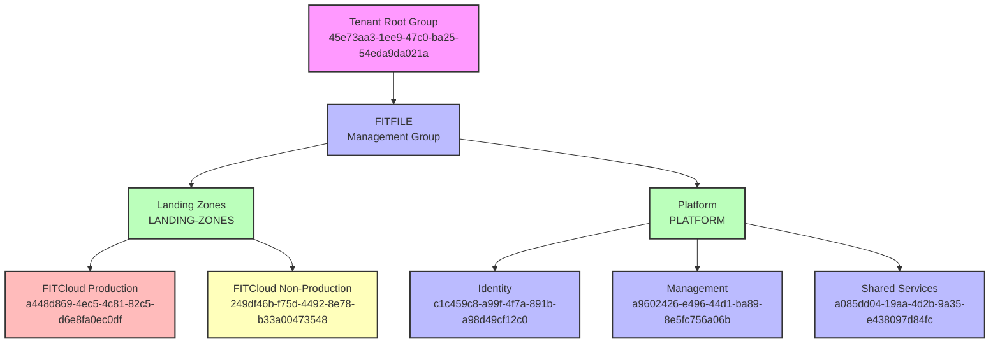

## FITFILE Azure Organization Structure

### Overview

This document provides a comprehensive overview of how Azure resources are organized within the FITFILE tenant. It explains the management group hierarchy, subscription structure, access levels, and how these components work together to provide governance, security, and operational efficiency.

**Last Updated:** October 2024  
**Audience:** Platform Engineers, DevOps Teams, Security Teams, Management

### At a Glance



### How Azure Organization Works at FITFILE

#### Hierarchy Levels

The FITFILE Azure organization follows Microsoft's recommended enterprise-scale landing zone pattern with these hierarchy levels:

1. **Tenant Root Group** - The top-level Azure AD tenant containing all Azure resources
2. **Management Groups** - Logical containers for organizing subscriptions and applying governance
3. **Subscriptions** - Billing and resource boundaries containing Azure services
4. **Resource Groups** - Logical containers within subscriptions for related resources

#### Organizational Structure

##### Tenant Root Group

- **ID:** `45e73aa3-1ee9-47c0-ba25-54eda9da021a`
- **Name:** Tenant Root Group
- **Access Level:** Not Authorized (system-level container)
- **Child Subscriptions:** 0 direct (5 total across all management groups)
- **Purpose:** Azure AD tenant container, inherited by all child management groups

##### FITFILE Management Group

- **ID:** `FITFILE`
- **Name:** FITFILE
- **Access Level:** Reader
- **Path:** `Tenant Root Group`
- **Purpose:** Primary organizational boundary for all FITFILE Azure resources

### Management Groups by Level

#### Level 1: Primary Organizational Groups

Under the FITFILE management group, resources are organized into two primary categories:

##### Landing Zones (LANDING-ZONES)

- **Purpose:** Contains application workloads and environments
- **Access Level:** Reader
- **Child Subscriptions:** 2
- **Path:** `Tenant Root Group → FITFILE`

**Child Subscriptions:**

- **FITCloud Production** (`a448d869-4ec5-4c81-82c5-d6e8fa0ec0df`)
  - Environment: Production
  - Purpose: Production workloads and customer-facing applications
  - Access Level: Reader
- **FITCloud Non-Production** (`249df46b-f75d-4492-8e78-b33a00473548`)
  - Environment: Non-Production
  - Purpose: Development, testing, staging, and pre-production workloads
  - Access Level: Reader

##### Platform (PLATFORM)

- **Purpose:** Contains shared infrastructure and platform services
- **Access Level:** Reader
- **Child Subscriptions:** 3
- **Path:** `Tenant Root Group → FITFILE`

**Child Subscriptions:**

- **Identity** (`c1c459c8-a99f-4f7a-891b-a98d49cf12c0`)
  - Purpose: Identity and access management services, Azure AD Connect, certificate authorities
  - Access Level: Reader
- **Management** (`a9602426-e496-44d1-ba89-8e5fc756a06b`)
  - Purpose: Monitoring, logging, backup, automation, and management tools
  - Access Level: Reader
- **Shared Services** (`a085dd04-19aa-4d2b-9a35-e438097d84fc`)
  - Purpose: Networking, DNS, shared infrastructure components
  - Access Level: Reader

### Subscription Catalog

| Subscription            | Environment    | Purpose                      | Management Group | Full Path                             |
| ----------------------- | -------------- | ---------------------------- | ---------------- | ------------------------------------- |
| FITCloud Production     | Production     | Customer-facing applications | Landing Zones    | Tenant Root → FITFILE → Landing Zones |
| FITCloud Non-Production | Non-Production | Development & testing        | Landing Zones    | Tenant Root → FITFILE → Landing Zones |
| Identity                | Platform       | Identity services            | Platform         | Tenant Root → FITFILE → Platform      |
| Management              | Platform       | Monitoring & management      | Platform         | Tenant Root → FITFILE → Platform      |
| Shared Services         | Platform       | Shared infrastructure        | Platform         | Tenant Root → FITFILE → Platform      |

### Access and RBAC

#### Scope Model

Azure RBAC follows a hierarchical inheritance model:

```sh
Tenant Root Group (Global Admin)
├── FITFILE Management Group (Reader)
    ├── Landing Zones Management Group (Reader)
    │   ├── Production Subscription (inherited + specific roles)
    │   └── Non-Production Subscription (inherited + specific roles)
    └── Platform Management Group (Reader)
        ├── Identity Subscription (inherited + specific roles)
        ├── Management Subscription (inherited + specific roles)
        └── Shared Services Subscription (inherited + specific roles)
```

#### Current Access Levels

Based on the organizational data:

- **Tenant Root Group:** Not Authorized (system level)
- **FITFILE Management Group:** Reader access
- **All Child Management Groups:** Reader access
- **All Subscriptions:** Reader access (baseline, with additional roles applied as needed)

#### Access Request Process

1. **Subscription-level access:** Request through IT service desk with business justification
2. **Management group access:** Requires approval from Platform Team and Security
3. **Production access:** Additional approval required from Operations Manager
4. **Emergency access:** Available through break-glass procedures

### Governance and Policies

#### Policy Inheritance

Policies applied at higher levels in the hierarchy automatically inherit to lower levels:

- **Tenant Root Group:** Global compliance and security policies
- **FITFILE Management Group:** Organization-wide standards
- **Landing Zones:** Application-specific policies (environment separation, resource naming)
- **Platform:** Infrastructure and shared service policies

#### Standard Policies (Expected)

While specific policy assignments aren't detailed in the source data, typical policies include:

##### Security Policies

- Required encryption at rest
- Network security group requirements
- Approved Azure regions (likely UK South, UK West)
- Required backup policies

##### Compliance Policies

- Resource tagging standards
- Cost management and budget alerts
- Audit logging requirements
- Data residency compliance

##### Operational Policies

- Resource naming conventions
- Approved VM sizes and configurations
- Required monitoring and alerting

### Cost Management and Budgeting

#### Billing Hierarchy

Costs roll up through the management group hierarchy:

```sh
FITFILE Total Cost
├── Landing Zones (Application Costs)
│   ├── Production (Customer workloads)
│   └── Non-Production (Development/Testing)
└── Platform (Infrastructure Costs)
    ├── Identity (Identity services)
    ├── Management (Monitoring/Tools)
    └── Shared Services (Networking/Shared)
```

#### Cost Allocation

- **Production Subscription:** Direct customer application costs
- **Non-Production Subscription:** Development and testing overhead
- **Platform Subscriptions:** Shared infrastructure costs allocated across business units

### Change Management

#### Adding a New Subscription

1. **Business Case:** Define purpose, environment, expected usage
2. **Management Group Assignment:** Determine appropriate parent management group
3. **Policy Review:** Ensure compliance with inherited policies
4. **RBAC Planning:** Define access requirements and approval workflow
5. **Implementation:** Create subscription and apply governance controls
6. **Documentation:** Update this wiki and architecture diagrams

#### Adding a New Management Group

1. **Architectural Review:** Ensure alignment with enterprise landing zone pattern
2. **Policy Impact Assessment:** Review inheritance and policy conflicts
3. **Security Review:** Assess access control and compliance implications
4. **Implementation:** Create management group and migrate/assign subscriptions
5. **Communication:** Update stakeholders and documentation

### Exceptions and Deviations

Currently, the organization follows Microsoft's recommended enterprise-scale pattern with no significant deviations noted. Any future exceptions should be documented here with:

- **Reason for deviation**
- **Risk assessment**
- **Mitigation measures**
- **Review date**

### Key Design Decisions

#### Why This Structure

1. **Environment Separation:** Clear separation between production and non-production workloads
2. **Platform Services:** Centralized shared services reduce costs and improve consistency
3. **Governance Inheritance:** Hierarchical policy application ensures consistent compliance
4. **Cost Transparency:** Clear cost allocation between applications and platform services
5. **Scalability:** Structure can accommodate additional subscriptions and management groups

#### Benefits

- **Security:** Principle of least privilege with hierarchical access control
- **Compliance:** Centralized policy management ensures consistent governance
- **Cost Management:** Clear cost boundaries and allocation models
- **Operational Efficiency:** Shared platform services reduce duplication
- **Scalability:** Well-defined pattern for expanding the organization

### Glossary of Terms

| Term                 | Definition                                                                                                                       |
| -------------------- | -------------------------------------------------------------------------------------------------------------------------------- |
| **Management Group** | A container that helps manage access, policy, and compliance across multiple subscriptions                                       |
| **Subscription**     | A billing boundary and security boundary for Azure resources                                                                     |
| **Landing Zone**     | A well-architected, multi-subscription Azure environment that accounts for scale, security, governance, networking, and identity |
| **RBAC**             | Role-Based Access Control - Azure's authorization system                                                                         |
| **Policy**           | Rules that enforce compliance and governance across Azure resources                                                              |
| **Inheritance**      | The automatic application of policies and access controls from parent to child resources                                         |

### Data Sources and Maintenance

#### Source Data

- **File:** `generated.csv` (Azure Management Groups export)
- **Generated:** October 2024
- **Tool:** Azure PowerShell/CLI export script

#### Regeneration Process

1. Export updated management group structure: `az account management-group list --expand --recurse`
2. Update this documentation with any structural changes
3. Validate against current Azure configuration
4. Review and approve changes through change management process

#### Next Review Date

**Quarterly:** January 2025

---

**Document Owner:** Platform Engineering Team  
**Last Reviewed:** October 2024  
**Version:** 1.0

*For questions or updates to this documentation, please contact the Platform Engineering team or create a ticket in the FITFILE project (FFAPP) in Jira.*
