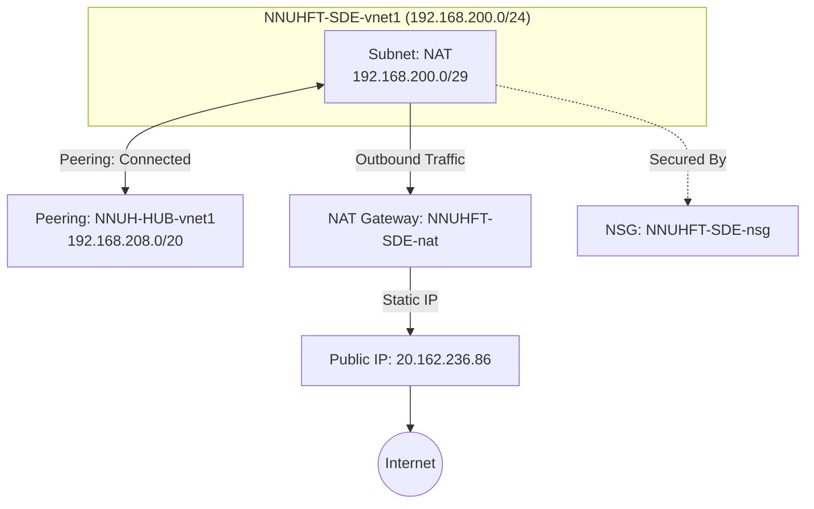

---

## [[Azure Infrastructure Inventory]]

### High-Level Overview

> [!INFO] Environment Details
>
> - Subscription: NNUHFT-SDE
> 
>   - Primary Location: UK South (London) 1*Public Egress IP: 20.162.236.86 2* Address Space: 192.168.200.0/24 3* Last Scan: 19 Nov 2025 4

### Resource Topology

---

### Resource Groups

#### 1. [[NNUHFT-SDE-Networking]]

**Purpose:** Core networking infrastructure. Contains the VNet, NAT Gateway, and Public IP.

##### **Virtual Network: [[NNUHFT-SDE-vnet1]]**

- **Address Space:** `192.168.200.0/24`
- **Peering Connection:**
  - **Remote VNet:** `NNUH-HUB-vnet1`
  - **Remote CIDR:** `192.168.208.0/20`
  - **Status:** `Connected` / `FullyInSync`
- **Subnets:**

| **Subnet Name** | **CIDR Range**     | **Usable IPs** | **Route Table** | **NAT Gateway**  |
| --------------- | ------------------ | -------------- | --------------- | ---------------- |
| **NAT**         | `192.168.200.0/29` | ~3 IPs*        | System Default  | `NNUHFT-SDE-nat` |

> [!WARNING] Capacity Note
>
> The NAT subnet is a /29. Azure reserves 5 IPs per subnet, leaving only 3 usable IP addresses for resources in this subnet.

##### **Public IP: [[NNUHFT-SDE-nat-ip]]**

- **IP Address:** `20.162.236.86`
- **Allocation:** Static
- **SKU:** Standard / Regional
- **Association:** Attached to NAT Gateway `NNUHFT-SDE-nat`

##### **NAT Gateway: [[NNUHFT-SDE-nat]]**

- **Idle Timeout:** 4 minutes (Default)
- **Scope:** Covers traffic for `NAT` subnet

##### **Network Security Group: [[NNUHFT-SDE-nsg]]**

- **Current State:** **Default Rules Only**
- **Inbound:** Allow VNet, Allow Load Balancer, Deny All Internet.
- **Outbound:** Allow VNet, **Allow Internet (Any)**.

---

### Action Items / Observations

1. **Subnet Sizing:** The `NAT` subnet is extremely small (`/29`). If you plan to deploy more than 3 Virtual Machines or Private Endpoints here, you will run out of IP addresses immediately.
2. **Security Posture:** The NSG has no custom rules. Outbound traffic is currently unrestricted to the entire internet
3. **Peering:** You have a healthy connection to the Hub VNet (`192.168.208.0/20`). Ensure firewall rules on the Hub side allow traffic from your new range (`192.168.200.0/24`).

## [[Azure Access & Identity Report]]

### Executive Summary

> [!INFO] Scope of Access
>
> - **Target Scope:** Subscription `NNUHFT-SDE` (Root Level)
> 
> - **Total Identities:** 11
> 
> - **Detected Roles:** [[Owner]], [[Contributor]]
> 
> - **Assessment Date:** 19 Nov 2025

### Role Capabilities

The file indicates that all users have **Subscription-level** access. This is the highest level of inheritance; these permissions trickle down to every Resource Group (e.g., `NNUHFT-SDE-Networking`) and every resource inside them.

#### 1. [[Owner]]

**Access Level:** `Superuser`

- **Capabilities:**
  - **Full Control:** You can create, read, update, and delete *any* resource in the subscription (VMs, Networks, Storage, Databases).
  - **User Management (The Key Difference):** You can assign permissions to *other* people. You can make someone else an Owner or revoke their access.
  - **Support Tickets:** You can raise support requests with Microsoft.
- **Security Note:** This is a highly privileged role. Owners effectively hold the keys to the entire kingdom.

#### 2. [[Contributor]]

**Access Level:** `Power User`

- **Capabilities:**
  - **Full Control:** Like the Owner, you can create, read, update, and delete any resource.
  - **Restriction:** You **cannot** grant access to others. You cannot change who has access to the subscription.
- **Use Case:** This is the standard role for DevOps engineers who need to build infrastructure but shouldn't be managing security governance.

---

### Identity Inventory

*Check your username below to confirm your specific role.*

#### Assigned Role: [[Owner]]

- **_Andy Abramowicz O365**
- **_Ben Goss O365**
- **_David Poulton O365**
- **_Garry Keen O365**
- **_Nathan Polley O365**
- **_Nathan Tilsley O365**
- **_Richard Tallowin O365**
- **_Ricky Semmens O365**
- **_Tom Brooks O365**

#### Assigned Role: Contributor

- **Leon Ormes**
- **Oliver Rushton**

---

### Security Observations

1. **High Number of Owners:** There are **9 Owners** on this subscription. Microsoft Best Practice usually recommends keeping Owners to a maximum of 3 (Service Admins + Break-glass account) to reduce the attack surface.
2. **Service Accounts:** The users prefixed with `_` (e.g., `_Andy...`) appear to be specific cloud-synced or administrative accounts. Ensure these are tied to specific individuals and not shared.
