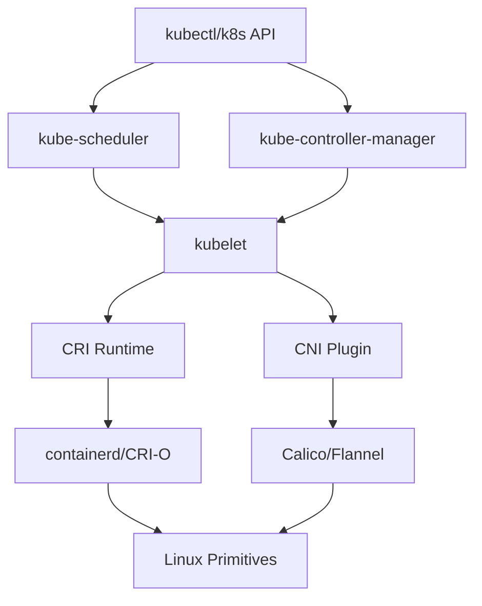

## Summary

A comprehensive map of the software layers that bridge raw Linux kernel primitives and production-grade container platforms. This covers the **Container Runtime Interface (CRI)**, the **OCI Standards**, and the orchestration logic that manages lifecycle, networking, and storage at scale.

## Context / Problem

While containers are built on Linux primitives (Namespaces, Cgroups), using these raw APIs manually is impractical for production.

- **The Gap:** Kernel primitives do not handle image distribution, persistent storage, or cross-node networking.
- **The Solution:** **Container Runtimes** abstract this complexity. They handle the "boring" work of setting up the environment so developers can focus on applications.
- **The Layering:** The ecosystem is split into **High-Level Runtimes** (containerd, CRI-O) which manage the lifecycle and images, and **Low-Level Runtimes** (runc, crun) which actually interact with the kernel to spawn processes. Understanding this distinction is vital for debugging and security.

## Structure

### 🏭 Runtime Interfaces

- **Container Runtime Interface (CRI)** - Kubernetes runtime abstraction (planned)
- **Container Network Interface (CNI)** - Network plugin specification (planned)
- **Container Storage Interface (CSI)** - Storage plugin specification (planned)

### ☸️ Kubernetes Components

- **kubelet** - Node-level container management (planned)
- **kube-proxy** - Service proxy and load balancing (planned)
- **CNI Plugins** - Calico, Flannel, Weave networking (planned)
- **CRI Runtimes** - containerd, CRI-O, Docker integration (planned)

### 🔄 Orchestration Patterns

- **Pod lifecycle management** - Creation, scheduling, termination (planned)
- **Service discovery** - DNS, ClusterIP, load balancing (planned)
- **Network policies** - Traffic control and security (planned)
- **Resource scheduling** - CPU, memory, affinity rules (planned)

## Key Architecture

## Runtime Architecture & Responsibilities

The runtime ecosystem is stratified to separate concerns (Image/Lifecycle vs. Kernel Execution).

### High-Level Runtimes (CRI Implementations)

*Examples: containerd, CRI-O*
- **Image Management:** Pulling images from registries, verifying signatures, and managing overlay filesystems (unpacking layers).
- **CRI Implementation:** Exposing the gRPC API that the Kubelet calls.
- **Lifecycle Orchestration:** Instructing the low-level runtime to start/stop containers.
- **CNI Coordination:** Invoking network plugins to set up the Pod sandbox.

### Low-Level Runtimes (OCI Runtimes)

*Examples: runc, crun, Kata Containers, gVisor*
- **Kernel Interaction:** Making the actual `clone()`, `unshare()`, and `cgroup` syscalls.
- **Isolation Enforcement:** Applying Seccomp profiles, AppArmor profiles, and dropping capabilities.
- **Process Execution:** Spawning the user process as `PID 1` inside the namespace.

### Kubernetes Components

#### Kubelet

- **Node Agent:** The primary "captain" of the node.
- **Pod Loop:** Ensures the running containers match the desired PodSpec.
- **CRI Client:** Calls the High-Level Runtime to execute actions.

#### CNI Plugins

- **Network Plumbing:** Creating veth pairs, assigning IPs (IPAM), and configuring bridges.

#### Kube-proxy

- **Service Abstraction:** Managing iptables/IPVS rules to route Virtual Cluster IPs to Pod IPs.

## Integration Points

### With Linux Primitives

- **Network namespaces** → Pod network isolation
- **veth pairs** → Pod-to-node connectivity
- **bridges** → Multi-pod same-node networking
- **iptables** → Service routing and network policies

### With Storage Systems

- **Volume mounts** → Persistent data access
- **CSI drivers** → External storage integration
- **EmptyDir/configmap** → Ephemeral and configuration data

## Debugging Layers

### Application Layer

- Container logs and processes
- Application connectivity issues

### Orchestration Layer

- Pod status and events
- Service endpoint configuration
- Network policy enforcement

### Runtime Layer

- CRI runtime logs
- CNI plugin execution
- Container filesystem inspection

### Kernel Layer

- Network namespace configuration
- iptables rule analysis
- Resource limit verification

## Connections to Other Areas

- **[[MOC - Container Networking Model]]** - Foundation for CNI understanding
- **[[MOC - Linux Container Primitives]]** - What runtimes automate
- **[[MOC - Hands-on Container Labs]]** - Practical debugging techniques

## Child Notes

### Existing Notes

- [[30_Library/200_projects/Containerisation/Containers Within a Pod Share Network Namespace and IP Address]] - Pod-level communication fundamentals
- [[Pods communicate across cluster using CNI-provided networking]] - CNI overview and network models
- [[Kubernetes Provides NodePort and LoadBalancer for External Service Access]] - External service access patterns
- [[Network policies control traffic flow between pods using labels and namespaces]] - Security and traffic control
- [[Kube-Proxy Implements Services Using Iptables or IPVS]] - Service implementation details
- [[CNI plugins provide different network models and features]] - Plugin comparison and selection
- [[Container Runtime Configures Pod Networking Through CNI Plugins]] - Runtime networking responsibilities
- [[etcd stores cluster network state and service configuration]] - Cluster state management
- [[Service mesh provides advanced traffic management and security for service communication]] - Advanced service communication
- [[Kubernetes networking components coordinate through a defined workflow]] - Component coordination
- [[Model - Linux to Kubernetes Networking Mapping]] - Runtime automation mapping

### Planned Additions

- What is the Container Runtime Interface (CRI)?
- What is the Container Network Interface (CNI)?
- How does kubelet invoke CNI plugins?
- What are common CNI plugins (Calico, Flannel, Weave)?
- How does kube-proxy implement Services?
- What is the Container Storage Interface (CSI)?
- How do container runtimes work (containerd, CRI-O)?
- What are Kubernetes network policies?
- How does Pod scheduling work?
- What are resource requests and limits?
