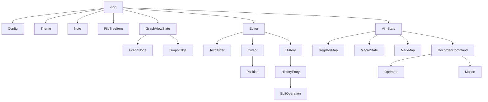

## Type Atlas: Ekphos

A data-oriented analysis of the type system, focusing on state ownership, dependency graphs, and the root state definition.

### 1. Root State

The **`App`** struct in `src/app/state.rs` acts as the single source of truth for the application. It aggregates all sub-systems (Editor, Vim, Configuration, Data).

#### `App` Ownership Tree

- **Data Model**
    - `notes`: `Vec<Note>` (All loaded notes)
    - `file_tree`: `Vec<FileTreeItem>` (Directory structure)
    - `sidebar_items`: `Vec<SidebarItem>` (Flattened view of file tree)
- **Core Components**
    - `editor`: `Editor` (The text editing engine)
    - `vim`: `VimState` (Vim emulation state)
    - `config`: `Config` (User settings)
    - `theme`: `Theme` (UI styling)
- **UI State**
    - `mode`: `Mode` (`Normal` | `Edit`)
    - `focus`: `Focus` (`Sidebar` | `Content` | `Outline`)
    - `dialog`: `DialogState` (Active modal overlay)
    - `graph_view`: `GraphViewState` (Force-directed graph node data)
    - `content_items`: `Vec<ContentItem>` (Parsed view of current note for rendering)
    - `outline`: `Vec<OutlineItem>` (Table of contents)

### 2. Type Definitions & Dependency Graph

#### Core Data & Editor (`src/editor/`)

The Editor uses a Gap Buffer for efficient text manipulation.

| Type | Definition | Dependencies | Description |
|:--- |:--- |:--- |:--- |
| **`Editor`** | `struct` | `TextBuffer`, `Cursor`, `History`, `WrapCache`, `Style` | The main editor component. Owns the buffer and editing state. |
| `TextBuffer` | `struct` | `Vec<String>` | **Line-based Gap Buffer**. Split into `before` and `after` vectors. |
| `Cursor` | `struct` | `Position`, `Selection` | Tracks cursor position and active selection. |
| `Position` | `struct` | `row: usize`, `col: usize` | Simple coordinate type. |
| `History` | `struct` | `VecDeque<HistoryEntry>` | Undo/Redo stack. |
| `HistoryEntry` | `struct` | `Vec<EditOperation>`, `Position`, `Instant` | A discrete undoable action. |
| `EditOperation`| `enum` | `Position`, `String` | Atomic changes (`Insert`, `Delete`, `SplitLine`, etc.). |

#### Vim Subsystem (`src/vim/`)

Implements a state machine independent of the App, though `App` owns `VimState`.

| Type | Definition | Dependencies | Description |
|:--- |:--- |:--- |:--- |
| **`VimState`** | `struct` | `VimMode`, `RegisterMap`, `MacroState`, `MarkMap` | Holds all Vim-related persistent state. |
| `VimMode` | `enum` | `Operator` | Detailed mode (e.g., `OperatorPending`, `Search`, `Visual`). |
| `RegisterMap` | `struct` | `HashMap<char, RegisterContent>` | Stores yanked/deleted text. |
| `MacroState` | `struct` | `HashMap<char, Vec<KeyEvent>>` | Recorded macro sequences. |
| `RecordedCommand`| `struct` | `Operator`, `Motion` | A partially or fully formed command for dot-repeat (`.`). |

#### App State & UI (`src/app/state.rs`)

| Type | Definition | Dependencies | Description |
|:--- |:--- |:--- |:--- |
| `Note` | `struct` | `String`, `PathBuf` | A single markdown file loaded into memory. |
| `GraphViewState`| `struct` | `Vec<GraphNode>`, `Vec<GraphEdge>` | State for the physics-based graph renderer. |
| `ContentItem` | `enum` | `String` | Parsed markdown element (Line, Image, CodeFence) for the view. |
| `WikiAutocompleteState`| `enum` | `Vec<WikiSuggestion>` | State for `[[link]]` popup logic. |

#### Dependency Graph (Ownership)

### 3. Key Observations

1. **Monolithic State**: The `App` struct is a classic "god struct" that owns almost everything. This simplifies state management (no complex lifetime borrowing across modules) but means `App` is passed mutably to almost every update function.
2. **Duplicated Vim Mode**: There is a `VimMode` enum in `src/app/state.rs` (simple: Normal, Insert, Visual) and a more complex `VimMode` in `src/vim/mode.rs` (includes OperatorPending, Search, etc.). `App` uses the simple one for high-level UI logic and `VimState` uses the complex one for internal logic.
3. **Gap Buffer**: The text buffer implementation (`src/editor/buffer.rs`) is line-based. It uses `before: Vec<String>` and `after: Vec<String>` to represent lines above and below the "gap" (the current editing line). This is optimized for vertical movement and single-line edits.
4. **No References**: The codebase heavily relies on owning data (`String`, `Vec`, `PathBuf`). Lifetimes are rarely used in struct definitions, indicating a "clone-heavy" or "ownership-passing" architecture typical of terminal apps to avoid borrow checker complexity.
