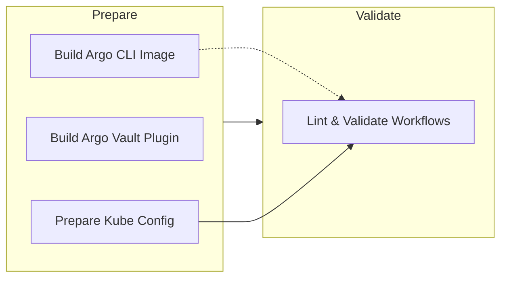
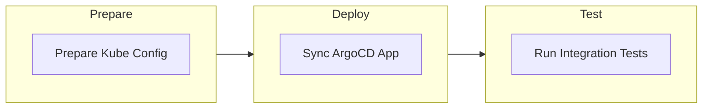

1. **Main Pipeline (`.gitlab-ci.yml`): "** Focuses on \"Continuous Integration\" \u2014 building artifacts (Docker images) and validating code/workflows."
2. **Staging/Deploy Pipeline (`staging.gitlab-ci.yml`): "** Focuses on \"Continuous Deployment\" \u2014 synchronizing state via ArgoCD and executing integration tests."
The FITFILE platform utilizes **GitLab CI/CD** to orchestrate the software delivery lifecycle. The process is split into two primary pipelines: ""

## 2. Pipeline Architecture

### A. Main Pipeline (`.gitlab-ci.yml`)

*Trigger: Push to default branch or Merge Requests.*

This pipeline ensures that changes to the repository result in valid, buildable artifacts.

**Key Jobs:**

- `build_argo_cli`: Builds `fitfile/argocli:alpine` and pushes to Docker Hub.
- `build_argo_vault_plugin`: Builds the AVP sidecar image and pushes to Azure Container Registry (ACR).
- `lint_workflows`: Templates Helm charts and validates Argo Workflow YAML syntax.

### B. Staging Deployment Pipeline (`staging.gitlab-ci.yml`)

*Trigger: Manual or Auto-deploy to Staging Environment.*

This pipeline actuates the deployment and verifies it.

**Key Jobs:**

- `sync_argo_app`:
    1. Decodes environment-specific values (`STAGING_VALUE_OVERRIDES`).
    2. Authenticates with **ArgoCD** (`testing-argocd.fitfile.net`).
    3. Triggers a hard sync of the `testing` application.
- `run_integration_tests`:
    1. Submits the `all-integration-tests` Argo Workflow.
    2. Waits for completion and reports pass/fail status.

---

## 3. Infrastructure & Connectivity

The CI/CD runners interact with a diverse set of external infrastructure components.

| Component | Endpoint / Resource | Purpose |
|:--- |:--- |:--- |
| **Cluster** | `Fitfile-cloud-testing-aks-cluster` | Target AKS cluster for staging. |
| **GitOps Engine** | `testing-argocd.fitfile.net` | ArgoCD instance managing deployment state. |
| **Workflow Engine** | `testing-argo-workflows.fitfile.net` | Orchestrator for integration tests. |
| **Artifact Store** | Docker Hub | Public registry for CLI tools. |
| **Private Registry** | Azure Container Registry (ACR) | Private registry for internal tools (AVP). |

---

## 4. Security & Secrets

Pipelines operate with high privileges. Credentials are injected via GitLab CI Variables.

| Variable Name | Purpose | Security Scope |
|:--- |:--- |:--- |
| `AZ_CLIENT_ID` / `SECRET` | Service Principal for Azure/AKS auth. | **Critical:** Grants cluster admin access. |
| `ARGOCD_STAGING_USER/PASS` | ArgoCD Authentication. | **Critical:** Allows deployment modification. |
| `DOCKER_HUB_DEPLOY_TOKEN` | Docker Hub push access. | High. |
| `ACR_SERVICE_PRINCIPLE` | ACR push/pull access. | High. |

---

## 5. Deployment Logic

### The "Sync" Mechanism

The deployment is **GitOps-driven** but **CI-triggered**.

1. GitLab CI generates the specific configuration (values.yaml).
2. It *pushes* this configuration to ArgoCD (via API/CLI).
3. ArgoCD *pulls* the charts and applies them to the cluster.

### The "Test" Mechanism

Testing is not just a script; it is a **Workflow**.

1. GitLab CI submits a workflow manifest to the cluster.
2. The cluster executes the tests (pods spinning up/down).
3. GitLab CI polls the workflow status for success/failure.

---

## 6. Related Documentation

- [[SoT - FITFILE Deployment Process]] - The high-level process map.
- [[SoT - FITFILE Secret Management Architecture]] - How secrets are handled within these deployments.
