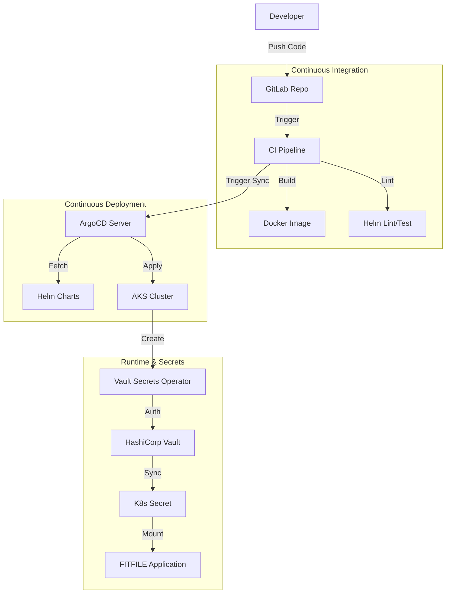

## 1. The High-Level Flow (From Commit to Cloud)

The deployment process is a hybrid **CI-Driven GitOps** workflow. It combines the automation of GitLab CI with the state reconciliation of ArgoCD.

---

## 2. Key Components & SoTs

To understand the deployment, you must understand its three pillars:

### A. The Pipelines (The Mover)
*How code gets there.*
-   **Core Note:** [[SoT - FITFILE CI/CD Pipelines]]
-   **Mechanism:** GitLab CI builds images and triggers ArgoCD.
-   **Key Phases:** `Prepare` (Auth), `Deploy` (Sync), `Test` (Integration Workflows).

### B. The Architecture (The Structure)
*Where code lives.*
-   **Core Note:** [[SoT - FITFILE Platform Components]]
-   **Infrastructure:** Azure Kubernetes Service (AKS).
-   **Orchestrator:** ArgoCD App-of-Apps pattern.
-   **Networking:** Nginx Ingress Controller with rigid Proxy Allow Lists.

### C. The Secrets (The Keys)
*How it accesses data.*
-   **Core Note:** [[SoT - FITFILE Secret Management Architecture]]
-   **Mechanism:** **Vault Secrets Operator (VSO)**.
-   **Rule:** No hardcoded secrets. Values files define *pointers* (Vault Paths), and VSO materializes them at runtime.

---

## 3. The Deployment Lifecycle

### Phase 1: Infrastructure Provisioning (Terraform)

Before any app deployment, the bedrock is laid via Terraform.

-   **AWS/Azure Resources:** VPCs, AKS Clusters, Databases.
-   **Repository:** `fitfile/infrastructure` (or similar).
-   **Key Doc:** [[terraform-helm-fitfile-platform]]

### Phase 2: Application Configuration (Helm)

Applications are packaged as Helm charts.

-   **Umbrella Chart:** `charts/ffnode` acts as the standard deployment unit.
-   **Configuration:** Customer-specific configuration lives in `ffnodes/fitfile/{customer-env}/values.yaml`.
-   **Key Doc:** [[FFNODE as Umbrella Chart]]

### Phase 3: The Deployment Trigger (GitLab CI)
1.  **Change:** A merge to `master` or a manual trigger on `staging`.
2.  **Pipeline:** Executes `.gitlab-ci.yml`.
3.  **Sync:** The pipeline contacts ArgoCD to force a synchronization of the application state.

### Phase 4: Runtime Reconciliation (ArgoCD & VSO)
1.  **ArgoCD:** Detects the change in Helm values/charts and applies manifests to AKS.
2.  **VSO:** Detects new `VaultStaticSecret` resources. It authenticates with Vault, fetches the secret data, and creates the Kubernetes `Secret`.
3.  **Kubernetes:** Starts the Pods. The Pods mount the secrets and begin operation.

---

## 4. Troubleshooting & Verification

### Verification Steps
1.  **ArgoCD UI:** Check for "Synced" and "Healthy" status.
2.  **Pipeline Logs:** Check the `run_integration_tests` job output in GitLab.
3.  **Cluster Check:** `kubectl get pods -n {namespace}`.

### Common Failure Modes
-   **Secret Sync Failure:** VSO cannot auth with Vault. Check `VaultAuth` resource. (See [[SoT - FITFILE Secret Management Architecture#4. Standardization Action Plan]])
-   **Integration Test Fail:** The Argo Workflow failed. Check workflow logs via Argo UI.
-   **Image Pull Error:** ACR credentials invalid or image missing.

---

## 5. Related Indexes
-   [[Comprehensive Deployment Index]] - The master list of all deployment resources.
