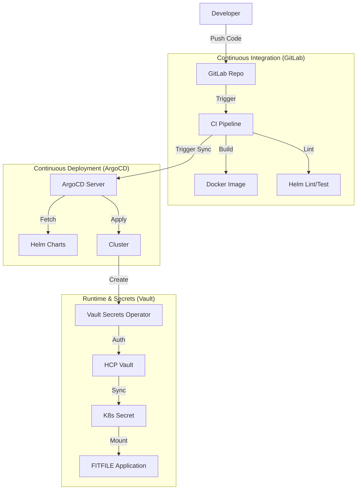

## 1. Executive Summary

The FITFILE platform utilizes a **Three-Tier Deployment Architecture** optimized for security, scalability, and high-velocity updates via GitOps. A unique **Deployment Key** (e.g., `WM-Prod`) serves as the primary identifier across all layers, ensuring consistency from Vault secrets to cloud resource naming.

1. **Infrastructure Layer:** Cloud resources (EKS/AKS) with strictly private networking.
2. **Platform Layer:** Management tools (ArgoCD, Vault integration, Ingress) that form the "Cluster OS."
3. **Application Layer:** FITFILE microservices deployed as a unified unit.

---

## 2. Security by Design (Invariants)

The deployment process is built on a "Secure-by-Default" foundation:

- **Private Networking:** No public endpoints for cluster APIs or administrative interfaces.
- **Identity-Centric Access:** Managed identities (Azure) or IAM/SSM (AWS) for infrastructure access.
- **Centrally Managed Secrets:** Zero secrets in Git; all credentials reside in HCP Vault and are marked as `sensitive` in Terraform.
- **Authenticated Ingress:** Application-level authentication is offloaded to Auth0.
- **Controlled Access:** All administrative operations are conducted via a secure Jumpbox.

---

## 3. The High-Level Flow (From Commit to Cloud)

The process is a hybrid **CI-Driven GitOps** workflow.

---

## 3. Core Architectural Patterns

### 3.1 ArgoCD "App of Apps"

We do not deploy services individually. A single **Root Application** (pointing to the `ffnode` umbrella chart) manages multiple child applications.

- **The Filter:** Environment-specific `values.yaml` files use feature flags (`deploy.mongodb: true`) to determine the cluster state.
- **Consistency:** Ensures the entire stack versioning is managed as a single logical commit.

### 3.2 Secret Flow (Zero-Git Strategy)

Secrets are never stored in plain text or encrypted within Git.

- **Source:** HashiCorp Vault (HCP).
- **Bridge:** Vault Secrets Operator (VSO) or External Secrets Operator (ESO).
- **Outcome:** Secrets are injected directly into Kubernetes `Secret` resources and mounted into Pods at runtime.

### 3.3 Private Access & Networking

- **Zero Public Endpoints:** Cluster APIs and administrative interfaces are blocked from the internet.
- **Secure Tunneling:** All `kubectl` and administrative access must route through a **Jumpbox** or AWS SSM/Azure Serial Console.
- **Policy Enforcement:** Network isolation is enforced via **Calico** (Layer 3/4) and Ingress controllers (Layer 7).

---

## 4. Platform Components

| Category | Component | Description |
|:--- |:--- |:--- |
| **Compute** | EKS / AKS | Managed Kubernetes clusters. |
| **Storage** | MongoDB / Postgres | Persistent data stores. |
| **Messaging** | RabbitMQ / Redis | Inter-service communication. |
| **Ingress** | NGINX | Layer 7 traffic routing and TLS termination. |
| **Identity** | Auth0 | Application-level authentication. |
| **Monitoring**| Grafana / Loki | Full-stack observability and log aggregation. |

---

## 5. Deployment Lifecycle (Summary)

1. **Phase 1: Foundation & Tooling** (Secrets, Identity, Monitoring).
2. **Phase 2: Core Infrastructure** (VPC, Clusters, Networking).
3. **Phase 3: Platform Services** (ArgoCD, Ingress, VSO).
4. **Phase 4: Application Layer** (FFNode stack).

For detailed execution steps, see the **[[MOC - FitFile Deployment]]**.
